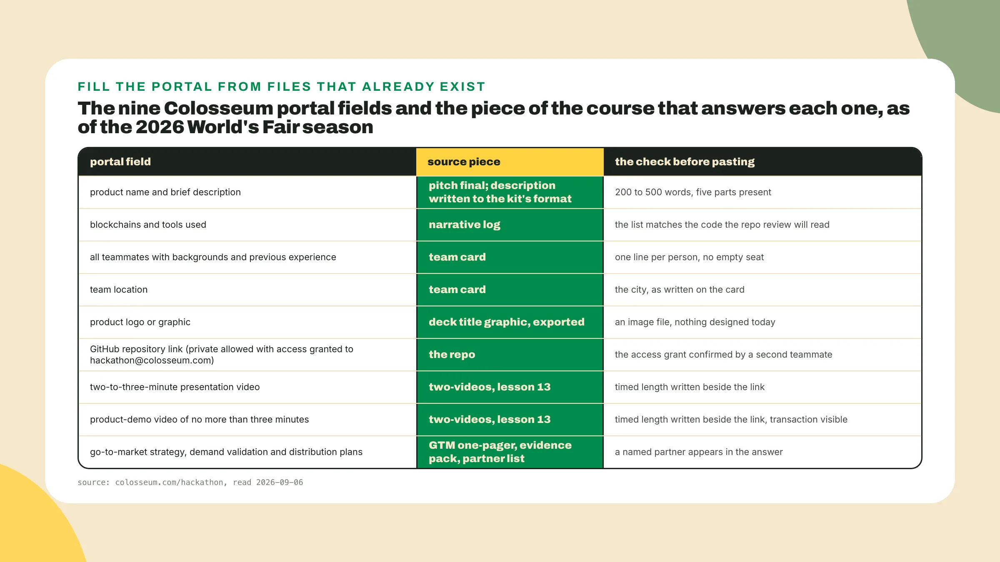
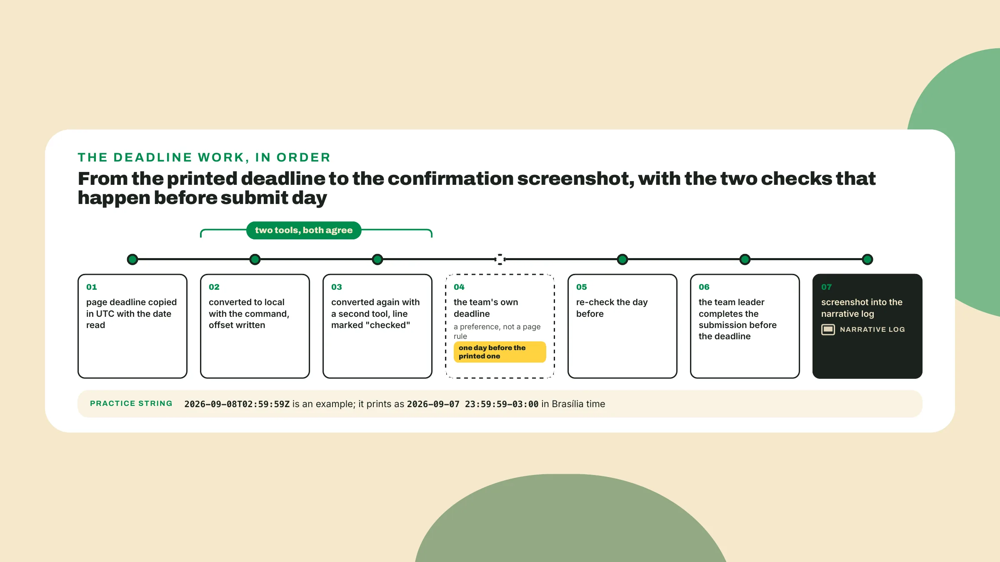
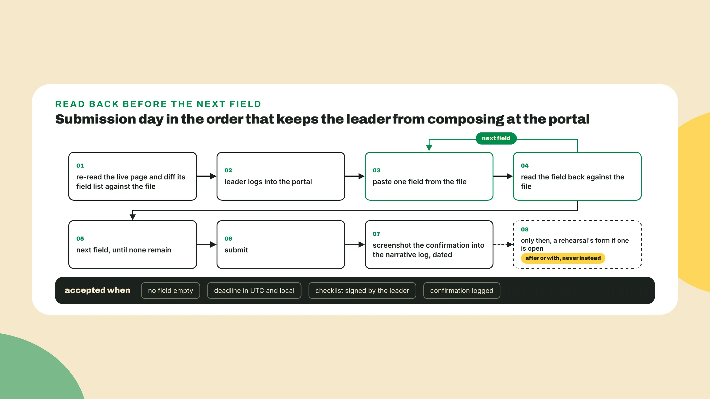
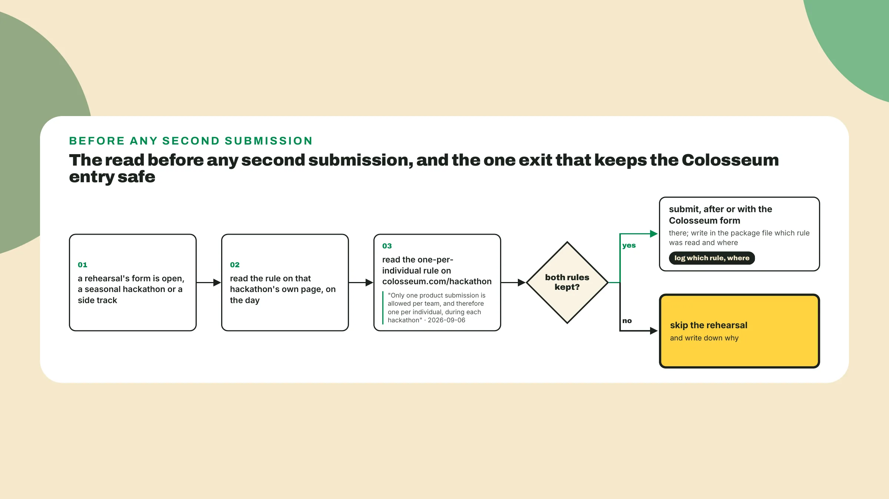

# The form, the deadline, the rules

Last lesson you recorded both videos inside their limits, the presentation between two and three minutes and the demo at three or under with the transaction confirming on screen, and you logged feedback round 4. **Keep both links** where you can reach them. This is the capstone: it ends with a submitted package and a screenshot with a date on it, *and nothing gets recorded today*.

## Why this matters

Every season, teams with a working product **lose on a form**. A deadline converted in the wrong direction. A second submission from a teammate that breaks the one-per-person rule. A demo video that never made it into its field. A private repo nobody gave the reviewer access to. None of that is in the judging criteria. All of it is in the rules, on the same page as the seven factors, *a few paragraphs further down where fewer people read*.

The person that opens your submission first is not scoring Founder + Market Fit, they are checking that the video is there, that the repo opens, that the team has names on it. **Completeness is the one line** on this whole page a team controls fully. So today you **read the rules** the way you read the judging criteria in lesson 2, as the exact list of what gets checked, and you submit the way you would ship a release, *against a checklist written before the work starts*.

## Do this

1. **Assemble the package** before you open any portal. Make a file called submission-package.md at the root of the toolkit repo and put **one line per piece you built** in it, with the path of the artifact and its date, *from memory first and then corrected against the repo*:

```text
submission-package.md, opened 2026-10-05
Colosseum brief (the seven factors, deadline line, disqualifiers) path, date
team card, month plan, pitch v0                                  path, date
idea memo, competitor map, evidence pack, decision memo          path, date
scope card, demo script, devnet slice, narrative log             path, date
GTM one-pager, partner list                                      path, date
deck, both exports                                               path, date
presentation video (2 to 3 min), demo video (3 min or less)      link, timed length
portal answers                                                   this file, below
```

If a line has no path, **that piece is missing**, and *today is the day you finish that piece and not submission day*. Everything below assumes every line is filled.

2. **Answer the Colosseum portal**, all nine fields, from the file and in the page's order. Colosseum's portal, as of the 2026 World's Fair season, asks for nine things, and the page that lists them is colosseum.com/hackathon, the same page your Colosseum brief quotes. **Copy them into the package file** in the page's words before you answer any of them:

```text
portal fields, colosseum.com/hackathon, read 2026-09-06
1  product name and brief description
2  blockchains and tools used
3  all teammates with backgrounds and previous experience
4  team location
5  a product logo or graphic
6  GitHub repository link (private allowed if access is granted to hackathon@colosseum.com)
7  a two-to-three-minute presentation video
8  a product-demo video of no more than three minutes
9  go-to-market strategy, demand validation and distribution plans
```

If the live page shows a different list on the day you copy it, **the page wins**, and write down what changed. Each field is fed by a piece you already built. The product name is the one product word in the pitch final, the word that comes after the problem. Blockchains and tools come from the narrative log, named exactly as the log names them and nothing the build did not use, *because the repo review reads the code and the two lists should agree*. Teammates come from the team card, one line each with the background and the previous experience, and **no empty seat**. Location is the team card's city.

The logo is the deck's title graphic exported as an image, and *nothing gets designed today*. The repository link is the field with **a second person in it**: if the repo is private, one teammate grants access to hackathon@colosseum.com and another confirms it by reading the repo's access list. The presentation video is the **2 to 3 minute** file from last lesson, the demo video is the one at 3 minutes or less, and both go in as links with the timed length written beside them.

The last field is **three questions in one box**. Go-to-market strategy is the one-pager. Demand validation is the evidence pack, the conversations from week 1 and whatever traction the month produced. Distribution plans are the partners named in the partner list, and *a partner that replied, even with a no, is a better line than a partner category*. For Fiado the tools line reads Solana, devnet, the agent tool and the kit skills as the narrative log names them, and the description and the GTM answer are **the two fields left blank** for you to write in the same shape.

The description is **written to a format**, and a pasted slide does not scan. The kit's hackathon skill carries one: a tagline, the problem, the novel thing in bold, a part titled 'What works today', and why Solana, in **200 to 500 words**, scored against the kit's own judging-criteria.md. That is what the skill said at github.com/solanabr/solana-ai-kit on 2026-09-06. Verify against the kit's current README before you use it, *since a skill file moves faster than a lesson*.

The same skill picks a track by how crowded each one is on the live portal, through the kit's ext/colosseum with a COLOSSEUM_COPILOT_PAT set in the environment, read on 2026-09-06, and that part depends on the current README more than the format does, so **read it fresh on the day**.

```text
description, written to the kit's hackathon skill format (verify against the current README)
tagline:            one line, what it is, in the user's words
problem:            who has it and what it costs them, from the evidence pack
**the novel thing** one sentence in bold, the insight from the decision memo
What works today:   the slice, exactly what the demo video shows, nothing planned
why Solana:         the paragraph from the GTM one-pager
length: 200 to 500 words. scored against judging-criteria.md in the kit.
```

That order is the order a reviewer reads in. 'What works today' is **the honesty line**, the one the repo review checks against the code, so it lists exactly what the demo video shows and nothing that is planned. Put the technology there, in plain words, *after the reader has a reason to want it*.



3. **Convert the deadline with a tool**, *never in your head*, and write both results in the package file next to each other. The string to practice on is made up, but the shape is the one every page prints: a date, a T, a time, and a Z that means UTC.

```bash
python3 -c "from datetime import datetime, timezone; d = datetime.fromisoformat('2026-09-08T02:59:59+00:00'); print(d.astimezone(timezone.utc)); print(d.astimezone())"
```

On a laptop set to Brasília time the two lines print as 2026-09-08 02:59:59+00:00 and **2026-09-07 23:59:59-03:00**. The page says the eighth. Your calendar says **the seventh**, one second before midnight. A team that put "the 8th" in a group chat and planned to submit on the morning of the 8th *has already lost, with a working product and a good video*. The +00:00 in the command is the trailing Z written out, and on **Python 3.11 or newer** the Z works on its own, so on an older machine keep the long form.

For Colosseum the string comes from your Colosseum brief. Lesson 2 copied the season's end date from the live page, and as of 2026-09-06 the hour was the part the page had not printed, *so the brief holds a slot for it*. In the final week, re-read colosseum.com/hackathon, **paste the hour the page prints** into the command, and write the local result on the deadline line beside the UTC original.

Then convert a second time with a different tool, a phone's world clock is enough, and only when both agree does the line get the word "checked" after it. **Write the leader's name** on that same line, since the page says the team leader must complete the submission before the deadline. My own rule, *a preference and not a page rule*, is to set the team's deadline **a full day before** the printed one, so the last day is for the screenshot and not for the form.



4. **Read the four disqualifiers** and sign them. From the page, read on 2026-09-06, in its own words for the first one:

> 'Only one product submission is allowed per team, and therefore one per individual, during each hackathon' (colosseum.com/hackathon, 2026-09-06).

**One product per team**, and so one per person. The way teams break this without meaning to is **the second account**: a teammate registers on their own to "be safe", or submits a side experiment under their own name, and now one individual has two submissions in the season. Nobody on the team submits anything else, and *the leader is the only person that presses the button*.

Second, **the team leader completes the submission** before the deadline, so the leader is named in the file, on the deadline line where the name already sits. Third, the page says **misrepresenting the development history** can disqualify, so prior code gets disclosed in the submission, in 'What works today' or wherever the form gives you room, copied from the narrative log where the honest version already lives, dated. Fourth, access. A private repo without access granted to hackathon@colosseum.com is a repo the reviewer cannot open, and my reading, *which the page does not spell out*, is that a repo nobody can open is **scored as no repo**.

```text
disqualifier checklist, colosseum.com/hackathon, read 2026-09-06
[ ] one product from this team, and nobody on it submits another      signed: leader
[ ] prior code and development history disclosed in the submission     signed: leader
[ ] the leader completes the submission before the deadline            signed: leader
[ ] repo access granted to hackathon@colosseum.com, confirmed by a second teammate
```

The leader signs three and a second teammate signs the fourth, and the file is not a checklist **until the names are on it**. A checklist nobody signed is *a list of things somebody hoped were true*.

5. **Submit**, in a fixed order. **Open the live page** one last time and compare its field list with the one in your file, *since a portal that adds a field between the day you copied it and submission day is not a thing this lesson can rule out*, and a field you never saw is a field left empty.

Then the leader logs into the portal, pastes each answer from the file, **reads each field back** against the file before moving to the next one, submits, and screenshots the confirmation into the narrative log with the date. Off-season, when no portal is open, the mock form is **this same file**: the fields in the page's order, nothing blank, and the leader's name and the date on the last line *in place of the screenshot*.



6. **Run the same package** through a rehearsal if one is open, *after or with the Colosseum form and never instead of it*. Two kinds can receive it: a seasonal hackathon, on its own platform in a window that sits before a Colosseum season, and a side track, a regional prize attached to the Colosseum season. Either will have its own page with its own deliverables and deadline, so **read that page the day you decide to enter** and reuse the package you already have. Editions and dates are read from the live page each time.

So the method is one sentence: open its page, **copy its deliverables and its deadline** into the package file with the date, answer its questions, and paste the rest. **Do not rebuild the package** for it and do not write a second description. Before any second submission, read the rule on that hackathon's own page and the one-per-individual rule on the Colosseum page, on the day, and write in the package file which rule you read and where. If the two rules cannot both be kept, **skip the rehearsal** and *write down why*.



## Done when

- **No portal field is empty**, and every answer in submission-package.md points at a piece you built.
- The **deadline line** shows UTC and local, agreed by two tools, marked "checked", with the leader's name.
- The **disqualifier checklist** is signed, three boxes by the leader and the fourth by a second teammate.
- A **confirmation**, real screenshot or mock form line, is in the narrative log with the date.
- If a rehearsal form was open, its **deliverables, deadline and rule** are in the package file too.

## Watch out

- **Converting the deadline once** and trusting it. A conversion done a month early by a teammate who has since changed time zones is the line most likely to be wrong, *so re-check the day before*.
- A description that **starts with the technology**. "A Solana program using PDAs to store..." reads like nothing to a reviewer who does not yet know the problem.
- **Entering a rehearsal by reflex**, which happens when its rules live in a chat and not in the file, *so copy the page, not the summary*.
- The tradeoff: a rehearsal **costs a second form** and can collide with the one-product-per-individual rule if it is itself a Colosseum track, *so skip a rehearsal rather than break a rule*.

## The takeaway

The rules sit on the same page as the judging criteria, a few paragraphs down, and they are **the part a team controls fully**: every field filled from a file that already exists, a deadline converted by two tools and written in both zones, one product per person, and the leader pressing the button with a day in hand. *The presentation video is the field a judge opens first, and the one-per-individual rule is the one that disqualifies a team nobody warned.*

## Next

The capstone is done when the confirmation is in the log, the last artifact the course's promise asked for. Next lesson's first action is **a file called next-season-plan.md** next to this package, with two sentences copied from the live page about what happens once submissions close, the 15-minute interview a smaller group is invited to and the announcement roughly a month after the deadline. From there it walks *why a lost pitch is not a lost project*.

You are ending the month with **a package a judge can open**, a form nobody composed at the portal and a screenshot with a date on it. Keep the screenshot, because a month from now, whatever the winners page says, *it is the proof that the form did not beat you*.
