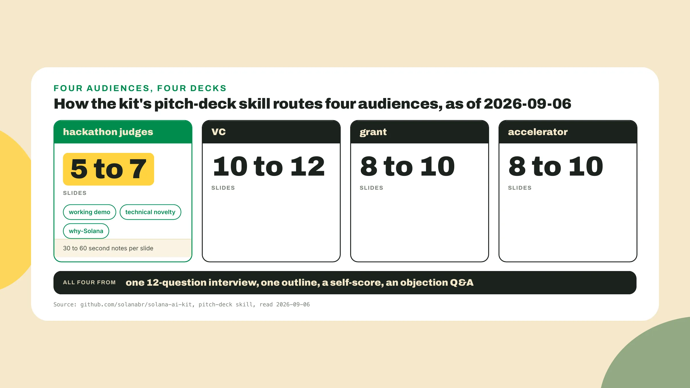
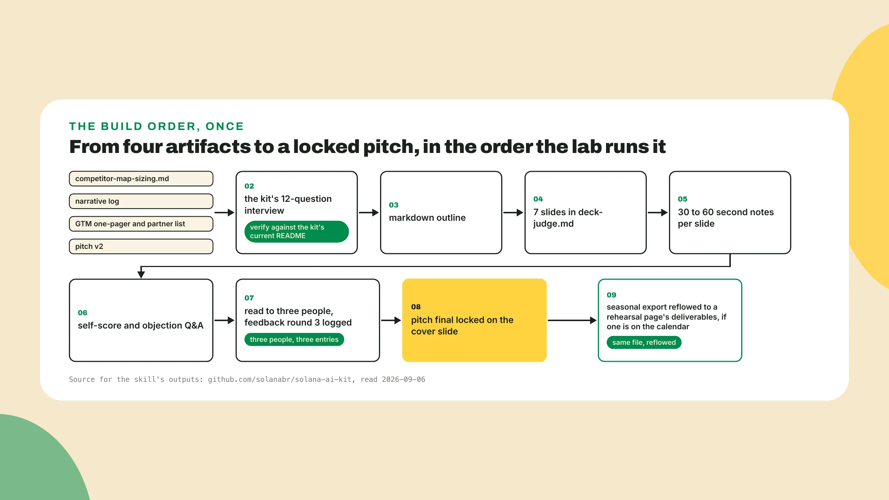
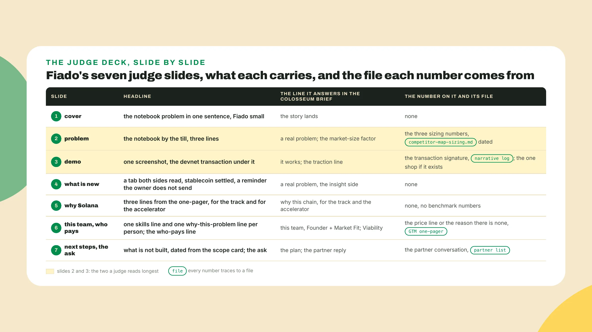
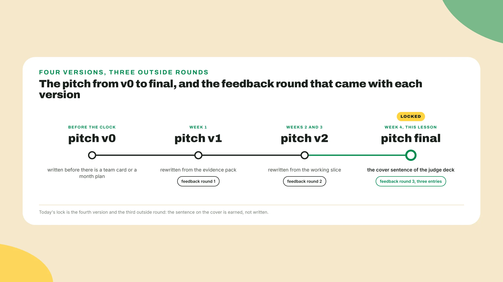

# The hackathon deck, not the investor deck

Last lesson you wrote the GTM one-pager, argued why-Solana for the track and for the accelerator, and logged one partner reply. Keep the one-pager open, and open the narrative log and competitor-map-sizing.md beside it, because those three files are **the deck already**, in the wrong shape.

## Three minutes and two beliefs

Your package is one tab among many and a judge gives it **about three minutes**. In those minutes the judge has to understand a real problem and come to believe this is the team that will solve it. The winners I watched had the most compelling presentation in the room, and some had less code than the teams that placed under them, because *a problem that needs solving sold the right way beats features*.

So the deck is **built from the problem outwards**, and the first thing to build is the order. Open a new file called deck-judge.md, put the date on the first line, and write **seven headings** under it, one per line. Everything else today goes under those seven lines.

## Do this

1. **Write the seven headings**. For Fiado, started on 2026-10-05, the file reads:

```text
deck-judge.md, Fiado, Colosseum World's Fair season, started 2026-10-05
1 cover        the problem in one sentence, the product name small
2 problem      the notebook by the till, and how many tills
3 demo         the tab on devnet, the transaction a judge can open
4 what is new  what the slice does that the notebook and the bank app do not
5 why Solana   for the track and for the accelerator
6 this team    who we are, why this problem, and who pays
7 next steps   what is not built yet, and the ask
```

One decision is made: *the product's name does not show up until the problem has been said*.

2. **Check the shape against the kit** before filling it. A judge deck is **5 to 7 slides**, one of them a working demo, one the technical novelty, one why-Solana, with speaker notes of 30 to 60 seconds on every slide. That is how the kit's pitch-deck skill routes the hackathon-judges audience, read on 2026-09-06, and the same skill routes a VC audience to 10 to 12 slides and a grant or an accelerator audience to 8 to 10.



3. **Run the kit's 12-question interview** with the four files open: competitor-map-sizing.md, the narrative log, the one-pager with the partner list, and pitch v2. **Verify the invocation** and the question list against the kit's current README first, *because this lesson is dated*. Every answer is a copy from one of those files, and a question none of them can answer either belongs to a VC deck or is *a hole in the package found before a judge found it*. The skill writes a markdown outline, then slides with their notes, then a self-score and an objection Q&A. **Keep the outline**, not its slides yet, and read the self-score as a first pass, not a score.



4. **Fill the cover** and the problem slide. The cover is one sentence, and **the sentence is the problem**, with the product name small in a corner. For Fiado: a shop owner keeps forty open tabs in a paper notebook, and the notebook gets lost. That sentence is v2 until step 11.

The problem slide **gets the most time**: three short lines on what happens, for Fiado the notebook by the till, it gets wet or lost or a regular moves away with a balance open, and the owner chases forty small debts herself. Under those lines, one line of numbers: **the three sizing numbers** from competitor-map-sizing.md, each with its source and the date it was read. On the judge deck *the market lives here and nowhere else*.

5. **Fill the demo** and the what-is-new slide. Demo is **one screenshot** of the tab screen from the narrative log, with the devnet transaction signature under it *so a judge can open it*. If the one shop from the Colosseum brief is on the tab by now, its name goes here as the traction line. If not, the slide says devnet and stops. What is new is **the technical novelty in three lines**, the thing the slice does that the notebook and the bank app do not: for Fiado, a tab both sides can read, that settles in a stablecoin, with a reminder the owner does not have to send herself. No architecture diagram here.



6. **Fill why Solana** and the team slide. Why Solana is last lesson's paragraph **cut to three lines**, one for the thing the slice does, one for what the chain makes easier about it, one for the accelerator, with no benchmark numbers.

The team slide answers **Founder + Market Fit**. On the Colosseum page read on 2026-09-06 that factor asks whether the team has the right skills and experience for this market and why it is motivated to solve this problem, so each person gets one line of what they can do and one line of why this problem. For Fiado the second line is *the person who has stood behind that till and watched the notebook get wet*. Under the team, one line: **who pays**, copied from the one-pager, or the reason there is no price yet. That is the Viability answer.

7. **Fill next steps and the ask**. The next-steps slide says **what is not built yet**, dated, in the order you would build it, and it is *the honest place for the architecture you did not build*. For Fiado that is the tab program that puts the opening amount and the due date on-chain beside the payments, the fiat rails, wallet onboarding, and then the cooperative rollout, the things the scope card cut in week 2. A judge reads an unbuilt feature here as a plan and the same feature on the demo slide as a lie.

Then **the ask in one line**: for Fiado the accelerator, and one introduction to a second cooperative, named, with the partner reply from last lesson as proof there is a first one. **Read the seven out loud** with a timer and write the time on the file's first line.

8. **Write the notes**, 30 to 60 seconds a slide, as spoken sentences. A note that is a bullet list gets read in the flat voice people use for lists, and *the problem slide dies in that voice*. Fiado's problem-slide note runs **about thirty seconds**: the notebook by the till, about forty names with a running total, the day it got wet, and the three numbers on the screen with the pages they came from. The kit's draft is usually longer, so cutting is most of the work.

9. **Write the objection Q&A**: the questions a judge is going to ask, each with a one-line answer, written before anyone asks. **Four is enough** for a first list. Fiado's, on 2026-10-05, reads:

```text
objections.md, Fiado, 2026-10-05
why not the bank's own app          the bank does not know the regular, the shop does, and the tab is between those two
what if the owner loses the phone   the tab is not on the phone, a new phone reads the same tab
who pays                            the who-pays line from the one-pager, said in one breath
why a chain at all                  the why-Solana line from slide 5, without the word fast in it
```

Write yours before the feedback round, *because the three people are going to ask two of these anyway*.

10. **Run feedback round 3**: the deck read out loud to three people who have not seen it. One has the problem, a shop owner for Fiado and for you whoever your first 100 users are. One is a builder. One knows nothing about either, and *that is the one who tells you whether slide 2 works*.

After the read, ask each to say the problem in one sentence and write down the sentence they said, *not the one you meant*. **Log three entries**: who, what they said, what changed. If **two of the three** land close to the cover, the pitch is final. If not, rewrite the problem slide and read it again the same day, and it is still round 3, with more than three entries.

11. **Lock pitch final**. It is the cover sentence after the round, and from here it does not change, *because the videos next lesson are cut from it and every later change costs a re-record*. Write **final and the date** next to it in the log. Fiado's, after round 3:

```text
pitch final, Fiado, week 4, locked 2026-10-06, final
A shop owner who loses the credit notebook loses forty small debts with it, so Fiado
keeps the tab on her phone, shows each regular the same balance, takes part of it in
USDC, and sends the reminder for her.

round 3, said back in one sentence:
Lucia   "the shop that loses its notebook"           landed on the cover
Marcos  "paying a shop tab from your phone"          landed on the product half
Jorge   "the one where the owner stops chasing you"  landed on the cover
changed: nothing; two of three landed; final
```

I have watched a pitch worse than its product lose, and lose on the pitch, with the better product going home, which is why this course **rewrites the pitch four times** before a judge sees it.

12. **Reflow the same file** into the seasonal export, if a rehearsal is on your calendar. A seasonal hackathon or a side track will have its own page with its own deliverables and deadline, so **read that page the day you decide to enter** and reuse the package you already have. Nothing new gets written: **the seven slides reflow** into that page's sections, and the notes keep their words. If the page asks for a market slide, build it from competitor-map-sizing.md only, the three numbers, each with its source and the date it was read. The case for small and clickable over big and unsourced was made in the market-research lesson, and the slide does not reopen it. I would hedge that to most judges, but *the one scoring a market-size factor is asking whether the number is real*.

13. **Now yours**. Fiado's deck, copied into your toolkit repo, is missing the problem slide and the next-steps slide, and you **write both from the narrative log**: the problem slide from the log's first dated screenshot and the decision entry that named the user, the next-steps slide from the decisions that cut scope in week 2, each with its date. Then **your own deck-judge.md**, filled from the interview and the four files, then the notes, the objections, the read to three people, the cover sentence marked final, and the seasonal export from the same file if a rehearsal is on the calendar. If three people is three calendars, *read to one today and two tomorrow and keep the entries*. The round is the entries, not the day.



## Done when

- The judge export has **fewer than eight slides**, each with a note.
- If a rehearsal is on the calendar, its export is **the same file reflowed** to that page's deliverables, section for section.
- Every number on any slide traces to **the sizing file** or the evidence pack, with the file name written next to it.
- **Three feedback entries** for round 3 exist with who, what they said and what changed, and the cover sentence is marked final with a date.

## Watch out

- A title slide that **names the product before the problem**: the most common first slide in a hackathon, and *it spends the only slide a judge reads with fresh eyes*.
- A market slide with a number that is **not in the sizing file**: a three-minute judge skims a market slide, so *keep it honest rather than big* and put the hour into the problem slide instead.
- A team slide with **three photos and three job titles** and no reason this team: it loses points on a factor with Founder in its name.

## The takeaway

The judge deck is **a different object from the investor deck**: seven slides built from the problem outwards, a spoken note under each, and every number pointing at a file you already wrote. The cover sentence is the fourth version of the pitch, and it was read to three strangers before it was marked final. *If a stranger who saw only slide 2 can say your problem in one sentence, the deck works.*

## Next lesson: the first twenty seconds

Next lesson the deck becomes two videos, and the first action is **writing the first twenty seconds** of the presentation script from the problem slide you just locked, *because those twenty seconds decide whether a judge watches the rest*. Bring the notes, they are the script's long form, and bring the objection list for the demo video, where a judge is thinking those questions while the transaction confirms.
