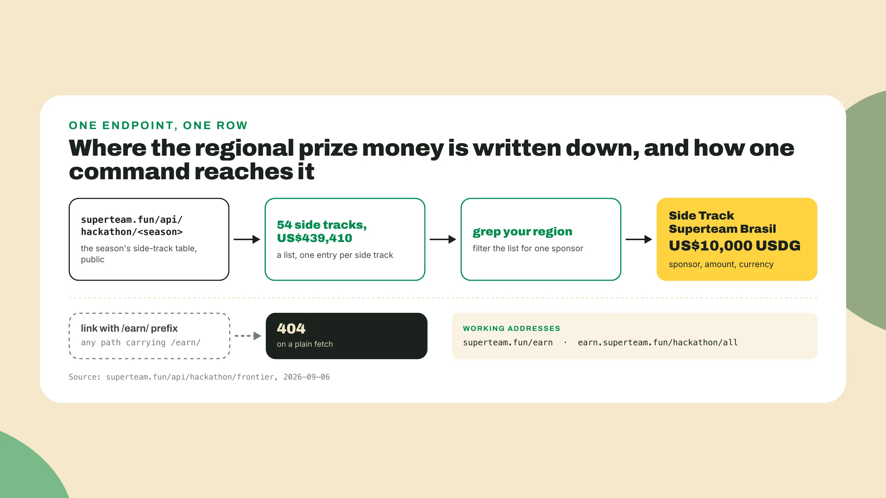
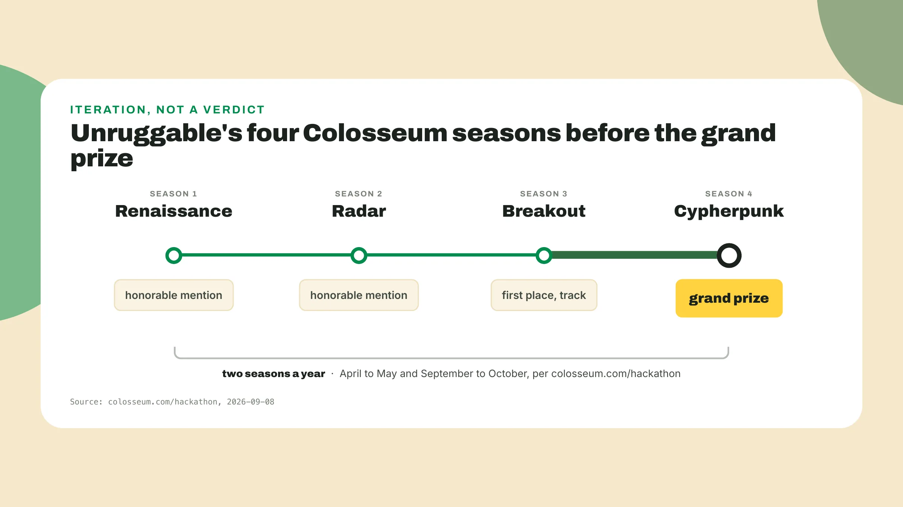
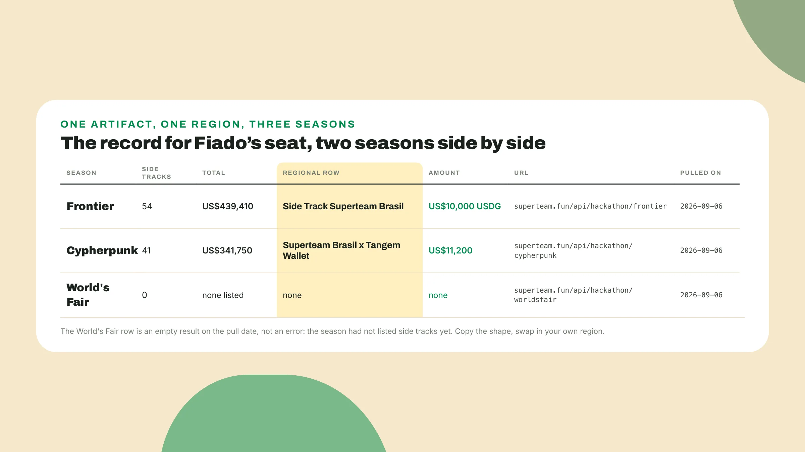
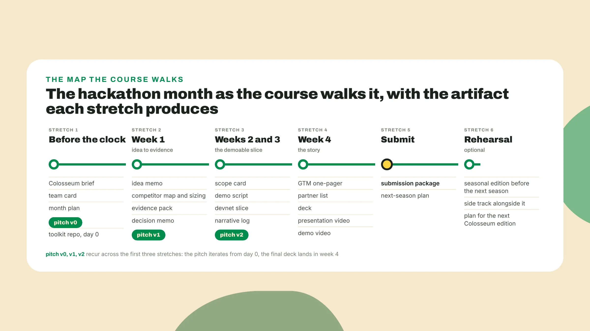

# The record

## The file most teams never opened

Somewhere in a public JSON file there is a line that says Superteam Brasil put **ten thousand dollars on the table** for Brazilian teams in the last global season. My guess is that most of the teams that could have claimed it **never opened the file**. This lesson shows you what is in it, *so you start the month knowing what the teams that skipped it did not*.

Here is the Frontier row, the last completed global season, pulled on 2026-09-06:

```text
season       Frontier (the last completed global season)
side tracks  54
total        US$439,410
one row      Side Track Superteam Brasil, US$10,000 USDG
```

None of it was hidden. It sat behind a public URL for the whole season: one entry per side track that Superteam Earn ran alongside Colosseum's Frontier season, each with a sponsor, an amount and an ask. If you ever want to see the live version yourself, one command returns the whole list, and *you will not need it more than once or twice a season*:

```bash
curl -sL https://superteam.fun/api/hackathon/frontier | python3 -m json.tool
```

What the teams that read it knew is simple: a Colosseum season pays out of **more than one pot**, a main prize and a long list of regional prizes, each with its own sponsor and its own ask, *won with the same submission*. A hackathon month has a record, and **the record is public**.



## The team that lost three times first

Open colosseum.com/hackathon in a browser and **find the Unruggable card**. It says the team competed in four hackathons before winning the grand prize: Renaissance, an honorable mention. Radar, another honorable mention. Breakout, first place in a track. Cypherpunk, the grand prize. That is the record as Colosseum's card put it on 2026-09-08, and the same page, read 2026-09-06, said Colosseum runs **two global hackathons a year**, April to May and September to October. A team that treats one season as a verdict *is throwing away the second half of the year*.



## Two seasons, side by side

The season before Frontier tells the other half of the story. Change one word in that command, frontier to cypherpunk, and the endpoint answers for the earlier season. Pulled on 2026-09-06, Cypherpunk carried **41 side tracks** totalling US$341,750, and the Brazilian row read Superteam Brasil x Tangem Wallet at **US$11,200**. Between the two seasons *the count went up* and the Brazilian row went from a co-sponsored track to a single-sponsor one with a smaller amount. Change the word to worldsfair and, on the same date, the endpoint returned **an empty list**: no side tracks published yet for a season that had not opened. *An empty answer is part of the record too*, and it tells you the page is worth a second look once the season opens.

The course carries one example project through every lesson, and this is where you meet it. **Fiado** is a Brazilian corner shop's credit notebook, the name, running total and date the owner keeps by the till, turned into a stablecoin-settled tab with a repayment reminder. *Fiado is Brazilian, so its regional row is the Superteam Brasil one*, and its two seasons of the record look like this:



Two things in that table are worth holding on to. First, **every number carries a date**, because the record tells you where the money and the crowd were last season and nothing certain about where they will be this one. When your season opens, the page is worth *one fresh look*, not a habit of re-pulling. Second, your own region has a row in that list, or an absent row, and so does every neighbouring country, each with **its own sponsor and its own ask**. A Brazilian team entering Frontier was in two contests at once with the same submission, one global and one against only its own country, and that asymmetry is, I think, *the most under-used fact in Solana hackathons*. The regional row is the shortest path to a prize, and *what Colosseum's judges score is what makes a project worth a prize at all*, so a good month holds both.

## Four words, the month, three rules

**A global season** is one of Colosseum's two hackathons a year, and the clock in this course is the month between its opening and its submission deadline. **A side track** is a regional prize attached to a global season, a sponsor, most often a regional Superteam, putting up an amount and an ask. **A regional bounty** is the side track whose sponsor is your region's Superteam. **A rehearsal** is any other competition you enter with the same package: a Colosseum global season is the target, and a Superteam Brasil seasonal hackathon before the next Colosseum season or a Superteam Earn side track alongside the season you enter *is a rehearsal*.

The lesson order **follows the calendar**. Before the clock, you read the hackathon's page and its judging criteria, confirm a team, write a first pitch and set up the toolkit repo on day 0. Week 1 takes an idea to evidence and a written **kill, pivot or commit decision**. Weeks 2 and 3 build the demoable slice on devnet. Week 4 *turns the slice into the story*. Submit assembles the package and writes a next-season plan, and Rehearsal, optional, exports it to the rehearsal hackathons.

On the last day **you hold six things**: a devnet demo slice, a deck, a presentation video of two to three minutes, a demo video of three minutes or less, a GTM one-pager with named partners, and the portal answers drafted ahead of time. Every earlier piece you build *feeds one of those six*.

Three house rules:

1. You see the thing **before it gets a name**, and every later lesson puts a command, a query or a page inside its first few hundred words.
2. **The pitch exists from day 0**, and the first version is allowed to be wrong, *it is not allowed to not exist*.
3. **Check every piece against the seven judging factors** and the sponsor's ask before you move on, and *the next piece does not start until the current one passed honestly*.



## Next lesson: the seven factors

You know the prize table. Next lesson you **open Colosseum's hackathon page** and read the seven judging factors it publishes, one at a time, the way a judge reads them, and copy them into a file with the date on the first line. The first thing you will notice is that *code quality is not one of them*.
