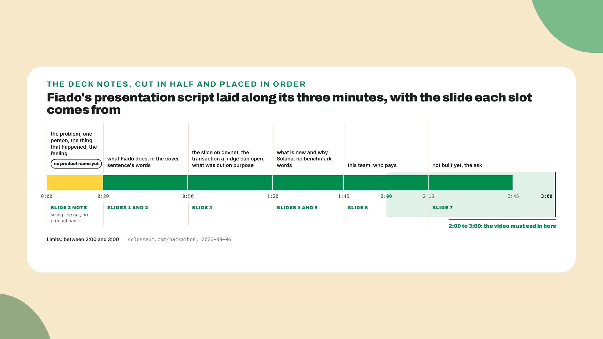
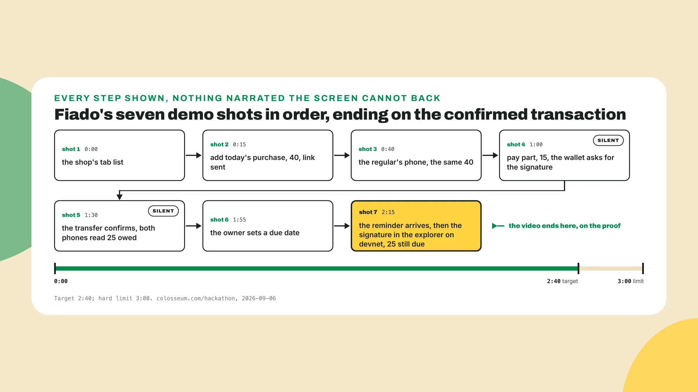
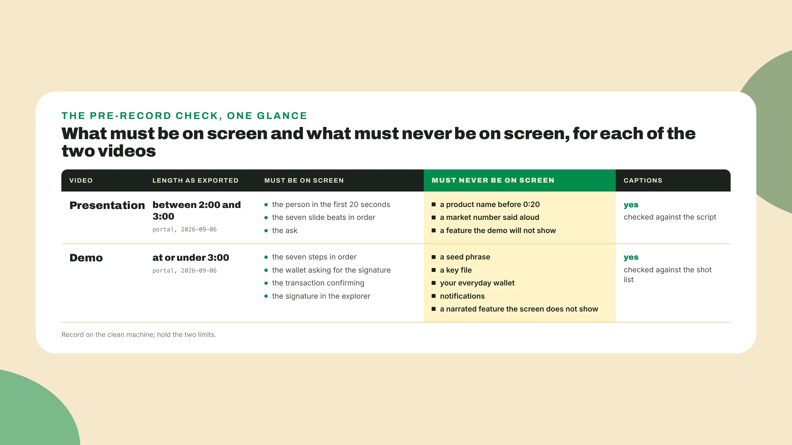
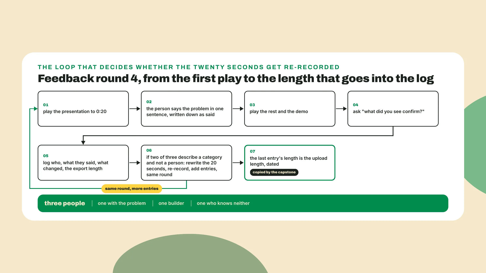

# The two videos

Last lesson you built deck-judge.md under seven headings, wrote the notes at 30 to 60 seconds a slide, put four objections in objections.md, read it to three people for round 3, and marked the cover sentence final. Keep the notes open. *They are the long form of everything you record today.*

## Why this matters

The demos I remember opened on a person with a problem, a wallet drained overnight, someone on the phone with a scammer and not knowing it yet, a signature that could not be taken back, and then the feeling of standing there and not being able to do anything about it, *and only after that the product*. That is **the first twenty seconds** of your presentation video.

The one idea this lesson adds is that you are making **two different objects**. The presentation tells the story, the demo shows the slice, and the mistake most teams make in week 4 is treating them as one recording cut two ways. The tradeoff is the hour: a beautiful video of a demo that stalls at shot 6 loses to a plain screen recording of one that does not, *so production time goes to the script and the take, not to effects*.

## Do this: the presentation video

1. **Open a new file called presentation-script.md**, put the date on the first line, and write the six time slots before any words go under them:

```text
presentation-script.md, your project, Colosseum World's Fair season, started 2026-09-06
0:00 to 0:20   the problem: one person, the thing that happened, the feeling; no product name yet
0:20 to 0:50   what the product does, in the words of the cover sentence
0:50 to 1:20   the slice on devnet, one screen, the transaction a judge can open
1:20 to 1:45   what is new, and why Solana, three lines from slides 4 and 5
1:45 to 2:15   this team, and who pays
2:15 to 2:45   what is not built yet, and the ask
```

2. **Fill the first slot** only. Take the note you wrote for the problem slide, cut the sizing line, *start on the person instead of the notebook*, and end on what she felt when it was gone. The twenty seconds hold a person, one thing that happened to that person, and the feeling after, in that order: **no product name**, no market number, no team. If the evidence pack from week 1 has a real sentence from one of those conversations, use it.

   For Fiado the person is the shop owner who lost the notebook, about **forty names** with a running total next to each, the day it got wet, and her asking each regular what they owed and taking their word for it, *and the twenty-second version ends on what it is to stand behind a till and know the money is somewhere in forty people's memories*.

3. **Read the first slot out loud** with a timer running. If it runs past **twenty seconds**, cut a sentence and read it again until it fits. Twenty seconds at a normal speaking pace is fewer words than you think, and only the timer decides. *I would rather you shipped a fifteen-second version that lands than a thirty-second version that is good.*

4. **Fill the remaining slots** from the deck notes, cut to about half. As of the 2026 World's Fair season the Colosseum page asks for 'a two-to-three-minute presentation video' and calls it 'one of the first resources judges review' (colosseum.com/hackathon, 2026-09-06), which is why this video gets the first twenty seconds treatment and the demo does not. Seven slides at the short end of 30 seconds each is already three and a half minutes, and the video has to land **between 2:00 and 3:00**, *so every note loses about half its words and the order of the slides holds*. Fiado's reads like this from the second slot on:

```text
presentation-script.md, Fiado, Colosseum World's Fair season, 2026-10-05
0:00 to 0:20   the problem: the shop owner and the notebook (yours to write)
0:20 to 0:50   Fiado turns that notebook into a tab that both sides can read. The owner
               opens a tab for a regular and adds what they took, the regular sees the same
               balance on their own phone, and when it is due, a reminder goes out that the
               owner never had to send. The regular pays part of it in a stablecoin from
               that same phone, and both sides watch the balance move.
0:50 to 1:20   This is running on devnet today. This is the tab screen, and under it is the
               signature of a real transaction that you can open. We built the tab, the
               part-payment and the reminder in two weeks, and we left the tab program,
               the fiat rails and wallet onboarding out on purpose. They are on the last slide.
1:20 to 1:45   The bank's app does not know the regular. The shop does. Fiado keeps the
               credit between those two people and puts the payments on-chain, each one a
               stablecoin transfer from a phone with the tab's name on it, so both of them
               can read the record without trusting us. That is the transaction you just saw.
1:45 to 2:15   We are two. One of us has stood behind that till. Nobody pays yet. The shop
               will, once ten shops have run a tab for a month. The regular never pays Fiado.
2:15 to 2:45   Not built yet: the tab program, the fiat rails, wallet onboarding, then the
               cooperative rollout, in that order. One cooperative has already replied. We
               want the accelerator, and one introduction to a second cooperative.
```

5. **Read the whole script from 0:00** with the timer running and write the total on the first line. The demo slot at 0:50 says the transaction is real and points at a signature, and that is as far as the presentation goes.

   The script does not say fast, for the reason last lesson gave. It does not say the market number out loud, since the number is on the slide behind the voice and a judge that wants it will pause. And it says nothing at 0:50 that the demo video will not show, so the two videos **never contradict each other**. If the total does not land between 2:00 and 3:00 without rushing, *the problem is in a later slot, not in the first one*.



## Do this: the demo video and round 4

6. **Open demo-shots.md** and write the seven steps from your week 2 demo script, each with its start time and the words said over it, if any. *A shot list decides nothing new.* It only says how long each step is on screen and which of them get a sentence. The same Colosseum page asks for 'a product-demo video of no more than three minutes' (colosseum.com/hackathon, 2026-09-06), and that is **the limit the shot list is cut to**. Fiado's shot list follows its seven steps one for one:

```text
demo-shots.md, Fiado, 2026-10-05, target 2:40, hard limit 3:00
shot 1   0:00   the shop's tab list on the owner's phone, two names on it           said: this is the shop's side
shot 2   0:15   open the regular's tab, add today's purchase, 40, the link sent     said: the amount, nothing else
shot 3   0:40   the regular's phone, the same 40, no install, no login              said: same tab, other side
shot 4   1:00   he taps pay part, types 15, the wallet asks for the signature       said: nothing
shot 5   1:30   the transfer confirms, both phones read 25 owed, the link appears   said: nothing, let it land
shot 6   1:55   the owner sets a due date for the 25                                said: one date, her call
shot 7   2:15   the reminder arrives on the regular's phone, then the signature     said: that is the whole slice
                opened in the explorer on devnet, 25 still due
```

7. **Mark shots 4 and 5 silent**, and keep them silent. A wallet asking for a signature and a transfer confirming with two phones agreeing on 25: a judge that builds on Solana reads those screens faster than you can describe them, *and a judge that does not build is watching the thing happen*.

   The narration rule is short. If it is not on the screen at that second, **do not say it**. The tab program, the fiat rails and the cooperative rollout stay on the next-steps slide and in the presentation video. Shot 7 ends on the signature in the explorer with 25 still due, and the video ends there too, on the proof. The target of **2:40** on the first line is *the room you leave for a slow devnet confirmation*.



8. **Set up the clean machine** before either take. That is a fresh browser profile with no extensions except the wallet, a wallet created for the recording with only the devnet funds the demo needs, notifications off, every tab that is not the demo closed, and the terminal history cleared if a terminal is on screen. The signature that confirms in shot 5 is public by design and *it is fine to show*. A seed phrase, a key file in a folder listing, the balance of the wallet you actually use, or a message from someone that pops in at 1:30 **must not be on screen**.

9. **Record the demo** only after the slice runs end to end on the clean machine twice in a row without you touching anything, then watch it once with the only question being what is on the screen that should not be. **Record the presentation** from the same profile, over your face or over the slides, whichever you can do in a single take without stopping, *because a single take that is a little rough sounds like a person and six takes stitched together sound like a product*. Read from the script. Nobody minds.

10. **Caption both videos** and check the captions against the script and the shot list. A captioned demo with the sound off still shows the amount typed in and the transaction confirming, but a caption that says the wrong amount over shot 2 is a mistake in a place a judge is reading. Then check the length **on the exported file**, the one you will upload, not on the recording app's counter, *since exports pick up a second here and there at the edges*.

    One thing to know if a rehearsal is on your calendar: a seasonal hackathon or a side track will have its own page with its own deliverables and deadline, so **read that page the day you decide to enter** and reuse the exports you already have, *with no new footage*.



11. **Show both videos to three people** who have not seen them, the same three kinds as last round: one who has the problem, one builder, one person that knows nothing about either. Play the presentation and stop it at **0:20**. Ask the person to say what the problem is, in one sentence, and write down the sentence they said. Then play the rest and the demo, and ask **one question only**: what did you see confirm? If the answer is the payment, or the transaction, or the tab going to zero, the demo showed it. *If the answer is a description of the app, the demo narrated it.*

12. **Write three entries in the log** with who, what they said, what changed, and the export length of the file each person watched, since a re-record changes it. If the person says something close to "that happened to me", or names someone it happened to, *the twenty seconds work*. If **two of the three** describe the category instead of a person, rewrite the twenty seconds and re-record the same day, and the round keeps its number and gets more than three entries. The last entry in the log is the length of the video you will upload, **dated**. Fiado's round, the same three people as every round before it:

```text
feedback log, round 4, Fiado, 2026-10-08
1  Lucia, the shop owner     at 0:20: "a shop like mine losing the notebook"
                             after the demo: "the 15 landing, and the 25 left"
                             changed: nothing; presentation 2:38, demo 2:41
2  Jorge, a regular who      at 0:20: "shops that give credit and lose track"
   keeps a tab               after the demo: "the payment, and a link I could open myself"
                             changed: nothing; same exports
3  Marcos, entered a         at 0:20: "credit apps"; after the demo: "the transaction"
   hackathon once            changed: the first twenty seconds, since the notebook story
                             took too long to land for him; the wet page now lands by
                             second ten; re-recorded, presentation 2:34, demo 2:41
```

One of three missed, which the rule does not force a re-record for, and the storyteller re-recorded anyway, *because the miss came with a reason he could act on the same afternoon*. The last entry's lengths, **2:34 and 2:41**, are the numbers the capstone copies without re-measuring. With three calendars, show the videos to **one person today and two tomorrow**, and if the twenty seconds got re-recorded in between, the second viewer watches the new version and it goes in the log as what changed.



## Done when

- **presentation-script.md** has all six slots filled, the first twenty seconds open on a person with no product name, and the presentation export runs between 2:00 and 3:00.
- **demo-shots.md** has your seven steps timed with the silent shots marked, and the demo export runs at or under 3:00 with the transaction confirmation visible on screen before it ends.
- Both videos were recorded on a clean machine, captioned, and **timed on the exported file**.
- The log has **three entries for round 4**, each with who, what they said, what changed, and the export length, and the last entry's lengths are dated.

## Watch out

- A demo that **narrates a feature** while the screen shows something else is a demo of your voice, and a judge watching with the sound off, which some of them do, sees a video that never showed the thing it claims.
- **Going over the limit** by ten seconds: the portal states the limit and the brief assumes it is enforced, so a 3:08 demo is a demo that may never be watched, and no ten seconds of footage was worth that.
- Recording the demo on your everyday laptop with **your everyday wallet**: the video is public and it stays public after the season, and a seed phrase or a real balance in the corner cannot be taken back once it is uploaded.

## The takeaway

You are making **two different objects**. The presentation tells the story and opens on a person for twenty seconds before any product word, so that a stranger says that happened to me. The demo shows the slice and ends on the confirmed transaction, narrating only what the screen backs. *Both are timed on the exported file, because a video over the limit may never be watched.*

## Next: the forms, the deadline, the rules

Next lesson is the one that loses more teams than any judging criterion, and it has no video in it. You will submit, and then you will submit again, because a submission that exists early can be corrected and a submission that exists at 23:50 cannot. Its first action is **one file that lists every piece you built** with its path and date, before the portal is opened. *Bring the export lengths, they go on the form.*
