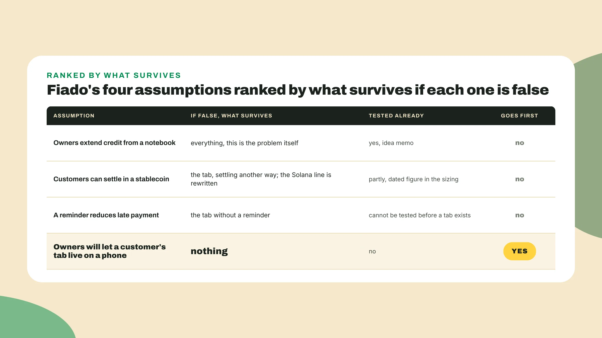
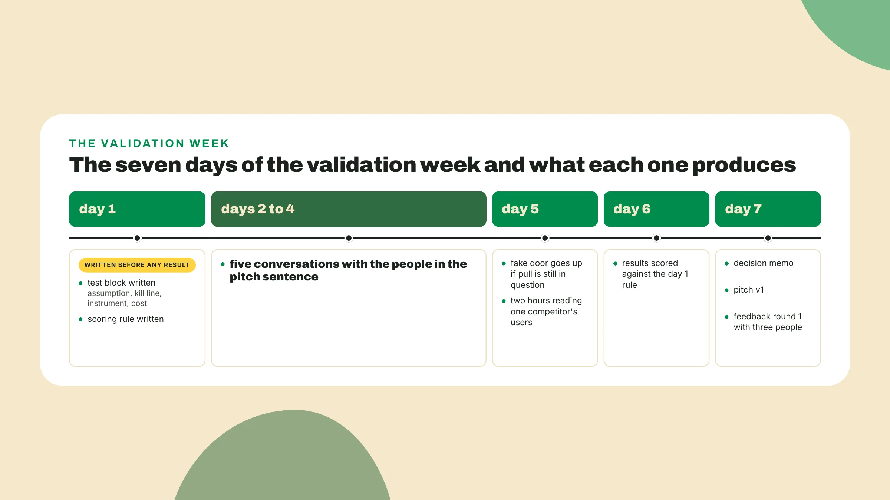
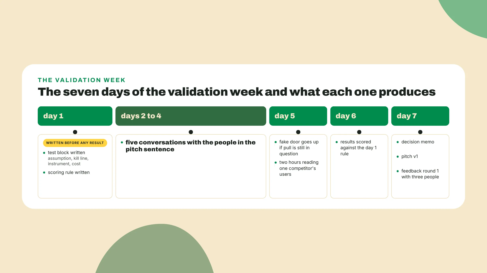

# Evidence in one week, then decide

Last lesson you built the competitor map and sized the market as three numbers, each with a dated source. Keep both open. This week they turn into evidence, and evidence has a rule the map did not have: *it has to be able to say no*.

## Why one no is worth more than five yeses

Friday of week 1: five people heard the pitch and all five said it sounds good. The team commits, and in week 3 the first real user says the thing nobody asked in week 1. **Validation that only confirms** is theater. A yes fits five worlds: the idea is good, the person is polite, the question led them, the person is your friend, or they like it and will never change a thing. A no fits two, they misunderstood or they mean it, and *the next question separates them*. Same twenty minutes, far more movement.

The test worth running is the one that *could make you delete the repo on Friday*, so write it now. Open a new file, **evidence-pack.md**, at the root of the toolkit repo, next to the competitor map, and copy this block in:

```text
evidence-pack.md, Fiado, week 1, written day 1
assumption:   shop owners will let a customer's tab live on a phone
kills it if:  most owners who run a notebook today say they would not move the page
instrument:   five conversations with owners who extend credit from a notebook
cost:         about five hours, spread over three days
result:       (empty until Friday)
```

Write yours under it with the result line empty. The steps below fill each line.

## Do this

1. **Find the riskiest assumption.** Write down every belief your pitch sentence needs to be true, and next to each one write what survives if it is wrong. The one with nothing in that column goes on the assumption line. Fiado's day-0 sentence needs four things: owners extend credit from a notebook, customers can settle in a stablecoin, a reminder reduces late payment, and owners will let a customer's tab live on a phone at all. *Only the last one leaves nothing standing if it is false*, so it goes first.


2. **Write the kill line** on day 1, before anyone talks to anyone. A disconfirming test is one where at least one possible result would make you drop the idea or a claim inside it, and *if no result could change what you do on Monday, you are rehearsing the pitch in front of an audience*. Fill the kills-it-if line with the result that ends the idea. Fiado's is that most owners who run a notebook today say they would not move the page, which for five owners means **3 or more no**.

   Write the scoring rule under it in the same file: a conversation counts as a no when the owner says they would not move the page or describes a reason it cannot move, counts as a yes only when the owner describes how the page would live on a phone tomorrow, *in their own words and unprompted*, and anything else, sounds good included, is scored as nothing.

3. **Pick the instrument** from the cheap end, stopping at the first one that can still say no. My rule, and the one this lesson is built on, is to *test the riskiest assumption with the cheapest instrument that could actually produce the no*. Four instruments fit inside a week.

   **Five conversations** with the people in the pitch sentence, and people who resemble them do not count: if the sentence says shop owner, the five are shop owners who run a notebook today, found by walking into shops, and *the conversation opens on their notebook and never on your product*. Ask to see the page, ask what happens when a customer disputes a balance, ask what they do when the notebook is not there, and only then describe the tab and ask whether that page could live on a phone, and whose.

   A **fake door**, a one-page site that offers the product before it exists and counts who leaves a contact, for Fiado a page saying a tab for your shop, leave your WhatsApp, costs a day and measures pull only. A waitlist is the same instrument with a different word on the button. **On-chain comparables** cost nothing new, since last lesson's sizing already carries a dated stablecoin figure for the region, and this week that figure is evidence that the customer side of the tab has rails.

   **One competitor's real users** cost two hours of reading an app store page or a public group, and *if nobody complains about the thing you promise to fix, that is evidence too*. Write the instrument and its cost on the last two lines of the block.



4. **Run the week in this order.** Days 2 to 4 are the conversations, *because they take calendar time to arrange and each one changes the questions for the next*. Day 5 the fake door goes up if the conversations left a question about pull, and the competitor reading happens the same afternoon. Day 6 you read everything back against the rule from step 2. Day 7 is the memo, the rewritten pitch and the first feedback round.



5. **Score the results on day 6** with the rule you wrote on day 1, then write the tally line in the file and one sentence on whether the kill line was reached and what the no's have in common.

   Fiado's five came back as **2 no** with different reasons (the grocery, disputes at the counter, and the mini market, older customers), 2 conditional yes on the same condition (Lucia's corner shop and the butcher, the owner's phone and a balance the customer sees too), and 1 already on a phone (the bar, tabs kept as WhatsApp messages to himself), so the kill line of 3 or more was not reached and *the assumption survived in a narrower shape than the block wrote it*. If your sentence says the no's share a reason, read them again.



6. **Write the decision memo** on day 7 and pick exactly one of three words. **Kill** means the assumption failed and the idea goes with it, back to the idea memo's second candidate. **Pivot** means it failed in the shape the sentence stated and survived in another shape, so the sentence changes and the build follows. **Commit** means it survived as written. The memo has six lines, and *the fourth is what makes it a memo rather than a diary*:

```text
decision memo, <project>, day 7
assumption:               the line from the test block
evidence:                 the instrument, with the names or pages in it
decision:                 kill, pivot or commit, in one sentence
would have killed it:     the kill line as written on day 1
why it did not:           what the results did instead
next assumption to test:  the belief this week could not reach
```

Fiado's memo says **pivot on shape** and commit to the tab, the tab lives on the owner's phone and the customer sees the same balance, what would have killed it was 3 or more no or 2 no with the same reason, it did not because the no's split between disputes and the customers' age while the two yeses named the same shape unprompted, and the next assumption is that the reminder reduces late payment, which needs a tab to exist. A memo that says commit with no line for what would have killed it *is the diary of a team that was always going to commit*.

7. **Rewrite the pitch as v1**, because *the pivot is not done until the sentence changes*. Change only what the evidence touched, and record the diff under it. Fiado's product half moved toward what two owners said, and the reminder left the sentence until it has evidence of its own:

```text
pitch v0 (day 0):  A shop owner who loses the credit notebook loses forty small
                   debts with it, so Fiado keeps the tab on-chain and reminds
                   each regular.
pitch v1 (day 7):  A shop owner who loses the credit notebook loses forty small
                   debts with it, so Fiado keeps the tab on her phone, shows each
                   regular the same balance, and settles it in a stablecoin.
changed:           where the tab lives (owner's phone); the regular sees the
                   balance; the reminder is out until tested
```

8. **Show v1 to the three people** named in the feedback log on day 0 and log round 1 by the day-0 rule: what each one did not get, and what changed because of it. Fiado's three are Marcos, Lucia and Jorge, and the sentence changed **zero times**, which is a fine round, *because each entry says what the sentence is not carrying and where that thing should live instead*:

```text
feedback log, round 1, day 7
1  Marcos, entered a        did not get why the tab needs a chain at all
   hackathon once           changed: nothing in the sentence; the why-chain
                            answer goes in the written answers, not the pitch
2  Lucia, the shop owner    asked if she has to explain the word stablecoin
                            to her customers
                            changed: nothing in the sentence; a note for the
                            build weeks that the customer never sees the word
3  Jorge, a regular who     did not get who pays for this, and asked whether
   keeps a tab              he can see his own balance
                            changed: nothing in the sentence; who pays is the
                            Viability question and goes in the memo as the
                            assumption after the reminder; the balance he
                            asked for is already in v1
```

## Where the memo gets read

The Colosseum portal, on the page read 2026-09-06 and as of the 2026 World's Fair season, asks in its own words for the go-to-market strategy, demand validation, and plans for developing distribution, and says the review wants to understand how the opportunity was uncovered and how the team prioritizes. A team that spent the week building answers the **demand-validation field** with a sentence about how confident they feel, and *a team that spent it on the five conversations answers it with the memo*.

A seasonal hackathon or a side track will have its own page with its own deliverables and deadline. **Read that page the day you decide to enter**, and reuse the package you already have: the memo is the demand-validation answer wherever it gets read, and *a pitch with no code behind it is an evidence pack read out loud*.

## Done when

- At least one test in the pack could have killed the idea: read its **kill line** and ask whether the result you got was allowed to hit it.
- The **decision memo** names its evidence, with the people or the pages in it, and carries the line for what would have killed it.
- **Pitch v1** differs from v0 in at least one claim, or the memo says in one line why the evidence touched nothing.
- The **feedback log** has three entries for round 1, each with what the person did not get.

## Watch out

- **Interviewing friends**: a friend who says yes is the polite world, and if a person in your five would feel bad telling you no, they are not in the five.
- **Counting waitlist or fake-door signups** from your own team's network as demand: that is your network being kind, so exclude anyone the team already knew.
- **Pivoting in your head** and leaving the sentence as it was: the decision is not made until v1 is written and the diff is under it.

A week of validation is a week not building and the demo will be smaller for it, but **judges score demand validation by name**, so the trade is usually right, and *the memo records that you made it on purpose*.

## The takeaway

Validation is a test that was allowed to fail. The **kill line** is written on day 1, before anyone talks to anyone, and the decision memo names the evidence that would have killed the idea and says why it did not. *If your memo carries that line, you have done validation, not theater.*

## Next lesson: a season you have never seen

Next lesson is a test. You open the pages of a Colosseum season that already ended, one you have never read, and rebuild the brief from scratch: the factors quoted, the deadline converted, the disqualifiers copied, then a note on what changed since and what did not. If week 1 stuck, it takes twenty minutes. The first thing you do is **open the archived page cold**, with your own brief closed, and *the closed brief is the point*.
