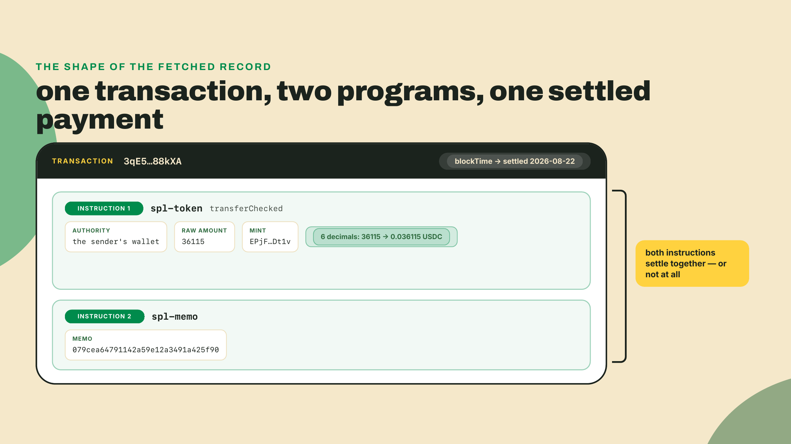
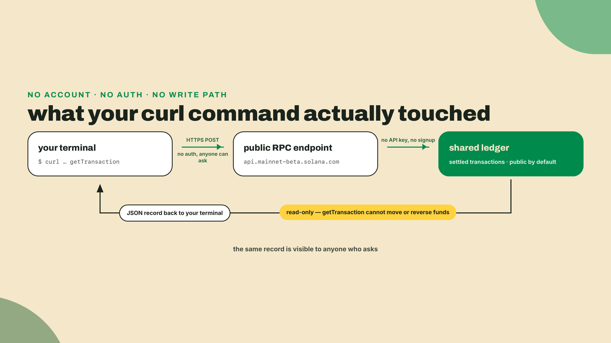
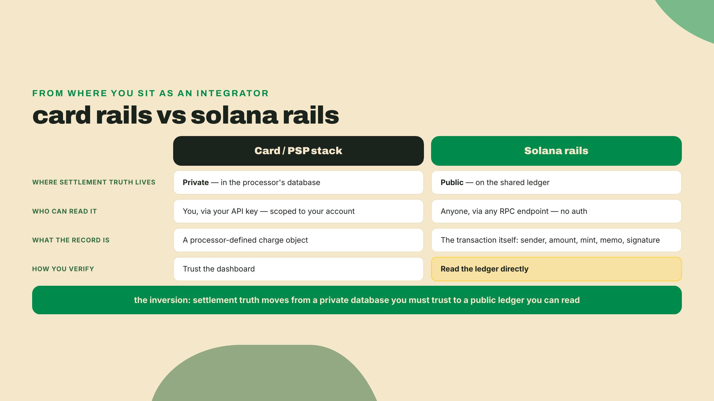
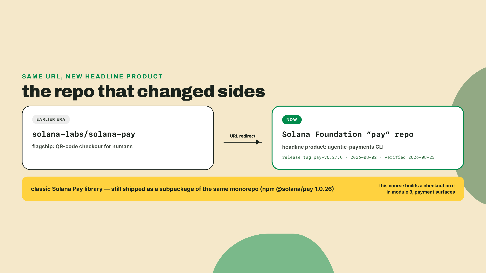
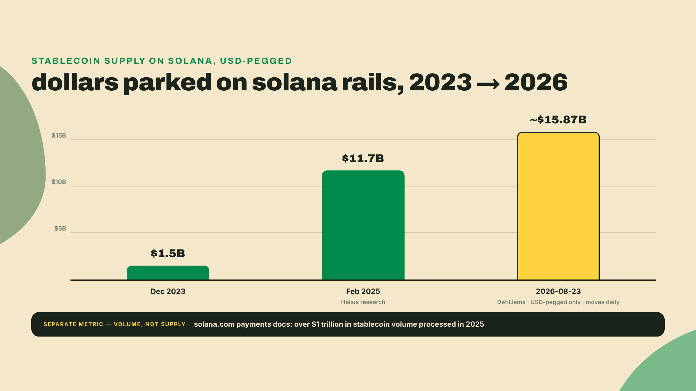
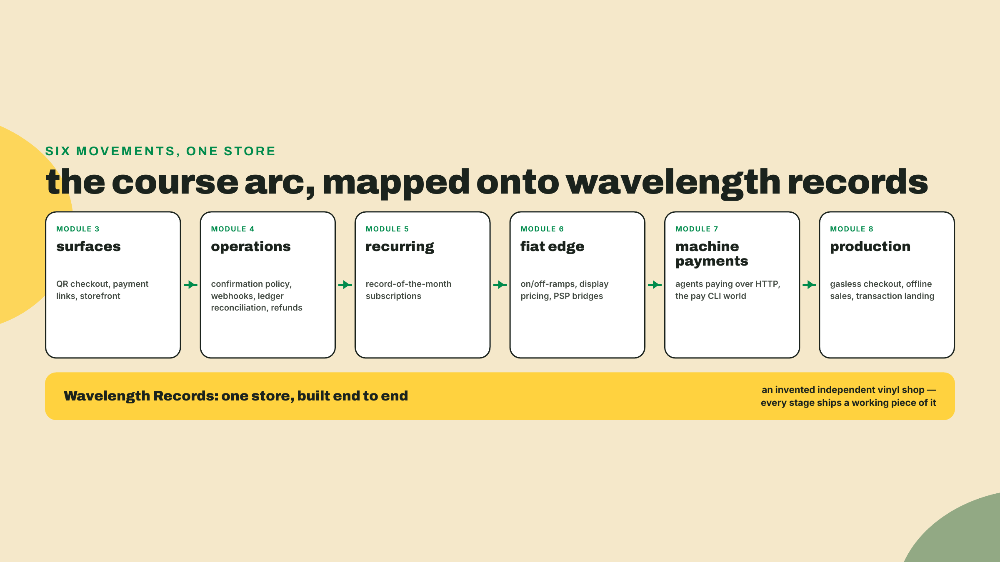
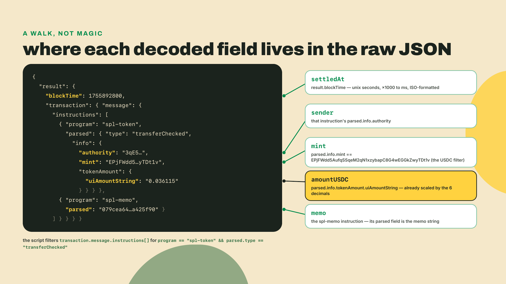
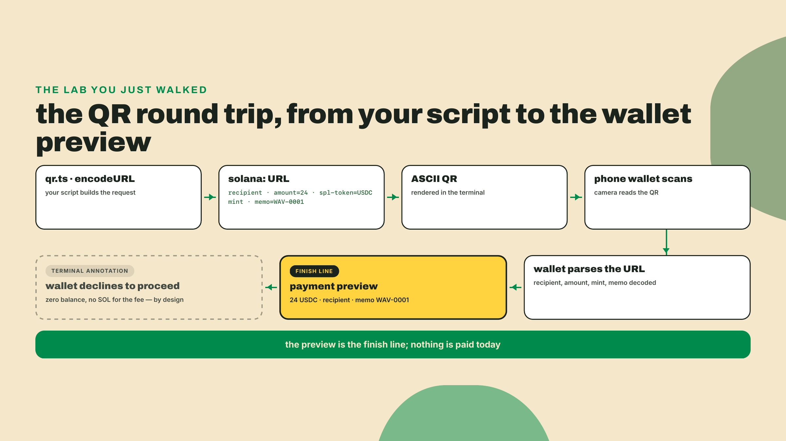

# Watch a dollar settle: your first five minutes on Solana rails

## Summary

This is the first lesson, so there is nothing to recap: nothing has been built yet. You arrive fluent in card rails and PSP integration, the kind of engineer who knows what a webhook retry storm feels like, and we are going to open by reading real money move on-chain before any theory. In the next five minutes, with no wallet, no keys, and no signup, you will read a real dollar-denominated payment settle on Solana's public ledger. Then, over a longer sitting, you will generate a payment QR your own phone can scan. No slides first.

## The rails you can read

Copy this into your terminal and run it. It works on any machine with `curl`, which is to say, yours:

```bash
curl -s -X POST https://api.mainnet-beta.solana.com \
  -H 'Content-Type: application/json' \
  -d '{"jsonrpc":"2.0","id":1,"method":"getTransaction","params":["3qE5iCo5uGGfGXZd4rwfgJryLse6EpTA2SQMtX3X3GbWsS6hDRw8JwcYb4wpj77Aqj5mQBJg52LawnaZyT688kXA",{"encoding":"jsonParsed","maxSupportedTransactionVersion":0}]}'
```

That wall of JSON you just got back is a stranger's settled payment. A real one. Someone, somewhere, moved USDC on Solana mainnet, it settled, and you just pulled the full record of it from a public endpoint with a one-line HTTP request. Nobody asked who you are. Nobody could.

Sit with that for a second, because your Stripe brain should be itching. In the card world, a settled payment is a row in a processor's database. You see YOUR rows, through YOUR dashboard, after YOUR API key authenticates you. The idea that you could fetch the settlement record of a payment between two total strangers is not a permissions bug someone forgot to close. Here, it is the design.

A handful of definitions so the JSON stops being noise, and then we will earn the big claims. These name the fields the lesson actually leans on; the rest of that response (`slot`, `computeUnitsConsumed`, `innerInstructions`, `logMessages` and friends) stays noise for now on purpose, and the lab opens with a field map showing exactly where each printed value lives inside the tree, so do not hunt for them yet.

- **mainnet**: the live Solana network, where real balances live. There is also a free test network called devnet, which is where every payment you send in this course will land. Today you are only reading mainnet, never writing to it.
- **RPC endpoint**: the URL you just hit is a public door to the ledger. Anyone can knock. And crucially, the door only opens one way for requests like this: the demo reads, it never writes. You cannot move, reverse, or re-trigger anyone's funds by fetching their transaction, any more than reading a receipt spends the money on it.
- **USDC**: a dollar-pegged stablecoin issued by a regulated company, Circle, which holds reserves against every token in circulation and redeems them one-for-one. That is the whole reason a dollar figure means anything on these rails: 1 USDC is a claim on 1 US dollar at the issuer, and the market prices it accordingly. When this course says "a dollar settled", it means a USDC token moved. The peg is an issuer promise, not a law of physics, and pricing a business on it is a real decision we will make explicitly at the fiat edge.
- **USDC mint address**: `EPjFWdd5AufqSSqeM2qN1xzybapC8G4wEGGkZwyTDt1v` is the on-chain identifier of that token on Solana, the account that defines the currency itself. Think of it as the currency code, except it is a globally unique address, not a three-letter string. USDC on Solana carries 6 decimals, so the raw integer amount `36115` in that JSON means 0.036115 USDC. Those long strings are **base58**, the alphabet Solana prints addresses and signatures in: digits and letters minus the ones humans confuse, so no `0`, `O`, `I`, or `l`.
- **`spl-token` and `transferChecked`**: `spl-token` is the on-chain program that owns this USDC balance, and most token balances on Solana, the way a ledger service owns balance rows. Most, not all: a second token program called Token-2022 owns its own balances (PYUSD lives there, for one), and module 2 teaches you to check which program a mint belongs to before you decode anything. `transferChecked` is the one instruction of that program this course uses to move tokens; the "checked" part means the caller must also state the mint and its decimal count, and the program refuses if they do not match. In the JSON its `authority` field is the account that authorized the move, which for an ordinary payment is the sender's own wallet. Balances themselves live in **token accounts**, one per owner per currency; the next module builds them properly.
- **`spl-memo` and the memo**: `spl-memo` is a second, tiny program whose only job is to attach a human-readable note to a transaction. The note in your JSON reads `079cea64791142a59e12a3491a425f90`, some system's internal reference. Later in this course, memos become how a merchant matches a payment to an order. File that away.



So the transaction you fetched breaks down to: sender `BhFRCUXHVm76PmXkSzus8T4LUGrD2MTW9Au6bocBox5U` moved 0.036115 USDC, with that memo attached, and it settled on 2026-08-22. That is 3.6 cents, and the size is the point rather than an embarrassment: on card rails a 3.6-cent transfer is not a small payment, it is an impossible one, because the fee floor exceeds the amount. Here someone moved it and the economics still worked. We put an exact number on fees next lesson; for now the point is that the record is public, complete, and yours to read.

Notice, too, what is NOT in that record, because the absences are as instructive as the fields. There is no card number, so there is nothing PCI-shaped to vault. There is no CVV, no expiry, no billing address, no field that says "chargeback window closes in 120 days". The sender's address identifies a key, not a person, which is why "who actually paid me" becomes a different question on these rails than it was on cards, and matching payments to customers will lean on that memo field rather than on anything resembling a cardholder name. For now, just register the shape: everything settlement needs is present, and nothing card-fraud liability needs is there at all.



### The inversion your PSP never offered

Here is the shape of what you integrate today. A card payment travels through an acquirer, a network, and an issuer, and the artifact you receive at the end is a webhook plus a row you can query, scoped to your merchant account. Settlement truth lives inside the processor. When finance asks "did order 4412 actually get paid", the answer is whatever the dashboard says, and the dashboard is private infrastructure you rent.

Solana inverts that. Settlement truth lives on a shared public ledger, and the processor-shaped thing in the middle is optional. Any party to a payment, or any curious third party, can verify settlement directly, over any RPC endpoint, forever. Your future reconciliation code in this course will not ask a provider "please tell me if I got paid". It will read the ledger itself.



Public by default is the game-changer here, and I want to be precise about why. It is not that public is virtuous. It is that public plus machine-readable collapses whole categories of integration work you currently do: reconciliation APIs, settlement report exports, "contact support to trace this payment". The ledger is the report.

Make it concrete with the memo you just read. Later in this course, when Wavelength Records sells a pressing, the checkout stamps the order id into the transfer's memo, exactly like the `079cea...` reference in your JSON. When finance asks "did order 4412 actually get paid", the answer will not be an API call to a provider that might be having an incident. It will be a query against the same public ledger you hit two minutes ago, matching memo to order, and anyone who doubts the answer can run the same query themselves. That is the whole reconciliation module in one sentence; we will spend real lessons earning it properly.

### The repo that changed sides

Second demo, and this one comes with a plot twist. Solana's official payments library ships on npm as `@solana/pay`. Install it and something unexpected lands next to it. The lab's step 5 re-runs this install with two more packages beside it, so run this now for the demo and still run step 5's fuller command when you get there:

```bash
npm i @solana/pay@1.0.26
npx pay --help
```

One version number, stated once and used everywhere in this course: the npm package is `@solana/pay` **1.0.26** (npm latest, checked 2026-08-23; re-check with `npm view @solana/pay version`, because this package moves). Along with the TypeScript library you presumably came for, the package drops a `pay` executable into `node_modules/.bin`, which is what `npx pay` finds. Run it and the first time through it downloads a native binary for your platform, then greets you with a toolchain for, and I quote its own banner, "agentic payments": commands for gating APIs behind stablecoin payments, wrapping `curl` and AI coding agents so they can pay for what they fetch, managing accounts, sending stablecoins from the command line.

Expect the binary to report a different number than the package. `npx pay --version` prints the CLI's own release line, which was 0.26.0 on my machine at write (the `npx` is not optional here: this course installs locally, so the executable lives in `node_modules/.bin` and a bare `pay` is command-not-found until module 7 installs it globally); the repo's newest CLI tag was pay-v0.28.0, cut on 2026-08-26 (verified against the GitHub releases API on 2026-09-07); it moves roughly monthly, so check rather than assume. Two version lines in one package is confusing the first time you meet it and completely normal afterwards: 1.0.26 is the library you install, and the 0.2x number is the downloaded executable it ships alongside. Neither is wrong when they disagree.

The story behind that binary is worth sixty seconds, because it is the whole ecosystem in miniature. For years, the canonical Solana Pay repository lived at solana-labs/solana-pay and its flagship was QR-code checkout: customer scans, wallet pays, done. Today that GitHub URL redirects to a repo under the Solana Foundation named simply "pay", and the headline product is the agentic-payments CLI you just poked at. The Foundation's payments energy visibly moved from "humans scanning QR codes" toward "software agents paying over HTTP".

Read the move precisely, because it matters: nothing was deleted. Classic Solana Pay, the QR checkout library, survives as a subpackage inside that same monorepo, maintained and shipped, and this course builds a real checkout on it in module 3, the payment-surfaces module. A shifted headline is not a removed product. Learning to read ecosystem moves at that resolution, what actually changed versus what merely stopped being the poster child, is a survival skill on rails this young, and you will get plenty of practice.



### This is real money, not a demo economy

Fair question at this point: is any of this production, or is it a sandbox with good marketing? I will give you two data points and let them argue for me.

First, the incumbent: Stripe's "Pay with crypto" accepts USDC on Solana at checkout and settles the merchant in fiat. Read that again from your integrator's chair. The most mainstream PSP in your world treats these rails as a first-class payment method, and it absorbs the crypto part so the merchant never holds a token. Whatever your priors about crypto payments, Stripe's risk team cleared this one.

Second, the trajectory. Stablecoin supply on Solana, meaning dollars tokenized and sitting on these rails, went from about $1.5B in December 2023 to $11.7B by February 2025 (per a Helius research article), and stands at roughly $15.87B as of 2026-08-23 (DefiLlama, counting USD-pegged stablecoins only; this number moves daily, so treat any figure you read, including this one, as a dated snapshot). Solana's own payments documentation states the network processed over $1 trillion in stablecoin volume in 2025. Supply is the float; volume is the throughput; both curves point the same way. Money went where settlement was cheap and fast, the way water finds a drain. The float sitting on these rails grew more than tenfold in under three years, and the incumbents followed it in rather than waiting it out.



### These rails are moving under you

Now the trade-off, because there is always one, and this course will name it every time. The same repo flip that makes the demo exciting is telling you the ground is not still. Versions churn. Tooling churns. Even canonical URLs churn: the repo you would have bookmarked two years ago now redirects somewhere else. "It works today" is a dated claim on these rails, not a guarantee, and a course that pretended otherwise would be lying to you politely.

So here are the house rules for everything that follows, stated once and enforced throughout:

- **Every version pin carries a freshness note.** When I say `@solana/pay` 1.0.26, I tell you when that was true and how to re-check. Pinned versions in scripts are deliberate, because an unpinned demo can break silently when a transitive dependency ships a breaking change.
- **Dated claims are dated.** Supply figures, product behavior, repo layouts: each arrives with its as-of date and source. When you hit a mismatch, and someday you will, the date tells you whether the course is stale or your environment is.
- **Live infrastructure gets a fallback.** The public mainnet RPC you used above will rate-limit you if you scan aggressively, which is fair, it is free. That is exactly why this lesson pins a real, re-verified transfer signature: the first-five-minutes demo decodes that transaction even when the live scan gets throttled. You will see the pattern in the lab script.

### Where this course goes, and the store we are building

You have now touched both ends of the arc: you read a settled payment, and you met the tool that lets software pay for HTTP calls. The course between those two points opens in module 2 by building the transfer kit itself, the token accounts, decimals, and send-and-verify primitives every later lesson imports, and then runs in six movements. Module 3, payment surfaces: QR checkout, payment links, the storefront paths a human customer actually touches. Module 4, merchant operations: confirmation policy, webhooks, reconciliation against the public ledger you just read, and refunds, which on these rails are a fresh payment in the other direction rather than a reversal. Module 5, recurring revenue: subscriptions on rails that have no card-on-file. Module 6, the fiat edge: on-ramps, off-ramps, display pricing, and the Stripe-shaped bridges between these rails and your accounting. Module 7, machine payments: the agentic side you glimpsed in the `pay` CLI, where the customer is software. Module 8, production hardening: gasless checkout, offline sales, making transactions land when the network is busy. Module 9 is the capstone, where every piece runs as one store.

We build all of it for one merchant. Meet **Wavelength Records**, an independent vinyl shop that exists only in this course: online store, a market-stall POS, a record-of-the-month subscription club, and eventually an API that quotes pressing prices to other businesses. Every lesson adds a real piece to Wavelength's stack, and by the end you will have built an end-to-end commerce operation on Solana rails, not a pile of disconnected snippets. When you generate a QR in today's lab, it will be denominated like a Wavelength order, because it is one.



One more piece of orientation before the lab, about how lessons in this course hand you work. Each lesson fades autonomy in three steps, out loud: the overview you just finished is readable without touching a keyboard; the lab we do together, step by step, with expected output at every checkpoint; the challenge at the end you do alone, and it is the part that makes the lesson stick. Today the lab is deliberately gentle, and notice what it does not do: no wallet until the very end. You have already read mainnet without one, which is the point. The wallet arrives only when you have built something worth scanning.

## Lab: onto the rails, end to end

Steps 1 through 4 are the five minutes promised at the top: toolchain check, folder, script, run. Steps 5 through 8 are a longer sitting, because they include an npm install, a first-run binary download, installing a wallet from an app store, and writing a recovery phrase down on paper. Budget forty minutes for the whole thing and do not let the opening promise rush you through the wallet ritual.

We will decode a transfer properly with a script, generate a Wavelength payment QR, and only then set up a wallet and scan our own QR with it. Before the script, one map: the raw JSON your curl returned nests the interesting fields a few levels deep, and the decoder you are about to write is nothing more than a walk to those spots. Here is where each printed field lives.



1. **Check your toolchain.** You need Node 24 or newer, which is what every lab in this course assumes from here on. `node -v` should print v24.x or higher; if it prints something older, upgrade now rather than at the first install that refuses. The scripts below run via `tsx`, a zero-config TypeScript runner; we invoke it through `npx` with a pinned version (`tsx@4.23.12`, npm latest as of 2026-08-23), so `tsx` itself needs no install.

2. **Create a working folder and a manifest.** This becomes Wavelength's scratch space, and every command from here to the end of the lesson runs inside it:

   ```bash
   mkdir wavelength-rails && cd wavelength-rails
   npm init -y
   ```

   Expected result: a directory containing exactly one file, a `package.json` that npm generated with defaults. It looks sparse and that is correct; step 5 fills in the dependencies. We create it explicitly rather than letting `npm install` conjure one later, so that nothing about your folder is a surprise.

3. **Save the decoder.** Create `watch-a-dollar.ts` with exactly this content:

   ```ts
   // watch-a-dollar.ts: read a settled USDC transfer straight off Solana mainnet.
   // No wallet, no keys, no signup. Run: npx -y tsx@4.23.12 watch-a-dollar.ts

   const RPC = "https://api.mainnet-beta.solana.com";
   const USDC_MINT = "EPjFWdd5AufqSSqeM2qN1xzybapC8G4wEGGkZwyTDt1v"; // USDC on Solana, 6 decimals

   // A real USDC transfer, pinned as a fallback in case the public RPC rate-limits
   // the live scan. Re-verified on mainnet 2026-08-23.
   const FALLBACK_SIG =
     "3qE5iCo5uGGfGXZd4rwfgJryLse6EpTA2SQMtX3X3GbWsS6hDRw8JwcYb4wpj77Aqj5mQBJg52LawnaZyT688kXA";

   async function rpc(method: string, params: unknown[]) {
     const res = await fetch(RPC, {
       method: "POST",
       headers: { "Content-Type": "application/json" },
       body: JSON.stringify({ jsonrpc: "2.0", id: 1, method, params }),
     });
     const json = await res.json();
     if (json.error) throw new Error(json.error.message);
     return json.result;
   }

   async function decode(signature: string) {
     const tx = await rpc("getTransaction", [
       signature,
       { encoding: "jsonParsed", maxSupportedTransactionVersion: 0 },
     ]);
     if (!tx) return null;
     const instructions = tx.transaction.message.instructions;
     // Deliberately narrow: USDC is an spl-token mint. A Token-2022 mint
     // (PYUSD, say) reports a different program here and this filter would
     // skip it -- module 2 builds the detector that handles both.
     const transfer = instructions.find(
       (ix: any) =>
         ix.program === "spl-token" &&
         ix.parsed?.type === "transferChecked" &&
         ix.parsed.info.mint === USDC_MINT,
     );
     if (!transfer) return null;
     const memoIx = instructions.find((ix: any) => ix.program === "spl-memo");
     return {
       signature,
       settledAt: new Date(tx.blockTime * 1000).toISOString(),
       sender: transfer.parsed.info.authority,
       amountUSDC: transfer.parsed.info.tokenAmount.uiAmountString,
       mint: transfer.parsed.info.mint,
       memo: memoIx ? memoIx.parsed : "(none attached)",
     };
   }

   async function main() {
     // Live scan: recent transactions that touched the USDC mint account.
     try {
       const sigs = await rpc("getSignaturesForAddress", [USDC_MINT, { limit: 20 }]);
       for (const s of sigs.filter((s: any) => s.err === null)) {
         const result = await decode(s.signature);
         if (result) {
           console.log("LIVE: a stranger's payment, settled moments ago.");
           console.log(result);
           return;
         }
       }
     } catch {
       console.log("Live scan rate-limited. Falling back to the pinned transfer.");
     }
     console.log("PINNED: a real settled transfer (verified 2026-08-23).");
     console.log(await decode(FALLBACK_SIG));
   }

   main();
   ```

   Expected result: one file, `watch-a-dollar.ts`, sitting in `wavelength-rails`. Nothing has run yet.

4. **Run it.**

   ```bash
   npx -y tsx@4.23.12 watch-a-dollar.ts
   ```

   Expected output: either a `LIVE` block with a USDC transfer that settled seconds ago, or the `PINNED` block showing sender `BhFRCUXHVm76PmXkSzus8T4LUGrD2MTW9Au6bocBox5U`, amount `0.036115` USDC, the USDC mint, and memo `079cea64791142a59e12a3491a425f90`. Both are equally real; the pinned one is just guaranteed to be there. When I ran the live path while drafting this, it caught a 0.10 USDC transfer that had settled twenty seconds earlier, which never stops being a little surreal. **Checkpoint: you have a decoded object with signature, settledAt, sender, amountUSDC, mint, and memo printed in your terminal.** If you see `Live scan rate-limited` first, that is the free public RPC doing exactly what the theory section warned about, and the fallback is the lesson working as designed, not failing.

5. **Install the payments library, and meet the stowaway.** Still in `wavelength-rails`:

   ```bash
   npm i @solana/pay@1.0.26 @solana/kit@6.10.0 qrcode-terminal@0.12.0
   npx pay --help
   ```

   `@solana/pay` 1.0.26 and `qrcode-terminal` 0.12.0 are npm latest as of 2026-08-23. `@solana/kit` is pinned to 6.10.0 deliberately, and the reason is your first live taste of the churn the house rules just warned about: kit's `latest` tag was on the 8.x line when I checked (8.2.0, published 2026-08-29 — run `npm view @solana/kit version` and expect a different number), while `@solana/pay` 1.0.26 declares a peer range of `^6.9.0`, so 6.10.0 is the newest kit release it actually accepts. The gap is the durable fact here; the exact digit at the front of the pack is not. We install it explicitly rather than leaning on npm's peer auto-install because `qr.ts` imports from it directly, and anything you import belongs in your own `package.json`. The first command installs the official payments library plus a small QR renderer for the terminal. It also, as discussed, drops the `pay` executable into `node_modules/.bin`, which is what `npx pay --help` finds: on first run it downloads the CLI build for your platform, then shows you the agentic-payments toolchain. Skim the help text, notice `gate`, `curl`, `send`, and `account`, and move on. We are not using it today; you just needed to see that it is real.

   This is a local install, and local is how every workspace you build in this course installs its dependencies; ignore any advice elsewhere to add `-g` here. Module 7 is the one deliberate exception, installing the `pay` CLI globally so a bare `pay` sits on your PATH for that lesson's gate work, and it says so when it does. **Checkpoint: `npm ls --depth=0` lists exactly three dependencies, and `npx pay --help` prints a banner naming "agentic payments" followed by a command list including `gate`, `curl`, `send`, and `account`.** If instead you get "command not found" or npx offers to install a package named `pay` from the registry, the executable did not land: run `ls node_modules/.bin/pay` to confirm, and if it is missing, re-run the install and read its output for a download failure (the binary is fetched over the network on first run, so a proxy or an offline machine will stop you here). If `npx pay --version` prints a `0.2x` number rather than 1.0.26, nothing is wrong; that is the executable's own release line, as the theory section warned. Keep the `npx`: a bare `pay` here fails with command-not-found for a boring reason (local installs put binaries in `node_modules/.bin`, not on your PATH) that looks exactly like the failure this paragraph is telling you to diagnose.

6. **Generate Wavelength's first payment request.** Create `qr.ts`:

   ```ts
   // qr.ts: turn a Solana Pay request into a scannable QR, right in your terminal.
   // Run: npx -y tsx@4.23.12 qr.ts
   import { encodeURL } from "@solana/pay";
   import { address } from "@solana/kit";
   import qrcode from "qrcode-terminal";

   const url = encodeURL({
     recipient: address("4NDXfTUeUnCVvzTvGVUAEBAHzWkadwv2zubvBHEHgmVi"), // Wavelength's till; leave it alone, step 8 explains why
     amount: 24, // UI units: twenty-four whole USDC, NOT 24000000 base units
     splToken: address("EPjFWdd5AufqSSqeM2qN1xzybapC8G4wEGGkZwyTDt1v"), // USDC on Solana
     memo: "WAV-0001", // Wavelength order reference
   });

   console.log(url.toString());
   qrcode.generate(url.toString(), { small: true });
   ```

   That `amount: 24` deserves a warning, because it contradicts the reflex the decimals paragraph just installed in you. Earlier, reading the chain, the raw integer `36115` meant 0.036115 USDC, because on-chain amounts are always base units and you scale by the mint's decimals. Solana Pay's `amount` field is the opposite convention: it is a **UI amount**, the number a human would type, so `24` means twenty-four whole USDC. Writing `24000000` here would ask your customer for twenty-four million dollars. The two APIs differ because they serve different readers: the chain talks in integers so no float rounding can ever touch a balance, while a payment request is a human-facing document and the spec chose human-facing units. The rule to carry forward is simply that every amount you handle has a stated unit, and you check it at every boundary rather than assuming.

   Run it with `npx -y tsx@4.23.12 qr.ts`. Expected output: a `solana:` URL carrying the recipient, `amount=24`, the USDC mint as `spl-token`, and `memo=WAV-0001`, followed by a scannable QR drawn in ASCII. That URL is the entire payment request: 24 USDC to a specific address, tagged with an order reference. `encodeURL` built it; qrcode-terminal just drew it (credit where due, that little package has been quietly useful for a decade). **Checkpoint: a QR renders in your terminal and the URL above it contains `memo=WAV-0001`.**

7. **Now, and only now, install a wallet.** On your phone, install a standard Solana wallet: Phantom and Solflare are the common choices, both in your platform's app store. Create a new wallet, and treat the recovery phrase ritual seriously even though this wallet will hold nothing today: write the phrase down, on paper, never in a screenshot. Two minutes, and you now hold the kind of key that signed the transfer you decoded in step 4. **Checkpoint: your wallet app shows a zero balance and an address you can copy; this is the phone wallet that scans and settles the in-person sale when module 3 puts a POS on your counter.**

8. **Scan the request.** In your wallet, copy your new address (the wallet calls it your address or public key; it is a base58 string like the ones you have been reading all lesson). Now leave `qr.ts` pointed at the placeholder recipient and simply re-run it, then point your phone's wallet at the QR on your screen. The wallet parses the URL and shows a payment preview: 24 USDC to that recipient, memo attached, and a refusal to proceed because your brand-new wallet holds nothing. Do not pay anything; the preview is the finish line.

   Keep the recipient as someone other than yourself for this preview. Pointing a request at your own address is the one case wallets disagree on: Phantom currently renders a self-transfer preview with a warning banner, Solflare refuses outright, and both will separately complain that you have no SOL to cover the network fee. None of that is your bug, it is just three unrelated warnings stacked on one screen, and it obscures the thing you are here to see. **Checkpoint: your own wallet, scanning a QR your own code generated, correctly displays recipient, amount `24 USDC`, and the order memo `WAV-0001`.** You have now stood on both sides of the counter.



## Challenge: the card-rail Rosetta

You do this one alone; that is the deal we made in the overview. Take the decoded object from step 4 (live or pinned, either is fine) and annotate every field with its card-rail equivalent and one sentence on where the analogy holds and where it leaks. Work from what you observed, not from a search engine.

Answer shape, with one row done for you:

| Ledger field | Card-rail equivalent | Where the analogy leaks |
|---|---|---|
| `signature` | transaction id | A card txn id is scoped to one processor's system; this signature is globally unique and anyone can look it up on the shared ledger. |
| `sender` | ? | ? |
| `amountUSDC` | ? | ? |
| `mint` | ? | ? |
| `memo` | ? | ? |
| `settledAt` | ? | ? |

Fill the remaining five rows. Sanity anchors, so you can grade yourself: amount maps to the authorized amount, mint to the currency, memo to an order reference. The interesting column is the third one; "sender" in particular should make you think about what a card network shows you about a payer versus what this ledger just showed you about a total stranger.

A completed table plus the running demos from the lab is this lesson's gate. If every row's third column says "no difference", go back and look harder; if you found a leak in every single row, you have already understood more about these rails than most integration guides will ever tell you.

You made it through the whole first lesson, demos and all, so let me name the limit of it: what you have today is observation, not yet a model. You have watched money settle and scanned a QR your own code built, and if the public-ledger inversion still feels slightly illegal, good, that instinct means you understood it. Next lesson, "Finality vs the card stack: the payments mental model", supplies the why: the model that explains why these rails behave differently, where your PSP vocabulary maps cleanly onto `processed`, `confirmed`, and `finalized`, and the one card reflex that will cost you the most if you keep it. Bring the decoded transaction from today's lab; we are going to interrogate what "settled" actually meant.
