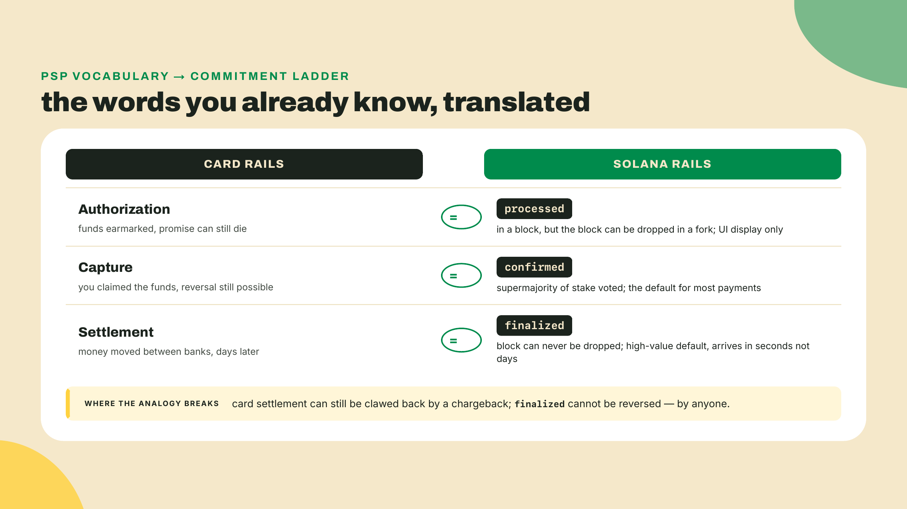
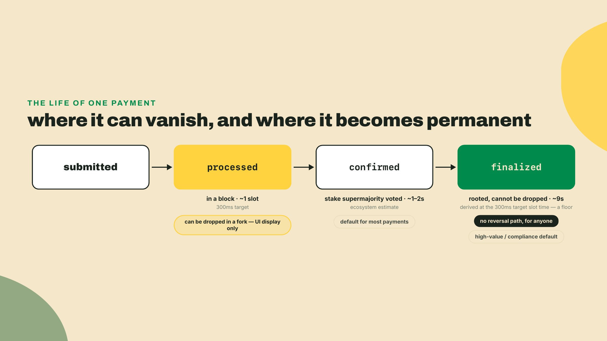
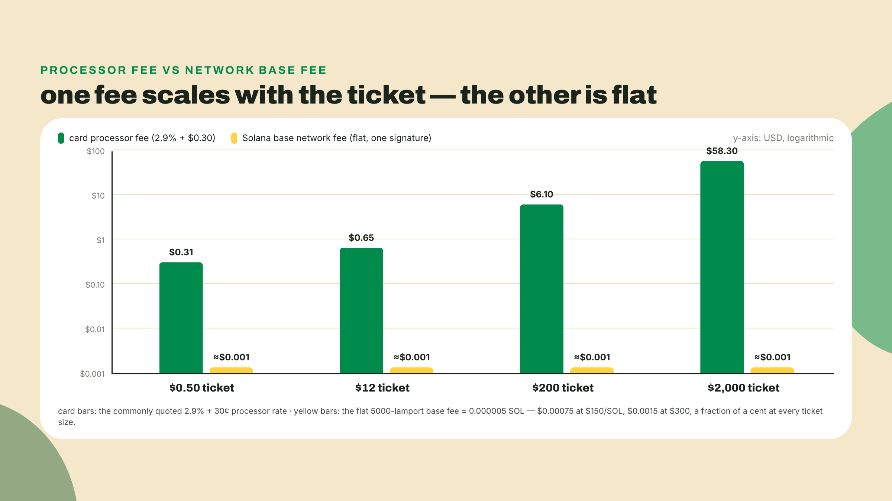
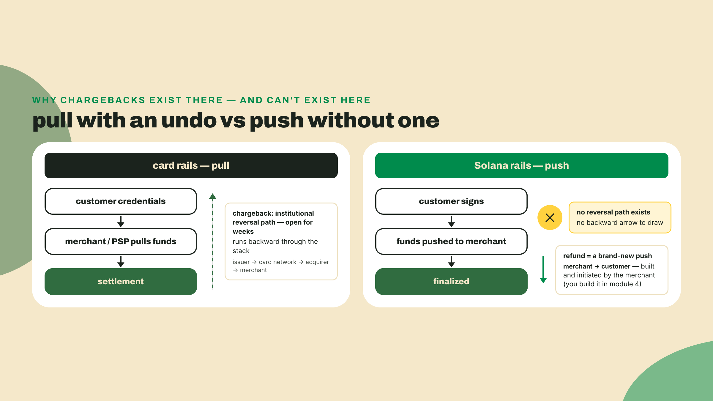
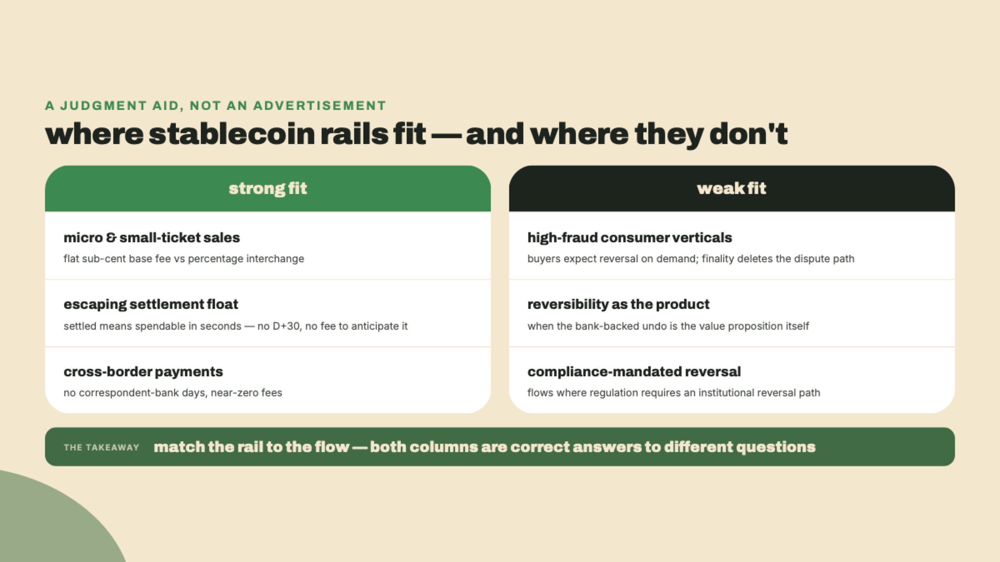
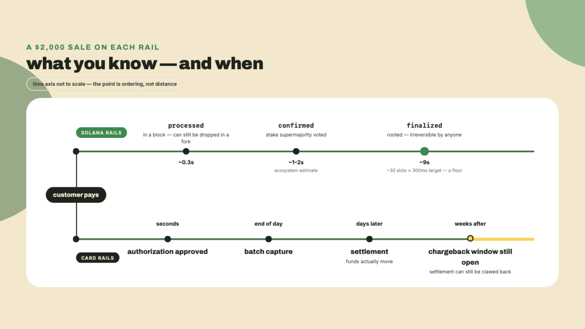

# Finality vs the card stack: the payments mental model

## Summary

Last lesson you decoded a live USDC transfer and scanned a payment QR your own terminal generated. This one is the course's mental-model lesson: the last one that is mostly thinking, though it still puts two scripts and a policy file in your folder. Three moves. First we lay your card vocabulary against Solana's commitment levels, one to one, and pull out the decision rule you will use on every payment: which level do you wait for, given what the payment is worth. Second we take apart what a payment costs here, because the cost differs from card fees in shape and not only in size, and the shape is what flips the economics of small-ticket sales and of the credit float every Brazilian merchant quietly finances. Third we stare straight at the asymmetry: settled transfers cannot be reversed, by anyone, ever, which deletes chargeback fraud and your customer's safety net in the same stroke. We close on the question every model needs: when are these rails the wrong choice?

How the work is shared out today: read the model with your hands in your lap, type along with me in the lab, and the challenge at the end you do alone. Each lesson hands you a little more of the work than the last, and from next module on you are building.

## The money-rails mental model

You watched money move last lesson. What you do not have yet is the model that explains why it moves the way it does, and that model is the difference between a checkout that quietly works and one that ships $2,000 of inventory against a payment that never existed.

So before any theory, run this. Same public RPC as last lesson, no wallet, no keys:

```bash
curl -s https://api.mainnet-beta.solana.com -X POST \
  -H "Content-Type: application/json" \
  -d '{"jsonrpc":"2.0","id":1,"method":"getSlot","params":[{"commitment":"processed"}]}'
```

You get back a nine-digit **slot** number, and that word needs its definition before the number means anything. A slot is a fixed time window, currently 300 milliseconds, in which one designated validator gets to produce a block. Slots tick forward forever, numbered from the network's first day, so a slot number is a clock reading and the difference between two of them is a duration you can multiply out. That is the whole trick you are about to perform.

Now run the command again with `"commitment":"finalized"` in place of `"processed"` and subtract the two results. The gap is usually somewhere around thirty slots, which at 300ms a slot is about nine seconds. Hold that number. By the end of this lesson you will know what that gap buys you, why your PSP never showed you anything like it, and why one of your best card instincts, "the bank can always claw it back," is about to become the most expensive assumption in your codebase.

Your PSP taught you three words: authorization, capture, settlement. These rails also have three words: `processed`, `confirmed`, `finalized`. The mapping between the two vocabularies is real and it will carry you a long way. The place where it breaks is where the money is.

### Your PSP vocabulary, translated

Start from what you already know, because it is genuinely good scaffolding. On card rails a payment is a staged promise. Authorization says the funds exist and are earmarked. Capture says you intend to take them. Settlement, days later, says the money actually moved between banks. Three stages, rising confidence, and your integration code keys off which stage you are in.

Solana has a ladder of rising confidence too. It is just measured in a different unit: how sure the network is that the block containing your payment will survive.

Three words carry that ladder, so take them now. A **validator** is one of the machines running the network. **Stake** is the SOL that validator has locked up as its skin in the game, and a validator's influence is proportional to it, so "the network's stake" is the right way to count heads here rather than counting machines. A **vote** is a transaction a validator publishes saying "I have seen this block and I am building on it", and votes are what turn one node's opinion into the network's.

- **`processed`**: some node has executed the transaction and put it in a block. That block can still be dropped if the network briefly disagrees about the chain's tip, which is called a fork. Think of it as seeing the card dip into the terminal. Something happened. Nothing is promised.
- **`confirmed`**: validators holding a supermajority of the network's stake have voted on the block. In practice this is the workhorse level, and reversal at this point stops being a realistic event.
- **`finalized`**: enough further blocks have been built and voted on top of your block that no fork can dislodge it. That is what fills the nine-second gap you measured: not waiting, but stacking. Vote after vote lands on later slots, and each one raises the cost of unwinding yours until it is beyond any coalition's reach. There is no deeper level. This is settlement, except it arrives in seconds instead of days.



So which level do you build against? The official guidance is qualitative, and worth quoting in shape: use `confirmed` for most payments, wait for `finalized` when the payment is high-value or compliance-sensitive, and treat `processed` as UI-only, because a processed transaction can be dropped in a fork. That single sentence is your policy engine. Everything else is tuning.

Now the numbers, carefully. How long does each rung take? Ecosystem experience puts `confirmed` at roughly one to two seconds, and the figures it used to quote for `finalized`, roughly ten to thirteen seconds, were gathered at older slot times. I want to be precise about what those figures are: estimates from people watching the network, not numbers printed in the official docs. The docs give you the qualitative table and stop. And any figure you derive from slot math has to use the current 300ms target slot time, not the 400ms or 350ms you will find in older articles, because that number is being cut in stages: 400ms dropped to 350ms on 2026-08-21, 350ms dropped to 300ms at epoch 1024 on 2026-08-28, and two further cuts, to 250ms and then 200ms, are already gated in the validator code and live on devnet. A tutorial that derives from 400ms now overstates every wall-clock figure by a third, and one that hardcodes today's 300ms will be stale the day the next gate flips. Target, note, not measurement: real wall-clock slot time runs a little above target when measured, so every number you derive from 300 is a floor rather than a promise. Your curl experiment from the opener already gave you the measurement: around thirty slots between `processed` and `finalized`, and thirty slots at the 300ms target is about nine seconds, a little more at measured slot times. That is the whole method, and the staged cuts are exactly why the method is worth more than any figure in this paragraph: derive it, never memorize it, because next month's number comes from the same two shell commands and one multiplication. It is worth noticing what you did not need to do: on card rails, settlement timing is a thing your acquirer tells you about in a PDF, and here you derived it yourself.



Here is the derivation that makes the policy rule yours instead of mine. Why not just always wait for `finalized` and be safe? Because nine-plus seconds is an eternity at a point-of-sale terminal, and for a $3 coffee the thing you are insuring against, a fork dropping a confirmed block, is not a risk worth nine extra seconds of a queue's time. Why not always use `confirmed` and be fast? Because "not a realistic event" and "impossible" are different engineering claims, and when the payment is $2,000 you buy the impossible one. The ladder exists so you can price the wait against the ticket. Your PSP made this decision for you and charged you for the privilege. Here, the decision is exposed, and it is yours. That is the recurring shape of this whole course: the rails hand you the raw dial and you build the policy.

One reflex to keep, one to bin. Keep the staged-confidence instinct; it maps beautifully. Bin the instinct that says the stages are somebody else's problem. There is no acquirer downstream of you rechecking anything.

### What a payment costs here

Time for the cost anatomy, and this is where the model stops being a translation exercise and starts being a business case.

On card rails you budget a percentage plus a fixed cut, something like 2.9% plus 30 cents on a typical processor. The percentage is the load-bearing part: the network takes a slice of the value moved, so a bigger sale costs more to move, and a tiny sale barely survives its own fees. Every pricing decision you have ever made downstream of that, minimum order sizes, surcharges, "card minimum $10" signs at the counter, exists because the fee is a percentage.

The base fee here is a flat 5000 lamports per signature, and that needs unpacking before it can be compared to anything. **SOL** is Solana's own native token, the one the network charges its fees in; it is not a stablecoin, its price floats, and it is a completely separate thing from the USDC your customers pay you in. A **lamport** is the smallest unit of SOL, one billionth of one. So 5000 lamports is 0.000005 SOL, and turning that into money is one multiplication by whatever SOL trades at when you run it.

Do the multiplication yourself rather than trusting a figure baked into a course: at $150 per SOL the fee is $0.00075, at $300 it is $0.0015. Across every price SOL has traded at, one signature costs a small fraction of one cent. That band is the defensible form of the claim, and it is the form you should quote in a meeting, because the dollar figure moves with a market and the lamport figure does not.

But cheap is not the interesting property. Flat is the interesting property. The network is charging you for a slot's worth of work, not taking a percentage of the value moved, so a $2,000 transfer and a $0.50 transfer cost the network the same fraction of a cent to settle.

Run one round-number example, the kind you will redo in your head for every product decision this course. A customer buys a $12 record from Wavelength Records, the store we are building. Card rails: 2.9% of $12 is about 35 cents, plus the 30-cent fixed cut, call it 65 cents, or 5.4% of the sale gone. These rails: a fraction of a cent, which at that ticket size is a rounding error on a rounding error, roughly three orders of magnitude less. Now shrink the ticket. A $0.50 sale on card rails costs 31 cents to process, so the fee eats 62 percent of the sale, and below about 31 cents the fee exceeds the whole ticket and the sale stops being possible at all. That is why nobody sells 50-cent things one at a time on the internet. Here the fee does not care that the ticket shrank. Whole categories of business, micro-payments, per-article pricing, pay-per-call APIs, stop being jokes and start being line items.



Two footnotes before the zoom-out, because a cost model with hidden line items is worse than no model. First, 5000 lamports is the base fee; busy moments can add a small priority fee on top, and you will meet that dial later in the course. Second, there is a one-time cost the per-payment fee hides: token accounts cost rent to create. Think of rent as the terminal rental in your card analogy, a fixed cost of standing up the till rather than a cut of each sale. What a token account actually is, and the exact rent line item, lands next module, where you will create one with your own hands. For today it is enough that the model has a slot for it: per-payment cost near zero, one-time account setup cost small but real.

Now zoom out, because the flat fee is the engine behind a number you already met. Last lesson gave you the stock: roughly $15.87B of stablecoins sitting on Solana. This lesson can give you the flow. In 2024, stablecoin transfer volume across chains was reported at $27.6 trillion, a figure Helius's stablecoin-payments guide says surpassed Visa and Mastercard combined (their dated claim, fetched 2026-08-21). On Solana specifically, the $1 trillion of 2025 volume from last lesson is a full-year figure, not a live counter. Divide that flow by that stock, and yes, this is rough arithmetic mixing a 2025 flow with a 2026 snapshot, but each circulating dollar turned over on the order of sixty times in a year. This is not parked money. It is money doing what money does when moving it costs nothing: it moves.

And the flat fee decides who gets to participate in that movement. The strongest version of that argument sits next to the till of every Brazilian store you have ever integrated. The visible line first: averaged across the market, the merchant discount rate runs 2.13% on credit and 1.08% on debit (my own computation from the BCB's DESCONTODA API series, Q1 2026). The second axis is the one this lesson has not priced: time. An à vista credit sale settles to the merchant on a D+30 schedule, and a 12x parcelado sale drips in across twelve monthly installments. The customer left with the goods; your revenue is on a payment plan.

The acquirers price that wait in public, so you do not have to guess what it is worth. InfinitePay's table for its top volume tier, merchants above R$80,000 a month (fetched 2026-09-01; the page itself carries no date), offers credit à vista at 1.62% on the settlement schedule and 2.69% at D+1. The 12x line reads 2.25% per installment against 8.99% for the whole sale at D+1 — and read "per installment" the way the rate sheet means it: 2.25% taken from each installment as it settles, which totals 2.25% of the sale, not 2.25% stacked twelve times. The 8.99% buys the same sale's money at D+1 instead of dribbling in over a year — money that would otherwise reach you six and a half months out on average. Both spreads resolve to about 1.05% a month, the figure a Brazilian rate sheet writes as 1.05% a.m. That is not a processing fee. It is interest, and the principal is your own revenue: antecipação is the industry selling you your money back, early, at a running monthly rate.


And the smaller you are, the worse the deal. Those tidy numbers belong to the R$80,000-a-month tier; walk down the schedule and the same 12x sale costs 20.39% below R$3,000 a month of volume and 11.51% above R$30,000 on Ton's posted rates, or 22.59% against 13.69% on Mercado Pago's. A flat 5000-lamport fee does not know your monthly volume, and that indifference is the point.

Nor is the priced-in wait a niche product for cash-strapped stores. Núclea, the clearing house where Brazilian card receivables are registered, reports R$614.9 billion of antecipação volume against R$428.6 billion in its reading before, with 33.4% more establishments anticipating (figures verified for this course on 2026-09-01). Financing yourself out of your own receivables is the operating norm, and it is growing on both axes. Stand this lesson's rails next to that machine: settled means spendable, in seconds, for a flat fraction of a cent, at any volume tier, because the receivable that whole industry monetizes never exists. Here the float is deleted rather than discounted.

Before you take that argument anywhere near a Brazilian finance lead, say the next sentence yourself, before they say it to you. PIX costs the customer nothing and costs a merchant either nothing or a fraction of a percent — the BCB mandates gratuity only for pessoas físicas (Resolução BCB 19/2020), so PSPs may and do charge CNPJs: Stone posted 0%, Mercado Pago 0.49% for a new seller, and Ton 0.99% after its trial window when these were read off the providers' own pricing pages (fetched 2026-09-01; PSP pricing is promotional and moves, so re-read before quoting any of it) — it is instant, and for a plain domestic BRL sale it beats card rails and it beats what this course builds. That is the honest baseline of Brazilian payments, and this course will not pretend otherwise. If the sale in front of you is one PIX serves, a customer paying now in reais, use PIX, and do not let anyone sell you a blockchain for it. A payments course that cannot say that sentence out loud is an advertisement.

So why does the float argument survive that concession? Look at which rail PIX actually beat. ABECS, the association that represents Brazil's card-payments industry, put full-year 2025 volume at R$3.1 trillion on credit against R$1 trillion on debit, with interest-free installments (parcelado sem juros, or PSJ) accounting for 42.6% of that credit total (ABECS's Balanço 2025 release, published 2026-02-11). PIX won the debit fight; the instant pay-now sale already belongs to it. What it did not replace is credit, because a parcelado sale is the customer buying delay itself, and PIX does not sell delay. Neither does anything this course builds, so be precise about the residual. Flip that 42.6% around: the rest of the credit book splits between à vista and interest-bearing installments, and it is the à vista slice — single-charge sales sitting on the credit rail out of habit, points, or a checkout default, while the merchant funds a D+30 float nobody asked for — that a push rail can contest without pretending to sell installments. So the comparison is not PIX, whose fight is over. What remains is the credit stack, and you now know how to read its full price: the visible percentage, plus the float, on terms that get worse as you get smaller. Cheap rails do not just make existing payments cheaper. They change which of a merchant's costs are laws of nature and which are line items you can refuse.

### The asymmetry: no one can claw it back

Here is the part of the model your card instincts will fight hardest, so let us derive it instead of asserting it.

On card rails a payment is a pull. The customer hands you credentials and you, through your PSP, pull the funds out of their account. Because the system is built on pulling, it needs an undo: the customer must be able to dispute a pull they did not authorize, so the network runs an institutional reversal path, issuer to network to acquirer to you, and a chargeback can travel back through it weeks after settlement. You have felt the cost of that machinery: fraud holds, rolling reserves, the $15 chargeback fee on a $12 sale, funds you "have" that you cannot touch for days. The reversal path was never bolted on; it is the price the whole stack pays for pull-based money.

On these rails a payment is a push. The customer signs a transaction moving their funds to you; nobody, including you, ever gets to reach into their account. And once that push is finalized, it is final in the physics-of-the-ledger sense: there is no institutional reversal path, no network operator with an undo button, no bank to call. Every settled transfer is permanent, full stop.

Now derive the consequences instead of stopping at the slogan, because they cut both ways.

Merchant side, the wins are real: chargeback fraud is not reduced, it is structurally impossible; there are no rolling reserves because there is nothing to reserve against; settled means spendable, in seconds. The entire dispute-management industry your PSP bills you for has nothing to manage.



Customer side, the same property reads very differently. The undo your customer has been trained to trust for their whole adult life is gone. If they get scammed, there is no dispute process waiting. If they fat-finger an address, the network will not help them; a mistaken send has no bank to call. And your operational reality changes with it: refunds still have to exist, customers will rightly demand them, but the network gives you nothing. A refund becomes a voluntary push payment in the other direction, one you design, fund, authorize, and build. Go look for the refunds page in the official payments docs at solana.com/docs/payments. There isn't one: the sidebar runs from transfers through Solana Pay and stops, and no page anywhere under it describes reversing a settled payment. That absence is the asymmetry stated as documentation: reversal logic here is an application feature rather than a rails feature, and in module 4 you will build it, order matching, partial refunds, the works.

I will confess the reflex this lesson is really targeting, because I have been guilty of it: treating finality as a detail to note rather than an architecture to design around, mentally filing "no chargebacks" as pure upside for weeks before it clicked that I had also silently deleted my customers' entire safety net and put the rebuild on my own roadmap. The no-chargeback asymmetry is not a discount. It is a transfer of responsibility, from the card network's dispute machinery to your codebase. Price it properly and it is a trade many businesses should take. Price it as a free lunch and it becomes a support-ticket queue with your name on it.

### When these rails are the wrong choice

Every mental model this course hands you comes with the same final section, and it is the one that keeps you credible in a design review.

If the business you are integrating depends on bank-backed dispute rights, buyer-initiated reversals, or card-network chargeback protection, then no-chargeback finality removes exactly the thing being depended on. A high-fraud consumer vertical where shoppers expect reversal on demand is a bad fit, not because the tech fails, but because the customer's core expectation is the one property these rails delete by design. The same irreversibility that drops your fraud cost to near zero also removes the institutional undo your buyer may believe, reasonably, that they are owed. You can rebuild trust machinery in the application layer, and later modules do, but you should walk in knowing you are rebuilding something card rails gave you for free.

Where do these rails fit best? Low-fee, instant-settlement flows: the sales where percentage-based interchange eats the ticket, where a receivables schedule stands between revenue and payroll, and, further down the list, sales that cross a border, where correspondent banking still eats days. Where do they fit worst? Wherever reversibility is the product. If what your customer is really buying is the ability to change their mind after the money moves, sell them card rails. Knowing when not to use your new tool is the model working.



That is the whole model: a ladder you choose a rung on, a fee whose shape flips your unit economics, and an asymmetry that trades fraud cost for responsibility. Time to make it produce decisions.

## Lab: probe the ladder and price a payment

The lab formalizes your opener experiment into a small tool, reads a real fee off mainnet, and ends with you writing the first draft of a real confirmation policy. Type along. You need the Node 24 you set up last lesson; both scripts here use Node's built-in `fetch`, so there is nothing to install.

1. Work in the `wavelength-rails` folder you made last lesson, and create a file called `commitment-ladder.mjs`:

   ```js
   // commitment-ladder.mjs
   // Probes mainnet's three commitment levels and prints how far each trails
   // the tip, in slots and in wall-clock time. Node 24 (built-in fetch), no deps.
   const RPC = process.env.RPC_URL ?? "https://api.mainnet-beta.solana.com";

   // Mainnet target slot time in ms. 300ms since epoch 1024 (2026-08-28),
   // the second SIMD-0525 staged cut after 350ms took force on 2026-08-21.
   // Two more cuts, 250ms and then 200ms, are gated in the validator code
   // and live on devnet, so re-check this constant before trusting it.
   const SLOT_TIME_MS = 300;

   async function getSlot(commitment) {
     const res = await fetch(RPC, {
       method: "POST",
       headers: { "Content-Type": "application/json" },
       body: JSON.stringify({
         jsonrpc: "2.0",
         id: 1,
         method: "getSlot",
         params: [{ commitment }],
       }),
     });
     const json = await res.json();
     if (json.error) throw new Error(`RPC error: ${json.error.message}`);
     return json.result;
   }

   const levels = ["processed", "confirmed", "finalized"];
   const slots = {};
   for (const level of levels) {
     slots[level] = await getSlot(level);
   }

   console.log("commitment   slot          behind tip   approx wall-clock");
   for (const level of levels) {
     const behind = slots.processed - slots[level];
     const secs = ((behind * SLOT_TIME_MS) / 1000).toFixed(1);
     console.log(
       `${level.padEnd(12)} ${String(slots[level]).padEnd(13)} ${String(behind).padEnd(12)} ~${secs}s`
     );
   }
   ```

   Expected result: a saved file next to last lesson's `watch-a-dollar.ts`. Nothing has run yet.

2. Run it:

   ```bash
   node commitment-ladder.mjs
   ```

   Checkpoint: three rows, with `processed` at zero behind, `confirmed` anywhere from zero to a handful of slots back, and `finalized` roughly 25 to 40 slots back, which at 300ms a slot is roughly eight to twelve seconds, your nine-second neighborhood. Run it three or four times. The slot numbers march forward; the gaps stay roughly put. You are watching the ladder breathe. (The three calls race the chain's tip between requests, so a gap can wobble by a few slots run to run, and `confirmed` can even print a small negative number when the tip advanced between your first and second call. That jitter is the measurement, not a bug.)

3. Now read a real fee off the chain. Create `fee-anatomy.mjs`. One caveat on what it grabs: it takes the most recent clean transaction that touched the USDC mint account, and not everything that touches a mint is a payment. You may land on a transfer, or on some protocol's bookkeeping. The fee anatomy is identical either way, which is the point, but do not narrate the output to anyone as "a customer paid this".

   ```js
   // fee-anatomy.mjs
   // Finds a recent finalized transaction touching the USDC mint and prints
   // its fee, split into base fee and priority tip. Node 24, no deps.
   const RPC = process.env.RPC_URL ?? "https://api.mainnet-beta.solana.com";
   const USDC_MINT = "EPjFWdd5AufqSSqeM2qN1xzybapC8G4wEGGkZwyTDt1v";
   const BASE_FEE_PER_SIG = 5000; // lamports, flat, per signature

   async function rpc(method, params) {
     const res = await fetch(RPC, {
       method: "POST",
       headers: { "Content-Type": "application/json" },
       body: JSON.stringify({ jsonrpc: "2.0", id: 1, method, params }),
     });
     const json = await res.json();
     if (json.error) throw new Error(`RPC error: ${json.error.message}`);
     return json.result;
   }

   const sigs = await rpc("getSignaturesForAddress", [
     USDC_MINT,
     { limit: 10, commitment: "finalized" },
   ]);
   const sig = sigs.find((s) => s.err === null)?.signature;
   if (!sig) throw new Error("No clean signature in the last 10; run it again.");

   const tx = await rpc("getTransaction", [
     sig,
     { maxSupportedTransactionVersion: 0, commitment: "finalized", encoding: "json" },
   ]);

   const fee = tx.meta.fee;
   const sigCount = tx.transaction.signatures.length;
   const base = BASE_FEE_PER_SIG * sigCount;
   console.log(`signature:    ${sig}`);
   console.log(`signatures:   ${sigCount}`);
   console.log(`total fee:    ${fee} lamports`);
   console.log(`base fee:     ${base} lamports (5000 per signature)`);
   console.log(`priority tip: ${fee - base} lamports (anything above base)`);
   ```

   Expected result: a second saved file. Two scripts now, one for the ladder and one for the fee.

4. Run `node fee-anatomy.mjs`. Checkpoint: a total fee in lamports, decomposed. With one signature the base line reads 5000; whatever sits above it is a priority tip the sender chose to add. **A priority tip of 0 is a correct and extremely common result**, not a broken script: most senders add nothing when the network is quiet, so `priority tip: 0 lamports` means the sender paid the floor and nothing more. Convert the total using the arithmetic from the cost section: divide lamports by a billion for SOL, then multiply by today's SOL price. Even a generous tip leaves the whole thing a fraction of a cent. The same public-RPC caveat as last lesson applies: the free mainnet endpoint will rate-limit you if you hammer it, so if you see an HTTP 429 or an RPC error, wait a few seconds and rerun.

5. Extend the Rosetta table you built in last lesson's challenge. Open it: you already mapped signature, sender, amount, mint, memo, and settledAt to their card-rail equivalents, with a leak column for each. This lesson introduced three more things worth a card-rail name, so append three rows and fill the leak column yourself:

   | On-chain thing | Card-rail analogue | Where the analogy leaks |
   |---|---|---|
   | base fee (5000 lamports, flat) | interchange plus processor fee | ? |
   | token-account rent (next module) | terminal rental, a one-time setup cost | ? |
   | `finalized` | settled funds | ? |

   Expected result: your table from last lesson, now nine rows deep, with the three new leak cells written by you. If the `finalized` row's leak column does not say something about clawbacks, you have the point of this whole lesson still ahead of you.

6. Start the artifact this lesson actually produces: create `commitment-policy.md` with four headings, `High-value orders`, `Everyday payments`, `Micro-payments`, and `UI display`, and under each write one sentence naming the commitment level you will wait for and one sentence defending it. Leave it rough. The challenge fills two of these headings properly and module 4's payment-ops lessons turn the file into running code.

   Expected result: a four-heading markdown file with eight rough sentences in it. This is the only thing you carry out of this lesson, so keep it where you will find it.



## Challenge

No code-along here; this one is yours. Two payments arrive at Wavelength Records.

First: a $2,000 order under `High-value orders`, a collector buying a wall of first pressings, shipping today. Second: a $0.40 charge under `Micro-payments`, one call to the pressing-price API that Wavelength quotes to other labels, billed per lookup. Those two headings are the ones you fill; leave `Everyday payments` and `UI display` as the rough sentences you already wrote. For each of the two, write: the commitment level you release the goods on, the concrete risk you are accepting by not waiting longer, and the concrete cost you are refusing to pay by not waiting, in that order. Use the qualitative rule from this lesson plus your own measured ladder numbers, and remember what the timings are: estimates you verified, not gospel you inherited.

Then close the file with two sentences that have nothing to do with commitment levels. Name the one card reflex from your existing integrations that does not port to these rails, and name what its absence forces you to build later in this course. If your two sentences mention clawbacks and refunds, you have the model.

That is the produced decision this lesson gates on: a policy you can defend out loud, not a page you nodded through. If your defense of the $2,000 case does not mention forks, reread the ladder section; if your defense of the $0.40 API call does not mention fee shape, reread the cost anatomy.

This one ran long for a lesson with no build in it, but the model had to be earned, not asserted. If any rung of it still feels wobbly, or your policy file came out different from where you expected, bring it to the course community and argue it; a defended disagreement teaches better than a nodded-through table.

You can now defend a confirmation policy, and you know refunds are your job, not the network's. Next module we stop talking and build: the transfer-kit every later lesson imports, starting with the one primitive this lesson kept deferring. The token account, and the rent it costs to create, are up first. Keep the policy file safe: module 4's server-side verifier is where those three headings stop being prose and become the commitment argument your code actually passes.
