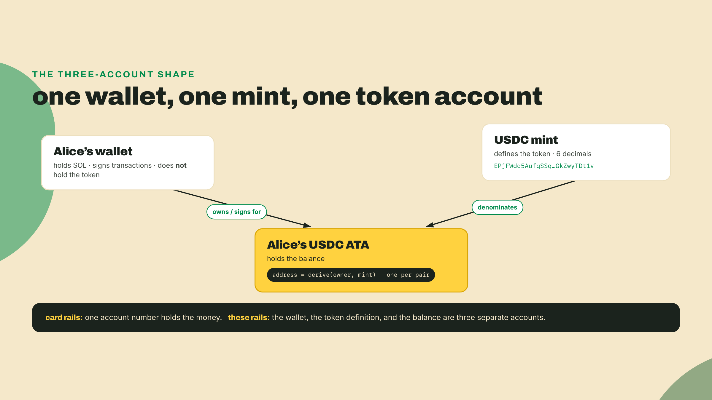
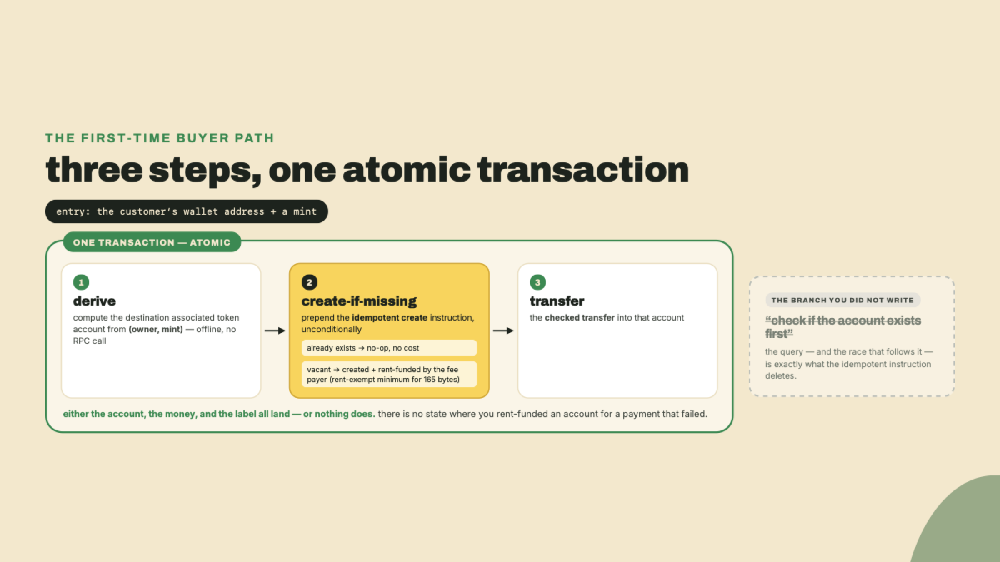
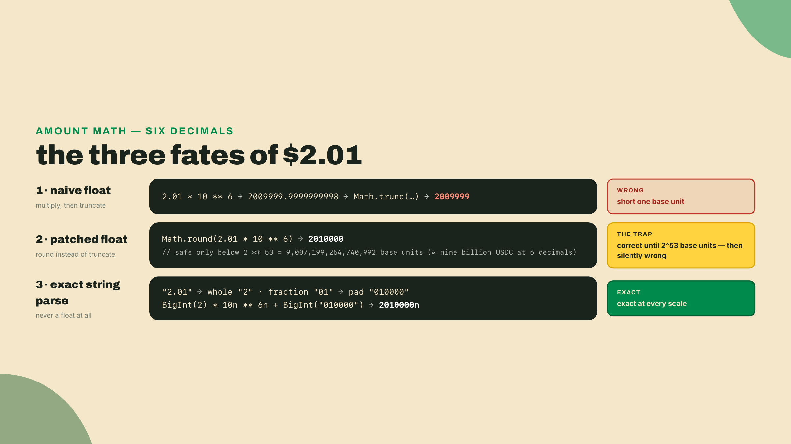
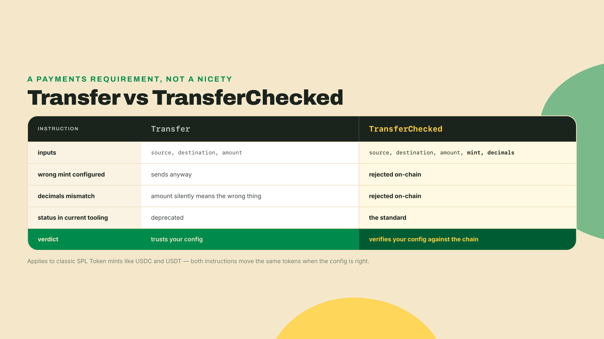
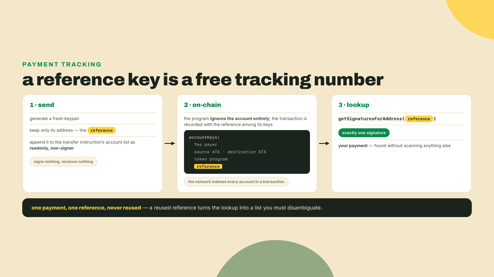
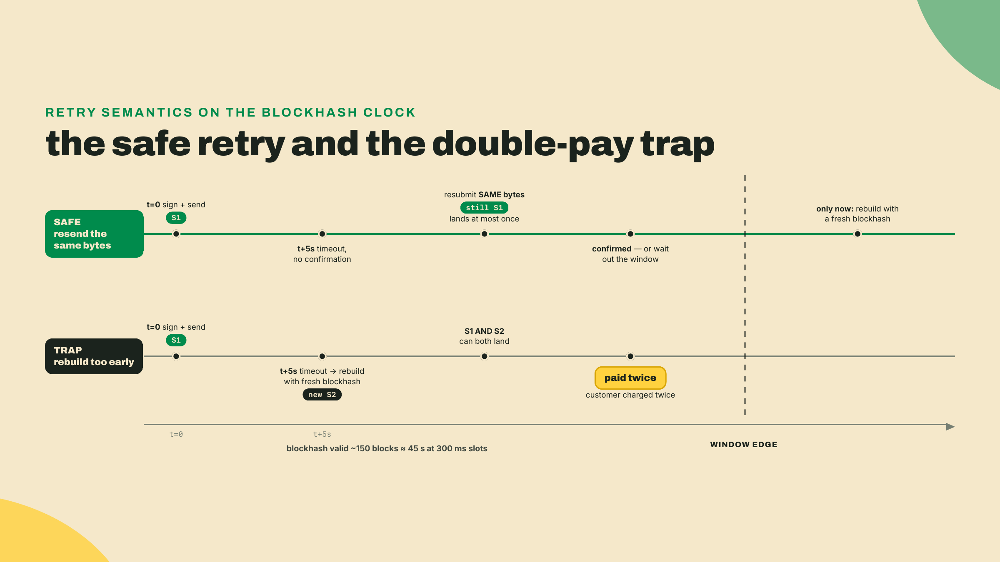
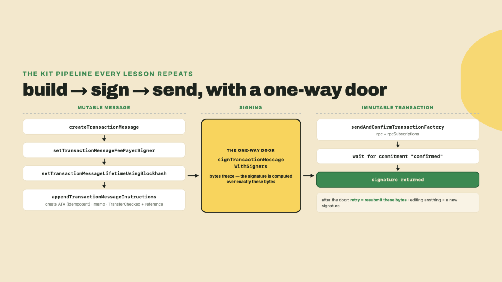
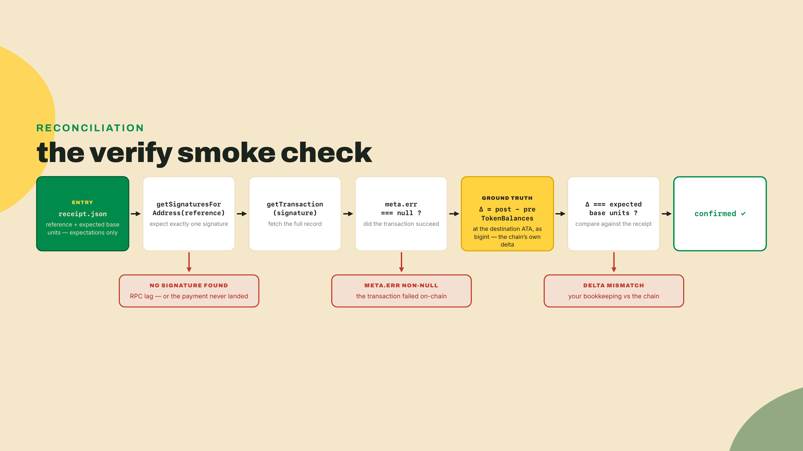
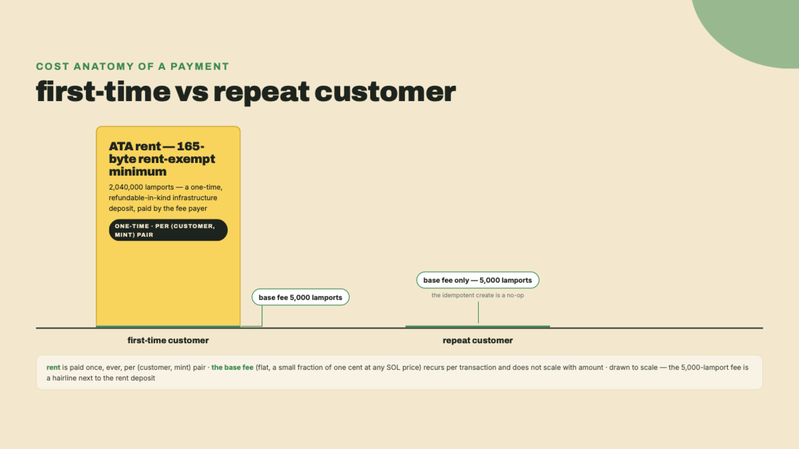

# Anatomy of a USDC payment: mints, ATAs, and the transfer-kit

Module 1 gave you the money-rails model. You mapped card auth, capture, and settlement onto `processed`, `confirmed`, and `finalized`, you decoded a live USDC transfer off the public ledger, and you scanned a payment QR your own terminal generated. The one thing you produced that outlives the lesson is a document: `commitment-policy.md`, the confirmation policy you wrote and defended. Keep it open beside you; step 6 asks you to check one line of code against it, and module 4 is where it becomes running code.

A note on the folder, because this lesson starts a new one. `wavelength-rails` from module 1 was scratch space: a handful of throwaway probe scripts and the policy file. It has done its job. Copy `commitment-policy.md` into the `wavelength` workspace you are about to create, at the top level, then leave `wavelength-rails` alone or delete it; nothing later in the course reads from it. From here on, `wavelength` is the one directory this course lives in, and every command states whether it runs from that root or from inside a workspace folder.

Before a single concept, run this in any terminal with Node installed:

```bash
node -e "console.log(2.01 * 10 ** 6, Math.trunc(2.01 * 10 ** 6))"
```

You get back:

```
2009999.9999999998 2009999
```

Read that twice. A customer typed $2.01, you multiplied by a million to get USDC's smallest unit, and JavaScript handed you a number that is one unit short. Truncate it, the way half the tutorials on the internet do, and you just underpaid. No error thrown, no warning, nothing in your logs. The two traps nobody warns a product engineer about are both in this lesson: floating-point money math that quietly sends the wrong number of cents, and the fact that the wallet you are paying may not even own a USDC account yet, so the payment fails before it starts. By the end of this lesson both traps are dead, killed by a module you will reuse in every remaining lesson of this course.

## Summary

This is the course's first build lesson. The artifact is `transfer-kit`: a TypeScript module exporting `toBaseUnits` and `fromBaseUnits` (exact integer money math), `resolveAta` (find where a wallet holds a token, offline), and `sendStablecoin` (a checked transfer carrying a memo and a reference key). You will send a real USDC payment on devnet, print its signature and its reference key, and then prove the payment exists by locating it from the reference alone with a verify smoke check. Every later checkout rung imports this kit, so the interfaces you write today are load-bearing.

How the work is shared out today: this lesson is a worked example with a full scaffold, so type along with me all the way through. The coding challenge at the end, parsing customer-typed amounts, is your first piece of solo work. Adding a second token to the kit is the unguided close. Next lesson you get less scaffolding, on purpose: the scaffold arrives with a hole in it.

## The shape of a stablecoin payment

### A mint is the token; your wallet never holds it

First definition, just in time: a **mint** is the on-chain account that IS a token. One account defines USDC on Solana: its supply, its decimal places, who can create more. Every USDC balance anywhere on the chain points back at it. On mainnet that account is `EPjFWdd5AufqSSqeM2qN1xzybapC8G4wEGGkZwyTDt1v`, and it declares 6 decimals. USDT is another mint, `Es9vMFrzaCERmJfrF4H2FYD4KCoNkY11McCe8BenwNYB`. On devnet, where we build, Circle publishes a test USDC mint at `4zMMC9srt5Ri5X14GAgXhaHii3GnPAEERYPJgZJDncDU`. Three addresses, one shape. Your kit will treat "which stablecoin" as a parameter, which is why adding USDT later tonight will take you five minutes.

Here is the part that breaks the mental model you brought from card rails. Your customer's wallet address does not hold USDC. It cannot. A wallet holds SOL natively, and that is all it holds. Token balances live in separate accounts, one per owner and mint, and the standard home for a balance is called the **associated token account**, the ATA. (The owner and the mint are the two seeds you will care about today; there is a third, the token program that owns the mint, and it becomes load-bearing next lesson. The code below passes it explicitly, so do not be surprised to see three arguments where the prose says two.) Alice's wallet is one address; Alice's USDC lives at a second address; Alice's USDT would live at a third. When you pay Alice, tokens move between token accounts, and her wallet signs for the one she owns.



How do you find Alice's USDC account if she never told you its address? You compute it. An ATA is a program-derived address: deterministic, computed from the owner, the mint, and the mint's token program, owned by a program, no private key, hold that thought for module 5. For today, the practical consequence is the entire point: given any wallet and any mint, your code can derive the exact token account address without asking anyone, no lookup, no RPC round trip, no message to the customer. `resolveAta` will be four lines.

### The account your customer might not have

Now the trap. Derivable is not the same as existing. If Bob has never held USDC, the address where his USDC would live is computable but vacant: no account exists there. Send tokens at a vacant address and the transfer fails. On card rails the acquiring bank guarantees the destination exists; here, nobody does. Every first-time customer arrives without a landing pad, and your checkout is the thing that notices.

The fix is that whoever pays can create the account in the same transaction, and creating it costs real money: an ATA is 165 bytes and needs enough lamports deposited to make it rent-exempt. Last module I promised you the one-time line item card rails never showed you. This is it, the terminal rental of these rails: a fixed cost of standing up the till, not a cut of each sale. The associated-token-account program even ships an idempotent version of its create instruction, create-if-missing, which turns "does the account exist?" from a question you ask into a question you never need to ask. Your kit will prepend it to every payment unconditionally: if the account exists it is a no-op, if it does not you just funded your customer's landing pad.

Ask the network what that deposit is rather than trusting any number you read, including mine:

```bash
curl -s https://api.devnet.solana.com -X POST -H 'Content-Type: application/json' \
  -d '{"jsonrpc":"2.0","id":1,"method":"getMinimumBalanceForRentExemption","params":[165]}'
```

On devnet on 2026-09-07 that answered `1488440` lamports, about 0.0015 SOL; the same call against mainnet answered `1855569`, about 0.0019 SOL. Two things to take from those being different numbers. First, the rent rate is a cluster runtime parameter, not a constant of the token program, so a figure copied from a tutorial is a figure from somebody else's cluster on somebody else's day. Second, it is actively falling: SIMD-0437 is stepping the per-byte rate down (the rent-exempt minimum is `(128 + bytes) × rate`, and 165 + 128 = 293, which is why every account size scales by the same factor when the rate moves), mainnet took its first step on 2026-09-03, devnet is already a step ahead of it, and further steps are scheduled. Older material — and older sentences in this course's own history — quotes 2,039,280 lamports for this account, which was correct before that first step and is now about 37% high on the cluster your labs run against — the same move stated the other way round is a 27% reduction, and the two numbers are easy to swap. Run the curl.

That is the trade-off, and I want it on the table before we build. Integer base units are exact but unforgiving: you now own the decimals bookkeeping the float shortcut used to hide. And paying a brand-new customer can require creating and rent-funding their ATA first, a real cost of roughly a thousandth of a SOL and an extra failure mode on every first-time buyer. Neither cost is hidden anymore. That is the deal on these rails, over and over: the machinery is exposed, and you are the one holding it.



### Money as integers, or the $2.01 bug dissected

The opener's one-liner failed because the chain does not store 2.01. It stores an integer count of the smallest unit. At 6 decimals, one USDC is 1,000,000 **base units**, so $2.01 is exactly 2,010,000 of them. Integers are the only honest representation of money, and the token program only ever speaks integers.

JavaScript's ordinary numbers are 64-bit floats, and floats cannot represent most decimal fractions exactly. `2.01` is stored as something a hair under 2.01, multiply it by a million and you get `2009999.9999999998`, truncate and you are short one unit. You might patch it with `Math.round` and your tests will pass, and here is why that patch is a time bomb rather than a fix: floats are only exact for integers up to 2 to the 53rd power, which is 9,007,199,254,740,992. Past that, doubles physically cannot represent every integer, so the rounding error stops being fractional and becomes silent whole-unit drift that no rounding call can recover. At 6 decimals that ceiling sits around nine billion USDC, which sounds unreachable until you remember base units are also how you will sum daily volume, hold treasury balances, and process batch payouts. And for 9-decimal tokens, the ceiling drops to about nine million, well inside one whale's balance. The rule that survives every scale: money math never touches a float, not once, not in the middle. Parse the customer's decimal string directly into a `bigint`.



One asymmetry completes the money model. Conversion runs in two directions, and only one of them is dangerous. Going inward, customer string to base units, is where payments are made or corrupted, so it gets the paranoid treatment. Going outward, base units to a display string, is honest formatting: `12500000` at 6 decimals renders as `12.5`, done with string slicing on the same no-float principle, and if a UI later chooses to display `12.50` with a trailing zero, that is a presentation choice that touches nothing. The kit ships both directions as a pair, `toBaseUnits` and `fromBaseUnits`, because a system that can only encode money and never audit it back out is half a system, and the verify step at the end of the lab leans on the outward trip to report what actually moved.

### TransferChecked, the memo, and the reference key

Three more pieces and the theory is done. Read them as answers to three product questions: how do I not send the wrong thing, how do I label a payment, and how do I find it again later?

Not sending the wrong thing: the token program has two transfer instructions, and your kit uses the strict one. Plain `Transfer` takes a source, a destination, and an integer amount, and trusts you on everything else. **TransferChecked** additionally takes the mint address and the decimals, and the program verifies both against the accounts on-chain, rejecting the transaction on any mismatch. Ship the wrong mint in your config and the transaction is rejected. Let decimals drift between your code and reality and it is rejected again, instead of sending a payment off by orders of magnitude. Plain `Transfer` is also deprecated in the current tooling, so the choice makes itself: an instruction that carries its own sanity check is exactly what money deserves.



Labeling: a **memo** is a tiny instruction from the memo program that attaches a short string to the transaction, permanently and publicly. Order IDs, invoice references, "wavelength-order-0001". Public is the operative word: never put customer names or emails in one, the whole world can read it. Think of it as the reference field on a bank transfer, minus the privacy.

Finding it again: this one is the quiet star of the whole course. A **reference key** is a fresh, unique address, 32 bytes, that you attach to the transfer instruction as an extra account. It signs nothing, receives nothing, does nothing. But every account that appears in a transaction becomes searchable, so a signature lookup on that address returns exactly one payment: yours. Generate a unique reference per payment and you have given every checkout a tracking number the network indexes for free. When your customer says "I paid," you do not scan the ledger hoping to match amounts; you look up the reference. Module 4's entire reconciliation engine stands on this trick, and the QR you scanned last module already carried one.



One piece of history, because this exact trio is older than it looks. When Shopify announced Solana Pay support on 2023-08-23, with MonkeDAO, Mad Lads, and Helius among the first users, the pitch was eliminating bank fees, chargebacks, and holding times, and the payment under the hood was precisely this: a checked stablecoin transfer plus a reference key for matching. The live path today runs through MoonPay Commerce's plugin, but the primitive never changed. You are about to build the same push payment that shipped to Shopify merchants, small enough to fit in one file.

## Lab: build transfer-kit

Numbered and hands-on from here. Steps 1 and 2 are setup, terse on purpose; the interesting decisions get their why inline.

### 1. Tools, keys, and devnet SOL

You need Node 24 or later (`node --version` to check) and the Solana CLI. Node 24 is not an arbitrary floor: the `@solana-program/*` clients pinned in the next step declare `node >= 24`, and an older runtime earns an `EBADENGINE` warning on every install from here on. Install the CLI with Anza's installer:

```bash
sh -c "$(curl -sSfL https://release.anza.xyz/stable/install)"
```

Restart your shell, then create a keypair and point the CLI at devnet:

```bash
solana-keygen new --no-bip39-passphrase
solana config set --url devnet
solana airdrop 2
```

`solana-keygen new` writes a keypair file to `~/.config/solana/id.json`; that file is your merchant identity for the rest of the course, and the kit will load it directly. One hygiene rule, stated once and early: this is a plaintext development key for devnet play money, so never send real mainnet funds to it, and when this course later touches mainnet the signing setup changes before anything else does. The airdrop gives you free devnet SOL for fees and rent. If it complains about rate limits, wait a minute and retry, or use the web faucet at faucet.solana.com. Confirm with `solana balance`; any nonzero number means you are ready.

One more account before the code, because module 4 assumes you already have it. Go to dashboard.helius.dev, sign up (the free tier covers everything this course does), and copy the API key from the dashboard. Put it in your shell profile so it survives a new terminal:

```bash
echo 'export HELIUS_API_KEY=<paste-your-key>' >> ~/.zshrc   # or ~/.bashrc
source ~/.zshrc
echo $HELIUS_API_KEY   # must print your key, not an empty line
```

You will not use it today. The webhook lesson in module 4 creates a devnet webhook with it, and that is the only place in this course that needs one; no RPC call you write uses it. Your RPC goes to public endpoints throughout: devnet for everything you send, and mainnet read-only in the couple of lessons that inspect live accounts.

### 2. The workspace, with pinned versions

Create the project the whole course lives in:

```bash
cd ~ && mkdir wavelength && cd wavelength
npm init -y
npm pkg set type="module"
mkdir -p transfer-kit/src
npm init -y --workspace transfer-kit
npm pkg set type="module" --workspace transfer-kit
npm install --workspace transfer-kit @solana/kit@^6.10.0 @solana-program/token@0.14.0 @solana-program/memo@0.11.2
npm install --workspace transfer-kit --save-dev typescript@^5.6.0 tsx@^4.19.0 @types/node
```

These pins are not the newest numbers on npm, and I refuse to hand you a mystery, so here is where each one comes from. As of 2026-08-22, verified against the registry while writing this: npm's latest `@solana/kit` is the 8.x line, and the ecosystem's broad peer standard is v7. We pin the v6 line, which ended at 6.10.0, because `@solana/pay`, the library our checkout rungs adopt in module 3, declares a peer dependency on kit ^6.9, and every later lesson imports this kit. `@solana-program/token@0.14.0` is the last release compatible with kit v6 (0.15.0 jumps its peer range to kit ^7, and installing it beside kit 6 is an npm error, not a warning), and `@solana-program/memo@0.11.2` is the same story for the memo client. Version pins go stale, so treat this paragraph as dated: when you build outside this course, read the peer ranges on npm and pin to what your dependency graph actually demands. Add a `tsconfig.json` at the workspace root:

```json
{
  "compilerOptions": {
    "target": "ES2022",
    "module": "NodeNext",
    "moduleResolution": "NodeNext",
    "strict": true,
    "noEmit": true,
    "skipLibCheck": true
  },
  "include": ["transfer-kit/src"]
}
```

Checkpoint: `npm ls --workspace transfer-kit @solana/kit` resolves to `@solana/kit@6.10.x` and prints no peer-dependency error. If npm reports an `ERESOLVE` conflict instead, one of the three pins drifted; fix it here, because every file below is built against exactly these.

### 3. Exact money math: `amounts.ts`

First file, and it is the one the opener's bug dies in. Create `transfer-kit/src/amounts.ts`:

```typescript
/** Exact decimal-string -> integer base units. No floats anywhere. */
export function toBaseUnits(amount: string, decimals: number): bigint {
  const match = /^(\d+)(?:\.(\d+))?$/.exec(amount.trim());
  if (!match) {
    throw new Error(`unparseable amount: "${amount}"`);
  }
  const [, whole, fraction = ''] = match;
  if (fraction.length > decimals) {
    throw new Error(
      `"${amount}" has ${fraction.length} decimal places; this mint supports ${decimals}`,
    );
  }
  const padded = fraction.padEnd(decimals, '0');
  return BigInt(whole) * 10n ** BigInt(decimals) + BigInt(padded || '0');
}

/** Integer base units -> display string, exact, trailing zeros trimmed. */
export function fromBaseUnits(units: bigint, decimals: number): string {
  const digits = units.toString().padStart(decimals + 1, '0');
  const whole = digits.slice(0, digits.length - decimals);
  const fraction = decimals === 0 ? '' : digits.slice(digits.length - decimals);
  const trimmed = fraction.replace(/0+$/, '');
  return trimmed ? `${whole}.${trimmed}` : whole;
}
```

The design in one breath: the customer's input stays a string until the last possible moment, we split it on the decimal point, pad the fraction to exactly `decimals` digits, and assemble the result with `bigint` arithmetic that cannot round. Over-precise input, seven decimal places against USDC's six, is rejected loudly instead of rounded silently, because a checkout that invents sub-cent rounding is a checkout that reconciles wrong forever. Notice what is absent: `parseFloat`, `Number`, any float, anywhere.

Checkpoint, straight from the workspace root:

```bash
npx tsx -e "
import { toBaseUnits } from './transfer-kit/src/amounts.ts';
console.log(toBaseUnits('2.01', 6));
console.log(toBaseUnits('0.000001', 6));
console.log(toBaseUnits('90071992547.409934', 6));
"
```

You should see `2010000n`, `1n`, and `90071992547409934n`. That third value is deep past the float ceiling and exact to the last digit; the float path gives `90071992547409920` for the same input. (`tsx`, which we installed in step 2, runs TypeScript directly; it is also what the `pay` and `verify` scripts use.)

### 4. The mints you accept: `mints.ts`

```typescript
import { address } from '@solana/kit';

export const USDC_MAINNET = address('EPjFWdd5AufqSSqeM2qN1xzybapC8G4wEGGkZwyTDt1v');
export const USDT_MAINNET = address('Es9vMFrzaCERmJfrF4H2FYD4KCoNkY11McCe8BenwNYB');
export const USDC_DEVNET = address('4zMMC9srt5Ri5X14GAgXhaHii3GnPAEERYPJgZJDncDU');

export const USDC_DECIMALS = 6;
export const USDT_DECIMALS = 6;
```

Terse on purpose. `address()` validates the string at construction and gives you a branded type the rest of kit trusts, so a typo in a mint address dies here instead of inside a transaction. This file is also your solo challenge's front door: accepting a new stablecoin starts with two constants.

### 5. Where the customer's money lives: `ata.ts`

```typescript
import type { Address } from '@solana/kit';
import { findAssociatedTokenPda, TOKEN_PROGRAM_ADDRESS } from '@solana-program/token';

/** Where `owner` holds `mint`. Pure derivation: no network call, no signer. */
export async function resolveAta(owner: Address, mint: Address): Promise<Address> {
  const [ata] = await findAssociatedTokenPda({
    owner,
    mint,
    tokenProgram: TOKEN_PROGRAM_ADDRESS,
  });
  return ata;
}
```

Four lines, as promised, and the comment is the lesson: this is derivation, not lookup. `findAssociatedTokenPda` computes the deterministic address locally from three seeds, the owner, the mint, and the token program that owns the mint; the network is never consulted.

The `async` will bother you, and it should, because everywhere else in this course `await` means a round trip. Here it does not. Deriving the address means hashing the seeds, and kit reaches for the platform's Web Crypto digest API, which is asynchronous by specification whether or not the work is local. So `await findAssociatedTokenPda(...)` is a promise resolved by your own CPU, not by an RPC node, and the two `await`s inside the `Promise.all` in `send.ts` cost you nothing but a microtask tick. Whether an account exists at the derived address is a separate question, and the send path is about to make it irrelevant.

### 6. The send: `send.ts`

The centerpiece. Create `transfer-kit/src/send.ts`:

```typescript
import {
  AccountRole,
  appendTransactionMessageInstructions,
  assertIsTransactionWithBlockhashLifetime,
  createTransactionMessage,
  generateKeyPairSigner,
  getSignatureFromTransaction,
  pipe,
  sendAndConfirmTransactionFactory,
  setTransactionMessageFeePayerSigner,
  setTransactionMessageLifetimeUsingBlockhash,
  signTransactionMessageWithSigners,
  type Address,
  type KeyPairSigner,
  type Rpc,
  type RpcSubscriptions,
  type Signature,
  type SolanaRpcApi,
  type SolanaRpcSubscriptionsApi,
} from '@solana/kit';
import {
  getCreateAssociatedTokenIdempotentInstruction,
  getTransferCheckedInstruction,
} from '@solana-program/token';
import { getAddMemoInstruction } from '@solana-program/memo';
import { toBaseUnits } from './amounts.js';
import { resolveAta } from './ata.js';

export interface SendStablecoinParams {
  rpc: Rpc<SolanaRpcApi>;
  rpcSubscriptions: RpcSubscriptions<SolanaRpcSubscriptionsApi>;
  payer: KeyPairSigner;
  /** The recipient's WALLET address. We derive their token account ourselves. */
  recipient: Address;
  mint: Address;
  decimals: number;
  /** Human-typed decimal string, e.g. "12.50". Never a float. */
  amount: string;
  memo: string;
}

export interface StablecoinReceipt {
  signature: Signature;
  reference: Address;
  destinationAta: Address;
  baseUnits: bigint;
}

export async function sendStablecoin(
  params: SendStablecoinParams,
): Promise<StablecoinReceipt> {
  const { rpc, rpcSubscriptions, payer, recipient, mint, decimals, amount, memo } = params;

  const baseUnits = toBaseUnits(amount, decimals);
  const reference = (await generateKeyPairSigner()).address;
  const [sourceAta, destinationAta] = await Promise.all([
    resolveAta(payer.address, mint),
    resolveAta(recipient, mint),
  ]);

  // First-time recipient: this creates and rent-funds their ATA (payer pays,
  // the rent-exempt minimum for 165 bytes). If it already exists, the
  // idempotent variant is a no-op, not an error.
  const createDestination = getCreateAssociatedTokenIdempotentInstruction({
    payer,
    ata: destinationAta,
    owner: recipient,
    mint,
  });

  const transfer = getTransferCheckedInstruction({
    source: sourceAta,
    mint,
    destination: destinationAta,
    authority: payer,
    amount: baseUnits,
    decimals,
  });

  // The reference key rides along as an extra readonly non-signer account:
  // it changes nothing on-chain, but the payment is now findable by this address.
  const transferWithReference = {
    ...transfer,
    accounts: [
      ...transfer.accounts,
      { address: reference, role: AccountRole.READONLY },
    ],
  };

  const memoInstruction = getAddMemoInstruction({ memo });

  const { value: latestBlockhash } = await rpc.getLatestBlockhash().send();
  const message = pipe(
    createTransactionMessage({ version: 0 }),
    (m) => setTransactionMessageFeePayerSigner(payer, m),
    (m) => setTransactionMessageLifetimeUsingBlockhash(latestBlockhash, m),
    (m) =>
      appendTransactionMessageInstructions(
        [createDestination, memoInstruction, transferWithReference],
        m,
      ),
  );

  const transaction = await signTransactionMessageWithSigners(message);
  assertIsTransactionWithBlockhashLifetime(transaction);

  // maxRetries: 0n - WE own the retry policy. A retry must resubmit these same
  // signed bytes, never rebuild with a fresh blockhash (that mints a second payment).
  const sendAndConfirm = sendAndConfirmTransactionFactory({ rpc, rpcSubscriptions });
  await sendAndConfirm(transaction, { commitment: 'confirmed', maxRetries: 0n });

  return {
    signature: getSignatureFromTransaction(transaction),
    reference,
    destinationAta,
    baseUnits,
  };
}
```

Long file, three decisions worth your attention; the rest is kit's standard build-sign-send pipeline and can run terse.

Decision one, the instruction order: create-if-missing, then the memo, then the checked transfer. The transfer goes **last** and the memo immediately before it, and that is not aesthetics: `@solana/pay`'s `validateTransfer` pops the last instruction and requires it to be the token transfer, then pops the one before it and requires it to be the memo. Every validator downstream in this course, including module 3's acceptance gate and the POS in `m03-l3`, inherits that rule. All three still ride in one transaction, so it stays atomic: either Bob gets an account and the money and the label, or nothing happens. There is no state where you rent-funded an account for a payment that failed.

Decision two, the reference placement. We generate a throwaway keypair purely to harvest a fresh unique address, then append it to the transfer instruction's account list as readonly non-signer. The program ignores it; the ledger indexes it. Ten characters of code, and every payment this kit ever sends has a tracking number.

Decision three, the retry stance, and this one seeds a rule the whole course leans on. It needs one definition first, because `setTransactionMessageLifetimeUsingBlockhash` slipped a load-bearing word past you.

A **blockhash** is a hash of a recent block, and every transaction must carry one. It is not a nonce and it is not a timestamp; it is an expiry. The network remembers the last 150 blockhashes and rejects any transaction whose blockhash has fallen off the end of that list, which is what stops a signed transaction from lingering forever and landing months later. So the blockhash you fetch when you build is a lifetime: this transaction is valid until that hash ages out, and then it is dead, permanently and safely.

Now the retry rule. We pass `maxRetries: 0n`, telling the RPC not to resend on its own, because blind resending belongs to whoever keeps the receipt, and that is you. Here is the property that makes retries safe: a signed transaction's signature is a function of its exact bytes, so resubmitting the same signed bytes always produces the same signature, and the network will land that signature at most once. Rebuilding the payment with a fresh blockhash instead creates a new signature, and if the first send actually landed while you were timing out, congratulations, you paid twice. So the rule: on timeout, resubmit the identical bytes, and rebuild only after the blockhash has truly expired AND the chain confirms the original never landed. Two conditions, both checked below.

"Truly expired" is a thing you check, not a duration you guess at. The RPC will answer directly:

```bash
curl -s https://api.devnet.solana.com -X POST -H 'Content-Type: application/json' \
  -d '{"jsonrpc":"2.0","id":1,"method":"isBlockhashValid","params":["<YOUR_BLOCKHASH>",{"commitment":"finalized"}]}'
```

While `result.value` is `true`, your original bytes can still land, so do not rebuild. The moment it flips to `false`, that particular transaction is dead: it can never land again. Dead is not the same as never-landed, though, and this is the half of the rule that costs people money. The blockhash could have expired *after* your transaction quietly settled while you were timing out. So expiry is the first of two checks, not the whole one — before you rebuild, ask the chain whether the original already landed:

```bash
curl -s https://api.devnet.solana.com -X POST -H 'Content-Type: application/json' \
  -d '{"jsonrpc":"2.0","id":1,"method":"getSignatureStatuses","params":[["<YOUR_SIGNATURE>"],{"searchTransactionHistory":true}]}'
```

A null in `result.value[0]` with history search on means it never landed, and only then is rebuilding safe. A status object means you were paid and the retry you were about to send would have charged your customer a second time. Expired plus never-landed: both, every time. The wall-clock figure, about 150 blocks and therefore roughly 45 seconds at the current 300ms target slot time, is useful for sizing a timeout but it is not the check; derive it from slot time rather than memorizing the seconds, because slot time is the number that moves, and it has been moving fast: SIMD-0525 already cut it twice in a week, with two more staged cuts gated in the code. Module 8's offline payment queue sidesteps this deadline altogether — a market stall cannot re-check a blockhash it cannot reach, so it signs against a durable nonce instead; today the kit just refuses to be sneaky about the deadline, and if you ever need the check, the curl above is it.



One more pass over the plumbing, because this is your first contact with kit's pipeline and it will repeat in every network-touching file this course writes. The `pipe` chain builds a transaction *message*: a description of what should happen, who pays the fee, and which blockhash anchors its lifetime. Nothing in the message is final; you can keep transforming it. `signTransactionMessageWithSigners` is the one-way door: it walks the message, finds every account that must sign (our payer covers both the fee and the token transfer), signs, and freezes the bytes. After that door, the transaction IS its bytes, which is exactly why the resend rule works: the signature was computed over them, so the bytes and the signature can never drift apart. `sendAndConfirmTransactionFactory` then bundles the two RPC connections you passed in, HTTP for sending and a websocket subscription for hearing back, and blocks until the network reports your requested commitment level. We ask for `confirmed`. Now open `commitment-policy.md` and check that against what you wrote under `Everyday payments`: a $1.25 test payment is squarely that heading, and if your file said `finalized` there, change the string in the code to match your policy rather than changing your policy to match my code. This is a small moment and it is the only time this lesson touches the file, but it is the habit module 4 automates: the commitment level in the code is downstream of a written policy, never a default someone typed once.



Tie the exports together in `transfer-kit/src/index.ts`:

```typescript
export { toBaseUnits, fromBaseUnits } from './amounts.js';
export { resolveAta } from './ata.js';
export { sendStablecoin } from './send.js';
export type { SendStablecoinParams, StablecoinReceipt } from './send.js';
export * from './mints.js';
```

Checkpoint before you spend anything: run `npx tsc --noEmit` from the `wavelength` root. Silence is the pass. Five files, no output, the kit compiles.

### 7. Send a real payment: `pay.ts`

Two things before the script. First, devnet USDC: Circle runs a faucet at faucet.circle.com, pick Solana Devnet, paste your address from `solana address`, and it sends you a small test allowance to the right ATA. Second, a second wallet to pay: `solana-keygen new --no-bip39-passphrase -o /tmp/customer.json`, then `solana-keygen pubkey /tmp/customer.json` prints your pretend customer's wallet address. It has no USDC account, which is exactly what we want: your first payment exercises the first-time-buyer path on purpose.

Create `transfer-kit/src/pay.ts`:

```typescript
import { readFile, writeFile } from 'node:fs/promises';
import { homedir } from 'node:os';
import {
  address,
  createKeyPairSignerFromBytes,
  createSolanaRpc,
  createSolanaRpcSubscriptions,
} from '@solana/kit';
import { sendStablecoin } from './send.js';
import { USDC_DEVNET, USDC_DECIMALS } from './mints.js';

const recipientArg = process.argv[2];
const amountArg = process.argv[3] ?? '1.25';
if (!recipientArg) {
  console.error('usage: npm run --workspace transfer-kit pay -- <recipient-wallet> [amount]');
  process.exit(1);
}

const keyfile = `${homedir()}/.config/solana/id.json`;
const bytes = new Uint8Array(JSON.parse(await readFile(keyfile, 'utf8')));
const payer = await createKeyPairSignerFromBytes(bytes);

const rpc = createSolanaRpc('https://api.devnet.solana.com');
const rpcSubscriptions = createSolanaRpcSubscriptions('wss://api.devnet.solana.com');

const receipt = await sendStablecoin({
  rpc,
  rpcSubscriptions,
  payer,
  recipient: address(recipientArg),
  mint: USDC_DEVNET,
  decimals: USDC_DECIMALS,
  amount: amountArg,
  memo: `wavelength-order-0001`,
});

console.log('signature :', receipt.signature);
console.log('reference :', receipt.reference);
console.log('base units:', receipt.baseUnits.toString());

await writeFile(
  new URL('../receipt.json', import.meta.url),
  JSON.stringify(
    {
      signature: receipt.signature,
      reference: receipt.reference,
      destinationAta: receipt.destinationAta,
      baseUnits: receipt.baseUnits.toString(),
    },
    null,
    2,
  ),
);
```

Wire up the scripts and run it:

```bash
npm pkg set scripts.pay="tsx src/pay.ts" scripts.verify="tsx src/verify.ts" --workspace transfer-kit
npm run --workspace transfer-kit pay -- $(solana-keygen pubkey /tmp/customer.json) 1.25
```

Expected output, with your own values:

```
signature : 3Qx...long base58 string
reference : 7pK...a fresh address
base units: 1250000
```

That signature is a live devnet payment you can paste into any explorer, and you should, because you have been on the other side of this exact glass before. In module 1 you decoded someone else's USDC transfer; now decode your own. Set the explorer to devnet, open the transaction, and read the anatomy you just authored: three instructions in order, the create landing Bob's account, the memo string sitting there in public exactly as warned, and the checked transfer with one extra address hanging off it doing nothing (wave at your reference key). The script also drops a `receipt.json` beside the source, which is deliberately primitive: it stands in for the orders table your real backend will keep, and the verify step is about to consume it. Take the moment if you like; module 1 was all preparation for those three lines of output.

### 8. Prove it landed: `verify.ts`

A payment you cannot independently verify is a payment you do not have. The smoke check plays tomorrow-morning-you: it ignores everything except the reference key and the expected amount, finds the payment from the reference alone, and recomputes what actually arrived from the chain's own balance records. Create `transfer-kit/src/verify.ts`:

```typescript
import { readFile } from 'node:fs/promises';
import { address, createSolanaRpc, signature as asSignature } from '@solana/kit';
import { fromBaseUnits } from './amounts.js';
import { USDC_DECIMALS } from './mints.js';

const rpc = createSolanaRpc('https://api.devnet.solana.com');

const receipt = JSON.parse(
  await readFile(new URL('../receipt.json', import.meta.url), 'utf8'),
) as { signature: string; reference: string; destinationAta: string; baseUnits: string };

// 1. Locate the payment by its reference key, NOT by the signature we stored.
//    This is the whole point: reconciliation must work from the reference alone.
const reference = address(receipt.reference);
const found = await rpc.getSignaturesForAddress(reference, { limit: 10 }).send();
if (found.length === 0) {
  throw new Error(`no transaction found for reference ${receipt.reference}`);
}
const sig = found[0].signature;
if (sig !== receipt.signature) {
  throw new Error(`reference resolves to ${sig}, expected ${receipt.signature}`);
}

// 2. Fetch it and confirm it succeeded.
const tx = await rpc
  .getTransaction(asSignature(sig), { encoding: 'json', maxSupportedTransactionVersion: 0 })
  .send();
if (!tx || !tx.meta) throw new Error('transaction not found on devnet');
if (tx.meta.err) throw new Error(`transaction failed: ${JSON.stringify(tx.meta.err)}`);
const meta = tx.meta;

// 3. Recompute the received amount from token balances, in exact base units.
const keys = tx.transaction.message.accountKeys;
const destinationIndex = keys.findIndex((k) => k === receipt.destinationAta);
const balanceAt = (balances: typeof meta.preTokenBalances): bigint => {
  const entry = balances?.find((b) => b.accountIndex === destinationIndex);
  return entry ? BigInt(entry.uiTokenAmount.amount) : 0n;
};
const delta = balanceAt(meta.postTokenBalances) - balanceAt(meta.preTokenBalances);

if (delta !== BigInt(receipt.baseUnits)) {
  throw new Error(`recipient received ${delta}, expected ${receipt.baseUnits}`);
}

console.log('devnet transfer confirmed');
console.log(`located by reference ${receipt.reference}`);
console.log(`amount: ${delta} base units (${fromBaseUnits(delta, USDC_DECIMALS)} USDC)`);
```

Two design notes before you run it. The lookup asks for up to ten signatures but the whole scheme only works if it ever finds one, and that is a discipline, not a hope: the kit generates a fresh reference per payment and never reuses it. Reuse a reference across payments and `getSignaturesForAddress` starts returning a list you have to disambiguate, which is reconciliation with extra steps and a subtle bug farm; one payment, one reference, forever. Second, the verification deliberately does not trust your own receipt's amount as ground truth. It pulls the destination account's balance before and after from the transaction's metadata and takes the difference, in raw base-unit strings converted straight to `bigint`, floats excluded from the audit trail just as thoroughly as from the payment path. Run it:

```bash
npm run --workspace transfer-kit verify
```

```
devnet transfer confirmed
located by reference 7pK...your reference
amount: 1250000 base units (1.25 USDC)
```

That is the checkpoint the whole lesson gates on. If the lookup returns nothing, the usual suspect is an RPC that has not caught up; wait a few seconds and rerun. If the amount check throws, read the two numbers in the error, because one of them came from your code and one came from the chain, and the chain is not the one that is wrong.



### 9. What that payment actually cost

Close the loop with the cost recap module 1 promised you. Your payment carried one signature, so the base fee was 5000 lamports, a flat charge, a small fraction of one cent at any SOL price you care to plug in. And because your pretend customer had never held USDC, the transaction also deposited the 165-byte rent-exempt minimum you looked up at the top of this lesson — the terminal-rental line item, paid by you as the fee payer. Do not take my word for how much left your wallet: `solana balance` before and after a payment to a fresh address shows you the fee and the rent together, and subtracting the curl's answer leaves the fee. Run the same payment again to the same customer and watch the anatomy change: the idempotent create becomes a no-op, no rent, just the 5000-lamport fee. First-time buyers cost you a fraction of a cent plus the landing pad; repeat buyers cost the fraction alone.

Zoom out for one paragraph, because the shape here matters more than the sizes. The recurring cost of taking a payment on these rails is flat and tiny at any ticket size, and the one meaningful cost is a one-time, per-customer capital expense that buys a permanent piece of on-chain infrastructure for that relationship. Card rails charge you a percentage forever and give you nothing durable back. Here you pay cents once and every subsequent payment from that customer rides nearly free. For a business with repeat customers, that is not a discount, it is a different cost model — carry it with you to module 6, where cost models like this one get weighed when we choose a rail per corridor.



## Challenge

Two parts, in rising order of aloneness.

**The coding challenge, your first solo rep.** `toBaseUnits` handles a number your code produced. Now handle a number a human typed. The rung below asks for a second export for `amounts.ts`, `parseAmount(input: string, decimals: number)`, that takes raw checkout-form input and returns either the exact base units or the reason it refused: `{ ok: true, baseUnits }` or `{ ok: false, reason }`, never a thrown error. That return type is the whole design decision, so be deliberate about it. `toBaseUnits` throws because kit code calls it with a string kit produced, where a bad string is a bug and stopping the program is the correct response. `parseAmount` sits on the customer boundary, where bad input is ordinary traffic, and refusal is a normal outcome rather than an emergency, so it hands back something the checkout can render beside the field instead of an exception the UI has to catch to stay alive. The reasons are a closed set, `empty`, `malformed`, `negative`, `too-precise` and `too-large`, precisely so the form can map each one to a sentence a customer understands. This is genuinely new work, not a retype of the lab: `toBaseUnits` gets to assume a clean decimal string, and this one gets whatever a customer's keyboard produced.

Some boundaries it holds you to. `" 12.5 "` parses to `12500000n` at 6 decimals, because leading and trailing whitespace is a paste artifact, not an error, and `"0012.50"` parses to the same, since leading zeros are ugly but not wrong. `"$12.50"` and `"12abc"` are `malformed`; so is `"."`, which has no digits on either side. An untouched field, or one holding only spaces, is `empty`, a separate reason so the form can say "enter an amount" rather than "that is not a number". `"-5"` is `negative`, because a checkout never charges below zero. `"7.071"` on the 2-decimal mint you are about to create is `too-precise`, and note that the very same string is perfectly fine on USDC: precision is a property of the mint, not of the parser. And there is a ceiling as well as a floor, because SPL token amounts are `u64`: `18446744073709.551615` at 6 decimals is the largest amount any transfer can carry, and one base unit more is `too-large` before it ever reaches an instruction.

The boundary most implementations get wrong is the over-precise one, and it is worth slowing down for. `"12.5000001"` on a 6-decimal mint is `too-precise`, because that seventh digit is money the mint cannot hold and truncating it invents sub-cent rounding that reconciles wrong forever. But `"1.5000000"` is **not** over-precise. It also has seven fraction digits, and the seventh is a zero, so the amount is exactly 1500000 base units and exactly representable. Counting the fraction's characters is the easy check and it refuses a payment that is perfectly good; asking whether any of the extra digits is non-zero is the check that is actually true. (The lab's `toBaseUnits` does count characters, deliberately: it is fed by your own code, so an extra digit there means a bug and should be loud. The forgiving rule belongs at the human boundary and only there.)

Then the case the rung cannot test, which you should implement anyway: `"12,50"`. A pt-BR keyboard produces that comma by default and your Brazilian customers will type it all day. It is `malformed`, and the parser must refuse it rather than helpfully stripping the comma into `1250` and charging a hundred times the ticket. It is absent from the cases below for a plumbing reason rather than a pedagogical one: the case format that feeds your function its arguments is itself comma-separated, so a comma inside a quoted amount cannot survive the trip. The rule stands anyway. And one more rule no case can check either, which you enforce on yourself: no `parseFloat` and no `Number` anywhere in the parse, because a version that passes on floats passes by luck.

**The solo close, unguided.** Make the kit's second token real. `mints.ts` already carries `USDT_MAINNET`, but Tether publishes no official devnet mint, so stand in for it the way integration teams do, and make it a real test while you are there: create your own practice mint with **2 decimals**, not 6, so your kit has to actually respect the mint's own precision instead of quietly agreeing with USDC's. Use the SPL token CLI (`spl-token --version` to confirm you have it, `cargo install spl-token-cli` if your install did not ship it; then `spl-token create-token --decimals 2 --url devnet`, `spl-token create-account`, and `spl-token mint` yourself a balance), register it beside the real constants, and send `7.07` to your customer wallet. Acceptance is the same bar the lesson gated on, now for two distinct precisions: correct amounts in exact base units, and each payment located by its own reference through the verify check. Watch `verify.ts` in particular, because it formats its output with a hardcoded `USDC_DECIMALS`, and a 2-decimal mint will make that line lie to you. Fixing it is tonight's refactor.

When both parts pass, you have cleared the module's bar: two tokens, exact amounts, every payment findable by reference.

This kit is small, and that is the achievement, not a limitation; the record store's whole checkout will stand on these four exports. If the send path fought you, the two usual culprits are an empty devnet USDC balance (the faucet fixes that) and an RPC timeout mid-confirm (resubmit the same bytes, you know why now). Bring anything stranger to the course community, ideally with your reference key attached, because you now speak in tracking numbers.

So, transfer-kit moves USDC, and you have receipts. Next lesson a customer walks in holding PYUSD, and PYUSD is not a classic token: it lives on Token-2022 with eight extensions hanging off the mint, and your kit as written aims the payment at the wrong program entirely. We are going to read that mint live and teach the kit some manners.
