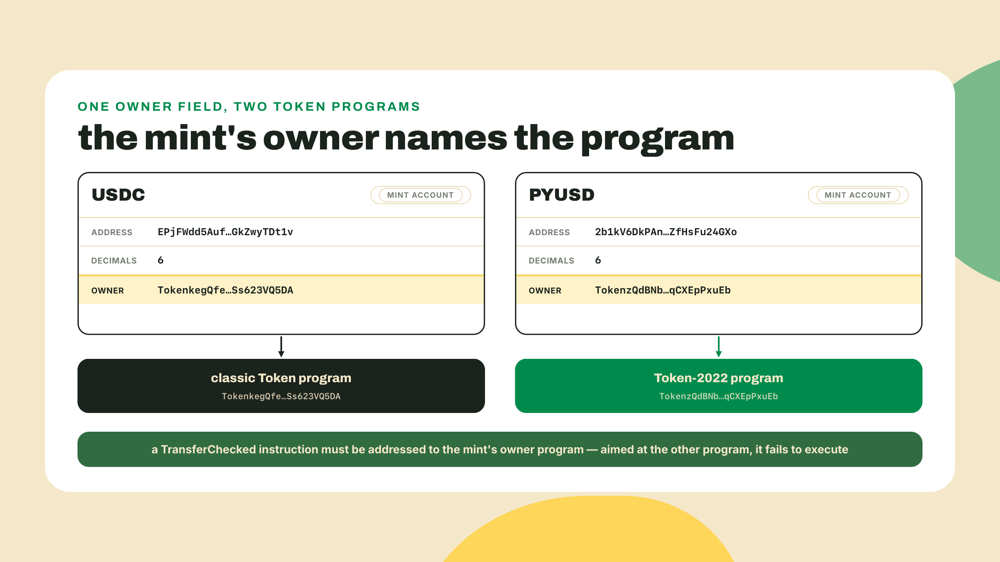
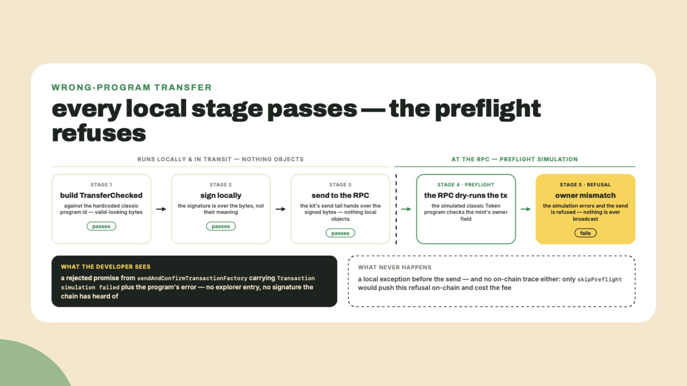
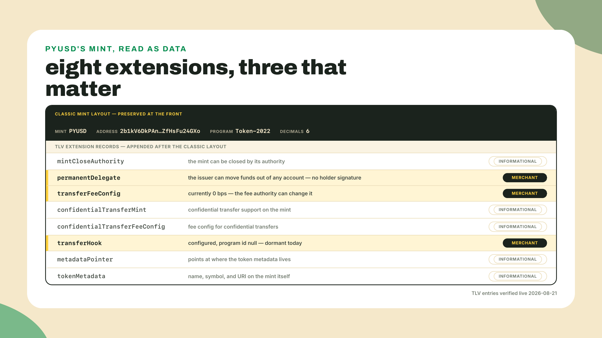
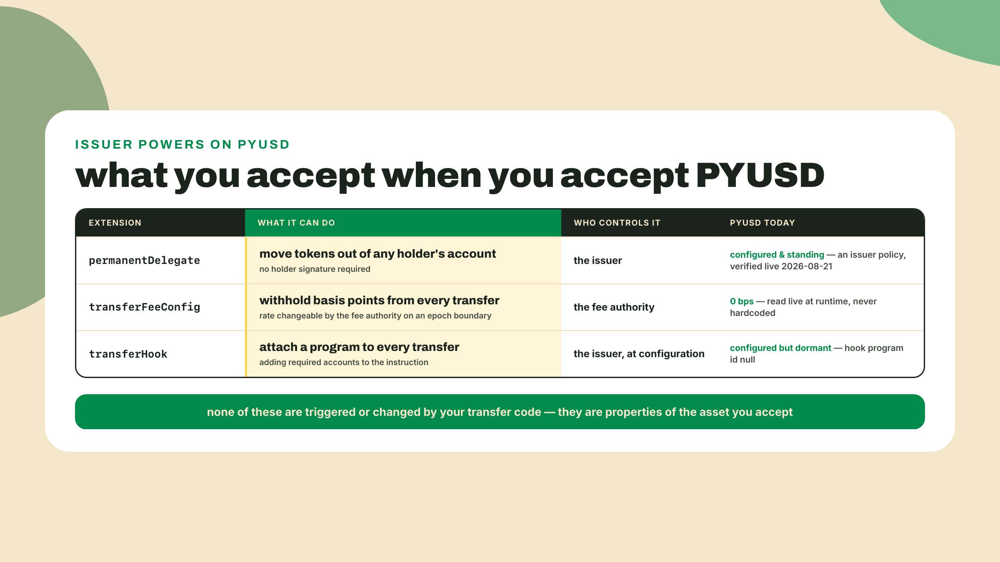
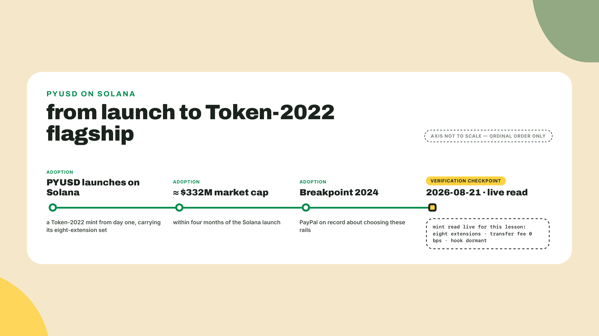
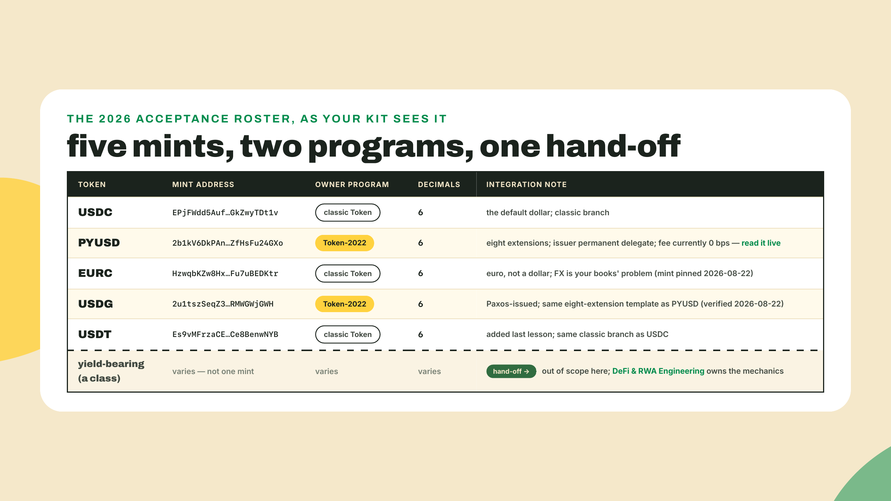
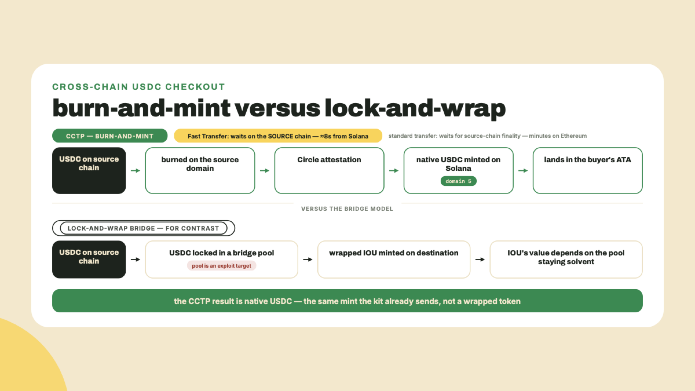
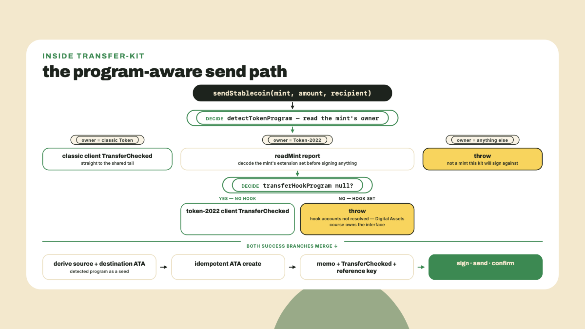

# The 2026 stablecoin roster: PYUSD, Token-2022, and how USDC travels

Last lesson you built transfer-kit and sent real USDC on devnet: decimals-safe base units, a memo, a reference key, a signature you could find again. The kit works. It also has a landmine in it, and today a customer steps on it: they pay in PYUSD, the kit builds and signs a transaction that looks perfectly well-formed, and the network refuses it at the door: the RPC dry-runs every transaction before broadcasting it (a step called preflight simulation), the simulation hands the classic Token program a mint it does not own, and the send comes back a rejected promise. No failed transaction on an explorer, no signature the chain has ever heard of, and no money moved.

PYUSD is a dollar stablecoin. Six decimals, same as USDC. Same word on the label. So why does the exact code that moves USDC cleanly get its PYUSD transfer thrown out at the door? Run this before any theory. Two curls, no wallet needed:

```bash
curl -s https://api.mainnet-beta.solana.com -X POST \
  -H "Content-Type: application/json" \
  -d '{"jsonrpc":"2.0","id":1,"method":"getAccountInfo","params":["EPjFWdd5AufqSSqeM2qN1xzybapC8G4wEGGkZwyTDt1v",{"encoding":"jsonParsed"}]}' \
  | grep -o '"owner":"[^"]*"'
```

That is USDC's mint. You get back `"owner":"TokenkegQfeZyiNwAJbNbGKPFXCWuBvf9Ss623VQ5DA"`. Now swap in PYUSD's mint, `2b1kV6DkPAnxd5ixfnxCpjxmKwqjjaYmCZfHsFu24GXo`, and run it again:

```bash
curl -s https://api.mainnet-beta.solana.com -X POST \
  -H "Content-Type: application/json" \
  -d '{"jsonrpc":"2.0","id":1,"method":"getAccountInfo","params":["2b1kV6DkPAnxd5ixfnxCpjxmKwqjjaYmCZfHsFu24GXo",{"encoding":"jsonParsed"}]}' \
  | grep -o '"owner":"[^"]*"'
```

`"owner":"TokenzQdBNbLqP5VEhdkAS6EPFLC1PHnBqCXEpPxuEb"`. Different address. Different program. Same word on the label, a different machine underneath, and your kit hardcoded the first machine. That one field, `owner`, is the entire bug, and fixing it properly is this lesson.

## Summary

Today transfer-kit learns to read before it signs. First the theory: what it means for a mint to be owned by a token program, what Token-2022 is, and how PYUSD's mint carries eight extensions that give its issuer powers a merchant needs to know about, including one that can move PYUSD out of any wallet. Then a fast tour of the rest of the 2026 roster you will actually be asked to accept: EURC, USDG, USDT, and the yield-bearing crowd we deliberately hand to another course. Then CCTP, because the USDC paying you often was not born on Solana and it is worth knowing how it got here. The lab extends the kit with `detectTokenProgram`, a `readMint` report, and a program-aware `sendStablecoin`, and ships a `verify:roster` smoke check that proves both token programs work end to end.

How the work is shared today: the theory and most of the lab are worked, I type first and you follow. The one gap I leave in the scaffold, the owner-program switch itself, you fill as the completion challenge. The live PYUSD enumeration and the dual-mint send at the end are yours alone, no guidance.

## Same ticker, different machine

### The owner program: one field decides how money moves

Every account on Solana has an `owner` field naming the program that is allowed to mutate it. You met this idea sideways last lesson when we derived ATAs. Now it goes load-bearing: a mint is owned by exactly one token program, and every instruction that touches that mint must be addressed to that program. Not to "the token program" in the abstract. To the one in the `owner` field.

For years there was effectively one answer, the classic Token program at `TokenkegQfeZyiNwAJbNbGKPFXCWuBvf9Ss623VQ5DA`, so a generation of payment code hardcoded it and got away with it. Then Token-2022 arrived at `TokenzQdBNbLqP5VEhdkAS6EPFLC1PHnBqCXEpPxuEb`: a second, separate token program, same core interface, plus an extension system the classic program never had. It did not replace the classic program. The two run side by side, and a mint lives on one or the other, forever. USDC is classic. PYUSD is Token-2022. Both are dollars; the dollar is not the machine.



So the fix for the kit is not "add PYUSD support" but something simpler: stop assuming, start reading. Ask the chain who owns the mint, then build the transfer against that answer. One mint read per payment, cached if you like, and the whole class of wrong-program failures disappears. The lab makes this a five-line function, and the five lines matter less than the habit: on these rails, the mint is the configuration file, and it is public. Read it.

Be precise about where that failure lands, because it changes how you debug it. Nothing throws while you build. Your `TransferChecked` from last lesson hardcodes the classic program id and derives token accounts under it, and both of those are valid-looking bytes, so the message builds and signs cleanly. The refusal belongs to the classic Token program: handed a mint account it does not own, it checks the owner field and errors. But with the kit's send tail it never gets to say so on-chain. Before broadcasting, the RPC runs your signed transaction through a dry-run against current state — the **preflight simulation** — and the owner check fires there. `sendAndConfirmTransactionFactory` surfaces it as a rejected promise carrying `Transaction simulation failed` plus the program's error, and the transaction never lands: no explorer entry, and `getSignatureStatuses` on your signature returns null even with history search turned on. Only if you disabled that dry-run (`skipPreflight`) would the same refusal happen on-chain, cost you the fee, and leave a failed transaction behind. Step 6 of the lab has you trip the same landmine from the CLI, which catches it at a third, even earlier seam.



Annoying at the worst moment, sure, but this is the good failure mode: the program refused rather than moving money wrongly. Keep that instinct as we go, because loud refusals are a feature you will build into your own kit today, this time locally, before a signature is ever spent.

The ownership split reaches one more place you would not guess: addresses. Last lesson's seed line said an ATA is computed from the owner and the mint. The full truth is that the owning token program is part of the derivation too, so your customer's PYUSD account and their USDC account differ not just by mint seed but by program seed. Derive a Token-2022 mint's ATA with the classic program in the seeds and you get a perfectly valid-looking address that no wallet will ever fund. This is why `resolveAta` grows a third parameter in the lab, and why the detected program has to thread through every step of the send, not just the transfer instruction. One detection, used everywhere.

### TLV extensions: what PYUSD actually carries

Now the interesting half. Why does Token-2022 exist at all? Because issuers kept needing powers the classic program could not express: fees on transfer, metadata on the mint itself, confidential amounts, compliance controls. Token-2022's answer is extensions: optional typed records appended to a mint or token account, encoded as TLV, type-length-value. Each record says what it is, how long it is, and then its payload. A mint opts into a set of extensions at creation, and anyone can read the set right off the account.

One design choice makes your whole lab possible: the extensions are appended after the classic mint layout, which stays byte-for-byte intact at the front. That is why a single decoder can read both kinds of mint, and why old tooling that only understands the classic prefix still reads a Token-2022 mint's supply and decimals correctly. The new powers live strictly in the appendix.

PYUSD is the worked example the whole ecosystem points at. Its mint carries eight TLV extensions: mintCloseAuthority, permanentDelegate, transferFeeConfig, confidentialTransferMint, confidentialTransferFeeConfig, transferHook, metadataPointer, tokenMetadata. Eight is the count you get by counting TLV entries; you will sometimes hear seven, counting the confidential pair as one suite. We read all of this live in the lab, but three of the eight deserve a merchant's full attention right now.



**permanentDelegate** is the one to sit with. It names a standing authority, here the issuer, that can move PYUSD out of any holder's token account. Any wallet, any balance, no signature from the holder. That is seizure capability, and it is not a bug or a hack risk: it is issuer policy, the on-chain expression of a regulated company's obligation to freeze and claw back funds under a court order. Your transfer code does not add it, cannot remove it, and never triggers it. But when you price a sale in PYUSD, you accept an asset whose issuer retains that power, and you should know it the way you know your card acquirer can reverse a settlement.

**transferFeeConfig** means the mint can charge a fee, in basis points, withheld from every transfer. Here is the integration trap: the presence of the extension tells you nothing about the rate. The fee is a number in the mint account, the fee authority can change it, and a change takes effect on an epoch boundary — but not the next one. Token-2022 stamps the incoming rate with `newer_fee_start_epoch = current epoch + 2`, so it activates two epoch boundaries out, and the program's source says why in as many words: "set two epochs ahead to avoid rug pulls at the end of an epoch." A one-epoch delay declared in the last minutes of an epoch would be no notice at all. An **epoch** is Solana's scheduling unit, a block of exactly 432,000 slots (`getEpochSchedule` will tell you so), which at the 300ms target slot time this course has used since module 1 works out to about 36 hours, a day and a half — derive it rather than memorizing it, because slot time is the number that keeps moving and older material quoting "about two days" is quoting the 400ms era. Then double it, because two epochs is what you actually get: roughly three days of notice at today's slot time. That is the network's way of saying "not immediately, but at the next agreed changeover", and it is why a fee change is announced rather than applied. PYUSD's fee is currently configured at zero basis points. I am telling you that as a fact about today, verified live while writing this, and the lab has your kit read the current value from the mint at runtime, because "currently zero" is exactly the kind of fact you never hardcode. A fee that is zero today can be nonzero later, silently, with no code change on your side.

And understand where a nonzero fee would bite: it is withheld from the transferred amount. Send 100 tokens on a mint with a 50-basis-point fee and the recipient's account is credited 99.50; the withheld half-unit accrues for the fee authority to collect. For a storefront that means the price your checkout displays and the amount your ledger receives stop matching the moment a fee turns on, and every reconciliation report downstream inherits the gap. That is the concrete reason `readMint` surfaces the basis points as a first-class field: a checkout that knows the live rate can reprice, warn, or refuse. A checkout that assumed zero just quietly loses margin.

**transferHook** lets a mint attach a program that runs on every transfer, which can add extra required accounts to the instruction. On PYUSD it is configured but dormant: the extension is present and the hook program id is null, so transfers today need nothing extra. Your kit will check this and refuse loudly if it ever meets a mint with a live hook, because a transfer built without the hook's accounts fails in confusing ways. Building the hook interface end to end is explicitly not our job: that authoring-side depth — the transfer-hook interface and the rest of the extension internals — is the Digital Assets, Tokenization and Token Extensions course's territory. This course reads and routes, nothing more.



The remaining five, quickly: mintCloseAuthority lets the issuer close the mint account itself; the confidential pair enables encrypted-amount transfers (opt-in, and not something a checkout needs); metadataPointer and tokenMetadata put the token's name and symbol on the mint account instead of in an external registry. Ordinary powers, worth naming, nothing a payment integration must act on.

Here is the honest trade this lesson is built around. A kit that speaks both token programs is more branching, more dependencies, more code than the one you had yesterday. And Token-2022 mints can carry powers a merchant must accept knowingly: a permanent delegate means the issuer can claw funds back, and a transfer fee can be switched on later. The safety is not in avoiding Token-2022, which would mean refusing PYUSD and half the roster below. The safety is in reading the mint at runtime, every time, and never trusting the ticker. The ticker says dollar. The mint says what kind.

Worth asking why PayPal bothered with all this machinery. The answer is that it worked: PYUSD reached about $332M in market cap within four months of its Solana launch, with PayPal on record at Breakpoint 2024 about why they picked these rails, and the mint's extension set (seizure power, dormant hook, confidential capability) is exactly what a regulated issuer needs to satisfy its regulators while settling in seconds. The extensions are the compliance department, compiled.



### The rest of the 2026 roster

Your checkout will be asked for more than USDC and PYUSD. Here is the rest of the roster, one honest paragraph each, and the habit from above applies to every row: read the mint, believe the read.

**EURC** is Circle's euro stablecoin, and it matters because pricing in euros without an FX leg is a real feature for a storefront with European customers. On Solana it is a classic Token mint at `HzwqbKZw8HxMN6bF2yFZNrht3c2iXXzpKcFu7uBEDKtr` (pinned here from a live read, 2026-08-22), six decimals. Your kit after today handles it with the classic branch, no special cases. The only novelty is on your books, not on the chain: it is a different currency, not a different dollar.

**USDG** is the Global Dollar, issued by Paxos. And here is a detail I genuinely enjoyed finding while writing this: read USDG's mint at `2u1tszSeqZ3qBWF3uNGPFc8TzMk2tdiwknnRMWGWjGWH` and you get Token-2022, six decimals, and the same eight extensions as PYUSD, entry for entry (verified live, 2026-08-22). That is not a coincidence, it is a fingerprint: Paxos is also the issuer behind PYUSD, and this is what a regulated issuer's standard template looks like. Two different brand names, one machine shape. Your kit does not care, which is the whole point of today.

**USDT** is the elder of the table, at `Es9vMFrzaCERmJfrF4H2FYD4KCoNkY11McCe8BenwNYB`, a classic Token mint you already added to the kit last lesson. It remains everywhere, especially in flows that started off-shore or off-Solana. Accept it with the same code path as USDC and move on; its complications are business and jurisdiction questions, not integration questions.

Then there is the yield-bearing crowd: stablecoins whose balance or redemption value grows because the reserve throws off interest. They look like just another mint, and treating them as plain USDC is a mistake, because their mechanics (rebasing balances, accruing share prices, transfer restrictions) reach into exactly the accounting your storefront does. We are not covering them, on purpose; their mechanics are DeFi and RWA Engineering territory. If a partner asks you to accept one, that depth is the prerequisite, not this paragraph.



### How USDC travels: CCTP in one section

One more piece of the roster story, because the USDC that pays you often started life somewhere else. A buyer holds USDC on Ethereum or Base; your checkout is on Solana. How does their dollar become a dollar here?

The old bridge answer was lock-and-wrap: park the real token in a pool on the source chain, mint an IOU on the destination. It works until the pool is drained by an exploit, and the wrapped IOU is only as good as the bridge behind it. Circle's answer for USDC is CCTP, the Cross-Chain Transfer Protocol, and the mechanism is different in kind: burn-and-mint. The USDC is burned on the source chain, Circle attests to the burn, and native USDC is minted on the destination. No pools of locked collateral, no wrapped stand-in, and what arrives is the same native USDC mint your kit already sends, indistinguishable from any other USDC on Solana.

Two Solana-specific facts to keep. In CCTP's addressing scheme every chain is a numbered domain, and Solana is domain 5 (Ethereum is domain 0); you will see that number in CCTP messages and logs when you debug a cross-chain arrival. And speed, with the direction stated carefully, because this is the detail every summary of CCTP gets backwards. Both the standard and the fast path wait on the **source** chain — Circle's own docs scope Fast Transfer availability to source chains, since what is being waited on is the burn becoming irreversible where it happened. So the widely-quoted "about 8 seconds" is the figure for Solana *as the source*, not for arrivals into Solana. A buyer bridging in from Ethereum waits out Ethereum's finality, and their fast path is correspondingly slower than 8 seconds while still being a large improvement on the standard route. Circle's table makes the spread concrete, and it is wider than most write-ups admit. With Solana as source, standard is 32 confirmations, about 25 seconds. With Ethereum as source, standard is roughly 65 confirmations, about 15 to 19 minutes. So "the standard route takes about a quarter of an hour" is an Ethereum fact being quoted as a CCTP fact; there is no single standard-route duration to quote. Read Circle's per-chain table for whichever source your customers actually pay from, and quote that row rather than the Solana one. The product point survives either way: cross-chain shoppers stop being a support ticket and become a normal payment that arrives slightly late.



For your integration the punchline is almost anticlimactic, and anticlimactic is the goal. You do not integrate CCTP in this course; wallets and on-ramps drive it. You just receive USDC. Everything you built last lesson, and everything you build today, already handles the arrival.

## Lab: teach the kit to read before it signs

The kit gains three abilities, in order: detect a mint's owner program, produce a full mint report with live extension data, and route a send through the correct program. Then a smoke check proves the whole roster. Work inside the `transfer-kit` workspace from last lesson: run the `npm install --workspace` line and the `tsc` checkpoints from the `wavelength` root, and `cd transfer-kit` for everything else, because every file path below is relative to that workspace.

1. Install the Token-2022 client. The workspace is pinned to kit ^6.10.0 (that pin came from last lesson: the checkout rungs downstream import this kit, and @solana/pay peers kit ^6.9), so the Token-2022 client has to be a kit-v6 minor:

```bash
npm install --workspace transfer-kit @solana-program/token-2022@0.12.0
```

   Freshness note on that pin: 0.12.0 is the last @solana-program/token-2022 minor whose peer range accepts kit ^6 (it peers ^6.4.0); from 0.13.0 the package peers kit ^7 and npm will refuse the install into this workspace. Verified against the npm registry 2026-08-22; re-check the peer range if you are reading this much later, because the ecosystem's kit-v7 wave is where new minors land. Checkpoint: the install exits clean. An `ERESOLVE` peer error means the pin drifted past kit v6, and no later step will work until it is right.

2. Create `src/detect.ts`. This is the completion challenge: the account read is written for you, the classification is not. The file compiles as is, and every downstream step will throw until you finish it:

```ts
// src/detect.ts: which token program owns this mint?
import type { Address, Rpc, GetAccountInfoApi } from "@solana/kit";
import { TOKEN_PROGRAM_ADDRESS } from "@solana-program/token";
import { TOKEN_2022_PROGRAM_ADDRESS } from "@solana-program/token-2022";

export { TOKEN_PROGRAM_ADDRESS, TOKEN_2022_PROGRAM_ADDRESS };

/**
 * Reads the mint account and returns the token program that owns it.
 * Every transfer this kit builds MUST target this program, never a
 * hardcoded one.
 */
export async function detectTokenProgram(
  rpc: Rpc<GetAccountInfoApi>,
  mint: Address,
): Promise<Address> {
  const { value } = await rpc
    .getAccountInfo(mint, { encoding: "base64" })
    .send();
  if (!value) {
    throw new Error(`Mint ${mint} does not exist on this cluster`);
  }
  const owner = value.owner;

  // COMPLETION CHALLENGE: classify `owner`.
  // Return it when it matches one of the two exported program
  // addresses; throw for anything else, because an account owned by
  // neither token program is not a mint and the kit must refuse to
  // build a transfer against it. Two comparisons and one throw.
  throw new Error(`TODO: classify owner program ${owner}`);
}
```

   Fill it now, before moving on. The two addresses to compare against are already imported and re-exported at the top of the file; the refusal message should name the unexpected owner, because future-you debugging a weird mint will want it. Do not skip the refusal branch. Returning a default program for an unknown owner is how a kit signs something it does not understand.

3. Create `src/read-mint.ts`, the report generator. One call, one honest picture of any mint:

```ts
// src/read-mint.ts: one live report per mint: program, decimals,
// extensions, and the CURRENT transfer fee. Never trust the ticker.
import { address, type Address, type Rpc, type GetAccountInfoApi } from "@solana/kit";
import { fetchMint } from "@solana-program/token-2022";
import { detectTokenProgram, TOKEN_2022_PROGRAM_ADDRESS } from "./detect.js";

// An unset hook program decodes as the all-zero pubkey, which prints
// as the same base58 string as the system program address.
const UNSET = address("11111111111111111111111111111111");

export interface MintReport {
  mint: Address;
  programAddress: Address;
  /** Extension names as found on the mint, empty for classic Token. */
  extensions: string[];
  decimals: number;
  /** Live transfer-fee basis points, null when no transferFeeConfig. */
  transferFeeBps: number | null;
  /** Issuer seizure power: the permanent delegate, when configured. */
  permanentDelegate: Address | null;
  /** Transfer-hook program, when one is actually wired. Can be null
   *  even when the extension is present: configured but dormant. */
  transferHookProgram: Address | null;
}

export async function readMint(
  rpc: Rpc<GetAccountInfoApi>,
  mint: Address,
): Promise<MintReport> {
  const programAddress = await detectTokenProgram(rpc, mint);

  // The token-2022 client's mint codec also decodes classic mints:
  // same base layout, just an empty extension list.
  // Second read of the same account, and yes, it could be one. The
  // codec wants a decoded account and detectTokenProgram wants the raw
  // owner field, so collapsing them means hand-rolling the fetch. For a
  // read that a real checkout caches per mint anyway, clarity wins.
  const account = await fetchMint(rpc, mint);
  const data = account.data;

  const report: MintReport = {
    mint,
    programAddress,
    decimals: data.decimals,
    extensions: [],
    transferFeeBps: null,
    permanentDelegate: null,
    transferHookProgram: null,
  };

  if (programAddress !== TOKEN_2022_PROGRAM_ADDRESS) return report;
  if (data.extensions.__option === "None") return report;

  for (const ext of data.extensions.value) {
    report.extensions.push(ext.__kind);
    if (ext.__kind === "TransferFeeConfig") {
      // Two fee schedules exist. The older stays in force until the
      // epoch stamped on the newer one arrives. We surface the newer:
      // the rate this mint is heading for.
      report.transferFeeBps = ext.newerTransferFee.transferFeeBasisPoints;
    }
    if (ext.__kind === "PermanentDelegate") {
      report.permanentDelegate = ext.delegate;
    }
    if (ext.__kind === "TransferHook") {
      report.transferHookProgram =
        ext.programId === UNSET ? null : ext.programId;
    }
  }
  return report;
}
```

   Notice what the fee logic does not do: it never assumes a rate. A fee change is scheduled against an epoch, so the mint carries two schedules, older and newer, and the older one stays in force until the epoch stamped on the newer one arrives. We surface `newerTransferFee` because it is the rate the mint is heading for, and on PYUSD today both schedules read zero, so the distinction is free.

   Say the limitation out loud, because it is your kit and you should know where it is approximate: **`readMint` reports the scheduled rate, not necessarily the rate in force today.** If you meet a mint whose newer schedule has an epoch stamp in the future, the fee actually withheld right now is the older one, and a checkout quoting off `transferFeeBps` would be quoting tomorrow's number. Making it exact is two additions and no new concepts: keep `ext.olderTransferFee` alongside the newer one in `MintReport`, ask the chain for `await rpc.getEpochInfo().send()` and read its `epoch` field, then pick the older schedule whenever `epoch < ext.newerTransferFee.epoch`. We leave it out of the lab because every mint this course touches charges zero on both schedules, so the branch would never execute and you would never see it fail. Put it in before you accept a fee-charging mint for real money.

4. Read PYUSD live. Make a `scripts/` folder beside `src/` with `mkdir -p scripts`, then add a tiny runner, `scripts/read.mts`:

```ts
// scripts/read.mts: usage: npx tsx scripts/read.mts <MINT_ADDRESS>
import { createSolanaRpc, address } from "@solana/kit";
import { readMint } from "../src/read-mint.js";

const rpc = createSolanaRpc(
  process.env.RPC_URL ?? "https://api.mainnet-beta.solana.com",
);
const report = await readMint(rpc, address(process.argv[2]));
console.log(
  JSON.stringify(report, (_k, v) => (typeof v === "bigint" ? v.toString() : v), 2),
);
```

   Run it against both mints from the opener:

```bash
npx tsx scripts/read.mts EPjFWdd5AufqSSqeM2qN1xzybapC8G4wEGGkZwyTDt1v
npx tsx scripts/read.mts 2b1kV6DkPAnxd5ixfnxCpjxmKwqjjaYmCZfHsFu24GXo
```

   Checkpoint: USDC reports the classic program and an empty extension list. PYUSD reports Token-2022 and eight extensions, `transferFeeBps: 0`, a real address under `permanentDelegate`, and `transferHookProgram: null`. If your `detect.ts` switch is wrong, this is where it shows: PYUSD coming back "classic" with zero extensions means your classification fell through to a default. One naming caveat so the output does not spook you: the client prints codec names like `ConfidentialTransferFee`, while the RPC's jsonParsed view of the same entry says `confidentialTransferFeeConfig`. Same eight TLV entries, two spellings; count entries, not spellings. (It took me a minute of squinting the first time.)

Before the send code, hold the full route in your head. The kit's new decision path per payment:



5. Rewrite `src/send.ts` so the route above is real. This replaces last lesson's hardcoded version; the pipe at the bottom is untouched, which is the point:

```ts
// src/send.ts: program-aware sendStablecoin. Four diffs from last
// lesson, all deliberate:
//   1. resolveAta moves here from ata.ts and takes a third seed, the
//      mint's owner program, which is read once and threaded through.
//   2. The idempotent-create helper becomes the ...Async variant, which
//      derives the ATA itself, so there is no explicit `ata:` argument.
//   3. `signature` is returned as a plain string, not kit's branded
//      Signature type, so callers can serialize it without ceremony.
//   4. The RPC clients are constructed inside from URLs. That is a
//      deliberate simplification for a course kit and it costs you the
//      ability to inject a fake RPC in a test; if you later want that
//      back, take rpc/rpcSubscriptions as optional overrides.
import {
  AccountRole,
  appendTransactionMessageInstructions,
  assertIsTransactionWithBlockhashLifetime,
  createSolanaRpc,
  createSolanaRpcSubscriptions,
  createTransactionMessage,
  getSignatureFromTransaction,
  pipe,
  sendAndConfirmTransactionFactory,
  setTransactionMessageFeePayerSigner,
  setTransactionMessageLifetimeUsingBlockhash,
  signTransactionMessageWithSigners,
  type Address,
  type Instruction,
  type KeyPairSigner,
} from "@solana/kit";
import {
  findAssociatedTokenPda,
  getCreateAssociatedTokenIdempotentInstructionAsync,
  getTransferCheckedInstruction as getClassicTransferChecked,
} from "@solana-program/token";
import { getTransferCheckedInstruction as get2022TransferChecked } from "@solana-program/token-2022";
import { getAddMemoInstruction } from "@solana-program/memo";
import { detectTokenProgram, TOKEN_2022_PROGRAM_ADDRESS } from "./detect.js";
import { readMint } from "./read-mint.js";

/** ATA derivation now takes the owner PROGRAM as a seed: the same
 *  wallet has a different USDC address and PYUSD address partly
 *  because the token program is part of the derivation. */
export async function resolveAta(
  owner: Address,
  mint: Address,
  tokenProgram: Address,
): Promise<Address> {
  const [ata] = await findAssociatedTokenPda({
    owner,
    mint,
    tokenProgram,
  });
  return ata;
}

export interface SendResult {
  signature: string;
  reference: Address;
  tokenProgram: Address;
}

export async function sendStablecoin(opts: {
  rpcUrl: string;
  rpcSubscriptionsUrl: string;
  payer: KeyPairSigner;
  mint: Address;
  recipient: Address;
  /** exact base units from toBaseUnits, never a float */
  amount: bigint;
  memo: string;
  reference: Address;
}): Promise<SendResult> {
  const rpc = createSolanaRpc(opts.rpcUrl);
  const rpcSubscriptions = createSolanaRpcSubscriptions(
    opts.rpcSubscriptionsUrl,
  );

  // 1. The switch this whole lesson exists for. ONE read: readMint
  // already detects the owner program internally and hands it back on
  // the report, so calling detectTokenProgram here too would be a
  // second round trip for an answer we are already holding.
  const report = await readMint(rpc, opts.mint);
  const tokenProgram = report.programAddress;

  // Refuse surprises instead of eating them: a live transfer hook
  // means extra required accounts this kit does not resolve.
  if (report.transferHookProgram !== null) {
    throw new Error(
      `Mint ${opts.mint} has an active transfer hook ` +
        `(${report.transferHookProgram}); this kit does not resolve ` +
        `hook accounts. See the Digital Assets course for the interface.`,
    );
  }

  // 2. Both ATA derivations carry the detected program.
  const sourceAta = await resolveAta(
    opts.payer.address,
    opts.mint,
    tokenProgram,
  );
  const destinationAta = await resolveAta(
    opts.recipient,
    opts.mint,
    tokenProgram,
  );

  // 3. Idempotent ATA creation for first-time holders, same rung as
  // last lesson, now told which program will own the account.
  const createAtaIx = await getCreateAssociatedTokenIdempotentInstructionAsync({
    payer: opts.payer,
    owner: opts.recipient,
    mint: opts.mint,
    tokenProgram,
  });

  // 4. Route the transfer to the matching client. Same instruction
  // layout on both programs; different program id on the wire.
  const transferInput = {
    source: sourceAta,
    mint: opts.mint,
    destination: destinationAta,
    authority: opts.payer,
    amount: opts.amount,
    decimals: report.decimals,
  };
  const baseTransferIx =
    tokenProgram === TOKEN_2022_PROGRAM_ADDRESS
      ? get2022TransferChecked(transferInput)
      : getClassicTransferChecked(transferInput);

  // 5. Reference key: the read-only non-signer marker reconciliation
  // will search for, exactly as in last lesson.
  const transferIx: Instruction = {
    ...baseTransferIx,
    accounts: [
      ...baseTransferIx.accounts,
      { address: opts.reference, role: AccountRole.READONLY },
    ],
  };

  const memoIx = getAddMemoInstruction({ memo: opts.memo });

  // 6. The send pipe is untouched from last lesson.
  const { value: latestBlockhash } = await rpc.getLatestBlockhash().send();
  const message = pipe(
    createTransactionMessage({ version: 0 }),
    (m) => setTransactionMessageFeePayerSigner(opts.payer, m),
    (m) => setTransactionMessageLifetimeUsingBlockhash(latestBlockhash, m),
    (m) =>
      appendTransactionMessageInstructions(
        [createAtaIx, memoIx, transferIx],
        m,
      ),
  );
  const signed = await signTransactionMessageWithSigners(message);
  assertIsTransactionWithBlockhashLifetime(signed);
  await sendAndConfirmTransactionFactory({ rpc, rpcSubscriptions })(signed, {
    commitment: "confirmed",
    maxRetries: 0n,
  });

  return {
    signature: getSignatureFromTransaction(signed),
    reference: opts.reference,
    tokenProgram,
  };
}
```

   Two of these decisions matter beyond this file. The decimals now come from the mint report instead of a constant, so a future 8-decimal token cannot be silently mis-scaled by a kit that assumed six. And the return value grew a `tokenProgram` field: your storefront's back office will log which machine moved each payment, and when a support question arrives months later that one logged field answers it before you open an explorer.

   Two chores this rewrite creates, and they are the price of changing a shared interface. I said last lesson that the kit's interfaces are load-bearing, and they are, which is precisely why a change to them is a walked migration and not an exercise left to you.

   **Chore one: `src/index.ts`.** It still exports `resolveAta` from `./ata.js` and two type names the new `send.ts` does not define, so `tsc` fails on the export line before it ever reaches your logic. Retire `src/ata.ts` (its two-argument `resolveAta` cannot derive a Token-2022 address) and replace the barrel file with exactly this:

```ts
// src/index.ts
export { toBaseUnits, fromBaseUnits } from "./amounts.js";
export { resolveAta, sendStablecoin } from "./send.js";
export type { SendResult } from "./send.js";
export { detectTokenProgram, TOKEN_2022_PROGRAM_ADDRESS } from "./detect.js";
export { readMint } from "./read-mint.js";
export type { MintReport } from "./read-mint.js";
export * from "./mints.js";
```

   **Chore two: `src/pay.ts`.** `sendStablecoin` now takes RPC URLs instead of live clients, exact base units instead of a decimal string, and a `reference` you generate at the call site, and it returns `tokenProgram` where the old shape returned `destinationAta` and `baseUnits`. The caller absorbs all of that, and `receipt.json` keeps the exact shape `verify` already reads. Replace the file:

```ts
// src/pay.ts
import { readFile, writeFile } from "node:fs/promises";
import { homedir } from "node:os";
import {
  address,
  createKeyPairSignerFromBytes,
  generateKeyPairSigner,
} from "@solana/kit";
import { sendStablecoin, resolveAta } from "./send.js";
import { toBaseUnits } from "./amounts.js";
import { USDC_DEVNET, USDC_DECIMALS } from "./mints.js";

const recipientArg = process.argv[2];
const amountArg = process.argv[3] ?? "1.25";
const referenceArg = process.argv[4];
if (!recipientArg) {
  console.error(
    "usage: [PAYER_KEYFILE=<path>] npm run --workspace transfer-kit pay -- <recipient-wallet> [amount] [reference]",
  );
  process.exit(1);
}

// PAYER_KEYFILE lets this script send AS somebody else, which is the whole
// point of the pretend customer you made in lesson 1. Unset, it is your
// merchant identity, exactly as before.
const keyfile = process.env.PAYER_KEYFILE ?? `${homedir()}/.config/solana/id.json`;
const bytes = new Uint8Array(JSON.parse(await readFile(keyfile, "utf8")));
const payer = await createKeyPairSignerFromBytes(bytes);

// The caller owns these two now, on purpose: the checkout that
// generates a reference is the thing that must remember it. Pass a
// reference in when you are paying a checkout that already minted one;
// omit it and this script mints a throwaway of its own.
const baseUnits = toBaseUnits(amountArg, USDC_DECIMALS);
const reference = referenceArg
  ? address(referenceArg)
  : (await generateKeyPairSigner()).address;

const result = await sendStablecoin({
  rpcUrl: "https://api.devnet.solana.com",
  rpcSubscriptionsUrl: "wss://api.devnet.solana.com",
  payer,
  recipient: address(recipientArg),
  mint: USDC_DEVNET,
  amount: baseUnits,
  memo: "wavelength-order-0001",
  reference,
});

// Rebuild the two fields the new return shape dropped, so receipt.json
// stays byte-identical to what verify.ts already parses.
const destinationAta = await resolveAta(
  address(recipientArg),
  USDC_DEVNET,
  result.tokenProgram,
);

console.log("signature :", result.signature);
console.log("reference :", result.reference);
console.log("program   :", result.tokenProgram);
console.log("base units:", baseUnits.toString());

await writeFile(
  new URL("../receipt.json", import.meta.url),
  JSON.stringify(
    {
      signature: result.signature,
      reference: result.reference,
      destinationAta,
      baseUnits: baseUnits.toString(),
    },
    null,
    2,
  ),
);
```

   Two knobs went in that the old file did not have, and module 3 cashes both. `PAYER_KEYFILE` chooses which keypair signs: leave it unset and you are the merchant, set it to `/tmp/customer.json` and this script becomes your pretend customer paying *you*. A fourth argument accepts a reference someone else minted, which is how a script plays the customer for a checkout that already generated its own tracking number. Neither knob changes today's run; both exist because a merchant paying themselves is not a payment, and module 3's checkout needs a real second wallet on the other side of the counter.

   Checkpoint: `npx tsc --noEmit` from the `wavelength` root goes silent again, and `npm run --workspace transfer-kit verify` still passes against last lesson's receipt.

6. You need a Token-2022 mint you can actually spend on devnet, and PYUSD does not hand out devnet balances, so make your own test mint. The `spl-token` CLI ships in the same Agave release you installed for `solana` last lesson; check with `spl-token --version` (if it is somehow missing, `cargo install spl-token-cli` restores it):

```bash
spl-token create-token \
  --program-id TokenzQdBNbLqP5VEhdkAS6EPFLC1PHnBqCXEpPxuEb \
  --decimals 6 --url devnet
```

   Copy the printed mint address, then create your own token account for it and mint yourself a balance:

```bash
spl-token create-account <YOUR_T22_MINT> --url devnet
spl-token mint <YOUR_T22_MINT> 100 --url devnet
export T22_MINT=<YOUR_T22_MINT>
```

   Checkpoint: `spl-token balance $T22_MINT --url devnet` prints 100. Run `npx tsx scripts/read.mts $T22_MINT` with `RPC_URL=https://api.devnet.solana.com` and your own report generator tells you what you just made: Token-2022, six decimals, no extensions. A bare Token-2022 mint is a perfectly legal one; extensions are opt-in at creation, and the Digital Assets course is where you would learn to opt in.

   Now step on the landmine on purpose, because a failure you have seen is worth ten you have been warned about. Aim last lesson's classic-only path at this Token-2022 mint:

```bash
spl-token transfer $T22_MINT 1 <ANY_WALLET> \
  --program-id TokenkegQfeZyiNwAJbNbGKPFXCWuBvf9Ss623VQ5DA \
  --url devnet
```

   That `--program-id` is the classic Token program, which is precisely the constant your old `send.ts` hardcoded. Expected result: the CLI refuses before anything is built or submitted — exit code 1 and an owner-mismatch error naming your mint, shaped like `Account <YOUR_T22_MINT> is owned by TokenzQd..., not configured program id Tokenkeg...`. Note what you did **not** get: a signature, an explorer entry, or a fee spent. The CLI reads the mint's owner and checks it against the requested program before building anything — client-side, the exact habit your kit just learned. Your old `send.ts` had no such check, which is why its version of this failure surfaces one seam later, at the RPC's preflight simulation. Same refusal, three possible seams — client check, preflight, on-chain — and the earlier you catch it, the cheaper it is. That gap between "well-formed" and "will execute" is the whole reason the kit now reads the mint before it builds anything.

7. Ship the smoke check. Create `scripts/verify-roster.mts`:

```ts
// scripts/verify-roster.mts: the per-lesson smoke check.
// 1. Mainnet read: PYUSD reports eight extensions + live fee bps.
// 2. Devnet sends: one classic-Token mint, one Token-2022 mint,
//    each routed to the correct owner program.
import { readFile } from "node:fs/promises";
import {
  address,
  createKeyPairSignerFromBytes,
  createSolanaRpc,
  generateKeyPairSigner,
} from "@solana/kit";
import { readMint } from "../src/read-mint.js";
import { sendStablecoin } from "../src/send.js";
import {
  TOKEN_PROGRAM_ADDRESS,
  TOKEN_2022_PROGRAM_ADDRESS,
} from "../src/detect.js";

const PYUSD = address("2b1kV6DkPAnxd5ixfnxCpjxmKwqjjaYmCZfHsFu24GXo");
const DEVNET_USDC = address("4zMMC9srt5Ri5X14GAgXhaHii3GnPAEERYPJgZJDncDU");
if (!process.env.T22_MINT) {
  throw new Error("set T22_MINT to the devnet Token-2022 mint you made in step 6");
}
const T22_MINT = address(process.env.T22_MINT);

const mainnet = createSolanaRpc("https://api.mainnet-beta.solana.com");
const pyusd = await readMint(mainnet, PYUSD);
// Do NOT gate on the count. Two reasons, both from this lesson: the
// live mint's extension set is PayPal's to change, and the client and
// the RPC's jsonParsed view spell some entries differently, so a count
// is a spelling artifact. Print it, then assert on the properties that
// actually decide whether we can take the payment.
console.log(`PYUSD extensions (${pyusd.extensions.length}):`, pyusd.extensions);
if (pyusd.transferHookProgram !== null) {
  throw new Error(`PYUSD: transfer hook is live; this kit cannot route it`);
}
if (typeof pyusd.transferFeeBps !== "number") {
  throw new Error(`PYUSD: transfer fee did not read as a number`);
}
console.log(`PYUSD: ${pyusd.extensions.length} extensions, transfer fee ${pyusd.transferFeeBps} bps (live)`);

const keyBytes = new Uint8Array(
  JSON.parse(await readFile(`${process.env.HOME}/.config/solana/id.json`, "utf8")),
);
const payer = await createKeyPairSignerFromBytes(keyBytes);
const recipient = (await generateKeyPairSigner()).address;

for (const [label, mint, expected] of [
  ["classic", DEVNET_USDC, TOKEN_PROGRAM_ADDRESS],
  ["token-2022", T22_MINT, TOKEN_2022_PROGRAM_ADDRESS],
] as const) {
  const result = await sendStablecoin({
    rpcUrl: "https://api.devnet.solana.com",
    rpcSubscriptionsUrl: "wss://api.devnet.solana.com",
    payer,
    mint,
    recipient,
    amount: 250_000n, // 0.25 at 6 decimals, exact base units
    memo: `verify:roster ${label}`,
    reference: (await generateKeyPairSigner()).address,
  });
  if (result.tokenProgram !== expected) {
    throw new Error(`${label}: routed to ${result.tokenProgram}`);
  }
  console.log(`${label}: confirmed ${result.signature} via ${result.tokenProgram}`);
}
console.log("verify:roster PASS");
```

   Wire it into the workspace's `package.json` scripts, next to last lesson's `verify`:

```json
{
  "scripts": {
    "pay": "tsx src/pay.ts",
    "verify": "tsx src/verify.ts",
    "verify:roster": "tsx scripts/verify-roster.mts"
  }
}
```

   The classic-branch send spends the devnet USDC you still hold from last lesson's verify run; if the balance ran dry, mint more from the devnet faucet flow you used there. Do not run the full check yet. Running it is the back half of the challenge.

## Challenge

The completion half you have already met: `detectTokenProgram`'s switch in step 2. If you deferred it, close it now, and be strict with yourself about the third branch. The refusal for an unknown owner is the difference between a kit and a hazard.

The solo half, no guidance: run the roster. Enumerate PYUSD's extensions from a live mint read and print the current transfer-fee basis points, using your own `scripts/read.mts`. Then send the same amount through two mints on devnet, the classic-Token USDC mint and your own Token-2022 test mint, and finish with:

```bash
npm run --workspace transfer-kit verify:roster
```

Accept when all three hold: both transfers land on devnet, the kit reports the correct owner program for each mint, and your read prints the live extension list and the fee in basis points from the mint itself rather than from memory, and the hook check passes. If the Token-2022 send fails while classic passes, your ATA derivation is almost certainly missing the program seed: rerun `scripts/read.mts` on your test mint, then stare at `resolveAta`.

One reflection question to close the loop, no code: your storefront wants to accept USDG next quarter. What, concretely, does your kit already know how to do, and what single fact would you still verify before flipping it on? If your answer includes reading the mint live and checking the fee and delegate, the lesson landed. If your answer is "nothing, the table said it is fine," reread the trade-off.

This one covered a lot of roster for one lesson, and if the extension powers still feel abstract, that is expected: you read them today, you did not author them, and the authoring depth lives in the Digital Assets course by design. The full extension catalog, transfer hooks, and the confidential transfers behind this very mint are that course's modules two through four; if you want the issuer's side of what you just read, that is the door. Bring your `verify:roster` output to the course community if anything routed wrong; a failing signature with a mint address is a five-minute diagnosis when other builders can see it.

Your kit now moves any stablecoin on the roster, classic or Token-2022, and refuses the ones it cannot safely sign. Next module it stops being a script and becomes a storefront: one payment core behind a QR checkout, a market stall, and a shareable drop link. The reference keys you have been dutifully attaching are about to earn their keep.
