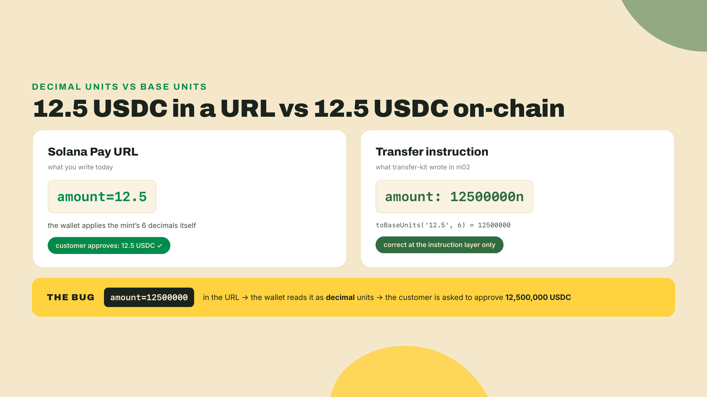
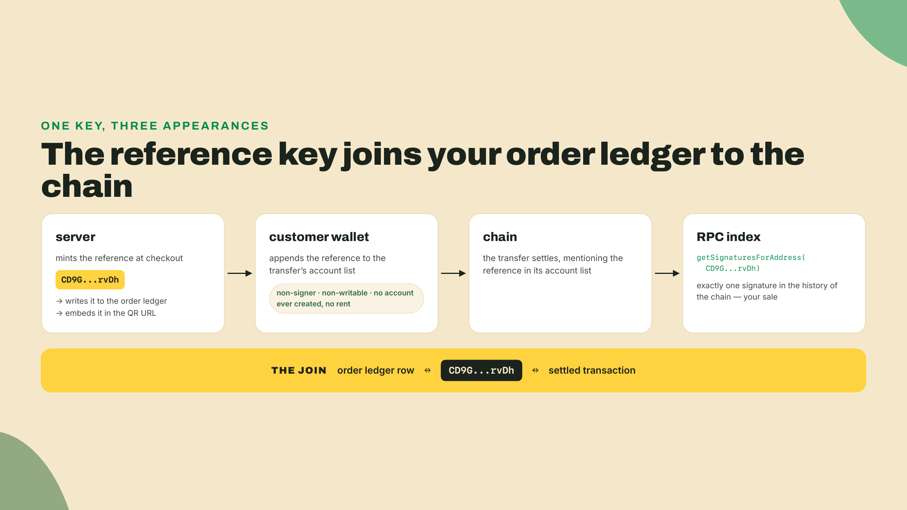
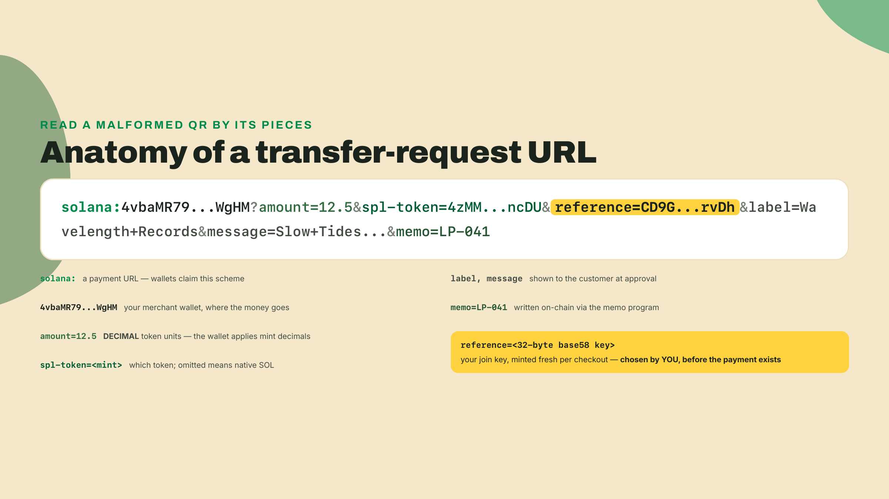
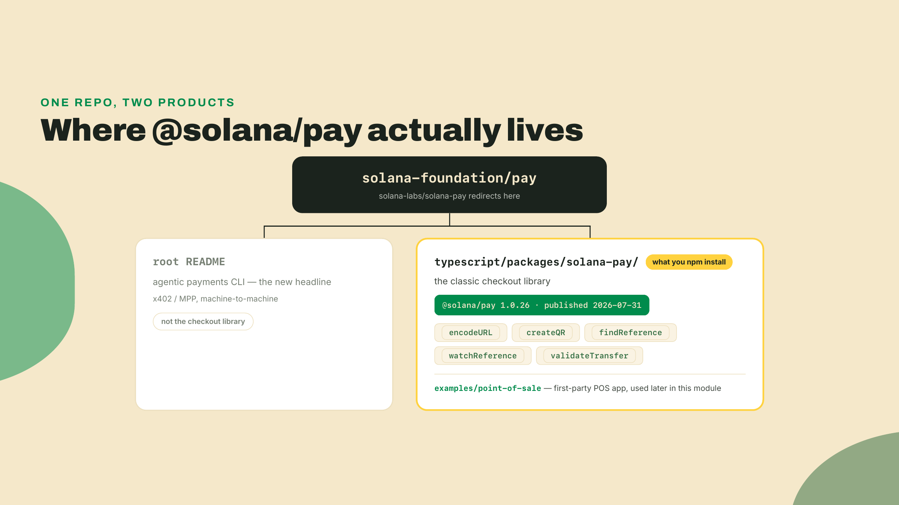
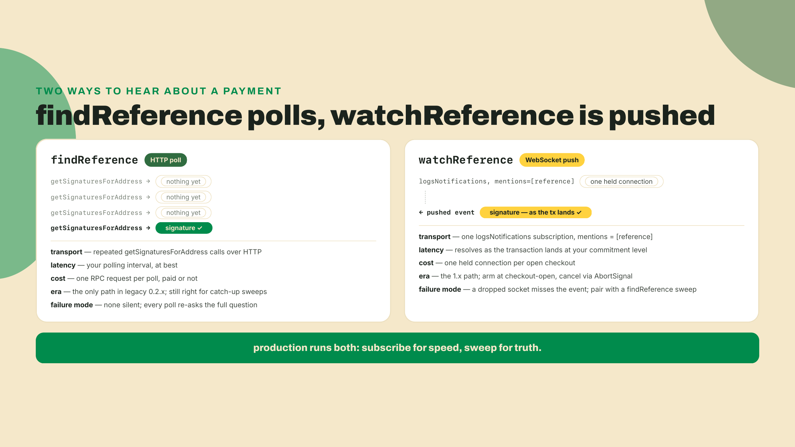
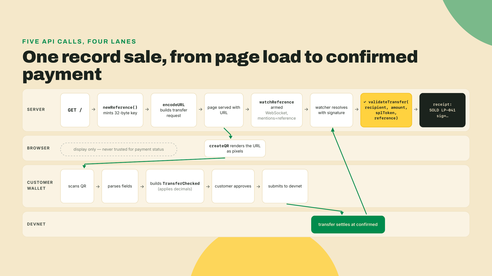
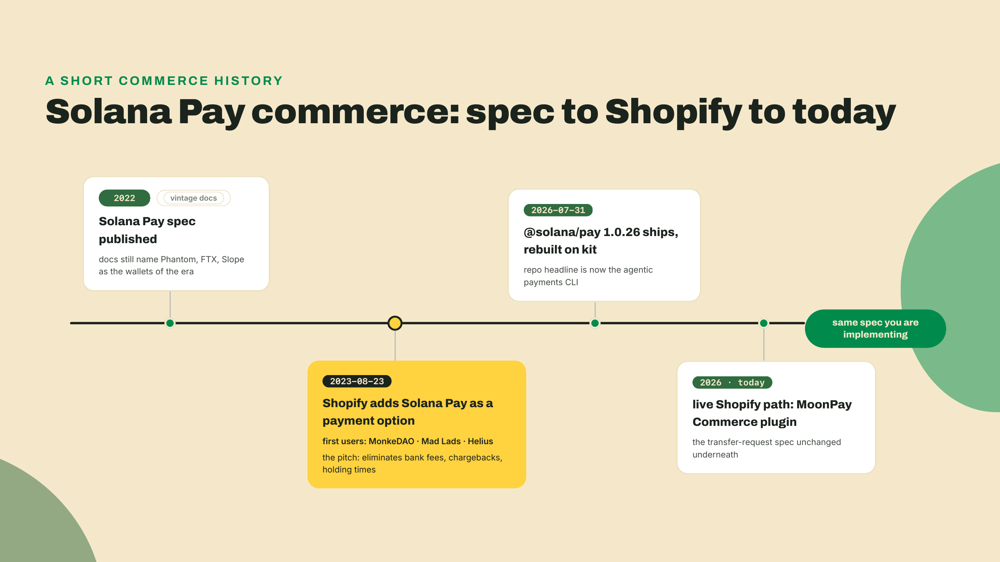
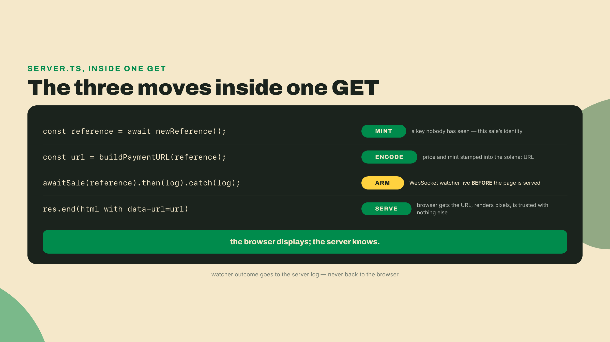

# Checkout with a QR: the Solana Pay spec, live

Last module you built transfer-kit: it detects whether a mint belongs to classic Token or Token-2022 and it can move any of the major stablecoins with a memo and a reference attached. That is a real capability, and it has a hole you can feel. Nothing in it asks a customer to pay. It only sends. You can pay anyone from code; a customer cannot hand you money by running your TypeScript.

What a customer can do is point a phone at a square of pixels. Today you build that square, and the server that notices when someone pays it. By the end of this lesson a devnet sale lands on your machine: scanned QR, settled transfer, matched order, confirmed amount.

Start the install now so it finishes while you read. This is a fresh workspace next to transfer-kit, not inside it, for a reason the theory section will make concrete. Run the `mkdir` from the `wavelength` root so the new folder lands beside `transfer-kit`:

```bash
mkdir wavelength-checkout && cd wavelength-checkout
npm init -y
npm pkg set type=module
npm i @solana/pay@1.0.26 @solana/kit@6.10.0
npm i -D tsx esbuild
```

Pins, with their freshness note: `@solana/pay` 1.0.26 is the npm `latest` (published 2026-07-31, re-checked 2026-08-22) and it peers `@solana/kit ^6.9.0`, which keeps you on the same kit v6 line the course has used since module 2; 6.10.0 is the last release of that line. One hard floor to check before you debug anything else: pay 1.0.26 declares `engines.node >= 20`, because it needs Node's Ed25519 support in `crypto.subtle` — the Node 24+ this course has assumed since module 1 clears it with room. `tsx` runs TypeScript files directly, `esbuild` bundles one file for the browser later. npm 7+ auto-installs the rest of pay's peer dependencies for you.

That `npm pkg set type=module` line is not decoration. `npm init -y` writes a CommonJS manifest, and every file in this lesson is an ES module: the server and the smoke test both use `import.meta.url`, which is a syntax error under CommonJS, so without that one line the lab dies on its first run with an error that says nothing about modules. Every workspace this course creates from here on sets it, and each lesson's scaffold block includes the line rather than assuming you remember.

While that runs, the one-sentence version of where you are on the module's ladder: this lesson is the simplest possible checkout, a URL the customer's wallet turns into a transaction, and its limits are exactly what the next lesson fixes.

## Summary

What this lesson establishes, one actionable line each:

- A Solana Pay transfer request is a URL: the `solana:` scheme, a recipient address, and query parameters for `amount`, `spl-token`, `reference`, `label`, `message`, and `memo`. The wallet reads it and builds the transfer itself.
- `amount` is in decimal token units. `12.5` means 12.5 USDC. Writing base units (`12500000`) charges the customer 12.5 million USDC, and this is the single most common Solana Pay checkout bug.
- The reference is a fresh random 32-byte base58 key you generate per checkout, before any payment exists. It is the join key between your order ledger and the chain: you cannot know the signature in advance, but you chose the reference.
- `encodeURL` builds the URL, `createQR` turns it into pixels (browser only, it needs a DOM), `watchReference` opens a WebSocket subscription that resolves when a transaction mentioning your reference lands, and `validateTransfer` then confirms the transfer paid the right amount of the right mint to the right recipient.
- The classic checkout library lives at `typescript/packages/solana-pay/` inside the pay repo. The repo's headline moved to an agentic-payments CLI; the subpackage is the thing you `npm i`.
- The spec page is roughly 2022-frozen. It still names Phantom, FTX, and Slope. The spec itself is still the live standard; the page is vintage. Message signing is an alpha extension, not part of v1.
- Shopify announced Solana Pay on 2023-08-23; today's live Shopify path is MoonPay Commerce's plugin.

How the work is split today, stated out loud: the lab is a worked build with every file given, except two deliberate holes. Reference-key generation and the `validateTransfer` expectations ship as TODOs, and filling them is the Challenge's completion rung, with the answers sitting in plain sight in the theory below. The solo rung adds a second record and proves the two sales are distinguishable. You are being handed less than last module, on purpose.

## A URL a wallet can pay

### The transfer request, field by field

Here is a complete transfer-request URL, the exact string my own run of this lesson's code produced:

```
solana:4vbaMR793oqgJHmJjwiFQsmcbd1ffQSeiTeKdvQTWgHM?amount=12.5&spl-token=4zMMC9srt5Ri5X14GAgXhaHii3GnPAEERYPJgZJDncDU&reference=CD9GnkB9qKo3XWX2UkDMNBc9YBTFe29ofLtASYbprvDh&label=Wavelength+Records&message=Slow+Tides%2C+Wavelength+pressing+041&memo=LP-041
```

No server was involved in making that payable. The `solana:` scheme tells the wallet this is a payment URL. The address right after it is the recipient, your merchant wallet. Then the query parameters:

- `amount=12.5`: how much, in decimal token units.
- `spl-token=4zMM...ncDU`: which token, by mint address. That one is devnet USDC, the mint transfer-kit has been sending since module 2. Omit this parameter and the wallet reads the amount as native SOL.
- `reference=CD9G...rvDh`: an extra account key the wallet attaches to the transfer, so you can find it later. More on this in a moment, it is the load-bearing idea of the whole lesson.
- `label`, `message`: what the wallet shows the customer at approval time. Your shop name, the item.
- `memo=LP-041`: written into the transaction itself via the memo program, so the SKU rides on-chain with the payment.

One pair in that list deserves untangling now, because their names invite the confusion. `message` and `memo` sound like synonyms and behave nothing alike. `message` is display-only: the wallet shows it to the customer at approval time, and it evaporates. It never touches the chain. `memo` is the opposite: the wallet writes it into the transaction through the memo program, so it settles on-chain, permanently, next to the payment, where your back office (and anyone else, this is a public ledger) can read it forever. The rule of thumb: `message` is for the human approving, `memo` is for the systems reconciling. Put the record title in `message` and the SKU in `memo`, never the reverse, and never put anything in `memo` you would not print on a public receipt.

The customer scans, their wallet parses those parameters, builds a `TransferChecked` instruction from them, and asks for a thumbprint. You never see a private key, you never build a transaction. The URL is the entire protocol between your shop and their wallet.

Now the footgun, because it deserves its own paragraph and a side-by-side. You spent all of module 2 converting decimal amounts to base units with `toBaseUnits`, because on-chain transfer instructions speak base units. A Solana Pay URL does not. The spec defines `amount` as a UI quantity, and the wallet multiplies by the mint's decimals for you. The two habits collide head-on:



Both conventions are correct where they live. The URL speaks human, the instruction speaks base units, and the wallet is the translator. Keep `toBaseUnits` out of your URL code entirely.

### The reference key: chosen before the payment exists

Here is the problem the reference solves. A payment's signature is the obvious unique handle for a sale, and you cannot use it, because it does not exist until the customer pays. You need a handle you control before the transaction is born, something you can write into your order ledger at checkout time and then use to recognize the payment when it lands.

That handle is the reference: a fresh random 32-byte base58 key you generate per checkout. The wallet attaches it to the transfer as an extra account key. It signs nothing, it holds nothing, it is never a wallet. It exists so that the transaction mentions it, because Solana's RPC layer can look up transactions by any account they mention. You mint a key nobody has ever seen, embed it in the QR, and the one transaction in the world that carries it is your sale.

Worth being precise about the mechanics, since they explain both why this works and why it costs nothing. The wallet appends your reference to the transfer instruction's account list as a non-signer, non-writable key. The account behind that address does not exist and never will; no rent, no creation, no state. It is pure graffiti on the transaction's account list. But Solana indexes transactions by every account they mention, existing or not, which is what `getSignaturesForAddress` queries under the hood. Ask the RPC "what transactions mention `CD9G...rvDh`?" and the answer is your sale and nothing else in the history of the chain. A free, collision-proof, pre-assignable transaction index, built out of an address nobody funded. Compare that with the traditional workaround, a unique deposit address per order with all the key management that drags in, and the reference starts looking like the better idea it is.



If you have integrated Stripe, you have met this shape before: it is your idempotency key and your order id fused into one value, chosen client-side before the charge. Think of it like a coat-check ticket. The ticket is printed before the coat arrives, the number matches exactly one coat, and holding the ticket is how you claim it later. Same discipline here: one checkout, one reference, never reused. Reuse one and two different sales become indistinguishable, which is precisely the failure the solo challenge makes you prove you avoided.

Generating one takes a single line with kit, and yes, it is a full keypair we immediately throw the private half away from. Only the address matters:

```typescript
import { generateKeyPairSigner } from '@solana/kit';

const reference = (await generateKeyPairSigner()).address;
```

This line is one of the lab's two TODO holes. You have now seen the answer.



### Where the library actually lives, and how old the spec page is

Two honest warnings before you read any official material, both of which will otherwise cost you an evening.

First, the repo. The canonical Solana Pay repository is `solana-foundation/pay` (the old `solana-labs/solana-pay` URL redirects there). Open its README and you will not find your checkout library. The headline product is now a CLI for agentic payments, machine-to-machine HTTP flows, and installing `@solana/pay` globally even gives you that CLI's binary. The classic checkout library you just installed lives in a subpackage: `typescript/packages/solana-pay/`. It is not deprecated, not frozen, and very much shipped: 1.0.26 went out on 2026-07-31, rebuilt on kit. The Foundation's payments energy moved to a different front door; the library stayed in the house. Bookmark the subpackage path, not the repo root.



Second, the spec. The Solana Pay spec at docs.solanapay.com is still the standard every wallet implements, and the page itself is frozen somewhere in the 2022-2023 era: its copyright line reads 2023, its cast list is pure 2022. Its opening line, verbatim, is "Rough consensus on this spec has been reached, and implementations exist in Phantom, FTX, and Slope." One of those three collapsed spectacularly and another is gone. Read the spec for the protocol, which has aged well, and ignore the cast list, which has not. The repo carries the same text at `typescript/packages/solana-pay/spec/SPEC.md`, alongside two siblings worth knowing by name: `SPEC1.1.md` and `message-signing-spec.md`, both of which open with the line "This spec is currently alpha and subject to change." Message signing is that alpha extension, not part of the live v1 transfer/transaction-request standard, and no checkout in this course leans on it.

Why does this vintage matter beyond trivia? Because you will paste from old tutorials at some point, everyone does, and the ecosystem around this spec has three distinct eras: the 2022 originals (web3.js 1.x types, `BigNumber` amounts), the long 0.2.x middle (polling only), and the 1.x line you installed (kit types, plain `number` amounts, a push-based watcher). Code from the wrong era will type-error at you in confusing ways. When in doubt, trust the `.d.ts` files in your own `node_modules` over any blog post, including this one's future self.

### From URL to pixels: encodeURL and createQR

`encodeURL` is a pure function: fields in, `URL` out. No network, no RPC, nothing async:

```typescript
import { encodeURL } from '@solana/pay';
import { address } from '@solana/kit';

const url = encodeURL({
  recipient: address('4vbaMR793oqgJHmJjwiFQsmcbd1ffQSeiTeKdvQTWgHM'),
  amount: 12.5,
  splToken: address('4zMMC9srt5Ri5X14GAgXhaHii3GnPAEERYPJgZJDncDU'),
  reference,
  label: 'Wavelength Records',
  message: 'Slow Tides, Wavelength pressing 041',
  memo: 'LP-041',
});
```

Every field maps one-to-one onto the URL parts you just read. `recipient`, `splToken`, and `reference` are kit `Address` values, which is why `address(...)` wraps the strings: it validates the base58 at the type level instead of at scan time.

`createQR(url, size, background, color)` turns the URL into a styled QR object. One structural fact decides your architecture: it needs a DOM. Call it in Node and it throws `document is not defined`; I did, it does. So the QR belongs to a browser file, and the URL construction belongs to your server, and that split is the correct trust boundary anyway. The server decides what is for sale and at what price; the browser only turns a finished URL into pixels. For server-side tests there is `createQROptions`, which builds the QR configuration without touching the DOM. The lab's smoke test does not even go that far: since the QR is drawn in the browser, all a Node-side check can honestly assert is that the browser bundle got built, which is exactly what it asserts.

The library also ships `encodeURL`'s mirror: `parseURL`. Hand it a URL and it gives you back the typed fields, recipient and amount and all the rest, or throws if the string is malformed. This is literally the wallet's half of the protocol; when a phone scans your QR, something shaped exactly like `parseURL` runs on the other side of the glass. Which makes it a quietly perfect testing tool for your side: if your freshly encoded URL survives a round trip through the library's own parser with the amount intact, a spec-compliant wallet will read it the way you meant it. No phone required. The smoke test leans on this, and it is a habit worth stealing for any protocol work: when a library ships both directions of a codec, the round trip is the cheapest correctness check you will ever write.

### Hearing the payment land: watchReference

Your page now shows a QR. Somewhere out there a customer approves the payment on their phone. Your server needs to find out. Not the browser tab, your server: a frontend "payment succeeded" callback is spoofable by anyone with devtools open, and building the merchant reflex of never trusting it is half of what module 4 is about.

The library gives you two detection tools, one old shape and one new one.

`findReference(rpc, reference)` asks the RPC over HTTP: has any transaction mentioned this reference key? It returns the oldest matching signature and throws `FindReferenceError` when nothing has landed yet. It is a one-shot question, so using it alone means asking again and again on a timer. That polling loop was the entire story of the legacy 0.2.x line, and the first-party point-of-sale app still works that way.

`watchReference(rpcSubscriptions, reference, options)` is the 1.x path and honestly a godsend for anyone who has written the polling version. It opens a WebSocket subscription (`logsNotifications`, filtered to transactions mentioning your reference) and returns a promise that resolves the moment a matching transaction lands, with the signature and its on-chain error status. No timer, no retry arithmetic, no wasted requests. You arm it when the checkout opens and await:

```typescript
import { watchReference } from '@solana/pay';
import { createSolanaRpcSubscriptions } from '@solana/kit';

const rpcSubscriptions = createSolanaRpcSubscriptions('wss://api.devnet.solana.com');

const { signature, err } = await watchReference(rpcSubscriptions, reference, {
  commitment: 'confirmed',
  abortSignal: controller.signal,
});
```

The `abortSignal` matters in real code: a checkout the customer walks away from should not hold a subscription forever. Abort it and the promise rejects with `FindReferenceError`, which your code treats as "sale expired," not as a crash. In my own run against devnet, arming the watcher on a fresh reference and aborting three seconds later did exactly that, cleanly.

The `commitment` option is a policy decision you already have the vocabulary for. Module 1 built the ladder: `confirmed` means a supermajority of the cluster voted on the transaction's block, `finalized` means the chain has built past it far enough that rollback is off the table. For a 12.5 USDC record, `confirmed` is the right merchant call, the same judgment the module 1 policy table lands on for small-ticket goods: the residual risk is tiny and the customer is standing there waiting. Selling something you cannot claw back at a price that would hurt? Watch at `confirmed` for the fast receipt, release the goods at `finalized`. The watcher takes either; the point is that the parameter is a business decision wearing a technical name, and defaulting it without deciding is still a decision.

WebSocket subscription, in one sentence for anyone who has only ever polled REST APIs: instead of you repeatedly asking "anything yet?", you hold one long-lived connection open and the RPC node pushes the answer to you the moment it exists. Keep `findReference` in your toolbox anyway. A WebSocket that drops during the payment misses the notification, and a poll is how you sweep for anything a subscription missed. The production checkouts in module 4 run both: subscribe for speed, sweep for truth.



### Trust arrives last: validateTransfer

The watcher resolving does not mean you got paid. It means a transaction mentioning your reference landed. Those are different claims. Anyone can send a transaction that mentions your reference key: a payment of the wrong amount, of the wrong token, to the wrong recipient, or a transfer that failed on-chain but still carries the account.

`validateTransfer` closes the gap. You hand it the signature the watcher caught plus a statement of what this sale was supposed to be, and it fetches the settled transaction and checks the story against the chain:

```typescript
import { validateTransfer } from '@solana/pay';
import { createSolanaRpc } from '@solana/kit';

const rpc = createSolanaRpc('https://api.devnet.solana.com');

await validateTransfer(
  rpc,
  signature,
  {
    recipient: MERCHANT,      // the money went to you
    amount: 12.5,             // decimal units, same convention as the URL
    splToken: USDC_DEVNET,    // it was actually USDC, not a lookalike mint
    reference,                // and it is THIS sale, not another one
  },
  { commitment: 'confirmed' },
);
```

If any expectation fails, it throws `ValidateTransferError` and you have not made a sale, whatever the browser is showing. The expectations object is the lab's second TODO hole, and now you have seen this answer too. The mental model to carry into module 4: the watcher is your doorbell, `validateTransfer` is checking the money is real before handing over the record. A doorbell is not a payment.

Put together, one sale flows like this:



### Who has run this shape at scale

This URL-and-reference pattern is not a classroom toy. On 2023-08-23, Shopify announced Solana Pay as a payment option across its merchant network, with MonkeDAO, Mad Lads, and Helius among the first users. The pitch Shopify's integration lead made was pure merchant economics, the same arithmetic from module 1: no bank fees, no chargebacks, no multi-day holding times on your own revenue. A card sale is a loan the network can claw back for months; a settled stablecoin transfer is final in seconds, and for a merchant running on thin margins that difference is the whole argument. The integration path has since changed hands, as commerce plumbing tends to: today's live route for a Shopify store is MoonPay Commerce's plugin. The spec underneath is the one you are implementing right now.



Now the trade-off, because this lesson's rung has a sharp ceiling and you should feel it before you build. Everything the wallet knows about this sale came from a URL you printed onto a screen, and once it is on the customer's side of the glass you control none of it. The amount, the mint, the reference: all of it is data in the customer's hands before it becomes a transaction. `validateTransfer` means tampering cannot fool you, a doctored payment simply fails validation. But it also cannot express you. No cart totals computed server-side, no coupon logic, no dynamic memo, no order state at all beyond one reference key per page load. A transfer request is dead simple and trustless, and it is exactly one record at one price. That ceiling is the next lesson's opening problem.

## Lab: sell one record on devnet

Worked build. Every file below goes in the `wavelength-checkout` workspace you created at the top. Two files ship with TODO holes, marked loudly; the build runs to a specific, named failure with them in place, and the Challenge closes them.

1. **The record.** Create `checkout/record.ts`. One record, one price, plus the two addresses everything else imports:

   ```typescript
   import { address } from '@solana/kit';

   // Your devnet merchant wallet. Paste the address you funded in module 2.
   export const MERCHANT = address('4vbaMR793oqgJHmJjwiFQsmcbd1ffQSeiTeKdvQTWgHM');

   // Devnet USDC, the same mint transfer-kit has been sending since module 2.
   export const USDC_DEVNET = address('4zMMC9srt5Ri5X14GAgXhaHii3GnPAEERYPJgZJDncDU');

   export const RECORD = {
     sku: 'LP-041',
     title: 'Slow Tides, Wavelength pressing 041',
     priceUsdc: 12.5, // decimal token units. NOT base units. Never 12500000.
   };
   ```

   Replace `MERCHANT` with your own devnet address or the sale will very much not reach you.

2. **The payment URL, with hole number one.** Create `checkout/payment.ts`:

   ```typescript
   import { encodeURL } from '@solana/pay';
   import { generateKeyPairSigner, type Address } from '@solana/kit';
   import { MERCHANT, USDC_DEVNET, RECORD } from './record.ts';

   // One fresh reference per checkout: a random 32-byte base58 key chosen
   // BEFORE the payment exists. The join key between this sale and the chain.
   export async function newReference(): Promise<Address> {
     // TODO(completion): mint a fresh key and return its address.
     // One line. The theory section shows it, generateKeyPairSigner is
     // already imported, and the smoke test will fail here until you do.
     throw new Error('TODO: newReference');
   }

   export function buildPaymentURL(reference: Address): URL {
     return encodeURL({
       recipient: MERCHANT,
       amount: RECORD.priceUsdc,
       splToken: USDC_DEVNET,
       reference,
       label: 'Wavelength Records',
       message: RECORD.title,
       memo: RECORD.sku,
     });
   }
   ```

3. **The browser side.** Create `checkout/page.ts`. This is the only file that ever touches `createQR`, for the DOM reason from the theory:

   ```typescript
   import { createQR } from '@solana/pay';

   // The server stamped the encoded URL onto the mount node; all this file
   // does is turn it into pixels. createQR needs a DOM, which is why it
   // lives here and not in server.ts.
   const mount = document.getElementById('qr')!;
   const qr = createQR(mount.dataset.url!, 512, 'white', 'black');
   qr.append(mount);
   ```

   Bundle it for the browser:

   ```bash
   npx esbuild checkout/page.ts --bundle --format=esm --outfile=checkout/public/page.js
   ```

   Checkpoint: esbuild reports the output file. Mine came out at 94.7kb, the QR styling library is most of it.

4. **The watcher, with hole number two.** Create `checkout/watcher.ts`:

   ```typescript
   import { watchReference, validateTransfer } from '@solana/pay';
   import {
     createSolanaRpc,
     createSolanaRpcSubscriptions,
     type Address,
     type Signature,
   } from '@solana/kit';
   import { MERCHANT, USDC_DEVNET, RECORD } from './record.ts';

   const rpc = createSolanaRpc('https://api.devnet.solana.com');
   const rpcSubscriptions = createSolanaRpcSubscriptions('wss://api.devnet.solana.com');

   // Resolves with the signature once a transfer carrying `reference` lands
   // on devnet AND survives validation against what this sale should be.
   export async function awaitSale(
     reference: Address,
     abortSignal?: AbortSignal,
   ): Promise<Signature> {
     const { signature, err } = await watchReference(rpcSubscriptions, reference, {
       commitment: 'confirmed',
       abortSignal,
     });
     if (err) {
       throw new Error(`transfer ${signature} landed but failed on-chain`);
     }

     const expected = {
       recipient: MERCHANT,
       amount: 0, // TODO(completion): the record's real price, decimal units
       // TODO(completion): add splToken and reference. Without the mint
       // check, 12.5 of any token passes. Without the reference, any sale
       // passes as this one.
     };
     await validateTransfer(rpc, signature, expected, { commitment: 'confirmed' });
     return signature;
   }
   ```

   As shipped, this watcher will catch a payment and then reject it, because no real transfer validates against an expected amount of zero. That is deliberate. The doorbell works; the money check is yours to write.

5. **The server.** Create `checkout/server.ts`. Plain `node:http`, nothing else; every GET of the page is one checkout, so each visit mints a reference, encodes a URL, and arms a watcher before the HTML even leaves the socket:

   ```typescript
   import { createServer } from 'node:http';
   import { readFileSync } from 'node:fs';
   import { newReference, buildPaymentURL } from './payment.ts';
   import { awaitSale } from './watcher.ts';
   import { RECORD } from './record.ts';

   const pageJs = readFileSync(new URL('./public/page.js', import.meta.url), 'utf8');

   const server = createServer(async (req, res) => {
     if (req.url === '/page.js') {
       res.writeHead(200, { 'content-type': 'text/javascript' });
       res.end(pageJs);
       return;
     }

     // Every GET / is one checkout: fresh reference, fresh QR, fresh watcher.
     const reference = await newReference();
     const url = buildPaymentURL(reference);

     awaitSale(reference)
       .then((signature) => {
         console.log(`SOLD ${RECORD.sku} ref=${reference} sig=${signature}`);
       })
       .catch((err) => {
         console.error(`checkout ${reference} did not validate:`, err.message);
       });
     console.log(`checkout open ref=${reference}`);

     res.writeHead(200, { 'content-type': 'text/html' });
     res.end(`<!doctype html>
   <title>Wavelength Records</title>
   <h1>${RECORD.title}</h1>
   <p>${RECORD.priceUsdc} USDC (devnet)</p>
   <div id="qr" data-url="${url.toString()}"></div>
   <script type="module" src="/page.js"></script>`);
   });

   server.listen(3010, () => {
     console.log('Wavelength checkout on http://localhost:3010');
   });
   ```

   Notice what the server never does: it never tells the browser whether payment happened. The receipt is a server-side log line. Wiring sale status back to the page is real work with real trust decisions, and it belongs to the back-office module.

   Also notice what this toy version leaks, because seeing the leak now saves you a debugging session in module 4. Every GET arms a watcher with no abort signal and no expiry. Refresh the page five times and you have five live WebSocket subscriptions, four of them orphans that will sit on the RPC connection until the process dies. Fine for a lab on devnet, a real problem at any traffic. A production checkout has a lifecycle: it opens, it expires after some minutes, its watcher gets aborted, and a periodic `findReference` sweep catches anything that paid after the subscription closed. You built the abort machinery already (`awaitSale` accepts a signal, the smoke test exercises it); this server just does not use it yet. The back-office module gives checkouts that lifecycle properly, alongside the persistence this log line is standing in for.



6. **The smoke test.** Create `checkout/smoke.ts`, the module's standard per-lesson verify:

   ```typescript
   import { parseURL } from '@solana/pay';
   import { newReference, buildPaymentURL } from './payment.ts';
   import { awaitSale } from './watcher.ts';
   import { RECORD } from './record.ts';
   import { existsSync } from 'node:fs';

   const main = async () => {
     // 1. The URL round-trips through the library's own parser.
     const reference = await newReference();
     const url = buildPaymentURL(reference);
     const parsed = parseURL(url);
     if (!('recipient' in parsed) || parsed.amount !== RECORD.priceUsdc) {
       throw new Error(`URL did not round-trip: ${url}`);
     }
     console.log('transfer-request URL valid');

     // 2. The browser bundle that draws the QR exists. We cannot
     //    render a QR in Node, so this is the honest check.
     if (!existsSync(new URL('./public/page.js', import.meta.url))) {
       throw new Error('checkout/public/page.js missing: run the esbuild step');
     }
     console.log('QR bundle built');

     // 3. The watcher arms against devnet and cancels cleanly.
     const controller = new AbortController();
     const armed = awaitSale(reference, controller.signal).catch(() => 'aborted');
     await new Promise((r) => setTimeout(r, 2000));
     controller.abort();
     if ((await armed) !== 'aborted') {
       throw new Error('watcher resolved without a payment?');
     }
     console.log('reference watcher armed');
     process.exit(0);
   };
   main();
   ```

7. **Run it to the designed failure.**

   ```bash
   npx tsx checkout/smoke.ts
   ```

   Checkpoint: it dies immediately with `TODO: newReference`. That exact error is this lab's finish line. The scaffold is fully wired, the page bundles, the server code is complete, and the two holes between you and a working shop are the two concepts this lesson exists to teach. Closing them is the Challenge.

## Challenge

Three rungs, and the middle one is where the shop comes alive.

**Worked.** Done: the lab above was it, ending at the named TODO failure. If your smoke test fails with anything other than `TODO: newReference`, fix that first; the two usual suspects are a missing `checkout/public/page.js` (rerun the esbuild step) and a typo in an address literal, which `address(...)` rejects at import time with a base58 error.

**Completion.** Fill both holes. In `payment.ts`, make `newReference` mint and return a fresh address; in `watcher.ts`, replace the `expected` object with the sale's true story: real `amount`, plus `splToken` and `reference`. Both answers appear verbatim in the theory section. Acceptance, in two stages. First, `npx tsx checkout/smoke.ts` prints exactly three lines: `transfer-request URL valid`, `QR bundle built`, `reference watcher armed`.

Second, the sale itself, and it needs a customer who is not you. `validateTransfer` measures the balance *change* on the recipient's token account, so a wallet paying itself moves nothing and the sale is rejected with `amount not transferred` however correct your code is. Your merchant keypair is the recipient, so it cannot also be the buyer. Stock a second wallet before you start the server, from the `wavelength` root:

```bash
CUSTOMER=$(solana-keygen pubkey /tmp/customer.json)   # the pretend customer from module 2 lesson 1
solana transfer "$CUSTOMER" 0.05 --allow-unfunded-recipient --url devnet
npm run --workspace transfer-kit pay -- "$CUSTOMER" 13
```

The first line gives the customer SOL to pay transaction fees with; the second moves 13 devnet USDC out of your merchant balance, enough for one 12.5 sale with change. Funding a wallet in the currency it is about to pay you back in feels circular, and it is: on devnet you are both sides of the counter and the money comes home at the end of the run. If your merchant balance will not cover 13, Circle's faucet allows another drip once its cooldown has passed.

Now run `npx tsx checkout/server.ts`, open `http://localhost:3010`, note the `checkout open ref=...` line it prints, and pay that QR on devnet by one of two routes.

*Phone.* Scan it with a mobile wallet switched to devnet — the wallet you created in module 1, stocked exactly the same way, substituting the address the wallet app shows you for `$CUSTOMER` in the two commands above. Most wallets hide the devnet switch behind a developer-settings toggle; if yours will not switch networks at all, skip the phone, the CLI path gates identically.

*CLI.* Let your own tooling play the customer. transfer-kit's `pay` script grew exactly the two knobs this needs last lesson: `PAYER_KEYFILE` chooses the signing wallet, and a fourth argument accepts a reference somebody else minted. From the `wavelength` root:

```bash
PAYER_KEYFILE=/tmp/customer.json \
  npm run --workspace transfer-kit pay -- $(solana address) 12.5 <ref-from-the-server-log>
```

`$(solana address)` is the merchant address you pasted into `record.ts`, `12.5` is the decimal string the kit converts to base units for you (the URL and the kit agree on decimal units here; only the instruction underneath speaks base units), and the reference is what lets the watcher your server already armed recognize this transfer as its sale.

Either way, the acceptance is one server log line: `SOLD LP-041 ref=<your reference> sig=<signature>`. That signature is a real devnet transaction; look it up in any explorer and find your `LP-041` memo sitting on-chain.

**Solo.** Wavelength stocks a second record. Add it to `record.ts` at a different price, serve it at `/lp-042` with its own checkout, and sell both. Top the customer wallet up first with the same `pay` line — its change from the first sale will not cover a second one — then ring both. Acceptance: two `SOLD` log lines with two different references, each validated against its own price, and you can say out loud which reference belongs to which record without reading the amounts. If you reused one reference for both, you already know which sentence in the theory you skipped. Design decisions are yours: per-record watcher functions, a records map, whatever holds two SKUs honestly.

If validation keeps rejecting a payment you are sure you sent, read the `ValidateTransferError` message before touching code, it names the expectation that failed. `amount not transferred` on a transfer you can see in an explorer means the payer and the recipient were the same wallet: check that `PAYER_KEYFILE` is actually in the environment of the command you ran, because without it the script signs as the merchant and the delta is zero. A genuine amount *mismatch* is usually the decimal-units bug showing up somewhere new: check whether something in your send path multiplied by a million one time too many.

One request before you close the terminal: if any step fought you, note which one. This module's remaining lessons assume this scaffold went in clean, and the friction list from readers is how the course gets sharper. Where it went smoothly, take the win; you stood up a payment rail from a URL spec and five functions, and most people integrating card checkouts have never once watched their own money confirm.

Your shop now sells one record at one hardcoded price, and every fact about the sale still travels through a URL the customer's wallet controls. A real cart has a total computed from line items, a coupon that changes it, an order id from your database, none of which belong in a string the customer can edit. Next lesson, "Transaction requests: the server builds the transaction", flips the direction of trust: the wallet stops building the transfer from your URL and starts asking your server for a transaction you built. The watcher you just wrote comes along unchanged.
