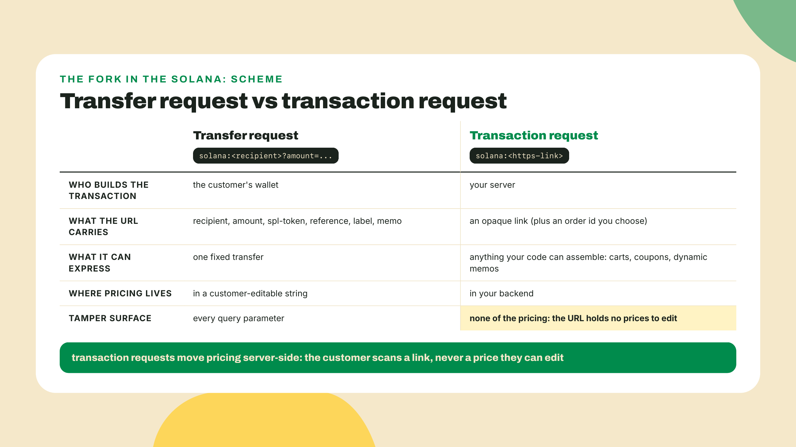
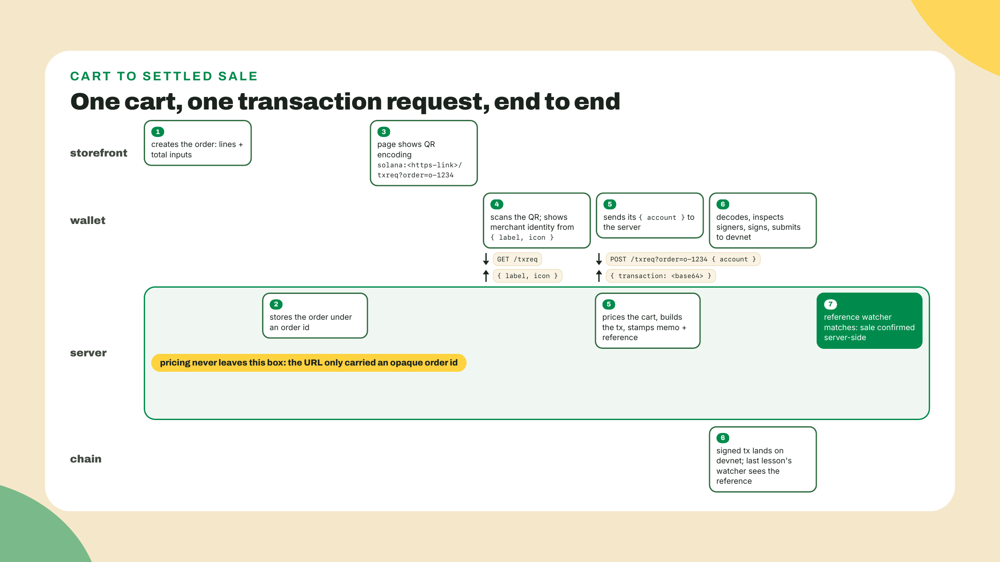
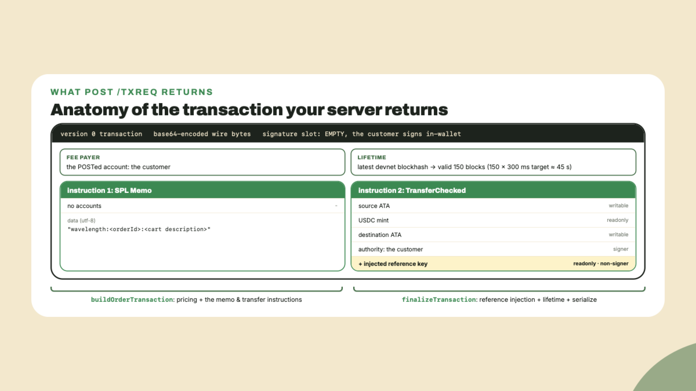
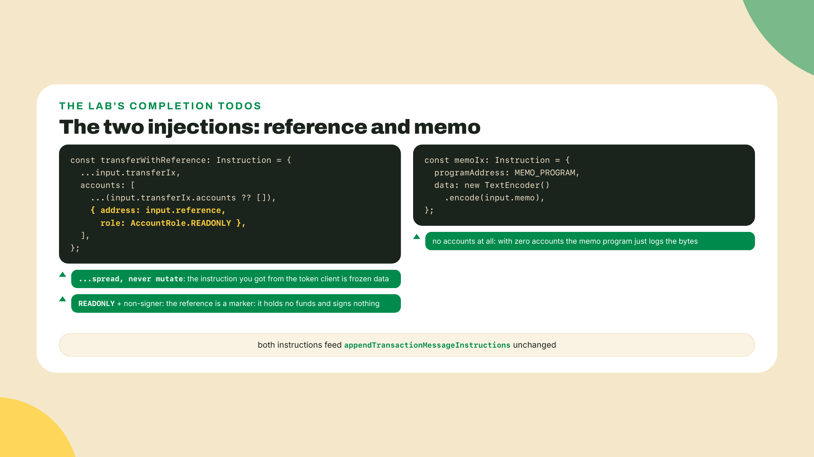
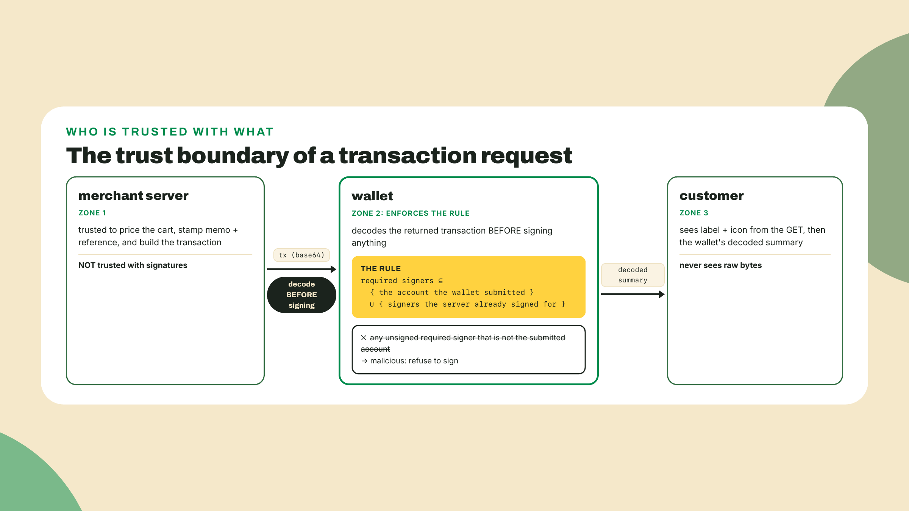
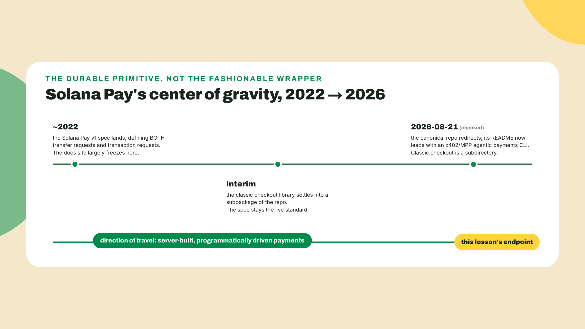
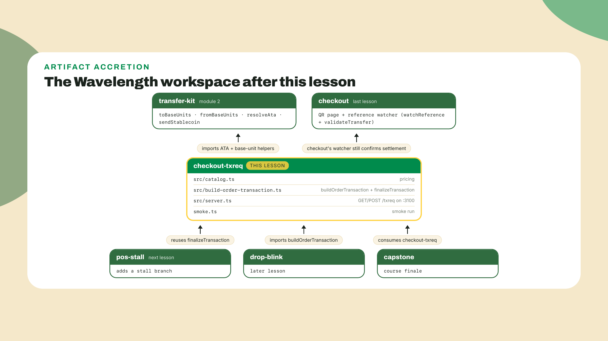

# Transaction requests: the server builds the transaction

Last lesson, checkout put a QR on a page and a watcher behind it: the reference key you embedded let your server match the incoming devnet transfer and validate it. Real progress. But look at who did the building. The customer's wallet assembled that transaction from a fixed URL, which means one record at one price is everything your checkout can express.

Now picture the actual store. A customer has three records in a cart, a coupon code from last month's newsletter, and an order id your ledger needs stamped on-chain. Where do those live? Not in a URL. A URL is a string the customer holds, and every character of it is editable before their wallet ever acts on it. A total in a URL is a suggestion. A coupon in a URL is an invitation.

The silver bullet? Stop letting the wallet build the transaction. This lesson inverts the protocol: the wallet brings you the customer's account, and your server hands back a fully built transaction with the cart priced, the memo stamped, and the reference injected, all by code you control. Scaffold the workspace now so the install runs while you read. Run the `mkdir` from the `wavelength` root, so the new folder sits beside `transfer-kit` and the relative imports below resolve:

```bash
mkdir -p checkout-txreq/src checkout-txreq/public
cd checkout-txreq
npm init -y
npm pkg set type=module
npm install @solana/kit@6.10.0 @solana-program/token@0.14.0 express@5
npm install -D tsx@4 typescript @types/express @types/node
```

Pin notes, checked 2026-08-22: `@solana/kit` 6.10.0 is the last v6 release, and this workspace stays on v6 because `@solana/pay` 1.0.26 (published 2026-07-31, still npm `latest`) peers kit ^6.9. `@solana-program/token` 0.14.0 is the last kit-v6-compatible minor; the 0.15.x wave peers kit ^7, so it would break this workspace. `express` 5 is the current major. `tsx` is the runner you have used all course. One deliberate absence: do NOT add `@solana/pay` to this workspace. Its peer range wants `@solana-program/token` ^0.12, which fights the 0.14.0 pin, and this server never encodes a URL anyway; the pay library stays over in the checkout project, where the page lives.

## Summary

The findings index, each line actionable:

- A transaction request flips the URL scheme: `solana:<https-link>` instead of `solana:<recipient>`. One shape difference, a completely different protocol underneath.
- The wallet speaks two verbs at your link. GET returns `{ label, icon }` so the wallet can show who is asking for money. POST `{ account }` returns `{ transaction }`, a base64-encoded transaction built for that specific payer.
- You ship **checkout-txreq**: an Express endpoint at `/txreq` (port 3100, plain http locally; wallets will want https, and the point-of-sale lesson proxies it) plus `buildOrderTransaction`, the pricing-and-assembly core every later surface in this course reuses.
- Pricing moves entirely server-side. The URL carries only an opaque order id; the total, the coupon math, the memo, and the reference key are computed and injected by your code. Never trust a client-sent price.
- The trade is a new trust boundary: the wallet now signs a transaction your server authored. The spec's rule polices it: a request demanding a signature from an account the user did not submit is malicious and must be rejected. You will implement that rejection yourself.
- A built transaction embeds a blockhash, valid for 150 blocks. At the current 300ms target slot time that is roughly 45 seconds of wall clock, and SIMD-0525 has two more slot-time cuts already staged; the number derives from slot time, so derive it, never memorize it.

Your share of the work today: the GET and POST handlers are worked, every line given. The server-side total computation and the memo-and-reference injection ship as TODOs in the scaffold, and the theory section teaches you exactly what goes in them. The coupon path and the malicious-request guard are yours alone at the end.

## Who builds the transaction now

### One character different, an inverted protocol

Put the two URL forms side by side. A transfer request is `solana:<recipient>?amount=...&spl-token=...&reference=...`: the recipient is the URL, the parameters are the transaction, and the wallet does the assembling. A transaction request is `solana:<https-link>`: the payload is a link to your server, and the wallet's job shrinks to fetching, displaying, and signing. Same `solana:` prefix. If what follows parses as an https URL, the wallet treats it as a transaction request; if it parses as an address, a transfer request. Wallets dispatch on that shape, and so should your mental model, because everything else in this module hangs off which side of that fork you are on.



Why did the QR lesson come first, then? Because the transfer request is trustless in a way this lesson deliberately gives up. There was no server to compromise: the wallet built the transfer itself from parameters the customer could inspect. Dead simple, and exactly as limited as it sounds. The moment you want cart logic, you need code running somewhere the customer cannot edit, and code running somewhere means trust in that somewhere. Hold that thought; it becomes the security section.

If you carry Stripe scars, this inversion will feel familiar. The client-only flow, a price baked into a frontend widget, is the thing every Stripe integration guide warns you off within the first page. The grown-up flow is a PaymentIntent: your backend decides the amount, attaches the metadata, and hands the client something already priced. A transaction request is that same shape on Solana rails. Pricing logic returns to your backend, where it always belonged, and the wallet becomes the confirmation surface instead of the calculator.

### The round trip: GET, then POST

The wallet makes two calls to your link, in a fixed order, and the order is the point.

First it GETs your endpoint. Your response is small: a `label` string and an `icon` URL. That is not decoration. The wallet is about to ask a human to approve a payment built by an unknown server, and the GET gives it something honest to display before anything financial happens: who you are paying, with a face. Honest, with a caveat worth saying out loud: the label is self-reported. Any server can answer "Wavelength Records," which is why well-built wallets display your domain alongside your label, and why the identity a customer can actually verify is the https origin, not the string you chose. Your job is to keep those two pointing at the same business. Only after rendering that context does the wallet POST `{ "account": "<base58 pubkey>" }`, the customer's public key, to the same URL. Your server now knows the one thing it could not know in advance, who is paying, and can build the transaction for exactly that payer: their account as fee payer, their token account as the source of funds.



Notice what the split buys you. The GET is cacheable, unauthenticated, safe to hit a hundred times. The POST is per-customer and returns a transaction that is only valid briefly, because your server stamps it with a recent blockhash. A blockhash must be no older than 150 blocks when the transaction lands; at the current 300ms target slot time that works out to roughly 45 seconds. Derive that window from slot time whenever you quote it, because the slot time is the thing that moves: it was ~60 seconds at the old 400ms slots and ~53 at SIMD-0525's 350ms stage, the 300ms stage took force at epoch 1024, and two more cuts are already gated in the code. Practically: build on POST, never on GET, and never cache a built transaction. A customer who scans, wanders off, and signs two minutes later gets a stale blockhash and a failed submit, which is annoying but safe; their wallet simply re-requests.

Could the wallet just send you the whole cart in that POST, and skip the order id? No, and the constraint is a feature. The wallet speaks the spec, and the spec's POST body is `{account}`, nothing else. Anything else your build needs has to ride the URL you minted, which is exactly why the URL carries an opaque order id pointing at state your server already holds. The wallet stays a dumb, auditable signer; your server stays the only author of business logic. The moment you find yourself wishing the wallet would send you more, you are usually trying to move pricing back to the client, and you know how that story ends.

One consequence of build-on-POST deserves its own paragraph: the POST is not idempotent, and that is fine. Hit your endpoint twice for the same order and you get two different transactions, each with its own fresh reference key, because `buildOrderTransaction` mints one per call. A wallet that re-requests after a stale blockhash does exactly this. Relax: at most one of those transactions ever settles, the customer signs one, and your watcher matches whichever reference actually lands on-chain. What you must NOT do is treat "I built a transaction" as "I made a sale." A build is a quote. Settlement is the sale, and the back-office module formalizes that distinction with signature-keyed idempotency on the ledger side.

### What the server assembles

Time to be concrete about the thing your POST handler returns. It is a version 0 transaction with the customer as fee payer and two instructions inside.

The last instruction is the payment itself: a `TransferChecked` moving the cart total in devnet USDC (mint `4zMMC9srt5Ri5X14GAgXhaHii3GnPAEERYPJgZJDncDU`, 6 decimals) from the customer's associated token account to yours. This is transfer-kit territory from module 2, and you reuse it directly: `resolveAta(owner, mint, tokenProgram)` finds both token accounts, passing the classic Token program for devnet USDC, `toBaseUnits` keeps the money math in exact bigints. The totals are computed from decimal strings, summed as base units, never floated. The one new trick is that the customer is the `authority` but has not signed anything yet; your server builds an unsigned transaction and the signature arrives later, in their wallet. Kit is comfortable with that: you assemble the message, compile it, and serialize it with the signature slot empty.



Before moving on, the failure mode that will actually bite you at a demo: token accounts that do not exist. `TransferChecked` moves funds between associated token accounts, and an ATA only exists once someone paid its rent — the rent-exempt minimum for a 165-byte token account, 1,488,440 lamports read off devnet on 2026-09-07 and falling as SIMD-0437 steps the rate down — the line item you costed in module 2 by asking the cluster rather than trusting a constant. Your merchant destination ATA exists because transfer-kit created it when you first received USDC. The customer's source ATA is the risky one: a wallet that has never held devnet USDC has no USDC account, your built transaction references an address with nothing behind it, and the wallet's pre-sign simulation fails with an error the customer will read out loud to you. There is no server-side fix inside this transaction without taking on rent for strangers; the honest handling is a storefront check (their balance is visible on-chain before you ever render the QR) and a clear message. Production checkouts do exactly this, and yours will in the capstone.

Immediately before the transfer sits an SPL Memo carrying `wavelength:<orderId>:<description>`. In the QR lesson the memo rode along as a URL parameter and the wallet included it; now your server writes it directly, which means it can carry your real order id and a machine-parsable cart summary, and the customer cannot edit either. Your back-office module will lean on this hard.

And the reference? Same discipline you learned with `findReference`: a fresh single-use key per payment, generated before the payment exists, so you can locate the transaction later. What changes is where it lives. The wallet is no longer assembling anything, so your server injects the reference itself, as one extra account appended to the transfer instruction: readonly, not a signer, pure marker. Any account listed in a transaction is indexed by RPC nodes, which is the whole trick behind reference keys and always has been. Here are both constructions, exactly as they go into the completion TODOs later:



I want to flag the quiet decision in that snippet, because it is the kind you will make weekly as a payments engineer. The reference could have gone on the memo instruction instead; on-chain indexing would still find it. It goes on the transfer because that is where `@solana/pay`'s own validation logic looks for transfer-adjacent references, and matching the convention your tools expect beats a private cleverness every time. I have been burned by the opposite choice before, a "better" layout that made every downstream library fight me. Convention is a feature.

### The trust boundary you just created

Here is the trade-off, stated plainly. Server-built transactions give you full control: pricing, memos, references, any instruction your code can assemble. In exchange, the wallet now receives a fully built transaction from an https endpoint and is asked to sign it. The customer's protection is no longer "I can read the URL parameters." It is the wallet's inspection of what came back. You moved the trust boundary, and something has to police the new line.

The spec polices it with one blunt rule: a request that demands a signature from an account the user did not submit is malicious, and the wallet must reject it. Sit with what that catches. A hostile server, or your compromised one, could return a perfectly valid-looking payment that also requires a signature from some other account: a treasury key the user happens to control, a multisig member, anything the attacker hopes gets rubber-stamped. The wallet knows exactly one account was volunteered, the one it POSTed. Every other required signer in the returned transaction is a demand nobody agreed to, with one legitimate exception: if the server partially signed the transaction itself, those signatures arrive already provided, and the wallet verifies them rather than being asked to produce them.



How does a wallet actually check this? By decoding the wire bytes before signing, and you will do the same in this lesson's smoke client, because your smoke client is playing the wallet. The layout does the work for you: a compiled message declares `numSignerAccounts` in its header, and its static account list is ordered signers-first. Slice the first `numSignerAccounts` addresses and you are holding the complete list of demanded signers; anything in that slice that is not your submitted account, and is not already carrying a real signature, is grounds for rejection. Kit ships the decoders (`getTransactionDecoder`, `getCompiledTransactionMessageDecoder`), so the check is a dozen lines, and writing it once will do more for your intuition than any diagram, which is why the solo rung makes you write it.

One more honest note while we are here: this rule protects signatures, not judgment. A wallet that enforces it perfectly will still happily present a transaction that pays the wrong amount to the wrong merchant, and the customer's defense there is the wallet's decoded summary plus your label and icon. The rule is the floor of transaction-request safety; the ceiling is somewhere well above it. Treat it as the minimum you verify, and let your back office (next module) verify everything else after settlement.

### Where the spec's energy went

A short reality beat before the lab, because the ground under this lesson moved recently and you should know which way. Go look at the canonical Solana Pay repository today and the README that greets you is not a QR checkout library. As of 2026-08-21, the repo leads with an agentic payments CLI built around x402 and MPP, machine-driven HTTP payments, with the classic checkout library living on as a subdirectory. The Foundation's payments energy visibly moved from wallet-scans-a-QR toward programmatic, server-driven payment flows.



Read that arc from where you are sitting today, one lesson deep into server-built transactions. An agent paying over HTTP and a wallet answering a transaction request are the same move: a server that prices, builds, and returns something to sign. The QR was always a delivery mechanism. What you are building this lesson, the GET-POST pair around a server-side builder, is the shape the ecosystem is doubling down on, which is why this endpoint, not the QR page, is the artifact the rest of this course keeps consuming. Module 7 meets the agentic end of that arc head-on.

## Lab: build checkout-txreq

The layout you are about to fill in, and where it sits in the Wavelength workspace:



1. **The catalog and the pricing rules.** Create `src/catalog.ts`. The interfaces and the store data are given; `priceOrder` ships as your first completion TODO, with the rules it must implement sitting right on top of it:

   ```typescript
   // checkout-txreq/src/catalog.ts
   // The store's source of truth. Prices are decimal strings, parsed exactly;
   // no float ever touches money in this course.
   import { toBaseUnits, fromBaseUnits } from '../../transfer-kit/src/index';

   export interface CatalogEntry {
     title: string;
     priceUsdc: string; // decimal string, e.g. "22.5"
   }

   export interface OrderLine {
     sku: string;
     quantity: number;
   }

   export interface PricedOrder {
     baseUnits: bigint;   // final total in USDC base units (6 decimals)
     totalUsdc: string;   // display form of the same number
     description: string; // "1x WVL-001, 2x WVL-002"
   }

   export const CATALOG: Record<string, CatalogEntry> = {
     'LP-041': { title: 'Slow Tides, Wavelength pressing 041', priceUsdc: '12.5' }, // last lesson's record, now priced server-side
     'WVL-001': { title: 'Wavelength LP, first press', priceUsdc: '18' },
     'WVL-002': { title: 'Late Static Night, 12-inch', priceUsdc: '22.5' },
     'WVL-045': { title: 'The August pressing, limited', priceUsdc: '30' },
   };

   export function priceOrder(lines: OrderLine[], coupon?: string): PricedOrder {
     // Rule 1: reject an empty cart, an unknown sku, and any quantity outside 1..20.
     // Rule 2: subtotal in base units: toBaseUnits(entry.priceUsdc, 6) * BigInt(quantity),
     //         summed as bigint. fromBaseUnits(total, 6) gives you totalUsdc back.
     // Rule 3: description joins the lines: "1x WVL-001, 2x WVL-002".
     // (coupon is unused for now; it is your solo rung.)
     throw new Error('Your turn: compute the total per the three rules above.');
   }
   ```

   The import path assumes transfer-kit sits one directory over, as it has since module 2; adjust it to your layout. Keep `WVL-045` at 30 exactly, a later lesson sells that pressing through this same catalog.

2. **The builder.** Create `src/build-order-transaction.ts`. This file is the payment core the rest of the course imports, so its two exported names matter as much as its behavior: `buildOrderTransaction` for callers, `finalizeTransaction` as the shared tail. Everything is given except the two injections you already saw in the theory section:

   ```typescript
   // checkout-txreq/src/build-order-transaction.ts
   // The payment core: price an order server-side, stamp the memo and reference,
   // return a base64 transaction for the submitted account to sign.
   import {
     AccountRole,
     address,
     appendTransactionMessageInstructions,
     compileTransaction,
     createSolanaRpc,
     createTransactionMessage,
     generateKeyPairSigner,
     getBase64EncodedWireTransaction,
     pipe,
     setTransactionMessageFeePayer,
     setTransactionMessageLifetimeUsingBlockhash,
     type Address,
     type Instruction,
   } from '@solana/kit';
   import { getTransferCheckedInstruction, TOKEN_PROGRAM_ADDRESS } from '@solana-program/token';
   import { resolveAta } from '../../transfer-kit/src/index';
   import { priceOrder, type OrderLine } from './catalog';

   const USDC_MINT = address('4zMMC9srt5Ri5X14GAgXhaHii3GnPAEERYPJgZJDncDU'); // devnet USDC, 6 decimals
   const USDC_DECIMALS = 6;
   const MEMO_PROGRAM = address('MemoSq4gqABAXKb96qnH8TysNcWxMyWCqXgDLGmfcHr'); // SPL Memo v2
   const RPC_URL = process.env.RPC_URL ?? 'https://api.devnet.solana.com';

   const rpc = createSolanaRpc(RPC_URL);

   function merchantAddress(): Address {
     const configured = process.env.MERCHANT_ADDRESS;
     if (!configured) throw new Error('set MERCHANT_ADDRESS to the wallet checkout already pays');
     return address(configured);
   }

   export interface BuildOrderInput {
     account: string;      // base58 pubkey the wallet POSTed; the ONLY signer we may demand
     sku?: string;         // single-line form (a later lesson calls it this way)
     quantity?: number;
     lines?: OrderLine[];  // multi-line cart form
     coupon?: string;      // wired on the solo rung
     orderId?: string;
   }

   export interface BuiltOrder {
     transactionBase64: string;
     reference: Address;
     memo: string;
     totalUsdc: string;
   }

   export async function buildOrderTransaction(input: BuildOrderInput): Promise<BuiltOrder> {
     const lines =
       input.lines ?? (input.sku ? [{ sku: input.sku, quantity: input.quantity ?? 1 }] : []);
     const priced = priceOrder(lines, input.coupon);

     const payer = address(input.account);
     const reference = (await generateKeyPairSigner()).address;
     const orderId = input.orderId ?? `ord-${Date.now().toString(36)}`;
     const memo = `wavelength:${orderId}:${priced.description}`;

     // resolveAta takes the owning token program as its third seed since the
     // roster lesson. Devnet USDC is a classic Token mint, so the program is
     // static here; no per-request detection round trip needed.
     const sourceAta = await resolveAta(payer, USDC_MINT, TOKEN_PROGRAM_ADDRESS);
     const destinationAta = await resolveAta(merchantAddress(), USDC_MINT, TOKEN_PROGRAM_ADDRESS);

     const transferIx = getTransferCheckedInstruction({
       source: sourceAta,
       mint: USDC_MINT,
       destination: destinationAta,
       authority: payer,
       amount: priced.baseUnits,
       decimals: USDC_DECIMALS,
     });

     const transactionBase64 = await finalizeTransaction({
       feePayer: payer,
       transferIx,
       reference,
       memo,
     });

     return { transactionBase64, reference, memo, totalUsdc: priced.totalUsdc };
   }

   export interface FinalizeInput {
     feePayer: Address;
     transferIx: Instruction;
     reference: Address;
     memo: string;
   }

   // The shared tail every surface reuses: inject the reference, stamp the memo,
   // set the lifetime, serialize. Later lessons call this directly.
   export async function finalizeTransaction(input: FinalizeInput): Promise<string> {
     // TODO(completion) 1: rebuild the transfer instruction with ONE extra account
     // appended: { address: input.reference, role: AccountRole.READONLY }.
     // Spread the existing accounts; never mutate the instruction you were given.
     const transferWithReference: Instruction = input.transferIx; // replace me

     // TODO(completion) 2: the memo instruction: programAddress MEMO_PROGRAM,
     // no accounts, data = new TextEncoder().encode(input.memo).
     const memoIx: Instruction = { programAddress: MEMO_PROGRAM, data: new Uint8Array() }; // replace me

     const { value: latestBlockhash } = await rpc.getLatestBlockhash().send();

     const message = pipe(
       createTransactionMessage({ version: 0 }),
       (m) => setTransactionMessageFeePayer(input.feePayer, m),
       (m) => setTransactionMessageLifetimeUsingBlockhash(latestBlockhash, m),
       (m) => appendTransactionMessageInstructions([memoIx, transferWithReference], m),
     );

     return getBase64EncodedWireTransaction(compileTransaction(message));
   }
   ```

   Read the pipe once, top to bottom, because it is the whole kit transaction model in five lines: an empty version 0 message, a fee payer, a lifetime, instructions, then compile and serialize. `generateKeyPairSigner` mints the reference; you keep only its address, the private key is never used and never stored. Note also what `buildOrderTransaction` refuses to accept: no amount field exists on its input. There is no way for a caller, or a customer, to hand this function a price.

3. **The server.** Create `src/server.ts`. Fully worked; this is the GET and POST pair from the theory section made literal:

   ```typescript
   // checkout-txreq/src/server.ts
   // The transaction-request endpoint: GET answers with display metadata,
   // POST {account} answers with a base64 transaction built server-side.
   import express from 'express';
   import type { NextFunction, Request, Response } from 'express';
   import { buildOrderTransaction } from './build-order-transaction';
   import type { OrderLine } from './catalog';

   const app = express();

   // Cross-origin access, before any other middleware. Next lesson the
   // point-of-sale page -- served from https://localhost:3001 -- POSTs to
   // this endpoint itself, and a browser preflights that cross-origin JSON
   // POST with an OPTIONS request. Without these headers the preflight
   // fails and the real POST never leaves the page. A wallet scanning a QR
   // is not a browser and never preflights; the POS page is, and does.
   app.use((req: Request, res: Response, next: NextFunction) => {
     res.setHeader('Access-Control-Allow-Origin', '*');
     res.setHeader('Access-Control-Allow-Methods', 'GET,POST,OPTIONS');
     res.setHeader('Access-Control-Allow-Headers', 'Content-Type');
     if (req.method === 'OPTIONS') {
       res.sendStatus(204);
       return;
     }
     next();
   });

   app.use(express.json());
   app.use(express.static('public'));

   const BASE_URL = process.env.BASE_URL ?? 'http://localhost:3100';
   const PORT = Number(process.env.PORT ?? 3100);

   interface Order {
     lines: OrderLine[];
     coupon?: string;
   }

   // The web-cart path: your storefront creates the order BEFORE showing the QR,
   // so the URL only ever carries an opaque order id. In production this map is
   // your database; the demo cart below is what smoke.ts buys.
   const ORDERS = new Map<string, Order>([
     ['demo-cart', { lines: [{ sku: 'WVL-001', quantity: 1 }, { sku: 'WVL-002', quantity: 2 }] }],
   ]);

   app.get('/txreq', (_req: Request, res: Response) => {
     res.json({
       label: 'Wavelength Records',
       icon: `${BASE_URL}/icon.png`,
     });
   });

   app.post('/txreq', async (req: Request, res: Response) => {
     const account: unknown = (req.body as { account?: unknown } | undefined)?.account;
     if (typeof account !== 'string' || account.length === 0) {
       res.status(400).json({ message: 'Body must be { "account": "<base58 pubkey>" }' });
       return;
     }

     const orderId = typeof req.query.order === 'string' ? req.query.order : 'demo-cart';
     const order = ORDERS.get(orderId);
     if (!order) {
       res.status(404).json({ message: `unknown order: ${orderId}` });
       return;
     }

     try {
       const built = await buildOrderTransaction({
         account,
         lines: order.lines,
         coupon: order.coupon,
         orderId,
       });
       console.log(`[txreq] order ${orderId}: ${built.totalUsdc} USDC, ref ${built.reference}`);
       res.json({
         transaction: built.transactionBase64,
         message: `Wavelength Records: ${built.totalUsdc} USDC`,
       });
     } catch (err) {
       res.status(400).json({
         message: err instanceof Error ? err.message : 'could not build the order transaction',
       });
     }
   });

   app.listen(PORT, () => {
     console.log(`checkout-txreq listening on :${PORT}`);
   });
   ```

   Drop any square PNG into `public/icon.png` (any placeholder art will do; wallets only need the URL to resolve) so the GET's icon URL works. The endpoint logs the reference on every build; keep that habit, it is the join key your watcher and your back office both live on.

   The CORS block at the top deserves its own sentence, because its absence would be invisible today and fatal next lesson. Every consumer this server has met so far — curl, smoke.ts, a wallet resolving a QR — talks to it with no browser in the way, so nothing enforces CORS and the server would appear to work without those headers. The point-of-sale lesson changes the client: the POS *page* fetches the transaction itself, cross-origin, and a browser refuses to send that POST unless the preflight OPTIONS comes back stamped with `Access-Control-Allow-Origin`. The middleware answers the preflight with an empty 204 and stamps every response. File the pattern away; the blinks lesson makes the same rule load-bearing for an entire distribution channel.

4. **Run it.** In one terminal, with your merchant wallet from module 2:

   ```bash
   MERCHANT_ADDRESS=$(solana address) npx tsx src/server.ts
   ```

   Checkpoint: `checkout-txreq listening on :3100`, and `curl http://localhost:3100/txreq` returns your label and icon JSON. Note this runs plain http, which is fine for today's local client; real wallets require https for transaction-request links, and the point-of-sale lesson puts this exact server behind a local SSL proxy rather than teaching certificates twice.

5. **The smoke client.** Create `smoke.ts` at the project root. It plays the wallet: GET, POST, then decode the response and verify your work actually landed inside the bytes:

   ```typescript
   // checkout-txreq/smoke.ts
   // Plays the wallet: GET the metadata, POST {account}, then decode what came
   // back and prove the memo and reference made it into the transaction.
   import {
     generateKeyPairSigner,
     getBase64Encoder,
     getCompiledTransactionMessageDecoder,
     getTransactionDecoder,
   } from '@solana/kit';

   const TXREQ_URL = process.env.TXREQ_URL ?? 'http://localhost:3100/txreq';
   const MEMO_PROGRAM = 'MemoSq4gqABAXKb96qnH8TysNcWxMyWCqXgDLGmfcHr';

   function fail(msg: string): never {
     console.error(`SMOKE FAIL: ${msg}`);
     process.exit(1);
   }

   async function main(): Promise<void> {
     const customer = (await generateKeyPairSigner()).address;

     // 1. GET: the display step
     const get = await fetch(TXREQ_URL);
     if (get.status !== 200) fail(`GET returned ${get.status}`);
     const meta = (await get.json()) as { label?: unknown; icon?: unknown };
     if (typeof meta.label !== 'string' || typeof meta.icon !== 'string') {
       fail('GET must return { label, icon }');
     }

     // 2. POST {account}: the build step
     const post = await fetch(TXREQ_URL, {
       method: 'POST',
       headers: { 'Content-Type': 'application/json' },
       body: JSON.stringify({ account: customer }),
     });
     if (post.status !== 200) fail(`POST returned ${post.status}: ${await post.text()}`);
     const body = (await post.json()) as { transaction?: unknown; message?: unknown };
     if (typeof body.transaction !== 'string' || body.transaction.length === 0) {
       fail('POST must return a base64 transaction');
     }

     // 3. Decode the wire bytes and check your work landed inside them
     const wireBytes = getBase64Encoder().encode(body.transaction);
     const tx = getTransactionDecoder().decode(wireBytes);
     const message = getCompiledTransactionMessageDecoder().decode(tx.messageBytes);
     if (message.version !== 0) {
       // Solana has two envelope shapes, legacy and version 0. Kit decodes
       // both, but our server builds version 0 and that is what this smoke
       // asserts came back.
       fail('server did not return a version 0 transaction envelope');
     }

     const memoPresent = message.instructions.some(
       (ix) => message.staticAccounts[ix.programAddressIndex] === MEMO_PROGRAM,
     );
     if (!memoPresent) fail('no memo instruction in the built transaction: the finalize TODOs are still open');

     const transfer = message.instructions.find(
       (ix) => message.staticAccounts[ix.programAddressIndex] !== MEMO_PROGRAM,
     );
     if (!transfer || (transfer.accountIndices ?? []).length !== 5) {
       fail('transfer instruction has no injected reference account (expected 5: source, mint, destination, authority, reference)');
     }

     const lastIx = message.instructions[message.instructions.length - 1];
     if (message.staticAccounts[lastIx.programAddressIndex] === MEMO_PROGRAM) {
       fail('memo is the last instruction: validateTransfer pops the last instruction and expects the transfer');
     }

     console.log(
       `GET returned label/icon; POST {account} returned a base64 transaction for the cart total (${String(body.message ?? '')})`,
     );
   }

   main().catch((err) => fail(err instanceof Error ? err.message : String(err)));
   ```

   Run `npx tsx smoke.ts` in a second terminal. With the TODOs still open it fails, first on the empty `priceOrder`, then on the transfer instruction missing its injected reference account. (The placeholder `memoIx` already names the right program address, so the memo check only fires if you delete the placeholder outright; the five-account count is what catches the open TODO.) That failure sequence is your completion rung's to-do list in the right order. The decoding block is worth a slow read even before you fix anything: it is one third of the wallet-safety guard you will finish solo, and `numSignerAccounts` plus signers-first ordering is all the extra knowledge that step needs.

6. **Point the page you already have at it.** Your checkout page from last lesson still encodes a transfer request. Two small edits over in the checkout project (where `@solana/pay` 1.0.26 already lives) swap it to the link form. First, in `checkout/server.ts`, stamp an order id instead of a finished URL: change the QR div to `<div id="qr" data-order="demo-cart"></div>`. Three things above it can go with it, and should: the `url` construction, the `newReference()` call, and the `awaitSale(...)` block with its `checkout open ref=` log. All three belonged to the transfer-request flow. Under a transaction request the reference is minted server-side by `buildOrderTransaction` in the *other* workspace, so a reference this page mints reaches no wallet and no transaction, and a watcher armed on it can never resolve — a live WebSocket subscription per page load, waiting forever, plus a log line naming a reference no sale will ever carry. The watching moves with the reference: it is `checkout-txreq`'s job now. Then replace the body of `checkout/page.ts`:

   ```typescript
   // wavelength-checkout/checkout/page.ts: the transaction-request swap
   import { encodeURL, createQR } from '@solana/pay';

   // The server now stamps only an opaque order id; this file builds the
   // solana:<https-link> URL and turns it into pixels.
   const mount = document.getElementById('qr')!;
   const link = new URL(`http://localhost:3100/txreq?order=${mount.dataset.order}`);
   const url = encodeURL({ link });
   const qr = createQR(url.toString(), 360, 'white', 'black');
   qr.append(mount);
   ```

   Re-bundle it (`npx esbuild checkout/page.ts --bundle --format=esm --outfile=checkout/public/page.js`), then reload the page with both servers up: the checkout page on :3010, this endpoint on :3100. Same `encodeURL`, different field: pass `link` instead of `recipient` and the library emits `solana:<https-link>` instead of `solana:<recipient>`. That one-field change is the entire client-side migration, which tells you where all the real work moved. Checkpoint: the page renders a QR whose decoded text starts with `solana:http`. Be honest with yourself about what a phone will do with it, though: wallets require https for transaction-request links, so a strict wallet will refuse this plain-http QR. Today your smoke client is the wallet; next lesson an SSL proxy goes in front of port 3100 and this same QR becomes scannable at a market stall. The page is wired now so that lesson only has to add the proxy.

## Challenge

**Completion.** Fill the two TODO sites: `priceOrder` in `src/catalog.ts` per its three rules, and the two constructions in `finalizeTransaction` per the annotated shapes in the theory section. Acceptance: `npx tsx smoke.ts` prints `GET returned label/icon; POST {account} returned a base64 transaction for the cart total` with the demo cart's total in the message. Do the arithmetic yourself before trusting the output: 1 at 18 plus 2 at 22.5 is 63 USDC, and if your server says anything else, your base-unit math has a float in it somewhere. My first run printed exactly `Wavelength Records: 63 USDC`, and the reference logged next to it is the thing last lesson's watcher would match once this sale settles.

**Solo, in three parts, no walkthrough.** First, the coupon path: add a `COUPONS` table (`CRATEDIG10` at 10 percent off is the demo code), extend `priceOrder` to apply it to a multi-item cart in bigint math (floor the discount; rounding drift in the store's favor is a refund ticket waiting to happen), and add an order to `ORDERS` that carries the coupon. Second, the guard: write `assertNoForeignSignatureDemand(transactionBase64, submittedAccount)` in your smoke client using the decoders you already imported. Slice the first `numSignerAccounts` entries of `staticAccounts`; every address in that slice must either be the submitted account or already carry a non-zero signature in `tx.signatures`, and anything else throws. Then prove the guard fires: build a malicious-shaped fixture locally by calling `finalizeTransaction` with a doctored instruction that lists a second account as `WRITABLE_SIGNER`, and assert your guard rejects it. Third, settle one: POST as your pretend customer (`/tmp/customer.json`, the wallet last lesson stocked) rather than as the merchant, sign with that key (load it with `createKeyPairSignerFromBytes`, sign with `signTransaction`, send the base64 through `rpc.sendTransaction`), and watch it land on devnet. Two reasons it must be the customer and not you: the transfer this endpoint builds runs from the POSTed account's token account to yours, so posting your own address builds a merchant-to-merchant transfer that proves nothing, and the source wallet has to actually hold the cart total, which is 63 USDC on the demo cart. If your customer wallet is short, either top it up from the merchant with transfer-kit's `pay` (and drip the faucet again if the merchant is short too) or settle a smaller order you added to `ORDERS` yourself — the guard and the coupon math are what this rung is judging, not the ticket size.

Acceptance, straight from this lesson's gate: the POST returns a base64 transaction that submits on devnet for the exact server-computed total, coupon applied, and your guard rejects the malicious-shaped request while passing the honest one. If the guard ever passes the fixture, check whether you sliced signers from the front of `staticAccounts`; slicing from anywhere else is the classic mistake, because the layout puts signers first and nothing warns you if you ignore that.

When both halves pass, notice what you are holding: a store whose prices cannot be tampered with from a URL, and a client that refuses to sign for accounts nobody volunteered. That pair, server control plus wallet skepticism, is the entire trust model of transaction requests, and you built both sides of it. Worth a coffee break.

Before you close the terminal: later lessons assume this endpoint went in clean, so if a step fought you, the TODO ordering, the signers-first slicing, the coupon rounding, flag it to the course community while it is fresh. And if your guard caught the fixture on the first run, take the win out loud; you just wrote the same check the wallet teams ship.

Your endpoint has only ever been driven from a browser tab and a smoke script, though. This endpoint is about to leave the browser entirely and hit a folding table at a weekend record fair. Next lesson you point a real point-of-sale at it, and meet the mobile-hardware reality of taking Solana payments in person.
