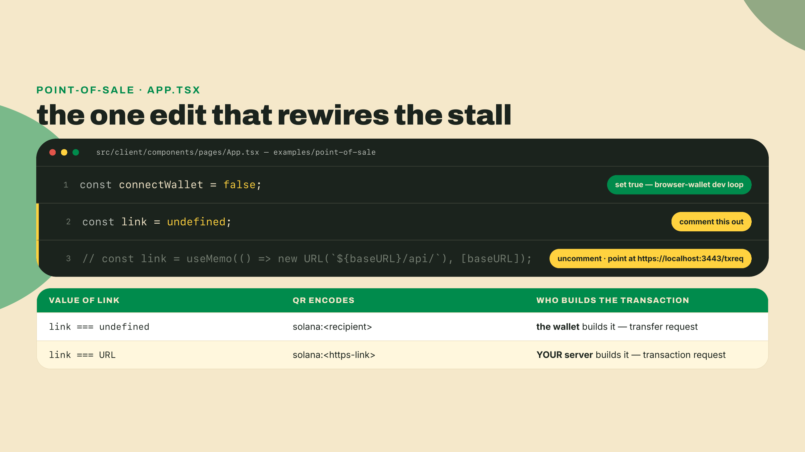
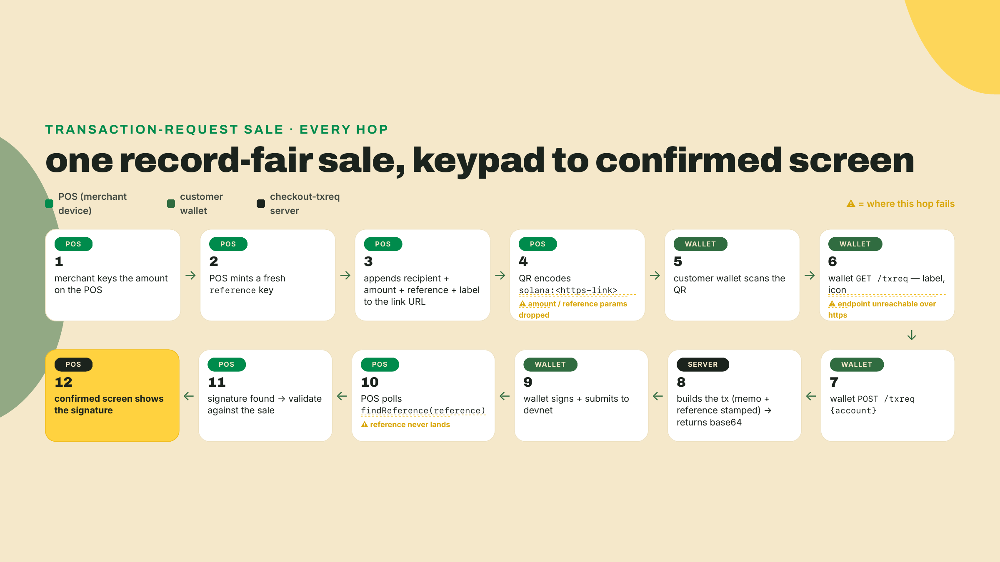
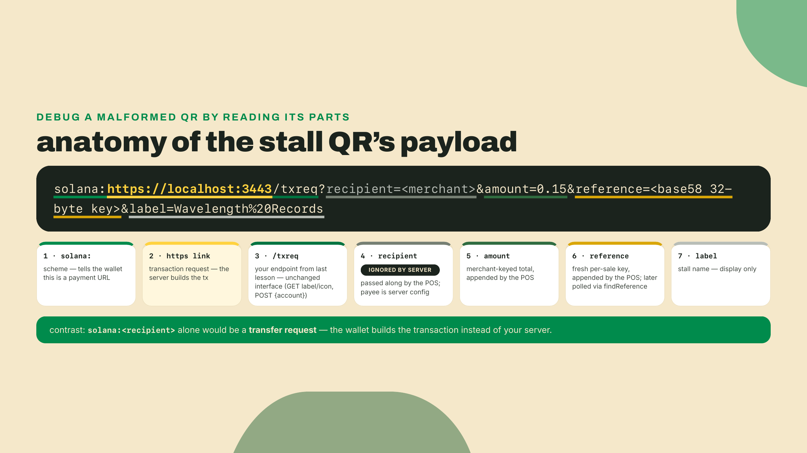
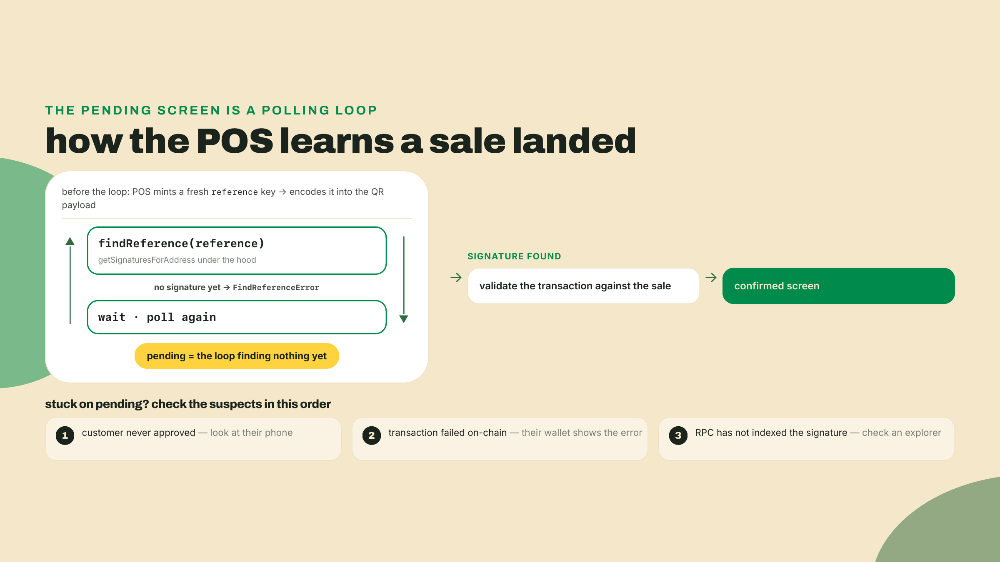
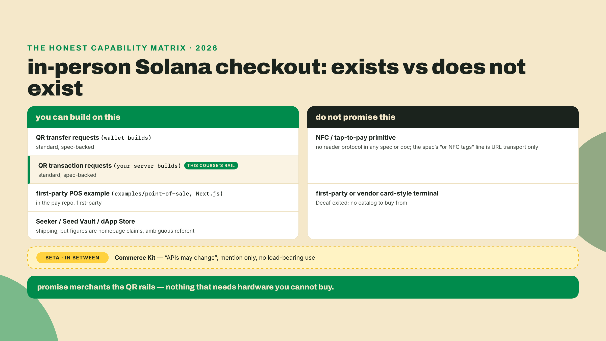
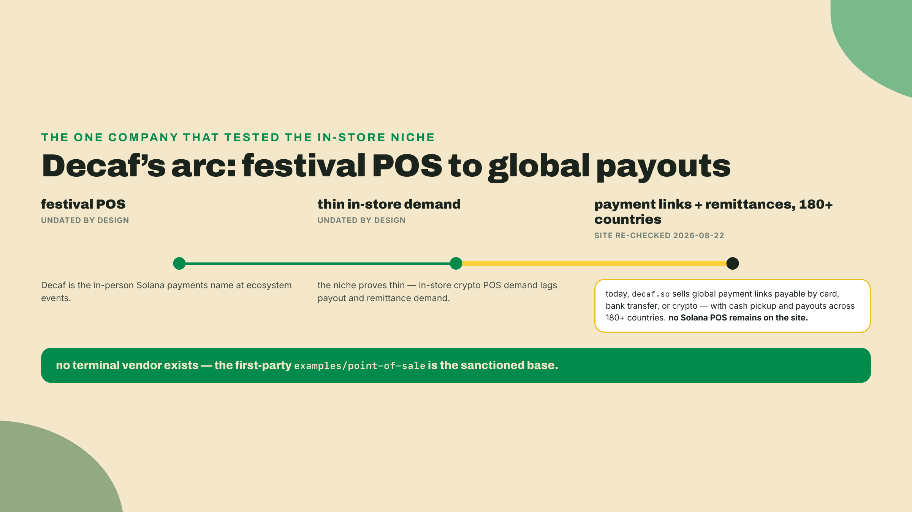
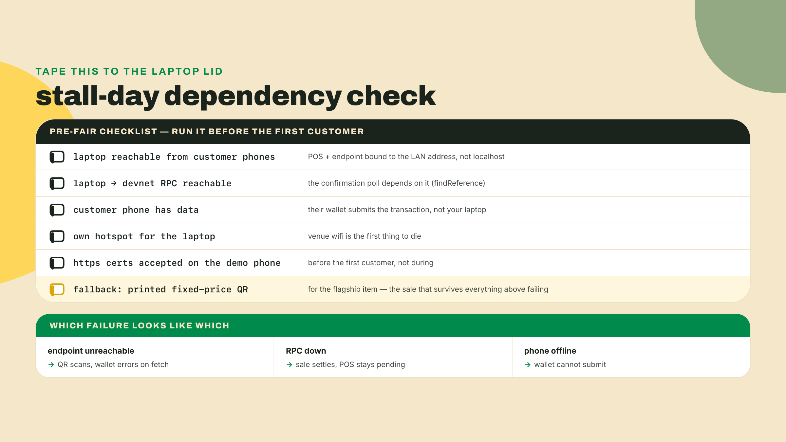
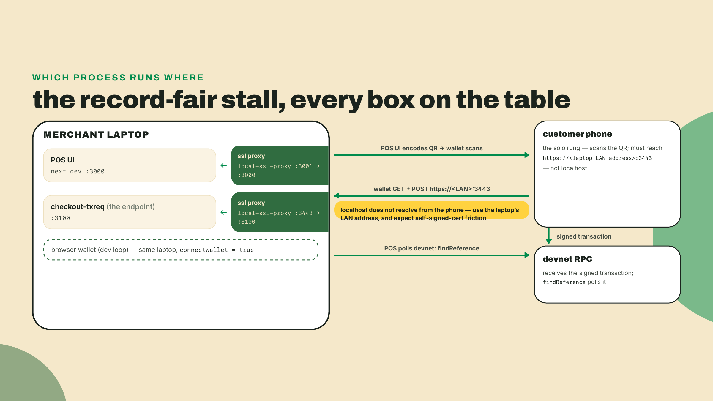

# The record fair: POS, and the mobile-hardware reality

Last lesson you moved transaction construction to your backend: checkout-txreq builds the transaction server-side and stamps the memo and reference itself, so pricing lives in your code instead of in a customer-controlled URL. That endpoint has only ever been driven from a browser tab and a smoke script on your own machine. Today it faces a customer.

It is Saturday. You have a folding table at a record fair, a crate of Wavelength pressings, no card reader, and a line forming. Your checkout is a web page. Can it take money across a table?

Yes, and you will not write a new frontend to do it. The Solana Pay repo ships a first-party point-of-sale app, `examples/point-of-sale`, a Next.js app with a number pad, a QR screen, and a confirmation flow. One toggle inside it points the whole thing at the transaction-request endpoint you already built. Start the clone now so the install runs while you read:

```bash
# the old solana-labs/solana-pay URL redirects here; cloned fresh 2026-08-22
git clone https://github.com/solana-foundation/pay.git
cd pay && git checkout 94b3627   # the POS example this lesson was written against; main moved to kit v8 on 2026-08-31

# the example consumes the repo's core package by path, and that package ships unbuilt.
# build it from the repo's own pnpm workspace first, or the app 500s on a missing import.
cd typescript && pnpm install && pnpm --filter @solana/pay build

cd packages/solana-pay/examples/point-of-sale
npm install   # Node 24+, the course floor, more than covers this repo's own pins
```

That block assumes `pnpm` is on your path; if it is not, `corepack enable pnpm` turns on the shim Node already ships.

On the Node version, because it will bite you before the install finishes otherwise: the example's own `package.json` pins `engines.node >=18`, but it consumes the repo's core package by path (`"@solana/pay": "file:../../core"`), and that package pins `engines.node >= 20` for Ed25519 in `crypto.subtle`. So the floor this repo enforces is 20 — and the Node 24+ you have run since module 1 clears it with room. Confirm anyway rather than at the first failing import:

```bash
node --version
```

Checkpoint: `v24.x` or newer, the course floor from module 1. On 18 the install may well succeed and then the first signature check throws inside `crypto.subtle`, which is a confusing failure to debug from the error message alone.

One more pre-flight fix, and it is upstream's, not yours. `@solana/connector`, the wallet layer the POS uses, lists `@solana/web3.js` as an *optional* peer and reaches for it with `await import('@solana/web3.js')` inside a legacy-transaction branch this app never takes. Optional peers do not get installed, and the example sits outside the repo's pnpm workspace, so npm resolves it lock-free and that import has nothing to point at. Webpack does not care that the branch is dead: it resolves `import()` at build time and fails the build. You get a 500 on the first page load reading `Module not found: Can't resolve '@solana/web3.js'`. Still open on `main` as of 2026-09-01, so the pin did not cause it.

The fix is one line of bundler config, and it is the honest one: you are telling webpack the truth, that an optional dependency is absent. Add a `webpack` hook to the config object in `next.config.js`, alongside `reactStrictMode`:

```js
webpack(config) {
    // @solana/connector's optional peer, reached only by a legacy code path this app
    // never takes. It is not installed; resolve it to nothing instead of failing the build.
    config.resolve.fallback = { ...config.resolve.fallback, '@solana/web3.js': false };
    return config;
},
```

Do not "fix" this by installing `@solana/web3.js`. Nothing in this stall runs on it, and pulling the deprecated SDK into a kit v6 tree to satisfy a dead import is the wrong habit to learn. Checkpoint once both fixes are in: `npm run dev`, then in another terminal `curl -o /dev/null -w '%{http_code}\n' 'http://localhost:3000/new?recipient=<any address>&label=Test'` prints `200`.

While that installs, one promise about the rest of this lesson: half of it is the build, and the other half is an honest sweep of what in-person Solana hardware actually exists in 2026. The second half matters as much as the first, because the fastest way to lose a merchant's trust is to promise them tap-to-pay on a chain that does not have it.

## Summary

Here is what today establishes, line by line:

- The pay repo ships a first-party POS at `examples/point-of-sale` (Next.js, number pad, QR, confirmation flow). You configure it with a URL: `/new?recipient=<address>&label=<name>`.
- One commented-out line in `App.tsx` switches the POS from transfer requests to transaction requests. Point that `link` at your checkout-txreq endpoint and the stall reuses the server-side pricing you built last lesson.
- In link mode the POS appends the sale's parameters (`recipient`, `amount`, a fresh `reference`, `label`) to your endpoint's URL before encoding the QR. The keypad price is merchant input from the merchant's own device, which is a different trust model than a customer-editable URL. Your endpoint still validates it, and it never takes the payee from the query.
- The confirmed screen is a poll, not a push: `findReference` walks `getSignaturesForAddress` on the sale's reference key until a signature appears, then the payment is validated. Knowing that loop is how you debug a stuck "pending".
- There is no NFC or tap-to-pay primitive on Solana. No spec defines a reader protocol and no official docs describe one. The spec does say a Solana Pay URL "may be encoded in QR codes or NFC tags", but that is transport, a tag holding the same string, not a tap flow. QR is the standard checkout surface. Do not promise tap.
- Seeker, Seed Vault, and the dApp Store are real products, but the figures on their homepage (a "150,000+ users" line with an ambiguous referent, a "0% platform fees" line) are homepage claims. Shipped-unit numbers are undisclosed. Cite none of them as verified fact.
- Decaf, once the festival-POS name on Solana, now sells global payment links that accept card, bank transfer, or crypto, with cash pickup and cross-border payouts across 180+ countries, and no Solana POS left on its site (decaf.so, re-checked 2026-08-22). There is no terminal vendor to buy from, so you build on the first-party example.
- Commerce Kit is beta ("APIs may change"). It gets a mention here and no load-bearing role.

How the work is shared out today: the worked lab hands you every command to clone, rewire, and run the stall. The completion rung leaves the merchant recipient, the endpoint link, and the cart as three TODOs in the `pos-stall` config. The solo rung is the real thing: one full in-person-style sale, scan to settled signature, receipt recorded. This lesson's check is that deployment, not a quiz.

## One toggle from web page to point of sale

### What you just cloned

The point-of-sale example is a small production-shaped app: a Next.js frontend, an API layer, rate limiting, and a `.env.example` that defaults `CLUSTER_ENDPOINT` to devnet. Its `package.json` at the pinned commit runs on `@solana/kit ^6.9.0` and consumes `@solana/pay` from the repo's own core package, whose npm release is 1.0.26 (published 2026-07-31, still `latest` at a 2026-08-22 check, peering kit ^6.9). That keeps the stall inside the same kit v6 workspace this course has used since module 2. On `main` it no longer would: a commit on 2026-08-31 moved the example to kit v8, which is exactly why the clone above checks out `94b3627` instead of riding `main`. At the pin, no new SDK line, no version cliff.

Out of the box the whole app is configured by one URL, no config file involved:

```
/new?recipient=<your merchant address>&label=<your stall name>
```

Open that and a number pad appears; you key an amount and it renders a QR encoding a transfer request, the `solana:<recipient>` form from two lessons ago. The customer scans, their wallet builds the transfer, and the app polls `findReference` until the payment lands, then flips to a confirmed screen. Useful, but it has the exact limitation that pushed you to transaction requests: the wallet builds the transaction, so a fixed recipient at a keyed amount is all it can express. No memo, no order id, no cart logic.

The unlock is nine lines into the app component. Open `src/client/components/pages/App.tsx` and find this:

```tsx
// If you're testing without a mobile wallet, set this to true to allow a browser wallet to be used.
const connectWallet = false;

// Toggle comments on these lines to use transaction requests instead of transfer requests.
const link = undefined;
// const link = useMemo(() => new URL(`${baseURL}/api/`), [baseURL]);
```

The maintainers left the seam in on purpose. When `link` is a URL, the POS stops encoding transfer requests and starts encoding transaction requests, `solana:<https-link>`, aimed wherever `link` points. The commented line aims it at the app's own bundled API. You are going to aim it at checkout-txreq instead, because you already built the better endpoint: it prices server-side, it stamps the memo and reference, and last lesson's smoke test proves it returns a base64 transaction for a POSTed `{account}`.



### How the sale actually flows

Trace one sale through the rewired stall, because two of the hops are new and one of them changes your endpoint's job.

You key 0.15 on the number pad and hit generate. The POS takes your `link` URL and appends the sale to it as query parameters before encoding anything: the configured `recipient`, the keyed `amount`, your stall's `label`, and `reference`, a fresh single-use public key it mints for this sale with `generateKeyPairSigner` (the same 32-byte base58 reference discipline you have used since the first QR lesson). Then it encodes the whole thing with `encodeURL({ link })` and paints the QR. The customer scans. Their wallet does the two-step you implemented last lesson: GET to your endpoint for a label and icon, then POST `{account}` to the same URL, query string and all. Your server builds the transaction, the wallet signs and submits, and the POS polls `findReference` on the reference it minted until the signature shows up, then validates and flips to the confirmed screen.



Here is the hop that changes your endpoint's job: the amount arrived in the URL. Two lessons of this course have drilled "never trust a client-sent price," and now the price rides a query string again. So which is it?

Look at who minted the URL. In module 3 lesson 1, the customer held a link they could edit before their wallet ever used it, so a price in that URL was customer input. At the stall, the POS runs on your device, behind your table. The keypad amount is merchant input: you keyed it, your device minted the QR, and the customer only ever scans what you displayed. That is the same trust model as typing a price into a card terminal. The rule did not change, the author of the URL did. Your endpoint should still validate the shape hard (finite, positive, sane bounds), because an https endpoint is reachable by anyone, not just your POS, and a malformed or hostile call must fail loudly rather than build a transaction. What the endpoint no longer has to do for stall sales is look up a cart by order id, because the total was composed at the table:

```typescript
// checkout-txreq: the stall branch of your POST handler's pricing step.
// Keypad sales arrive with amount + reference minted by YOUR pos device;
// validate the shape, then price from them instead of a stored cart.
import { toBaseUnits } from '../../transfer-kit/src/index';

export function priceFromStallLink(query: URLSearchParams): {
  baseUnits: bigint;
  reference: string;
} {
  const amount = query.get('amount');
  const reference = query.get('reference');
  if (!amount || !reference) {
    throw new Error('stall sales carry amount + reference minted by the POS');
  }
  // Number() here is a RANGE check on the string, never the money math.
  const bound = Number(amount);
  if (!Number.isFinite(bound) || bound <= 0 || bound > 100) {
    throw new Error(`rejected amount: ${amount}`);
  }
  // Exact base units straight from the decimal string, using the same helper
  // transfer-kit has used since module 2: devnet USDC at 6 decimals, the same
  // mint and decimals the web-cart path prices in. No float touches the amount.
  return { baseUnits: toBaseUnits(amount, 6), reference };
}
```

Wire that into the POST handler you built last lesson as a branch: if the query carries `amount` and `reference`, it is a stall sale, price from the link; otherwise it is the web cart path you already have. Notice which function the stall branch calls, because it is not `buildOrderTransaction`: that function still refuses to accept an amount from any caller, exactly as designed last lesson, and the design holds. The stall branch builds its own `TransferChecked` from the validated keypad amount and hands it straight to `finalizeTransaction`, the shared tail last lesson exported for exactly this kind of caller, and it passes the POS-minted `reference` through instead of minting a fresh one. That last part is load-bearing: the POS polls `findReference` on the key it minted, so a server that swaps in its own reference leaves the confirmed screen pending forever. Everything downstream, the memo stamp, the reference injection, the base64 response, stays the code you already wrote. That is the accretion this module keeps promising: pos-stall does not replace checkout-txreq, it consumes it.

One parameter deserves a harder rule than validation. The POS also appends `recipient` to the query, and your endpoint should ignore it completely. The payee is configuration on your server, set once, not a value that arrives per request; an endpoint that pays whatever recipient the query names is an open redirect for money, because anyone who can reach the https URL can put their own address in it. Same story for `memo` if it shows up: your endpoint stamps its own memo with its own order id, and that stays true at the stall. The query is allowed to tell you how much this sale is. It is never allowed to tell you who gets paid or what the books say.



### What the confirmed screen actually knows

The last hop deserves a closer look, because it is the one you will stare at when a sale hangs. How does a web page on your laptop know that a transaction it never saw, signed on a phone it never touched, just landed on devnet?

It polls. There is no push channel in this flow: the POS calls `findReference` on the reference key it minted for the sale, and under the hood that is `getSignaturesForAddress` against your RPC, repeated on an interval. The reference rides the transaction as a non-signer key on the transfer instruction (your endpoint injects it, that was last lesson's work), so the moment the transaction lands, the reference key has a signature history of exactly one entry. Until then, `findReference` throws `FindReferenceError`, the POS catches it, waits, and asks again. Pending is not a state the chain reports; pending is the loop not having found anything yet.

Two consequences fall out of that design, and both will save you debugging time on Saturday. First, a stuck pending screen has exactly three suspects: the customer never approved (look at their phone), the transaction failed on-chain (the wallet shows the error), or your RPC has not indexed the signature yet (wait, or check the reference key in an explorer yourself). The POS cannot tell these apart, but you can, in about ten seconds, by checking in that order. Second, the confirmation the POS shows you runs at a commitment level; the library will not even accept `processed` for this query, which is the API quietly enforcing the policy this course has repeated since module 1: never hand over goods on a status that can still be rolled back. Whether `confirmed` is enough to hand over a record, or whether you wait for `finalized` while making small talk, is a real policy decision with real latency numbers attached, and the next module's settlement lesson makes it rigorous. For a Saturday stall on devnet, the default is fine.

After the signature shows up, the POS validates the found transaction before flipping the screen, checking that what landed matches the sale it encoded. Keep that ordering in your head: found, then validated, then confirmed-on-screen. A signature existing is not the same thing as the right payment existing.



### The hardware reality: what exists, what does not

Now the second half of the lesson, and I want to be straight with you, because this is where a lot of Solana commerce content quietly oversells. You are about to run a point of sale off a laptop and a QR code, and a vendor at the next table will ask the obvious question: "can they just tap their phone?"

No. There is no NFC or tap-to-pay primitive on Solana: nothing in the Solana Pay spec, the official docs, or Solana Mobile's stack defines one, and no primary source describes a tap flow you could ship.

Be precise about one line that gets misread as a promise, because a merchant who greps will find it. The spec's motivation section says Solana Pay URLs "may be encoded in QR codes or NFC tags, or sent between users and applications to request payment and compose transactions." That sentence is about *transport*: an NFC tag is another way to hand someone the same `solana:` URL, exactly like printing it on a sticker. It defines no reader protocol, no handshake, no secure element, nothing that happens when a customer holds a phone near your table. Tap-to-pay as you know it from a card terminal is an EMV-world capability, built on secure elements, acquirer networks, and certified readers, and none of that plumbing has a Solana equivalent today. A URL on an NFC tag is a QR code you cannot see; it is not tap-to-pay. QR is the standard checkout surface, full stop. When you promise a merchant "crypto checkout," the honest shape of that promise is a camera pointed at a screen.

Before you read that as a downgrade, look at where in-person payments actually went this decade. The largest scan-to-pay systems on earth are QR systems: Pix, UPI, Alipay, WeChat Pay all settled on the camera as the checkout surface, at exactly this kind of table, precisely because a QR code needs zero special hardware on the selling side. A street vendor prints a code once and is in business. Tap requires a certified secure element in a certified reader inside a certified acquirer relationship; scan requires a screen, or paper. So the honest framing for your vendor neighbor is not "Solana can't do tap yet," it is "Solana checkout works the way most of the world's newest payment rails work." The gap that is real, and worth being straight about, is polish: those national systems have a decade of wallet UX behind them, and a customer's first Solana Pay scan will feel less rehearsed than their hundredth Pix scan. That is a software gap, not a hardware one, and software gaps close.

What about the phone side? Solana Mobile ships Seeker, a phone with Seed Vault, which is hardware key custody, not a payments feature, and it runs a dApp Store. Real products, and the dApp Store's fee pitch is genuinely interesting for app economics. But be careful with the numbers on the homepage: the "150,000+ users" figure has an ambiguous referent (users of what, exactly, is not stated), the "0% platform fees" line is a pricing claim, and shipped-unit numbers are undisclosed. Treat all of it as homepage claims, present none of it as verified adoption data, and notice what is absent: nothing in the Seeker stack gives your stall tap-to-pay either. A Seeker customer at your table still scans the same QR as an iPhone customer.



The sharpest evidence for how thin the in-store niche is comes from the company that owned it. Decaf was the festival-POS darling of this ecosystem: the name you heard whenever someone paid for food with USDC at a Solana event. Go to decaf.so today (I re-checked on 2026-08-22) and the Solana POS is gone. The product is a payment link you create in two minutes, payable by card, bank transfer, or crypto, with cash pickup and payouts across 180+ countries, pitched at exactly the sender Stripe and PayPal will not serve. Same company, same rails underneath, completely different customer.

Read that pivot as market data, because that is what it is. Demand is an actor here, and it voted: the merchant standing at a terminal turned out to be a much smaller customer than the worker sending money home or the business invoicing across a border. In-store crypto POS demand was thinner than payout demand, so the capital and the product followed the payouts. The same shape shows up across the builder communities of Latin America: the crypto payment that happens every single day is the cross-border payout to a contributor, not the coffee bought with a wallet. None of this means your stall is a bad idea. It means nobody is going to sell you a terminal for it, there is no vendor catalog to lean on, and the first-party example you cloned is the sanctioned base precisely because the commercial layer above it emptied out. Build accordingly, and know that the same endpoint powering your table is the piece that transfers to where the demand actually lives.



There is one more piece of hardware honesty, and it is the one nobody puts on a slide: the network at the fair. Walk the sale flow again and count the connections it needs. Your laptop must be reachable by the customer's phone (the GET and POST to your endpoint) and must reach devnet RPC (the confirmation poll). The customer's phone must have data, because their wallet submits the signed transaction to the chain itself. That is three network dependencies for one sale, and a church-hall record fair with concrete walls and two hundred phones on one access point will test every one of them. This is not a crypto-specific weakness, card terminals die on bad connectivity too, but a card terminal vendor has spent twenty years engineering store-and-forward around it, and you have not. Yet. Later in this course you build exactly that: an offline queue that signs sales at the table and drains them when the network comes back, on a primitive called a durable nonce. For now, the practical mitigations are boring and effective: your own hotspot for the laptop, a printed fallback QR for a fixed-price item, and the knowledge of which failure looks like which on the pending screen.



One last aside before the lab. There is a Commerce Kit in the ecosystem, and it is beta, with the docs' own "APIs may change" warning attached. You now know enough to decode what that means for a stall you depend on: a Saturday of sales is not the place for an API surface that reserves the right to shift under you. Know it exists, watch it mature, and build today's table on the first-party example and your own endpoint. That is the whole mention.

## Lab: stand up the stall

Worked rung: every command below is given. You clone (done above), rewire, and ring a sale locally.

1. **Run the POS stock, once.** From `pay/typescript/packages/solana-pay/examples/point-of-sale`, start the dev server and, in a second terminal, the SSL proxy (it ships as a dev dependency, your `npm install` already fetched it):

   ```bash
   npm run dev     # Next.js on http://localhost:3000
   npm run proxy   # local-ssl-proxy: https://localhost:3001 -> 3000
   ```

   Open `https://localhost:3001/new?recipient=<YOUR_MERCHANT_ADDRESS>&label=Wavelength%20Records`, accept the locally signed certificate, and checkpoint: you should see the number pad with your stall name at the top. Key an amount and generate a code to watch the stock transfer-request flow once. Knowing the stock behavior makes step 3's change visible.

2. **Put checkout-txreq behind https.** Wallets require https for transaction-request links, and your endpoint from last lesson runs plain http locally (mine listens on 3100; substitute your port). Proxy it the same way the POS proxies itself:

   ```bash
   npx local-ssl-proxy --source 3443 --target 3100
   ```

   Checkpoint: `curl -k https://localhost:3443/txreq` returns your endpoint's GET response, the label and icon JSON from last lesson's smoke test. The `-k` flag skips the certificate trust check, and the browser will not: open `https://localhost:3443/txreq` in the browser too and accept the self-signed certificate now, or the POS page's fetch dies later with ERR_CERT_AUTHORITY_INVALID before the sale flow ever starts.

3. **Flip the toggle.** In `src/client/components/pages/App.tsx`, make the two edits from the theory section:

   ```tsx
   const connectWallet = true;  // browser-wallet dev loop for this lab

   // Toggle comments on these lines to use transaction requests instead of transfer requests.
   // const link = undefined;
   const link = useMemo(() => new URL('https://localhost:3443/txreq'), []);
   ```

   Then a third edit, one the theory section did not cover because it is about the token, not the link: the stock app ships configured for native SOL. Remember the ordering from the confirmed-screen section, found, then validated. The POS will find your signature, then validate the landed transaction against its own config, and a SOL-configured `validateTransfer` checking the USDC `TransferChecked` your endpoint builds rejects it and paints **Invalid**. In the same file, add `USDCIcon` to the imports (the component already ships in the example, next to `SOLIcon`):

   ```tsx
   import { USDCIcon } from '../images/USDCIcon';
   ```

   and on the `<ConfigProvider>` further down, add `splToken` and swap the four SOL-flavored props to their USDC values (`address` is already imported at the top of the file):

   ```tsx
   splToken={address('4zMMC9srt5Ri5X14GAgXhaHii3GnPAEERYPJgZJDncDU')}
   symbol="USDC"
   icon={<USDCIcon />}
   decimals={6}
   minDecimals={2}
   ```

   Add the stall branch from the theory section (`priceFromStallLink`) to your checkout-txreq POST handler if you have not already. Checkpoint: reload the POS page, key an amount, generate, and the QR now encodes `solana:https://localhost:3443/txreq?amount=...&reference=...`. The pending screen appears and your endpoint's log shows the GET hit.

4. **Ring a devnet sale.** With `connectWallet = true`, pay from a browser wallet on the same machine (funded with devnet SOL for fees and devnet USDC from Circle's faucet, as in module 2; the transaction your endpoint builds is the same USDC `TransferChecked` as the web cart's). Approve the transaction the POS hands you. Checkpoint: the POS flips pending to confirmed and the progress ring completes; the signature itself lives behind "Recent Transactions", not on the confirmed screen. Your endpoint's log shows the POST `{account}` and the base64 transaction it returned. That signature settled a sale your server priced from the keypad. The web page just took money across a table. If the ring instead reads **Invalid**, `validateTransfer` rejected the transfer: check that `splToken` is set in App.tsx and that your memo precedes the transfer in `finalizeTransaction`. And if the ring never leaves pending while your endpoint log shows GETs but no POST, the browser blocked the cross-origin fetch: the CORS middleware from last lesson's server must be in the process running behind the 3443 proxy — `local-ssl-proxy` forwards headers, it does not add them.

5. **Scaffold the artifact.** The course artifact for this lesson is `pos-stall`, a thin directory that pins your stall's configuration and proves it with a smoke test, sitting next to `checkout-txreq` in your Wavelength workspace:

   ```bash
   mkdir pos-stall && cd pos-stall
   npm init -y
   npm pkg set type=module
   npm install @solana/pay@1.0.26 @solana/kit@^6.10.0 qrcode
   npm install -D tsx typescript @types/node @types/qrcode
   ```

   The `type=module` line matters: `@solana/pay` publishes its TypeScript types under its ESM entry, and an ESM package is what lets `tsc --strict` resolve them cleanly (I hit the missing-declaration error myself before adding it, so consider that ten minutes donated). Pin notes, checked 2026-08-22: `@solana/pay` 1.0.26 is npm `latest` (published 2026-07-31) and peers kit ^6.9, so `@solana/kit@^6.10.0` keeps this in the course's v6 workspace; `qrcode` (1.5.x at check time) renders QR codes in a plain Node terminal, which the browser-bound styling library the POS uses cannot.

6. **Write the config, with the completion TODOs left open.** Create `pos-stall/config.ts`:

   ```typescript
   export interface CartLine {
     sku: string;
     title: string;
     priceUsdc: number; // UI units with cents precision, e.g. 12.5
   }

   export const STALL: {
     label: string;
     recipient: string;
     txreqLink: string;
     cart: CartLine[];
   } = {
     label: 'Wavelength Records',
     // TODO(completion): your merchant wallet, the same recipient checkout-txreq pays
     recipient: '11111111111111111111111111111111',
     // TODO(completion): where your transaction-request endpoint lives (https, /txreq path)
     txreqLink: 'https://localhost:3443/txreq',
     // TODO(completion): the crate you are selling today, priced in devnet USDC
     cart: [],
   };
   ```

7. **Write and run the smoke test.** Create `pos-stall/smoke.ts`. It does exactly what the POS does per sale, mint a reference, append `amount` and `reference` to the link, encode, so a passing run proves your config would produce a scannable stall QR:

   ```typescript
   import { encodeURL } from '@solana/pay';
   import { generateKeyPairSigner } from '@solana/kit';
   import QRCode from 'qrcode';
   import { STALL } from './config.js'; // .js extension: ESM resolution rule, even from .ts

   async function main(): Promise<void> {
     const link = new URL(STALL.txreqLink);
     if (!link.pathname.endsWith('/txreq')) {
       throw new Error(`POS must point at the transaction-request endpoint, got ${link.pathname}`);
     }
     if (link.protocol !== 'https:') {
       throw new Error(`transaction requests require https, got ${link.protocol}`);
     }

     // Summed in integer cents so no float drift ever reaches the QR amount;
     // the URL speaks UI units (decimal USDC), same convention as every
     // Solana Pay amount this module has written.
     const totalCents = STALL.cart.reduce(
       (sum, line) => sum + Math.round(line.priceUsdc * 100),
       0,
     );
     if (totalCents <= 0) {
       throw new Error('cart is empty; fill the completion TODOs in config.ts first');
     }
     const totalUsdc = (totalCents / 100).toFixed(2);

     // one fresh reference per sale, exactly as the POS mints one per payment
     const referenceSigner = await generateKeyPairSigner();
     link.searchParams.append('amount', totalUsdc);
     link.searchParams.append('reference', referenceSigner.address);

     const url = encodeURL({ link });
     console.log(await QRCode.toString(url.toString(), { type: 'terminal', small: true }));
     console.log(`POS points at /txreq; QR generated for the cart total (${totalUsdc} USDC, ${STALL.cart.length} items)`);
   }

   main().catch((error) => {
     console.error(error instanceof Error ? error.message : error);
     process.exit(1);
   });
   ```

   Run `npx tsx smoke.ts`. With the TODOs still open it fails with `cart is empty; fill the completion TODOs in config.ts first`, which is correct: the failing smoke test is your completion rung's to-do list. (This exact file, on these exact pins, type-checks under `npx tsc --strict --noEmit smoke.ts config.ts` and runs; if it does not for you, the import extension and the `type=module` line from step 5 are the two usual suspects.)



## Challenge

Two rungs, and the second one is the lesson's actual check.

**Completion.** Fill the three TODOs in `pos-stall/config.ts`: your merchant recipient, your endpoint's https link, and a real cart (three or four pressings with USDC prices is plenty). Acceptance: `npx tsx smoke.ts` prints a terminal QR and the line `POS points at /txreq; QR generated for the cart total`, and the encoded amount equals the sum of your cart lines. If the smoke test rejects your link, read its error before touching code: the two failure modes it checks (wrong path, plain http) are the two that silently kill sales at a real table.

**Solo.** Run one full in-person-style sale end to end and record the receipt. In-person-style means the QR crosses air: a phone wallet scanning your laptop's screen. Swap `localhost` for your laptop's LAN address in both the App.tsx link and your proxy setup so the phone can reach the endpoint, and expect friction from the self-signed certificate, phone wallets are stricter about certs than your desktop browser (this is the honest cost of a local https lab; a deployed endpoint with a real certificate makes it vanish — a deploy this course leaves to you, since even the capstone deliberately stays on one machine). If your phone wallet refuses the cert outright, the browser-wallet path from lab step 4 remains your fallback for the settled sale; say so in your receipt. Acceptance: a scanned QR settles a cart on devnet through the POS, and your receipt records the keyed amount, the reference the POS minted, and the settled signature. That completed sale artifact, not a quiz, is how this lesson gates.

Before you pack up the table, notice what you did not build today: a frontend. The entire surface came from the pay repo's first-party example, and every line you actually wrote either configured it or extended the endpoint you already had. That is the right ratio for commerce work, and it is worth feeling at least once: infrastructure someone else maintains, pricing logic you own. If the sale settled, you are ahead of most "crypto POS" pitches that crossed a demo table this year, and if something in the flow fought you, write down where while the memory is fresh.

Your endpoint has now sold a record through a web page and across a folding table, two surfaces, one payment core. But a stall screen still makes the customer come to you. The same endpoint can be more than that: it can be a link you drop on social that IS the store, executing the purchase wherever it gets posted. Next lesson you turn it into a blink, and we confront, with the same honesty this lesson owed you about hardware, where blinks actually render.
