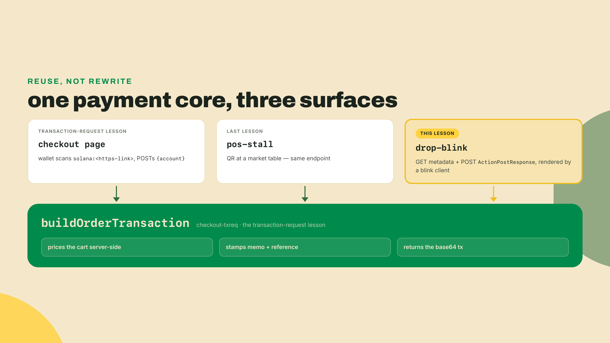
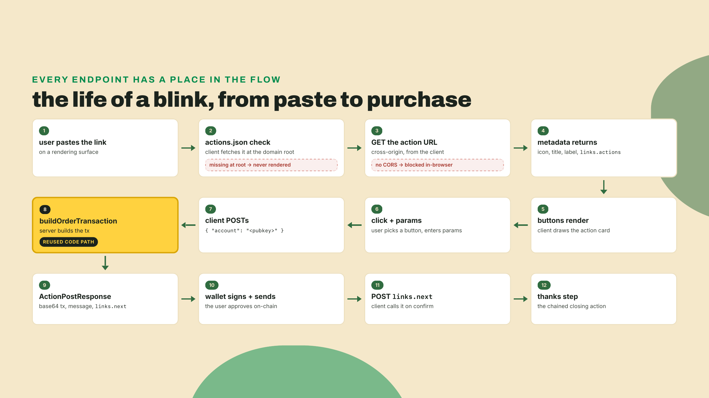
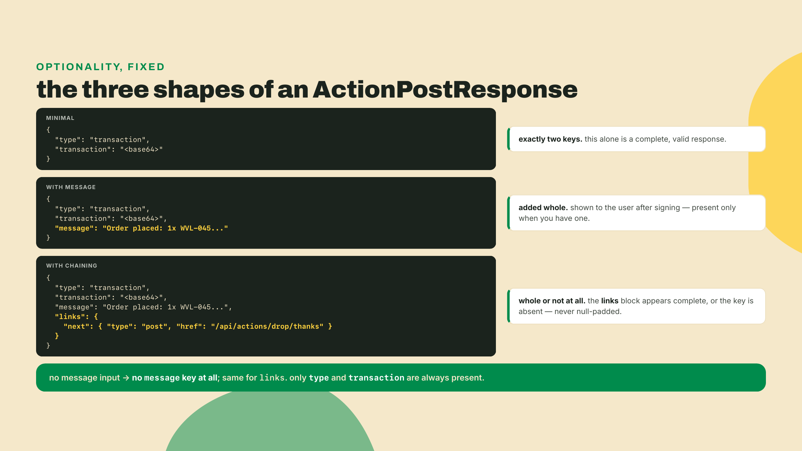
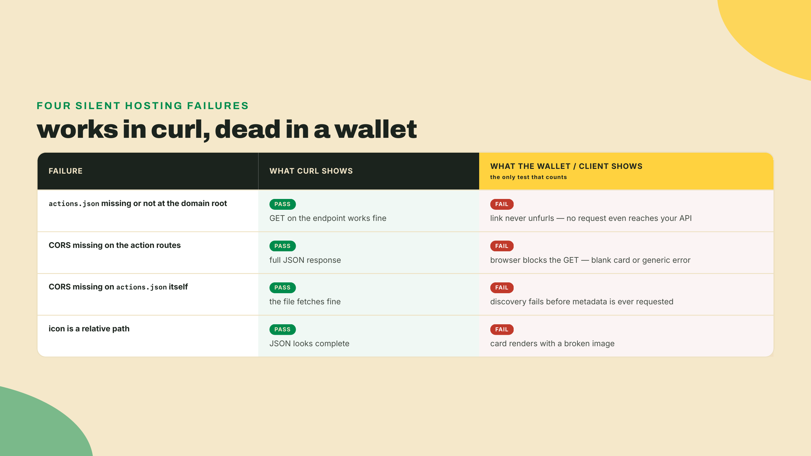
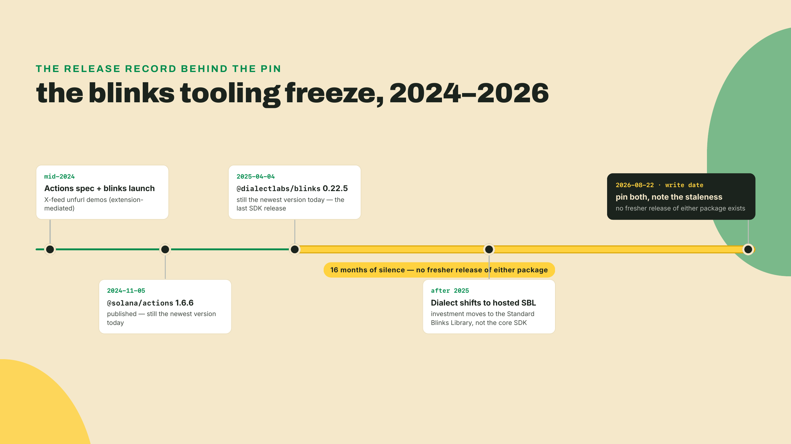
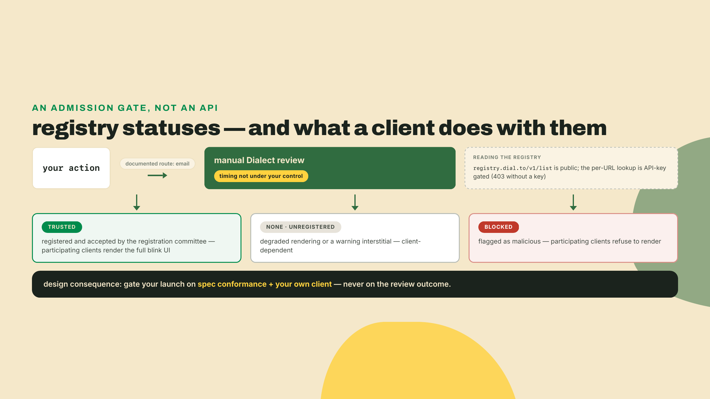
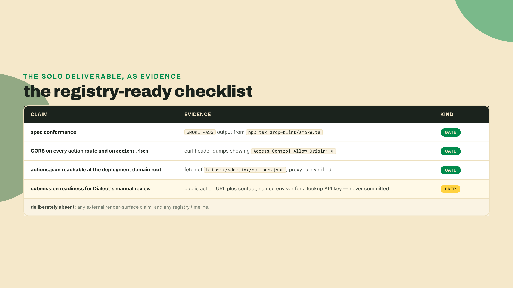

# A blink for the drop: actions that execute anywhere (that renders them)

Last lesson, `pos-stall` took the same transaction-request endpoint across a table with a QR. The endpoint has now sold a record through a page and through a stall. Today it sells through a link you can paste anywhere, and we get honest about what "anywhere" means.

Before we build anything new, prove the core still answers. Start your checkout-txreq server from the transaction-request lesson, with the same `MERCHANT_ADDRESS=$(solana address) npx tsx src/server.ts` line you ran there, and hit its POST directly (it listens on 3100 at `/txreq`; substitute your own port and route if you moved them):

```bash
curl -s -X POST http://localhost:3100/txreq \
  -H 'Content-Type: application/json' \
  -d '{"account":"'$(solana address)'"}'
```

You should get back JSON with a base64 transaction in it. Look at that response for a second. A wallet POSTs `{account}`, your server prices the order and returns a signed-ready transaction. That is the whole trick of this lesson: the Actions spec is that same request-response pair, plus a metadata layer so any surface can render a button around it. You already built the hard part.

## Summary

This lesson turns your payment core into a link. Not a link to a store: a link that IS the store. The findings up front, because some of them are not what the 2024 marketing promised:

- You ship **drop-blink**: an `actions.json` at your domain root, a GET endpoint returning action metadata, and a POST endpoint returning a spec-conformant `ActionPostResponse`. The transaction inside it comes from the exact builder you wrote in the transaction-request lesson. Zero new payment code.
- Three hosting rules decide whether a wallet will ever load your action: `actions.json` sits at the domain root, every action route sends `Access-Control-Allow-Origin: *`, and so does `actions.json` itself. Miss any one and you get the classic "works in curl, dead in a wallet" failure.
- The tooling is frozen: `@dialectlabs/blinks` 0.22.5 (published 2025-04-04) and `@solana/actions` 1.6.6 (published 2024-11-05) are still the newest versions that exist as of 2026-08-22. This course installs neither; you build against the wire contract via `@solana/actions-spec` 2.4.2, and if you ever adopt the SDKs, pin those exact versions with a staleness note.
- Where blinks actually render in 2026 is uncertain. X rendering is Chrome-extension-mediated, not native. So the lab gates on spec conformance plus a local client, and your reach claims belong in a verified-at-write box rather than a pitch deck.



## The action protocol, up close

### From payment link to protocol

If you have shipped with Stripe, you have made a Payment Link: a URL that encodes "sell this thing," which Stripe's servers turn into a hosted checkout page. A Solana Action is that idea with the rendering split off. Your server describes the checkout (metadata) and builds the transaction (the POST you already have). Whatever surface displays the link, a wallet, a feed, a chat client, an interstitial site, is free to render its own buy button from your metadata and execute the purchase in place. A **blink** (blockchain link) is the rendered form: the URL plus whatever client unfurls it into UI.

The protocol is two verbs on one URL, plus a discovery file:

1. **GET** the action URL: returns metadata. Icon, title, description, label, and optionally a list of parameterized sub-actions. This is everything a client needs to draw the button.
2. **POST** `{account}` to the same URL: returns an `ActionPostResponse` carrying a base64-encoded transaction for that specific user to sign. Same contract as your transaction request, and that is not a coincidence: the Actions spec generalizes the Solana Pay transaction-request flow you already implemented.
3. **`actions.json`** at your domain root: tells clients which paths on your domain are actions, so a bare link to your site can be mapped to its action endpoint.



Why does this matter for a record shop? Distribution. Every checkout so far required the customer to come to you: your page, your stall. A blink inverts it. The store travels to wherever the conversation already is. For a 200-copy limited pressing, the difference between "click through to our site" and "buy it right here" is conversion you can feel. That was the 2024 pitch, and the pitch was good. Hold that thought, because the 2026 reality section below is where we price it honestly.

### GET: the metadata that becomes a UI

Here is the shape a GET must return, mirrored from `@solana/actions-spec` 2.4.2 (the types package; it is the spec's source of truth and you can import these instead of writing them):

```ts
// drop-blink/src/types.ts
// Mirrored from @solana/actions-spec 2.4.2, trimmed to the fields this lesson
// exercises; the spec package carries more (optional `type` on the top-level
// action, an `error` field, parameter pattern/min/max, a wider LinkedActionType
// union). Diff against node_modules and you will find those extras on the spec
// side — deliberate omissions, not drift. The package is frozen alongside the
// rest of the tooling; these shapes are the live contract blink clients check.

export interface ActionParameter {
  name: string;      // the template variable this fills, e.g. {qty}
  label?: string;    // placeholder text the client shows
  required?: boolean;
  type?:
    | 'text' | 'number' | 'email' | 'url' | 'date'
    | 'datetime-local' | 'textarea' | 'checkbox' | 'radio' | 'select';
  options?: Array<{ label: string; value: string; selected?: boolean }>;
}

export interface LinkedAction {
  type: 'transaction'; // this action's POST returns a transaction to sign
  href: string;        // relative or absolute; may carry {param} templates
  label: string;       // the button text
  parameters?: ActionParameter[];
}

export interface ActionGetResponse {
  type: 'action';
  icon: string;        // absolute URL, not a path; clients will not resolve relatives
  title: string;
  description: string;
  label: string;       // fallback button text when links.actions is absent
  disabled?: boolean;
  links?: { actions: LinkedAction[] };
}
```

Walk it field by field, because every field is load-bearing UI. `icon` must be an **absolute** URL; a relative path renders as a broken image in every client, and it is the single most common cosmetic bug in shipped actions. `label` is the one-button fallback; `links.actions` replaces it with multiple buttons when present. And `parameters` is how a button grows an input: an `href` of `/api/actions/drop?qty={qty}` plus a parameter named `qty` tells the client to render a number field and substitute the value into the URL before POSTing. The `type` on a parameter is a rendering hint (`select` and `radio` carry `options`); clients that do not recognize a type fall back to text. Input validation stays on your server. Always. The parameter types style a form, they do not protect you from what arrives in the query string.

Then there is `disabled`, the field a commerce blink actually exercises. Metadata is fetched live on every render, which gives a blink a property no static store page has: the link updates itself everywhere it was ever posted. When copy 200 of the pressing sells, your GET starts returning `disabled: true` with a description rewritten to say sold out, and every card already sitting in every old post grays out its button on the next render. Nobody edits a tweet, nobody chases down a stale link. Sold out becomes a state your endpoint reports, not a 404 you hope people notice. For a drop, that one boolean is half the argument for the whole protocol: scarcity marketing works exactly when the artifact that says "gone" is the same artifact that said "buy."

### POST: {account} in, transaction out

The POST side you know. The body is `{account}`, the customer's base58 public key. Transaction-request POST returns a base64-encoded transaction, and the Actions spec wraps that same payload in a named envelope:



Two additions on top of your existing endpoint. `message` is an optional human string the wallet can show after signing, your order confirmation in miniature. `links.next` is **action chaining**: a `{ type: 'post', href }` object telling the client "after this transaction confirms, POST here for the next step." The chained POST includes the confirmed signature, which makes it the natural place for a thank-you card, a claim step, or the next action in a multi-step flow. We will use it for a thanks screen that echoes the receipt.

One more spec feature to know by name: **action identity**. An action provider can attach an SPL Memo instruction in the form `solana-action:<identity>:<reference>:<signature>`, where the identity is a keypair that signs the reference. It exists so indexers and registries can attribute on-chain transactions back to the action that produced them. You do not need it for the lab, and your builder already stamps the order memo and reference key that your own reconciliation uses. File it under "what that weird memo is when you see one in an explorer."

Where does the transaction itself come from? From `buildOrderTransaction`, unchanged. This is the accretion the whole module has been climbing toward, so let me say it plainly: the blink adds a metadata layer and a response envelope. The pricing, the memo, the reference key, the decimals-safe transfer, all of it is the transaction-request lesson's code path, imported. If you find yourself rewriting transaction assembly inside a blink handler, stop; you are forking your payment logic into a second copy that will drift.

### Discovery and CORS: the two rules that kill blinks

Now the part that generates the most support threads. Your endpoints can be perfect and no wallet will ever load them, because blinks are loaded **cross-origin**. The client rendering your blink lives on someone else's domain, so the browser enforces CORS on every request to yours, and discovery happens through a file you may have forgotten to serve.

Rule one: `actions.json` lives at the domain root. `https://shop.example/actions.json`, not `/api/actions.json`, not behind a redirect to a path. It maps URL patterns on your domain to action API paths:

```json
{
  "rules": [{ "pathPattern": "/api/actions/**", "apiPath": "/api/actions/**" }]
}
```

The patterns are globs: `*` matches within one path segment, `**` matches across any depth. And that mapping earns its keep. A rule can pair a human page with the action behind it, say `pathPattern: "/drop/**"` onto `apiPath: "/api/actions/drop/**"`, so a customer who pastes the pressing's ordinary product-page URL still gets a rendered buy button, because the client resolved the page to its action. If action URLs were only ever pasted directly, discovery could live in the URL itself; `actions.json` exists so your normal links become blinks too.

Rule two: every action response sends `Access-Control-Allow-Origin: *`. Including, and this is the one everyone misses, on `actions.json` itself. The discovery fetch is cross-origin too. Curl does not enforce CORS, browsers do, which is exactly why the failure signature is an endpoint that tests clean in your terminal and shows nothing in a wallet.



Preflight matters too: clients send OPTIONS before POST, so your CORS middleware answers OPTIONS with the same headers and an empty 204. The spec also defines two informational response headers, `X-Action-Version` (the spec version you implement) and `X-Blockchain-Ids` (a CAIP-2 chain id; CAIP-2 is the cross-chain naming standard of namespace plus reference, here `solana:` plus the genesis hash truncated to 32 characters, so devnet is `solana:EtWTRABZaYq6iMfeYKouRu166VU2xqa1`). Conforming clients read them to decide compatibility; sending them costs two lines.

### The reality check: where does this actually render?

Time to price the trade-off, because I sold you the dream two sections ago and you deserve the invoice.

Blinks launched in mid-2024 with a demo that stuck in everyone's head: a link unfurling into a buy button in an X feed. I repeated that pitch to a room of merchants back then, with full conviction. The conviction outlived the facts. What actually happened is that X rendering was, and remains, mediated by a Chrome browser extension: a viewer without the extension sees a plain link, not a button. The feed demo was real, the "for every viewer" implication was not.

And the tooling record tells its own story. Here is the release timeline, which you can verify on npm in thirty seconds:



`@solana/actions` has not shipped since 2024-11-05. `@dialectlabs/blinks` has not shipped since 2025-04-04. Sixteen months of silence from the client SDK is not a maintenance gap you route around, it is a signal about where the vendor's attention went: Dialect pivoted to a hosted Standard Blinks Library, a managed service, rather than the open SDK. So this course builds against the wire contract instead of the frozen SDKs; if a project of yours does adopt them, pin the two frozen versions the summary names exactly, write the staleness note in your package.json comment or README, and treat "wait for the next release" as not a plan.

The hosted Standard Blinks Library can look like the way out of the frozen-SDK problem: let Dialect run the blink for you. Two reasons to build your own endpoint anyway. First, your drop is your inventory, your pricing, your memo-and-reference reconciliation; a hosted service is the wrong home for the payment logic your whole back office keys on, and this course has been building that logic into one owned code path for three lessons. Second, and this is the durable reason: the artifact of this lesson is spec conformance, and no host can own that for you. The Actions spec is a wire contract, GET metadata in, `{account}` POST out; a frozen SDK does not change the contract your endpoints speak, and any renderer built next year against the same spec executes your store without you shipping a line. You are building against the protocol, not against Dialect's roadmap. That is the correct dependency to take on a vendor whose SDK has been silent for sixteen months.

Then there is the registry. Dialect operates a blinks registry where actions carry a status, and the docs define all three in one breath: **trusted** is "registered by the developer and accepted by the registration committee" and renders fully in participating clients, **none** means "the action has not been registered" and typically renders with warnings or degraded UI, and **blocked** has been "flagged as malicious by the registration community" and does not render. Getting registered is not an API call you make: Dialect's documented route is a submission by email, and the docs say plainly that "currently registration review is a manual process." Reading the registry programmatically is a different story, and partly key-gated: the public list at `registry.dial.to/v1/list` answers anyone, while the per-URL lookup endpoint returns 403 without a Dialect API key (both probed 2026-08-22). You will also read claims about when registry enforcement began or begins; that date is unsourced, so this course does not cite one, and neither should you. Which yields a hard operational fact: you cannot gate a launch, or this lesson, on a third party's manual queue.



So what surfaces can you actually count on? Here is the honest box.

> **Verified at write, 2026-08-22.** X rendering is Chrome-extension-mediated, not native. The core SDKs are frozen at `@dialectlabs/blinks` 0.22.5 and `@solana/actions` 1.6.6. Dialect's registry review is a manual process reached by email, and its per-URL lookup API is key-gated. Beyond that, the 2026 list of wallets and surfaces that render blinks natively is **unverified**: the ecosystem pages naming specific wallets date from the 2024 launch wave, and we could not confirm the current behavior of any specific wallet at write time. Treat every "renders in X wallet" claim you read, including old versions of claims like these, as stale until you test it in that wallet, that week.

The trade-off, stated once and carried into everything you build today: a blink turns any surface into a checkout, but it only executes where something renders it. Tooling froze in 2025, X needs an extension, registry admission is a manual review you cannot schedule. "Renders everywhere" is false. What is true, and still genuinely valuable, is narrower: a blink is a spec-conformant, self-describing checkout endpoint. Any current or future surface that speaks the spec can execute your store. You are buying an option on distribution, cheap, because the marginal cost over the endpoint you already own is an afternoon. That is a fine deal as long as you price it as an option and not as a promised feed. And there is a second reason the pattern has legs: the canonical Solana Pay repository itself now leads with an agentic payments CLI whose README calls x402 and MPP "both live payment standards on Solana" (both are standards for paying over plain HTTP, built for machine buyers; module 7 teaches them properly), while the classic checkout library lives on in a subdirectory (repo README and redirects, re-checked 2026-08-22). The ecosystem's bet is that things which execute payments from wherever they are posted, for humans or for agents, are the direction of travel. Blinks are the human-facing end of that same shift, and your machine-facing end arrives in module 7.

## Lab: ship the drop blink

The split for today: I walk the scaffold, the endpoints, and the hosting rules with you (worked). You assemble the `ActionPostResponse` builder yourself against three stated rules, with the coding challenge as your checker (completion). Then the local-client purchase and the registry-ready checklist are yours alone (solo). By the end, `npx tsx drop-blink/smoke.ts` passes and a local blinks client completes a devnet purchase of the featured pressing.

**1. Scaffold the workspace.** The drop blink lives beside your checkout-txreq project so it can import the builder. Same kit line as the checkout-txreq workspace (`@solana/kit` 6.10.0, the last v6 release; this workspace stays on v6 because the builder it imports does):

```bash
mkdir -p drop-blink/src drop-blink/public
cd drop-blink
npm init -y
npm pkg set type=module
npm install express@5.2.1 @solana/kit@6.10.0 @solana/actions-spec@2.4.2
npm install -D tsx@4 typescript @types/express @types/node
```

Pins, with their freshness notes: `express` 5.2.1 is npm `latest` on the 5.x line at write (re-checked 2026-08-22; any 5.x works). `@solana/actions-spec` 2.4.2 is the newest and, like the rest of the blink tooling, frozen; we install it so you can diff the hand-mirrored types against the source of truth. `tsx` is the TypeScript runner you have used all course; if this is a fresh machine, the dev-install line above is its install.

Checkpoint: `npm ls @solana/actions-spec express` prints 2.4.2 and a 5.x express, with no unmet-peer warnings. A peer complaint about `@solana/kit` here means you drifted off the v6 line the builder you are about to import lives on.

**2. Create the types.** Save the `ActionParameter` / `LinkedAction` / `ActionGetResponse` file from the theory section as `drop-blink/src/types.ts`, and append the POST-side shapes:

```ts
// drop-blink/src/types.ts (continued)

export interface ActionPostRequest {
  account: string; // base58 public key of the user who will sign
}

export interface NextActionLink {
  type: 'post';
  href: string; // the client POSTs here after the transaction confirms
}

export interface ActionPostResponse {
  type: 'transaction';
  transaction: string; // base64-encoded transaction
  message?: string;    // optional post-sign confirmation text
  links?: { next: NextActionLink };
}

export interface ActionsJson {
  rules: Array<{ pathPattern: string; apiPath: string }>;
}
```

**3. The response builder, your completion rung.** This is the function the POST handler will call, and the one thing in this lab you write without me. The contract is exactly the coding challenge's, so you can check your work there before wiring it in:

```ts
// drop-blink/src/action-post-response.ts
import type { ActionPostResponse } from './types';

export function buildActionPostResponse(
  transactionBase64: string,
  message?: string | null,
  nextActionHref?: string | null,
): ActionPostResponse {
  // Rule 1: always set type: 'transaction' and transaction from transactionBase64.
  // Rule 2: add message ONLY when message is provided (not null, not undefined);
  //         the minimal response has no message key at all, not a message key
  //         set to undefined.
  // Rule 3: add links.next as { type: 'post', href } ONLY when nextActionHref
  //         is provided; otherwise the response has no links key.
  throw new Error('Your turn: assemble the response per the three rules above.');
}
```

The arguments are positional, and the two optional ones can arrive as `null` or be omitted, so treat `null` and `undefined` alike as "absent". That is exactly how the challenge checker calls it: `buildActionPostResponse('B64', null, 'https://.../thanks')` is a response with a chained action and no message.

Why so strict about absent-versus-undefined? Because clients validate the response shape, and a `links` key holding garbage fails validation where no `links` key passes. Build the object conditionally; do not build it maximal and delete.

Checkpoint: as shipped, this file throws `Your turn: assemble the response per the three rules above.` on every call. That throw is the completion rung waiting for you, and step 8's smoke run is where it surfaces.

**4. CORS and the server skeleton.** One middleware, applied before every route, answering preflight:

```ts
// drop-blink/src/server.ts
import express from 'express';
import type { Request, Response, NextFunction } from 'express';
import { buildOrderTransaction } from '../../checkout-txreq/src/build-order-transaction';
import { buildActionPostResponse } from './action-post-response';
import type { ActionGetResponse, ActionPostRequest, ActionsJson } from './types';

const app = express();
app.use(express.json());

const ACTION_HEADERS: Record<string, string> = {
  'Access-Control-Allow-Origin': '*',
  'Access-Control-Allow-Methods': 'GET,POST,PUT,OPTIONS',
  'Access-Control-Allow-Headers':
    'Content-Type, Authorization, Content-Encoding, Accept-Encoding',
  'Access-Control-Expose-Headers': 'X-Action-Version, X-Blockchain-Ids',
  'X-Action-Version': '2.4.2',
  'X-Blockchain-Ids': 'solana:EtWTRABZaYq6iMfeYKouRu166VU2xqa1', // devnet CAIP-2
};

app.use((req: Request, res: Response, next: NextFunction) => {
  res.set(ACTION_HEADERS);
  if (req.method === 'OPTIONS') {
    res.status(204).end();
    return;
  }
  next();
});

// Static AFTER the CORS middleware, never before it: the icon is fetched
// cross-origin too, and a static route that matches first would ship it
// without the headers. This ordering is the works-in-curl table's row one.
app.use(express.static('public'));
```

The import path for `buildOrderTransaction` assumes the module layout from the transaction-request lesson sitting one directory over. If you left the transaction assembly inline in that lesson's POST handler instead of extracting it into a function, take five minutes now and extract it. The blink is precisely why: one builder, many surfaces. Its contract here is the one your capstone will also rely on: it takes the buyer's account plus what they are buying, prices it server-side, stamps the memo and reference, and resolves to the base64 transaction.

**5. Discovery and the icon.** The root file and a static image (drop any square PNG into `public/drop-icon.png`; any placeholder art will do):

```ts
// drop-blink/src/server.ts (continued)

const BASE_URL = process.env.BASE_URL ?? 'http://localhost:3000';
const DROP_SKU = 'WVL-045';
const DROP_PRICE_USDC = 30;

app.get('/actions.json', (_req: Request, res: Response) => {
  const payload: ActionsJson = {
    rules: [{ pathPattern: '/api/actions/**', apiPath: '/api/actions/**' }],
  };
  res.json(payload);
});
```

Served by Express at the app root, which must BE your domain root in deployment. If your site runs behind a path prefix or a proxy, the file still has to answer at `https://yourdomain/actions.json`; that is a reverse-proxy rule, not an application route, and it is the deployment detail most often lost between "worked locally" and production.

**6. The GET: metadata for the featured pressing.**

```ts
// drop-blink/src/server.ts (continued)

app.get('/api/actions/drop', (_req: Request, res: Response) => {
  const payload: ActionGetResponse = {
    type: 'action',
    icon: `${BASE_URL}/drop-icon.png`,
    title: 'Wavelength Records: the August pressing',
    description: `Limited pressing ${DROP_SKU}. ${DROP_PRICE_USDC} USDC on devnet, 200 copies, gone when they are gone.`,
    label: `Buy for ${DROP_PRICE_USDC} USDC`,
    links: {
      actions: [
        {
          type: 'transaction',
          label: `Buy 1 for ${DROP_PRICE_USDC} USDC`,
          href: '/api/actions/drop',
        },
        {
          type: 'transaction',
          label: 'Buy more than one',
          href: '/api/actions/drop?qty={qty}',
          parameters: [
            { name: 'qty', label: 'How many copies (max 5)', required: true, type: 'number' },
          ],
        },
      ],
    },
  };
  res.json(payload);
});
```

Two buttons from one endpoint: a fixed one-click buy, and a parameterized quantity buy whose `{qty}` template the client substitutes into the query string. Absolute icon URL. Note what is NOT here: no price math, no inventory logic. Metadata describes; the POST decides.

**7. The POST and the chained thanks step.** The handler validates input, clamps the quantity server-side (remember: parameter types style a form, they do not validate), reuses the builder, and assembles the response through your completion-rung function:

```ts
// drop-blink/src/server.ts (continued)

app.post('/api/actions/drop', async (req: Request, res: Response) => {
  const body = req.body as ActionPostRequest;
  if (!body?.account || typeof body.account !== 'string') {
    res.status(400).json({ message: 'Body must be { "account": "<base58 pubkey>" }' });
    return;
  }
  const qty = Math.min(Math.max(Number(req.query.qty ?? 1) || 1, 1), 5);

  try {
    const { transactionBase64 } = await buildOrderTransaction({
      account: body.account,
      sku: DROP_SKU,
      quantity: qty,
    });
    res.json(
      buildActionPostResponse(
        transactionBase64,
        `Order placed: ${qty}x ${DROP_SKU}. Sign to complete the purchase.`,
        '/api/actions/drop/thanks',
      ),
    );
  } catch (err) {
    res.status(400).json({
      message: err instanceof Error ? err.message : 'Could not build the order transaction',
    });
  }
});

app.post('/api/actions/drop/thanks', (req: Request, res: Response) => {
  const signature =
    typeof req.body?.signature === 'string' ? req.body.signature : undefined;
  res.json({
    type: 'completed',
    icon: `${BASE_URL}/drop-icon.png`,
    title: 'You got the pressing',
    description: signature
      ? `Payment landed. Signature ${signature.slice(0, 8)}... is your receipt.`
      : 'Payment landed. Your order is in.',
    label: 'Done',
  });
});

app.listen(3000, () => {
  console.log('drop-blink listening on :3000');
});
```

The error path returns `{ message }` with a non-200 status, which is the spec's `ActionError` shape; clients display that message, so write it for the customer rather than for your logs. The thanks handler is the `links.next` target: after the wallet confirms the transaction, the client POSTs here with the signature, and a `type: 'completed'` payload closes the flow with a receipt card. Chaining goes deeper than we take it (a next step can be a whole further action with its own transaction), but one hop is enough to own the pattern.

Checkpoint: `MERCHANT_ADDRESS=$(solana address) npx tsx src/server.ts` prints `drop-blink listening on :3000`. The env var is not optional: the builder you imported still reads `MERCHANT_ADDRESS` from the environment, exactly as it did in its home workspace, and without it every POST 400s with the builder's own set-MERCHANT_ADDRESS message before your placeholder throw is ever reached. In a second terminal, `curl -s http://localhost:3000/actions.json` returns your one-rule object and `curl -s http://localhost:3000/api/actions/drop` returns the metadata with both button labels in it. The POST is expected to fail for now, on the placeholder throw from step 3.

**8. Smoke it.** The verify harness for this artifact, and your checkpoint:

```ts
// drop-blink/smoke.ts
import { generateKeyPairSigner } from '@solana/kit';

const BASE = process.env.BLINK_URL ?? 'http://localhost:3000';

function fail(msg: string): never {
  console.error(`SMOKE FAIL: ${msg}`);
  process.exit(1);
}

async function main() {
  const testAccount =
    process.env.TEST_ACCOUNT ?? (await generateKeyPairSigner()).address;

  const aj = await fetch(`${BASE}/actions.json`);
  if (aj.headers.get('access-control-allow-origin') !== '*') {
    fail('actions.json is missing Access-Control-Allow-Origin: *');
  }
  const discovery = (await aj.json()) as { rules?: unknown[] };
  if (!Array.isArray(discovery.rules) || discovery.rules.length === 0) {
    fail('actions.json has no rules');
  }

  const get = await fetch(`${BASE}/api/actions/drop`);
  if (get.headers.get('access-control-allow-origin') !== '*') {
    fail('GET metadata is missing CORS');
  }
  const meta = (await get.json()) as Record<string, unknown>;
  for (const field of ['icon', 'title', 'description', 'label']) {
    if (typeof meta[field] !== 'string') fail(`GET metadata is missing ${field}`);
  }
  if (!String(meta.icon).startsWith('http')) fail('icon must be an absolute URL');

  const post = await fetch(`${BASE}/api/actions/drop`, {
    method: 'POST',
    headers: { 'Content-Type': 'application/json' },
    body: JSON.stringify({ account: testAccount }),
  });
  if (post.status !== 200) fail(`POST returned ${post.status}`);
  const body = (await post.json()) as Record<string, unknown>;
  if (body.type !== 'transaction') fail("POST response type must be 'transaction'");
  if (typeof body.transaction !== 'string' || body.transaction.length === 0) {
    fail('POST response has no base64 transaction');
  }

  console.log('SMOKE PASS: actions.json + GET metadata + POST response all conformant');
}

main().catch((err) => fail(err instanceof Error ? err.message : String(err)));
```

Run the server in one terminal:

```bash
MERCHANT_ADDRESS=$(solana address) npx tsx src/server.ts
```

Wait for its listening line, then run the smoke check in a second terminal:

```bash
npx tsx smoke.ts
```

Two terminals rather than one backgrounded command, on purpose: `smoke.ts` opens with a `fetch` that does not retry, and `tsx` takes a second or two to compile and bind. Chained behind an `&` the fetch usually loses that race and hands you an `ECONNREFUSED` that has nothing to do with your code.

You should see `SMOKE PASS`. If instead it fails on the POST, your `buildActionPostResponse` still throws its placeholder, which is the lab telling you the completion rung is genuinely yours. Finish it, or work it through the coding challenge first and paste your passing implementation back in.

## Challenge

**The coding challenge** (in the challenge widget for this lesson) is `buildActionPostResponse` in isolation, called positionally as `buildActionPostResponse(transactionBase64, message?, nextActionHref?)`: the base64 transaction alone yields exactly `type` plus `transaction` and nothing else, `message` appears only when a non-null second argument is provided, `links.next` appears only as `{ type: 'post', href }` when a non-null `nextActionHref` third argument is provided. Pass it, then bring the code home to step 3.

**The solo rung, in two parts.** No walkthrough this time; you have everything you need.

First, complete a real purchase by being the rendering client yourself, because that is all a blink client is: GET, render, POST, sign, submit, follow `links.next`. Write `drop-blink/client.ts` in the workspace. It fetches the GET metadata and prints the title and both button labels (that is your render step), POSTs `{account}` with your funded devnet wallet's address, decodes the returned base64 transaction, signs it and sends it exactly the way the transaction-request solo had you do (load the key with `createKeyPairSignerFromBytes`, sign with `signTransaction`, submit the base64 through `rpc.sendTransaction`), then POSTs the confirmed signature to the `links.next` href and prints the completed card's title. Success is concrete: a devnet transaction settles carrying your order memo and reference key, and your terminal ends on the thanks card's title. One honesty note while you build it: a Node client does not enforce CORS, which is exactly why the smoke test checks the headers explicitly; the four-row works-in-curl table is what a browser-based client would hit, and your header dumps below are the proof you would survive one.

Second, produce a **registry-ready checklist** for the drop blink: a short markdown file in the repo asserting, with evidence, (1) spec conformance, your smoke output; (2) CORS on every action route and on `actions.json`, header dumps; (3) `actions.json` reachable at the domain root of your deployment target; (4) submission readiness, the public action URL and contact you would send to Dialect's manual review, plus which env var would hold a Dialect API key if you ever consume the key-gated lookup endpoint. Note what the checklist deliberately does not claim: any external surface rendering, or any registry timeline. That restraint is the point. The checklist is the artifact a future you, or a client, can hand to Dialect's review without a single promise you cannot keep.

The header evidence takes one command per endpoint; `-D -` dumps response headers to stdout and `-o /dev/null` discards the body:

```bash
curl -s -D - -o /dev/null http://localhost:3000/actions.json | grep -i access-control
curl -s -D - -o /dev/null http://localhost:3000/api/actions/drop | grep -i access-control
```

Paste both outputs into the checklist verbatim. Evidence you can regenerate in ten seconds beats prose assurances every time, and when you redeploy behind a different proxy in the capstone, rerunning two curl lines re-proves the claim.



Accept: GET validates, POST returns a spec-conformant response reusing the transaction-request builder, your client script completes a devnet purchase, and the checklist exists with all four evidence points.

## Checkpoint, and where the module lands

If the smoke test fought you, the failure is almost certainly one of four: CORS headers applied after a route matched (move the middleware above every route, static included), `actions.json` mounted under `/api` instead of the root, the builder import path not matching your checkout-txreq layout, or `MERCHANT_ADDRESS` missing from the server's environment (the imported builder requires it and 400s without it). Ten minutes, in my experience, mostly the third one. And if something subtler broke, diff your types file against `@solana/actions-spec` in `node_modules`; the spec package is frozen, so any field we mirror that disagrees with the source is on our side by definition (fields that exist only on the spec side are the deliberate trims the types file's header names). When you get the pass, take the win seriously: you shipped a protocol-conformant storefront-in-a-link, with reach claims you can defend line by line, and that combination is rarer in the wild than the endpoint itself.

Three surfaces, one payment core: the QR checkout, the fair stall, and now a blink that executes wherever something renders it. Wavelength can sell a record through a page, across a table, and inside a link. Which means the front of the store is done, and the honest question moves inward: money is arriving from three surfaces and you are still trusting frontends to tell you about it. Next module leaves the storefront for the back office, where you trust no frontend and verify every payment server-side.
