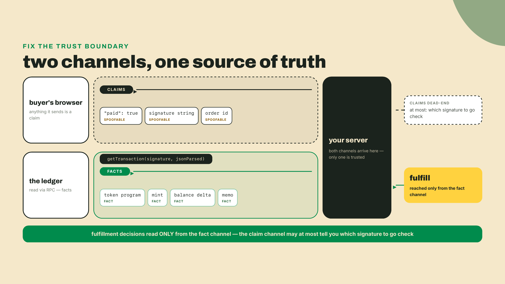
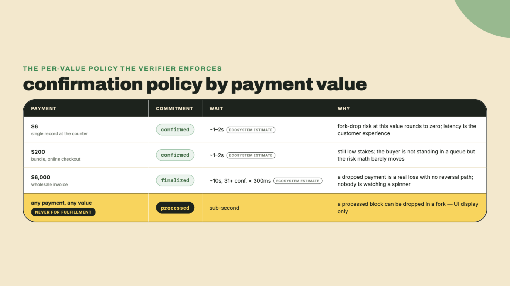
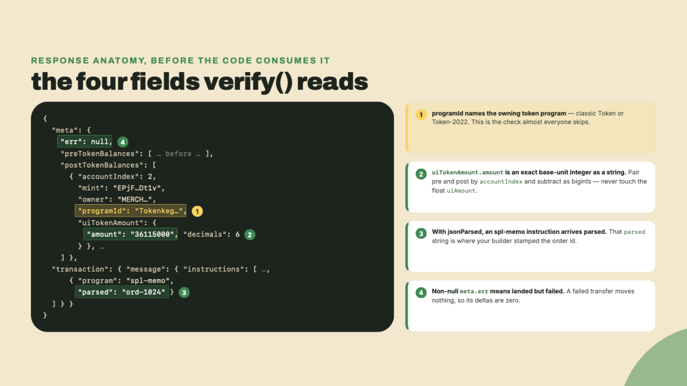
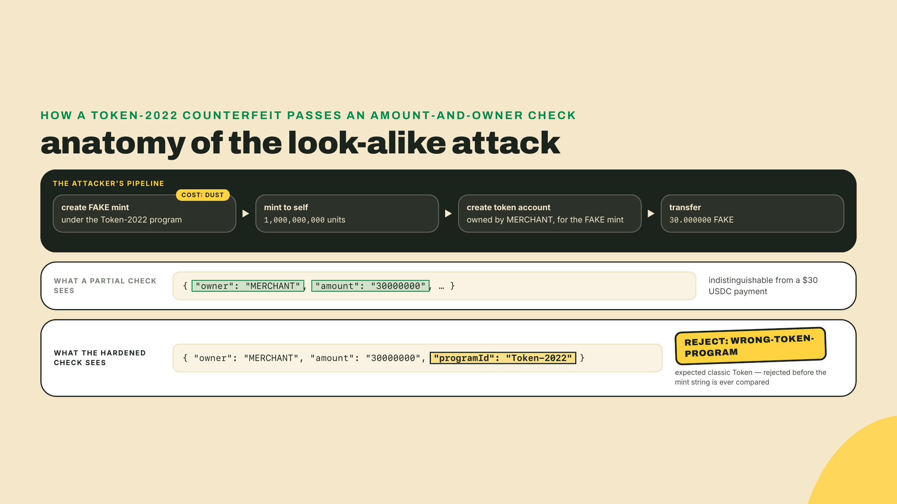
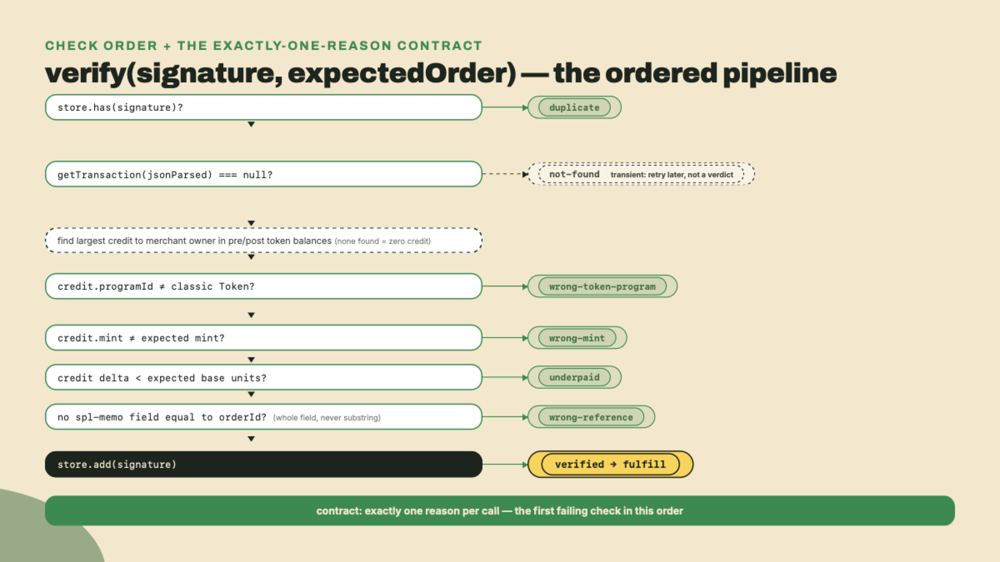
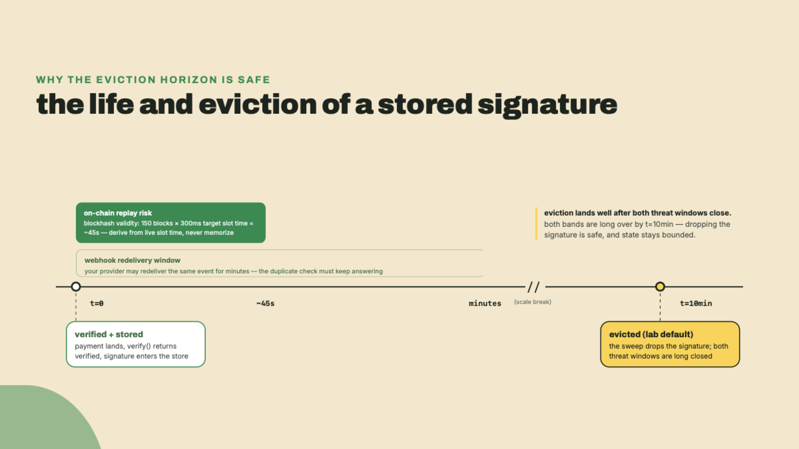
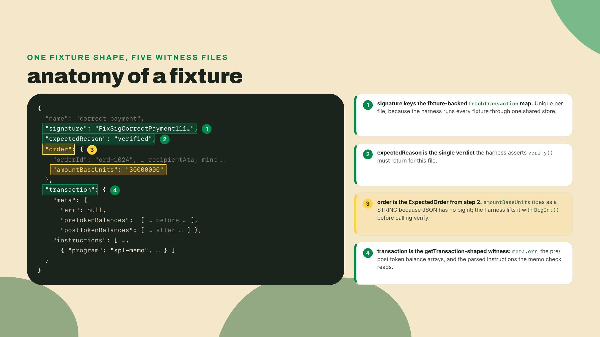
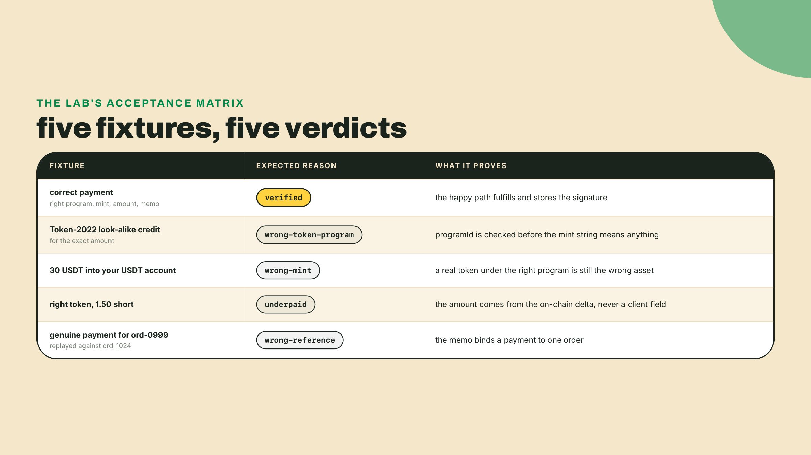
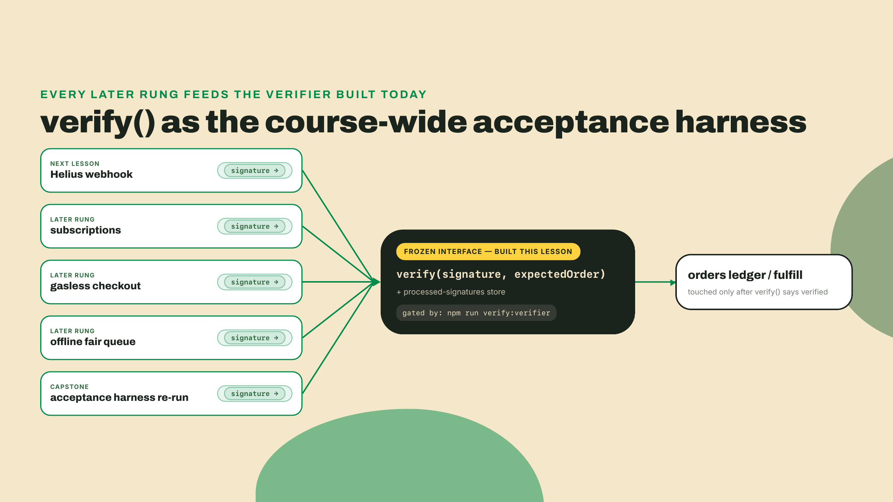

# Trust no frontend: confirmation policy and server-side verification

## Summary

Module 3 left you three checkout surfaces on one payment core. Only the QR-driven paths — the checkout's reference watcher and the POS's findReference poll — ever ask the chain before calling a sale real, and they only vouch for payments they were already watching. The rest ship on a frontend's say-so. This is the lesson where that stops, for all three at once.

What you take away today:

- You ship **verifier**: a server-side `verify(signature, expectedOrder)` that fetches the transaction itself, checks token program, mint, balance delta on your own account, and order memo, then keeps a processed-signatures set so a redelivered webhook can never fulfill twice. It is the course's acceptance harness; every later rung runs against it.
- Confirmation commitment becomes a policy decision, not a config default: `confirmed` for the $6 record, `finalized` for the $6,000 wholesale invoice, `processed` for nothing that touches fulfillment.
- The only witness you call is `getTransaction` with `jsonParsed` encoding: the frontend gives you claims, the ledger gives you facts.
- The naive check ("a signature exists, therefore it's paid") fulfills a wrong-token payment. You watch it do that, then take its job away check by check.

The scenario this lesson exists for: a buyer's browser flips to a green check and POSTs `paid: true` to your server, so you ship the record. The transaction behind that green check moved 1.5 USDT, not USDC, into an account that is not yours. There was never a payment for your order, and no chargeback rail exists to claw anything back. The frontend lied. Who is your source of truth?

Before we answer in code, look at the raw truth once yourself. Grab a settled devnet signature from your checkout watcher's logs and ask the ledger directly:

```bash
curl -s https://api.devnet.solana.com -X POST -H "Content-Type: application/json" -d '{
  "jsonrpc": "2.0", "id": 1, "method": "getTransaction",
  "params": ["<YOUR_SIGNATURE>", {"encoding": "jsonParsed", "commitment": "confirmed", "maxSupportedTransactionVersion": 0}]
}' | head -c 2000
```

Scroll that JSON for a second. Somewhere in it are `preTokenBalances` and `postTokenBalances` arrays, and inside those, a `mint`, an `owner`, a `programId`, and an exact base-unit `amount`. That response is the entire raw material of this lesson. Everything we build is a disciplined way of reading it.

## The verifier, check by check

### The green check is a claim

Let's be precise about what you already verify, because module 3 was not naive. The QR checkout's watcher ran `validateTransfer` against the chain: amount, recipient, mint, for a transfer request it was already watching. That was real server-side verification, scoped to one flow. What it never checked: the token program behind the mint. What it never had: an opinion about transactions it was not already watching, which is exactly what a webhook will hand you next lesson. And the transaction-request and blink flows have nothing like it at all; their smoke tests prove your endpoints answer, not that money arrived. Today's verifier supersedes all of those smoke checks. One function, every surface, called with nothing but a signature and the order you think it pays for.

The design rule is worth saying as a rule, because it is the whole module: **the frontend is a UI for the buyer, never a witness for you.** A `paid: true` flag, a success redirect, a signature pasted into a form, all of it is client-controlled input. The one thing a client cannot forge is what the ledger says a confirmed transaction did. So the server asks the ledger, every time, and fulfills on nothing else.



I will confess where this lesson comes from. Years ago, on a web2 project, I wired fulfillment to a payment provider's success redirect because the docs example did. A tester with devtools open replayed that redirect and got a free order in under an hour, and the fix was the provider's server-side verification API, which I should have read first. Stripe people know this as the rule that you fulfill from the webhook plus a retrieved PaymentIntent, never from the client's return URL. Same rule here, sharper teeth: on card rails my mistake was recoverable with a support ticket. Here, the thing you ship against a fake payment is just gone.

### Commitment is a price, not a setting

You met `processed`, `confirmed`, and `finalized` in module 1, mapped against your card vocabulary. The qualitative guidance from the official docs has not changed shape: `confirmed` for most payments, `finalized` for high-value or compliance-sensitive ones, `processed` as UI-only because a processed block can still be dropped in a fork. What changes today is who consumes that table. In module 1 it was a mental model. In this lesson it is a parameter your verifier takes, and picking it per payment is your job.

The numbers first, with their provenance stated carefully because this is a place people misquote. The docs give you the qualitative table and stop. The latency figures are ecosystem estimates, watched from the network, not printed in any official doc: `confirmed` lands in roughly 1 to 2 seconds; `finalized` means roughly 31 or more confirmed blocks built on top, which works out to roughly 10 seconds of wall-clock (31 blocks at the 300ms target is about 9.3s; measured slot times run a little over target, and the tail blocks are "or more", hence the round 10; re-derive this whenever slot time changes, because SIMD-0525's staged cuts keep changing it). Quote them that way. A lesson, a runbook, or a compliance memo that attributes those numbers to the docs is citing something the docs never said.

So which do you buy? Price it like insurance, because that is literally what it is. The premium is latency at your checkout; the payout is protection against a confirmed block being dropped in a fork, which is rare, and the more value a payment carries, the more that rare event matters. Gating a $6 single-record sale on `finalized` is theater: you charge every customer 10 seconds of staring at a spinner to insure against a risk that, at $6, rounds to zero. Gating a $6,000 wholesale invoice on `confirmed` is the opposite mistake: a real, if rare, fork-drop now costs you four figures with no reversal path, and you saved eight seconds on a payment nobody was waiting at a counter for. Commitment scales with what a dropped payment costs you. Write that policy down as numbers, per product tier, and let the verifier enforce it.



So what does the buyer stare at while your server waits? This is where `processed` earns its keep, because it is a UI level and nothing more. Show "payment seen" the moment the transaction appears at `processed`, sub-second, and flip to "paid" only when your verifier's commitment clears. The buyer gets instant feedback, fulfillment gets its guarantee, and neither borrows the other's job. And when you fulfill wrong despite everything, remember what module 1 established: there is no dispute process to route the mistake through. A refund on these rails is a brand-new push from you to the buyer, original construction, and building it properly is its own lesson later in this module. The verifier's job is to make refunds a customer-service story instead of a survival mechanism.

Why does this decision carry more weight here than it ever did on cards? Because of the asymmetry this course keeps circling. When Shopify announced Solana Pay support (2023-08-23), the pitch was that it "eliminates bank fees, chargebacks, and holding times." Every word of that is a merchant win, and the chargeback line is the interesting one, because a chargeback was never just fraud against you. It was the rail's built-in undo button, priced into every card fee like an insurance premium. On these rails the premium disappears and so does the policy: no acquirer, no dispute process, no institutional reversal path. The stakes are not small. Stablecoins moved about $27.6 trillion in transfer volume in 2024, surpassing Visa and Mastercard combined, the dated figure from Helius's stablecoin guide you first met in module 1. Money at that scale is moving onto rails where fulfillment mistakes are final. The verifier you build today is not a nice-to-have hardening pass. It is the entire backstop, and the honest reading of the Shopify pitch is that you are being paid the old insurance premium in exchange for building your own insurance. Good trade, if you actually build it.

One roadmap flag, labeled as such, before we leave latency behind. The consensus rewrite named Alpenglow (SIMD-0326) was approved by governance with roughly 99% of participating stake, is merged behind a feature gate that is not active on mainnet, and is targeted for late 2026 via Agave 4.3 (status checked as of this writing, 2026-08-22). If you go reading, note that the SIMD document's status header still says "Review"; headers lag reality, and the vote passed. When it activates, the finality math under this whole policy table compresses and you get to loosen the latency side of the trade. Why finality works at all, votes, lockouts, and what Alpenglow changes underneath, is the Low-Level Solana course's territory. For this course it stays what it is here: one labeled flag on a policy that you re-derive when the network changes under you.

### getTransaction, the only witness worth calling

Now the tool. `getTransaction` takes a signature and returns what that transaction actually did, and with `encoding: "jsonParsed"` it does the byte-decoding for you: token balance changes arrive as structured entries and well-known programs' instructions arrive pre-parsed. Two properties make it the right witness. First, it only answers at `confirmed` or `finalized`; you literally cannot ask it about a `processed` transaction, which means your commitment policy plugs straight into the fetch and the too-weak level is unrepresentable. Second, everything in the response was computed by the validator that executed the transaction, not by anything the buyer's device touched.

Why not the lighter `getSignatureStatuses`, which is effectively what your module 3 watcher leaned on for progress? Because a status answers "did it land, and at what commitment," and nothing else. It cannot tell you what moved, in which token, under which program, into whose account. Statuses are for progress bars. Fulfillment needs the transaction's contents, and `getTransaction` is the call that returns them.

The response is a big object. Your verifier reads exactly three parts of it:



Three habits to fix while the anatomy is in front of you. Pair `preTokenBalances` to `postTokenBalances` by `accountIndex`, and treat a missing pre-entry as zero: a token account created inside this very transaction (a first-time buyer's ATA, or an attacker's fresh account) has a post-balance and no pre-balance. Do the subtraction in `bigint` on the `amount` strings; the decimals lesson already taught you why floats and money never meet, and `uiAmount` is a float. And read the `owner` field, not just the account address: the balance entries tell you who owns each touched token account, which is how the verifier finds credits to you without maintaining a list of every token account you have ever owned.

### From naive check to verifier, one attack at a time

Here is the check that ships in more codebases than anyone admits, and it is where the worked example starts:

```ts
// The naive check. Every line of this lesson exists because this is not enough.
async function naiveVerify(signature: string): Promise<boolean> {
  const tx = await fetchTransaction(signature);
  return tx !== null && tx.meta?.err == null;
}
```

A signature exists, the transaction succeeded, ship the record. Feed it the hook scenario: 1.5 USDT moved between two accounts, neither of them yours, memo blank. `naiveVerify` returns `true`. It answers "did some transaction happen?" when the question is "did this order get paid?" Those questions only sound similar. We close the gap one attack at a time, and the order of the checks is part of the design: each check assumes the ones before it already passed, and each failure returns the first reason in the chain, exactly one, so your ops log reads like a diagnosis instead of a shrug.

**Attack 1: the same payment, twice.** Not malice, infrastructure. Next lesson's webhook will redeliver events, because at-least-once delivery is how every webhook system survives your server being briefly down. A signature is deterministic for its transaction, so the redelivered event carries the same signature, and a verifier without memory fulfills the same order twice. The fix is the processed-signatures set: first check on entry, last write on success. Check `store.has(signature)` before doing anything else and return `duplicate`; call `store.add(signature)` only after every other check passes, so a rejected transaction can be retried but a fulfilled one is burned. That ordering makes fulfillment exactly-once from the same set that makes it safe.

**Attack 2: the right amount in the wrong program.** This one is the keystone, and the one `validateTransfer` never covered. There are two token programs on Solana: classic Token at `TokenkegQfeZyiNwAJbNbGKPFXCWuBvf9Ss623VQ5DA` and Token-2022 at `TokenzQdBNbLqP5VEhdkAS6EPFLC1PHnBqCXEpPxuEb`. Anyone can create a Token-2022 mint, name it whatever they like, mint themselves a billion units, and transfer 30.000000 of them into a token account owned by you. On chain that is a perfectly valid transaction whose `postTokenBalances` shows your address credited with the exact amount you charge. A verifier that checks amount and owner but not `programId` waves it through, and your $30 record just sold for confetti. The check is one line, `credit.programId` must equal the classic Token program id, and the reason it must come before the mint check is subtle enough to say out loud: mint addresses only mean what their program says they mean. Comparing mint strings before you have established which program defines them is checking the label on a bottle someone else printed.



**Attack 3: a real token that is not your token.** Same shape, less effort: pay you 30 USDT when the price was 30 USDC. Both live under the classic Token program, so attack 2's check passes. Now the mint check earns its place: the credit's `mint` must equal the mint you price in. On mainnet, USDC means exactly `EPjFWdd5AufqSSqeM2qN1xzybapC8G4wEGGkZwyTDt1v` and nothing else; on devnet your expected mint is whatever your transfer-kit config has pinned since module 2. Names, symbols, and logos are metadata anyone can copy. The address is the identity.

A fair objection before the next attack: did we just declare Token-2022 the villain? No, and the distinction matters, because you have already met a stablecoin that lives there. PYUSD, which you read live on-chain back in module 2, is a Token-2022 mint, all eight extensions of it. If Wavelength one day prices an item in PYUSD, you will accept a Token-2022 payment on purpose. The check never says classic Token good, Token-2022 bad. It says the credit's program must be the program your expected mint actually lives under, as a pair. In the lab the expected program is a constant, because the shop prices in classic-Token USDC; the day you add a Token-2022 asset, the expected program becomes a per-order field paired with its mint, and the check itself survives unchanged. The only unforgivable version is the one that accepts a mint without ever asking which program defines it.

**Attack 4: the number came from the buyer.** The order form said 30, the client's POST said 30, and the transaction moved 0.30. If your verifier reads the amount from anywhere except the chain, it reads a claim. The real check computes the delta on your own account: pair pre and post by `accountIndex`, keep entries owned by you, take the credit, and require `postAmount - preAmount >= expected.amountBaseUnits` in base units. Note the shape of the comparison: the transaction that never touched you at all is just the degenerate case where the delta is zero, which is why the verifier treats "no credit to the merchant anywhere in this transaction" as an underpayment of zero rather than a special case. The hook's USDT-to-a-stranger transaction dies right here, even before you consider its mint, because none of its balance entries are owned by you.

**Attack 5: a real payment for a different order.** Subtlest of the five. The transaction is genuine, right program, right mint, right amount, paid to you. It is just order `ord-0999`'s payment, and the buyer is replaying its signature against order `ord-1024`. Amount checks cannot catch this when two records cost the same. The order id your transaction-request builder stamps into the spl-memo is the binding: the verifier finds the parsed `spl-memo` instruction and requires the expected order id to appear in it as a whole field, returning `wrong-reference` otherwise. Whole field, never substring, and this is the one place people get it wrong. The memo is `wavelength:<orderId>:<description>`, so a `.includes()` check matches your id anywhere in that string, description included; and `buildOrderTransaction` accepts a caller-supplied `input.orderId` when it is given one, so the id shape is not yours to guarantee either. Tonight's challenge fixtures put both containment directions in front of you: a payment memoed `ORD-42710` must not fulfil `ORD-4271`, and neither must one memoed `ORD-427`. Splitting the memo on its separators and comparing a token for equality keeps the memo format the builder's business without ever accepting a prefix.

Five attacks, five checks, one order. Duplicate, then token program, then mint, then amount, then reference, then and only then store the signature and say `verified`:



One reason in that chart is not like the others. `not-found` is transient, not a verdict: at `confirmed` commitment the transaction may simply not be visible yet when a fast webhook fires, so the caller waits and retries rather than rejecting the order. A landed-but-failed transaction needs no such care, and no special case either: `meta.err` non-null means nothing moved, its deltas are zero, and the underpaid check disposes of it.

### The set that grows forever

The processed-signatures set has a cost the brief-sized version of this lesson would hide, so let's not. Every fulfilled payment adds an entry, forever, and a set that only grows is unbounded state: fine at a record shop's volume, a real bill at a payment processor's. The escape is that entries stop earning their keep. A transaction's blockhash must be no older than 150 blocks to land, which at the current 300ms target slot time is a window of roughly 45 seconds (derive it from slot time, and re-derive when slot time changes: SIMD-0525's staged cuts have already moved this window twice, from ~60 seconds at the old 400ms slots to ~53 at the 350ms stage to today's ~45, and two more cuts are gated in the code, so a hardcoded "about a minute" claim is now two eras stale). Past that window, the same signed transaction can never land again on chain, so on-chain replay is physically over. What remains is webhook redelivery from your own infrastructure, which has its own bounded retry horizon. So the eviction rule: keep a signature for the blockhash lifetime plus a generous margin covering your webhook provider's maximum redelivery window, then let it go. The lab's in-memory store sweeps entries older than ten minutes, a deliberately lazy bound that is still more than an order of magnitude past the on-chain window.



Persistence is a different axis, and worth one honest sentence: an in-memory set forgets on restart, so production moves the same two-method interface onto your orders database, where a fulfilled order row with a signature column is the set. The interface you build today makes that swap a constructor argument.

## Lab: build the acceptance harness

The division of labor, out loud: I walk the workspace, the types, the store, the RPC adapter, and the fixture set with you, fully worked. The two checks at the heart of the verifier, token-program-and-mint and the balance delta, are scaffolded TODOs you fill yourself, with the theory section above as your reference (completion). The live devnet run and the hardened ordered-reason logic are yours alone (solo, in the Challenge). The gate is `npm run verify:verifier` printing its full pass line.

**1. Scaffold the workspace.** The verifier lives beside your checkout workspaces and stays on the same kit line they use (`@solana/kit` 6.10.0, the last release of the v6 line; npm's `latest` is 8.0.0 as of 2026-08-22 and v7 is the ecosystem's current peer standard, a seam the course's client workspaces revisit later, but the ops side stays consistent with the code it verifies):

```bash
mkdir -p verifier/src verifier/fixtures
cd verifier
npm init -y
npm pkg set type=module
npm install @solana/kit@6.10.0
npm install -D tsx@4 typescript @types/node
npm pkg set scripts.verify:verifier="tsx verify-harness.ts"
```

Pins and their freshness: `tsx` 4 is the runner the whole course uses (this line is its install if you are on a fresh machine); `type=module` matters because the harness uses `import.meta.dirname` to find its fixtures. The `fixtures/` directory starts empty on purpose: in step 7 you seed it yourself with five files, one correct payment and four seeded attacks, each a `getTransaction`-shaped JSON plus the order it claims to pay and the reason the verifier must return.

**2. The types, which are also the contract.** Save as `verifier/src/types.ts`. The `ExpectedOrder` and `VerifyResult` shapes are frozen from here on: the webhook lesson, the ops dashboard, and the capstone all call `verify(signature, expectedOrder)` exactly as typed here.

```ts
// verifier/src/types.ts

export interface ExpectedOrder {
  orderId: string;         // the id your txreq builder stamps into the spl-memo
  recipient: string;       // the merchant owner address (base58)
  recipientAta: string;    // the merchant token account for the expected mint
  mint: string;            // the mint you price in (base58)
  amountBaseUnits: bigint; // the exact price, integer base units, never a float
}

export type RejectReason =
  | 'duplicate'
  | 'wrong-token-program'
  | 'wrong-mint'
  | 'underpaid'
  | 'wrong-reference';

export type VerifyResult =
  | { ok: true; reason: 'verified'; signature: string }
  | { ok: false; reason: RejectReason | 'not-found'; signature: string };

export interface TokenBalanceEntry {
  accountIndex: number;
  mint: string;
  owner?: string;
  programId?: string;
  uiTokenAmount: { amount: string; decimals: number };
}

export interface ParsedInstructionLike {
  program?: string;
  programId: string;
  parsed?: unknown;
}

export interface VerifiableTransaction {
  meta: {
    err: unknown;
    preTokenBalances: readonly TokenBalanceEntry[];
    postTokenBalances: readonly TokenBalanceEntry[];
  } | null;
  instructions: readonly ParsedInstructionLike[];
}

export type FetchTransaction = (
  signature: string,
) => Promise<VerifiableTransaction | null>;

export interface ProcessedSignatureStore {
  has(signature: string): boolean;
  add(signature: string): void;
}
```

Two deliberate choices to notice. `FetchTransaction` is an injected function, not a hardwired RPC call, which is what lets the harness run the seeded attacks from fixtures while production runs against devnet: same verifier, different witness supply. And `recipientAta` rides along in `ExpectedOrder` even though the checks key on `owner`: with owner, mint, and program all validated, the ATA address is deterministic, and the field documents which account the happy-path delta landed on for your reconciliation records.

**3. The store.** Save as `verifier/src/store.ts`. Fully worked; the eviction sweep is the theory section's horizon made concrete:

```ts
// verifier/src/store.ts
import type { ProcessedSignatureStore } from './types.ts';

export function createMemoryStore(
  evictionMs = 10 * 60_000,
): ProcessedSignatureStore {
  const seen = new Map<string, number>();

  function sweep(now: number): void {
    for (const [sig, storedAt] of seen) {
      if (now - storedAt > evictionMs) seen.delete(sig);
    }
  }

  return {
    has(signature) {
      return seen.has(signature);
    },
    add(signature) {
      const now = Date.now();
      sweep(now);
      seen.set(signature, now);
    },
  };
}
```

**4. The verifier core, your completion rung.** Save as `verifier/src/verify.ts`. The pipeline's skeleton, the dedup bracket, and the memo check are provided. The two TODO regions are the ones the theory section already derived; write them, do not paste blind, because the challenge's tests will interrogate your understanding of both:

```ts
// verifier/src/verify.ts
import type {
  ExpectedOrder,
  FetchTransaction,
  ProcessedSignatureStore,
  VerifiableTransaction,
  VerifyResult,
} from './types.ts';

export const TOKEN_PROGRAM = 'TokenkegQfeZyiNwAJbNbGKPFXCWuBvf9Ss623VQ5DA';
export const TOKEN_2022_PROGRAM = 'TokenzQdBNbLqP5VEhdkAS6EPFLC1PHnBqCXEpPxuEb';

interface Credit {
  programId: string;
  mint: string;
  delta: bigint;
}

function creditToRecipient(
  tx: VerifiableTransaction,
  recipient: string,
): Credit | null {
  if (tx.meta === null) return null;

  // TODO(delta): pair preTokenBalances to postTokenBalances by accountIndex,
  // keeping only entries owned by `recipient`. A missing pre-entry is 0n.
  // Compute delta = post - pre as bigints from uiTokenAmount.amount.
  // Return the credit with the LARGEST positive delta as
  // { programId, mint, delta }, or null when nothing credited the recipient.
  throw new Error('TODO(delta): compute the recipient balance delta');
}

function memosOf(tx: VerifiableTransaction): string[] {
  const out: string[] = [];
  for (const ix of tx.instructions) {
    if (ix.program === 'spl-memo' && typeof ix.parsed === 'string') {
      out.push(ix.parsed);
    }
  }
  return out;
}

export function createVerifier(deps: {
  fetchTransaction: FetchTransaction;
  store: ProcessedSignatureStore;
}) {
  return async function verify(
    signature: string,
    expected: ExpectedOrder,
  ): Promise<VerifyResult> {
    if (deps.store.has(signature)) {
      return { ok: false, reason: 'duplicate', signature };
    }

    const tx = await deps.fetchTransaction(signature);
    if (tx === null) return { ok: false, reason: 'not-found', signature };

    // A transaction that never credited you is a zero credit in the right
    // program and mint: the delta check rejects it, no special case needed.
    const credit = creditToRecipient(tx, expected.recipient) ?? {
      programId: TOKEN_PROGRAM,
      mint: expected.mint,
      delta: 0n,
    };

    // TODO(program-and-mint): reject with 'wrong-token-program' when the
    // credit's programId is not the classic Token program, THEN reject with
    // 'wrong-mint' when its mint is not expected.mint. Order matters: a mint
    // string only means something once its program is established.

    if (credit.delta < expected.amountBaseUnits) {
      return { ok: false, reason: 'underpaid', signature };
    }

    // Whole-field equality, never substring: ids are variable-length, so a
    // payment memoed `ord-1024` would otherwise fulfill order `ord-102`.
    const memoMatches = memosOf(tx).some((m) =>
      m.split(/[\s:]+/).includes(expected.orderId),
    );
    if (!memoMatches) {
      return { ok: false, reason: 'wrong-reference', signature };
    }

    deps.store.add(signature);
    return { ok: true, reason: 'verified', signature };
  };
}
```

**5. The RPC adapter.** Save as `verifier/src/rpc.ts`. Fully worked. This is where the commitment policy plugs in, and where the wire shape gets narrowed into our types exactly once:

```ts
// verifier/src/rpc.ts
import { createSolanaRpc, signature as asSignature } from '@solana/kit';
import type {
  FetchTransaction,
  ParsedInstructionLike,
  TokenBalanceEntry,
  VerifiableTransaction,
} from './types.ts';

// The wire shape we rely on from getTransaction with encoding: 'jsonParsed'.
// Narrowed once, here, at the RPC boundary; everything downstream is our types.
interface RawGetTransactionResponse {
  meta: {
    err: unknown;
    preTokenBalances?: readonly TokenBalanceEntry[];
    postTokenBalances?: readonly TokenBalanceEntry[];
  } | null;
  transaction: {
    message: { instructions: readonly ParsedInstructionLike[] };
  };
}

export function createRpcFetchTransaction(opts: {
  url?: string;
  commitment?: 'confirmed' | 'finalized';
} = {}): FetchTransaction {
  const rpc = createSolanaRpc(
    opts.url ?? process.env.RPC_URL ?? 'https://api.devnet.solana.com',
  );
  const commitment = opts.commitment ?? 'confirmed';

  return async (sig: string): Promise<VerifiableTransaction | null> => {
    const response = await rpc
      .getTransaction(asSignature(sig), {
        commitment,
        encoding: 'jsonParsed',
        maxSupportedTransactionVersion: 0,
      })
      .send();

    if (response === null) return null;
    const raw = response as unknown as RawGetTransactionResponse;

    return {
      meta:
        raw.meta === null
          ? null
          : {
              err: raw.meta.err,
              preTokenBalances: raw.meta.preTokenBalances ?? [],
              postTokenBalances: raw.meta.postTokenBalances ?? [],
            },
      instructions: raw.transaction.message.instructions,
    };
  };
}
```

Look at the `commitment` option and see the policy section again: the $6 tier constructs this adapter with `'confirmed'`, the invoice tier with `'finalized'`, and `processed` is not in the type. The policy became unrepresentable-if-wrong, which is the cheapest kind of enforced.

**6. The harness.** Save as `verifier/verify-harness.ts`. It runs every fixture through your verifier with an injected fixture-backed fetch, asserts each returns its expected reason, then optionally verifies a live devnet payment twice to prove the dedup. One guard worth pointing at before you save it: an empty `fixtures/` directory fails loudly instead of passing. A harness that finds nothing to test and prints the pass line anyway is the frontend's green check all over again, a claim with no witness behind it:

```ts
// verifier/verify-harness.ts
// Runs the verifier against the seeded-attack fixtures you author in step 7,
// then (when REAL_SIGNATURE is set) against a live devnet payment. This is the
// course's acceptance harness: later lessons re-run it against their own
// artifacts.
import { readFileSync, readdirSync } from 'node:fs';
import { join } from 'node:path';
import { createVerifier } from './src/verify.ts';
import { createMemoryStore } from './src/store.ts';
import { createRpcFetchTransaction } from './src/rpc.ts';
import type {
  ExpectedOrder,
  VerifiableTransaction,
  VerifyResult,
} from './src/types.ts';

interface Fixture {
  name: string;
  signature: string;
  expectedReason: VerifyResult['reason'];
  order: Omit<ExpectedOrder, 'amountBaseUnits'> & { amountBaseUnits: string };
  transaction: VerifiableTransaction;
}

function fail(msg: string): never {
  console.error(`VERIFY FAIL: ${msg}`);
  process.exit(1);
}

async function main() {
  const fixtureDir = join(import.meta.dirname, 'fixtures');
  const fixtures: Fixture[] = readdirSync(fixtureDir)
    .filter((f) => f.endsWith('.json'))
    .map((f) => JSON.parse(readFileSync(join(fixtureDir, f), 'utf8')));

  if (fixtures.length === 0) {
    fail(`no fixtures in ${fixtureDir}: nothing was tested`);
  }

  const bySignature = new Map(fixtures.map((f) => [f.signature, f.transaction]));
  const verify = createVerifier({
    fetchTransaction: async (sig) => bySignature.get(sig) ?? null,
    store: createMemoryStore(),
  });

  for (const f of fixtures) {
    const result = await verify(f.signature, {
      ...f.order,
      amountBaseUnits: BigInt(f.order.amountBaseUnits),
    });
    if (result.reason !== f.expectedReason) {
      fail(`${f.name}: expected ${f.expectedReason}, got ${result.reason}`);
    }
    console.log(`  ${f.name}: ${result.reason}`);
  }

  const realSig = process.env.REAL_SIGNATURE;
  if (realSig) {
    const order: ExpectedOrder = {
      orderId: process.env.ORDER_ID ?? fail('set ORDER_ID for the live check'),
      recipient: process.env.MERCHANT ?? fail('set MERCHANT'),
      recipientAta: process.env.MERCHANT_ATA ?? fail('set MERCHANT_ATA'),
      mint: process.env.MINT ?? fail('set MINT'),
      amountBaseUnits: BigInt(process.env.AMOUNT_BASE_UNITS ?? '0'),
    };
    const liveVerify = createVerifier({
      fetchTransaction: createRpcFetchTransaction(),
      store: createMemoryStore(),
    });
    const first = await liveVerify(realSig, order);
    if (first.reason !== 'verified') fail(`live payment: ${first.reason}`);
    const second = await liveVerify(realSig, order);
    if (second.reason !== 'duplicate') {
      fail(`redelivery not deduped: ${second.reason}`);
    }
    console.log('  live devnet payment: verified once, duplicate on redelivery');
  }

  console.log(
    'verifier: correct payment fulfilled; wrong-token, wrong-mint, underpay, replayed-reference rejected; signature stored',
  );
}

main().catch((err) => fail(err instanceof Error ? err.message : String(err)));
```

**7. Seed the attacks.** The harness is only as honest as the transactions you feed it, so you author the witnesses yourself: five files in `verifier/fixtures/`, each one shaped exactly like the `Fixture` interface at the top of the harness you just saved. Every file carries a `getTransaction`-shaped `transaction`, the `order` it claims to pay, and the one reason your verifier must return for it. The fixtures pin the real mainnet USDC and USDT mint addresses on purpose, because the address-is-the-identity rule is easiest to internalize with the real identities on the page; the live run in step 8 swaps in your devnet mint through the env vars, and the verifier never knows the difference. The numeric prefixes just keep `readdirSync`'s output in reading order.



First, the payment that must pass. The buyer's side of the transfer rides along in the balance arrays deliberately: your delta code has to find the merchant-owned entry among strangers, which is the whole point of keying on `owner`. The credit is exactly 30 USDC, pre 1.000000 and post 31.000000. Save as `verifier/fixtures/01-correct-payment.json`:

```json
{
  "name": "correct payment",
  "signature": "FixSigCorrectPayment11111111111111111111111",
  "expectedReason": "verified",
  "order": {
    "orderId": "ord-1024",
    "recipient": "WavRecordsMerchant111111111111111111111111",
    "recipientAta": "WavRecordsUsdcAta1111111111111111111111111",
    "mint": "EPjFWdd5AufqSSqeM2qN1xzybapC8G4wEGGkZwyTDt1v",
    "amountBaseUnits": "30000000"
  },
  "transaction": {
    "meta": {
      "err": null,
      "preTokenBalances": [
        {
          "accountIndex": 1,
          "mint": "EPjFWdd5AufqSSqeM2qN1xzybapC8G4wEGGkZwyTDt1v",
          "owner": "BuyerWa11etAAAAAAAAAAAAAAAAAAAAAAAAAAAAAAAA",
          "programId": "TokenkegQfeZyiNwAJbNbGKPFXCWuBvf9Ss623VQ5DA",
          "uiTokenAmount": { "amount": "80000000", "decimals": 6 }
        },
        {
          "accountIndex": 2,
          "mint": "EPjFWdd5AufqSSqeM2qN1xzybapC8G4wEGGkZwyTDt1v",
          "owner": "WavRecordsMerchant111111111111111111111111",
          "programId": "TokenkegQfeZyiNwAJbNbGKPFXCWuBvf9Ss623VQ5DA",
          "uiTokenAmount": { "amount": "1000000", "decimals": 6 }
        }
      ],
      "postTokenBalances": [
        {
          "accountIndex": 1,
          "mint": "EPjFWdd5AufqSSqeM2qN1xzybapC8G4wEGGkZwyTDt1v",
          "owner": "BuyerWa11etAAAAAAAAAAAAAAAAAAAAAAAAAAAAAAAA",
          "programId": "TokenkegQfeZyiNwAJbNbGKPFXCWuBvf9Ss623VQ5DA",
          "uiTokenAmount": { "amount": "50000000", "decimals": 6 }
        },
        {
          "accountIndex": 2,
          "mint": "EPjFWdd5AufqSSqeM2qN1xzybapC8G4wEGGkZwyTDt1v",
          "owner": "WavRecordsMerchant111111111111111111111111",
          "programId": "TokenkegQfeZyiNwAJbNbGKPFXCWuBvf9Ss623VQ5DA",
          "uiTokenAmount": { "amount": "31000000", "decimals": 6 }
        }
      ]
    },
    "instructions": [
      {
        "program": "spl-token",
        "programId": "TokenkegQfeZyiNwAJbNbGKPFXCWuBvf9Ss623VQ5DA"
      },
      {
        "program": "spl-memo",
        "programId": "MemoSq4gqABAXKb96qnH8TysNcWxMyWCqXgDLGmfcHr",
        "parsed": "wavelength:ord-1024:clube-single"
      }
    ]
  }
}
```

Next, attack 2's look-alike. Everything a partial check reads is right: the amount exact, the memo copied, and the merchant-owned account has no pre-entry at all, because the attacker created it inside this very transaction. Your missing-pre-is-zero rule is what makes the delta come out at 30. Only the `programId` betrays it, which is why this fixture proves your checks run in the right order. Save as `verifier/fixtures/02-wrong-token-program.json`:

```json
{
  "name": "token-2022 look-alike",
  "signature": "FixSigWrongProgram2222222222222222222222222",
  "expectedReason": "wrong-token-program",
  "order": {
    "orderId": "ord-1025",
    "recipient": "WavRecordsMerchant111111111111111111111111",
    "recipientAta": "WavRecordsUsdcAta1111111111111111111111111",
    "mint": "EPjFWdd5AufqSSqeM2qN1xzybapC8G4wEGGkZwyTDt1v",
    "amountBaseUnits": "30000000"
  },
  "transaction": {
    "meta": {
      "err": null,
      "preTokenBalances": [],
      "postTokenBalances": [
        {
          "accountIndex": 1,
          "mint": "FakeUsdcTwentyTwo22222222222222222222222222",
          "owner": "WavRecordsMerchant111111111111111111111111",
          "programId": "TokenzQdBNbLqP5VEhdkAS6EPFLC1PHnBqCXEpPxuEb",
          "uiTokenAmount": { "amount": "30000000", "decimals": 6 }
        }
      ]
    },
    "instructions": [
      {
        "program": "spl-memo",
        "programId": "MemoSq4gqABAXKb96qnH8TysNcWxMyWCqXgDLGmfcHr",
        "parsed": "wavelength:ord-1025:clube-single"
      }
    ]
  }
}
```

Attack 3: 30 real USDT under the right program, with a correct memo, landing in your USDT account. The owner check still finds the credit even though it never touched the order's `recipientAta`, and the mint check must be the one that kills it. Save as `verifier/fixtures/03-wrong-mint.json`:

```json
{
  "name": "usdt into your usdt account",
  "signature": "FixSigWrongMint3333333333333333333333333333",
  "expectedReason": "wrong-mint",
  "order": {
    "orderId": "ord-1026",
    "recipient": "WavRecordsMerchant111111111111111111111111",
    "recipientAta": "WavRecordsUsdcAta1111111111111111111111111",
    "mint": "EPjFWdd5AufqSSqeM2qN1xzybapC8G4wEGGkZwyTDt1v",
    "amountBaseUnits": "30000000"
  },
  "transaction": {
    "meta": {
      "err": null,
      "preTokenBalances": [
        {
          "accountIndex": 1,
          "mint": "Es9vMFrzaCERmJfrF4H2FYD4KCoNkY11McCe8BenwNYB",
          "owner": "WavRecordsMerchant111111111111111111111111",
          "programId": "TokenkegQfeZyiNwAJbNbGKPFXCWuBvf9Ss623VQ5DA",
          "uiTokenAmount": { "amount": "5000000", "decimals": 6 }
        }
      ],
      "postTokenBalances": [
        {
          "accountIndex": 1,
          "mint": "Es9vMFrzaCERmJfrF4H2FYD4KCoNkY11McCe8BenwNYB",
          "owner": "WavRecordsMerchant111111111111111111111111",
          "programId": "TokenkegQfeZyiNwAJbNbGKPFXCWuBvf9Ss623VQ5DA",
          "uiTokenAmount": { "amount": "35000000", "decimals": 6 }
        }
      ]
    },
    "instructions": [
      {
        "program": "spl-memo",
        "programId": "MemoSq4gqABAXKb96qnH8TysNcWxMyWCqXgDLGmfcHr",
        "parsed": "wavelength:ord-1026:clube-single"
      }
    ]
  }
}
```

Attack 4: right token, 1.50 short. The delta comes out at 28500000 against an expected 30000000, and every other field is honest. Save as `verifier/fixtures/04-underpaid.json`:

```json
{
  "name": "right token, 1.50 short",
  "signature": "FixSigUnderpaid4444444444444444444444444444",
  "expectedReason": "underpaid",
  "order": {
    "orderId": "ord-1027",
    "recipient": "WavRecordsMerchant111111111111111111111111",
    "recipientAta": "WavRecordsUsdcAta1111111111111111111111111",
    "mint": "EPjFWdd5AufqSSqeM2qN1xzybapC8G4wEGGkZwyTDt1v",
    "amountBaseUnits": "30000000"
  },
  "transaction": {
    "meta": {
      "err": null,
      "preTokenBalances": [
        {
          "accountIndex": 1,
          "mint": "EPjFWdd5AufqSSqeM2qN1xzybapC8G4wEGGkZwyTDt1v",
          "owner": "WavRecordsMerchant111111111111111111111111",
          "programId": "TokenkegQfeZyiNwAJbNbGKPFXCWuBvf9Ss623VQ5DA",
          "uiTokenAmount": { "amount": "1000000", "decimals": 6 }
        }
      ],
      "postTokenBalances": [
        {
          "accountIndex": 1,
          "mint": "EPjFWdd5AufqSSqeM2qN1xzybapC8G4wEGGkZwyTDt1v",
          "owner": "WavRecordsMerchant111111111111111111111111",
          "programId": "TokenkegQfeZyiNwAJbNbGKPFXCWuBvf9Ss623VQ5DA",
          "uiTokenAmount": { "amount": "29500000", "decimals": 6 }
        }
      ]
    },
    "instructions": [
      {
        "program": "spl-memo",
        "programId": "MemoSq4gqABAXKb96qnH8TysNcWxMyWCqXgDLGmfcHr",
        "parsed": "wavelength:ord-1027:clube-single"
      }
    ]
  }
}
```

Attack 5: a genuine, fully paid transaction for `ord-0999`, replayed against order `ord-1024`. Every check up to the memo passes, and the memo is the only thing left standing between this signature and a free record. Save as `verifier/fixtures/05-wrong-reference.json`:

```json
{
  "name": "ord-0999 payment replayed against ord-1024",
  "signature": "FixSigWrongReference55555555555555555555555",
  "expectedReason": "wrong-reference",
  "order": {
    "orderId": "ord-1024",
    "recipient": "WavRecordsMerchant111111111111111111111111",
    "recipientAta": "WavRecordsUsdcAta1111111111111111111111111",
    "mint": "EPjFWdd5AufqSSqeM2qN1xzybapC8G4wEGGkZwyTDt1v",
    "amountBaseUnits": "30000000"
  },
  "transaction": {
    "meta": {
      "err": null,
      "preTokenBalances": [
        {
          "accountIndex": 1,
          "mint": "EPjFWdd5AufqSSqeM2qN1xzybapC8G4wEGGkZwyTDt1v",
          "owner": "WavRecordsMerchant111111111111111111111111",
          "programId": "TokenkegQfeZyiNwAJbNbGKPFXCWuBvf9Ss623VQ5DA",
          "uiTokenAmount": { "amount": "1000000", "decimals": 6 }
        }
      ],
      "postTokenBalances": [
        {
          "accountIndex": 1,
          "mint": "EPjFWdd5AufqSSqeM2qN1xzybapC8G4wEGGkZwyTDt1v",
          "owner": "WavRecordsMerchant111111111111111111111111",
          "programId": "TokenkegQfeZyiNwAJbNbGKPFXCWuBvf9Ss623VQ5DA",
          "uiTokenAmount": { "amount": "31000000", "decimals": 6 }
        }
      ]
    },
    "instructions": [
      {
        "program": "spl-memo",
        "programId": "MemoSq4gqABAXKb96qnH8TysNcWxMyWCqXgDLGmfcHr",
        "parsed": "wavelength:ord-0999:clube-single"
      }
    ]
  }
}
```

**8. Run it.** Fixtures first:

```bash
npm run verify:verifier
```

With your two TODOs filled correctly, every fixture prints its reason and the final line is the full pass sentence. If the harness refuses with `no fixtures`, your five files from step 7 are not where `import.meta.dirname` points; that refusal is deliberate, because a harness that tested nothing has no business printing a pass. If `wrong-token-program` comes back as `wrong-mint`, your checks are in the wrong order; if the underpaid fixture verifies, your delta compares floats or strings instead of bigints. The fixture set covers exactly what the theory derived:



Then the live half. Make a fresh devnet payment through your checkout from the QR lesson, or send one directly with transfer-kit — either way it has to come from the pretend customer, not from your merchant keypair, because this verifier's amount check is a balance delta on your own token account and a self-payment moves it by zero:

```bash
PAYER_KEYFILE=/tmp/customer.json \
  npm run --workspace transfer-kit pay -- $(solana address) 12.5
```

Note the signature it prints and the order id you are testing against, then:

```bash
REAL_SIGNATURE=<sig> ORDER_ID=<id> MERCHANT=$(solana address) \
MERCHANT_ATA=<your usdc ata> MINT=<your devnet mint> AMOUNT_BASE_UNITS=<price> \
npm run verify:verifier
```

The checkpoint is concrete: the harness prints `live devnet payment: verified once, duplicate on redelivery` followed by the pass line. That second clause is your first webhook-retry survival, proven before you have ever received a webhook.

## Challenge

**The coding challenge (harden-verify, in the challenge widget)** hands you a starter that is the theory section's naive verifier plus the dedup check you already built; the five remaining holes are yours to close. It comes with a transaction set containing one correct payment and every seeded attack. The starter fulfills the wrong-token payment, on purpose; watch it happen once before you fix anything, because seeing the false positive is the lesson. Your job is the ordered-reason contract: exactly one reason per call across `duplicate`, `wrong-token-program`, `no-payment`, `wrong-mint`, `underpaid`, `wrong-reference`, and `verified`, with the amount always computed from the on-chain balance delta. The widget calls your `verifyPayment` positionally, the way its grader can — here is the seven-argument contract as a list, because you will read it back mid-debug:

1. The parsed transaction, as a single JSON string.
2. `expectedMint`, flat.
3. `expectedTokenProgram`, flat.
4. `recipientAta`, flat.
5. `expectedAmount`, as a bigint.
6. `orderRef`, flat.
7. The fulfilled-signature set, as another JSON string.

The starter already `JSON.parse`s both strings (arguments 1 and 7) on entry, so your checks work with real values; the transfer amounts arrive as decimal strings of base units, the shape `getTransaction` reports them in, so lift them with `BigInt()` before the money math. `Number()` is exact only below 2**53 and one of the widget's transactions settles above it, which is the decimals lesson collecting its debt. Two small shape differences from the lab, both stated in the widget: it hands you an already-flattened list of transfers rather than pre/post balance arrays, so "nothing landed in your ATA" is its own `no-payment` reason instead of the lab's zero-delta underpayment, and its memo is the bare order ref, so the reference check is equality on the whole memo rather than the lab's whole-field match inside a structured one. Both reject a prefix, which is the property that matters. The three hints in the widget are the three mistakes everyone makes, in order of popularity: trusting a transfer before checking its program, reading an amount from a client field, and returning a pile of reasons instead of the first one.

**The solo rung** is the assessment gate for this lesson, and it is the one this module is named for. Run your completed verifier against a real devnet payment and all seeded attacks; it must fulfill only the correct one and store its signature. Then do the part no test can check for you, and do it in the file that has been waiting for it since module 1: open `commitment-policy.md`, the four-heading document you drafted in m01-l2 and copied into the `wavelength` root in m02-l1. Module 1 promised twice that module 4 would turn that file into running code, and this is the step that pays the promise. Sharpen its headings into a table of three value tiers, each with its commitment level and one sentence defending it against the no-chargeback asymmetry — then wire it: the commitment string your verifier passes to `getTransaction` must be the one your table names for that tier, not a default someone typed once. A policy the code disagrees with is a document, not a policy. There is no universally right table. There is a table your code obeys and you can defend, and both halves are the skill.

One more thing before you close the editor, because it reframes everything you just built. This verifier outlives today's lesson:



Whatever you build for Wavelength from here on, payment truth flows through this one function. Interface drift here breaks every later lesson, which is exactly why the types froze in step 2.

## Checkpoint: what the pass proves

If the harness fought you, the failure is one of a short list. Reasons coming back in the wrong order means your program check sits after your mint check; reread attack 2's last sentence. A `verified` on the underpaid fixture means float or string comparison; deltas are bigints or they are bugs. A `not-found` on your live payment usually means the webhook-speed problem arrived early: you verified at `confirmed` before the RPC could see the transaction, so wait a beat and rerun. And if the live run verified but the second call did not print `duplicate`, your `store.add` sits in the wrong place; it belongs after the final check, nowhere earlier.

When the pass line prints, pause on what you actually hold. When this module opened, two of your three surfaces shipped on a frontend's say-so and the third only vouched for payments it was already watching. Now nothing ships until a function you wrote reads the ledger and agrees, it cannot be double-fulfilled by a retry, it cannot be fooled by a counterfeit program or a look-alike mint or a replayed receipt, and the level of certainty it demands is a policy you priced deliberately, per payment. That is the back office earning its keep, and it was your hardest build yet. Take the win!

You now hold the verifier that is the course's acceptance harness. But notice what it still cannot do: it only inspects payments it is told about. Somebody has to hand it a signature. Next lesson that somebody arrives, the webhook that watches your address and calls your server on every payment, and we get precise about exactly how that webhook lies: redeliveries, out-of-order events, and why its signature-keyed idempotency lands on the store you built today.
