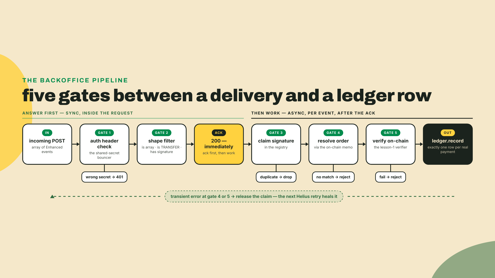
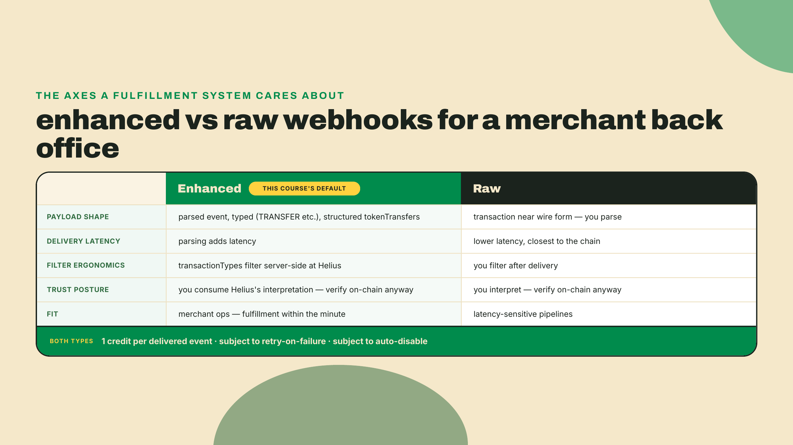
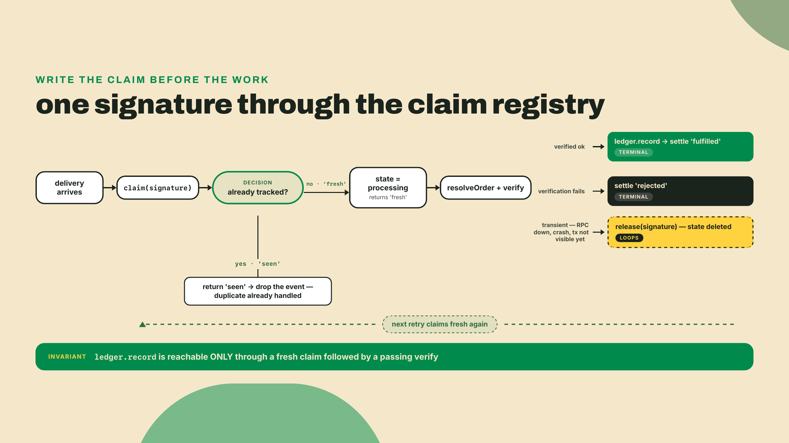
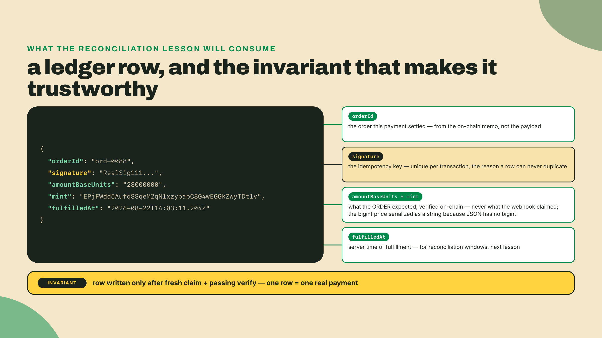
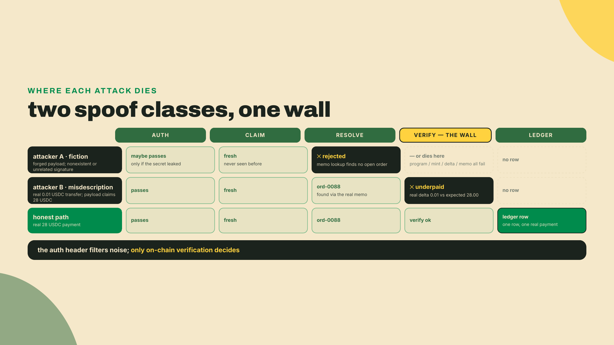
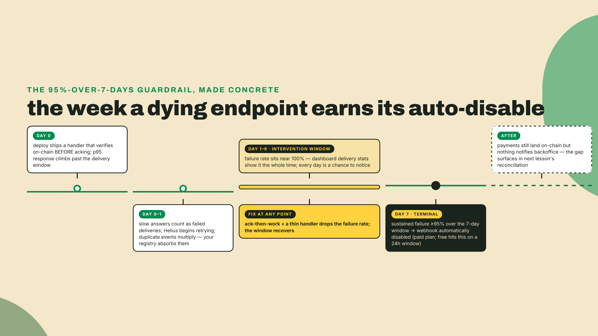
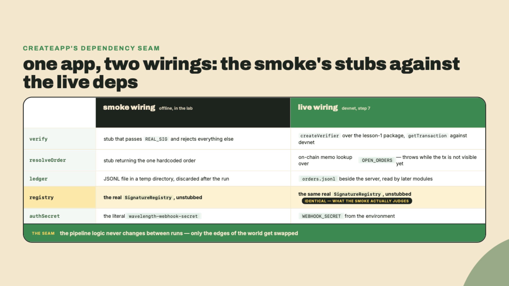

# Webhooks that lie: ingestion and idempotency

## Summary

Last lesson you built the verifier: a server-side `verify(signature, expectedOrder)` that fetches the transaction, checks token program, mint, balance delta, and memo, and keeps a processed-signatures set. It is the course's acceptance harness. What it cannot do is notice a payment on its own. Someone has to tell it a signature exists. Today we build the teller, knowing that the teller lies.

The findings up front:

- You ship **backoffice**: an Express receiver for Helius Enhanced TRANSFER events that de-dupes on the transaction signature, runs every event through last lesson's verifier before fulfilling anything, and writes an orders ledger where one row means one real payment.
- Duplicate deliveries are not a bug you handle; they are the contract you signed. Helius's own docs say it may retry webhook deliveries if your server does not respond successfully, and that you might receive duplicate events (checked 2026-08-22). Answering slowly counts as not answering.
- The dedup key is the transaction signature. That choice is our inference, sound but ours: Helius documents the retries, not the key. We will argue for it properly below.
- A webhook is a notification, not proof. Every event goes through on-chain verification before the ledger records a sale; the payload's numbers are never inputs to fulfillment.
- Webhooks have a ceiling, and it is enforced: a webhook failing at 95 percent or more over 7 days gets automatically disabled on paid plans (a 24-hour window on the free plan). Past merchant-ops volume, ingestion moves to Yellowstone gRPC indexing, which belongs to the Client-Side Mastery course.

Before any theory, feel the failure. Save this as `naive.ts` anywhere (it assumes `express` is installed; if you are in a fresh folder, `npm install express@5.1.0` first):

```ts
// naive.ts - the receiver you must never ship
import express from 'express';

const app = express();
app.use(express.json());

let fulfilled = 0;
app.post('/webhooks/helius', (req, res) => {
  for (const event of req.body) {
    fulfilled++;
    console.log(`shipped order ${fulfilled} for signature ${event.signature.slice(0, 8)}...`);
  }
  res.status(200).end();
});

app.listen(4000, () => console.log('naive receiver on :4000'));
```

Run it with `npx tsx naive.ts`, then play Helius for a moment. One real payment, delivered three times, exactly as a retry storm would deliver it:

```bash
for i in 1 2 3; do
  curl -s -X POST localhost:4000/webhooks/helius \
    -H 'Content-Type: application/json' \
    -d '[{"signature":"5KtPn1abcDEF","type":"TRANSFER"}]'
done
```

Three shipped orders. One payment. If this receiver ran Wavelength's record-of-the-month club, you just mailed the same customer three copies of a 200-press run and ate the cost of two. Everything in this lesson exists to make that loop print `shipped order 1` and then go quiet.



## Notifications, not proof

### Stripe hygiene, new keys

If you have integrated Stripe, you have already done this lesson once. Stripe retries webhooks that your endpoint does not acknowledge. Stripe integrators de-duplicate on an idempotency key so a retried `checkout.session.completed` does not ship twice. Stripe tells you, in bold, to verify the event against their API instead of trusting the POST body, because anyone can POST JSON at your endpoint. Every one of those sentences survives the trip to Solana with one substitution: the idempotency key becomes the transaction signature, and "verify against Stripe's API" becomes "verify against the chain."

That mapping is worth taking seriously rather than as a slogan, because Stripe is not a bystander in this story anymore. As of 2026, Stripe holds a four-front position in crypto payments: its logo sits on x402.org's trusted-by wall, it co-authored the Agentic Commerce Protocol with OpenAI, it co-authored the "Payment" HTTP authentication scheme that the Machine Payments Protocol is built on, and it operates as a USDC-on-Solana acquirer that settles merchants in fiat (x402.org, agenticcommerce.dev, the IETF datatracker, and Stripe's own docs, checked 2026-08-21). The company that wrote the webhook hygiene playbook is now processing the exact rail you are building on. When your webhook discipline here matches theirs, that is convergent evolution under the same predator: the duplicate event.


One asymmetry does not carry over, and it raises the stakes rather than lowering them. When a Stripe integrator double-fulfills, there is a refund API and, behind it, a card network that can claw money back. Here, module 1 already taught you the rail's blunt truth: no chargebacks. A double-shipped record is not an awkward support ticket, it is inventory gone. The hygiene is the same as Stripe's; the price of skipping it is higher. Which is the builder's version of good news, honestly. The discipline you already know is sufficient. You just actually have to do it.

### The event, Enhanced or Raw

Helius webhooks come in two main flavors, chosen at creation time via `webhookType`. **Enhanced** delivers parsed, human-legible events: Helius runs the raw transaction through its parser and hands you a typed object with a `type` field like `TRANSFER`, a `signature`, a `description`, and structured `tokenTransfers`. **Raw** delivers the transaction closer to wire form, with less parsing and lower delivery latency. There are also Discord variants and devnet twins of each (`enhancedDevnet`, `rawDevnet`), which is what the lab uses so your test payments stay on devnet.

For merchant ops, Enhanced is the right default. The latency difference matters when you are racing blocks; a record shop fulfilling within the minute does not care, and the parsed shape means your filter code reads like English. The trade: you are consuming Helius's interpretation of the transaction, one more reason the payload stays a hint rather than a source of truth.

Creating one is a single authenticated POST, authenticated with the `HELIUS_API_KEY` you exported during the module 2 setup. (Your RPC calls do not use it; this course runs its RPC against public endpoints, and the key exists only for webhooks.) If `echo $HELIUS_API_KEY` prints nothing, go back to that step before continuing:

```bash
curl -s -X POST "https://mainnet.helius-rpc.com/v0/webhooks?api-key=$HELIUS_API_KEY" \
  -H 'Content-Type: application/json' \
  -d '{
    "webhookURL": "https://backoffice.wavelength.example/webhooks/helius",
    "webhookType": "enhancedDevnet",
    "transactionTypes": ["TRANSFER"],
    "accountAddresses": ["<YOUR_MERCHANT_USDC_ATA>"],
    "authHeader": "wavelength-webhook-secret"
  }'
```

One thing about that URL before the fields: `mainnet.helius-rpc.com` here is the webhook API's own host, not a statement about which cluster you are watching. The cluster is chosen by `webhookType`, which is why a devnet webhook is created against the same host.

Field by field, because each one is a decision. `webhookURL` must be a URL Helius can reach, so localhost needs a tunnel during development (any HTTPS tunnel works; the lab notes one option). `transactionTypes: ["TRANSFER"]` narrows delivery to the parsed type we care about. `accountAddresses` is the watch list: your merchant ATA, the account every checkout from module 3 pays into. And `authHeader` is a value of your choosing that Helius echoes back on each delivery's Authorization header, so your receiver can drop traffic that never came from Helius. The dashboard can create the same webhook by form if you prefer clicking. There is no SDK in this path either way: the curl above is the whole registration, and `helius-sdk` never gets installed in this course (if you did reach for it, note that 3.1.0 peers `@solana/kit` ^6.9, so it would pin you to the same kit v6 line the ops workspaces already sit on).

What arrives at your endpoint is an **array** of enhanced transaction events, even for a single transaction. Each element carries `signature`, `type`, `slot`, `timestamp`, `feePayer`, a `tokenTransfers` array with mints and amounts, and more. Here is the part that should feel strange until it clicks: of that whole rich object, our receiver will read exactly two fields, `signature` and `type`. Everything else is scenery. Not because the data is usually wrong, but because "usually" is not a fulfillment policy, and we have a verifier whose entire job is to establish those same facts from the chain itself.



### Duplicates are the contract

Now the heart of it. Helius's delivery promise is deliberately modest: if your server does not respond successfully, it may retry, and you might receive duplicate events. "Respond successfully" is roughly "answer with a 2xx, in time." Read that as a system designer and two consequences fall out.

First: your endpoint's speed is part of its correctness. A handler that verifies on-chain before answering can take seconds under load; seconds is long enough to look like a failure, and a failure means redelivery. So the receiver acks first and works after. Accept the POST, check the cheap things (auth header, shape), answer 200, then process each event asynchronously. This inverts the instinct most of us have, which is to answer only when the work is done. Here, answering IS a separate job from the work, and conflating them manufactures the very duplicates you then have to survive.

Second: since duplicates are expected, exactly-once fulfillment cannot live at the delivery layer at all. It has to live in your state, keyed on something that is identical across every duplicate of the same payment and different across every distinct payment. Look at the event and ask what qualifies. `timestamp`? Identical duplicates could disagree if re-parsed, and two different payments can share one. The `tokenTransfers` amounts? Two customers buying the same 28 USDC record produce identical amounts. The whole payload hashed? One re-parse with a field added and your key changes while the payment does not. The transaction signature? Unique per transaction by construction, immutable once the transaction lands, present in every delivery of that transaction, and, best of all, it is the exact input your verifier already consumes.

So: key idempotency on the signature. Let me label this the way the honesty rules of this course demand. Helius documents the retries; it does not document "de-dupe on the signature." That step is our inference. It is a sound one, resting on what a signature is on-chain rather than on any vendor behavior, and it is the same inference every serious integrator makes. But if Helius ever changed what a delivery contains, the inference is what you would re-check, which is one more argument for the habit this lesson drills: never let the webhook's word reach the ledger without the chain confirming it.

The mechanism is a claim registry with three states. Before any work happens on an event, the receiver tries to claim its signature. A fresh claim marks the signature `processing` and proceeds. A second delivery arriving mid-verification finds the claim and stops dead: that is why the claim must be written before the verification starts, not after it succeeds. When work finishes, the claim settles to `fulfilled` or `rejected`, both terminal. And when work fails for a reason that is not the payment's fault, an RPC timeout, a crash in our own code, the claim is released entirely, so the signature reads as never-seen again.

The whole registry is small enough to read in one breath:

```ts
// claims.ts - three-state claim registry keyed on the transaction signature
type ClaimState = 'processing' | 'fulfilled' | 'rejected';

const claims = new Map<string, ClaimState>();

export function claim(signature: string): 'fresh' | 'seen' {
  if (claims.has(signature)) return 'seen';
  claims.set(signature, 'processing');
  return 'fresh';
}

export function settle(signature: string, outcome: 'fulfilled' | 'rejected'): void {
  claims.set(signature, outcome);
}

export function release(signature: string): void {
  claims.delete(signature); // transient failure: the next retry claims fresh again
}
```

Why release instead of reject? Because of what retries then become. If your process dies halfway through verifying a real payment, Helius will knock again, the released claim answers `fresh`, and the payment fulfills on the second pass with zero code written by you. The retry behavior you spent this whole section defending against turns out to be your crash recovery, free of charge, once you stop fighting it. The failure mode this kills is real: reject on a transient error and that customer's payment is permanently stranded in a terminal state while their money sits in your ATA. You would find it during reconciliation next lesson, but "the ledger heals itself" beats "the ledger gets audited."

Before we leave this section, pay for the ack-then-work pattern honestly, because it is not free and pretending otherwise would be exactly the kind of glibness this course keeps swearing off. The moment you answer 200 before the work is done, you have told Helius the delivery succeeded, which means Helius will never retry it, which means any event that dies between your ack and your settle is simply gone from the delivery system's point of view. A process crash in that window, a deploy that restarts the server mid-batch, an unhandled rejection in `processEvent`: the payment landed on-chain, the notification was delivered and acknowledged, and your ledger knows nothing. The `release` valve cannot save you here, since release only helps when a retry is coming, and you signed the retry away with your 200. So what actually backstops the gap? Two things. Inside one process lifetime, the claim registry plus release handles everything that fails loudly. Across process deaths, nothing in this lesson does, on purpose: the safety net for silently lost work is the reconciliation sweep you build next lesson, which walks the chain's own history against the ledger and surfaces every payment that never got a row. Production systems narrow the window further by pushing accepted events into a durable queue before acking, so the queue survives the crash even though the HTTP exchange is over. For merchant-ops volume, ack-then-work plus reconciliation is the honest, proportionate trade: you accept a small window of silent loss that a nightly sweep repairs, in exchange for an endpoint fast enough that the retry storm never starts. Just know you made that trade, because the failure it permits is invisible until you go looking.



### The ledger that means it

Fulfillment needs a record, and the record is its own artifact: the **orders ledger**. Ours is an append-only JSONL file, one line per fulfilled order, carrying the order id, the signature that paid it, the amount and mint the order expected, and a timestamp. That is deliberately boring. The interesting part is the invariant the pipeline grants it: a row is written only after a fresh claim and a passing on-chain verification, so one row equals one real payment, always. The ledger never records attempts, notifications, or hopes. It records money.

Boring is also load-bearing for what comes next. This file is the artifact the next lesson's reconciliation reads, line by line, against on-chain history. Keep the shape stable, because a future lesson calls `rows()` on it and expects exactly these fields.

In production this pair, registry plus ledger, is one database with two tables, and the claim is an insert into a table with a unique index on the signature. The database's uniqueness guarantee replaces our in-process Map, and the claim-before-work pattern survives unchanged: insert first, work second, delete the row on transient failure. Our in-memory registry loses the `processing` claims on restart, and that is by design rather than laziness. Fulfilled rows persist in the file; in-flight claims die with the process; the retries re-deliver whatever died in flight. You can also rebuild the registry's `fulfilled` entries from the ledger on boot, one loop over `ledger.rows()` calling `settle(row.signature, 'fulfilled')`; worth adding the day you wire the real server, and left out of the lab because the smoke starts from an empty file anyway.

There is also the quiet question of how big this state gets, and last lesson already gave you the vocabulary for it. The verifier's processed-signatures set needed an eviction horizon because storing every signature forever is unbounded growth, and the registry inherits the same arithmetic: every payment Wavelength ever receives leaves a `fulfilled` entry behind. The eviction logic transfers almost unchanged. A signature can only be redelivered while its transaction can still be confused for a fresh one, and once a payment is old enough that its blockhash lifetime plus a comfortable margin has passed, and its row is safely in the ledger, the registry entry has done its job and can go. The ledger itself, by contrast, is never evicted; it is the business record, it grows one small line per sale, and a year of a busy record shop fits in a few megabytes. Keep the distinction crisp in your head: the registry is operational memory with a horizon, the ledger is history with none.

One more habit from last lesson carries forward: the processed-signatures set inside the verifier still exists and still runs. The receiver's registry is the fast gate at the front door; the verifier's dedup is defense in depth behind it. Two layers keyed on the same signature cost almost nothing, and the day one of them has a bug is the day you learn to love the other.



### Spoofs die at the verifier

Time to think like the attacker, because your endpoint is a public URL and JSON is free. Two spoof classes matter.

Class one: pure fiction. A POST with a well-formed Enhanced payload and a signature that does not exist on-chain, or exists but is someone else's unrelated transaction. The auth header stops the lazy version of this, which is why we check it, but a shared secret leaks, sits in a config dump, or gets guessed, so it is a bouncer, not proof. The real wall is that fulfillment requires `verify()` to pass, and `verify()` starts from getTransaction against the chain. A fictional signature resolves to nothing. An unrelated real signature fails the token-program, mint, delta, or memo checks. Either way the claim settles `rejected` and the ledger never hears about it.

Class two, the subtle one: a real payment, misdescribed. The attacker sends a genuine transaction, maybe 0.01 USDC to your actual merchant ATA, then POSTs you an Enhanced-shaped event for that signature where `tokenTransfers` says 28 USDC and the description names your priciest pressing. Every field checks out except the ones that matter. If your receiver read amounts from the payload, this attack ships records for a penny. Ours reads nothing but the signature; the verifier fetches the real transaction and computes the real delta, 0.01 USDC, against the order's expected 28 USDC, and rejects it as underpaid. The lesson compresses to one sentence you should be able to recite by now: the payload routes, the chain decides.

That is also why `resolveOrder` in our pipeline works the way it does. Mapping a signature to an order via the payload's description would hand routing AND deciding to the attacker. Instead the resolver does what the verifier does: fetches the transaction and reads our own order id out of the on-chain memo your checkout stamped in module 3. Untrusted input gets to nominate a signature for inspection. That is all it gets to do.



### The ceiling, and what lies past it

Webhooks fail in a way the platform notices. Every delivery your endpoint flubs, times out on, or 500s counts against you, and the guardrail is published and automatic: sustain a failure rate of 95 percent or more over 7 days on a paid plan and Helius disables the webhook (free plans get judged on a 24-hour window). This is not punishment for one bad deploy; 95 percent over a week is an endpoint that is effectively dead. Auto-disable is the platform declining to DDoS your corpse. Your defenses are the ones you have already built: ack fast so slowness does not read as failure, keep the handler thin, and monitor the webhook's delivery stats in the dashboard the same way you would watch a Stripe endpoint's error rate.

Do the economics while we are here, because they decide the architecture more honestly than taste does. Delivery costs 1 credit per event. A record shop doing even a thousand sales a day spends a thousand credits on ingestion, rounding error against your RPC usage, and the webhook fires only when a watched account actually moves. This is the regime webhooks are designed for: low-frequency, high-value events where per-event pricing is negligible and a minute of latency is invisible. Now invert it. Indexing every transfer touching a popular program, tens of millions of events, sub-second freshness requirements: per-event delivery pricing and HTTP-per-event overhead both stop making sense, and no amount of retry hygiene fixes an architecture mismatch. The classic wrong answer is a polling loop hammering getTransaction ranges, which burns credits to re-fetch mostly unchanged state and still lags. The right answer is a streaming subscription straight off the validator firehose: Yellowstone gRPC and its relatives. That world, gRPC ingestion, Geyser plumbing, backfill, the whole data-infrastructure seat, is the Client-Side Mastery course's territory, and its webhook lesson picks up exactly where this one stops. Wavelength does not have that problem. A merchant back office is precisely the merchant-ops seat, and for it, the humble webhook plus the discipline you now have is the correct engineering, not the beginner version of something fancier.



## Lab: build the backoffice

How today's work is divided: I walk the server and the pipeline with you end to end (worked). You implement the two moves this lesson exists to teach, the signature claim and the ledger write, against stated rules with the smoke test as your judge (completion). Then the triple-delivery replay and a hand-crafted spoof are yours alone (solo). Done means `npx tsx smoke.ts` prints `SMOKE PASS`.

**1. Scaffold the workspace.** `backoffice` lives beside your `verifier` project from last lesson so it can import `verify`. Same server stack as the rest of the course:

```bash
mkdir -p backoffice/src
cd backoffice
npm init -y
npm pkg set type=module
npm install express@5.1.0
npm install -D tsx@4 typescript @types/express @types/node
```

Pins and their freshness notes: `express` is pinned at 5.1.0 here, but any 5.x works and nothing in this receiver depends on the difference (the blink lesson installed 5.2.1, which is npm's current 5.x as of 2026-08-22). `tsx` 4 is the runner the whole course uses; this install line is its install if the machine is fresh. No Helius SDK appears in this install line, and this course never installs one: the webhook is created with a curl and the receiver reads plain JSON off an HTTP POST, so `HELIUS_API_KEY` from the module 2 setup is the only Helius dependency you have. That is rather the point — ingestion is just HTTP, and a webhook receiver that needs a vendor SDK to parse a request body has taken on a dependency for nothing.

**2. Types: the contract we consume and the two fields we read.**

```ts
// backoffice/src/types.ts

// The verifier's contract, frozen in the last lesson and restated here
// verbatim so backoffice compiles standalone. The real wiring imports the
// verifier package directly; these shapes must keep matching it exactly.
export interface ExpectedOrder {
  orderId: string;         // the id your txreq builder stamps into the spl-memo
  recipient: string;       // the merchant owner address (base58)
  recipientAta: string;    // the merchant token account for the expected mint
  mint: string;            // the mint you price in (base58)
  amountBaseUnits: bigint; // the exact price, integer base units, never a float
}

export type RejectReason =
  | 'duplicate'
  | 'wrong-token-program'
  | 'wrong-mint'
  | 'underpaid'
  | 'wrong-reference';

export type VerifyResult =
  | { ok: true; reason: 'verified'; signature: string }
  | { ok: false; reason: RejectReason | 'not-found'; signature: string };

export type VerifyFn = (
  signature: string,
  expectedOrder: ExpectedOrder,
) => Promise<VerifyResult>;

// Maps a signature to the open order it claims to pay, by reading OUR memo
// out of the transaction on-chain. Returns undefined when the transaction is
// visible but matches no open order. If the transaction is not visible yet,
// THROW instead: the catch in processEvent releases the claim, and the next
// Helius retry resolves it cleanly.
export type ResolveOrderFn = (signature: string) => Promise<ExpectedOrder | undefined>;

// The minimum we read from a Helius Enhanced event: the signature and the type.
// Everything else in the payload is a hint, never an input to fulfillment.
export interface EnhancedEvent {
  signature: string;
  type: string;
}
```

**3. The registry, your first completion rung.** The rules are in the comments; the implementation is yours. The whole lesson hinges on `claim` doing set-before-work, so earn it:

```ts
// backoffice/src/registry.ts

export type SigState = 'processing' | 'fulfilled' | 'rejected';

export class SignatureRegistry {
  private states = new Map<string, SigState>();

  // The idempotency gate. Called BEFORE any verification work.
  // Rule 1: if the signature is already tracked (any state), return 'seen'.
  // Rule 2: otherwise record it as 'processing' and return 'fresh'.
  // The set-before-work order is the whole trick: a duplicate delivery that
  // arrives while the first is still verifying must land on 'seen'.
  claim(signature: string): 'fresh' | 'seen' {
    throw new Error('Your turn: implement the claim per the two rules above.');
  }

  // Terminal states. A settled signature is never processed again.
  settle(signature: string, state: 'fulfilled' | 'rejected'): void {
    this.states.set(signature, state);
  }

  // Transient-failure escape hatch: forget the claim so the NEXT redelivery
  // gets a clean 'fresh'. This is what turns Helius retries from a nuisance
  // into your crash recovery.
  release(signature: string): void {
    this.states.delete(signature);
  }

  stateOf(signature: string): SigState | undefined {
    return this.states.get(signature);
  }
}
```

**4. The ledger, your second completion rung.** Append-only JSONL; `record` is yours, `rows` is given because next lesson's reconciliation depends on its exact behavior:

```ts
// backoffice/src/ledger.ts
import { appendFileSync, existsSync, readFileSync } from 'node:fs';
import type { ExpectedOrder } from './types';

export interface LedgerRow {
  orderId: string;
  signature: string;
  amountBaseUnits: string; // the bigint price serialized; JSON has no bigint
  mint: string;
  fulfilledAt: string; // ISO timestamp
}

// Append-only JSONL. One row = one fulfillment = one real payment.
// Exactly-once is enforced UPSTREAM by the registry claim; the ledger's own
// invariant is that record() is only ever reached through a fresh claim.
export class Ledger {
  constructor(private file: string) {}

  record(order: ExpectedOrder, signature: string): LedgerRow {
    // Rule 1: build a LedgerRow from the ORDER's fields (orderId, mint, and
    //         amountBaseUnits via .toString()) plus the signature. Never from
    //         any webhook payload.
    // Rule 2: fulfilledAt is new Date().toISOString().
    // Rule 3: append the row to this.file as one JSON line ending in '\n',
    //         then return the row.
    throw new Error('Your turn: write the row per the three rules above.');
  }

  rows(): LedgerRow[] {
    if (!existsSync(this.file)) return [];
    return readFileSync(this.file, 'utf8')
      .split('\n')
      .filter((line) => line.length > 0)
      .map((line) => JSON.parse(line) as LedgerRow);
  }
}
```

**5. The receiver, worked.** Read the ack placement and the catch block twice; they are the two decisions the theory section spent the most words on:

```ts
// backoffice/src/server.ts
import express from 'express';
import type { EnhancedEvent, ResolveOrderFn, VerifyFn } from './types';
import type { SignatureRegistry } from './registry';
import type { Ledger } from './ledger';

export interface BackofficeDeps {
  authSecret: string; // the authHeader value you set at webhook creation
  verify: VerifyFn; // the lesson-1 verifier
  resolveOrder: ResolveOrderFn; // signature -> open order, via the on-chain memo
  registry: SignatureRegistry;
  ledger: Ledger;
  onSettled?: (signature: string) => void; // test hook; unused in production
}

function isEnhancedEvent(value: unknown): value is EnhancedEvent {
  if (typeof value !== 'object' || value === null) return false;
  const v = value as Record<string, unknown>;
  return typeof v.signature === 'string' && typeof v.type === 'string';
}

export function createApp(deps: BackofficeDeps): express.Express {
  const app = express();
  app.use(express.json({ limit: '1mb' }));

  app.post('/webhooks/helius', (req, res) => {
    // Gate 1: the shared secret. A bouncer, not proof.
    if (req.get('authorization') !== deps.authSecret) {
      res.status(401).json({ error: 'bad auth header' });
      return;
    }

    // Helius posts an ARRAY of events. Anything that isn't one is malformed.
    if (!Array.isArray(req.body)) {
      res.status(400).json({ error: 'expected an array of events' });
      return;
    }

    const events = req.body.filter(isEnhancedEvent).filter((e) => e.type === 'TRANSFER');

    // Ack FIRST, work after. A slow answer counts as a failed delivery,
    // and enough failed deliveries kill the webhook.
    res.status(200).json({ received: events.length });

    for (const event of events) {
      void processEvent(deps, event.signature);
    }
  });

  return app;
}

async function processEvent(deps: BackofficeDeps, signature: string): Promise<void> {
  try {
    // The idempotency gate: claim before any work. (Inside the try so a
    // throw here, including the lab's placeholder, fails loudly in the catch
    // instead of tearing the process down as an unhandled rejection.)
    if (deps.registry.claim(signature) === 'seen') return;

    // The payload told us a signature. The CHAIN tells us which order it pays.
    const order = await deps.resolveOrder(signature);
    if (!order) {
      deps.registry.settle(signature, 'rejected');
      deps.onSettled?.(signature);
      return;
    }

    // A webhook is a notification, not proof. The verifier is the proof.
    const result = await deps.verify(signature, order);
    if (result.ok) {
      deps.ledger.record(order, signature);
      deps.registry.settle(signature, 'fulfilled');
    } else if (result.reason === 'not-found') {
      // The last lesson's contract: not-found is transient, not a verdict.
      // At confirmed commitment the transaction can lag a fast webhook.
      // Release, and the next retry re-verifies against a caught-up chain.
      deps.registry.release(signature);
      return;
    } else {
      deps.registry.settle(signature, 'rejected');
    }
    deps.onSettled?.(signature);
  } catch (err) {
    // Transient failure (RPC hiccup, our own bug): log it with its reason so
    // the ops log reads like a diagnosis, then release the claim so the next
    // redelivery retries cleanly. Crashing here without releasing would
    // strand the signature in 'processing' forever.
    console.error(
      `[backoffice] transient failure for ${signature.slice(0, 8)}...:`,
      err instanceof Error ? err.message : err,
    );
    deps.registry.release(signature);
  }
}
```

Walk the worked part with me. The handler body before the ack does only constant-time work: header compare, array check, shape filter. Everything that can be slow or can fail lives after `res.status(200)`, inside `processEvent`, launched with `void` because the HTTP response owes it nothing. `processEvent` is the theory section as code: claim, resolve, verify, settle, with `release` in the catch as the retry-healing valve. One branch deserves a second look: the verifier's `not-found` releases instead of rejecting, honoring last lesson's contract that not-found is transient, since at `confirmed` commitment a fast webhook can outrun `getTransaction` visibility. The next redelivery re-verifies against a chain that has caught up. And notice what is absent: not one field of the event beyond `signature` and `type` is ever read. The misdescription spoof has nothing to talk to.

**6. The smoke test.** This is the lab's acceptance gate and the same triple-delivery replay you ran against the naive receiver, now with a spoof rider. It stubs the verifier and resolver so it runs offline; the stubs honor the real contracts exactly:

```ts
// backoffice/smoke.ts
// Triple-delivers a real event and one spoof against the receiver.
// Pass = exactly one ledger row, spoof rejected. Run: npx tsx smoke.ts
import { mkdtempSync } from 'node:fs';
import { tmpdir } from 'node:os';
import { join } from 'node:path';
import { createApp } from './src/server';
import { SignatureRegistry } from './src/registry';
import { Ledger } from './src/ledger';
import type { ExpectedOrder, VerifyResult } from './src/types';

const REAL_SIG = 'RealSig1111111111111111111111111111111111111111111111111111111111111111111111111111111111';
const SPOOF_SIG = 'SpoofSig111111111111111111111111111111111111111111111111111111111111111111111111111111111';

const order: ExpectedOrder = {
  orderId: 'ord-0088',
  recipient: 'WVLmerchantOwner1111111111111111111111111111', // stub base58
  recipientAta: 'WVLmerchantUsdcAta11111111111111111111111111', // stub base58
  mint: 'EPjFWdd5AufqSSqeM2qN1xzybapC8G4wEGGkZwyTDt1v', // USDC
  amountBaseUnits: 28_000_000n, // 28 USDC
};

// Stub the chain so the smoke runs offline. The real wiring imports the
// lesson-1 verifier and the on-chain memo resolver instead of these.
const resolveOrder = async (_signature: string): Promise<ExpectedOrder | undefined> =>
  order; // both real event and spoof resolve to this order; the spoof dies at verify, not here
const verify = async (signature: string, _expected: ExpectedOrder): Promise<VerifyResult> =>
  signature === REAL_SIG
    ? { ok: true, reason: 'verified', signature }
    : { ok: false, reason: 'wrong-reference', signature };

const registry = new SignatureRegistry();
const ledger = new Ledger(join(mkdtempSync(join(tmpdir(), 'backoffice-')), 'ledger.jsonl'));

const settled = new Set<string>();
const app = createApp({
  authSecret: 'wavelength-webhook-secret',
  verify,
  resolveOrder,
  registry,
  ledger,
  onSettled: (sig) => settled.add(sig),
});

const server = app.listen(0, async () => {
  const address = server.address();
  if (address === null || typeof address === 'string') throw new Error('no port');
  const url = `http://127.0.0.1:${address.port}/webhooks/helius`;

  const post = (signature: string, auth = 'wavelength-webhook-secret') =>
    fetch(url, {
      method: 'POST',
      headers: { 'content-type': 'application/json', authorization: auth },
      body: JSON.stringify([{ signature, type: 'TRANSFER' }]),
    });

  // 1. Triple delivery of the same real event: Helius retry behavior, replayed.
  for (let i = 0; i < 3; i++) {
    const res = await post(REAL_SIG);
    if (res.status !== 200) throw new Error(`delivery ${i + 1}: expected 200, got ${res.status}`);
  }
  // 2. A spoofed event whose signature fails on-chain verification.
  await post(SPOOF_SIG);
  // 3. A delivery with the wrong auth header never even reaches processing.
  const unauth = await post(REAL_SIG, 'wrong-secret');
  if (unauth.status !== 401) throw new Error(`expected 401 for bad auth, got ${unauth.status}`);

  // Wait for the async processing to settle both signatures.
  for (let i = 0; i < 100 && settled.size < 2; i++) {
    await new Promise((r) => setTimeout(r, 10));
  }

  const rows = ledger.rows();
  if (rows.length !== 1) throw new Error(`expected exactly 1 ledger row, found ${rows.length}`);
  if (rows[0].signature !== REAL_SIG) throw new Error('ledger row carries the wrong signature');
  if (registry.stateOf(SPOOF_SIG) !== 'rejected') throw new Error('spoof was not rejected');
  if (registry.stateOf(REAL_SIG) !== 'fulfilled') throw new Error('real payment not fulfilled');

  console.log('backoffice: triple-delivered webhook -> exactly-once ledger row; spoofed event rejected');
  console.log('SMOKE PASS');
  server.close();
});
```

Run it:

```bash
npx tsx smoke.ts
```

With the two placeholder throws still in place, the smoke fails on the ledger row count (each throw is caught, logged with its `Your turn` message by the receiver's catch block, and the claim released, so no row is ever written), which is the lab telling you the completion rungs are genuinely yours. When your `claim` and `record` are right, it prints the pass line. Wire `npm run verify:backoffice` to this script in `package.json` (`"verify:backoffice": "tsx smoke.ts"`), so every rung's verify stays runnable by name — the habit that pays when the capstone's journey harness shakes the assembled stack and you need to re-check one rung in isolation.



**7. Point a real webhook at it.** The smoke stubbed the chain; the live run needs the real wiring, and `createApp` only builds the app, so give it an entry point. Create `backoffice/src/main.ts`:

```ts
// backoffice/src/main.ts - the live wiring for step 7. Before you pay,
// register the order your checkout is about to mint in OPEN_ORDERS.
import { createSolanaRpc, signature as asSignature } from '@solana/kit';
import { createVerifier } from '../../verifier/src/verify.ts';
import { createMemoryStore } from '../../verifier/src/store.ts';
import { createRpcFetchTransaction } from '../../verifier/src/rpc.ts';
import { createApp } from './server';
import { SignatureRegistry } from './registry';
import { Ledger } from './ledger';
import type { ExpectedOrder } from './types';

const rpc = createSolanaRpc(process.env.RPC_URL ?? 'https://api.devnet.solana.com');

// The one open order this live run expects, keyed by orderId. A toy on
// purpose: next lesson replaces it with a real open-orders store.
const OPEN_ORDERS = new Map<string, ExpectedOrder>();

// The real resolver: fetch the transaction, read OUR order id out of the
// on-chain memo (wavelength:<orderId>:<description>), map it to an open
// order. Throws when the tx is not visible yet, so processEvent's catch
// releases the claim and the next Helius retry resolves it cleanly.
async function resolveOrder(sig: string): Promise<ExpectedOrder | undefined> {
  const tx = await rpc
    .getTransaction(asSignature(sig), {
      encoding: 'jsonParsed',
      maxSupportedTransactionVersion: 0,
      // Match the verifier's commitment: the default here is `finalized`,
      // which would make every fresh payment "not visible yet" for ~10 extra
      // seconds and lean on the retry loop to paper over the lag.
      commitment: 'confirmed',
    })
    .send();
  if (!tx) throw new Error('transaction not visible yet');
  for (const ix of tx.transaction.message.instructions) {
    const p = ix as { program?: string; parsed?: unknown };
    if (p.program === 'spl-memo' && typeof p.parsed === 'string') {
      const order = OPEN_ORDERS.get(p.parsed.split(':')[1] ?? '');
      if (order) return order;
    }
  }
  return undefined; // visible, but matches no open order
}

const app = createApp({
  authSecret: process.env.WEBHOOK_SECRET ?? 'wavelength-webhook-secret',
  verify: createVerifier({
    fetchTransaction: createRpcFetchTransaction(),
    store: createMemoryStore(),
  }),
  resolveOrder,
  registry: new SignatureRegistry(),
  ledger: new Ledger('orders.jsonl'), // lands at backoffice/orders.jsonl; later modules read this exact path
});
app.listen(4000, () => console.log('backoffice listening on :4000'));
```

Add your order to `OPEN_ORDERS` (the order id your checkout will stamp, your merchant address and ATA, the mint, the exact base-unit price), start it with `npx tsx src/main.ts`, and expose port 4000 over an HTTPS tunnel (any tunnel; if you have none installed, `npx localtunnel --port 4000` is a zero-config option). Then run the creation curl from the theory section with `webhookType: "enhancedDevnet"`, your tunnel URL, and your merchant devnet ATA in `accountAddresses`. Then ring a sale on the module 3 checkout, paying from `/tmp/customer.json` the way that lesson's completion rung does (`PAYER_KEYFILE=/tmp/customer.json npm run --workspace transfer-kit pay -- $(solana address) 12.5 <ref>`) — the merchant is the one being paid, so the merchant cannot be the one paying — and watch a real Enhanced event arrive, claim, resolve, verify against devnet, and land one row in the ledger. The dashboard's webhook page shows the delivery either way, which is your debugging window when the tunnel drops.

## Challenge

**The completion rung** is behind you if the smoke passes: your `claim` and your `record`, judged by triple delivery.

**The solo rung, two parts, no walkthrough.**

First, hostile replay. Extend `smoke.ts` (or write `attack.ts` beside it) to cover the two cases the basic smoke does not: all three duplicates of the real event inside ONE delivery array, which exercises claim-before-work within a single batch, and a crash-recovery drill where your `verify` stub throws on its first call and succeeds on the second, proving a redelivery after `release` fulfills exactly once. Accept: one ledger row in both cases, and the drill's registry state ends `fulfilled`.

Second, a real spoof against the real wiring. On devnet, send a genuine transfer to your merchant ATA for a token amount far below any open order, hand-craft an Enhanced-shaped event for that real signature claiming a full-price payment, and POST it at your receiver with the correct auth header. Accept: the verifier rejects it on the on-chain delta, the registry reads `rejected`, and the ledger gained nothing. If your spoof somehow fulfills, do not fix the spoof. Fix the receiver, because that hole was real.

## Checkpoint, and what the ledger cannot tell you

If the smoke fails on row count, your `claim` is checking after work instead of before, or `record` is writing more than it is told; both are visible in under a minute of reading your own diff against the rules. If the real-webhook step delivers nothing, it is almost always the tunnel URL or the ATA in `accountAddresses`, in that order, and the dashboard's delivery log settles which. When it passes, notice what you now hold, because it is more than a webhook handler: retries, crashes, duplicates, and two whole classes of spoof all collapse into one quiet invariant, one ledger row per real payment. That invariant is the difference between a demo and a back office.

But sit with the ledger a moment and its blind spots stare back. It knows what was paid and verified, nothing else. A customer who overpaid by a dollar: one row, the overpayment invisible. A payment that landed on-chain while your webhook was disabled: no row at all, and the money is still yours, unrecorded. And nowhere in anything you have built is there a way to send money back. The ledger records truth; it cannot notice the truths it is missing, and it cannot undo one. Next lesson is reconciliation, sweeping the chain against this file to find every mismatch, and then the refund flow that no official doc will teach you. The rail has no chargebacks, so we build the giving-back ourselves. See you there.
