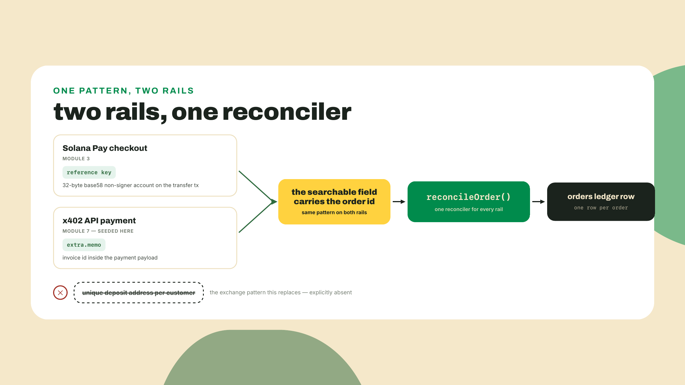
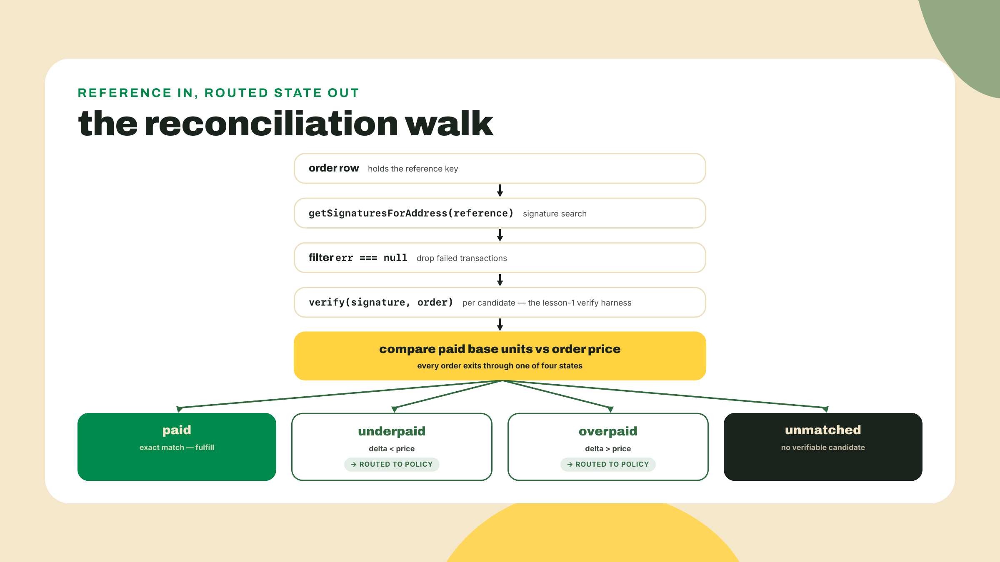
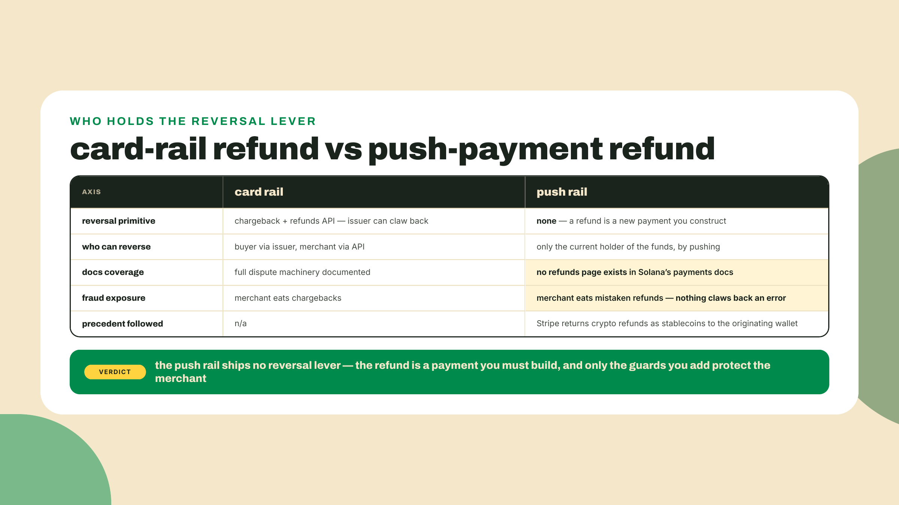
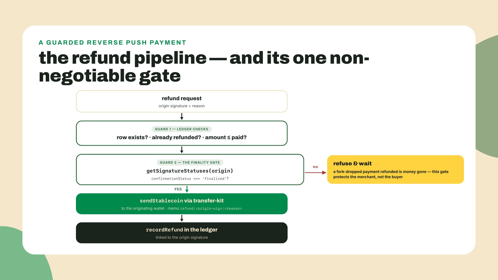
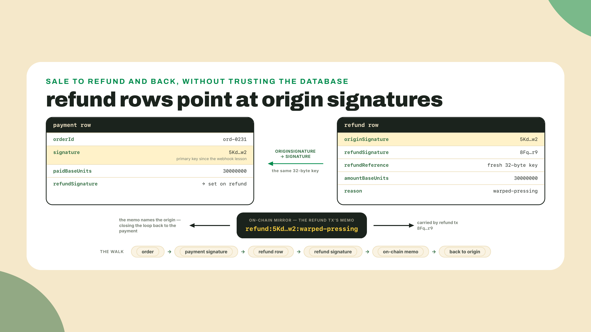
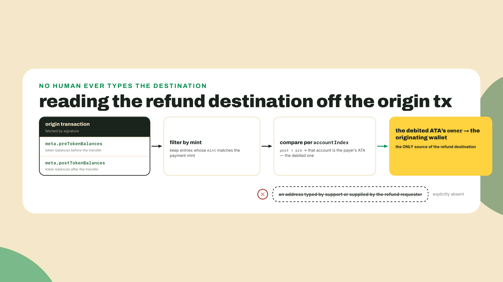
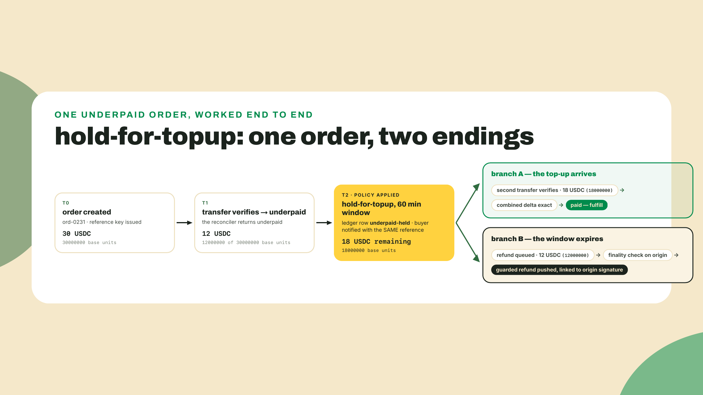

# Reconciliation, refunds, and partial fills: the missing manual

## Summary

Last lesson the back office grew ears: it ingests Helius webhooks idempotently, verifies every event on-chain before believing it, and writes an orders ledger keyed by the transaction signature, fulfilling exactly once. Today a buyer tests what it cannot do yet. They bought a pressing of a live session, the record arrived warped, and they want their money back. You open Solana's payments docs looking for the refund flow and find nothing, because chargebacks were designed out of the rails on purpose. The reversal is yours to build.

Before anything new, two minutes of housekeeping this module has been deferring, then prove the baseline still answers. The ops folders you created as bare siblings join the `wavelength` workspace now, so they can import each other by name (`verifier`, `transfer-kit`) instead of by relative path. Importing by name takes two things, and the roster only provides the first. Registering the folders as workspaces makes npm symlink each package into the root `node_modules` under its package name (`npm init -y` named each after its folder). But when a file then says `from 'verifier'`, Node follows that symlink to the package's `package.json` and opens whatever `main` names, and `npm init -y` wrote `"main": "index.js"`, a file neither package has. Point `main` at each package's real front door instead. `transfer-kit` has had a barrel at `src/index.ts` since module 2; the verifier never got one, because until today every consumer imported its files by relative path. Give it the same front door:

```ts
// verifier/src/index.ts
export { createVerifier } from './verify.ts';
export { createMemoryStore } from './store.ts';
export { createRpcFetchTransaction } from './rpc.ts';
export type { ExpectedOrder, VerifyResult, RejectReason } from './types.ts';
```

Then, from the `wavelength` root, register the roster and aim both `main` fields (tsx, which runs every script in this course, resolves a TypeScript entry directly):

```bash
cd ~/wavelength
npm pkg set --json workspaces='["transfer-kit","verifier","backoffice","backoffice-refunds"]'
npm pkg set type="module"
npm pkg set main="src/index.ts" --workspace transfer-kit --workspace verifier
npm install
npm run --workspace backoffice verify:backoffice
```

You should see the triple-delivered webhook collapse to exactly one ledger row and the spoofed event bounce off the verifier. That ledger, keyed by signature, is the substrate everything today builds on. If the smoke check fails, fix last lesson first; a reconciler on top of a broken ledger just automates confusion.

With the baseline answering, up front, what today establishes:

- You ship **backoffice-refunds**: a reconciler that matches payments to orders by reference key (the memo half ships as a wired TODO that module 7's traffic completes), and a refund builder that pushes stablecoins back to the originating wallet through transfer-kit, recording every refund in the ledger linked to its origin signature.
- Reconciliation converges. A Solana Pay reference key and an x402 `extra.memo` invoice id are the same idea, an order id carried in a searchable field, no unique deposit address needed. One reconciler serves both rails. A treasury sweep catches the money that matches nothing.
- Refunds are original construction, not doc citation. We follow the one industry precedent that exists: Stripe returns crypto refunds as stablecoins to the originating wallet, and so will we.
- Overpay, underpay, and partial fills get named policies, never silent defaults. Every choice in this lesson is a stated trade-off.
- One rule outranks all of it: a refund never leaves your wallet until the origin payment has finalized. A push refund is irreversible the instant it lands.

How the work splits for this module: this is the completion-leaning stretch. The reconciler and the sweep arrive as skeletons with marked TODOs, the way last lesson's claim registry and ledger write did, and the refund builder arrives worked, on the theory that the one file where a mistake spends real money is a file you should read before you write. The partial-fill policy at the end is solo, no scaffold, because a policy someone else wrote for you is exactly the silent default this lesson exists to kill.

## The reconciler and the reverse payment, up close

### One field, two rails

Start with the problem reconciliation solves. Money arrives at your treasury ATA as a stream of transfers. Orders live in your ledger as rows. Nothing in a raw transfer says which order it pays for, and you have one USDC account, not one per customer. The classic fix, the one exchanges use, is a unique deposit address per user: derive thousands of accounts, watch them all, sweep them constantly. Real infrastructure, real cost, and for a record shop, absurd.

The rails you have been using since the transfer-kit lesson already carry the better answer. Every payment your checkout builds includes a **reference key**: a fresh 32-byte base58 value attached to the transaction as a non-signer account. It does nothing on-chain. It exists so you can find the transaction later, because signature search by account is a native RPC capability. Generate one per order, store it on the order row, and the payment carries its own claim ticket.

Here is the part worth pausing on. In module 7 you will meet x402, the HTTP-native payment protocol, and its invoices carry an `extra.memo` field holding an invoice id. Different rail, different spec, same exact idea: an order identifier stashed in a searchable slot of the payment itself, so the merchant needs one account and one query instead of an address factory. The convergence is not a coincidence. Any push-payment rail without deposit addresses has to solve matching, and a searchable order id is the minimal solution. Which means the reconciler you write today is the general pattern rather than Solana Pay plumbing, and module 7 will plug the x402 half into it without a rewrite. (Credit where due: the Solana Pay reference spec and its `findReference` helper shipped this pattern first; we build ours on the kit directly so one reconciler serves both rails.)



### From reference to order

Mechanically, reconciliation is a three-step walk. Take the order's reference key. Ask the RPC for signatures mentioning that address; `getSignaturesForAddress` returns them newest first, including failed transactions, so the walk filters on `err === null`. Then, and this is the step that keeps you honest, run each candidate through the verifier you built at the top of this module. The reference key proves someone attached your claim ticket to a transaction. It does not prove the transaction paid you the right amount of the right token from the right program. Attaching an arbitrary account to a transaction is free; that is what makes references searchable, and also what makes them forgeable as evidence of payment. The verifier is the judge, the reference is just the address of the courtroom.

The reconciler's output is deliberately richer than paid-or-not. The verifier computes the actual balance delta on your ATA in base units, and comparing that delta to the order's price splits the world into four honest states: **paid** (exact), **underpaid**, **overpaid**, and **unmatched** (nothing verifiable found). Last lesson's ledger only ever recorded the happy path, because fulfillment gated on exact verification. Today the other three states stop being errors and become inputs to policy.



### The memo rail, and the money with no story

The reference key is the front door, but the brief for this artifact says reference or memo, and the memo half is not a redundancy. Your checkout has stamped both onto every payment since the transaction-request lesson: a fresh reference key as the searchable account, and the order id inside an spl-memo as human-readable intent. The verifier already parses that memo; it is one of its five checks. For your own checkout traffic the reference alone is enough. The memo path exists for everything else, and everything else is coming. An x402 payment in module 7 will arrive carrying its invoice id in `extra.memo`, no Solana Pay reference in sight, and a buyer who pays a shared invoice from an exchange withdrawal may mangle the reference flow entirely while still typing your order id into a memo field. A reconciler that can match on either field is what makes it one reconciler instead of two.

Which raises the reverse-direction question that every merchant hits within a month: what about a transfer that arrives at your treasury ATA matching nothing? No known reference, no parseable memo, just money. You will not learn about it from a webhook you were not watching for, so the honest answer is a sweep: walk your own ATA's signature history and check every inbound transfer against the ledger. The same `getSignaturesForAddress` call does the job pointed at the treasury account itself, with two mechanics worth knowing. The RPC caps each page at 1,000 signatures, and you paginate backward by passing the oldest signature you received as the `before` cursor on the next call. And you do not walk to the beginning of time: persist the newest signature each sweep completes, and the next sweep stops when it reaches it.

```ts
// backoffice-refunds/src/sweep.ts (core walk)
export async function sweepTreasury(treasuryAta: Address, stopAt?: Signature) {
  let before: Signature | undefined;
  while (true) {
    const page = await rpc
      .getSignaturesForAddress(treasuryAta, { limit: 1000, before })
      .send();
    if (page.length === 0) return;
    for (const entry of page) {
      if (entry.signature === stopAt) return; // reached last sweep's frontier
      if (entry.err !== null || isProcessed(entry.signature)) continue;
      const matched = await tryMatchByReferenceOrMemo(entry.signature);
      if (!matched) recordOrphan(entry.signature); // money with no story
    }
    before = page[page.length - 1].signature;
  }
}
```

An orphan row is not a problem to auto-solve; it is a problem to surface. The tempting default, push it straight back where it came from, is an ungated auto-refund, a trap the policy section below dissects, and it would burn fees returning dust to bots. Orphans go to a review queue, and if one ever does get returned, it goes through the same guarded refund path as everything else, finality check and origin link included. The sweep's real gift is a property, not a feature: run it after any outage and the ledger converges to what the chain says, because the chain, not your webhook inbox, was always the settlement report.

### The refund you have to invent

Now the warped pressing. On the card rails you grew up integrating, this moment is heavily paved. Stripe has a refunds API, the issuer has a chargeback process behind it, and an entire dispute machine stands behind that. The machine exists because card payments are pull payments: the merchant reached into the buyer's account, so the system ships a lever to reach back. Push payments invert the geometry. The buyer handed you tokens in a final, atomic transfer; there is no lever, no counterparty who can reach into your account, and so nobody wrote a refunds page, because there is no refund primitive to document. The Shopify pitch this module's opening lesson unpacked — chargebacks eliminated by construction — was selling exactly this moment. True! And it is precisely why what comes next is original construction on our part, assembled from parts you already own, not something you can look up.

So what is a refund, structurally? It is a payment. That is the whole insight. You hold the origin transaction, which names the buyer's wallet as the source. You hold transfer-kit, which pushes stablecoins to any address. A refund is a reverse push payment: same mint, amount less than or equal to what they actually paid, destination read from the origin transaction, plus one thing the payment rails will not give you for free, an audit link. The refund's ledger row records the origin signature it reverses, and its on-chain memo carries that signature too, so anyone auditing either side of the ledger can walk from sale to refund and back without trusting your database.

This is not us improvising in a vacuum. Stripe crossed this bridge first for its pay-with-crypto flow, and its documented behavior is the precedent we mirror: refunds are returned as stablecoins to the originating wallet. Not to an address the buyer emails you, not to whoever asks nicely with a convincing support ticket. The originating wallet, read from the chain. That single rule deletes an entire fraud class where "the buyer" requesting the refund is not the wallet that paid. Worth noting how carefully the big players bound this territory: the same Stripe rail caps customers at 10,000 USD per transaction. When the most experienced payments company on earth puts guardrails that tight around irreversible money, take the hint about how much respect the reverse direction deserves.



The asymmetry cuts both ways, and here is where it bites you rather than the buyer. No chargeback protects the merchant either. The first refund I queued on these rails, I triple-checked the destination like I was defusing something. Good instinct, wrong target: the address was fine, the problem was that the origin payment was seconds old. Think about what that means. A payment at `confirmed` commitment can, rarely, sit on a fork that gets dropped. If you refund it and the fork dies, the "payment" evaporates while your refund, a fully independent transaction, lands and finalizes anyway. You have now paid real money to reverse a payment that never happened, and there is no lever to reach back with, because you built on the rail that doesn't have one. The guard is one RPC call: the origin signature must report `finalized`, the commitment the network will not roll back, before the refund builder will sign anything. Finalization costs an ecosystem-estimated ten seconds or so, the same ~10s this module's opening lesson derived at the 300ms slot target. A refund is never so urgent that it cannot wait ten seconds; module 4's opening lesson already made this exact per-value argument for fulfillment, and the refund case is stronger, because now you are the payer.



### Policy, not defaults

Exact payments were the easy 95 percent. The other three states each hide a decision, and the discipline this lesson insists on is that you make each decision on purpose, write it down, and encode it, because every silent default is one of two failure modes wearing a trench coat.

Walk the toy case. A pressing costs 30 USDC. A buyer sends 12. What should happen? Silently fulfilling is the first trap: intent is not a payment, you just sold a 30-dollar record for 12, and word gets around that Wavelength ships on partial payment. Instantly auto-refunding is the second trap, and it is subtler. Picture an adversary who does not want your records, just wants to hurt you. They script a loop: underpay by a fraction, let your auto-refunder push the money back, repeat. Every cycle costs them nearly nothing and costs you a transaction fee, an RPC verification, a refund build, and a ledger write, forever, at whatever rate they can submit transfers. An ungated auto-refund path is an invitation for someone else to spend your money on fees. The refund path needs a guard: a rate limit, a minimum threshold, a manual-review queue, something that makes the loop cost the attacker more than it costs you.

Between the traps sits the space of defensible policies, and defensible means the trade-off is stated. Hold the order as underpaid and give the buyer a top-up window: gentlest for honest mistakes, costs you a held record and expiry bookkeeping. Refund minus a processing fee: cleanest close, costs buyer goodwill and needs the fee published up front, plus it still routes through the guarded refund path. Overpayment mirrors it: keep the surplus as recorded store credit (simple, but you are now holding a liability), or refund the surplus after finality through the same guarded path with `amountBaseUnits` set to the surplus, never the whole payment.

A **partial fill** is underpay by a more respectable name, and it deserves its own worked case because multi-item orders are where hand-wavy policy goes to die. Say a Wavelength cart holds the pressing at 30 USDC, a tote at 10, and a slipmat at 5, and 40 of the 45 arrives. Two defensible readings exist. Order-atomic says the order is one thing, hold all of it for the missing 5 or refund the 40, which keeps fulfillment binary at the cost of delaying two items the buyer fully paid for. Line-item fill says ship the pressing and the tote, then route the 5-short slipmat through your underpay fork, which is friendlier and costs you allocation logic: which items did the 40 cover? Highest-value first? Buyer-ranked? Your policy memo has to name the allocation rule, because "obviously the pressing" stops being obvious the day two items tie. Either reading is defensible. Deciding at 2 a.m. per ticket is not.

The tl;dr is: none of these answers is correct, and that is the point. What is correct is that your ledger can show, for every non-exact payment, which stated policy routed it and when. That auditability is what a dispute looks like on rails without a dispute machine.


## Lab: build backoffice-refunds

Six steps. The reconciler and refund builder are scaffolded with TODOs; the policy module is yours. Everything runs against devnet with the same workspace pins the course froze in module 2: `@solana/kit` ^6.10.0 with `@solana-program/token` 0.14.0 (pinned 2026-08; the kit ecosystem's peer standard has since moved to the v7 line, and these workspaces stay on v6 because `@solana/pay` peers kit ^6.9; the subscriptions module walks that seam properly). No new dependencies today, which is its own small lesson: a refund system is a composition, not a package.

**Step 1: scaffold.** Create the workspace and install its tooling:

```bash
mkdir -p backoffice-refunds/src
cd backoffice-refunds && npm init -y && npm pkg set type=module
npm pkg set scripts.build="tsc --noEmit"
npm pkg set scripts.verify:refunds="tsx verify-refunds.ts"
npm install -D tsx typescript @types/node
cd .. && npm install
```

Create these seven files under `src/` as you work through the steps below: `reconcile.ts`, `refund.ts`, `policy.ts`, `origin.ts`, `sweep.ts`, `ledger.ts` (a thin extension of the backoffice ledger), and `reconcile-demo.ts`, the checkpoint driver printed in step 2. The verify harness the script line just wired, `verify-refunds.ts`, lives at the package root exactly like the verifier's did, and step 6 prints it whole. The build succeeds with the scaffolds in place because every TODO throws rather than type-errors; the harness is what will tell you they are unfinished.

**Step 2: the reconciler.** One amendment to the verifier comes first, because the classification below reads a field lesson 1's contract does not carry. The freeze on `VerifyResult` was about the call shape, `verify(signature, expectedOrder)`, and about never changing an existing field; adding one is neither. In `verifier/src/types.ts`, the result gains the observed delta:

```ts
// verifier/src/types.ts: the one amendment to the frozen contract, additive.
export type VerifyResult =
  | { ok: true; reason: 'verified'; signature: string; paidBaseUnits: bigint }
  | {
      ok: false;
      reason: RejectReason | 'not-found';
      signature: string;
      paidBaseUnits?: bigint;
    };
```

Required on the pass branch, optional on the reject branch, because rejections upstream of the delta check (`duplicate`, `not-found`) never learned the number. In `verifier/src/verify.ts`, the two returns downstream of the delta computation carry it:

```ts
// verifier/src/verify.ts: both returns that know the delta now report it.
    if (credit.delta < expected.amountBaseUnits) {
      return { ok: false, reason: 'underpaid', signature, paidBaseUnits: credit.delta };
    }
    // ...memo check unchanged...
    deps.store.add(signature);
    return { ok: true, reason: 'verified', signature, paidBaseUnits: credit.delta };
```

Every earlier caller still type-checks, because none of them read a field that did not exist; re-run `npm run --workspace verifier verify:verifier` to prove the amendment broke nothing. Now open `backoffice-refunds/src/reconcile.ts`. The walk is the one from the theory section: the signature search and the failed-transaction filter are given, and the TODO is the classification, the step where the verifier's observed delta becomes one of the four states:

```ts
// backoffice-refunds/src/reconcile.ts
import { createSolanaRpc } from '@solana/kit';
import type { Address, Signature } from '@solana/kit';
import { createVerifier, createRpcFetchTransaction, createMemoryStore } from 'verifier';
import { getOrderByReference, recordPayment } from './ledger';

const rpc = createSolanaRpc(process.env.RPC_URL ?? 'https://api.devnet.solana.com');

// Reconciliation gets its OWN verifier with a fresh, empty store, on purpose.
// The ingestion path's processed-signatures set exists to stop double
// fulfillment; reconciliation's whole job is to re-derive truth from chain
// state, including for payments the ledger already knows. Share the ingestion
// store and every already-fulfilled payment would come back 'duplicate' and
// read as unmatched. And "fresh per run" must mean per CALL, not per import:
// the verifier is built inside reconcileOrder below, because a module-scope
// store in a long-lived process would mark a re-reconciled payment
// 'duplicate' -> unmatched, the exact failure this isolation exists to avoid.

export type ReconcileResult =
  | { status: 'paid'; signature: Signature }
  | { status: 'underpaid'; signature: Signature; paidBaseUnits: bigint }
  | { status: 'overpaid'; signature: Signature; paidBaseUnits: bigint }
  | { status: 'unmatched' };

export async function reconcileOrder(reference: Address): Promise<ReconcileResult> {
  const verify = createVerifier({
    fetchTransaction: createRpcFetchTransaction(),
    store: createMemoryStore(), // fresh per call; see the note above
  });
  const order = getOrderByReference(reference);
  if (!order) return { status: 'unmatched' };

  // Given: candidate signatures for the reference key, newest first.
  const candidates = await rpc
    .getSignaturesForAddress(reference, { limit: 10 })
    .send();

  for (const entry of candidates) {
    if (entry.err !== null) continue; // failed txs appear in this list too

    // The lesson-1 checks, unchanged: program, mint, delta, memo. Dedup runs
    // against this call's fresh store, so history stays re-inspectable.
    const check = await verify(entry.signature, order);
    if (!check.ok && check.reason !== 'underpaid') continue;

    // TODO: classify by the observed delta, in base units, never floats.
    // The verifier hands you check.paidBaseUnits (always present on the
    // 'verified' and 'underpaid' branches; the optionality covers rejections
    // upstream of the delta check). Record the payment against order.id, then
    // return 'paid' when it equals order.amountBaseUnits, 'underpaid' when it
    // is short, 'overpaid' when it exceeds. Bigints only: one float
    // comparison here misroutes every borderline amount.
    throw new Error('TODO: classify the observed delta');
  }
  return { status: 'unmatched' };
}
```

Two design notes, because they are the interesting decisions. First, the verifier stays the single judge; the amendment you just made hands the reconciler the observed `paidBaseUnits` so it can classify instead of just accept or reject. An `underpaid` rejection is no longer a dead end, it is data. One caveat to carry into module 7: in the verifier's ordering the amount check runs before the memo check, so an `underpaid` verdict carries no order binding by itself. On the reference path that is safe, the signature search already bound every candidate to this order's reference, but the memo path must re-check the memo before classifying a short payment, or a stranger's transfer could route into your policy queue. Second, notice the reconciler never trusts the webhook path at all. Webhooks told you something probably happened; reconciliation is the batch process that would rebuild the truth from chain state alone if every webhook were lost. Merchants who have run month-end against a PSP settlement report already know this shape: same job, except your settlement report is the chain, queryable any time.

The memo path and the treasury sweep from the theory section live in `sweep.ts`, wired but with the `tryMatchByReferenceOrMemo` TODO open: reference lookup first, memo parse as the fallback, orphan row when both miss. Fill it after the main walk works. Today's harness only exercises the reference path, and be clear about when the memo half actually earns its keep, because it is not the happy path anywhere: module 7's x402 settlements reconcile through their own `onAfterSettle` hook straight into the ledger, memo id and all, without going near this sweep. What the sweep is for is the money that arrived while nothing was listening — a crashed worker, a disabled webhook, a settle that landed after the process died — and module 7's challenge has you prove it on exactly that case. Write it for the crash, not for the traffic.

The checkpoint driver is `src/reconcile-demo.ts`, fully worked. It seeds the open-orders row the reconciler will look up (in production, your checkout server makes that `recordOrder` call the moment it mints the reference; here the demo stands in for it), then runs the walk and prints the verdict. It reads the same environment variables module 4's live harness taught you, so nothing new to remember:

```ts
// backoffice-refunds/src/reconcile-demo.ts
// Usage: npx tsx backoffice-refunds/src/reconcile-demo.ts <reference>
// Seeds an open order against the reference, then reconciles it.
import { address } from '@solana/kit';
import { recordOrder } from './ledger';
import { reconcileOrder } from './reconcile';

function req(name: string): string {
  const v = process.env[name];
  if (!v) throw new Error(`set ${name}, same variable as the module 4 live harness`);
  return v;
}

if (!process.argv[2]) throw new Error('usage: reconcile-demo.ts <reference>');
const reference = address(process.argv[2]);

const order = {
  orderId: process.env.ORDER_ID ?? 'ord-0231',
  recipient: req('MERCHANT'),
  recipientAta: req('MERCHANT_ATA'),
  mint: process.env.MINT ?? '4zMMC9srt5Ri5X14GAgXhaHii3GnPAEERYPJgZJDncDU',
  amountBaseUnits: BigInt(process.env.AMOUNT_BASE_UNITS ?? '30000000'),
};
recordOrder(order, reference);

const result = await reconcileOrder(reference);
if (result.status === 'unmatched') {
  console.log(`reconcile: order ${order.orderId} unmatched`);
  process.exit(1);
}
const paid =
  'paidBaseUnits' in result ? result.paidBaseUnits : order.amountBaseUnits;
console.log(
  `reconcile: order ${order.orderId} ${result.status}, signature ${result.signature}, ${paid} base units`,
);
```

It imports `recordOrder` from `ledger.ts`, which step 3 fleshes out; the open-orders half is two Map operations, so if you are running strictly in order, jump ahead, wire those two functions, and come back.

Checkpoint before moving on. Pay one of your own devnet orders from a second wallet — a second wallet specifically, because the verifier reads the balance change on your merchant token account and a merchant paying themselves changes nothing. The transfer-kit CLI does both halves, from the `wavelength` root (if `/tmp/customer.json` has no SOL left, `solana transfer $(solana-keygen pubkey /tmp/customer.json) 0.05 --allow-unfunded-recipient --url devnet` refills it):

```bash
npm run --workspace transfer-kit pay -- $(solana-keygen pubkey /tmp/customer.json) 13
PAYER_KEYFILE=/tmp/customer.json \
  npm run --workspace transfer-kit pay -- $(solana address) 12.5
```

The second run prints the `reference` it attached. Feed that to the demo, with the price you actually paid:

```bash
MERCHANT=$(solana address) MERCHANT_ATA=<your usdc ata> AMOUNT_BASE_UNITS=12500000 \
  npx tsx backoffice-refunds/src/reconcile-demo.ts <reference-from-your-order>
```

```
reconcile: order ord-0231 paid, signature 5Kd...w2, 12500000 base units
```

Exact amounts, exact match, status `paid`. If you get `unmatched` on a payment you can see in the explorer, your verifier rejected it; run the demo with `DEBUG=verify` and read which of the five checks said no. That failure loop, reconciler says unmatched, verifier says why, is the debugging rhythm for the rest of the course.

**Step 3: the ledger grows a second row type.** Open `ledger.ts`. It grows in two directions, and the first is a store this module has quietly needed all along: an **open-orders table**. `recordOrder(order, reference)` stores an `ExpectedOrder` against the reference key your checkout minted, and `getOrderByReference` is its lookup; the reconcile-demo script seeds a row for the payment you are about to make, and your checkout server is where the call belongs in production. Without it, an unpaid or underpaid order would be invisible to the reconciler, because last lesson's ledger only ever recorded fulfilled payments. Second, last lesson's payment row was frozen at five fields, so say the extension out loud before using it: payment rows gain `paidBaseUnits`, the delta the verifier actually observed on-chain, which is a different number from the `amountBaseUnits` the order expected the moment anyone underpays, plus a nullable `refundSignature` that stays empty until a reversal names it. Both are additive, so every `rows()` reader from last lesson still works. Say the writer out loud, because it is the half everyone forgets and the omission is silent: **`recordRefund` writes twice** — it appends the refund row below, and it stamps `refundSignature` onto the payment row it reverses. Skip the second write and the `already refunded` guard in the refund builder reads a field nothing ever sets, so it never fires, and every re-run of your gate pushes another real refund on devnet — the exact double-send the guard exists to prevent. Refunds add a linked row of their own:

```ts
// backoffice-refunds/src/ledger.ts (additions)
export type RefundRow = {
  originSignature: string;  // the payment this reverses: the audit link
  refundSignature: string;  // the refund's own on-chain signature
  refundReference: string;  // fresh reference key, so refunds reconcile too
  amountBaseUnits: string;  // bigint serialized as string on disk
  reason: string;
  at: string;               // ISO timestamp
};
```

The origin signature is the whole design. A refund row that cannot name the payment it reverses is money leaving with no story, unauditable by you and indistinguishable from theft by anyone else reading your books. One practical wart worth the parenthetical: `bigint` does not survive `JSON.stringify`, so base units live as strings on disk and revive at the edges. You met this exact wart in the transfer-kit lesson from the other direction; same rule, exact string in, exact bigint out.



**Step 4: the refund builder.** This is the file that did not exist in any doc you could have copied. Open `refund.ts`:

```ts
// backoffice-refunds/src/refund.ts
import { readFile } from 'node:fs/promises';
import { homedir } from 'node:os';
import { createSolanaRpc, createKeyPairSignerFromBytes, generateKeyPairSigner } from '@solana/kit';
import type { Address, Signature } from '@solana/kit';
import { sendStablecoin } from 'transfer-kit';
import { getPayment, recordRefund } from './ledger';

const RPC_URL = process.env.RPC_URL ?? 'https://api.devnet.solana.com';
const RPC_WS_URL = process.env.RPC_WS_URL ?? 'wss://api.devnet.solana.com';
const rpc = createSolanaRpc(RPC_URL);

// The merchant wallet that received the sale is the wallet that funds the
// reversal: the same keypair file the module 2 lab created.
async function loadMerchantKeyBytes(): Promise<Uint8Array> {
  const keyfile = process.env.MERCHANT_KEYFILE ?? `${homedir()}/.config/solana/id.json`;
  return new Uint8Array(JSON.parse(await readFile(keyfile, 'utf8')));
}
const merchant = await createKeyPairSignerFromBytes(await loadMerchantKeyBytes());

export async function refundPayment(
  originSignature: Signature,
  opts: { to: Address; mint: Address; amountBaseUnits: bigint; reason: string },
) {
  // Guard 1: our own ledger must know this payment, once.
  const payment = getPayment(originSignature);
  if (!payment) throw new Error(`no ledger row for ${originSignature}; refusing to refund`);
  if (payment.refundSignature) throw new Error(`already refunded in ${payment.refundSignature}`);
  if (opts.amountBaseUnits > BigInt(payment.paidBaseUnits))
    throw new Error('refund exceeds the amount actually paid');

  // Guard 2, given because it is the one rule this lesson will not let you
  // get wrong: the origin payment must be FINALIZED before we push.
  const { value } = await rpc
    .getSignatureStatuses([originSignature], { searchTransactionHistory: true })
    .send();
  if (value[0]?.confirmationStatus !== 'finalized') {
    throw new Error('origin payment not finalized; a push refund is irreversible, wait');
  }

  // The refund is a plain push payment, built by the kit that sent the sale,
  // called with the exact signature transfer-kit has had since the roster lesson: the
  // CALLER mints the reference key, so we give the refund its own claim ticket.
  const refundReference = (await generateKeyPairSigner()).address;
  const { signature } = await sendStablecoin({
    rpcUrl: RPC_URL,
    rpcSubscriptionsUrl: RPC_WS_URL,
    payer: merchant,
    mint: opts.mint,
    recipient: opts.to,
    amount: opts.amountBaseUnits, // already base units, never a float
    memo: `refund:${originSignature}:${opts.reason}`,
    reference: refundReference,
  });

  // Writes twice: the refund row, AND refundSignature back onto the payment
  // row. That back-stamp is what arms the `already refunded` guard above.
  recordRefund({
    originSignature,
    refundSignature: signature,
    refundReference,
    amountBaseUnits: opts.amountBaseUnits.toString(),
    reason: opts.reason,
    at: new Date().toISOString(),
  });

  return { signature, reference: refundReference };
}
```

Read the shape of it. Guards first, in cheapness order: three ledger checks that cost nothing, then one RPC status call, and only then the transaction. The destination deserves its own beat, because it is where a social-engineering attack would walk in. `opts.to` is never typed by a human and never read from a support ticket; the caller extracts it from the origin transaction itself. The scaffold ships the helper, and it is short enough to read whole:

```ts
// backoffice-refunds/src/origin.ts
import { createSolanaRpc } from '@solana/kit';
import type { Address, Signature } from '@solana/kit';

const rpc = createSolanaRpc(process.env.RPC_URL ?? 'https://api.devnet.solana.com');

export async function getOriginatingWallet(
  originSignature: Signature,
  mint: Address,
): Promise<Address> {
  const tx = await rpc
    .getTransaction(originSignature, {
      encoding: 'jsonParsed',
      maxSupportedTransactionVersion: 0,
    })
    .send();
  if (!tx?.meta) throw new Error('origin transaction not found');

  // The account whose token balance for our mint went DOWN is the payer's ATA;
  // its owner field is the wallet the refund returns to.
  for (const post of tx.meta.postTokenBalances ?? []) {
    if (post.mint !== mint) continue;
    const pre = tx.meta.preTokenBalances?.find(b => b.accountIndex === post.accountIndex);
    const preAmount = BigInt(pre?.uiTokenAmount.amount ?? '0');
    const postAmount = BigInt(post.uiTokenAmount.amount);
    if (postAmount < preAmount && post.owner) return post.owner as Address;
  }
  throw new Error('no debited token account for this mint in the origin transaction');
}
```

Same pre and post token balances the verifier reads for your side's delta, walked from the other end: the account that got debited names its owner, and that owner is the refund destination. This is Stripe's originating-wallet rule made structural rather than procedural; there is no code path where a persuasive email changes where the money goes.



Back to the builder itself. The `already refunded` check matters more than it looks: refund requests will arrive from support tooling, and support tooling retries, so idempotency-by-origin-signature here is the same discipline as idempotency-by-signature in the webhook handler. And the memo makes the reversal legible on-chain, not just in your database. The refund carries its own fresh reference key, minted here and handed to transfer-kit exactly the way every sale's reference has been since module 2, which means a refund is locatable by one signature search exactly like a payment is. Money out rides the same searchable rails as money in, for free, because you composed instead of writing a second system. That composition is the quiet payoff of the whole artifact ladder so far.

**Step 5: encode a policy.** `policy.ts` is solo, but the type surface is fixed so the harness can route through it:

```ts
// backoffice-refunds/src/policy.ts
import type { ExpectedOrder } from 'verifier';
import type { ReconcileResult } from './reconcile';

export type UnderpayPolicy =
  | { kind: 'hold-for-topup'; windowMinutes: number }
  | { kind: 'refund-minus-fee'; feeBaseUnits: bigint };

export type OverpayPolicy =
  | { kind: 'credit-to-order' }
  | { kind: 'refund-surplus-after-finality' };

// Yours to choose, and to defend in writing.
export const policy: { underpay: UnderpayPolicy; overpay: OverpayPolicy } = {
  underpay: { kind: 'hold-for-topup', windowMinutes: 60 },
  overpay: { kind: 'credit-to-order' },
};

// The ledger event a routed non-exact payment produces. No fulfillment
// member exists here on purpose.
export interface PolicyEvent {
  orderId: string;
  policy: UnderpayPolicy['kind'] | OverpayPolicy['kind'];
  paidBaseUnits: bigint;
  at: string;
}

// Yours to write: take an underpaid reconcile result and the order it
// shorts, and return the PolicyEvent your stated policy dictates.
export function routeUnderpaid(
  result: Extract<ReconcileResult, { status: 'underpaid' }>,
  order: ExpectedOrder,
): PolicyEvent {
  throw new Error('TODO: route by your stated policy');
}
```

Note what the type system refuses to express: there is no `fulfill-anyway` member and no ungated instant auto-refund member. The two traps are unrepresentable, which is the cheapest guard you will ever ship. `routeUnderpaid` takes an underpaid reconcile result and returns the ledger event your policy dictates; the harness checks only that an underpaid order produces a policy-stamped event rather than a fulfillment.

**Step 6: the gate.** Save as `backoffice-refunds/verify-refunds.ts`, the file step 1's script line already points at. Read the order of operations before you run it: the underpaid check goes first because its reconcile records the payment row that the refund half then reverses, and the two must-fail probes bracket the one call that spends money.

```ts
// backoffice-refunds/verify-refunds.ts
// The lesson's acceptance gate, wired to `npm run verify:refunds`.
// Env: REFERENCE (the reference of the devnet payment you made in step 2's
// checkpoint), plus MERCHANT / MERCHANT_ATA / MINT / AMOUNT_BASE_UNITS from
// the module 4 live harness. Optional: FRESH_SIGNATURE, see below.
import { address, signature } from '@solana/kit';
import { getPayment, recordOrder } from './src/ledger';
import { reconcileOrder } from './src/reconcile';
import { policy, routeUnderpaid } from './src/policy';
import { refundPayment } from './src/refund';
import { getOriginatingWallet } from './src/origin';

function fail(msg: string): never {
  console.error(`REFUNDS FAIL: ${msg}`);
  process.exit(1);
}

function req(name: string): string {
  const v = process.env[name];
  return v ?? fail(`set ${name}, same variables as the module 4 live harness`);
}

const reference = address(req('REFERENCE'));
const priceBaseUnits = BigInt(process.env.AMOUNT_BASE_UNITS ?? '30000000');

// 1. Underpaid routing. An order for double the price turns the real payment
// into a short one, which must land in policy, never in fulfillment.
const order = {
  orderId: 'ord-underpaid-check',
  recipient: req('MERCHANT'),
  recipientAta: req('MERCHANT_ATA'),
  mint: process.env.MINT ?? '4zMMC9srt5Ri5X14GAgXhaHii3GnPAEERYPJgZJDncDU',
  amountBaseUnits: priceBaseUnits * 2n,
};
recordOrder(order, reference);
const short = await reconcileOrder(reference);
if (short.status !== 'underpaid') {
  fail(`expected underpaid, got ${short.status}: is your classification comparing base units?`);
}
const event = routeUnderpaid(short, order);
if (event.policy !== policy.underpay.kind) {
  fail(`routed to ${event.policy}, but your stated policy is ${policy.underpay.kind}`);
}
console.log(`  underpaid order ${order.orderId}: routed to ${event.policy}`);

// 2. Must fail: an origin the ledger has never seen.
const mintAddress = address(order.mint);
try {
  await refundPayment(signature('1'.repeat(64)), {
    to: address(order.recipient),
    mint: mintAddress,
    amountBaseUnits: 1n,
    reason: 'must-never-send',
  });
  fail('a refund against an origin the ledger has never seen went through');
} catch (err) {
  if (!(err instanceof Error && err.message.includes('refusing to refund'))) throw err;
  console.log('  unknown origin: refused, as it must be');
}

// 3. The real reversal: refund the payment part 1 just classified.
const originSignature = short.signature;
const payment = getPayment(originSignature);
if (!payment) fail('classification never recorded the payment row; re-read the step 2 TODO');
try {
  const to = await getOriginatingWallet(originSignature, mintAddress);
  const refund = await refundPayment(originSignature, {
    to,
    mint: mintAddress,
    amountBaseUnits: BigInt(payment.paidBaseUnits),
    reason: 'verify-harness',
  });
  console.log(`  refund ${refund.signature}: recorded, linked to origin`);
} catch (err) {
  const msg = err instanceof Error ? err.message : String(err);
  if (msg.includes('already refunded')) {
    console.log('  refund: idempotency guard held on re-run; linkage already in the ledger');
  } else if (msg.includes('not finalized')) {
    fail('origin payment not finalized yet; wait a few seconds and re-run');
  } else {
    throw err;
  }
}

// 4. Must fail, env-gated: a refund requested before the origin finalized.
const freshSig = process.env.FRESH_SIGNATURE;
if (freshSig) {
  const fresh = signature(freshSig);
  const freshRow = getPayment(fresh);
  if (!freshRow) fail('FRESH_SIGNATURE has no ledger row: reconcile it first');
  try {
    await refundPayment(fresh, {
      to: await getOriginatingWallet(fresh, mintAddress),
      mint: mintAddress,
      amountBaseUnits: BigInt(freshRow.paidBaseUnits),
      reason: 'must-never-send',
    });
    fail('refund went through: either the finality guard is missing, or the payment finalized before the gate ran; use a fresher signature');
  } catch (err) {
    const msg = err instanceof Error ? err.message : String(err);
    if (!msg.includes('not finalized')) throw err;
    console.log('  finality guard: refused the pre-finality refund');
  }
} else {
  console.log('  finality guard: SKIP (set FRESH_SIGNATURE to exercise it)');
}

console.log(
  'refunds: refund recorded against origin signature; underpaid order routed to policy',
);
```

Run it from the package:

```bash
npm run --workspace backoffice-refunds verify:refunds
```

Expected output, first run:

```
  underpaid order ord-underpaid-check: routed to hold-for-topup
  unknown origin: refused, as it must be
  refund <signature>: recorded, linked to origin
  finality guard: SKIP (set FRESH_SIGNATURE to exercise it)
refunds: refund recorded against origin signature; underpaid order routed to policy
```

The two must-fail probes are the teeth. The unknown-origin refusal runs every time: `signature('1'.repeat(64))` is the all-zeros signature, and if pushing money against it does anything but throw, your ledger guard is ornamental — go back to step 4. The finality refusal needs a payment that has not finalized yet, which no harness can conjure on demand, so it is env-gated: pay an order, run `reconcile-demo` on it immediately, export the signature as `FRESH_SIGNATURE`, and re-run the gate inside the ~10-second finalization window this module's opening lesson derived (31 or more blocks at the 300ms target, about 9.3s, rounded up because the tail is "or more"). Refunding it must be refused. Note also what a re-run proves for free: part 3 hits the `already refunded` guard and reports it as a pass, because idempotency surviving a second run is the property, not an inconvenience.

## Challenge

The completion work is behind you if the harness passes: reconciliation by reference with verifier-judged classification, and the guarded refund builder. The solo rung has two parts, and the second is the one that will feel unfamiliar.

First, the operational half. Issue a real refund on devnet: pay one of your own orders from a second wallet, wait for finality, refund it through `refundPayment`, and then prove the refund is findable by its own claim ticket: ask `getSignaturesForAddress(refundReference)` and fetch the transaction it returns. You should see exactly one signature, the refund's, carrying the `refund:<origin>:<reason>` memo, because money out rides the same searchable-reference rails as money in. (Do not push it through `reconcileOrder`: that function classifies credits to your treasury against an open order, and a refund is a debit with no order row, so `unmatched` is the correct answer there, not a bug.) Then break it on purpose: request a second refund of the same origin and confirm the idempotency guard throws.

Second, the policy memo. Choose your underpay and partial-fill policy, encode it in `policy.ts`, and write it down in the repo as a short document a support human could apply: what happens at 12 of 30 USDC, what happens when two of three line items are covered, what the buyer is told, and what the stated trade-off is, meaning what this policy costs you and why you accept that cost. Then route the harness's seeded underpaid order through it. If your memo cannot justify the policy to a skeptical buyer and a skeptical accountant at the same time, it is not done. There is no reference answer; the accept bar is linkage and statedness, not agreement with mine.

Accept: a refund appears in the ledger tied to the original payment's signature, carries the origin in its on-chain memo, and resolves from its own reference key in one signature search; the double-refund attempt throws; an underpaid order routes to your stated policy, not to silent fulfillment; the policy memo exists and names its trade-off.



## Checkpoint: the back office, complete

If the harness fought you, the usual suspects in order: the reconciler classifying with float math instead of base units (the comparison silently misroutes borderline amounts; you know this bug from module 2), the finality guard checking `confirmed` instead of `finalized` (the harness's fresh-payment case catches exactly this), or the refund memo missing the origin signature so the linkage assertion fails even though the money moved. All three are five-minute fixes once named. When it passes, pause on what you actually built, because it is rarer than it looks: a refund flow for rails that ship none, with a paper trail stronger than the card rails give you. Every reversal names its cause on-chain. Very few production merchants on these rails can say that today. You can.

And with that, the back office is complete: verify, ingest, reconcile, refund. Money in is proven, money out is guarded and linked, and every non-exact payment lands on a policy you chose out loud. What the shop cannot do yet is come back next month. One-off sales are the whole business so far, and Wavelength's best idea is a record-of-the-month club, which means recurring revenue, which on push rails raises a genuinely spicy question: how do you bill someone every month without ever taking custody of their funds? That is the next module. See you there.
