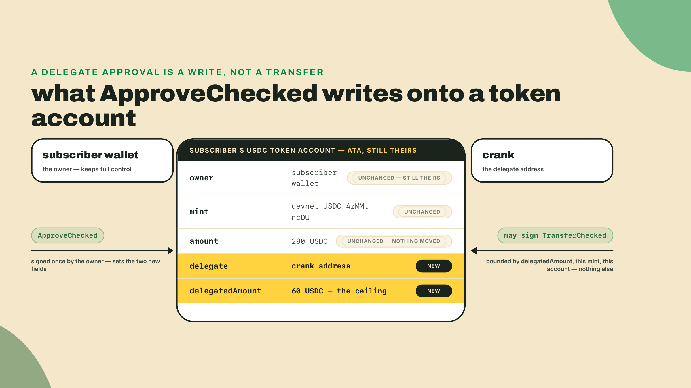
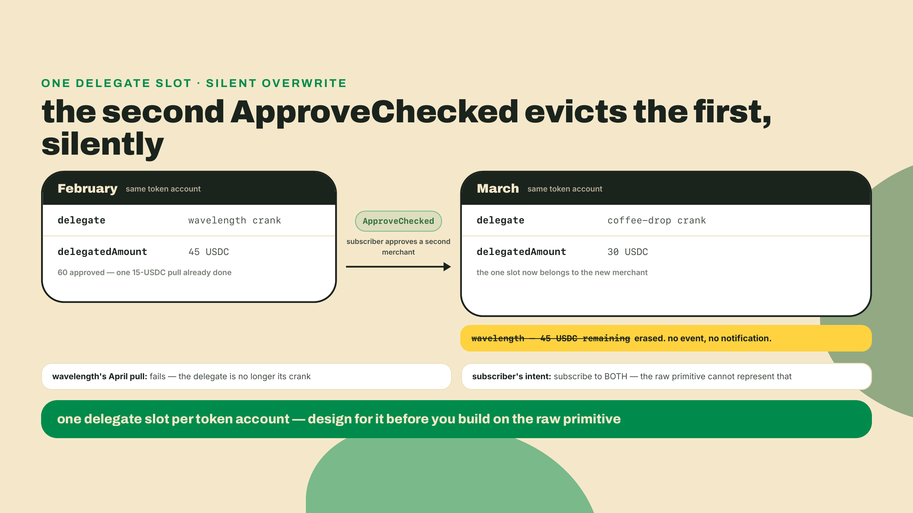
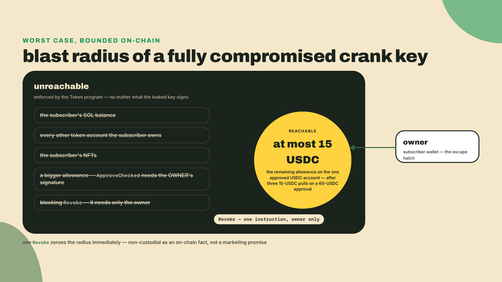
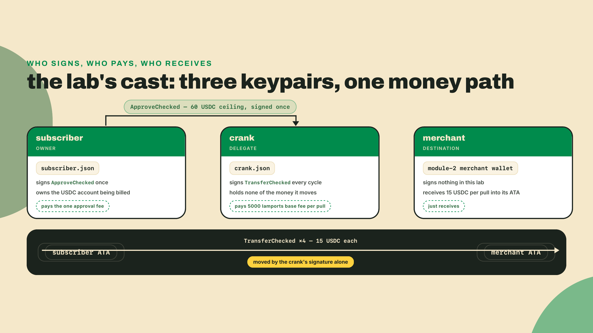
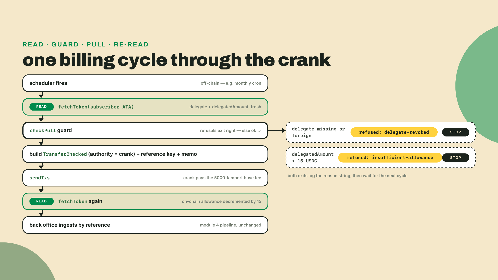

# The delegate primitive: approve once, pull on schedule

Module 4 closed with a back office that verifies payments server-side, ingests webhooks idempotently, reconciles by reference key, and issues refunds as push payments. Wavelength can take money and account for it, end to end. What it cannot do is take money AGAIN next month. Every payment so far started with the customer doing something: scanning a QR, approving a transaction, signing. A record-of-the-month club needs the opposite: the customer signs once in January and the shop gets paid in February, March, and April while they sleep.

Stripe solves this by storing a card and charging it on a schedule. On Solana there is no card on file and no custody: so how does a merchant pull 15 USDC from a customer next month without holding their keys or their money? The answer is a delegate approval, and it comes with one brutal constraint that shapes the entire rest of this module.

Start the workspace now so the install runs while you read. This is a sibling of transfer-kit, inside the same npm workspace root you have used since module 2:

```bash
mkdir club-crank && cd club-crank
npm init -y
npm pkg set type=module
npm i @solana/kit@6.10.0 @solana-program/token@0.14.0 @solana-program/memo@0.11.2
npm i -D tsx typescript
```

Then hop up to the `wavelength` root and add the new folder to the workspace roster you extended in module 4, which is what lets the scripts below `import { resolveAta } from 'transfer-kit'` by name:

```bash
cd ~/wavelength
npm pkg set --json workspaces='["transfer-kit","verifier","backoffice","backoffice-refunds","club-crank"]'
npm pkg set type="module"
npm install
```

Pins, with their freshness note: the workspace stays on the kit v6 line the whole course runs on, and `@solana-program/token` 0.14.0 is the last release of that client peering kit v6 (its peer range is `^6.5.0`, checked on npm 2026-08-22; 0.15.0 jumped to kit `^7` and 0.16.0, which is what `latest` resolves to today, has already jumped again to `^8`, so installing npm-latest breaks this workspace outright). Same story for the memo client: 0.11.2 is the newest that peers kit `^6.4.0`, and the 0.12+ line requires kit v7 or newer. Next lesson makes this v6/v7 split a topic in its own right, because the official Subscriptions client sits on the far side of it; today it is one line of pin discipline. `tsx` runs TypeScript directly, as everywhere in this course.

While npm works, here is the one-sentence map: this lesson is the raw SPL Token spend permission, the smallest possible non-custodial subscription, and its one hard limit is exactly what the official Subscriptions program exists to fix next lesson.

## Summary

- `ApproveChecked` sets a delegate on a token account: an address allowed to move up to an approved amount of a specific mint, with the decimals stated so a wrong assumption fails loudly. The owner keeps ownership and can `Revoke` at any time, unilaterally, with one instruction.
- Each token account has exactly ONE active delegate slot. Approving a new delegate automatically revokes the previous one. No per-delegate ledger, no pause state, no queue. This single rule is the design constraint the whole module orbits.
- The approved amount is a running balance, not a cap that resets. Every delegate-signed transfer decrements it, and the transfer that lands it on exactly zero also clears the delegate slot: a 60-USDC approval covers four 15-USDC pulls, and the fifth finds no delegate on the account at all.
- A backend "crank" holding the delegate keypair signs `TransferChecked` to pull funds on schedule. The subscriber signs nothing after the initial approval. The crank pays the 5000-lamport base fee per pull; the subscriber's per-cycle cost is zero signatures and zero fees.
- The delegate can move only up-to-the-approved-amount of the approved mint from that one account. That bound is enforced by the Token program on-chain, not by the crank's goodwill. This is the honest answer to "can you drain my wallet?": no, and not because we promise.
- Before every pull, re-read the account. The delegate may no longer be you, the allowance may be lower than your database thinks, and the on-chain state is the only ledger that matters.

The scaffold contract, stated out loud: the crank's pull path ships as a worked scaffold, complete and runnable. The guard that decides whether a pull is allowed ships as three TODOs, and filling them is the completion rung; the answers are derived, in plain sight, in the theory below. Detecting the competing-delegate eviction is the solo rung, yours alone.

## A spend permission, not a stored card

### What the owner actually signs

When a Stripe customer saves a card, they hand over a credential. Whoever holds it decides how much to charge and how often; the limits live in Stripe's database and in dispute law. When a Wavelength subscriber signs up for the record club, they sign one instruction:

```ts
getApproveCheckedInstruction({
  source: subscriberAta,   // THEIR token account, which they keep owning
  mint: USDC_DEVNET,       // the only token this permission touches
  delegate: CRANK,         // the address allowed to pull
  owner: subscriber,       // the owner signs; nobody else can grant this
  amount: toBaseUnits('60', DECIMALS), // the hard ceiling, in base units
  decimals: DECIMALS,      // stated so a decimals mismatch fails the ix
})
```

Read that as a sentence: "this address may move at most 60 USDC out of this one account of mine." Not "may manage my wallet." Not "may charge my account." May move, at most, that amount, of that mint, from that account. The `Checked` suffix is the same discipline you have used since module 2: the instruction carries the mint and decimals, so if anything disagrees about what a base unit means, the transaction fails instead of moving the wrong magnitude.

After this lands, the subscriber's token account carries three facts it did not carry before: a `delegate` address, a `delegatedAmount`, and nothing else. No plan name, no billing cadence, no metadata. The Token program stores a number and an address, and everything a "subscription" means beyond that is your problem, off-chain. Hold that thought; the bill for it comes due at the end of the lesson.



The exit is even smaller. `Revoke` takes the source account and the owner's signature, clears both fields, and needs nobody's permission:

```ts
getRevokeInstruction({ source: subscriberAta, owner: subscriber })
```

One instruction, base fee only. Compare that with cancelling a gym membership sometime.

### One slot, and the eviction rule

Now the constraint. Each token account has exactly one active delegate slot. Not one per merchant, not a list. One. When the owner signs a new `ApproveChecked`, the program overwrites the slot: new delegate, new amount, and the previous delegate is gone. Not paused, not queued behind the new one. Gone, silently, without any notification to the merchant who just lost it.

Play the tape forward. Your subscriber loves the record club. In March they also subscribe to, say, a coffee drop that runs the same raw-delegate design on the same USDC account. The moment their wallet signs the coffee shop's `ApproveChecked`, your crank's approval stops existing. Your April pull fails. Nobody did anything wrong: the subscriber consented to both merchants, both merchants wrote correct code, and the primitive simply cannot hold two live permissions on one token account.



This is why the lesson keeps saying "the raw primitive." One live subscription per (user, mint) is a real product ceiling, and no amount of clever backend code lifts it, because the ceiling is in the account layout itself. What backend code CAN do is detect the eviction honestly instead of erroring blindly, and that is your solo challenge today. Lifting the ceiling takes a program that occupies the slot once and multiplexes real billing arrangements behind it, which is precisely next lesson.

### The allowance only goes down

The second thing Stripe-trained intuition gets wrong: the approved amount is not a monthly limit and does not reset on the first of the month. It is a tank of fuel, filled once by the owner's signature, drained by every delegate transfer, refillable only by another owner signature.

The record club charges 15 USDC per cycle. The subscriber approved 60. So:


Four pulls and the tank is dry, and the tank takes the tap with it. The Token program decrements `delegatedAmount` inside the delegate-signed transfer, and when that subtraction lands on exactly zero it sets the account's `delegate` back to none in the same instruction, which is the `null` your guard reads next cycle: exhausting an approval also clears it. So the fifth transaction does not fail on an empty allowance; it fails because the account has no delegate any more, which makes the crank's signature just some stranger's signature, and the Token program says so with `OwnerMismatch`, custom program error `0x4`. `InsufficientFunds`, custom program error `0x1`, is the neighboring case: an allowance too small for this pull but not yet zero, say 10 remaining against a 15-USDC charge, where the slot is still yours. Either way the account still holds plenty of USDC; the permission to move it is what is spent. There is nothing the crank can do about it except ask the subscriber to sign again. This reads as an inconvenience and is actually a feature: the subscriber pre-consented to a bounded total, and the bound is doing its job. A 60-USDC approval is four months of the club, a natural re-consent cadence. You could ask for 600 up front and pull for years; some products will, and their churned users will discover a live allowance they forgot. Where you set the ceiling is a product decision the chain will not make for you. The chain only enforces whatever number the owner signed.

One consequence worth pricing out: after the initial approval, the subscriber's cost per cycle is zero. No signature, no fee, nothing to remember. The crank pays the 5000-lamport base fee per pull, which at any plausible SOL price is a rounding error against a 15-USDC subscription. Compare that with the 2 to 3 percent a card network takes from every renewal, and you see why this shape is worth the trouble.

### The crank: same transfer, different signer

"Crank" is Solana slang worth owning: a permissionless-ish process that turns the handle on schedule, doing work the chain will not do by itself. Solana has no native cron; nothing on-chain fires on the first of the month. Something off-chain must wake up, decide a pull is due, and submit it. Ours is a backend script on a scheduler.

Here is the part that should feel almost anticlimactic. The pull is a `TransferChecked`, the exact instruction transfer-kit has built since module 2, with one field different:

```ts
getTransferCheckedInstruction({
  source: subscriberAta,      // the subscriber's account, as always
  mint: USDC_DEVNET,
  destination: merchantAta,
  authority: crank,           // the DELEGATE signs, not the owner
  amount: toBaseUnits('15', DECIMALS),
  decimals: DECIMALS,
})
```

The `authority` field has always meant "whoever has the right to move these funds." Until today that was the owner. The Token program checks: is the signer the owner? No. Is the signer the account's delegate, and is the amount within `delegatedAmount`? Yes: transfer, then decrement the allowance, atomically, in the same instruction. There is no separate bookkeeping step to forget. The decrement IS the transfer's side effect.

Because it is the same instruction shape, everything module 3 and 4 taught keeps working unchanged. The crank attaches a fresh reference key so the back office can reconcile the pull into the orders ledger, and a memo so the charge names itself on-chain. Your webhook ingester from module 4 will see this pull like any other payment. Recurring revenue drops into the pipeline you already built, which is the payoff for building it in this order.

The crank's real job, then, is not the transfer but the paragraph before it: deciding whether pulling is still legitimate. I will confess the mistake so you can skip it: the first crank I wired cached the approval state at signup, because why would it change? A test wallet re-approved a different delegate mid-cycle, my crank submitted anyway, and I spent an evening staring at a custom program error 0x4 in a transaction log before the obvious sank in. The account state is the ledger. Your database is a cache with opinions. So the crank re-reads the token account every single cycle, before every pull, and answers three questions:


Could the crank skip the guard and just submit, letting the chain reject bad pulls? Mechanically yes, and the funds would be exactly as safe: the Token program enforces everything the guard checks. The guard exists because "transaction failed: custom program error 0x4" and "this subscriber revoked us, mark the subscription lapsed" are different facts to a billing system, and only one of them tells your back office what to do next. The chain gives you a no. The guard gives you the reason, before you spend a fee learning it. Those reason strings, `delegate-revoked` and `insufficient-allowance`, are the raw primitive's vocabulary, and the next two lessons keep the two names meaningful one layer down: the official program's guard adds its own reasons on top, and the continuity note in the next lesson's challenge walks the mapping explicitly.

### What the delegate can never do

Run the subscriber's worst-case scenario honestly, because a customer will ask, and "trust us" is a Stripe answer, not a Solana answer.

Suppose Wavelength turns evil, or more realistically, the crank keypair leaks. What can the holder do? Sign `TransferChecked` against the subscriber's USDC account, up to the remaining allowance. If three pulls already happened, that is at most 15 USDC. What can it do to the subscriber's SOL? Nothing; the delegate is on one token account. Their other SPL balances and their NFTs live in different accounts entirely, each with its own untouched delegate slot. Can it approve itself a bigger allowance? No: `ApproveChecked` requires the owner's signature. Can it block the subscriber from revoking? No: `Revoke` requires only the owner. The blast radius of a fully compromised crank is the unspent allowance on exactly the accounts that approved it, and every one of those owners can zero it out unilaterally the moment the compromise is announced.



That is the non-custodial promise, stated without romance: not that the merchant is honest, but that the merchant's honesty is not load-bearing. The bound lives in the Token program, the same audited code path that has settled every SPL transfer this course has made. You did not deploy a program today, and that is the point: there is no new contract for a subscriber to audit. The permission they grant is enforced by code they already trust by holding the token at all.

The ecosystem has noticed this shape. When Superteam ran its Solana Native "Subscriptions and Allowances" bounty topic in June 2026, dozens of demo repos converged on exactly this raw delegate primitive, approve-then-crank, as the default answer for non-custodial recurring revenue. You are not learning a curiosity; you are learning the pattern the ecosystem is standardizing around, one lesson before you meet the program that productionizes it.

## Lab: bill the record-of-the-month club

The club: 15 devnet USDC per cycle, approved at 60, so the ledger tells the whole story in four pulls and one refusal. You will play both sides, subscriber and merchant, with two keypairs.



1. **Keypairs and funding.** In the `club-crank` workspace, mint two identities. The install from the top of the lesson should be done by now.

   ```bash
   solana-keygen new --no-bip39-passphrase -o crank.json
   solana-keygen new --no-bip39-passphrase -o subscriber.json
   solana airdrop 1 $(solana-keygen pubkey crank.json) --url devnet
   solana airdrop 1 $(solana-keygen pubkey subscriber.json) --url devnet
   ```

   The subscriber also needs devnet USDC to be billed against, and this is worth a paragraph of arithmetic rather than a number, because devnet USDC is the one resource this course cannot conjure. Send it from your merchant wallet with transfer-kit's `pay` script, the exact flow from module 2 lesson 1's lab (which also creates the subscriber's ATA, and charges you the 165-byte rent-exempt minimum once — the number module 2 had you curl rather than memorize):

   ```bash
   npm run --workspace transfer-kit pay -- $(solana-keygen pubkey subscriber.json) 60
   ```

   Sixty is not decoration: this lesson's plan approves 60 USDC and pulls 15 per cycle, so 60 is exactly four cycles, and the fifth pull finding an empty delegate slot is the lesson's punchline. Your merchant wallet almost certainly does not hold 60 devnet USDC right now. Circle's faucet drips a small allowance per visit and rate-limits repeat visits, so getting to 60 means several visits spread across the day. Two honest ways through, pick one before you continue:

   - **Drip and wait.** Visit faucet.circle.com whenever the cooldown lets you, until `spl-token balance 4zMMC9srt5Ri5X14GAgXhaHii3GnPAEERYPJgZJDncDU --url devnet` clears 60, then send it on. Highest fidelity to the numbers printed below, slowest.
   - **Scale the plan down.** Divide every USDC figure in this lesson by ten: approve `6` instead of `60`, set `PLAN = '1.5'` instead of `'15'`, fund the subscriber with 6. The allowance arithmetic is identical — four pulls exhaust it, the fifth finds no delegate — and every checkpoint below reads the same story at one tenth the scale. This is the path I would take on a fresh devnet wallet, and the only cost is that the log lines print smaller numbers than mine.

   If the SOL airdrops rate-limit, wait a minute and retry; you need SOL on both keypairs because the subscriber pays the approval fee and the crank pays every pull fee.

   Checkpoint: `solana balance $(solana-keygen pubkey subscriber.json) --url devnet` prints about 1 SOL, the same for the crank, and the subscriber's USDC balance reads whichever figure you chose above. Nothing later in the lab works without all three.

2. **The guard, as a completion scaffold.** Create `crank/guard.ts`. This is pure logic, no network, which is exactly what makes it testable offline before any devnet money moves:

   ```ts
   // crank/guard.ts: the decision the crank makes before every pull.

   export type PullDecision =
     | { ok: true; pullBase: bigint; remainingAfter: bigint }
     | { ok: false; reason: 'delegate-revoked' | 'insufficient-allowance' };

   export function checkPull(input: {
     /** delegate currently set on the subscriber's token account, or null if none */
     delegate: string | null;
     /** remaining approved amount on the account, in base units */
     delegatedAmount: bigint;
     /** the crank's own address */
     crank: string;
     /** this cycle's pull, in base units */
     pullBase: bigint;
   }): PullDecision {
     // TODO 1: if no delegate is set, or the delegate is not our crank,
     //         refuse with reason 'delegate-revoked'.
     // TODO 2: if pullBase exceeds delegatedAmount, refuse with
     //         reason 'insufficient-allowance'.
     // TODO 3: otherwise return ok with pullBase and the decremented
     //         remainingAfter the pull will leave on-chain.
     throw new Error('TODO: implement the guard');
   }
   ```

   Every input is a `bigint` in base units because module 2's rule has not expired: amounts are exact integers, floats never touch money. The three TODOs are the three rows of the decision table above. Checkpoint: nothing to run yet, and that is the expected result. The file exists, exports one function, and that function throws until you fill it in the Challenge.

3. **The test that judges you.** Create `crank/guard.test.ts`. It runs the worked 60/15 arithmetic and the two refusal cases, entirely offline:

   ```ts
   // crank/guard.test.ts: offline proof the guard behaves before devnet money moves.
   import { checkPull } from './guard';

   const CRANK = 'CrankAddr1111111111111111111111111111111111';
   const OTHER = 'OtherAddr1111111111111111111111111111111111';
   const PULL = 15_000_000n; // 15 USDC at 6 decimals

   let failures = 0;
   function expectCase(name: string, pass: boolean) {
     if (!pass) {
       failures += 1;
       console.error(`FAIL: ${name}`);
     }
   }

   // 1. Fresh 60-USDC approval: four pulls succeed, 60 -> 45 -> 30 -> 15 -> 0.
   let allowance = 60_000_000n;
   for (let cycle = 1; cycle <= 4; cycle += 1) {
     const d = checkPull({ delegate: CRANK, delegatedAmount: allowance, crank: CRANK, pullBase: PULL });
     expectCase(`cycle ${cycle} pulls`, d.ok);
     if (d.ok) allowance = d.remainingAfter;
   }
   expectCase('allowance exhausted after four pulls', allowance === 0n);

   // 2. Two histories, one account state. The fourth pull zeroed the allowance and the
   //    Token program cleared the delegate in the same instruction; an owner running
   //    Revoke empties the same slot by hand. Cycle five reads null either way and is
   //    refused BEFORE submission. The account cannot tell you which happened, so
   //    "cancelled" versus "tank empty, ask for a renewal" is your ledger's call, not
   //    the chain's.
   const emptySlot = checkPull({ delegate: null, delegatedAmount: allowance, crank: CRANK, pullBase: PULL });
   expectCase('empty delegate slot rejected', !emptySlot.ok && emptySlot.reason === 'delegate-revoked');

   // 3. A partial allowance never over-pulls: 10 remaining cannot cover 15. Non-zero
   //    means the delegate is still set, so this is the other refusal reason.
   const partial = checkPull({ delegate: CRANK, delegatedAmount: 10_000_000n, crank: CRANK, pullBase: PULL });
   expectCase('over-pull on partial allowance rejected', !partial.ok && partial.reason === 'insufficient-allowance');

   // 4. Owner approved a competing delegate: the slot holds someone else, and their
   //    60 USDC is not yours to spend.
   const evicted = checkPull({ delegate: OTHER, delegatedAmount: 60_000_000n, crank: CRANK, pullBase: PULL });
   expectCase('evicted crank rejected', !evicted.ok && evicted.reason === 'delegate-revoked');

   // 5. Both refusals are true at once: evicted, and what the new delegate holds would
   //    not have covered this cycle anyway. Identity is checked before amount, so the
   //    reason must be delegate-revoked. Your back office routes on these strings, so
   //    the order the guard tests them in is part of the contract.
   const superseded = checkPull({ delegate: OTHER, delegatedAmount: 5_000_000n, crank: CRANK, pullBase: PULL });
   expectCase('eviction outranks a short allowance', !superseded.ok && superseded.reason === 'delegate-revoked');

   if (failures > 0) {
     console.error(`guard: ${failures} case(s) failed`);
     process.exit(1);
   }
   console.log('guard: all crank cases passed (over-pull and revoked-delegate rejected)');
   ```

   Run it: `npx tsx crank/guard.test.ts`. Checkpoint: it dies on `TODO: implement the guard`. Correct. That failure is the seam between the scaffold and your completion work; you will close it in the Challenge, and the lesson's verify gate is this test printing its final line.

4. **Shared plumbing.** Create `crank/send.ts`, the kit send pipeline you have written variants of since module 2, plus a keypair loader for the CLI-generated files:

   ```ts
   // crank/send.ts: load a CLI keypair, send a list of instructions on devnet.
   import { readFileSync } from 'node:fs';
   import {
     appendTransactionMessageInstructions,
     assertIsTransactionWithBlockhashLifetime,
     createKeyPairSignerFromBytes,
     createSolanaRpc,
     createSolanaRpcSubscriptions,
     createTransactionMessage,
     getSignatureFromTransaction,
     pipe,
     sendAndConfirmTransactionFactory,
     setTransactionMessageFeePayerSigner,
     setTransactionMessageLifetimeUsingBlockhash,
     signTransactionMessageWithSigners,
     type Instruction,
     type KeyPairSigner,
   } from '@solana/kit';

   export const rpc = createSolanaRpc('https://api.devnet.solana.com');
   const rpcSubscriptions = createSolanaRpcSubscriptions('wss://api.devnet.solana.com');

   export async function loadSigner(path: string): Promise<KeyPairSigner> {
     const bytes = new Uint8Array(JSON.parse(readFileSync(path, 'utf8')));
     return createKeyPairSignerFromBytes(bytes);
   }

   export async function sendIxs(
     feePayer: KeyPairSigner,
     ixs: Instruction[],
   ): Promise<string> {
     const { value: latestBlockhash } = await rpc.getLatestBlockhash().send();
     const tx = await pipe(
       createTransactionMessage({ version: 0 }),
       (m) => setTransactionMessageFeePayerSigner(feePayer, m),
       (m) => setTransactionMessageLifetimeUsingBlockhash(latestBlockhash, m),
       (m) => appendTransactionMessageInstructions(ixs, m),
       (m) => signTransactionMessageWithSigners(m),
     );
     assertIsTransactionWithBlockhashLifetime(tx);
     await sendAndConfirmTransactionFactory({ rpc, rpcSubscriptions })(tx, {
       commitment: 'confirmed',
     });
     return getSignatureFromTransaction(tx);
   }
   ```

   Checkpoint: `npx tsx crank/send.ts` prints nothing and exits cleanly. This module only exports; if it throws on import, an install went wrong, so re-check the pins from the top of the lesson before you write another line.

5. **The approval: the subscriber signs up.** Create `crank/approve.ts`. This is the only thing the subscriber ever runs:

   ```ts
   // crank/approve.ts: the SUBSCRIBER runs this once. It is the whole sign-up flow.
   import { address } from '@solana/kit';
   import { getApproveCheckedInstruction, TOKEN_PROGRAM_ADDRESS } from '@solana-program/token';
   import { resolveAta, toBaseUnits } from 'transfer-kit';
   import { loadSigner, sendIxs } from './send';

   const USDC_DEVNET = address('4zMMC9srt5Ri5X14GAgXhaHii3GnPAEERYPJgZJDncDU');
   const DECIMALS = 6;
   const CRANK = address(process.env.CRANK_ADDRESS ?? '');

   async function main() {
     const subscriber = await loadSigner(process.env.SUBSCRIBER_KEYPAIR ?? 'subscriber.json');
     // Third seed, the owning token program, required since the roster lesson.
     // Devnet USDC is a classic Token mint, so it is static here.
     const subscriberAta = await resolveAta(subscriber.address, USDC_DEVNET, TOKEN_PROGRAM_ADDRESS);

     const approveIx = getApproveCheckedInstruction({
       source: subscriberAta,
       mint: USDC_DEVNET,
       delegate: CRANK,
       owner: subscriber,
       amount: toBaseUnits('60', DECIMALS), // four months of the 15-USDC plan
       decimals: DECIMALS,
     });

     const signature = await sendIxs(subscriber, [approveIx]);
     console.log(`approved: delegate=${CRANK} allowance=60 USDC sig=${signature}`);
   }

   main().catch((e) => {
     console.error(e);
     process.exit(1);
   });
   ```

   Run it with the crank's address in the environment:

   ```bash
   CRANK_ADDRESS=$(solana-keygen pubkey crank.json) npx tsx crank/approve.ts
   ```

   Checkpoint: one `approved:` line with a signature. Look the transaction up in an explorer on devnet and read the parsed `ApproveChecked`: source, delegate, 60 USDC. That is the subscriber's entire contractual footprint.

6. **The pull: the merchant's scheduled cycle.** Create `crank/pull.ts`, the worked scaffold this lesson hands you whole. It reads, guards, pulls, and re-reads:

   ```ts
   // crank/pull.ts: the MERCHANT backend runs this once per billing cycle.
   import {
     AccountRole,
     address,
     generateKeyPairSigner,
     unwrapOption,
     type Instruction,
   } from '@solana/kit';
   import {
     fetchToken,
     getTransferCheckedInstruction,
     TOKEN_PROGRAM_ADDRESS,
   } from '@solana-program/token';
   import { getAddMemoInstruction } from '@solana-program/memo';
   import { fromBaseUnits, resolveAta, toBaseUnits } from 'transfer-kit';
   import { checkPull } from './guard';
   import { loadSigner, rpc, sendIxs } from './send';

   const USDC_DEVNET = address('4zMMC9srt5Ri5X14GAgXhaHii3GnPAEERYPJgZJDncDU');
   const DECIMALS = 6;
   const PLAN = '15'; // USDC per cycle
   const SUBSCRIBER = address(process.env.SUBSCRIBER_ADDRESS ?? '');
   const MERCHANT = address(process.env.MERCHANT_ADDRESS ?? '');

   async function main() {
     const crank = await loadSigner(process.env.CRANK_KEYPAIR ?? 'crank.json');
     const subscriberAta = await resolveAta(SUBSCRIBER, USDC_DEVNET, TOKEN_PROGRAM_ADDRESS);
     const merchantAta = await resolveAta(MERCHANT, USDC_DEVNET, TOKEN_PROGRAM_ADDRESS);

     // 1. Read the account. Never pull on a cached view of the delegate slot.
     const tokenAccount = await fetchToken(rpc, subscriberAta);
     const delegate = unwrapOption(tokenAccount.data.delegate);
     const delegatedAmount = tokenAccount.data.delegatedAmount;

     // 2. Guard. The chain would reject a bad pull anyway; the guard names WHY first.
     const decision = checkPull({
       delegate,
       delegatedAmount,
       crank: crank.address,
       pullBase: toBaseUnits(PLAN, DECIMALS),
     });
     if (!decision.ok) {
       console.log(`refused: ${decision.reason}`);
       process.exit(1);
     }

     // 3. Build the pull: TransferChecked signed by the CRANK, not the owner,
     //    with a fresh reference key and a memo, the same shape transfer-kit taught.
     const reference = (await generateKeyPairSigner()).address;
     const transferIx = getTransferCheckedInstruction({
       source: subscriberAta,
       mint: USDC_DEVNET,
       destination: merchantAta,
       authority: crank, // the delegate signs; the subscriber signs nothing today
       amount: decision.pullBase,
       decimals: DECIMALS,
     });
     const transferWithReference: Instruction = {
       ...transferIx,
       accounts: [...transferIx.accounts, { address: reference, role: AccountRole.READONLY }],
     };
     const memoIx = getAddMemoInstruction({ memo: 'WVL-CLUB cycle pull' });

     const signature = await sendIxs(crank, [transferWithReference, memoIx]);

     // 4. Re-read: the on-chain allowance is the ledger, our math is a preview.
     const after = await fetchToken(rpc, subscriberAta);
     console.log(`pulled ${PLAN} USDC sig=${signature} ref=${reference}`);
     console.log(
       `allowance remaining: ${fromBaseUnits(after.data.delegatedAmount, DECIMALS)} USDC (expected ${fromBaseUnits(decision.remainingAfter, DECIMALS)})`,
     );
   }

   main().catch((e) => {
     console.error(e);
     process.exit(1);
   });
   ```

   Three details in there earn their lines. `fetchToken` decodes the raw account into typed fields, and `delegate` comes back as an option you unwrap to an address or null: null and "someone else" are different refusal stories, and your guard tells them apart. The reference key is a freshly generated address appended to the transfer's account list as a readonly meta, the same reconciliation trick your checkout has used since module 3, so the m04 back office can find this pull by reference like any sale. And the crank is the fee payer: recurring revenue costs the merchant 5000 lamports per cycle in base fees.

   The interesting decision is what is NOT here: transfer-kit's `sendStablecoin` is absent, on purpose, because that function signs as the owner of the source account, and today the whole point is that the owner is asleep. The crank borrows the kit's helpers (`resolveAta`, `toBaseUnits`, `fromBaseUnits`) and rebuilds the send with `authority: crank`. When one line's difference forces a new function, that line is the lesson.

   You cannot run `pull.ts` to success yet; its guard still throws. That ordering is deliberate. Go fill the TODOs.



## Challenge

**Worked.** Done above: the approval landed, the crank scaffold exists, and `npx tsx crank/guard.test.ts` fails on the named TODO. If it fails on anything else, an import path or a typo is lying to you; fix that first.

**Completion.** Fill the guard's three TODOs from the decision table: refuse `delegate-revoked` when the slot is empty or holds a foreign address, refuse `insufficient-allowance` when the pull exceeds the remaining amount, otherwise return `ok` with the decremented `remainingAfter`. It is about a dozen lines. Acceptance, in two stages. Offline first: `npx tsx crank/guard.test.ts` prints exactly `guard: all crank cases passed (over-pull and revoked-delegate rejected)`. Then the devnet ledger:

```bash
export SUBSCRIBER_ADDRESS=$(solana-keygen pubkey subscriber.json)
export MERCHANT_ADDRESS="<your module-2 merchant wallet>"
npx tsx crank/pull.ts   # allowance remaining: 45.000000
npx tsx crank/pull.ts   # allowance remaining: 30.000000
```

Two pulls, two signatures, and the printed remaining allowance stepping down 45 then 30 with the expected value agreeing. Now force the third refusal without waiting out the tank: temporarily set `PLAN` to `'45'` and run again. The guard must print `refused: insufficient-allowance` and, critically, no transaction appears on devnet; you refused before submission, no fee spent. Set `PLAN` back to `'15'`.

**Solo.** Detect the eviction. Run a second `ApproveChecked` from the subscriber approving a DIFFERENT address as delegate (generate a throwaway keypair to play the coffee shop). Your crank's next `pull.ts` run must not error blindly and must not just say "revoked": extend the pull path so that a delegate that is set-but-foreign (eviction) and a delegate that is absent (plain revoke) are recorded distinctly: keep the guard's two-reason type untouched, and in a small JSON state file next to the scripts write `{ "state": "delegate-revoked", "cause": "evicted" }` versus `"cause": "revoked"`, then skip the account on future cycles until a fresh approval to the crank appears. Acceptance: two consecutive pulls succeed and decrement; a third over-cap pull is rejected before submission; re-approving a different delegate flips the crank's stored state to `delegate-revoked`; and a fresh `ApproveChecked` back to the crank makes pulls resume. That receipt trail, two decrementing signatures, one reasoned refusal, one detected eviction, is this lesson's mastery gate. The ledger proves it; no quiz can.

If a pull fails with a custom program error `0x4` from the Token program, that is the on-chain spelling of "owner does not match," which for a delegate-signed transfer means the account's delegate slot does not hold your crank: either it was revoked, evicted, or emptied to zero by an earlier pull, or your guard read one account and your transfer targeted another, almost always a `SUBSCRIBER_ADDRESS` env var pointing at the wrong keypair.

One note for the feedback loop: this is the module where the course starts trusting you with scaffolds instead of finished files, and the guard TODOs are calibrated to the decision table above. If they took you more than twenty minutes, or the eviction detection felt under-specified, say so in the course feedback; how much scaffolding the next revision hands you is tuned by exactly these reports. The parts that fought you are the parts the next revision sharpens.

Step back and look at what you shipped: a merchant that bills a sleeping customer, cannot exceed a customer-signed ceiling, loses its permission the instant the customer changes their mind, and knows how to say why a pull refused. That is real recurring revenue with no custody anywhere, and two decrementing pulls on devnet prove the primitive works. Now the bill from earlier comes due. On-chain, this whole subscription is a number and an address: no plan name, no cadence, no expiry, no per-period reset, no record of why the delegate exists. Every one of those you rebuilt yourself, in a JSON file sitting next to the scripts, which is fine for one club and unserious at a thousand subscribers. The raw primitive is audited by construction, because it IS the Token program, but it models nothing; you either keep rebuilding billing semantics off-chain forever, or you move to a program that carries them on-chain. And there is a harder problem than metadata. Your subscriber can hold exactly one live delegate, so the moment they subscribe to a second merchant your crank is silently evicted, and you just watched it happen in the solo challenge. A primitive that punishes your customer for liking two products is not a billing system yet. Next lesson: the official Subscriptions program, which occupies that single slot once and makes one token account carry many billing arrangements.
