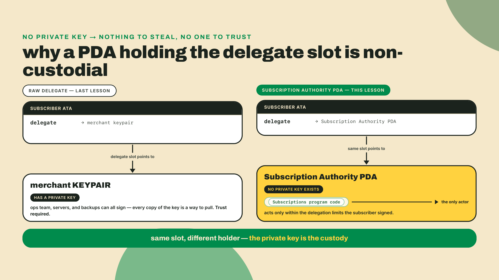
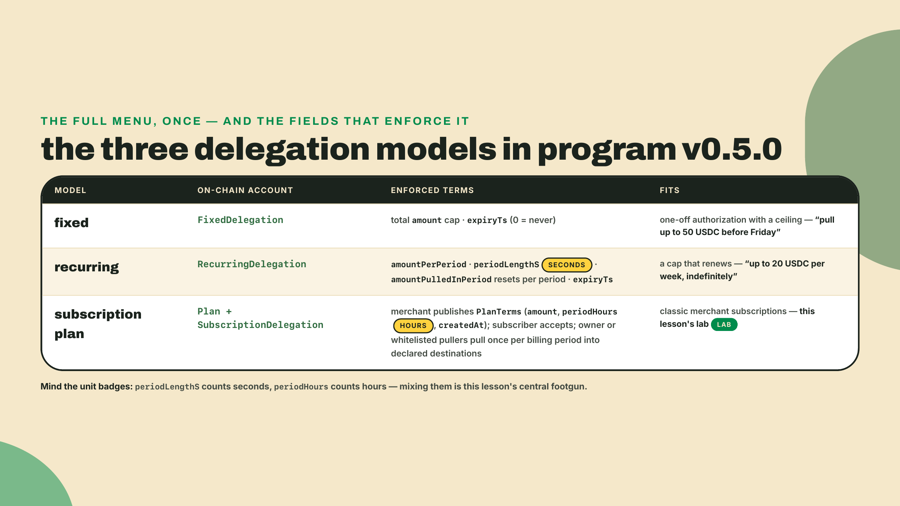
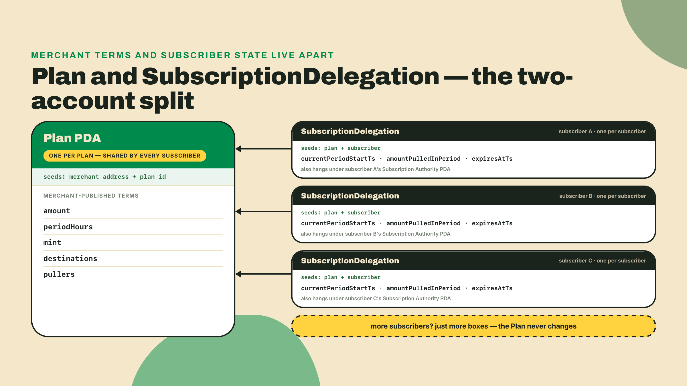
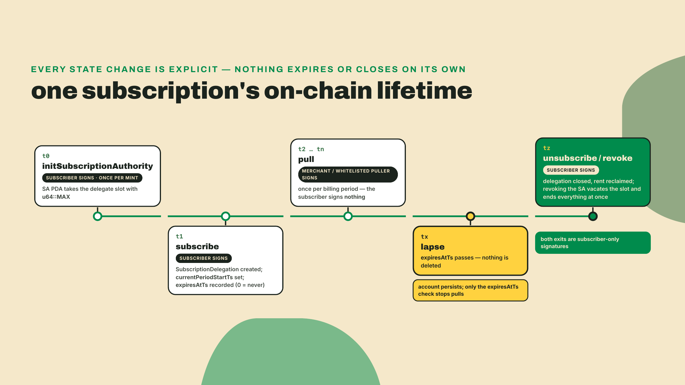
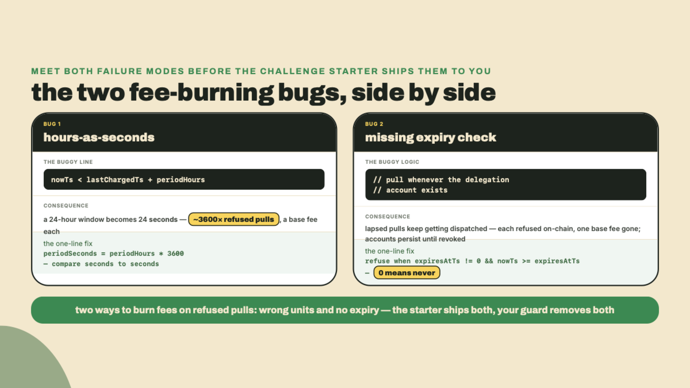
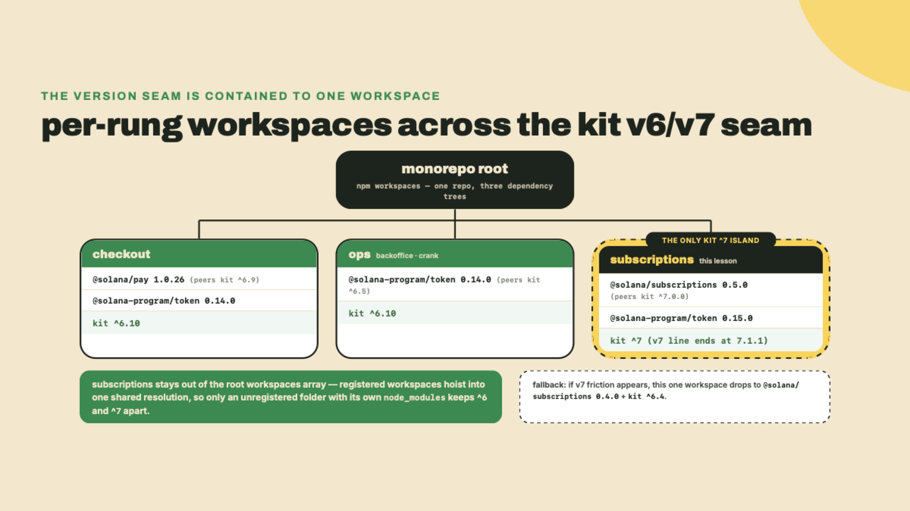
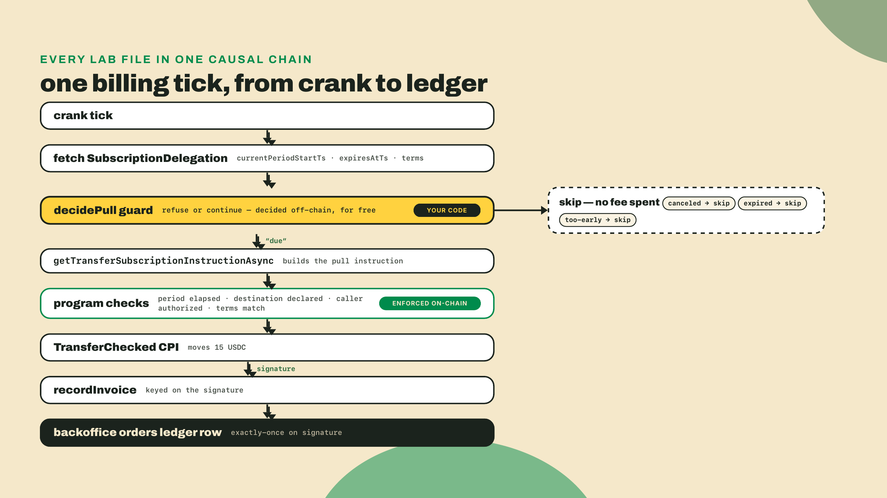
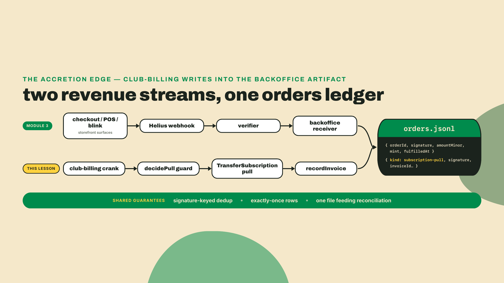
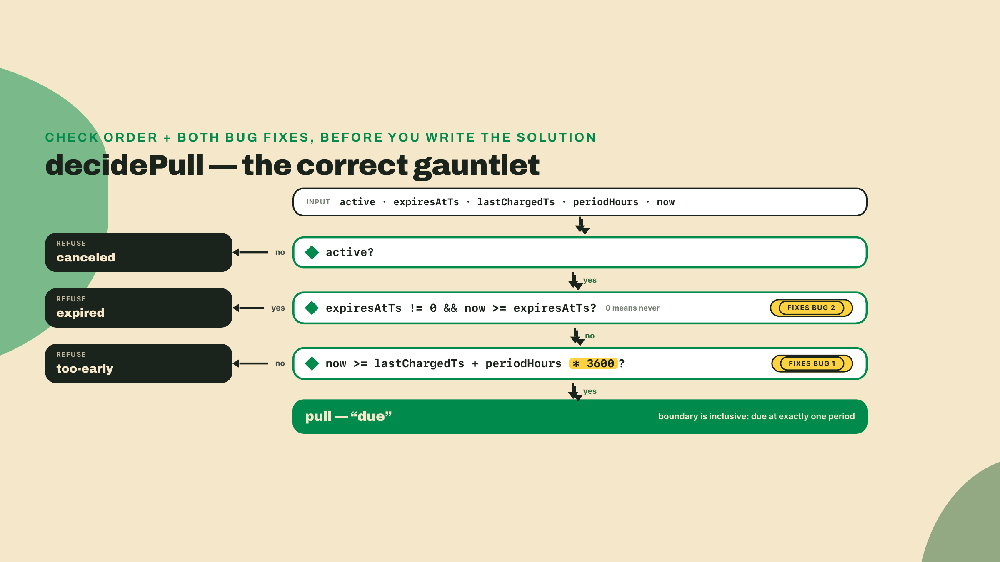

# The official Subscriptions program: plans, PDAs, and the kit-7 seam

## Summary

Last lesson you built the raw club-crank on a single delegate approval and hit its wall: one delegate slot per token account means one live subscription per user, and a second merchant's approval evicts you. Silently. This lesson replaces the raw approval with the Solana Foundation's Subscriptions program, whose entire reason to exist is that eviction.

Before any theory, prove this lesson's version seam to yourself. You have npm from the setup lesson; run this from anywhere:

```bash
npm view @solana/subscriptions@0.5.0 peerDependencies
```

You should see `{ '@solana/kit': '^7.0.0' }`. Now run `npm view @solana/pay peerDependencies` and look at its kit line: `^6.9.0`. Two packages this course depends on, two major versions of the same SDK, both correct. Hold that thought; we resolve it properly in the last theory section, and it costs you one extra workspace folder. The findings up front:

- The program lives at `De1egAFMkMWZSN5rYXRj9CAdheBamobVNubTsi9avR44` and its trick is one move: a Subscription Authority PDA per (user, mint) takes the single delegate slot ONCE with a u64::MAX approval, then per-plan delegation PDAs carry the real, enforced billing limits. One slot, as many subscriptions as the user wants.
- You ship **club-billing**: create Wavelength's record-of-the-month plan, subscribe a test user, pull one billing period, and land that pull as an invoice row in the exact backoffice orders ledger you built in the webhook lesson. One honesty note carried through the lab: the official pull carries no reference key and no memo, so billing truth is crank-written, keyed on the pull's signature, not reference-reconciled the way a checkout is; the dunning lesson attaches a reference to the invoice when settlement needs one.
- Two documented unit-and-clock bugs bite integrators in the wild, and neither is an exploit or a double-charge — the program refuses a mistimed or lapsed pull on-chain, so both bugs burn crank fees, not subscriber money. Plans measure their period in `periodHours` while everything you compare against is Unix seconds, and subscription accounts never close on their own, so `expiresAtTs` — not account existence — is the time-bound your guard must mirror.
- The client is `@solana/subscriptions` 0.5.0, and it peers `@solana/kit` ^7.0.0 while your checkout workspaces sit on kit ^6. That seam is real, it is the ecosystem's current state, and we handle it with a separate workspace pin, not a rewrite.

One more thing worth saying plainly. Version 0.5.0 of this program was deployed to mainnet on 2026-08-10, twelve days ago as I write this. That date is the v0.5.0 deploy, not the program's mainnet debut (earlier versions were live before it), but it still makes this the newest load-bearing thing in the course. You are learning it before most integration guides exist. Treat that as the job rather than a risk disclosure: payments engineers get paid for being early and correct at the same time.

## One slot, many subscriptions

### The 30-second PDA on-ramp

Back in the stablecoin module I told you the associated token account address is derived, not chosen, and I promised the full idea would cost you 30 seconds when you finally needed it. This is that moment.

A program-derived address (PDA) is an address computed from a program's own address plus some seeds, deliberately constructed so that it has NO private key. Not a lost key, not a locked-up key: no key exists, mathematically. Nobody can ever sign as that address. The only thing that can act as a PDA is the program that derives it, from inside its own code, under whatever rules that code enforces.

Read that again with your Stripe brain on, because this is the click the whole lesson turns on. When Wavelength's crank held the delegate slot directly last lesson, a keypair YOU controlled had pull rights, and the subscriber had to trust your ops. If a PDA holds the delegate slot instead, there is no merchant key to leak, no employee to go rogue, no server breach of yours that yields pull rights. One honest residue: the program's upgrade authority is still a key someone holds, so the trust moved off your ops and onto the program's owner rather than vanishing — a smaller, auditable surface, and the caveat to volunteer in a security review before someone else does. Past that residue, the only path to the subscriber's funds is the program's own logic, and the program's logic only moves funds inside limits the subscriber explicitly signed. That is what non-custodial billing means, and it rests on something concrete: the absence of a merchant-side private key.



### One unlimited approval, many bounded delegations

Here is the architecture, and it sounds backwards until you see why it is the only shape that fits.

The subscriber initializes a **Subscription Authority** (SA) PDA, one per (user, mint) pair. That PDA takes the token account's single delegate slot with an approval of u64::MAX. Unlimited. The number that would be terrifying on a merchant keypair is fine here, because the SA PDA is not a spender, it is a switchboard. It will never move a token on its own initiative; it has no initiative, and no key.

If the unlimited number still itches, map it onto something you have already shipped. A card on file with a payment processor is, mechanically, an unlimited charge authority: nothing in the card network stops a merchant from charging the wrong amount, and the real bound is policy, chargebacks, and eventually lawyers. Here the unbounded thing is keyless and inert, and the bounded thing is code that refuses. Same shape, opposite ordering of trust. I know which of the two I would rather walk a security review through.

The real limits live one layer down, in **delegation PDAs** created under that authority. Each delegation is a separate account carrying its own enforced terms, and the program refuses any pull that violates them. Three models ship in v0.5.0:



A quick tour of when each model earns its keep, because the lab uses only the third and the other two will show up in your product conversations within a week. **Fixed** is a bounded tab: pull up to 50 USDC before Friday, then the delegation is spent. It fits one-off authorizations with a ceiling, a trial that must not silently convert, a preorder that charges when the pressing ships. **Recurring** is an allowance that renews: up to 20 USDC per week, indefinitely or until expiry, with `amountPulledInPeriod` resetting each period. It fits usage-based billing where the amount varies but the cap must not, an API metered in dollars, a top-up wallet that refills itself. The **plan** model is the merchant-shaped one: terms published once on-chain, every subscriber accepts those exact terms, pulls land once per billing period into destinations the plan declared up front. Wavelength wants identical terms for every member and a public catalog it can point at, so the club is a plan. And if you ever catch yourself minting hundreds of near-identical plans to encode per-customer bespoke terms, stop; that is the job recurring delegations exist for.

Notice what this dissolves. Last lesson's wall was that approvals overwrite each other. Now the subscriber's slot is occupied exactly once, by their own authority PDA, and joining a second merchant's plan just creates another delegation account under it. Wavelength's pull rights survive the subscriber joining ten other clubs. Nobody evicts anybody, because nobody touches the slot again.

The plan model, which the lab uses, splits state across two accounts. The merchant creates a `Plan` PDA (seeded by merchant address plus a plan id) holding the terms: amount, `periodHours`, the mint, allowed pull destinations, a whitelist of pullers. The subscriber's acceptance creates a `SubscriptionDelegation` PDA (seeded by plan plus subscriber) tracking their individual state: `currentPeriodStartTs`, `amountPulledInPeriod`, `expiresAtTs`. Merchant state and subscriber state never share an account, which is why one plan scales to any number of subscribers without anyone rewriting anything.



And the enforcement is not advisory. Try to pull twice in a period and the program refuses with a period-not-elapsed error before a token moves. Try to pull to an address the plan never declared and you get an unauthorized-destination refusal. The limits you will implement in this lesson's crank guard are a courtesy layer that saves you fees and log noise; the program is the layer that saves the subscriber.

### The exit door, and what the subscriber traded for it

Non-custodial billing is only honest if leaving is as unilateral as joining. It is. The subscriber can unsubscribe from a plan, which closes their delegation account, and they can revoke the Subscription Authority itself, which vacates the delegate slot and ends every delegation under it in one move. No merchant signature appears anywhere in either path; the wallet that consented can withdraw consent alone, at any time. One precision about the rent those accounts hold, since it is easy to assume the exit refunds it: unsubscribing closes the delegation account and returns its rent to whoever paid for it, but revoking the Subscription Authority only vacates the delegate slot — it does not sweep the PDAs. Reclaiming those is a separate, merchant-run `RevokeAbandoned` call whose signer is the **recorded payer**, which is your wallet if you sponsored the subscribe. Next lesson builds that queue; today the point is that leaving is unilateral, not that it is self-cleaning. Compare that with the twenty-minute retention flow your last gym membership made you eat.

The trade-off, named, because last lesson's design had a virtue this one quietly retires. The raw 60 USDC approval ran dry after four pulls, and that exhaustion forced a natural re-consent conversation every four months. The SA's u64::MAX approval never runs dry. The subscriber's protection is no longer a shrinking number; it is the per-plan limits plus that unilateral exit. Mechanically that is a strictly better protection, and it still deserves this paragraph, because the dwindling allowance was doing quiet UX work in the raw design that nothing automatic replaces here: nobody gets re-asked by default. Surface active subscriptions in your product UI and make cancel one tap; the chain will not nag on your behalf.



### Who built it, and who already bets on it

Provenance matters more than usual when the thing is this new. The program was written by Moonsong Labs in Pinocchio, the zero-dependency Rust framework, and audited by Cantina. If the Pinocchio choice makes you curious about how a program gets built at that level, that curiosity belongs to the Master Anchor V2 course, which owns the framework layer; here we consume the program, we do not read its source.

The proof-of-production beat is better than an audit badge anyway: Helius runs its OWN subscription billing on this same Foundation Subscriptions program (their engineering blog, fetched 2026-08-21). When an infrastructure company whose product is uptime bills its customers through a program, that program has left demo territory. An audited program with a name-brand production tenant is a different bet from a week-old deploy taken on faith.

### Token-2022, consumed not taught

The plan's mint can be a Token-2022 mint, and two behaviors matter for billing. First, if the mint carries a transfer hook, the program forwards the hook's extra accounts into its TransferChecked CPI, so a pull composes with hook-gated tokens instead of dying on them; the client even ships a `resolveTransferHookAccounts` helper for the account resolution. Second, if a destination account has MemoTransfer enabled (it demands a memo on every incoming transfer), the pull is rejected atomically: no partial state, no stuck funds, the transaction just fails whole. The program also vets the mint's extension set when the authority is initialized and refuses combinations it cannot bill safely, so you find out at setup time, not at charge time.

That is everything we need to KNOW here. How the transfer-hook interface itself works, end to end, is the Digital Assets, Tokenization and Token Extensions course's territory. We are hook consumers, and consumers get to stay blissfully thin.

### The two clocks that mis-bill people

Now the footguns, because this program's two documented integration bugs are both time bugs, both wreck a billing run in their own way, and both will be sitting in your challenge starter on purpose.

**Bug one: hours are not seconds.** A `Plan` stores its cadence as `periodHours` (720 for Wavelength's monthly plan). A `RecurringDelegation` stores its cadence as `periodLengthS`, in seconds. Every timestamp you will ever compare against, `currentPeriodStartTs`, `expiresAtTs`, chain time, is Unix seconds. Compare `periodHours` directly against a seconds delta and your window shrinks by a factor of 3,600: your crank calls a 24-hour plan due again after 24 seconds. Note who saves the subscriber here — the program does, exactly as the enforcement section said: the early pull is refused with the period-not-elapsed error before a token moves. What the program cannot save is your wallet and your logs: every refused pull costs the crank a base fee and a log line, on every tick, forever, until you notice. The rule is boring and absolute: convert to seconds at the boundary, compare only seconds. 24 hours is 86,400 seconds, not 24.

**Bug two: nothing expires by itself.** Subscription and delegation accounts persist on-chain until an explicit revoke instruction closes them. A plan whose term ended last week still has a live delegation account sitting there, and if your crank only checks "does the delegation exist," it will keep dispatching pulls for that lapsed subscriber. Same division of labor as bug one: the program enforces the time-bound — a pull against a lapsed delegation is refused with its subscription-cancelled error before a token moves, so nobody gets charged — and what the existence-only crank buys itself is the same tax, a base fee and a log line per refused tick, forever. `expiresAtTs` against chain time is the check your guard mirrors on every tick, so the refusal happens in your process for free instead of on-chain for a fee. And its zero case bites in the other direction: `expiresAtTs` of 0 means "never expires," so a guard that naively compares `now >= expiresAtTs` treats every no-expiry subscription as expired at the epoch and refuses to bill anyone. Handle zero first, then compare.



### The kit seam: v6 checkout, v7 billing

Time to resolve the probe you ran in the first minute. What it surfaced is the industry's current state, so let's handle it like professionals: with dated facts and a pin.

The facts, re-verified against npm on 2026-08-22: kit's `latest` dist-tag points at 8.0.0 (published 2026-08-21); the v7 line ended at 7.1.1; the v6 line ended at 6.10.0. Version 7 is the ecosystem's peer standard right now: the July 2026 `@solana-program/*` client wave peers `^7.0.0` (that is `@solana-program/token` 0.15.0), and `@solana/subscriptions` 0.5.0 does too. Watch how fast the front of the pack moves, though: `@solana-program/token` 0.16.0 shipped on 2026-08-21, the same day as kit 8, and already peers `^8.0.0`. The laggards are equally real and load-bearing for us: `@solana/pay` 1.0.26 peers kit `^6.9.0`, which is exactly why your checkout workspaces were pinned to kit ^6.10 in the first place, and it is not alone down there — helius-sdk 3.1.0 peers the same `^6.9.0` range, so a shop that did reach for that SDK would land on the identical pin. Three kit majors, all shipping, all correct for someone. Install subscriptions into those workspaces and npm's peer resolver will refuse, correctly. Never pin to `latest` anywhere; these tags moved twice while this course was being written.

The unlock? A folder that deliberately stays OUT of the workspace roster. Registered npm workspaces are not isolation — they are the opposite: npm hoists every registered package into one shared root resolution, which is exactly the tree where kit 6 and kit 7 would meet and fight. So step 1 below creates `subscriptions/` as a standalone package and never adds it to the root `workspaces` array — a deliberate break from the register-everything habit module 4 taught you. It alone pins kit ^7 plus `@solana/subscriptions` 0.5.0, runs its own `npm install`, resolves from its own `node_modules`, and the peer ranges never meet. (Register it at the root and npm's resolver will try to reconcile both kit majors in one tree and refuse; the capstone walks into that exact ERESOLVE on purpose and shows you the escape hatch.) And if v7 friction shows up that you cannot clear, the documented fallback is a two-line pin edit in that one folder: `@solana/subscriptions` 0.4.0 with kit ^6.4. No structural change, no rewrite, one folder's `package.json`.



Is this annoying? Mildly. Is it unusual? Not even slightly: any Node shop that survived the ESM migration, or a React major, has run this exact play. SDK ecosystems move front-to-back, the flagship packages jump first, integrations lag, and the boundary lives in your lockfiles for a quarter or two. You are not working around a mistake; you are watching an ecosystem mid-stride, and the per-workspace pin is what competence looks like while it lands. Nor is it a rule this course invented: the Rust & TypeScript Fundamentals course drills it in its peer-ranges lesson and Master Anchor V2 drills it against a generated client's declared peers in its module eight — three courses, one rule.

## Lab: bill the record-of-the-month club

How the work splits here: the authority, plan, and subscribe calls are scaffolded and I walk them fully; the ledger-write step is yours to wire (completion); and the period-window guard is the standalone challenge after the lab (solo). By the ops module you will be building this category of integration with no scaffold at all, so watch what the scaffold does while you still have it.

**1. Create the workspace and pin the seam.** From the monorepo root:

```bash
mkdir -p subscriptions/keys
cd subscriptions
npm init -y
npm pkg set type=module
npm install @solana/subscriptions@0.5.0 @solana/kit@7.1.1 @solana-program/token@0.15.0
npm install -D typescript tsx @types/node
```

Pins verified 2026-08-22 and re-stamped 2026-09-05: `@solana/subscriptions` 0.5.0 is the stamped line for this package — pre-1.0 and moving, released 2026-08-10, peers kit ^7.0.0 — with 0.4.0 kept as a documented fallback only, never the pin you start from; 7.1.1 is the last release on kit's v7 line; `@solana-program/token` 0.15.0 is the token-client wave that peers ^7. That last pin is the one people get wrong: `latest` for the token client is 0.16.0, which peers kit ^8 and will not resolve here. Re-check all three with `npm view <pkg> dist-tags peerDependencies` before you install, because this corner of npm has moved twice this quarter. `tsx` runs TypeScript directly and `@types/node` gives you Node's types; you have used both since the checkout module, but this is a fresh workspace, so they get installed fresh.

You need two funded devnet keypairs in `keys/`: `merchant.json` (Wavelength) and `subscriber.json` (your test listener), with the subscriber holding some of the devnet USDC you have billed in since module 2. The crank lesson minted `subscriber.json` (copy it into `keys/`) but never had a merchant key, so create that one fresh: `solana-keygen new -o keys/merchant.json`, then airdrop and fund as usual.

**2. Shared config and a send helper.** Two small files you will recognize from every workspace so far. First `config.ts`:

```typescript
import { readFileSync } from "node:fs";
import {
  address,
  createKeyPairSignerFromBytes,
  createSolanaRpc,
  createSolanaRpcSubscriptions,
  sendAndConfirmTransactionFactory,
  type Address,
  type KeyPairSigner,
} from "@solana/kit";
import { TOKEN_PROGRAM_ADDRESS } from "@solana-program/token";

export const rpc = createSolanaRpc("https://api.devnet.solana.com");
export const rpcSubscriptions = createSolanaRpcSubscriptions(
  "wss://api.devnet.solana.com",
);
export const sendAndConfirm = sendAndConfirmTransactionFactory({
  rpc,
  rpcSubscriptions,
});

// The mint the club bills in: the same devnet USDC mint the crank lesson
// hardcoded (4zMM...ncDU), taken as an env var here so later lessons can
// re-point the club without code edits.
export const CLUB_MINT: Address = address(process.env.CLUB_MINT!);
export const CLUB_TOKEN_PROGRAM = TOKEN_PROGRAM_ADDRESS;

export async function loadSigner(path: string): Promise<KeyPairSigner> {
  const bytes = new Uint8Array(JSON.parse(readFileSync(path, "utf8")));
  return createKeyPairSignerFromBytes(bytes);
}
```

Then `send.ts`, the canonical kit send pipeline. Same shape you have written three times in the v6 workspaces; the pleasant surprise of the seam is that this code is identical on v7:

```typescript
import {
  appendTransactionMessageInstructions,
  assertIsTransactionWithBlockhashLifetime,
  createTransactionMessage,
  getSignatureFromTransaction,
  pipe,
  setTransactionMessageFeePayerSigner,
  setTransactionMessageLifetimeUsingBlockhash,
  signTransactionMessageWithSigners,
  type Instruction,
  type KeyPairSigner,
} from "@solana/kit";
import { rpc, sendAndConfirm } from "./config";

export async function sendIxs(
  payer: KeyPairSigner,
  ixs: Instruction[],
): Promise<string> {
  const { value: latestBlockhash } = await rpc.getLatestBlockhash().send();
  const message = pipe(
    createTransactionMessage({ version: 0 }),
    (m) => setTransactionMessageFeePayerSigner(payer, m),
    (m) => setTransactionMessageLifetimeUsingBlockhash(latestBlockhash, m),
    (m) => appendTransactionMessageInstructions(ixs, m),
  );
  const signed = await signTransactionMessageWithSigners(message);
  assertIsTransactionWithBlockhashLifetime(signed);
  await sendAndConfirm(signed, { commitment: "confirmed" });
  return getSignatureFromTransaction(signed);
}
```

**3. Initialize the subscriber's Subscription Authority.** This is the once-per-(user, mint) step: the SA PDA takes the delegate slot with its u64::MAX approval, and every future subscription for this mint hangs off it. `01-init-authority.ts`:

```typescript
import { getInitSubscriptionAuthorityInstructionAsync } from "@solana/subscriptions";
import { findAssociatedTokenPda } from "@solana-program/token";
import { CLUB_MINT, CLUB_TOKEN_PROGRAM, loadSigner } from "./config";
import { sendIxs } from "./send";

async function main() {
  const subscriber = await loadSigner("keys/subscriber.json");

  const [userAta] = await findAssociatedTokenPda({
    owner: subscriber.address,
    mint: CLUB_MINT,
    tokenProgram: CLUB_TOKEN_PROGRAM,
  });

  const ix = await getInitSubscriptionAuthorityInstructionAsync({
    owner: subscriber,
    tokenMint: CLUB_MINT,
    userAta,
    tokenProgram: CLUB_TOKEN_PROGRAM,
  });

  const sig = await sendIxs(subscriber, [ix]);
  console.log("subscription authority initialized:", sig);
}

main().catch((e) => {
  console.error(e);
  process.exit(1);
});
```

Run it with `CLUB_MINT=<your devnet mint> npx tsx 01-init-authority.ts`. Note who signs: the SUBSCRIBER. Only the account owner can hand over their delegate slot, which is the consent step of the whole architecture; Wavelength never touches this transaction.

One reality check before you continue, because the program's newest version is this fresh: the devnet deployment can lag the mainnet one. Probe it first, `solana program show De1egAFMkMWZSN5rYXRj9CAdheBamobVNubTsi9avR44 --url devnet` must print an executable program (it did on 2026-08-22). Version skew only reveals itself at the first instruction: if this call or any later one fails with custom program error 133 or 134 (the client names them `DELEGATION_VERSION_MISMATCH` and `MIGRATION_REQUIRED`), the devnet binary predates your 0.5.0 client. Take the remedy on the client side, which is the side this course pins and verifies: drop this one workspace to the documented fallback pin from the seam section, `@solana/subscriptions@0.4.0` with kit `^6.4`, and continue against the deployed devnet program as-is. Building the program yourself is a different project from this lab, and one whose source revision nothing here checks for you. Check first, rage later.

**4. Create the plan.** Wavelength publishes record-of-the-month at the same price the raw crank billed last lesson: 15 USDC every 720 hours. `02-create-plan.ts`:

```typescript
import {
  findPlanPda,
  getCreatePlanInstruction,
} from "@solana/subscriptions";
import { address } from "@solana/kit";
import { CLUB_MINT, loadSigner } from "./config";
import { sendIxs } from "./send";

const PLAN_ID = 1n;

// The on-chain Plan stores destinations and pullers as fixed four-slot
// arrays; unused slots carry the system address as an explicit "empty".
const NONE = address("11111111111111111111111111111111");

async function main() {
  const merchant = await loadSigner("keys/merchant.json");

  const [planPda] = await findPlanPda({
    owner: merchant.address,
    planId: PLAN_ID,
  });

  const ix = getCreatePlanInstruction({
    merchant,
    planPda,
    tokenMint: CLUB_MINT,
    planData: {
      planId: PLAN_ID,
      mint: CLUB_MINT,
      terms: {
        amount: 15_000_000n, // 15 USDC at 6 decimals
        periodHours: 720n, // HOURS on the plan; you convert everywhere else
        // The program stamps its own clock over this field at execution;
        // 03-subscribe reads the stored value back rather than trusting ours.
        createdAt: BigInt(Math.floor(Date.now() / 1000)),
      },
      endTs: 0n, // 0 = no scheduled end, the same zero-means-never convention as expiry
      // Destinations are WALLET addresses, never token accounts: the program
      // whitelists the owner, and each pull presents that owner's ATA for the
      // plan's mint, derived at pull time. Declare an ATA here and every pull
      // is refused on-chain with the destination-not-in-whitelist error.
      destinations: [merchant.address, NONE, NONE, NONE],
      pullers: [merchant.address, NONE, NONE, NONE],
      metadataUri: "https://wavelength.example/plans/record-of-the-month.json",
    },
  });

  const sig = await sendIxs(merchant, [ix]);
  console.log("plan created:", planPda, sig);
}

main().catch((e) => {
  console.error(e);
  process.exit(1);
});
```

The `destinations` and `pullers` arrays are the plan's own access control, on-chain: a pull can only land in the ATA of a declared destination wallet, and only the plan owner or a whitelisted puller can initiate one. Both arrays travel as fixed four-slot structs (the client encodes exactly four entries, hence the `NONE` padding) and both hold wallet addresses, verified against devnet: real plans store owners, and a plan that stored an ATA instead had its pulls refused with the destination-not-in-whitelist error. Your crank keypair goes in `pullers` when you productionize; for the lab the merchant key pulls directly.

**5. Subscribe the test user.** The acceptance step, and my favorite design detail in the whole program. `03-subscribe.ts`:

```typescript
import {
  fetchPlan,
  fetchSubscriptionAuthorityFromSeeds,
  findPlanPda,
  getSubscribeInstructionAsync,
} from "@solana/subscriptions";
import { address } from "@solana/kit";
import { CLUB_MINT, loadSigner, rpc } from "./config";
import { sendIxs } from "./send";

const PLAN_ID = 1n;
const MERCHANT = address(process.env.MERCHANT!);

async function main() {
  const subscriber = await loadSigner("keys/subscriber.json");

  const [planPda, planBump] = await findPlanPda({
    owner: MERCHANT,
    planId: PLAN_ID,
  });
  const plan = await fetchPlan(rpc, planPda);
  const authority = await fetchSubscriptionAuthorityFromSeeds(rpc, {
    user: subscriber.address,
    tokenMint: CLUB_MINT,
  });

  // The expected* fields pin the terms you read to the terms that execute.
  // If the plan changes between your read and your landing, the program
  // refuses with a terms-mismatch error instead of billing you.
  const ix = await getSubscribeInstructionAsync({
    subscriber,
    merchant: MERCHANT,
    planPda,
    subscriptionAuthorityPda: authority.address,
    subscribeData: {
      planId: PLAN_ID,
      planBump,
      // Double .data is not a typo: fetchPlan returns the account wrapper,
      // whose data field holds the program's versioned Plan struct. The
      // delegation and authority accounts decode flat, hence their single
      // .data everywhere else in this lab.
      expectedMint: plan.data.data.mint,
      expectedAmount: plan.data.data.terms.amount,
      expectedPeriodHours: plan.data.data.terms.periodHours,
      expectedCreatedAt: plan.data.data.terms.createdAt,
      expectedSubscriptionAuthorityInitId: authority.data.initId,
    },
  });

  const sig = await sendIxs(subscriber, [ix]);
  console.log("subscribed:", sig);
}

main().catch((e) => {
  console.error(e);
  process.exit(1);
});
```

Those `expected*` fields deserve the pause. The subscriber signs the exact terms they read, and the program compares them to the plan at execution time. A merchant who edits the price between the subscriber's click and the transaction landing gets a refusal, not a windfall. Web2 subscription systems enforce this with lawyers and screenshots; here it is a struct comparison in the transaction. Run it with `MERCHANT=<merchant pubkey> CLUB_MINT=<mint> npx tsx 03-subscribe.ts`.



**6. Pull one billing period, and land it in the ledger.** One import below does not exist yet: `./decide-pull`. Save the Challenge starter from the end of this lesson as `subscriptions/decide-pull.ts` now, bugs and all, so the lab runs in order; repairing those two bugs is the solo work waiting for you there. This is the accretion step, and the reason this lesson consumes two earlier artifacts instead of one. The pull itself replaces the raw crank's `TransferChecked`; the ledger write is what turns a token movement into a business event. `04-pull.ts`:

```typescript
import {
  fetchPlan,
  fetchSubscriptionDelegation,
  findPlanPda,
  findSubscriptionAuthorityPda,
  findSubscriptionDelegationPda,
  getTransferSubscriptionInstructionAsync,
} from "@solana/subscriptions";
import { findAssociatedTokenPda } from "@solana-program/token";
import { address } from "@solana/kit";
import { CLUB_MINT, CLUB_TOKEN_PROGRAM, loadSigner, rpc } from "./config";
import { decidePull } from "./decide-pull";
import { recordInvoice } from "./ledger-bridge";
import { sendIxs } from "./send";

const PLAN_ID = 1n;
const SUBSCRIBER = address(process.env.SUBSCRIBER!);

async function main() {
  const merchant = await loadSigner("keys/merchant.json");

  const [planPda] = await findPlanPda({
    owner: merchant.address,
    planId: PLAN_ID,
  });
  const [subscriptionPda] = await findSubscriptionDelegationPda({
    planPda,
    subscriber: SUBSCRIBER,
  });
  const [authorityPda] = await findSubscriptionAuthorityPda({
    user: SUBSCRIBER,
    tokenMint: CLUB_MINT,
  });

  const plan = await fetchPlan(rpc, planPda);
  const sub = await fetchSubscriptionDelegation(rpc, subscriptionPda);

  // decidePull takes its five scalars positionally:
  // active, expiresAtTs, lastChargedTs, periodHours, now.
  const decision = decidePull(
    // Cancellation is not invisible on-chain: a canceled subscription's
    // delegation account persists, readable, until the subscriber revokes
    // it, and the program refuses pulls against it with its
    // subscription-cancelled error. This demo pulls the subscription you
    // created two steps ago, which cannot have been canceled yet, so it
    // passes active = true; the dunning lesson wires this argument to the
    // cancellation state it reads, so the guard's 'canceled' arm refuses
    // before a fee is spent instead of after a refusal.
    true,
    Number(sub.data.expiresAtTs),
    Number(sub.data.currentPeriodStartTs),
    Number(sub.data.terms.periodHours),
    Math.floor(Date.now() / 1000),
  );
  if (!decision.shouldPull) {
    console.log("refused:", decision.reason, "next eligible:", decision.nextEligibleTs);
    return;
  }

  const [delegatorAta] = await findAssociatedTokenPda({
    owner: SUBSCRIBER,
    mint: CLUB_MINT,
    tokenProgram: CLUB_TOKEN_PROGRAM,
  });
  // destinations[0] is the treasury WALLET the plan declared; the receiving
  // token account is that wallet's ATA, derived here at pull time.
  const [receiverAta] = await findAssociatedTokenPda({
    owner: plan.data.data.destinations[0],
    mint: CLUB_MINT,
    tokenProgram: CLUB_TOKEN_PROGRAM,
  });

  const ix = await getTransferSubscriptionInstructionAsync({
    subscriptionPda,
    planPda,
    subscriptionAuthority: authorityPda,
    delegatorAta,
    receiverAta,
    caller: merchant,
    tokenMint: CLUB_MINT,
    tokenProgram: CLUB_TOKEN_PROGRAM,
    transferData: {
      amount: sub.data.terms.amount,
      delegator: SUBSCRIBER,
      mint: CLUB_MINT,
    },
  });

  const signature = await sendIxs(merchant, [ix]);

  const fresh = recordInvoice({
    kind: "subscription-pull",
    signature,
    invoiceId: `${planPda}-${sub.data.currentPeriodStartTs}`,
    plan: planPda,
    subscriber: SUBSCRIBER,
    amount: sub.data.terms.amount.toString(),
    mint: CLUB_MINT,
    pulledAt: Math.floor(Date.now() / 1000),
  });
  console.log(
    fresh
      ? `pull landed in backoffice ledger: ${signature}`
      : `duplicate pull skipped by ledger: ${signature}`,
  );
}

main().catch((e) => {
  console.error(e);
  process.exit(1);
});
```

Run it, because everything after this step assumes one pull has landed:

```bash
CLUB_MINT=<your devnet mint> SUBSCRIBER=$(solana-keygen pubkey subscriber.json) \
  npx tsx 04-pull.ts
```

Checkpoint: `pull landed in backoffice ledger: <signature>`. Run it a second time immediately and you should get `refused: too-early` before any transaction is built — that refusal is not a failure, it is your crank declining to spend a fee on a pull the program would reject anyway. Cheap refusals are the whole reason the guard exists client-side at all. (With the step-6 starter still unfixed you may see the first run land when it should not; that is the seam the Challenge closes, and the gate at the end of the lab is what judges it.)

One conversion in there is deliberate and worth a sentence, because module 2 drilled the opposite habit into you. The `Number(...)` casts are on timestamps and an hour count, never on an amount: `sub.data.terms.amount` stays a `bigint` all the way into the instruction, exactly as the base-units rule demands. Unix seconds and a plan cadence are small integers that JavaScript represents exactly for the next quarter-million years; money is not. Guard takes numbers, transfer takes bigints, and the boundary between them is one line you can point at.

**7. Wire the ledger bridge (your completion step).** `recordInvoice` does not exist yet; that gap is yours. It appends to the SAME `backoffice/orders.jsonl` the webhook lesson's live receiver (`main.ts`) writes checkout rows to, under the same discipline: one JSON line per row, keyed on the transaction signature, and a signature already present is never written twice. Here is mine, `ledger-bridge.ts`; write yours before you peek, then compare:

```typescript
import { appendFileSync, existsSync, readFileSync } from "node:fs";

// Same file, same discipline as the backoffice orders ledger.
const LEDGER_PATH = "../backoffice/orders.jsonl"; // the file the live receiver (main.ts) writes

export interface InvoiceRow {
  kind: "subscription-pull";
  signature: string;
  invoiceId: string;
  plan: string;
  subscriber: string;
  amount: string; // base units, stringified bigint
  mint: string;
  pulledAt: number; // Unix seconds
}

export function recordInvoice(row: InvoiceRow): boolean {
  if (existsSync(LEDGER_PATH)) {
    const seen = readFileSync(LEDGER_PATH, "utf8")
      .split("\n")
      .filter(Boolean)
      .map((line) => JSON.parse(line) as { signature: string });
    if (seen.some((r) => r.signature === row.signature)) {
      return false; // exactly-once: the crank retried, the ledger did not
    }
  }
  appendFileSync(LEDGER_PATH, JSON.stringify(row) + "\n");
  return true;
}
```

Look at what just happened to your back office. The ledger that recorded webhook-verified checkouts now records billing pulls, with the same signature-keyed exactly-once guarantee, in the same file your reconciliation reads. A subscription charge is now recorded with the same signature-keyed, exactly-once discipline as a record sold across the counter. One honest difference: the official pull carries no reference key or memo, so the link from chain to ledger is the crank's own write, not an on-chain marker your reconciler could rediscover; if the crank ever dies between send and record, the treasury sweep from module 4 is what finds the orphan. That caveat aside, this is the lesson where building the ledger before the billing pays out.

One wrinkle worth pre-empting, because your infrastructure is now good enough to create it: the pull is a token transfer, so the Helius webhook you registered in the backoffice lesson will ALSO deliver it to your receiver as a TRANSFER event. The receiver will try to resolve it to an order by memo, find none, and reject it. That is correct behavior, not a bug to fix. Checkout truth enters the ledger through the webhook pipeline, billing truth enters through the crank, and the signature key keeps the two paths from ever writing the same payment twice. If the reject logs annoy you, filter pulls out by your treasury ATA; what you must not do is let the webhook path write invoices. One writer per revenue stream.



**8. Put the crank back in charge.** Everything so far ran as one-off scripts, but the artifact this lesson ships is club-billing, and what makes it a billing system rather than a demo is last lesson's crank loop driving the pull path on a clock. The refactor takes two minutes, and one line of it is load-bearing in a way that is easy to miss. In `04-pull.ts`, lift the body of `main` into an exported `pullOnce(subscriber: Address)` and drop the module-scope `SUBSCRIBER` env read, since the subscriber is a parameter now. You still want the one-off script to work, so keep the `main` that reads the env var and calls `pullOnce` — but it must now only run when the file is executed directly, because `05-crank.ts` is about to *import* this file, and a module-level `main().catch(() => process.exit(1))` would fire on import and kill the crank before its first tick:

```typescript
// 04-pull.ts, at the bottom. The guard is what lets one file be both
// a script and a library.
const runDirectly =
  process.argv[1] !== undefined &&
  import.meta.url === new URL(`file://${process.argv[1]}`).href;

if (runDirectly) {
  main().catch((e) => {
    console.error(e);
    process.exit(1);
  });
}
```

That is the same direct-run gate the capstone puts on every server file, met here first. Then `05-crank.ts` is last lesson's tick shape pointed at the new internals:

```typescript
// 05-crank.ts: the club-crank tick loop, now driving official pulls.
import { address } from "@solana/kit";
import { readFileSync } from "node:fs";
import { pullOnce } from "./04-pull";

const TICK_MS = 60_000;

async function tick(): Promise<void> {
  const subscribers = JSON.parse(
    readFileSync("subscribers.json", "utf8"),
  ) as string[];
  for (const s of subscribers) {
    try {
      await pullOnce(address(s));
    } catch (e) {
      console.error("pull failed for", s, e instanceof Error ? e.message : e);
    }
  }
}

tick();
setInterval(() => {
  void tick();
}, TICK_MS);
```

`subscribers.json` is a plain JSON array of subscriber addresses; for the lab it holds your one test listener. In production the list comes from indexing the program's delegation accounts, and indexing at scale is handed to the Client-Side Mastery course, the same handoff the webhook lesson made. Notice what the loop no longer does: it does not read the token account's delegate field and compare it against its own address, because there is no crank keypair with pull rights to compare. The consent check moved on-chain, the schedule check moved into `decidePull`, and the loop got dumber, which is the correct direction of travel for the component that runs unattended at 3 a.m. The pull economics carry over from last lesson unchanged: the caller pays the base fee per pull, and the subscriber signs nothing and pays nothing per cycle. Checkpoint: `npx tsx 05-crank.ts` prints one `refused: too-early` line per tick for the subscriber you just billed, once a minute, and never submits a transaction. Watch two ticks, then stop it with ctrl-C, and do not leave it running: the buggy starter you saved in step 6 reads `periodHours` as seconds, so its 720-"second" window would call another pull due twelve minutes after the last one — a pull the program refuses with its period-not-elapsed error, a base fee spent on a guaranteed rejection, every twelve minutes, until you notice. That fee-burning loop is exactly what you fix in the Challenge.

**9. Verify.** The lesson's gate is `subscriptions/pull.test.ts`. It exercises the guard math offline, then reads the backoffice ledger and proves your pull landed there exactly once. Write it now; it needs nothing but Node's `fs` and the guard:

```typescript
// subscriptions/pull.test.ts: the lesson's gate. Guard math first, then the ledger.
import { existsSync, readFileSync } from "node:fs";
import { decidePull } from "./decide-pull";

const LEDGER_PATH = "../backoffice/orders.jsonl"; // the file the live receiver (main.ts) writes
const HOUR = 3600;

function assert(condition: boolean, message: string): void {
  if (!condition) {
    console.error(`FAIL: ${message}`);
    process.exit(1);
  }
}

// 1. The two documented unit-and-clock bugs, as assertions.
// Args, in order: active, expiresAtTs, lastChargedTs, periodHours, now.
assert(decidePull(true, 0, 900_000, 24, 900_000 + 24 * HOUR).reason === "due", "boundary is inclusive");
assert(decidePull(true, 0, 900_000, 24, 900_000 + 23 * HOUR).reason === "too-early", "window is seconds");
assert(decidePull(true, 950_000, 900_000, 24, 960_000).reason === "expired", "expiry wins");
assert(decidePull(false, 0, 900_000, 24, 999_999).reason === "canceled", "canceled first");

// 2. The ledger: step 6's pull is in there, exactly once.
assert(existsSync(LEDGER_PATH), `no ledger at ${LEDGER_PATH}`);
const rows = readFileSync(LEDGER_PATH, "utf8")
  .split("\n")
  .filter(Boolean)
  .map((line) => JSON.parse(line) as { kind?: string; signature: string });
const pulls = rows.filter((row) => row.kind === "subscription-pull");
assert(pulls.length > 0, "no subscription-pull row in the orders ledger");
assert(
  new Set(pulls.map((row) => row.signature)).size === pulls.length,
  "a pull signature was written twice",
);

console.log("period-window: due -> pull landed in backoffice ledger (invoice reconciled)");
```

Run it from the `subscriptions/` folder — the working directory every command in this lab has assumed since step 1's `cd subscriptions`, and the one the gate's relative ledger path (`../backoffice/orders.jsonl`) is written against:

```bash
npx tsx pull.test.ts
```

Expected output, verbatim:

```
period-window: due -> pull landed in backoffice ledger (invoice reconciled)
```

Expect it red on the first run, and expect it for a named reason: with the starter you saved in step 6, the second assertion fails, because a guard that treats `periodHours` as seconds calls a 23-hour-old subscription due. That red line is the seam between the lab and the Challenge, exactly like the crank guard's TODO last lesson; the gate turns green when you fix the two bugs below.

## Challenge

The period-window guard you imported in the lab is the solo piece, and the starter I ship you contains, on purpose, exactly the two documented unit-and-clock bugs from the theory. The function takes its five inputs as plain positional scalars, in the order the fields matter, `active, expiresAtTs, lastChargedTs, periodHours, now`, which is also exactly how the grader (and the lab) will call it. One seam between the two surfaces: the coding widget's copy of this starter carries the declarations bare, because the grader executes them without module syntax, while the file you save keeps the `export` keywords below so the imports resolve. Save it as `subscriptions/decide-pull.ts`, the module `04-pull.ts` and the gate both import:

```typescript
export interface PullDecision {
  shouldPull: boolean;
  reason: string; // "due" when pulling, else why it was held
  nextEligibleTs: number; // earliest Unix second a pull may fire (0 if N/A)
}

export function decidePull(
  active: boolean, // false once CancelSubscription has run
  expiresAtTs: number, // Unix seconds; 0 = never expires
  lastChargedTs: number, // Unix seconds of the previous successful pull
  periodHours: number, // plan cadence, in HOURS (as published on the plan)
  now: number, // current chain time, Unix seconds
): PullDecision {
  if (!active) {
    return { shouldPull: false, reason: "canceled", nextEligibleTs: 0 };
  }

  // BUG: periodHours is treated as seconds, and expiry is never checked.
  const periodS = periodHours;
  const nextEligibleTs = lastChargedTs + periodS;

  if (now < nextEligibleTs) {
    return { shouldPull: false, reason: "too-early", nextEligibleTs };
  }

  return { shouldPull: true, reason: "due", nextEligibleTs };
}
```

Fix it so that all of the following hold:

- An inactive subscription returns `shouldPull: false` with reason `canceled` and `nextEligibleTs: 0`, before any other check runs.
- A subscription at or past a non-zero `expiresAtTs` returns reason `expired` with `nextEligibleTs: 0`, even when its period window says a pull is due.
- The window is measured in seconds (`periodHours * 3600`), so a 24-hour plan does not re-charge within the day. `nextEligibleTs` reports that seconds-based boundary on every decision that has one, so a held pull tells your ops dashboard exactly when it will fire.
- `expiresAtTs === 0` never reads as "expired at the epoch"; zero means no expiry, full stop.
- At exactly `lastChargedTs + period`, the pull is `due`. Boundary inclusive; off-by-one here delays every charge by one crank tick forever.

Order matters: canceled first, then expiry, then the window. Ask yourself why before you accept it. A canceled subscription's expiry is meaningless, and an expired subscription's window is meaningless; each check only makes sense in the survivors of the previous one. Get the order wrong and your refusal REASONS lie even when your refusal decisions are right, and in the dunning lesson those reasons become state-machine inputs, so lies get expensive.

One continuity note, because last lesson froze two reason strings, `delegate-revoked` and `insufficient-allowance`, and promised the rest of this module would keep them meaningful. They survive, one layer down. `delegate-revoked` now names a rarer and more deliberate event: the subscriber revoked their Subscription Authority, the slot is vacant, and every plan under it is dead with it. `insufficient-allowance` collapses into its one remaining cause, an ATA that cannot cover the pull, because the SA's approval itself never runs low. `decidePull`'s three reasons join that vocabulary rather than replace it: your guard speaks before a transaction exists, the transfer layer speaks when a pull fails anyway, and next lesson's dunning machine consumes both sets as input states.



Accept, on devnet, the full gate: plan created, user subscribed, one pull reconciled as an invoice row in the orders ledger, and the guard refusing both an over-frequent pull (`too-early`) and an expired subscription (`expired`). Your evidence is a plan address, a subscribe signature, one pull signature whose invoice id appears in the ledger, and the two refusal reasons printed by your tests.

## Checkpoint, and what the club can now do

If `pull.test.ts` is red, the failure is almost certainly one of three, in my experience in this order: the guard compared hours to seconds (your 720-hour plan computes a window of 720 seconds; the math error is enormous, which ironically makes it easy to spot in a log), the zero-expiry case short-circuiting everything to `expired`, or the ledger path pointing at a fresh file instead of the backoffice's `orders.jsonl` (the test finds no invoice because you wrote a second ledger; one club, one ledger). And if the on-chain calls themselves are refusing with error 133 or 134, revisit the devnet-binary check from lab step 3 before you debug your own code; you cannot fix a version skew from the client side.

When it is green, be precise about what you now have, because it is more than last lesson's crank with better branding. Wavelength bills any number of subscribers from ONE consented approval each, survives its subscribers joining other merchants' plans, refuses over-frequent and lapsed charges twice over (once in your guard, once on-chain), and books every pull into the same exactly-once ledger that reconciles the store's checkouts. Non-custodial recurring revenue with an audit trail. Plenty of production systems ship with less.

The club now bills many subscribers non-custodially and every pull lands in the ledger. But a pull can fail for reasons no guard predicts: an empty ATA on billing day, a lapsed plan, and you cannot retry your way into a wallet you do not control. What happens after a failed charge is a discipline of its own. Next lesson: dunning as a state machine, and an honest look at who else in this market actually runs subscription billing this way. Bring the refusal reasons; they are about to become states.
