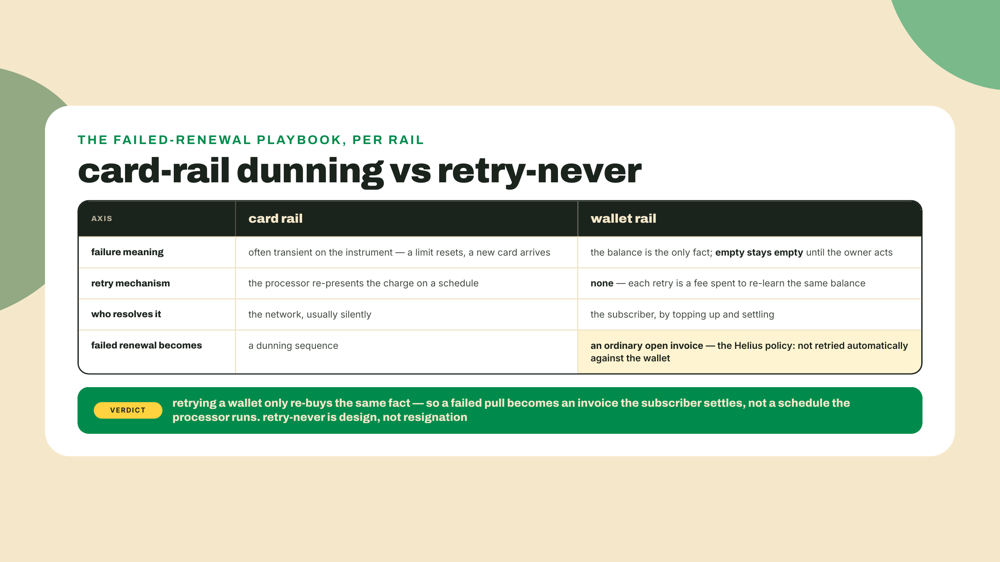
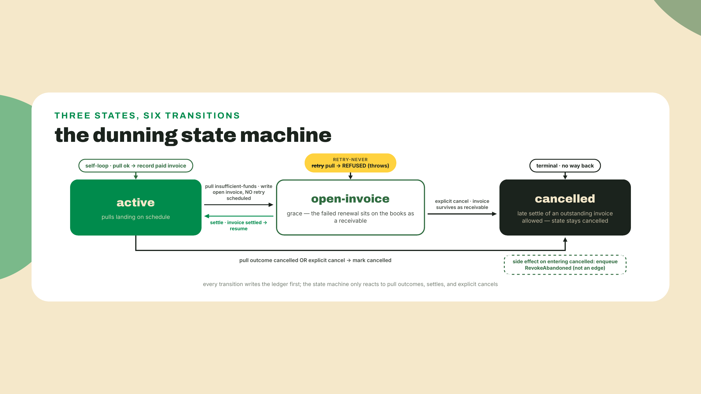
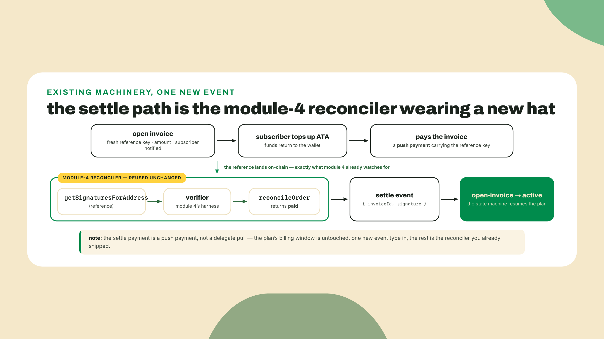
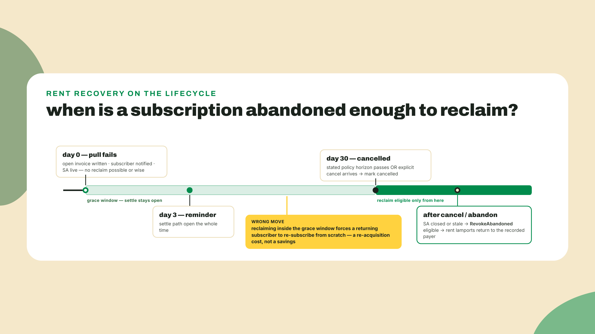
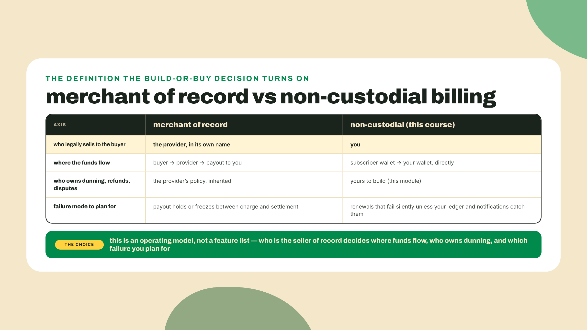
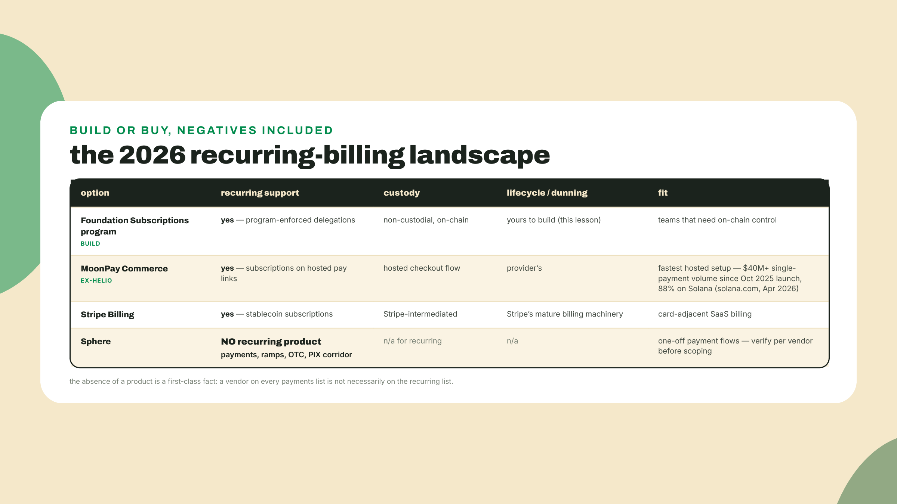
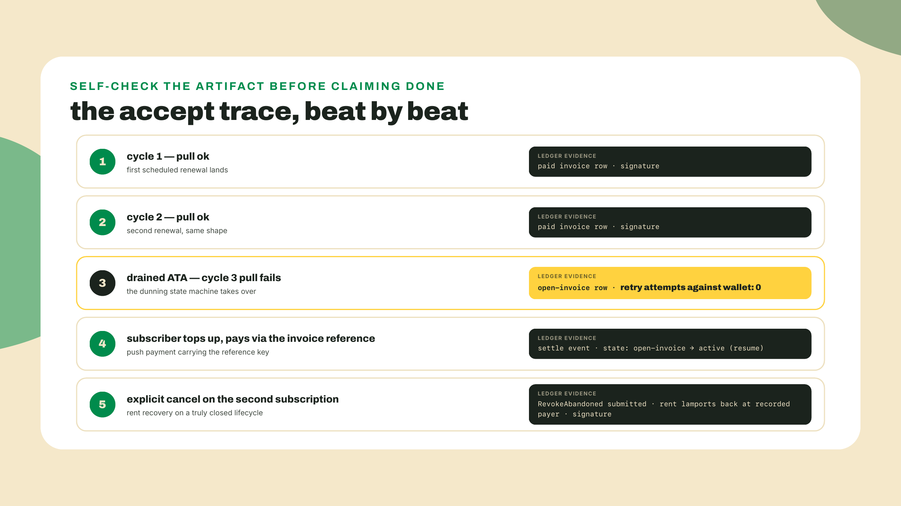

# Dunning, lifecycle, and who else does this

## Summary

Last lesson the club started billing for real: many subscribers, non-custodially, on the official Subscriptions program, with every successful pull reconciled into the backoffice ledger like any other payment. That machine works beautifully when the subscriber's ATA has funds. Today one of them doesn't. The monthly pull fires, the delegate transfer hits an empty token account, and the renewal fails. On card rails this is where dunning begins: the retry schedule, the updated-card email, the grace ladder every SaaS company runs. On these rails you reach for that playbook and your hand closes on air. There is no card to retry and no bank to dun. You cannot force money out of a wallet you do not control.

So what does a grown-up non-custodial billing system do with a failed renewal? The answer the ecosystem's most visible operator uses on its own bills: nothing automatic. The findings up front:

- **Retry-never is the policy, not a gap.** Helius bills its own subscriptions on this same program, and its documented stance is that a failed renewal is not retried automatically against the wallet. It becomes an ordinary open invoice the subscriber can settle later.
- You ship **dunning-loop**: a backoffice state machine over the billing ledger. Pull outcomes drive transitions: success advances the cycle, failure opens an invoice, settlement resumes, cancellation enqueues rent recovery.
- **RevokeAbandonedSubscription and RevokeAbandonedDelegation** close dead subscription and delegation PDAs and return their rent lamports to the recorded payer. Cancelled arrangements stop costing you money.
- The 2026 provider landscape, negatives included: MoonPay Commerce pay links support subscriptions, Stripe Billing supports stablecoin subscriptions, and Sphere has no recurring product at all.

Start the clock before you read, because this lesson's solo run is the longest wall-clock wait in the course and it is a wait you cannot compress. The run needs two full billing cycles, an hour is the floor the plan's `periodHours` unit allows, so two cycles is two hours of real time. Set it going now and read the theory while it ticks. From last lesson's `subscriptions/` folder:

1. Create plan id 2 with `periodHours: 1n` (the Challenge explains why it must be a second plan rather than an edit: plan terms are immutable once subscribed).
2. Subscribe your funded test listener to it, through the same subscribe flow as last lesson, and make sure its address is the one in `subscribers.json`.
3. Point `04-pull.ts` at the new plan — its `PLAN_ID` is hardcoded to `1n` from last lesson — then start the crank and leave it running: `CLUB_MINT=<your devnet mint> npx tsx 05-crank.ts`.

By the time you reach the Challenge, cycle one should have billed and cycle two should be close, and the drain goes between cycle two and cycle three. If you would rather read first and run later, that is fine — just know you are choosing to sit out two hours at the end instead of during.

Meanwhile, prove the baseline: from that same `subscriptions/` folder, its working directory for every command, re-run its gate:

```bash
npx tsx pull.test.ts
```

You should see the pull land in the ledger as a reconciled invoice. That ledger row is today's raw material: dunning is what happens to the rows that never get written. How the work splits today, out loud: the state machine and its adapter are worked, typed in with me against the six transitions, the gate harness proves them, and the full two-cycles-plus-one-failure run at the end is solo, no scaffold.

## The failure your ledger owns

### Nothing to dun

Start with why the card-rail playbook exists at all. Card payments are pull payments against an instrument the network can re-attempt: the merchant holds a token for the buyer's card, and when a charge bounces, the processor can present it again tomorrow, and Thursday, and next week, escalating through what the industry politely calls a dunning strategy. Retries work there because the failure is usually transient on the instrument's side: a limit reset, a paycheck landed, a new card on file. The machinery to reach into the buyer's account exists, so retrying is cheap and often succeeds.

Now look at what your crank actually holds: a delegation PDA that permits a bounded transfer, if and only if the allowance and the subscriber's balance both cover it. When the ATA is empty, a retry five minutes later hits the same empty account. A retry at 3 a.m. hits the same empty account. There is no issuer to re-present to and no standing instrument that might have refilled behind the scenes, only a wallet whose owner has to act. Every automatic retry is a transaction fee spent to re-learn a fact you already recorded. My first instinct here was still to write the retry queue. I had the file open, `retry.ts`, cron cadence sketched in a comment, before admitting the whole file was a category error imported from another payment rail.

The honest policy inverts the default, and this is where the dogfooding matters. Helius runs its own subscription billing on the Foundation Subscriptions program, and its policy for a failed renewal is that the charge is not retried automatically against the wallet. The failed pull becomes an open invoice, the subscriber gets told, and the money arrives when they top up and settle. Retry-never. Not retry-with-backoff, not retry-thrice-then-flag. The renewal converts from an automated pull into an ordinary receivable, which is a thing your backoffice already knows how to handle, because module 4 taught it to match inbound payments against open orders.



### The machine, and where it lives

If retries are gone, what remains is state. A subscription at any moment is in exactly one of three places: **active**, billing normally; **open-invoice**, a renewal failed and a receivable is outstanding (this is your grace state, the period where access policy is yours to choose); or **cancelled**, dead by choice or by chain. What moves it between them is a short list of events: a pull outcome from club-billing, a settlement, an explicit cancel.

Notice where this machine runs. Not on-chain. The chain gives you the pull primitive and its hard limits, and it will keep giving you exactly that; it has no opinion about grace periods, dunning emails, or whether a lapsed subscriber keeps access for three days. The only place you control state is your own ledger, so failure and lifecycle live there, as data. This is the quiet thesis of the whole back half of this course: the chain is the settlement layer, and the product decisions are rows you write. A pull either succeeds, because the delegated allowance and the balance both covered it, or it does not, and an unrecoverable failure has nowhere to auto-retry, so it lands in your ledger as an invoice and a state.

The transitions, exhaustively, because exhaustive is the point of a state machine:

- **active + pull ok** advances the cycle: a paid invoice row, same reconciliation path as last lesson.
- **active + pull insufficient-funds** moves to open-invoice and writes the invoice row. No retry is scheduled. There is no retry effect to schedule.
- **active + pull cancelled** (the chain reports the subscription revoked or the guard's canceled reason) mirrors reality: mark cancelled, enqueue rent recovery.
- **open-invoice + pull** is refused outright. The crank must not even attempt it; the state machine throws. This is retry-never as an invariant rather than a comment.
- **open-invoice + settle** resumes: the invoice settles, the subscription returns to active, and the next cycle bills normally.
- **any + explicit cancel** marks cancelled and enqueues a RevokeAbandoned so the rent comes home.



### What grace actually grants

The open-invoice state has a second name in the transitions above, grace, and grace is a product decision rather than a technical one. The chain did not pause anything when the pull failed. Your ledger changed a row. Whether the subscriber still gets this month's record is entirely a question of what your fulfillment code does when it reads that row, which means you have to decide, in writing, what a lapsed subscriber experiences. The club's policy, and the one the lab assumes: access continues through the grace window. The missed period ships, the invoice for it stays open, and the subscriber is trusted to settle. That reads generous until you notice it is also the cheap option: pausing fulfillment mid-cycle means building a pause, and clawing back access on digital goods you already delivered means building a lie. A business with real marginal cost per period, say a hardware rental, would draw the line differently and pause on the first failure. Either policy is fine. An undecided policy is not, because undecided in practice means whatever your fulfillment code happens to do, discovered by a customer.

The notification story is the other half of grace, and on retry-never rails it stops being a courtesy. On card rails a subscriber can be dunned back to health without ever reading an email. Here the subscriber is the only actor who can fix the failure, so the message is the recovery mechanism. Three beats are enough. At failure: what happened, what is owed, and the payment link carrying the invoice's reference key, because a message without a settle path attached is just bad news. A reminder at a stated cadence while the invoice ages. A final notice when the abandonment horizon approaches, naming the date and what happens after it. Send them from the ledger effects, not from the crank: the open-invoice effect is the natural trigger, which keeps notification logic out of the state machine and in the consumers, where side effects belong.

### Settle and resume, on machinery you already own

Here is where the artifact ladder pays you back. An open invoice needs a way to get paid, and you built that entire path in module 4. Give the invoice a fresh reference key at creation, exactly like a checkout order. Tell the subscriber what they owe and where, with that reference attached. When they top up their wallet and pay, the payment carries the claim ticket, your reconciler finds it with the same signature-search-plus-verifier walk as any sale, and the reconciled result becomes a settle event into the state machine. Resume is `reconcileOrder` pointed at an invoice instead of an order, feeding one more event type into a reducer.

Well, one honest wrinkle. The settle payment is a plain push payment from the subscriber, not a delegate pull, so it does not touch the subscription's billing window at all. Your next scheduled pull still fires on the plan's own cadence. Decide on purpose whether a mid-cycle settlement covers the missed period only (the simple reading, and the one the lab encodes) or also shifts the anchor of future billing; either is defensible, but the ledger has to say which one you run.

And name the trade-off squarely, because retry-never is honest but not free. A failed renewal does not self-heal. Revenue that card rails would have quietly recovered on the Tuesday retry now sits as a receivable until a human acts, so your settle path and your notification story stop being nice-to-haves and become the difference between a grace state and a silent churn machine. You are trading recovered-revenue automation for zero custody and zero surprise charges. For a record club whose subscribers chose crypto rails on purpose, that trade reads well. For a business whose margin depends on passive recovery, it is a real cost, and pretending otherwise is how this policy gets a bad name.



### Getting the rent back

Every subscription that ever existed left accounts on-chain: the subscription PDA, delegation PDAs, each holding a rent-exempt deposit measured in lamports. Small individually, on the order of a couple million lamports per account, and you should read the exact figure off the account rather than trust anyone's round number. But a club that churns hundreds of subscribers is quietly a landlord paying rent on empty apartments. The program's lifecycle exit exists for exactly this: the RevokeAbandoned instruction family. `RevokeAbandonedDelegation` works for both fixed and recurring delegations; `RevokeAbandonedSubscription` closes an abandoned plan subscription. Each closes the dead account and returns its rent lamports.

Two details from the program's own docs are load-bearing. First, the signer is the **recorded payer**, not the delegator, delegatee, or subscriber. If your merchant wallet sponsored the account creation back in the subscribe flow, your merchant wallet is who reclaims the rent, which is the whole reason this belongs in your backoffice queue and not in a user-facing button. Second, both instructions **fail if the Subscription Authority is still live** for that account. A subscriber who merely lapsed still has a live SA; abandoned means the authority itself is gone or stale. While the SA lives, the ordinary revoke path is the correct exit instead. Your cleanup consumer checks that precondition before submitting, and treats the failure case as routine, not as a bug.

Which surfaces the second trade-off of the lesson: reclaiming rent is real money back, but only after you decide an arrangement is truly dead, and that decision is irreversible in a way the lamports do not capture. Once revoked, the subscription account is closed and a returning subscriber must subscribe again from scratch: new signature ceremony, new account, new onboarding friction. (The program does ship an on-chain `resumeSubscription` for a cancellation the subscriber scheduled and then regretted before revoke, guarded by the expiry they observed at signing, but that is a different, narrower door; it cannot resurrect a closed account.) Reclaim a week after a failed pull and you have converted a grace-state customer into a re-acquisition problem to save two million lamports. Treat abandonment as an explicit, considered transition: in the club's policy, an open invoice that ages past a stated horizon, or an explicit cancel, and nothing softer.



### Who else does this

Zoom out from Wavelength's ledger to the market, because build-or-buy is a real question and 2026 finally gives it real answers. Picture the recurring-billing landscape as three counters at a street market, each selling something different, and one of them, importantly, not selling what its sign might make you assume.

Before the walk, one definition, because the whole build-or-buy question turns on it. A merchant of record is the entity legally selling to the buyer: it takes the payment in its own name, owns the refund and dispute obligations, handles tax where tax applies, and pays you out afterward. When you outsource recurring billing to a hosted provider you are usually buying some slice of that arrangement, and the price of the slice is standing between your customer and your money. Non-custodial billing is the opposite corner: you are the merchant of record, the subscriber's funds move straight from their wallet to yours, and every obligation the provider would have absorbed, dunning very much included, is yours to build, which is what this module has been. Neither corner is the grown-up choice in general. The grown-up move is knowing which one you are running, because the failure modes differ: a provider can hold or freeze your payouts, while your own rails can fail a renewal with nobody but you positioned to notice.



**MoonPay Commerce**, the platform formerly known as Helio, sells hosted checkout: its pay links support subscriptions, so a merchant can stand up recurring billing with no program integration at all. The counter is busy; solana.com's April 2026 roundup reports MoonPay Commerce at forty million dollars plus in single-payment volume since its October 2025 launch, 88 percent of it on Solana. Note what that dated number measures, single payments, which tells you hosted checkout is the proven half and recurring is the newer shelf on it. **Stripe Billing** sells the card-adjacent bundle: stablecoin subscriptions inside the same billing product that runs half the internet's SaaS invoices, which means dunning logic, proration, and tax handling you do not write, in exchange for Stripe sitting between you and the rail. And **Sphere** sells payments infrastructure, ramps, OTC, and the PIX corridor for instant bank-rail settlement, and here is the negative result worth more than most positive ones: Sphere has no recurring product at all. Nothing wrong with Sphere; plenty right with it for one-off flows. But assuming every payments provider offers recurring billing is precisely how a team burns an integration sprint discovering the feature they scoped does not exist. Verify recurring support per vendor, in writing, before you architect around it.

The decision rule falls out cleanly. Build on the Foundation program, as this course has, when you want non-custodial and on-chain: the subscriber's funds never sit with an intermediary, the limits are program-enforced, and the lifecycle is yours, which is exactly why you had to write this lesson's state machine yourself. Reach for a provider when you want a hosted, card-adjacent product and are content to inherit their lifecycle policy along with their dunning emails. What to watch, if you take the provider road: whether the vendor's recurring product is a first-class primitive or a pay-link loop, who holds custody between charge and settlement, and what their failed-renewal policy actually is, because now you know it is a policy, not physics.



## Lab: build dunning-loop

Five steps. This artifact is a pure state machine over ledger data, which buys you something rare in this course: zero new dependencies and zero workspace drama. The `dunning` workspace imports nothing from `@solana/kit`, so it sits outside both the kit ^6 and kit ^7 pins entirely (those pins, frozen 2026-08, live where the chain calls live: checkout and ops on ^6, subscriptions on ^7). It runs with `tsx`, which has been in the repo's devDependencies since the transfer-kit lesson; if you are somehow starting clean, `npm install -D tsx typescript` puts it back.

**Step 1: scaffold.** A fresh workspace beside the others, and because it is pure TypeScript the install is tiny. From the `wavelength` root:

```bash
mkdir dunning && cd dunning
npm init -y
npm pkg set type=module
npm install -D tsx typescript @types/node
```

Then add `"dunning"` to the root `workspaces` array the way you have for every workspace since the reconciliation lesson. Three files get created in the steps below, all by you: `statemachine.ts` (the machine), `outcome.ts` (the bridge from club-billing's vocabulary), and `statemachine.test.ts` (the gate).

**Step 2: the state machine.** Open `dunning/statemachine.ts`. The types come first, because in this file the types are half the policy:

```ts
// dunning/statemachine.ts
export type SubscriptionState = 'active' | 'open-invoice' | 'cancelled';

export type PullOutcome =
  | { kind: 'ok'; signature: string; amountBaseUnits: bigint }
  | { kind: 'insufficient-funds'; amountBaseUnits: bigint }
  | { kind: 'cancelled' };

export type DunningEvent =
  | { type: 'pull'; period: number; outcome: PullOutcome }
  | { type: 'settle'; invoiceId: string; signature: string }
  | { type: 'cancel'; reason: string };

// Note what this vocabulary refuses to express: there is no
// 'schedule-retry' effect. Retry-never is unrepresentable-by-type,
// the same trick policy.ts pulled on fulfill-anyway last module.
export type LedgerEffect =
  | { effect: 'record-paid-invoice'; invoiceId: string; period: number; signature: string; amountBaseUnits: string }
  | { effect: 'open-invoice'; invoiceId: string; period: number; amountBaseUnits: string }
  | { effect: 'settle-invoice'; invoiceId: string; signature: string }
  | { effect: 'mark-cancelled'; reason: string }
  | { effect: 'enqueue-revoke-abandoned'; subscriptionPda: string; instruction: 'RevokeAbandonedSubscription' };

export type Subscription = {
  id: string;
  subscriptionPda: string;
  state: SubscriptionState;
  openInvoiceId?: string;
};

export type Transition = { next: SubscriptionState; effects: LedgerEffect[] };
```

Amounts serialize as strings, the same bigint-on-disk rule the ledger has enforced since module 4. Then the reducer, worked rather than withheld, because the six transitions in the theory section already state the whole answer; type it in arm by arm, checking each against its transition line, and save the reserved thinking for the solo devnet run where no listing will help you.

```ts
const invoiceId = (sub: Subscription, period: number) => `inv:${sub.id}:${period}`;

export function transition(sub: Subscription, event: DunningEvent): Transition {
  switch (sub.state) {
    case 'active': {
      if (event.type === 'pull') {
        const { outcome, period } = event;
        if (outcome.kind === 'ok') {
          return {
            next: 'active',
            effects: [{
              effect: 'record-paid-invoice',
              invoiceId: invoiceId(sub, period),
              period,
              signature: outcome.signature,
              amountBaseUnits: outcome.amountBaseUnits.toString(),
            }],
          };
        }
        if (outcome.kind === 'insufficient-funds') {
          return {
            next: 'open-invoice',
            effects: [{
              effect: 'open-invoice',
              invoiceId: invoiceId(sub, period),
              period,
              amountBaseUnits: outcome.amountBaseUnits.toString(),
            }],
          };
        }
        // outcome.kind === 'cancelled': the chain said no; mirror it.
        return cancelTransition(sub, 'revoked-on-chain');
      }
      if (event.type === 'cancel') return cancelTransition(sub, event.reason);
      throw new Error(`no ${event.type} transition from active`);
    }

    case 'open-invoice': {
      if (event.type === 'pull') {
        // THE load-bearing refusal: an open invoice is never retried
        // against the wallet. The crank must not even ask.
        throw new Error(
          `refusing pull for ${sub.id}: open invoice ${sub.openInvoiceId}; retry-never`,
        );
      }
      if (event.type === 'settle') {
        if (event.invoiceId !== sub.openInvoiceId) {
          throw new Error(`settle for unknown invoice ${event.invoiceId}`);
        }
        return {
          next: 'active', // resume
          effects: [{ effect: 'settle-invoice', invoiceId: event.invoiceId, signature: event.signature }],
        };
      }
      return cancelTransition(sub, event.reason);
    }

    case 'cancelled': {
      if (event.type === 'settle' && event.invoiceId === sub.openInvoiceId) {
        // A receivable collected after cancellation still settles;
        // the subscription itself stays dead.
        return {
          next: 'cancelled',
          effects: [{ effect: 'settle-invoice', invoiceId: event.invoiceId, signature: event.signature }],
        };
      }
      throw new Error(`no ${event.type} transition from cancelled`);
    }
  }
}

function cancelTransition(sub: Subscription, reason: string): Transition {
  return {
    next: 'cancelled',
    effects: [
      { effect: 'mark-cancelled', reason },
      {
        effect: 'enqueue-revoke-abandoned',
        subscriptionPda: sub.subscriptionPda,
        instruction: 'RevokeAbandonedSubscription',
      },
    ],
  };
}
```

Two decisions here are deliberate. The open-invoice pull arm throws instead of returning a no-op, because a silent no-op invites a crank bug where retries happen and nothing notices; a thrown invariant turns the same bug into a page. One consequence for last lesson's crank loop: its per-subscriber `catch` logs and moves on, which would quietly swallow exactly this throw. When you route the crank through the machine in the solo run, either check the ledger state before calling `pullOnce` at all (cleaner), or re-throw from the catch when the message starts with `refusing pull`; a swallowed invariant is the 3 a.m. failure this arm exists to prevent. And cancellation from any live state routes through one `cancelTransition`, so there is exactly one place in the codebase where rent recovery gets enqueued, which is the place you will later add the abandonment-horizon check.

**Step 3: the outcome adapter.** The state machine speaks `PullOutcome`; club-billing speaks `decidePull` decisions and send results. `dunning/outcome.ts` is the ten-line bridge:

```ts
// dunning/outcome.ts
import type { PullOutcome } from './statemachine';

// The shape last lesson's period-window guard returns, verbatim.
export interface PullDecision {
  shouldPull: boolean;
  reason: string; // 'due' when pulling, else 'canceled' | 'expired' | 'too-early'
  nextEligibleTs: number;
}

export type PullAttempt =
  | { ok: true; signature: string }
  | { ok: false; error: 'insufficient-funds' | 'other'; detail?: string };

export function outcomeFromPull(
  decision: PullDecision,
  attempt: PullAttempt | null,
  amountBaseUnits: bigint,
): PullOutcome | null {
  if (!decision.shouldPull) {
    // Cancelled on-chain is a state-machine event; too-early and
    // expired are non-events for dunning (the crank just moves on).
    // NOTE the spelling seam, on purpose and documented: the guard's
    // reason string is 'canceled' (one L, the client's US spelling);
    // the state machine's own vocabulary is 'cancelled' (two Ls).
    // The comparison below is on the guard's side. Keep it one-L.
    return decision.reason === 'canceled' ? { kind: 'cancelled' } : null;
  }
  if (!attempt) throw new Error('decision said pull, but no attempt was made');
  if (attempt.ok) return { kind: 'ok', signature: attempt.signature, amountBaseUnits };
  if (attempt.error === 'insufficient-funds') {
    return { kind: 'insufficient-funds', amountBaseUnits };
  }
  // RPC hiccups and blockhash expiry are NOT dunning events: the pull
  // never legally failed, so the crank retries the SUBMISSION next
  // tick. Retry-never bans retrying the debt, not the plumbing.
  return null;
}
```

That last branch is the subtlest line in the lab, so let it be plain: retry-never governs the renewal, not the network. A transaction that expired before landing never charged anyone and never failed against a balance; resubmitting it is plumbing, not dunning. Only a pull the chain actually rejected for insufficient funds converts into an open invoice.

**Step 4: wire settle and the revoke queue.** The settle side is a bridge, not a system, and it lives in the kit-v6 ops workspace because it is chain-facing (the dunning reducer it feeds is pure TypeScript and imports from no kit at all). Create `backoffice-refunds/src/settle-invoices.ts`:

```ts
// backoffice-refunds/src/settle-invoices.ts: open invoices get paid through
// the exact machinery a checkout order uses. Two functions, one timer.
import { generateKeyPairSigner, address, type Address } from '@solana/kit';
import { reconcileOrder } from './reconcile';
import { recordOrder } from './ledger';

const MERCHANT = address(process.env.MERCHANT_ADDRESS!);
const MERCHANT_ATA = address(process.env.MERCHANT_ATA!);
const CLUB_MINT = address(process.env.CLUB_MINT!);

// Called from the open-invoice effect: mint the invoice a claim ticket and
// register it as an open order, exactly like a checkout does at page load.
export async function openInvoiceReference(
  invoiceId: string,
  amountBaseUnits: bigint,
): Promise<Address> {
  const reference = (await generateKeyPairSigner()).address;
  recordOrder(
    {
      orderId: invoiceId,
      recipient: MERCHANT,
      recipientAta: MERCHANT_ATA,
      mint: CLUB_MINT,
      amountBaseUnits,
    },
    reference,
  );
  return reference;
}

// Called on a timer for every open invoice: a paid reconcile becomes the
// settle event your dunning reducer consumes.
export async function settleTick(
  invoiceId: string,
  reference: Address,
): Promise<{ type: 'settle'; invoiceId: string; signature: string } | null> {
  const result = await reconcileOrder(reference);
  return result.status === 'paid'
    ? { type: 'settle', invoiceId, signature: result.signature }
    : null;
}
```

The timer loop itself is three lines of `setInterval` around `settleTick`, and the returned event goes straight into `transition`. Nothing here is new machinery: `recordOrder` and `reconcileOrder` are the reconciliation lesson's exports, doing for an invoice exactly what they do for an order. The revoke side drains the enqueued effects. The consumer builds the instruction with the client you installed last lesson (`@solana/subscriptions`, pinned 0.5.0 in the kit ^7 workspace, pin frozen 2026-08), exactly as the program docs shape it:

```ts
import { getRevokeAbandonedSubscriptionInstruction } from '@solana/subscriptions';

const ix = getRevokeAbandonedSubscriptionInstruction({
  payer: payerSigner,             // the recorded payer signs, nobody else
  subscriptionAccount: subscriptionPda,
  subscriptionAuthority: subscriptionAuthorityPda,
  planPda,
});
```

Before submitting, the consumer checks the precondition the docs warn about: if the Subscription Authority is still live for that account, the instruction fails by design, and the ordinary revoke path is the correct exit instead. Log the refusal and requeue with the reason; a cleanup queue that silently drops failures is how accounts leak forever.

The same effects-drain pattern carries the notification story from the theory half. Subscribe a second consumer to `open-invoice` effects and have it send the failure message with the invoice's reference key attached; the reminder cadence and the final-notice horizon run off invoice age, read from the ledger on the same timer that runs the reconciler. No new architecture, just one more reader of the effects you already emit, which is the whole argument for making the state machine return effects instead of performing them.

**Step 5: write and run the gate.** Create `dunning/statemachine.test.ts`. It drives two successful cycles, forces an insufficient-funds outcome, asserts the pull-during-open-invoice refusal actually throws, asserts no retry effect exists anywhere in the trace, settles, and cancels:

```ts
// dunning/statemachine.test.ts: the lesson's gate. Pure logic, no chain.
import { transition, type Subscription, type LedgerEffect } from './statemachine';

function fail(msg: string): never {
  console.error(`FAIL: ${msg}`);
  process.exit(1);
}

let sub: Subscription = { id: 'club-77', subscriptionPda: 'SubPda11111111111111111111111111111111111111', state: 'active' };
const trace: LedgerEffect[] = [];
function apply(t: { next: Subscription['state']; effects: LedgerEffect[] }, openInvoiceId?: string): void {
  sub = { ...sub, state: t.next, openInvoiceId: openInvoiceId ?? sub.openInvoiceId };
  trace.push(...t.effects);
}

// 1. Two successful cycles keep the subscription active.
for (const period of [1, 2]) {
  const t = transition(sub, {
    type: 'pull',
    period,
    outcome: { kind: 'ok', signature: `sig${period}`, amountBaseUnits: 15_000_000n },
  });
  if (t.next !== 'active') fail(`cycle ${period} should stay active`);
  apply(t);
}

// 2. Insufficient funds opens an invoice, schedules nothing.
const t3 = transition(sub, {
  type: 'pull',
  period: 3,
  outcome: { kind: 'insufficient-funds', amountBaseUnits: 15_000_000n },
});
if (t3.next !== 'open-invoice') fail('failed pull must open an invoice');
const opened = t3.effects.find((e) => e.effect === 'open-invoice');
if (!opened || opened.effect !== 'open-invoice') fail('open-invoice effect missing');
apply(t3, opened.invoiceId);

// 3. Retry-never is an invariant: a pull against open-invoice throws.
let threw = false;
try {
  transition(sub, {
    type: 'pull',
    period: 4,
    outcome: { kind: 'ok', signature: 'sigX', amountBaseUnits: 15_000_000n },
  });
} catch {
  threw = true;
}
if (!threw) fail('pull during open-invoice must throw (retry-never)');

// 4. No retry effect exists anywhere in the trace (or the vocabulary).
if (trace.some((e) => e.effect.includes('retry'))) fail('a retry effect leaked into the ledger');

// 5. Settlement resumes.
const t5 = transition(sub, { type: 'settle', invoiceId: sub.openInvoiceId!, signature: 'sigSettle' });
if (t5.next !== 'active') fail('settle must resume the subscription');
apply(t5);

// 6. Explicit cancel enqueues rent recovery.
const t6 = transition(sub, { type: 'cancel', reason: 'user-request' });
if (t6.next !== 'cancelled') fail('cancel must land in cancelled');
if (!t6.effects.some((e) => e.effect === 'enqueue-revoke-abandoned')) {
  fail('cancel must enqueue RevokeAbandoned');
}
apply(t6);

console.log('failed renewal -> open-invoice (no wallet retry); settle -> resume; cancel -> RevokeAbandoned enqueued');
```

Run it from the `dunning` folder:

```bash
npx tsx statemachine.test.ts
```

Expected output:

```
failed renewal -> open-invoice (no wallet retry); settle -> resume; cancel -> RevokeAbandoned enqueued
```

If the refusal assertion fails, your open-invoice arm went soft; if the zero-retries assertion fails, an effect snuck into your vocabulary that should be unrepresentable. Both are the lesson, enforced.

## Challenge

The transitions were completion work. The run is solo, on devnet, against the real club from last lesson.

Plan terms are immutable once subscribed (the `expected*` fields you signed pinned the terms you accepted; the immutability itself is the program's doing — UpdatePlan never touches terms), so compressing the period means a second plan, not an edit: create plan id 2 with `periodHours: 1n` (an hour is the floor the plan's unit allows), subscribe your funded test listener to it, and leave the old plan's delegation alone; it keeps its own clock, and you can unsubscribe it later. Be honest with yourself about the wall clock this buys: two full cycles on an hourly plan is two hours, so start the crank early in the session, let it tick, and do the drain between cycle two and cycle three. Run those two cycles and watch two paid invoice rows land in the backoffice ledger. Note who writes them, because this is the one place the course's two ledger writers are easy to confuse: the crank writes billing rows itself, keyed on the pull's signature, exactly as last lesson established. The module-4 reconciler never sees them — it matches OPEN invoices by reference key, and an official pull carries neither reference nor memo. Watching `reconcileOrder` here and concluding your pipeline is broken is the predictable wrong turn; watch `orders.jsonl` instead. Now force the failure: drain the test subscriber's ATA (send its USDC-dev balance elsewhere from the subscriber's wallet), let the crank fire the third pull, and prove the failure lands as an open invoice, not as a wallet retry: your ledger must show one open invoice row and zero further pull attempts against that subscription, which the state machine's thrown refusal guarantees if your crank routes through it. Then walk both exits. Exit one: top the ATA back up, pay the invoice through its reference key, and confirm the settle event resumes the subscription and the next cycle bills normally. Exit two: stand up a second test listener for it — a fresh keypair with a little devnet SOL and USDC-dev, through the same subscribe flow as last lesson — and subscribe it to the hourly plan. Then walk the full teardown in order: cancel its subscription outright, revoke its Subscription Authority from that subscriber's wallet (the unilateral exit door from last lesson; this is the step that makes the accounts *abandoned* rather than merely lapsed, and note that revoking the SA does not by itself return the PDAs' rent — it only clears the precondition that was blocking RevokeAbandoned), run the revoke queue consumer, and confirm the RevokeAbandoned lands, checking the rent lamports arriving back at the recorded payer's balance — your merchant wallet, if it sponsored the subscribe. Keep your first listener out of this exit: its Subscription Authority must stay live for Exit one's resumed billing, and a consumer pointed at it will log the live-SA refusal and requeue — the designed precondition, not a bug.

Accept: a ledger trace showing two paid cycles, one open invoice with no automatic wallet-retry attempts, one settle-and-resume, and one cancel whose rent-recovery signature you can paste. That trace, all five beats of it, is the artifact.



## Checkpoint, and what the club can finally survive

If the harness or the devnet run fought you, the likely suspects in order: the open-invoice pull arm returning a value instead of throwing (the assertion catches it, but the real cost would have been a crank happily retrying forever), the outcome adapter converting an RPC failure into an open invoice (plumbing mistaken for debt; your subscriber gets dunned for a timeout), or the revoke consumer submitting while the Subscription Authority is still live and misreading the designed failure as a bug. Each is a two-line fix once named out loud.

Step back and look at the shape of what you built across this module, because it is one machine now. The club bills many subscribers without custody, every pull reconciles into the same ledger as every sale, a failed renewal degrades into an ordinary receivable instead of a retry storm, settlement resumes it through the exact rails a checkout payment uses, and dead arrangements hand their rent back. Billing, failing gracefully, cleaning up after itself. The record-of-the-month club is a real subscription business on rails that ship no subscription business logic at all, and you know precisely which parts are physics and which parts are your policy, because you wrote the policy down as types.

Every buyer so far, though, arrived pre-loaded: USDC in the wallet, wallet in hand. The next module opens the door the rest of the world walks through: the fiat edge. Getting money in and out, and knowing exactly who is merchant-of-record at each seam.
