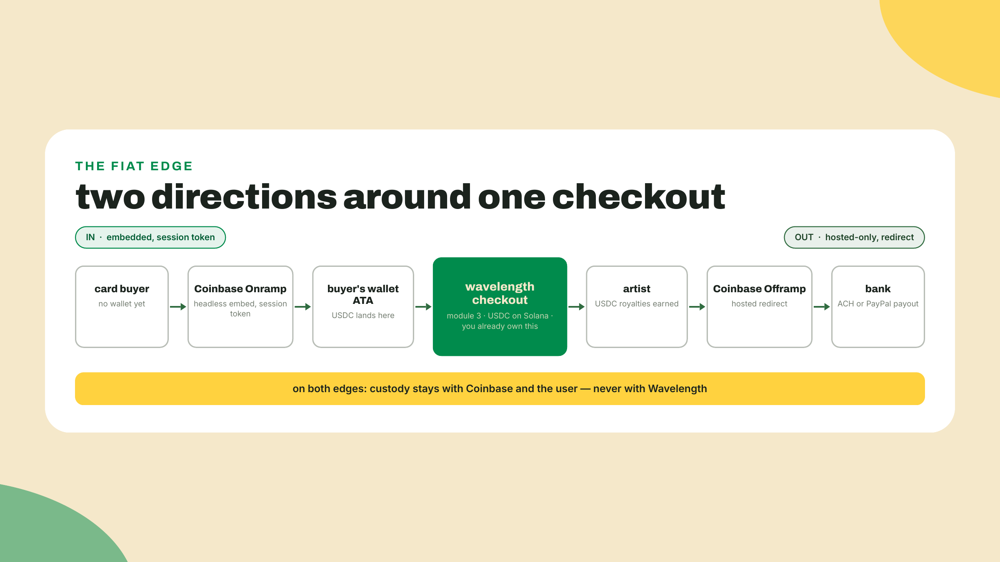
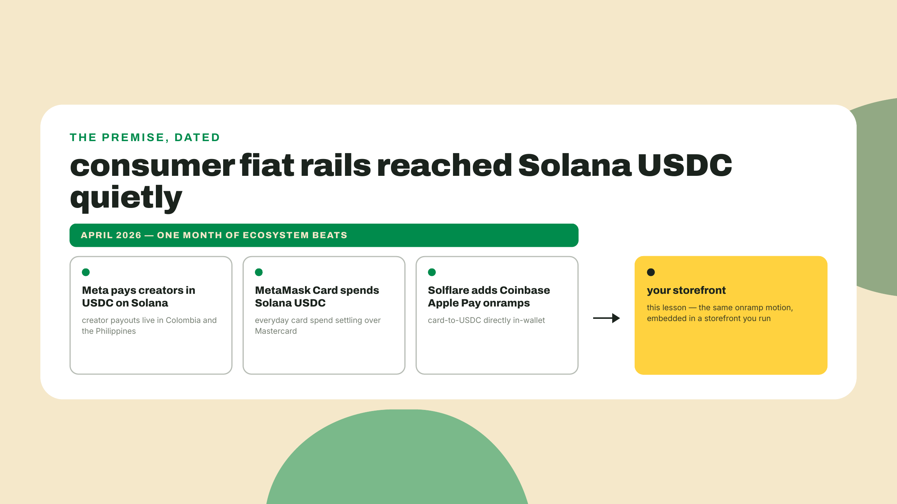
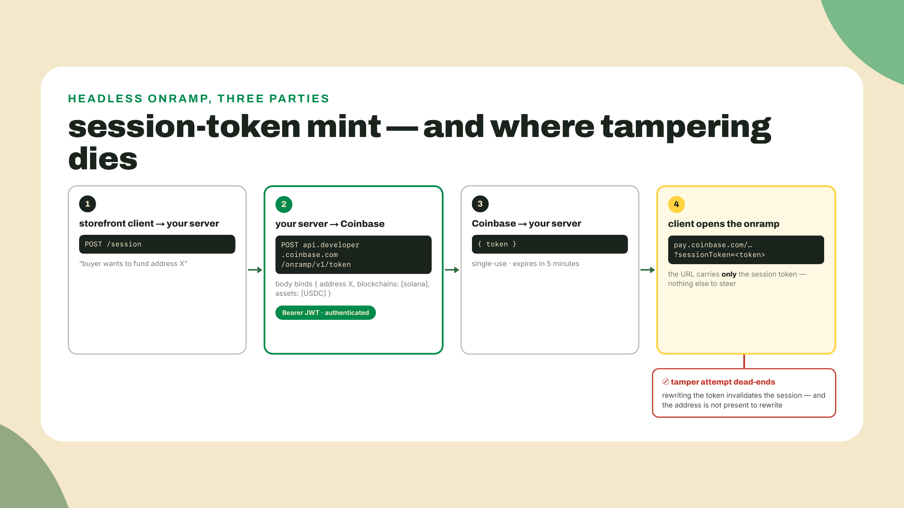
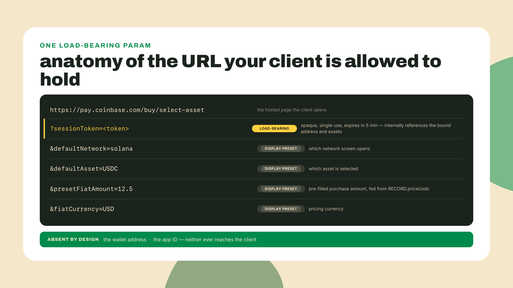
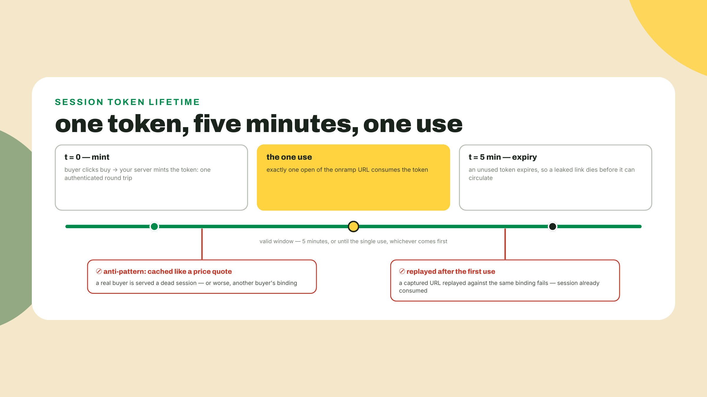
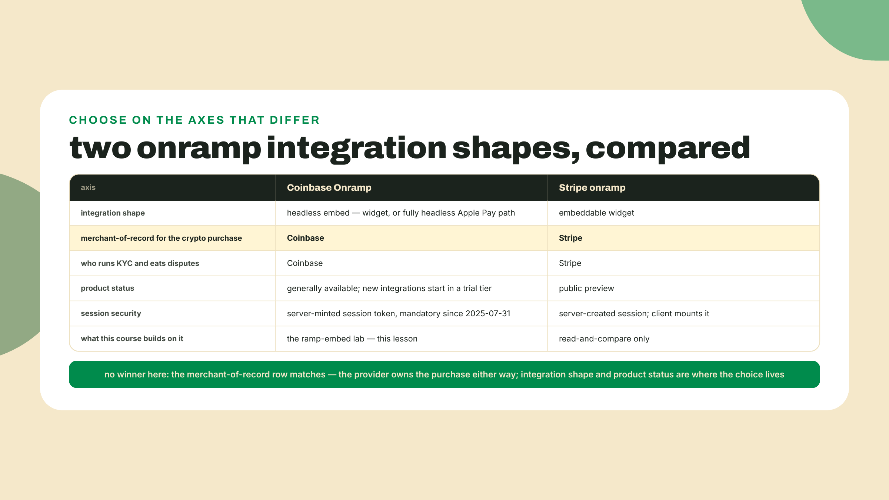
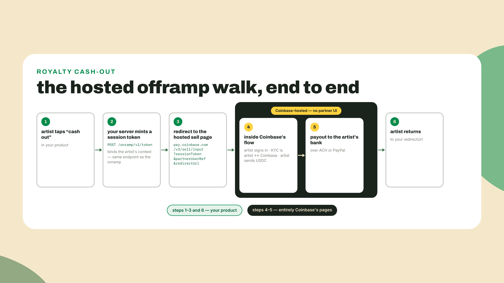
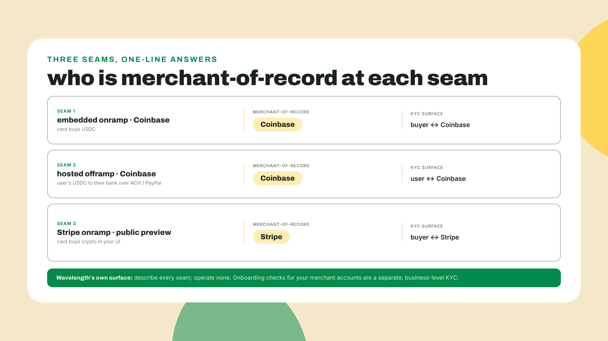
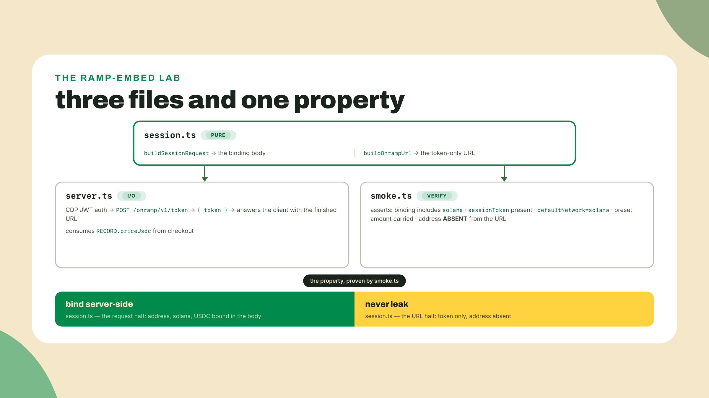

# Onramps, and the way back out

## Summary

The subscriptions module closed with the dunning state machine turning a failed renewal into an open invoice; the record-of-the-month club now runs itself. But every rung, from the first transfer to the club, assumed the USDC had already arrived in a wallet. At a real record fair, half the crowd has a card and no crypto at all, and one of your artists wants to cash last month's royalties into a bank account. Money has to get in, and it has to get back out. Neither direction is your job to custody, and this lesson is about wiring both directions without ever touching either.

Before any theory, run this one-liner in your terminal (`node` has been on your machine since module 1):

```bash
node -e "const u = new URL('https://pay.example/buy?address=BuyerWa11etXXXXXXXXXXXXXXXXXXXXXXXXXXXXXXXX&asset=USDC'); u.searchParams.set('address', 'AttackerXXXXXXXXXXXXXXXXXXXXXXXXXXXXXXXXXXX'); console.log(u.toString())"
```

One line of JavaScript just rewrote where a buyer's funds would go, in any flow careless enough to carry the destination in a URL. That is the whole security lesson of the day in miniature: anything in a client URL is attacker-writable, so the destination address must never travel in one. The fix is called a session token, and it is the spine of everything we build below.

The findings up front:

- **The way in** is Coinbase Onramp's headless embedded flow. Your server mints a one-time **session token** that binds the buyer's wallet address and the receivable asset; the client URL carries only that token. A tampered URL cannot redirect funds, because the address is not in the URL to tamper with.
- Since July 31, 2025, every Coinbase Onramp and Offramp URL must be initialized with a session token. The address-in-the-URL era is over by mandate, not just by good taste.
- **Stripe's fiat-to-crypto onramp** is the other integration shape: Stripe is merchant-of-record, eating fraud, disputes, and KYC. It is in public preview, which means its limits are your limits.
- **The way out** is Coinbase Offramp, and it is hosted-only: you redirect the user into Coinbase's own flow rather than embedding it. The payout rail depends on where the artist is: ACH is a US bank rail, PayPal serves a list of select countries, and the live per-region menu is config you fetch, not a fact you remember.
- The load-bearing distinction of the module: a processor settling your sales into a fiat balance and a user off-ramping their own USDC to their bank are two different actors with two different KYC surfaces. Knowing which is which at each seam is your entire compliance job as a dev. It is also not legal advice, and I will say that again where it matters.

The artifact is `ramp-embed`, grown out of the same `wavelength-checkout` workspace: a server route that mints the session token, a client handoff that opens the onramp URL, and a smoke test that proves the address never leaks. How today's work is split: the session handler ships as a skeleton with two loud TODO holes and the theory contains both answers verbatim; the offramp is a guided walkthrough because you cannot meaningfully automate someone else's hosted KYC flow; and the solo coding challenge hands you a working-but-leaky integration to repair rather than a blank file.



## The fiat edge

### Ramps, and who they serve

A ramp is a currency exchange with a compliance department. The **onramp** direction takes a card or bank payment from a user and delivers crypto to an address they name; the **offramp** direction takes their crypto and delivers fiat to a bank account they own. In both directions the ramp's customer is the person who wants the asset swapped, not you. Wavelength never holds the card number, never holds the fiat, and never holds the buyer's USDC. You are wiring a door, not a vault.

Two integration shapes exist, and the vocabulary matters for the rest of the module. A **hosted** integration means you redirect the user to the provider's own pages and they come back when it is done. A **headless** (or embedded) integration means the provider's flow runs inside your product, under your styling and your screens, while the provider still runs the money and the KYC underneath. Hosted is a referral; headless is a component. Coinbase Onramp offers the headless path, which is why it gets the build today. Coinbase Offramp, as we will see, deliberately does not.

Why does a record shop care at all? Because the buyer math is brutal. Every lesson so far assumed a wallet already holding USDC, which at a physical fair describes maybe the crypto-native slice of the crowd. Everyone else is holding a card. If the answer to "can I pay?" is "first go create an exchange account, complete KYC there, buy USDC, withdraw it to a wallet you also need to install, then come back," you have not lost a sale, you have lost the whole segment. The onramp collapses that into: tap buy, Apple Pay, USDC appears in the wallet, pay the checkout. Same rails you already built. New crowd.

And this stopped being hypothetical for consumers a while ago. The April 2026 wave of consumer rails made the pattern mainstream: Meta started paying creators in USDC on Solana in Colombia and the Philippines, MetaMask Card began spending Solana USDC over Mastercard at ordinary terminals, and Solflare shipped Coinbase Apple Pay onramps directly inside the wallet (all three beats from the Solana Foundation's April 2026 ecosystem roundup on solana.com, the same roundup later lessons cite; dated claims, so re-check before you repeat them). The plumbing you are about to build is the same plumbing, one storefront smaller.



### The session token: bind server-side, never leak

Here is the teaching spine of the lesson, and it is a real security property, not integration boilerplate.

The naive embed looks like the one-liner you ran at the top: build a URL on the client, append the buyer's wallet address and your app ID as query params, open it. It even works. The problem is that a URL is data in the attacker's hands. A malicious browser extension, a compromised dependency, a man-in-the-middle on a bad network, any of them can rewrite `address=` before the window opens, and the buyer's card happily funds a stranger's wallet. The buyer blames your store, and the dispute lands somewhere expensive. I will be honest: the first onramp integration I ever sketched had the address in the query string, because every quickstart of that era did. The industry learned better in public.

The session-token flow removes the address from the attack surface entirely. Three steps:

1. Your **server** calls Coinbase's session token API, authenticated with your CDP API key, and the request body binds the destination: the buyer's wallet address, the blockchains it is valid on, and optionally which assets the session may receive.
2. Coinbase returns a **session token**: a one-time credential, expiring in five minutes, that internally references everything the request bound.
3. The **client** opens the onramp URL carrying only that token. The address never appears in the URL, so there is nothing to tamper with. Rewrite the token and the session simply fails; it cannot be redirected, only broken.

Be precise about what the token does and does not protect, because a security claim that overreaches invites its own thirty-second refutation. The token removes the address from everything downstream of the mint: the URL, the opened window, any copied, logged, or leaked link, which is where destinations live longest and get rewritten easiest. What it does not do is authenticate the intent. The lab's `/session` route still accepts the address from a client POST, so an attacker who can rewrite requests inside the buyer's browser could tamper one hop earlier, at the body instead of the URL. A production storefront closes that hop by binding the address to something the client cannot forge, a logged-in session whose wallet was linked at signup, or a connected-wallet signature proving control of the address; the lab leaves that auth layer out because it belongs to your app, not to the ramp. Narrower claim, still worth the build.

The property to hold onto: **bind server-side, never leak**. The sensitive value lives in an authenticated server-to-server call; the client carries an opaque reference. If you have used Stripe's PaymentIntents, this is the same shape (a server-created intent, a client-side secret that references it), and the overlap is the standard answer to "the client wants to start a flow the client must not be able to steer."



The concrete shapes, verified against Coinbase's live docs today, are small enough to memorize. The mint is a POST to `https://api.developer.coinbase.com/onramp/v1/token` with a Bearer JWT generated from your CDP API key, and the body that binds a Solana USDC destination is exactly this:

```json
{
  "addresses": [{ "address": "<buyer wallet address>", "blockchains": ["solana"] }],
  "assets": ["USDC"]
}
```

The response is a flat `{ "token": "...", "channel_id": "..." }` (`channel_id` is metadata for Coinbase's guest-checkout flow; the widget path needs only `token`, which is why the lab's server route drops the rest). And the client URL your storefront opens is built from the token plus display defaults:

```
https://pay.coinbase.com/buy/select-asset
  ?sessionToken=<token>
  &defaultNetwork=solana
  &defaultAsset=USDC
  &presetFiatAmount=12.5
  &fiatCurrency=USD
```

Read that URL twice and notice what is missing: no address, no app ID. `defaultNetwork` and `defaultAsset` are user-experience presets (they pick which asset screen the widget opens on), and `presetFiatAmount` pre-fills the purchase with the record's price so the buyer lands on a screen that already says the right number. None of them are security-relevant. The only load-bearing param is `sessionToken`, and it is opaque. That asymmetry, boring presets in the URL, the sensitive binding behind the token, is the design.



The token's two lifetimes are also part of the property, not trivia. Single-use means a captured URL cannot be replayed to open a second funding session against the same binding, and the five-minute expiry means a leaked link dies before it can circulate. Your server mints per click, at the moment of intent. Cache a session token the way you would cache a price quote and the best case is a dead link, expired or already consumed, served to a real buyer at the moment of purchase; the worst case is a binding minted for one buyer handed to another. The mint costs one authenticated round trip, so there is nothing worth saving.



One practical note on what the buyer receives. The destination you bind is the buyer's wallet address, and Coinbase delivers USDC to the associated token account derived from it, the same ATA derivation you learned when Wavelength first received USDC in module 2. The buyer does not need to pre-create anything. They come out of the flow holding exactly the balance your checkout knows how to charge. Mainnet USDC on Solana is the mint `EPjFWdd5AufqSSqeM2qN1xzybapC8G4wEGGkZwyTDt1v`; your devnet checkout charges the devnet stand-in mint, which is why the lab's live run is a sandboxed session rather than a devnet one. Onramps are a mainnet product. Real cards buy real dollars.

Two more pieces of the Coinbase surface belong on your map, both stated at concept level because the widget path above is the one we build. First, the **headless Apple Pay path**: beyond the widget, the Onramp Order API lets you go fully headless. Your server quotes and creates the order and gets back a payment link, you render that link in a webview or iframe, and what the buyer sees is Coinbase's Apple Pay or Google Pay button sitting inside your own UI. One correction worth carrying, because it is easy to assume otherwise: that path authenticates with the same CDP API key signed into a Bearer JWT, but it does not take a session token. Session tokens initialize the hosted widget URLs; the order API is a plain authenticated API call. When your storefront outgrows the widget's screens, that is the door; check the current API reference when you walk through it, because the headless surface is the fastest-moving part of the product. Second, **trial mode**: Coinbase's onboarding docs describe a trial tier for new integrations, with limited transaction sizes before full approval. Treat that as a feature rather than a nuisance: it gives this lab a real end-to-end card purchase with training wheels on the amounts. What your app is cleared for lives in your CDP dashboard, not in this lesson.

### The other shape: Stripe as merchant-of-record

Coinbase's headless flow is not the only way to bolt a fiat door onto a storefront, and the alternative teaches the lesson's second vocabulary word by contrast.

**Merchant-of-record** is the entity whose name is on the charge: the one the card network holds responsible, the one the dispute is filed against, the one who must know its customer. Stripe runs its fiat-to-crypto onramp, currently in public preview, with Stripe itself as merchant-of-record. Embed Stripe's onramp and the card purchase of crypto is Stripe's sale, not yours. Stripe runs the KYC, Stripe eats the fraud, Stripe absorbs the chargeback when a buyer disputes the charge three days later. What you gave up in exchange is control: Stripe's geo coverage is your geo coverage, Stripe's asset list is your asset list, and public preview means both can shift under you, with the preview label as your only warning. The specific ceilings, which countries, which assets, what amounts, live behind Stripe's current preview docs and move without notice, which is exactly why this lesson does not print them; next lesson makes go-read-the-vendor's-current-matrix a graded habit rather than a shrug.

To feel why that seat matters, run one toy scenario with round numbers, illustrative and made up on purpose: the fair sells 1,000 records at $12.50 through card-funded onramps, card-not-present fraud runs at a typical-ish 1%, and card networks charge the merchant-of-record a fixed dispute fee on each one, often more than the sale itself; call it $15.

```typescript
// dispute-math.ts - who eats the chargebacks? Whoever is merchant-of-record.
const sales = 1_000; // records sold
const price = 12.5; // USD each
const disputeRate = 0.01; // card-not-present, typical-ish
const feePerDispute = 15; // fixed network fee, USD - often more than the sale

const disputes = sales * disputeRate;
const reversed = disputes * price;
const fees = disputes * feePerDispute;
console.log(`${disputes} disputes -> $${reversed} reversed sales + $${fees} in network fees`);
// 10 disputes -> $125 reversed sales + $150 in network fees
```

Ten disputed purchases. Whoever sits in the seat is out the $125 of reversed sales plus $150 in fees plus the ops time of fighting ten disputes, and if the dispute ratio climbs high enough, card networks put the whole account in a monitoring program. Now notice who that whoever is: not you. The crypto purchase was Coinbase's sale or Stripe's sale, and the dispute machinery chews on them. What you sold was a record, paid in USDC that had already cleared with Solana's finality underneath it. That is the quiet, structural reason a crypto-settled storefront wants a ramp partner in front of it rather than its own card acquirer: the chargeback machine still exists, it just is not pointed at you.

The instinct here is to ask which shape wins, and it is slightly the wrong instinct. Both shapes put the provider in the merchant-of-record seat for the crypto purchase; you are choosing integration depth and provider surface, not liability. The honest comparison:



The pattern generalizes past these two vendors, which is why it is worth internalizing now: whoever is merchant-of-record owns the fraud, the disputes, and the identity checks, and in exchange owns the coverage map. You will meet the same trade with a different set of vendors next lesson, and by the end of it, "who is merchant-of-record here?" should be the first question you ask any payments vendor, right before "and in what corridors?"

### The way back out

Now the artist with last month's royalties. Wavelength pays its artists the way it gets paid, in USDC to a wallet the artist controls, so the royalty balance is already sitting in their custody, their keys, nothing of yours left in it. The missing step is USDC to a bank account, and the tool is Coinbase Offramp.

The integration constraint that shapes everything: **Offramp is hosted-only.** There is no headless embed for the way out. Your product mints a session token exactly as before, same endpoint, same binding discipline, and then redirects the artist into Coinbase's own hosted flow at `https://pay.coinbase.com/v3/sell/input`, carrying the `sessionToken`, a `partnerUserRef` (your opaque per-user reference, under 50 characters), and a `redirectUrl` on your allowlisted domain that Coinbase sends the artist back to when it is done. Inside the hosted flow, the artist authenticates with Coinbase, KYC runs as their relationship with Coinbase and not with you, they send the USDC in, and the payout lands on whichever cashout rail Coinbase offers where the artist is. That menu is regional, and Coinbase's own docs state it in exactly the shape you should record it: **ACH bank transfers (US)** and **PayPal (select countries)**, plus a plain Coinbase balance, with a config API returning the per-country list (re-checked 2026-09-02). A US artist and a São Paulo artist walking the same flow see different exits, so never promise a specific rail in your payout UI; promise the walk. Then they return to your `redirectUrl` and your product picks the thread back up.

Why would Coinbase embed the way in and host the way out? Follow the risk. Onramp fraud is card fraud, a problem providers can price and eat at scale. Offramp is where money laundering exits to the banking system, and the provider wants that flow entirely on its own pages, under its own session, with no partner-controlled UI anywhere near it. You lose the embedded UX for the exit; in exchange the payout compliance never touches your product at all. As trades go, take it, every time.



### Two flows that look alike and are not

Here is the distinction this module will not let you blur, because blurring it is how developers talk themselves into compliance surfaces they do not have, or worse, out of ones they do.

**Merchant fiat settlement** is a processor acting for you, the merchant: it accepts your sales and settles them into a fiat balance in your name. The KYC that matters there is the processor onboarding *your business* (the know-your-business checks you sign up for when you open the account), and the processor is in the merchant-of-record or acquirer seat for those sales. **A user off-ramp** is the buyer or the artist acting for themselves: their asset, their bank account, their identity verification with the ramp provider. Different actor, different direction, different KYC surface, different liability. The offramp you just walked is the second kind. The Stripe settlement flow you will meet next lesson is the first kind. They both "turn crypto into fiat," and that phrase is precisely the blur to refuse: name the actor and the flows come apart cleanly.

Your compliance surface as the dev is honestly stated in one sentence: you must be able to say, at every seam of your product where fiat and crypto touch, which actor is moving money and who is merchant-of-record for that movement. That is a describing job, not an operating job. You run neither flow. And to say it plainly, because this corner of the course brushes regulated territory: this is an engineering framing of where the seams sit, not legal advice, and a real money-services product ships with a real lawyer.



### What I verified, and what you must not trust me on

> **Verified at write, 2026-08-23.** The session token API (`POST https://api.developer.coinbase.com/onramp/v1/token`, Bearer JWT auth, `addresses`/`blockchains`/`assets` body, flat `{ token }` response, single-use, five-minute expiry), the session-token mandate on all Onramp and Offramp URLs since 2025-07-31, the offramp base URL and its required `sessionToken`, `partnerUserRef`, and `redirectUrl` params, ACH plus PayPal among the offramp cashout methods, the sandbox host, and the fact that the headless Order API authenticates with a CDP JWT and takes no session token were all checked against Coinbase's live developer docs on this date.
>
> **Deliberately not frozen here: Coinbase's Solana asset and geo coverage.** Which assets the onramp sells on Solana, in which countries and US states, at what limits, is provider configuration that moves without notice, and any list printed in a course is stale the week after. At integration time, query it: the Onramp APIs expose a buy-options endpoint (`GET https://api.developer.coinbase.com/onramp/v1/buy/options?country=US`, same host and Bearer-JWT auth as the token mint) that returns the live asset and payment-method matrix for a given country. Treat coverage as config you fetch, never as a fact you remember. A corridor the provider does not serve is a corridor you cannot serve, and you want to learn that from an API response in staging, not from a buyer in production.

That box is also the lesson's trade-off stated honestly, so let me not bury it: ramps hand you reach at the price of control. The processor owns KYC, geo coverage, payout rails, preview status, and trial limits, and every one of those is a ceiling on your product that you do not get to negotiate in code. Embedding a ramp also plants a compliance seam inside your storefront that you must be able to describe even though you do not operate it. The alternative, becoming the regulated money transmitter yourself, is so much worse for a record shop that the trade barely deserves the name. But it is a trade, and the coverage box is where it bites.

## Lab: wire the fiat door

Numbered build, in the `wavelength-checkout` workspace you created in module 3. `ramp-embed/` is a folder inside `wavelength-checkout`, not a new workspace: it goes in beside the `checkout/` folder module 3 built there, which is what lets it import the record's price directly; the ops and billing workspaces from modules 4 and 5 sit elsewhere in the repo and are not involved today. The session handler ships with two TODO holes, and the build runs to a named failure with them in place; the Challenge closes them. One new dependency, needed only by the server route (the smoke test runs clean without it):

```bash
npm install @coinbase/cdp-sdk
```

That is Coinbase's CDP SDK (1.x line as of August 2026; check npm before pinning), used here for exactly one thing: generating the short-lived JWT that authenticates your server to the token endpoint. Signing those yourself is possible and not worth it.

1. **The session module, with both holes.** Create `ramp-embed/session.ts`. Pure functions, no I/O, which is what makes the smoke test possible:

   ```typescript
   export interface SessionTokenRequest {
     addresses: { address: string; blockchains: string[] }[];
     assets?: string[];
   }

   export interface OnrampUrlOptions {
     presetFiatAmount: number;
     fiatCurrency?: string;
     defaultAsset?: string;
   }

   // The server-side binding: this body is what pins the destination.
   export function buildSessionRequest(destinationAddress: string): SessionTokenRequest {
     // TODO(completion): return the body that binds destinationAddress to
     // USDC on Solana. The exact shape appears in the theory section.
     throw new Error('TODO: buildSessionRequest');
   }

   // The client handoff: the URL carries the token and display presets ONLY.
   export function buildOnrampUrl(sessionToken: string, opts: OnrampUrlOptions): string {
     // TODO(completion): build the pay.coinbase.com URL. sessionToken,
     // defaultNetwork, defaultAsset, presetFiatAmount, fiatCurrency.
     // The address does not appear. The theory section shows every param.
     throw new Error('TODO: buildOnrampUrl');
   }
   ```

2. **The server route.** Create `ramp-embed/server.ts`. Same plain `node:http` shape as the checkout server, one POST route: the client sends the buyer's wallet address, the server binds it into a session token and answers with the finished onramp URL. The keys come from the CDP dashboard (create an API key under your project; it has an ID and a secret) and live in env vars, never in code:

   ```typescript
   import { createServer } from 'node:http';
   import { generateJwt } from '@coinbase/cdp-sdk/auth';
   import { RECORD } from '../checkout/record.ts';
   import { buildOnrampUrl, buildSessionRequest } from './session.ts';

   const KEY_ID = process.env.CDP_API_KEY_ID;
   const KEY_SECRET = process.env.CDP_API_KEY_SECRET;

   async function mintSessionToken(destinationAddress: string): Promise<string> {
     if (!KEY_ID || !KEY_SECRET) {
       throw new Error('set CDP_API_KEY_ID and CDP_API_KEY_SECRET');
     }
     const jwt = await generateJwt({
       apiKeyId: KEY_ID,
       apiKeySecret: KEY_SECRET,
       requestMethod: 'POST',
       requestHost: 'api.developer.coinbase.com',
       requestPath: '/onramp/v1/token',
       expiresIn: 120,
     });
     const res = await fetch('https://api.developer.coinbase.com/onramp/v1/token', {
       method: 'POST',
       headers: {
         Authorization: `Bearer ${jwt}`,
         'Content-Type': 'application/json',
       },
       body: JSON.stringify(buildSessionRequest(destinationAddress)),
     });
     if (!res.ok) {
       throw new Error(`session token mint failed: ${res.status} ${await res.text()}`);
     }
     const body = (await res.json()) as { token: string };
     return body.token;
   }

   const server = createServer((req, res) => {
     if (req.method !== 'POST' || req.url !== '/session') {
       res.writeHead(404);
       res.end();
       return;
     }
     let raw = '';
     req.on('data', (chunk) => {
       raw += chunk;
     });
     req.on('end', async () => {
       try {
         const { address } = JSON.parse(raw) as { address: string };
         const token = await mintSessionToken(address);
         const url = buildOnrampUrl(token, { presetFiatAmount: RECORD.priceUsdc });
         res.writeHead(200, { 'Content-Type': 'application/json' });
         res.end(JSON.stringify({ url }));
       } catch (err) {
         res.writeHead(500, { 'Content-Type': 'application/json' });
         res.end(JSON.stringify({ error: (err as Error).message }));
       }
     });
   });

   server.listen(3200, () => {
     console.log('ramp-embed session route on :3200');
   });
   ```

   Notice the one line doing the artifact-ladder work: `presetFiatAmount: RECORD.priceUsdc`. The onramp session is priced by the same record definition the checkout charges, 12.5 USDC being 12.5 dollars because a dollar peg charged 1:1 needs no conversion step. One unit check before moving on, because this course has drilled base units for five modules: `presetFiatAmount` is whole fiat units, and `RECORD.priceUsdc` in your checkout is the human-scale `12.5`, never base units; if your record file ever held `12_500_000`, convert before this line or the widget will politely offer a twelve-million-dollar pressing. Inside the `wavelength-checkout` workspace, `ramp-embed/` consumes its sibling `checkout/`; nothing is duplicated.

3. **The smoke test.** Create `ramp-embed/smoke.ts`, the module-standard offline verify. It exercises both pure functions and asserts the security property directly, no network and no keys required:

   ```typescript
   import { RECORD } from '../checkout/record.ts';
   import { buildOnrampUrl, buildSessionRequest } from './session.ts';

   const DEMO_ADDRESS = 'Fg6PaFpoGXkYsidMpWTK6W2BeZ7FEfcYkg476zPFsLnS';

   const request = buildSessionRequest(DEMO_ADDRESS);
   const binds = request.addresses.some(
     (entry) => entry.address === DEMO_ADDRESS && entry.blockchains.includes('solana'),
   );
   if (!binds) {
     throw new Error('session request must bind the address on solana');
   }

   const url = new URL(
     buildOnrampUrl('demo-session-token', { presetFiatAmount: RECORD.priceUsdc }),
   );
   if (url.hostname !== 'pay.coinbase.com') {
     throw new Error('onramp URL must live on pay.coinbase.com');
   }
   if (url.searchParams.get('sessionToken') !== 'demo-session-token') {
     throw new Error('client URL must carry the sessionToken');
   }
   if (url.searchParams.get('defaultNetwork') !== 'solana') {
     throw new Error('defaultNetwork must be solana');
   }
   if (url.searchParams.get('presetFiatAmount') !== String(RECORD.priceUsdc)) {
     throw new Error('the preset fiat amount must carry through');
   }
   if (url.toString().includes(DEMO_ADDRESS)) {
     throw new Error('the wallet address leaked into the client URL');
   }

   console.log('session request binds the address server-side');
   console.log('wallet address absent from the client URL');
   console.log(url.toString());
   ```

4. **Run it to the named failure.**

   ```bash
   npx tsx ramp-embed/smoke.ts
   ```

   With the holes in place this dies with `TODO: buildSessionRequest`, and that exact failure is the checkpoint for the worked portion. Anything else means a typo upstream: the usual suspect is the relative import path to `checkout/record.ts`, which must climb out of `ramp-embed/` with `../`.



5. **The session walk, sandbox by default.** This step needs CDP keys, and so does the offramp walk in step 6, so bank the pair together for when you have credentials; only the opt-in real-card walk at the end additionally needs your app's trial-mode clearance. If you are offline or keyless today, the smoke test alone completes the lesson's build, and steps 5 and 6 keep. Export `CDP_API_KEY_ID` and `CDP_API_KEY_SECRET`, start the route with `npx tsx ramp-embed/server.ts`, then play the storefront client from a second terminal:

   ```bash
   curl -s -X POST http://localhost:3200/session \
     -H 'Content-Type: application/json' \
     -d '{"address":"<your own mainnet wallet address>"}'
   ```

   The JSON that comes back holds a live onramp URL, and the raw token is sitting in it as the `sessionToken` query param. Remember what the theory said about its lifetimes: single-use, five minutes. Each curl mints one token good for one attempt, so re-run the curl whenever you need another; each walk below and step 6 all get their own fresh mint.

   The default walk is the sandbox, because nothing in this lesson needs your card: mint a fresh token and hand it to `https://pay-sandbox.coinbase.com/?sessionToken=<token>` with the same display presets. No real funds move, and the integration point being graded is the same one the live host grades: the URL you opened came out of your server route, bound before the browser ever saw it. One honesty note before you type anything into that card form. This lesson used to print the sandbox's accepted test values, and it stopped, because they are vendor facts of exactly the kind this module keeps telling you to date: the guest-checkout sandbox docs we verified at write (2026-08-23) were no longer findable in Coinbase's docs index at a 2026-09-02 re-check. So take the test values from whatever Coinbase's current docs say, and if the sandbox host rejects your token or the flow has moved entirely, mint again, re-check the docs, and fall back to the opt-in walk below or the smoke test; the graded work of this lesson never depended on this form.

   The real-card session is the opt-in, not the default. If you have trial-mode clearance and want to see production, open the URL from the JSON in a browser and walk it as the buyer: the widget opens on USDC on Solana with 12.5 dollars pre-filled, and the Apple Pay or card sheet Coinbase shows is the exact surface a Wavelength buyer would see. Whether you complete the small purchase is your call and your trial limit. Either host is a legitimate completion of this step.

6. **The offramp walk, guided.** No new code, deliberately: the way out is hosted, so the build is a redirect you can assemble by hand and the learning is in walking it. Like step 5, this needs your CDP keys. Mint a fresh session token the same way (same endpoint; step 5's server route already does it, and for a sell session the bound address is the wallet the USDC leaves from rather than a destination), then form the hosted URL: `https://pay.coinbase.com/v3/sell/input` with your `sessionToken`, a `partnerUserRef` naming the artist in your books (any opaque string under 50 characters, never their real identity), and a `redirectUrl` you control. One prerequisite hides in that last param: redirect domains are allowlisted in your CDP dashboard's Onramp settings before Coinbase will accept them, so register `http://localhost:3200` there first, and when the hosted flow refuses to open, a rejected, unregistered redirect is the first thing to check. Open it and narrate what you see against the theory: the sign-in is the artist's Coinbase relationship, the identity checks are theirs and not yours, the USDC send is from their wallet, and the payout options you are shown are your region's slice of the cashout roster from the theory — ACH if you sit on a US bank account, PayPal where Coinbase offers it, rarely the whole roster at once. Then close the loop out loud, because this is the assessment's muscle: say who is merchant-of-record for the embedded onramp, for this hosted offramp, and for a Stripe-onramp card purchase, one line each. If any of the three takes you more than a sentence, reread the seam map before moving on.

## Challenge

**Completion.** Close both holes in `session.ts`. `buildSessionRequest` returns the binding body, `buildOnrampUrl` builds the token-only URL; both shapes sit verbatim in the theory section, and the point of typing them yourself is noticing which half of bind-server-side-never-leak each one enforces. Acceptance is the smoke test passing whole:

```bash
npx tsx ramp-embed/smoke.ts
```

Three lines: the binding confirmation, the no-leak confirmation, and a `pay.coinbase.com` URL containing `sessionToken` and `defaultNetwork=solana` with no wallet address anywhere in it. Exit code 0.

**Solo.** The coding challenge collapses both halves of the lab into one function, called at the moment in the three-hop order you just walked where the mint has already answered: `initHeadlessOnramp(destinationAddress, sessionToken, fiatAmount)` takes the destination wallet, the token your server got back from the session mint, and the preset fiat amount, in that order, and returns `{ requestBody, onrampUrl }`, the binding body your server POSTed to earn that token plus the token-only URL the buyer's browser opens. What you are handed is not a skeleton but the naive integration from the top of this lesson, made concrete. Save it as `ramp-embed/naive-onramp.ts` and repair it in place:

```typescript
// ramp-embed/naive-onramp.ts: the working-but-leaky integration, as promised.
// Four repairs, and the grader checks all of them: it binds the wrong chain,
// it leaks the raw address into the client URL, the URL never carries the
// sessionToken, and defaultNetwork points at the wrong network. The first two
// are the conceptual sins from the top of the lesson; the last two are what
// the fix has to put in their place.

interface OnrampInit {
  requestBody: {
    addresses: { address: string; blockchains: string[] }[];
    assets: string[];
  };
  onrampUrl: string;
}

function initHeadlessOnramp(
  destinationAddress: string,
  sessionToken: string,
  fiatAmount: number
): OnrampInit {
  const requestBody = {
    addresses: [{ address: destinationAddress, blockchains: ['ethereum'] }],
    assets: ['USDC'],
  };
  // Query built by hand rather than URLSearchParams: the challenge grader
  // runs in a bare JS realm without the web URL APIs.
  const params: [string, string][] = [
    ['address', destinationAddress],
    ['defaultNetwork', 'ethereum'],
    ['presetFiatAmount', String(fiatAmount)],
  ];
  const query = params
    .map(([k, v]) => `${k}=${encodeURIComponent(v)}`)
    .join('&');
  const onrampUrl = `https://pay.coinbase.com/buy/select-asset?${query}`;
  return { requestBody, onrampUrl };
}
```

Fix both halves against the same acceptance criteria the lab used. The request must bind the destination on Solana, the client URL must carry the `sessionToken` with `defaultNetwork=solana` and the preset fiat amount, and the raw address must never appear in the URL. Rewriting a leaky integration is the version of this exercise you will actually meet at work, and the pattern travels far outside this course: every provider that hands you a "create a session server-side, reference it client-side" API is this exact shape with different field names.

## Checkpoint, and the door swings both ways

If the smoke test fights you after completion, the failure messages are the diagnosis: a `blockchains` assertion means the binding body is malformed (it is an array of address entries, each with its own `blockchains` array, an easy nesting to flatten by accident), a `sessionToken` or `defaultNetwork` assertion means a param name drifted (they are case-sensitive, `sessionToken` not `sessiontoken`), and the leak assertion firing means the address found its way into the URL builder's arguments, which is the leak this lesson exists to make structurally impossible everywhere downstream of the mint. And if the live sandbox route answers 401, your JWT claims do not match the request: method, host, and path in `generateJwt` must be exactly the method, host, and path you then fetch.

Step back and look at what the storefront can do now. A buyer with nothing but a card walks in, your server binds a session, Coinbase turns the card into USDC at the buyer's own ATA, and your existing checkout, watcher, and ledger take it from there without learning anything new, once mainnet is where they run: the machinery is cluster-agnostic, and today your checkout still charges devnet's stand-in mint, so the full card-to-checkout loop closes when the capstone moves the stack onto mainnet configuration. An artist's royalties walk out the other side to a bank over rails you never touch. Money in, money out, custody nowhere near you, and you can name the merchant-of-record at every seam in one line each. That last skill sounds like trivia and is actually the hiring bar: plenty of devs can mount a widget, few can tell you who eats the chargeback.

You can move money in and out now, but the door you built assumes one kind of buyer. For a US buyer on a credit card, an EU buyer who lives on SEPA, and a Brazilian buyer expecting PIX, the right rail is different each time, and picking wrong either loses the sale or eats the margin. Next lesson is acceptance processors and corridors: three providers compared on numbers, and a written decision record for which rail serves which buyer.
