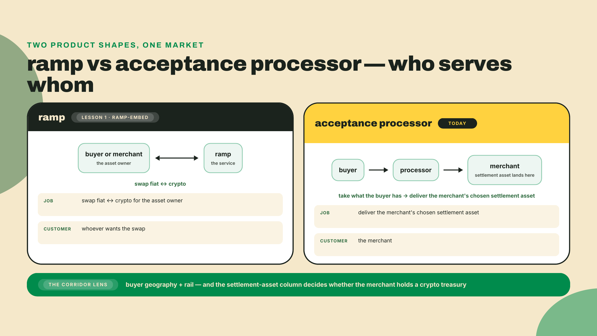
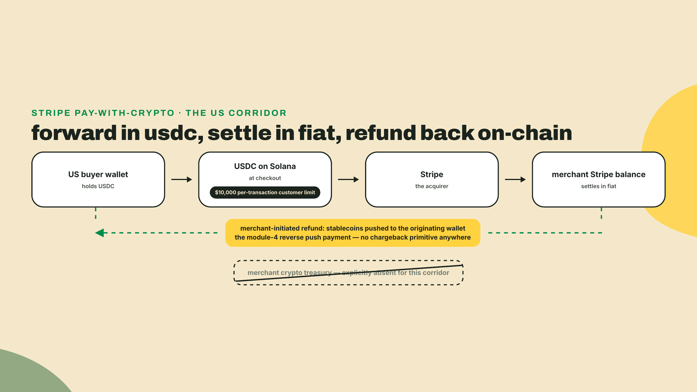
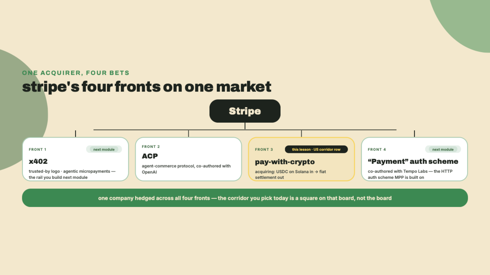
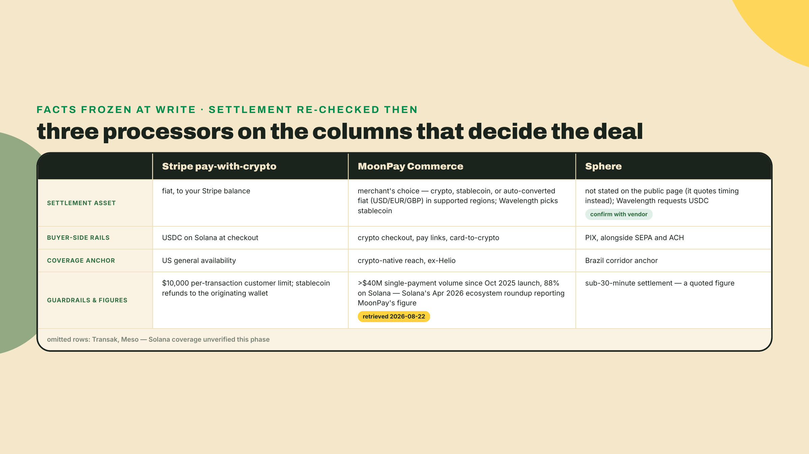
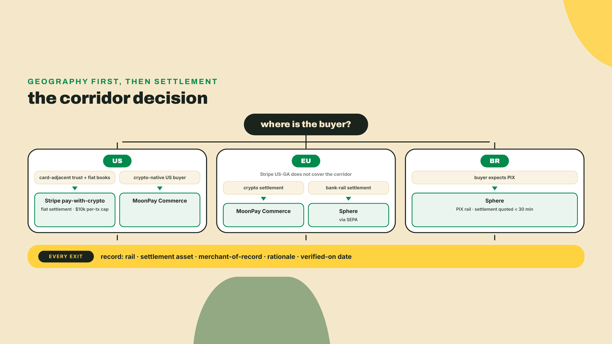
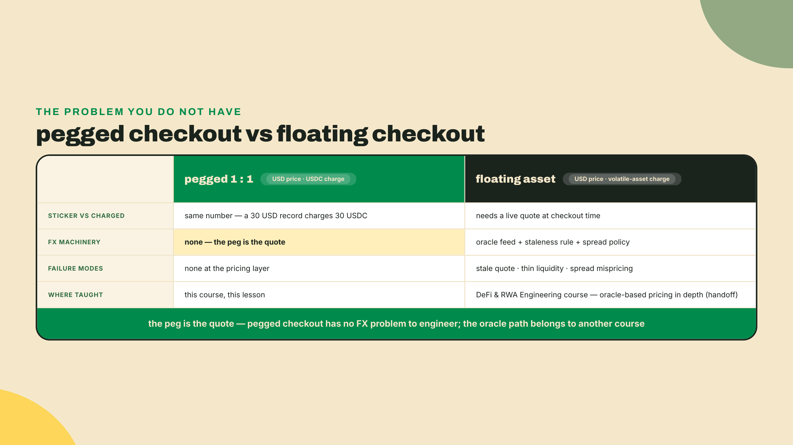
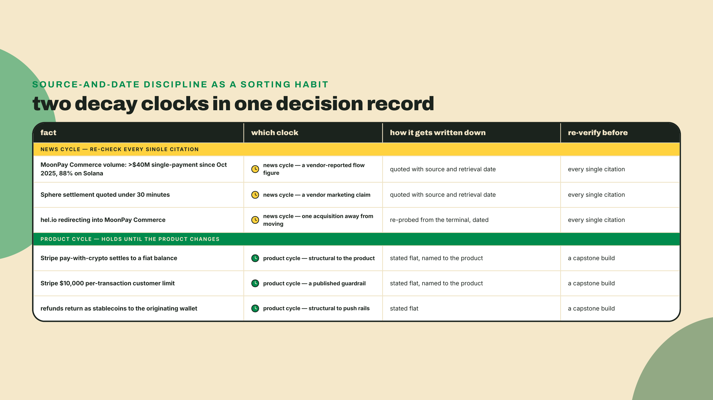
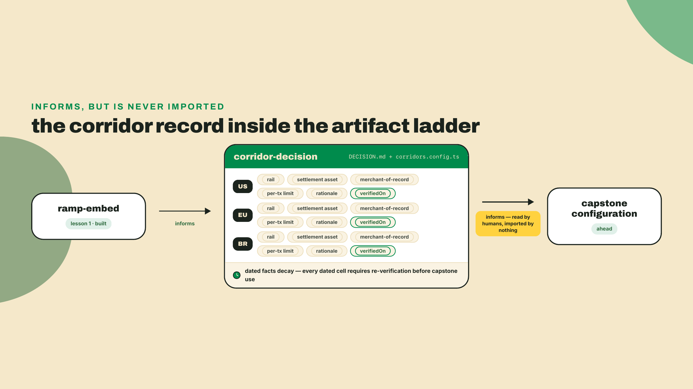

# Acceptance and corridors: Stripe, MoonPay Commerce, and PIX

## Summary

Last lesson you embedded a headless Coinbase onramp into the storefront and walked the hosted offramp for an artist's payout. Money moves in and out of Wavelength now, and you can say who is merchant-of-record at each seam. So the plumbing question is settled. Today's question is a market-structure question, and it is the one that decides whether the shop actually sells records: a US buyer holding a credit card, an EU buyer who lives on SEPA, and a Brazilian buyer who has not touched anything but PIX in years are three different problems behind one checkout button. Pick the wrong processor for a corridor and you either lose the sale outright or quietly eat the margin on every unit. That is the whole lesson: which rail for which buyer, and what you actually settle in.

Think of it the way a small label thinks about distribution. Nobody sane signs one worldwide-exclusive distributor for a vinyl pressing. You sign a US distributor who knows the US shops, an EU distributor who knows the EU shops, and a Brazilian distributor who knows Brazil, each on its own terms, each taking its own cut, each paying you on its own schedule. Acceptance processors are territory distributors for money. This lesson compares three of them on numbers, then makes you sign the deals in writing.

Before any of that, do one thing right now. The first fact in this lesson is checkable from your terminal, so check it. `curl` ships preinstalled on macOS and nearly every Linux distro (`brew install curl` if yours is the exception):

```bash
curl -sIL https://hel.io | grep -i '^location'
```

You should watch the redirect chain walk off Helio's old domain and land on a MoonPay property. If it lands somewhere else, an acquisition story moved again since this was written, and you have just learned the deepest rule of this lesson a step early: in payments, every vendor fact has a date on it.

The findings up front:

- **Stripe pay-with-crypto** accepts USDC on Solana at checkout and settles to your Stripe balance in fiat. US general availability, a $10,000 per-transaction customer limit, and refunds returned as stablecoins to the originating wallet, which is exactly the refund construction you built two modules ago, now running inside someone else's acquirer.
- **MoonPay Commerce** is the former Helio: checkout, pay links, card-to-crypto, with settlement configurable to crypto, stablecoin, or converted fiat. Wavelength turns that dial to stablecoin and keeps its treasury. Its volume figure is vendor-reported and moving, so we cite it with a source and a date, never as a constant.
- **Sphere** is the Brazil anchor: rails including PIX alongside SEPA and ACH, settlement quoted under 30 minutes.
- **The boundary that is not technical**: a five-question method for locating a corridor's regulatory line, run on Brazil as the worked case — two boundaries, two commencement dates, two diary deadlines, and a merchant flow that sits on the line rather than inside it.
- **Display pricing** for USD-priced records charged in USDC needs no oracle at all, because USDC is a USD peg charged 1:1. The volatile-asset case is named and handed off.
- The deliverable is the **corridor decision record**: a written three-row table plus a config skeleton, one rail per buyer geography, with settlement asset and merchant-of-record stated per row.

How the work is shared out: this is a concept lesson late in the course, so the ratio flips. We walk the three processors and the pricing logic together, with numbers. The decision record and the config skeleton are yours alone, no scaffold, because a corridor table someone else filled in decides nothing for you. It is a default, and defaults are how margins die.

## Three territories, three distributors

### An acceptance processor is not an onramp

First, a definition the ecosystem loves to blur, placed just in time. Last lesson's ramps move a buyer's fiat into crypto they own, or a merchant's crypto into fiat they own. The customer of a ramp is whoever wants the asset swapped. An **acceptance processor** sits somewhere else entirely: its customer is the merchant, and its job is to take whatever the buyer has and deliver whatever the merchant wants to hold, taking a fee for standing in the middle. A **corridor** is the pairing this lesson keeps scoring: a buyer geography plus the rail that reaches it. And the **settlement asset** is the thing that actually lands in your account at the end, fiat or stablecoin, which is the single most consequential column in today's table because it decides whether you run a crypto treasury at all.



Why does the distinction earn its own section? Because the most common misread in this market is looking at a merchant fiat-settlement product and describing it as "the store off-ramps its funds." It does not. When a processor settles you in fiat, your store never holds crypto for that sale, so there is nothing to off-ramp. The offramp you walked last lesson and the fiat settlement you will meet in a moment are different machines that happen to end in the same currency, and confusing them will make you build treasury infrastructure you do not need. I have watched teams do exactly that. It is not a small waste.

### Stripe: the fiat-settling acquirer

Start with the territory you already know how to think about, because you integrated Stripe in a previous life. Stripe pay-with-crypto accepts USDC on Solana at checkout and settles to your Stripe balance in fiat. It is generally available in the US. Sit with what that sentence does: the buyer pays in stablecoin on-chain, and the next morning your Stripe dashboard shows dollars, in the same balance your card sales land in, on Stripe's schedule. You keep your entire existing books, your accountant never learns what an ATA is, and the crypto leg becomes an implementation detail of the acquirer.

The guardrails tell you what Stripe thinks of irreversible money. There is a $10,000 per-transaction customer limit. And refunds are returned as stablecoins to the originating wallet, which should ring loudly: that is the reverse push payment you constructed by hand in the reconciliation lesson, the same originating-wallet rule, the same no-chargeback geometry. You did not arrive at that shape independently, and it would be flattering to pretend otherwise: the reconciliation lesson copied Stripe's precedent on purpose, because it was the only one that existed. What is new here is watching the same rule hold on a rail where the merchant never touches crypto at all, which tells you the originating-wallet return is a property of push money rather than a treasury preference you inherited. Take the $10,000 cap as the other half of the message: when Stripe bounds a rail that tightly, it is pricing the irreversibility you already know is there.



The economics of this deal are the economics of comfort. Fiat settlement spares you a crypto treasury, spares you the offramp seam, spares you every reconciliation question about holding stablecoins on a balance sheet. In exchange you accept the cap, the processor's settlement schedule, and a geographic footprint that is, per the facts frozen for this lesson, US general availability. Your EU buyer is not in that sentence. Your Brazilian buyer is nowhere near it. Re-probing Stripe's own docs on 2026-08-22 adds one live wrinkle worth carrying into your record without changing the row: buyers can pay from anywhere, it is the *business* location that is gated, and alongside US general availability Stripe lists the EU, Hong Kong, Mexico, and Switzerland in private preview. Private preview is a waiting list, not a corridor, so it does not earn a cell in a table you are going to ship against. Put it in your re-verify list instead, because it is exactly the kind of row that flips. And one distributor-contract clause matters here for the record shop: you remain merchant-of-record for the sale. Stripe is your acquirer, not the seller of your records. Hold that next to last lesson's seam map without flinching, because the two lessons are not disagreeing: there, Stripe's *onramp* put Stripe in the merchant-of-record seat, because the thing being sold was the crypto itself; here, the thing being sold is your record, and Stripe's *pay-with-crypto acceptance* is a different product in a different seat, acquirer for your sale. Same logo, two seats. Naming the product before naming the seat is exactly the discipline the seam map was installing. The buyer's beef about a warped pressing is with Wavelength, on this rail and on every rail in today's table.

One more thing about this particular distributor, because it explains the market you are operating in. Stripe currently holds a four-front position: it appears as a trusted-by logo for x402 (the HTTP-native standard for machine-to-machine payments you meet next module), it co-authored ACP, the Agentic Commerce Protocol for AI-agent checkout, with OpenAI, it co-authored the "Payment" HTTP authentication scheme that MPP is built on (the other machine-payments rail from next module), and it runs this USDC-on-Solana acquiring rail that settles fiat. A company that patient is telling you where it thinks payments are going. Hold that thought until the end of this lesson; the x402 front is the very next thing you build.



### MoonPay Commerce: the checkout with a settlement dial

Now the opposite deal. MoonPay Commerce is the former Helio, and you verified the acquisition yourself in the first five minutes: hel.io now redirects into MoonPay's commerce arm. The product shape is a crypto checkout with pay links and a card-to-crypto path, and here the settlement asset is a dial rather than a given: its own product page offers settlement in crypto, in stablecoins, or auto-converted to fiat (USD, EUR, GBP) in supported regions, checked 2026-08-22. That dial is the whole reason it earns a column. Turn it to fiat and you have bought a second Stripe with different geography; turn it to stablecoin, which is what Wavelength does, and the sale lands as tokens you hold, feeding the exact treasury and reconciliation machinery you built in module 4. Your reconciler, your ledger, your refund builder all keep their jobs. Write the dial's position into your record, not the vendor's name, because "we settle in USDC" is the decision and "MoonPay Commerce" is only where you configured it.

Here is where the numbers discipline this lesson keeps preaching gets its test case. The figure attached to this product, as Solana's April 2026 ecosystem roundup reports it, retrieved 2026-08-22, is that MoonPay Commerce reported over $40M in "single-payment" volume, the vendor's own label for one-off checkout payments as distinct from recurring, since its October 2025 launch, with 88% of it on Solana. Carry the label in quotes in your record, precisely because the vendor defined it. Notice everything I just did to that number. It has a source, and the source is a report of MoonPay's own reporting, so the chain has two links and you should say so. It has a retrieval date. It is a vendor-chosen figure, which is to say a flattering one, because vendors choose flattering numbers. And it is a flow figure for a young product, which means it will be stale by the time you read this, possibly by the time I finish the paragraph. The 88% share is genuinely useful signal about where crypto checkout demand lives. The $40M is a snapshot of a moving object. Your decision record cites numbers like this with source and date or it does not cite them at all, because a corridor table full of undated vendor figures is not research; it is a brochure with your name on it.

What does the crypto-settling deal cost? You hand the checkout UX and the fee schedule to the processor, and on the card-to-crypto leg the buyer is momentarily MoonPay's customer for the conversion, the same seam you mapped on the onramp last lesson, before the resulting tokens pay your invoice. In exchange you get corridor reach that does not depend on an acquirer's country list, settlement into an asset you already know how to reconcile, and pay links you can drop into a DM, which for a record shop doing preorder drops is a genuinely good fit. For completeness: Transak and Meso also circle this territory, and they stay named-only in this course because their Solana coverage went unverified when this lesson's facts were checked. An unverified distributor does not get a row in the table. Leaving it out is what makes the rest of the rows worth trusting.



### Sphere and the PIX corridor

Which brings us to the buyer both previous distributors leave standing at the register. Brazil's instant-payment rail is PIX, and I will spend my one piece of home-turf credibility here: at Superteam Brazil I watch payments land daily, and in São Paulo I can go months without seeing a physical card, because the street vendor, the barber, and the venue box office all take PIX from a phone. A Brazilian buyer reaching a checkout that offers only card fields does not think "inconvenient." They think "foreign," and a meaningful slice of them leaves. A corridor is not a nice-to-have for this geography; it is the difference between having Brazilian customers and having Brazilian visitors.

Sphere is the research's Brazil anchor. Its own site pitches far wider than one country, settlement in over 160 markets, and the reason it still enters this table as the Brazil pick is the rail rather than the market count: PIX is what a Brazilian buyer demands, and PIX is the rail Sphere carries that neither other row does, alongside SEPA and ACH, with a settlement figure quoted under 30 minutes. Note the verb, quoted. It is the vendor's number, so it travels with the same discipline as MoonPay's volume figure: date it, source it, and treat it as a claim you re-verify before the capstone, not a constant you inherited. But even discounted, under half an hour from a PIX buyer's tap to settled funds is a different sport from the multi-day international card settlement it replaces, and SEPA on the same roster quietly makes Sphere a candidate for your EU corridor too, not just Brazil. One cell the public page will not fill for you: Sphere quotes settlement *timing*, not settlement *asset*. Your decision record still needs that cell, so write down what Wavelength requests (USDC, to keep one treasury across EU and BR) and mark the cell confirm-with-vendor; a cell you cannot source is a cell you flag, never a cell you guess.

The trade-off is the mirror of the strength. Sphere earns the BR row because it carries the rail Stripe's crypto acceptance does not touch, and that is worth stating as the footgun it is, because I have seen the assumption in the wild: Stripe pay-with-crypto does not offer PIX. Stripe's crypto acceptance is stablecoin-network-based; PIX is Sphere's rail in this roster. Meanwhile nothing in Sphere's roster changes the US row, where the buyer wants acquirer-grade card-adjacent checkout, which was Stripe's whole territory. No distributor covers the map. Blame the map rather than the vendors: that asymmetry is exactly why the corridor decision record exists as a per-geography table instead of a one-line answer.



### The boundary that is not technical

One cell in the table you are about to sign is still marked confirm-with-vendor: what Sphere actually settles you in. Before you send that email, be honest about what kind of question you are holding. Nothing in your stack answers it. Whether a corridor may settle you in USDC at all is decided by texts published in an official gazette, texts that change on commencement dates rather than release cycles, and the discipline for handling them is the one you just applied to vendor numbers, run with more care because the downside is not margin. So here is that discipline as a method, and then one jurisdiction run through it for real.

Five questions, asked in this order, because each one scopes the next — though a live case often makes you answer question 3 first, as the Brazil run-through below does:

1. **Name the leg.** Never "we accept crypto" — which movement of value, from whom, to whom, in which asset? One corridor row hides several legs (buyer to processor, processor to you, the refund back out), and rules attach to legs, not to products.
2. **Name the actor, and its licence.** For each leg, who is actually moving the money, and what is it authorized as, where? "The processor handles it" becomes an answer only once you can say what the processor is licensed as in that geography.
3. **Ask how the regulator classifies your settlement asset.** Not how the vendor markets it — how the law defines it. The same USDC can be a virtual asset in one rulebook and something else in the next, and every obligation downstream keys off that classification.
4. **Ask each party's residency.** Cross-border and domestic flows sit under different rules, and the surprising direction is the one to check: some perimeters reach flows with no border in them at all.
5. **Date it and diary it.** Legal facts decay like vendor facts, except the decay is scheduled: commencement dates, filing windows, transition periods. Every answer gets the date you checked it, and the dates that will change the answer go in a calendar, not a footnote.

Now Brazil, because it is my home turf, because it is the table's BR row, and because it is the sharpest live example I know of a boundary that moved while a course was being written. I pulled every text cited below from the primary sources — the Diário Oficial da União for the central bank resolutions, Planalto for the statutes, the Câmara's own tracker for the bill — on 2026-09-02. That date matters more than my reading does; re-pull them before you rely on either.

**Question 3 first, because everything hangs on one word.** Lei 14.478/2022, art. 3º defines a virtual asset and explicitly excludes national and foreign currency from the definition. A dollar-referenced stablecoin is therefore, in Brazilian law, a virtual asset and not foreign currency, and that classification decides which rulebook the rest of this section lives in. You will also see PL 4.308/2024 cited around this topic, so place it precisely: it would change who may issue and distribute fiat-referenced tokens — a perimeter for issuance — and it does not touch the art. 3º classification in either the original text or the substitute approved in committee. It is also still a bill: as of 2026-09-02 it sits in a Câmara committee awaiting a rapporteur's report, not yet through its originating house. A bill is a diary entry, not a rule.

**Questions 1, 2, and 4: the boundary comes in two pieces, with two dates.** The first piece is Resolução BCB 521, of 10 November 2025, which wrote virtual-asset services into Brazil's foreign-exchange market by inserting arts. 76-A and 76-B into Resolução BCB 277. Those two articles are in force since 2026-02-02; the resolution's reporting machinery commenced later, on 2026-05-04, so date the article you are citing, not the resolution. Art. 76-A is the perimeter test, and it is wider than its international-sounding frame. Four activity buckets sit inside the FX market when a virtual-asset service provider — the texts say PSAV — is in the flow: international payment or transfer with virtual assets; transfers tied to international card use; transfers to or from a self-custodied wallet, expressly the ones with no international payment in them; and a PSAV's purchase, sale, or swap of fiat-referenced virtual assets, with "fiat" unqualified, so a BRL-referenced token is captured just like a USD one.

Read that third bucket again, because it is the sharpest check-don't-assume case I can hand you. A São Paulo buyer paying from a self-custody wallet, through a PSAV, to a São Paulo merchant crosses no border anywhere — and sits inside the FX perimeter anyway, because 76-A III reaches self-custody transfers whenever a PSAV is a leg. That is the default shape of a Solana-native checkout. If your instinct said domestic-therefore-outside, it just failed on the exact flow this course ships, and only reading the article catches it. The instinct fails in the other direction too: art. 76-B, which defines the international bucket, covers more than resident-pays-non-resident. A title change between two non-residents counts, and so does a same-owner move — a Brazilian resident sending their own stablecoin to their own wallet abroad is an international transfer under 76-B II with no counterparty in sight. Residency, question 4, has to be asked of every party, including yourself.

Two clauses of 76-A then do the merchant-specific work. Its §2º prohibits a PSAV's purchase or sale of virtual assets from being paid or received in foreign currency — note the operative form, a ban on a foreign-currency fiat leg rather than a command about what the fiat leg must be, and the difference is not pedantry: a prohibition leaves open what a mandate would close, and paraphrasing one into the other is how secondhand summaries go wrong. And §3º bars moving third-party funds through an in-scope virtual-asset service, with one carve-out: a PSAV serving an institution that is itself authorized in the FX market and acting for its clients. Now walk Wavelength's BR row through those clauses. A provider that takes your buyer's stablecoin and delivers value to you is, in the resolution's own definitional terms, buying a fiat-referenced virtual asset — bucket four, inside the perimeter — while moving funds in your interest, which is the thing §3º prohibits unless the provider stands inside that carve-out. So the intermediated merchant flow this very lesson's table routes is not comfortably inside the boundary. It is on it, and which side your provider stands on is exactly question 2, the licence question you now know to put to Sphere in the same email as the settlement-asset cell.

The second piece is Resolução BCB 561, of 30 April 2026, in force 2026-10-01 in a single, undivided commencement, aimed at eFX — Brazil's regime for international payment and transfer services. Its art. 50, I requires settlement between an eFX provider and its foreign counterparty to run through an FX operation or a non-resident's account in reais, with the use of virtual assets expressly barred. Keep the precision: this is not "eFX can't touch crypto" — the same resolution creates a purpose code for acquiring virtual assets through eFX. What it bans is the provider-to-foreign-counterparty settlement leg being denominated in virtual assets. A settlement-leg rule, in other words, aimed at exactly the column of your table that is still marked confirm.

**Question 5, the diary.** Two dates go in it, each attributed to its actual source, because arguing from the wrong normativo is its own failure mode. **2026-10-30** is the deadline for an incumbent PSAV to file for authorization, set by Resolução BCB 520, art. 88, I — expressed there as 270 days from the resolution's 2026-02-02 commencement; a provider that misses it must wind down within thirty days, and from that same date a separate rule in art. 91 bars Brazil's regulated institutions from dealing with PSAVs that are neither authorized nor in the authorization pipeline. **2027-05-31** is the deadline for eFX providers outside the resolution's enumerated-institution list to request authorization as payment institutions, per Resolução BCB 561, art. 56-B, with its own cease-within-thirty-days rule behind it. Both dates go next to the BR row with a note on what to re-ask when each passes. And when you send Sphere the confirm-the-settlement-asset email, ask in the same message which of these regimes it operates under and what it has filed, dated. A vendor that answers precisely has told you something. A vendor that answers "we're fully compliant" has also told you something.

To say it plainly one more time, in the same words lesson one of this module used: this is an engineering framing of where the seams sit, not legal advice, and a real money-services product ships with a real lawyer. What the five questions buy you is the ability to brief that lawyer in one page, with dates, instead of discovering the questions in the meeting, at the meeting's hourly rate.

### Display pricing: the oracle you do not need

One more piece of market structure before you sign anything, because it looks like a hard problem and the whole point is that, for this shop, it is not. Wavelength prices records in USD. Buyers pay in USDC. What is the exchange rate?

There isn't one, and that is the design. USDC is a USD peg, so the $30 August pressing from your catalog is charged as exactly 30 USDC, 1:1, no quote, no spread, no rounding policy. **Display pricing**, the price on the sticker, and the **charged amount**, the tokens that move, are the same number. This is precisely why the whole course has run on stablecoin rails: the peg deletes the FX problem at the checkout layer. So when you catch yourself sketching a price-feed integration for a USD-pegged stablecoin charged 1:1, stop. You would be building an oracle to discover a number the peg already promised you. I flag it because it is a real footgun with real victims: the pattern-matching brain sees "crypto payment" and reaches for "price feed" before checking whether anything actually floats.

Where display pricing does get interesting is the moment the charged asset floats against the sticker currency: pricing a record in SOL, or accepting a volatile token at checkout. Then you need a live price, a staleness rule, a spread policy, and an oracle you can defend, and that machinery is a genuine discipline with its own failure modes. It is also, deliberately, not this course's discipline. Oracle-based pricing — staleness windows, confidence intervals, spread policy — is DeFi and RWA Engineering territory, and your corridor record will note the handoff rather than smuggle in a half-taught version. A payments course that taught you a quarter of an oracle would be doing you no favor; the quarter you'd be missing is the quarter that loses money.



### The trade-off nobody escapes

Zoom out and score the three deals on one axis, because every corridor choice is the same trade in different proportions: coverage against cost and control. Fiat-settling acceptance buys you a simple treasury and books your accountant already understands, and charges you the cap, the processor's schedule, and its geography. Crypto-settling acceptance buys you your own treasury and rail-agnostic reach, and charges you the checkout UX and the fee schedule. The single-corridor specialist buys you a geography outright, and charges you every other geography. Run the toy shape on the $30 pressing sold three times, once per corridor: the US sale settles as fiat on Stripe's schedule minus Stripe's fee; the EU and BR sales land as 30 USDC each, minus each rail's own fee, in the module-4 treasury. Three sales, three fee schedules, two settlement assets, and after settlement your money is sitting in two different kinds of account under three different sets of terms. There is no configuration of today's market in which one processor wins all three rows on merit. Anyone who tells you otherwise is selling one of the rows.

Which is why the honest deliverable is a table and not a recommendation. And why the table itself decays: the coverage claims, the quoted settlement time, and the marketed volume in it are all dated snapshots of vendors in motion. A decision record without verification dates is wrong; it just has not told you when.

Not everything in it decays at the same speed, though, and sorting the facts by their clock is what the lab asks you to do first.



## Lab: sign the distribution deals

Time to write it down. The artifact is `corridor-decision`: a decision record plus a config skeleton. Deliberately not importable code. Nothing in the capstone will `import` this file; the capstone team, meaning you in three modules, will read it and configure accordingly. It consumes `ramp-embed` in the honest sense that its rows must agree with the ramp seams you mapped last lesson.

**Step 1: scaffold.** From the `wavelength` root, the same workspace root every module has built in:

```bash
mkdir -p corridor-decision
cd corridor-decision
touch DECISION.md corridors.config.ts
```

**Step 2: re-run the probe and date it.** You ran the `hel.io` redirect check in the opening. Paste the command and its output into `DECISION.md` under a heading called `Verified facts`, with today's date next to it. Then add the other moving numbers you will cite, each with source and date: the MoonPay Commerce volume figure (over $40M single-payment since the October 2025 launch, 88% on Solana, as reported in Solana's April 2026 ecosystem roundup, retrieved 2026-08-22), and Sphere's quoted sub-30-minute settlement (spherepay.co: settlement "in under 30 minutes in over 160 markets", retrieved 2026-08-22). Frozen structural facts like Stripe's fiat settlement, the $10,000 per-transaction limit, and stablecoin refunds to the originating wallet go in a separate list, because they change on product cycles, not news cycles. The two lists decaying at different speeds is the reason they are two lists.

**Step 3: fill the three rows.** In `DECISION.md`, write the table the assessment asks for: US, EU, BR down the side; rail, settlement asset, merchant-of-record across the top; one line of rationale per row. Argue with the flowchart above, not from it. If you route the EU through Sphere's SEPA rail instead of MoonPay Commerce, good, defend it in the rationale line. The record is yours; the requirement is that every cell is a decision you can speak for out loud.

**Step 4: encode the skeleton.** The config file makes the record legible to future-you without pretending to be a library. TypeScript is already a devDependency of the course repo from module 2's `npm install`, pinned there at `^5.6.0`; outside the repo, `npm i -D typescript` gets you the compiler, and a bare install today lands on the 7.x line (npm `latest` was 7.0.2 on 2026-08-22). Either works here, because this file imports nothing and uses no syntax newer than 5.x. That version drift is itself the lesson: like every pin in this course, the number in `package.json` ages, and the tag called `latest` moves under it.

```ts
// corridor-decision/corridors.config.ts
// Decision record skeleton. Read by humans configuring the capstone; imported by nothing.

export type Corridor = 'US' | 'EU' | 'BR';

export type Rail = 'stripe-pay-with-crypto' | 'moonpay-commerce' | 'sphere';

export type SettlementAsset = 'fiat-via-processor' | 'usdc';

export interface CorridorDecision {
  corridor: Corridor;
  rail: Rail;
  settlementAsset: SettlementAsset;
  /** Who the buyer's contract of sale is with. For every rail in this roster,
   *  Wavelength remains merchant-of-record for the record itself; conversion
   *  legs (e.g. card-to-crypto) briefly interpose the processor, per lesson 1. */
  merchantOfRecord: 'wavelength';
  /** Processor-imposed per-transaction ceiling in USD, or null if none stated. */
  perTxLimitUsd: number | null;
  /** One sentence you are prepared to defend to an accountant. */
  rationale: string;
  /** ISO date every moving fact in this row was last checked. Stale row, stale decision. */
  verifiedOn: string;
}

export const corridors: readonly CorridorDecision[] = [
  {
    corridor: 'US',
    rail: 'stripe-pay-with-crypto',
    settlementAsset: 'fiat-via-processor',
    merchantOfRecord: 'wavelength',
    perTxLimitUsd: 10_000,
    rationale:
      'US buyers get acquirer-grade checkout; fiat settlement keeps US books processor-side; refunds return as stablecoins to the originating wallet.',
    verifiedOn: '2026-08-22',
  },
  {
    corridor: 'EU',
    rail: 'moonpay-commerce',
    settlementAsset: 'usdc',
    merchantOfRecord: 'wavelength',
    perTxLimitUsd: null,
    rationale:
      'Stripe pay-with-crypto is US-GA; crypto settlement keeps EU sales in the module-4 treasury; Sphere SEPA is the recorded alternative.',
    verifiedOn: '2026-08-22',
  },
  {
    corridor: 'BR',
    rail: 'sphere',
    // Sphere's public page quotes settlement timing, not asset; 'usdc' here is
    // Wavelength's REQUESTED setting, flagged confirm-with-vendor before capstone.
    settlementAsset: 'usdc',
    merchantOfRecord: 'wavelength',
    perTxLimitUsd: null,
    rationale:
      'Brazilian buyers expect PIX; Sphere carries PIX alongside SEPA and ACH with settlement quoted under 30 minutes; one treasury asset across EU and BR.',
    verifiedOn: '2026-08-22',
  },
];
```

Those three rows are my deals, not the answer key. Yours may differ, and a differing row with a sharper rationale line beats agreement with mine every time.

**Step 5: prove it compiles.** A skeleton nobody type-checks rots into prose:

```bash
npx tsc --noEmit corridors.config.ts
```

Silence is success. If the compiler objects, read the error; the type surface is small enough that every failure here is a real inconsistency in your record, which is the entire reason the skeleton is typed instead of being a second markdown file.

**Step 6: close the loop with the ramps.** Add a final section to `DECISION.md` titled `Seams with ramp-embed`, and answer in two or three sentences: on which corridors does last lesson's onramp still matter (a crypto-settling corridor still needs buyers who hold USDC or a card-to-crypto leg), and on which corridor does the artist-payout offramp interact with your settlement asset choice? If your US row settles fiat via the processor, notice what you never do for those sales: off-ramp. Writing that sentence down is the cheapest inoculation against the fiat-settlement misread this lesson opened with.



## Challenge

The gate for this lesson is the record itself, held to the assessment's shape. Produce the corridor decision record for Wavelength's US, EU, and Brazil buyers: a three-row table with columns rail, settlement asset, and merchant-of-record, one line of rationale per row, plus the compiling config skeleton. Accept bar: every row names all three columns explicitly; every moving figure you cite anywhere in the record carries a source and a date; the Stripe row states the $10,000 limit and the stablecoin-refund path; the BR row can say in one sentence why PIX is non-negotiable for that corridor; `npx tsc --noEmit` stays silent.

Then the stretch, which is where the lesson's real muscle gets built: adversarial review of your own table. For each row, write the one-sentence case for the rail you did not pick. If you cannot write a genuine case for the alternative, you did not make a decision, you made a guess that happened to land on a defensible square. And run the staleness drill: mark which cells of your table you would bet still hold in six months, and which you would re-verify before betting lunch. The marketed volume figure and the quoted settlement time should not survive that sort unmarked. If they did, reread the MoonPay section.

## Checkpoint, and the next customer at the door

You should now be able to look at any acceptance pitch and locate it on two axes in about ten seconds: what does the merchant settle in, and which corridors does it actually reach. That reflex, plus the discipline of dating every vendor number, is worth more than any specific row of today's table, because the rows will drift and the axes will not. If the lesson worked, the phrase "we support crypto payments" now sounds to you like a distributor saying "we ship records," and your immediate response is: to which territories, settling in what, on whose paper. That is the market-structure instinct this module exists to install, and if writing the rationale lines felt harder than reading the comparisons, good. It is supposed to. The reading was the cheap part.

Where the shop stands: money in, money out, and now every human buyer geography mapped to a rail with the terms in writing. Which surfaces the strange thing about the next customer at the door. They do not have a geography. They do not have a card, a bank, or a PIX key, and they will never see your checkout page, because the next customers are not human at all: agents and machines paying per API call, thousands of times, in amounts too small for any processor in today's table to bother with. Wavelength's pressing-price API is about to get a paywall whose buyers are bots, and the rail for that is the one Stripe's four-front position kept hinting at. Next module: x402.
