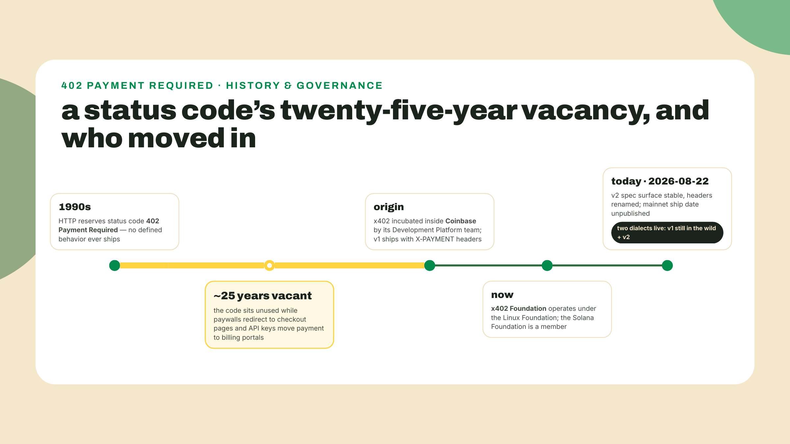
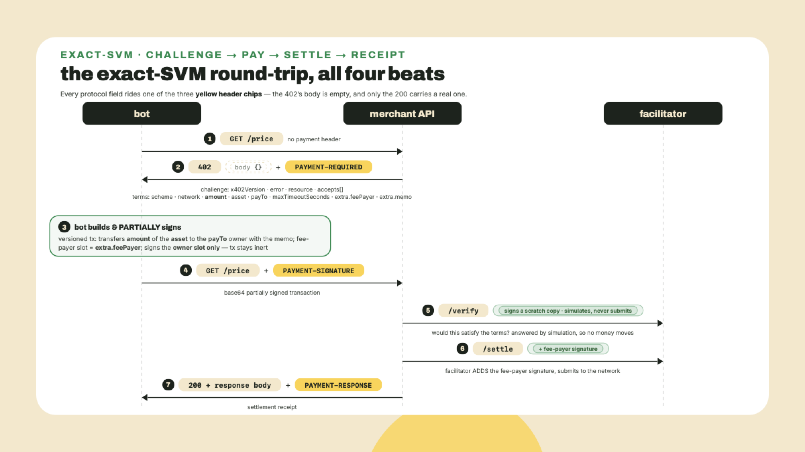
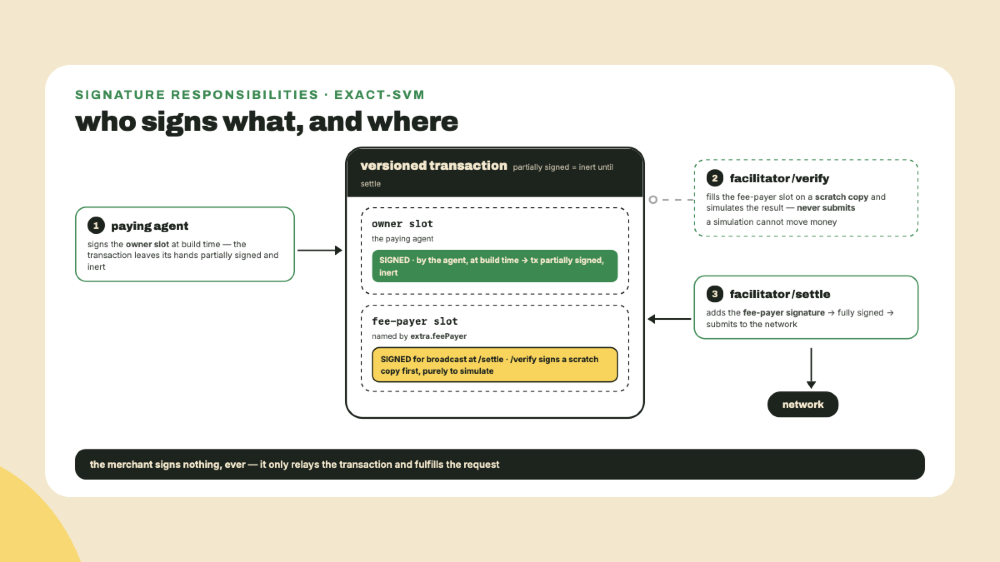
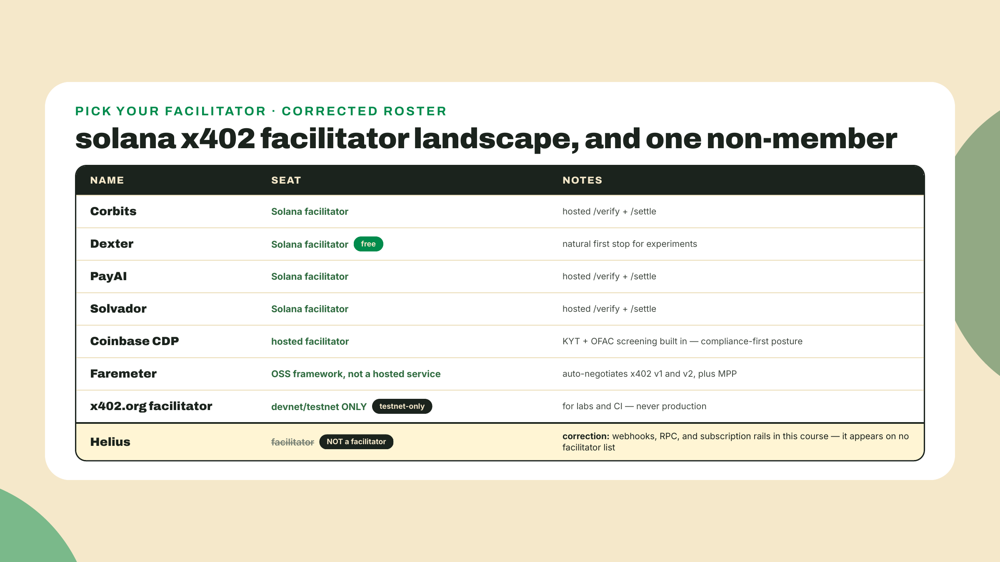
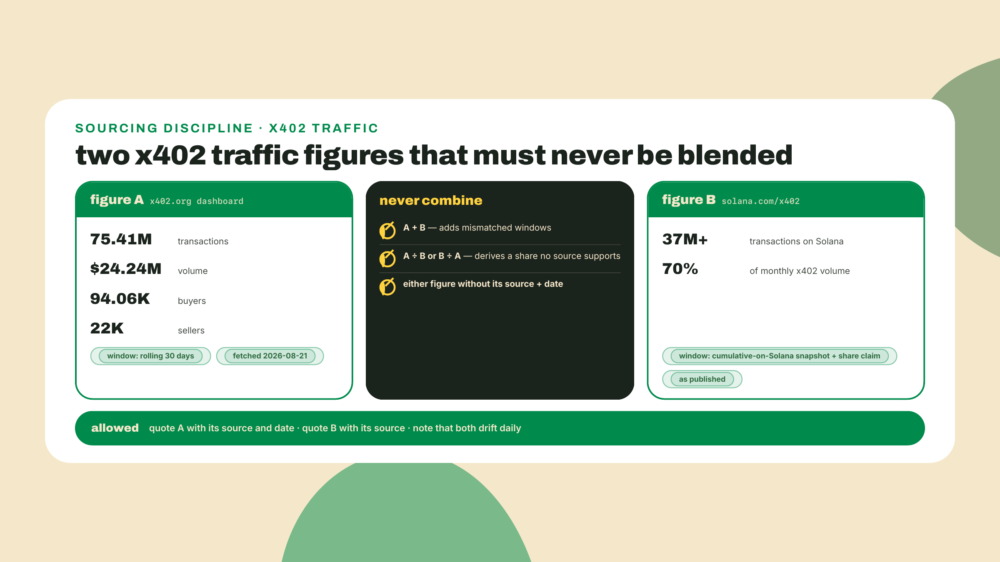
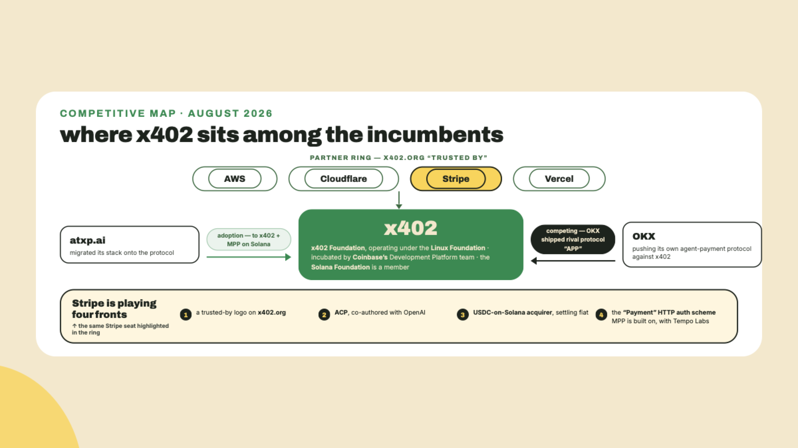

# HTTP 402, revived: the x402 protocol

## Summary

You just compared fiat corridors and wrote Wavelength's corridor decision record for its US, EU, and Brazil buyers. Every customer so far has been a human holding a phone. This lesson, the customer stops being human.

Here is the scene. An API answers a request with HTTP 402 Payment Required, a status code that sat dead for twenty-five years. This time the caller is not a human clicking a paywall but a bot: it reads the 402, pays, and retries the exact same request, all before the next line of your log. Nobody clicked anything. The protocol that makes that round-trip work is called x402, and by the end of this lesson you can read its v2 traffic like a native.

What you take away today, up front:

- The x402 v2 surface at spec level: the three headers that carry the entire exchange, PAYMENT-REQUIRED, PAYMENT-SIGNATURE, and PAYMENT-RESPONSE, plus CAIP-2 network ids, four schemes, three transports.
- The exact-SVM flow end to end: who builds the transaction, who partially signs, and why a facilitator adds the last signature and submits.
- The Solana facilitator landscape, including one correction to a guess you will hear repeated: Helius is not a facilitator.
- Source discipline for x402 traffic numbers, because two published figures beg to be blended into one wrong stat.

Concept lesson, so the lab hands you a scaffold and keeps every judgment call yours; next lesson the training wheels come off when you build the agent that pays. Before any theory, stand up a fake 402 endpoint to poke at. Node is on your machine from module 2, where the `@solana-program/*` clients set the floor at Node 24; today's mock imports nothing but Node's built-in `node:http`, and curl ships with macOS and Linux:

```bash
mkdir -p ~/wavelength/x402-lab && cd ~/wavelength/x402-lab
node --version
```

Keep that terminal open. In about four minutes it will be speaking the same status code your pressing-price API will speak for money.

## The four-hundred-two, demystified

### Why a dead status code came back

HTTP has carried a slot for payments since the nineties. Status code 402, Payment Required, was reserved in the earliest HTTP specs and then never given a defined behavior: a lot zoned commercial that nobody built on for twenty-five years. Every attempt to monetize an HTTP endpoint routed around it instead. Paywalls redirect you to a checkout page. API keys move the payment to a billing portal and a credit card on file. Both patterns share one assumption: somewhere in the flow, a human with a browser will show up to type things.

Agentic commerce breaks that assumption. When the caller is a program, a checkout page is a dead end; there is no one to click it. What a machine caller needs is a payment challenge inside the HTTP round-trip itself: a machine-readable answer to "this costs money" that carries everything needed to pay, so the caller can settle and retry without ever leaving the protocol. That is precisely the hole 402 was zoned for, and x402 is the protocol that finally built on the lot. The honest one-line collapse: x402 is a paywall header with a receipt. The server says "payment required, here are the terms" in one header, the client resends the request with proof of payment in a second, and the server answers with the goods plus a settlement receipt in a third. Three headers, one round trip, and the payment side of the exchange never touches a response body at all. Everything else in this lesson is the detail behind those three beats.

The governance behind the spec is worth thirty seconds, because it tells you this is infrastructure, not a startup's SDK. x402 originated inside Coinbase, incubated by its Development Platform team, and has since moved into an x402 Foundation that operates under the Linux Foundation. The Solana Foundation joined it. That trajectory, from one company's experiment to neutral-home stewardship, is the standard path for protocols that intend to outlive their creators.



One dating caution before the mechanics, since you will meet version numbers immediately: the v2 spec is what we teach here because its surface is stable, but its mainnet ship date is unpublished as of this writing (2026-08-22), and v1 is still live in the wild. You are learning the current spec while the deployed world straddles two versions. Hold that thought; it becomes a real interop footgun below.

### The v2 surface: headers, networks, schemes, transports

Start with the names on the wire, because v2 moved the entire conversation into headers and mixing them up produces silent failures. In v1, the client's proof of payment traveled in a header called X-PAYMENT, and the server's settlement receipt came back in X-PAYMENT-RESPONSE. The X- prefix convention has been formally discouraged in HTTP for over a decade, and v2 retired both names: the request header is now PAYMENT-SIGNATURE, and the response header is PAYMENT-RESPONSE. Same jobs, new names.

The third header is not a rename, it is a relocation, and it is the one that catches people. In v1 the challenge itself, the terms of payment, arrived as the JSON body of the 402 response. In v2 it does not. The server serializes the challenge to JSON, base64-encodes it, and sets it as a response header named PAYMENT-REQUIRED; the body of a v2 402 is two bytes, `{}`, under a `Content-Length: 2`. The v2 HTTP transport document is blunt about why: response bodies are a server implementation concern, and all x402 protocol information is communicated through the three headers. So take this as a rule and apply it to every x402 response you ever inspect: **read the header, never the body.** That holds on the opening challenge, on a payment the facilitator rejected, and on a settlement that failed; the body is empty in all three cases, and everything you want to know, including why the request failed, is sitting in a header.

The footgun now writes itself twice. A client that sends X-PAYMENT to a v2 server is speaking last year's dialect, and the server sees a request with no payment proof at all: it answers 402 again, your agent pays again, and you spend an afternoon learning what this paragraph just told you. And a client that parses the 402's body looking for terms finds an empty object, concludes the server is broken, and spends that same afternoon debugging a server that is behaving perfectly.

Next, how a payment names its chain. x402 is deliberately multi-chain, so the `network` field in its payment terms uses CAIP-2 network ids, a chain-agnostic naming standard in which every network gets an id of the form `namespace:reference`. Solana networks live under the `solana:` namespace with a reference derived from the cluster's genesis hash. The practical takeaway for a payments engineer: never assume a 402 is asking for payment on the chain you expect. Read the `network` field, match it against the CAIP-2 id you intend to pay on, and refuse anything else. Cheap check, real protection.

Above the wire format sit two axes of variety. First, four payment schemes, which answer "what shape does the payment take":

- **exact**: pay a precise amount per call, settled per call. The metered-API scheme, and this lesson's focus.
- **upto**: authorize up to a ceiling, settle what was actually used.
- **auth-capture**: the card-rails pattern you know from module 1, authorization now, capture later, as a first-class scheme.
- **batch-settlement**: accumulate many small obligations and settle them together.

Second, three transports, which answer "what protocol carries the challenge": plain **http**, which you have been picturing all along; **mcp**, the Model Context Protocol that agent frameworks use for tool calls; and **a2a**, agent-to-agent messaging. The scheme-times-transport grid is why the spec reads bigger than it feels. Your merchant seat cares about one cell today: the exact scheme over http, targeting the SVM. The spec calls that combination exact-SVM.


### One request, end to end: the exact-SVM flow

Now follow one call all the way through, because the flow is where x402 stops being a spec and starts being a payment system. Picture next lesson's setup a rung early: Wavelength's pressing-price API quotes vinyl pressing costs, and a distributor's procurement bot wants a quote.

**Beat one, the challenge.** The bot calls `GET /price`. The server answers 402 with an empty body and a PAYMENT-REQUIRED header; base64-decode that header and you have the challenge, machine-readable. Three fields sit at its top level. `x402Version` is the integer `2`, and it is how you tell which dialect you are reading before you touch anything else. `error` is a string saying why this 402 happened, which on the opening challenge is just a restatement that payment is required and on a rejected payment is the actual failure reason. `resource` is an object naming what the caller was trying to buy, its `url`, `description`, and `mimeType`.

Under those sits `accepts`, an array of one or more PaymentRequirements objects, the terms of payment themselves, and this is where the rest of the lesson keeps returning: `scheme` ("exact"), `network` (a CAIP-2 id), `amount` (a base-unit amount string; you learned in module 2 why money travels as integer base units, and note the name, because v1 called this same field `maxAmountRequired` and you will meet both), `asset` (the mint of the token that settles the payment, USDC for us), `payTo` (the merchant's owner address, not a token account), `maxTimeoutSeconds` (how long the server will hold these terms open for payment to complete), and an `extra` object with two members that make the SVM flavor work. `extra.feePayer` names the account that will pay the transaction fee, and it is not the bot. `extra.memo`, capped at 256 bytes, carries the invoice id the merchant will use for reconciliation; ours would say something like `WVL-PRESS-0042`, and when the settled transaction lands on chain, that memo is how your back office matches payment to order. You built exactly this reconciliation pattern with the verifier in module 4; x402 just standardizes where the id rides.

**Beat two, the payment.** The bot reads the terms and builds a versioned Solana transaction that transfers `amount` of `asset` to the `payTo` owner, with the memo attached, and with the fee-payer slot set to the account named in `extra.feePayer`. Then it does something that deserves its own definition, because it is the hinge of the whole design. A Solana transaction lists every account that must sign it, and it is inert until all of them have. **Partial signing** means signing your own required slots and leaving someone else's empty: the bot signs as the token owner authorizing the transfer, but it cannot sign as the fee payer, because the fee payer is somebody else's key. What the bot holds now is a transaction that is complete in every detail and valid in none, like a contract with one signature line still blank. It base64-encodes that partially signed transaction and retries the original request with it in the PAYMENT-SIGNATURE header.

**Beat three, the settlement.** The server does not touch the chain itself. It forwards the payload to a **facilitator**, a service that exposes two endpoints. `/verify` inspects the partially signed transaction and answers a question: if this were completed and submitted, would it satisfy the payment terms? Right amount, right asset, right network, right recipient, memo intact. Against the pinned SDK (`@x402/svm` 2.23.0), it answers by rehearsing, not just reading: the verifier fills the fee-payer slot on its own copy and *simulates* the completed transaction against current chain state. Signed, yes — submitted, never; a simulation moves no money and spends no fee. Then `/settle` does the irreversible part: the facilitator adds the missing fee-payer signature, the one matching `extra.feePayer` from beat one, and submits the now fully signed transaction to the network. The bot paid the price; the facilitator paid the fee. That is fee sponsorship, the same economic move you will meet again in module 8's gasless checkout, packaged here as protocol infrastructure.

**Beat four, the receipt.** Settlement confirmed, the server finally does what the bot asked for in the first place: it answers 200 with the quote, plus a PAYMENT-RESPONSE header carrying the settlement details. The bot got its data, the merchant got paid, and the whole exchange fit inside one retried HTTP request. No account creation, no API key issuance, no card on file. From your log's point of view, a 402 followed milliseconds later by a 200.



The signature choreography is the part people get wrong on first read, so pin it down. The client signs as owner and never as fee payer. `/verify` never submits: it fills the fee-payer slot on a scratch copy purely to simulate, and a simulation cannot move money. `/settle` is the only broadcast: fee-payer signature on, transaction out. If you can recite that sentence, you can debug half of the confused x402 threads you will ever read.



One number you will not find here, on purpose. The spec mandates that the settle transaction carry ComputeBudget limit instructions, and it bounds the compute-unit price, but it states no compute-unit count for a settlement, none. A "roughly 20,000 CU per settle" figure circulates anyway, and when we chased it while researching this course it came apart in the reader's favor: the 20,000 is real but it is not a cost. It is `DEFAULT_COMPUTE_UNIT_LIMIT` in the reference SDK (`@x402/svm` 2.23.0, read 2026-08-22), the ceiling the client requests when it prepends the SetComputeUnitLimit instruction, which is a budget you ask for, not a bill you pay. Quoting it as consumption is like quoting your credit limit as your rent. So this lesson prints no CU cost for the settle transaction, and neither should your API docs. If a number matters to you, measure it on your own settled transactions and date the measurement. Any absolute you print needs an independent, dated source, or it should not be printed. That rule is about to do heavier lifting in the traffic section.

### The facilitator you must trust

Time to be adults about the trade-off, because the demystified version of x402 cannot be "and then magic settles it." The facilitator is a third party standing inside your payment path, and you should see the trust surface with no soft focus. It sees every transaction before submission. It holds the fee-payer key, which means it decides what gets submitted at all: a facilitator can refuse to settle, which is censorship when you are on the wrong end of it, and the hosted ones run KYT screening, transaction-level compliance checks, by design. This is not a flaw someone forgot to fix. Fee sponsorship requires a fee payer, verification requires an inspector, and putting both in one service is what makes the bot's side of the flow one header. You are buying convenience with trust, the oldest trade in payments. Your corridor decision record from last lesson made the same trade explicit for fiat ramps; the facilitator column belongs in the same table.

Scheme fit is the second honest limit. exact is per-call settlement on chain, which is exactly right for a metered API where each call is worth real money, and exactly wrong for high-frequency streaming, thousands of sub-cent events per minute, where per-call chain settlement overhead dominates the payment itself. When the per-call fit breaks, that is what the upto and batch-settlement schemes exist for. Match the scheme to the metering, not the other way around.

So who are the actual facilitator options on Solana? Here is the landscape, and it contains one correction worth naming loudly. Early planning notes for this course guessed Helius would be on this list. It is not: Helius appears on no facilitator roster, and its jobs in this course stay what they have been, webhooks, RPC, and the subscription rails from module 5. The list that exists:

- **Corbits**, **PayAI**, and **Solvador**: Solana facilitators, each running the /verify-and-/settle service.
- **Dexter**: same seat, and free, which makes it the obvious first stop for a small merchant's experiments.
- **Coinbase CDP**: the hosted incumbent option, with KYT and OFAC screening built in. If your compliance posture requires a screened settlement path, this is the one designed for that requirement; if censorship-resistance is your priority, the same feature reads as a bug.
- **Faremeter**: not a hosted facilitator but an open-source framework, and notable for auto-negotiating v1 and v2, plus MPP (the Machine Payments Protocol, the HTTP-auth payment family whose Solana method spec the Foundation authors, which you will gate alongside x402 in two lessons). Remember the two-dialect world from earlier? Faremeter is the adapter for living in it.
- **The x402.org facilitator**: devnet and testnet only. Perfect for the lab you are about to run, and a trap if you wire production against it.



How do you choose? The same way you chose corridors last lesson: name the constraint that dominates. Compliance-screened settlement required, CDP. Zero budget and mainnet, the free seat, Dexter, after your own diligence on it. Mixed v1 and v2 counterparties, Faremeter in front of whichever facilitator settles. Test rig, x402.org's, and nothing else. There is no all-around winner, which is the healthiest possible sign for a landscape this young.

### Reading the traffic without inventing numbers

x402 stopped being a curiosity in 2026, and the numbers are genuinely large. They are also published in two different windows on two different pages, and the single most common analytical sin in agentic-payments commentary is blending them. You are going to learn both figures with their sources stapled on, because a payments engineer who misquotes volume numbers burns credibility that is slow to rebuild.

Figure one, from the x402.org dashboard, a rolling 30-day window, fetched 2026-08-21: 75.41 million transactions, 24.24 million dollars in volume, 94.06 thousand buyers, 22 thousand sellers. Sit with the shape of that for a second, because the shape is the story. Divide volume by transactions and the average payment is around 32 cents. That is not people buying records; that is machines buying API calls, exactly the per-call micropayment traffic the exact scheme was designed for. Roughly ninety-four thousand buyers against twenty-two thousand sellers tells you the buyer side outnumbers the sellers four to one, and honestly, that is all it tells you: a buyer count says nothing about concentration, a handful of heavy bots could still be driving most of those 75 million calls, and the dashboard does not publish that cut. Note what the number cannot support before you quote it.

Figure two, from solana.com's x402 page: 37 million or more transactions on Solana, and a claim that Solana carries 70 percent of monthly x402 volume. Different page, different window, different metric: that reads as a cumulative-on-Solana snapshot with a market-share claim attached, not a 30-day rolling total.

Now the discipline, stated as a rule you can enforce in a doc review. Quote each figure with its own source and its own date, and never combine them. Do not add them; 75.41M plus 37M equals a number no source on earth supports. Do not divide one by the other to derive a share; the windows do not match. And date everything, because both are live dashboard numbers that drift daily; the figures above were true on 2026-08-21 and are already stale as you read this. If two numbers were not measured in the same window by the same source, they do not belong in the same arithmetic. That sentence is the whole rule.



Who is standing behind this traffic matters as much as its size. The x402.org partner roster includes AWS, Cloudflare, Stripe, and Vercel, which is the infrastructure establishment, not a crypto-native cheering section. Migration stories have started: atxp.ai moved its stack to x402 plus MPP on Solana. And competition has arrived in the most flattering form, with OKX shipping a rival machine-payments protocol it calls APP. Standards that nobody uses do not get competitors.

Stripe deserves its own beat, because its position is the clearest signal anywhere of where incumbents think this goes. Count its fronts. It is on the x402.org trusted-by roster. It co-authored ACP, the agentic checkout spec, with OpenAI. As you saw in module 6's corridor work, it operates a USDC-on-Solana acquirer that settles merchants in fiat. And with Tempo Labs it co-authored `draft-httpauth-payment-00`, the "Payment" HTTP authentication scheme that MPP is built on, which you meet in two lessons. One incumbent, four seats at four different tables of machine-native commerce. Stripe is not betting on a winner; it is buying the whole race card. For Wavelength the reading is simpler and more useful: the rails you are learning this module are the same rails the largest payments incumbent on earth is positioning around, and your pressing-price API will speak the open-protocol version of them next lesson.



## Lab: annotate a 402 like the spec is watching

The gate for this lesson is annotation, not construction: take a v2-shaped 402 response and label every header and every PaymentRequirements field with its role, then state who signs at /verify versus /settle. You will generate the response yourself from a mock server, so you also feel the round-trip from the server's chair. The scaffold is given; every annotation is yours.

1. In the `~/wavelength/x402-lab` directory from the top of the lesson, create `x402-mock.mjs`. This is a teaching stub of the pressing-price API's payment layer: it speaks the full v2 challenge envelope, the three top-level fields plus a seven-field PaymentRequirements, over the three v2 headers. It verifies nothing; a real facilitator does the checking in production, and the spec remains the source of truth for the wire format.

```js
// x402-mock.mjs - a v2-shaped 402 teaching stub. Zero dependencies.
import { createServer } from "node:http";

// The challenge. In v2 this never travels in the body: it is JSON, base64'd,
// and set as the PAYMENT-REQUIRED response header.
const paymentRequired = {
  x402Version: 2, // which dialect this challenge speaks
  error: "Payment required", // WHY the 402 happened; the only place a reason appears in the challenge
  resource: {
    // what the caller was trying to buy
    url: "http://localhost:4021/price",
    description: "Wavelength pressing-price quote",
    mimeType: "application/json",
  },
  accepts: [
    {
      scheme: "exact",
      network: "solana:5eykt4UsFv8P8NJdTREpY1vzqKqZKvdp", // CAIP-2: solana namespace + mainnet genesis-hash reference
      amount: "10000", // base units: 0.01 USDC at 6 decimals
      asset: "EPjFWdd5AufqSSqeM2qN1xzybapC8G4wEGGkZwyTDt1v", // USDC mint
      payTo: "MerchantownerPubkeyGoesRightHere11111111111", // the merchant OWNER; the scheme derives the ATA
      maxTimeoutSeconds: 300, // how long these terms stay payable
      extra: {
        feePayer: "FaciLitatorFeePayerPubkeyGoesRightHere11111", // stand-in: the sponsor who signs LAST
        memo: "WVL-PRESS-0042", // invoice id for reconciliation; 256-byte ceiling
      },
    },
  ],
};

const b64 = (value) => Buffer.from(JSON.stringify(value)).toString("base64");

createServer((req, res) => {
  const proof = req.headers["payment-signature"]; // Node lowercases incoming header names
  if (!proof) {
    res.writeHead(402, {
      "Content-Type": "application/json",
      "Content-Length": "2",
      "PAYMENT-REQUIRED": b64(paymentRequired),
    });
    res.end("{}"); // the body is empty on purpose; everything is in the header
    return;
  }
  // A real server forwards `proof` to a facilitator: /verify inspects, /settle signs + submits.
  // This stub accepts anything, so the header choreography is visible end to end.
  const receipt = b64({
    success: true,
    transaction: "5xSettLedSignatureStandin",
    network: paymentRequired.accepts[0].network,
    payer: "AgentPubkeyStandin111111111111111111111111",
  });
  res.writeHead(200, { "Content-Type": "application/json", "PAYMENT-RESPONSE": receipt });
  res.end(JSON.stringify({ quote: { sku: "12in-180g-black", unitPriceUsd: 7.4 } }));
}).listen(4021, () => console.log("mock pressing-price API on :4021"));
```

2. Run it, then play the bot's first beat from a second terminal:

```bash
node x402-mock.mjs
```

```bash
curl -i http://localhost:4021/price
```

```text
HTTP/1.1 402 Payment Required
Content-Type: application/json
Content-Length: 2
PAYMENT-REQUIRED: eyJ4NDAyVmVyc2lvbiI6MiwiZXJyb3IiOiJQYXltZW50IHJlcXVpcmVkIiwicmVzb3VyY2Ui...
Date: Fri, 21 Aug 2026 16:41:09 GMT
Connection: keep-alive
Keep-Alive: timeout=5

{}
```

Sit with that screenful: a 402, two bytes of body, and one header carrying several hundred characters of base64, elided above at the ellipsis. Decode it and the terms appear:

```bash
curl -sD - -o /dev/null http://localhost:4021/price \
  | grep -i '^payment-required:' | sed 's/^[^:]*: *//' | tr -d '\r' \
  | base64 -d | node -p "JSON.stringify(JSON.parse(require('fs').readFileSync(0,'utf8')),null,2)"
```

```json
{
  "x402Version": 2,
  "error": "Payment required",
  "resource": {
    "url": "http://localhost:4021/price",
    "description": "Wavelength pressing-price quote",
    "mimeType": "application/json"
  },
  "accepts": [
    {
      "scheme": "exact",
      "network": "solana:5eykt4UsFv8P8NJdTREpY1vzqKqZKvdp",
      "amount": "10000",
      "asset": "EPjFWdd5AufqSSqeM2qN1xzybapC8G4wEGGkZwyTDt1v",
      "payTo": "MerchantownerPubkeyGoesRightHere11111111111",
      "maxTimeoutSeconds": 300,
      "extra": {
        "feePayer": "FaciLitatorFeePayerPubkeyGoesRightHere11111",
        "memo": "WVL-PRESS-0042"
      }
    }
  ]
}
```

This is the exact moment a paying agent starts reading, and note where it reads.

3. Play the retry beat. The header value here is a stand-in blob, not a real partially signed transaction; a facilitator's /verify would bounce it instantly, which is a fine thing to prove to yourself later on the devnet-only x402.org facilitator:

```bash
curl -i -H "PAYMENT-SIGNATURE: c3R1Yg==" http://localhost:4021/price
```

You should see `HTTP/1.1 200 OK`, the quote body, and a `PAYMENT-RESPONSE` header carrying a base64 receipt.

4. Now the actual gate. Create `annotations.md` and label, in your own words, one line each, working outward from the wire: the three headers PAYMENT-REQUIRED, PAYMENT-SIGNATURE, and PAYMENT-RESPONSE; the three top-level challenge fields `x402Version`, `error`, and `resource`; and the seven requirement fields `scheme`, `network`, `amount`, `asset`, `payTo`, `maxTimeoutSeconds`, and `extra` (split that last one into `feePayer` and `memo`), each with its role in the flow. No copying phrases from this lesson; the point is that the labels survive in your words.

5. Close the file with the two-line note the gate demands, answering precisely: whose signatures exist before the facilitator touches the transaction, what /verify does with them, and which single signature /settle adds before submitting.

6. Self-check against the flow section. The pass condition: a teammate who has never seen x402 could read your `annotations.md` next to the curl output and correctly predict what a facilitator would do with a real payment.

## Challenge

Wavelength will need a facilitator decision before next lesson's build, so draft it now, five lines, in the same format as the corridor decision record: one line naming the dominant constraint for a small merchant metering a pressing-price API on mainnet, one line for your primary pick with the reason, one line for the compliance alternative and when you would switch to it, one line for what you use in CI and why it can never be the production setting, and one line stating the trust you are accepting, in your own words, based on the trust-surface section. There is no single right answer; there is a defensible one, and next lesson you will build against whichever you chose.

Stretch goal, if the two-dialect world bothered you as much as it should: add five lines to `x402-mock.mjs` that detect an incoming `X-PAYMENT` header and answer the usual 402, empty body and all, with the challenge's `error` field rewritten to name the v2 header the client should have sent. Send that tripwire down the channel a v2 client is already reading and you will have built the friendliest v1-to-v2 handoff in the ecosystem.

## Checkpoint: what you can now do

If the annotation fought you anywhere, the snag is usually one of two spots. Mixing up which party signs at /settle means rereading beat three; the merchant never signs, and /verify never submits (its fee-payer signature lives on a scratch copy, purely to simulate), so there is exactly one place money can leave: /settle. And if your `extra.feePayer` label says something like "the account the bot pays fees from," that is the v1-brain talking: the entire point is that the bot does not pay fees, the sponsor named in that field does.

Here is what you walked in without and walk out holding. You can read a v2 402 response cold, and you start in the right place, because you know the body will never tell you anything and the PAYMENT-REQUIRED header tells you all of it, down to why the request failed. You can name every moving part of the challenge that header carries. You can trace a machine payment from challenge to receipt and say precisely where the trust sits and who signs what. You can name the real facilitator options on Solana, including the one that is not on the list no matter how often you hear it guessed. And you can quote x402 traffic without committing the blended-number sin, which puts you ahead of most people writing about this protocol for a living. Not bad for a lesson where the only thing you deployed was a fifty-line mock.

Next lesson your customer is a bot. You put a price on Wavelength's pressing-price API and build the agent that pays it, call by call: the 402 you mocked today becomes a real challenge, the stub header becomes a real partially signed transaction, and the facilitator column of your decision record gets cashed in.
