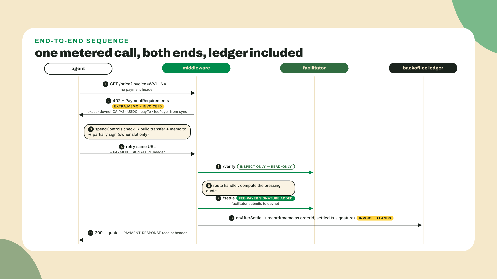
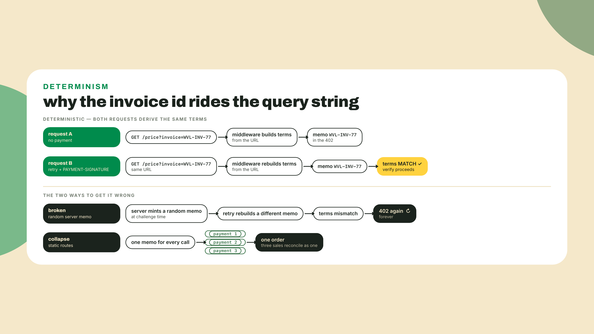
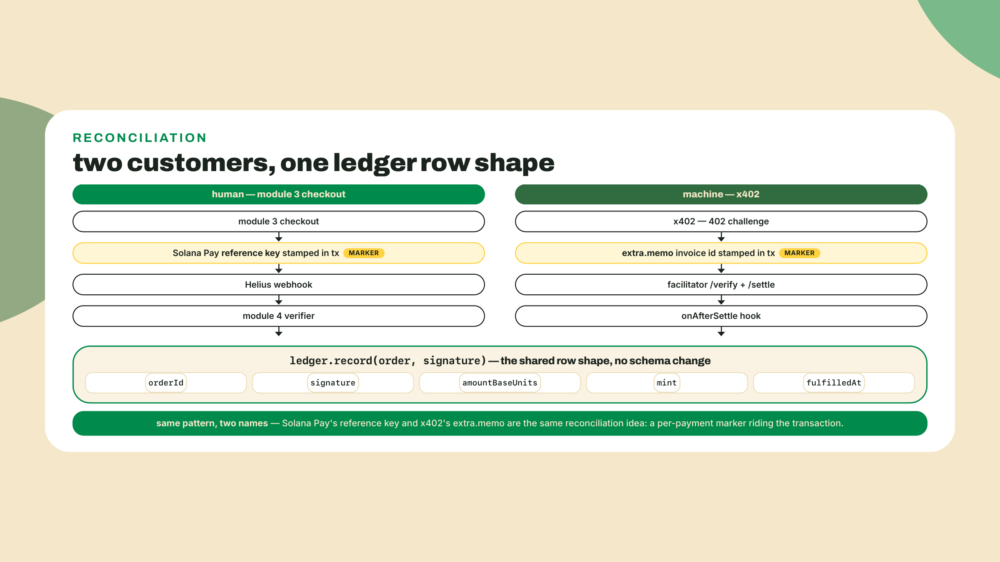
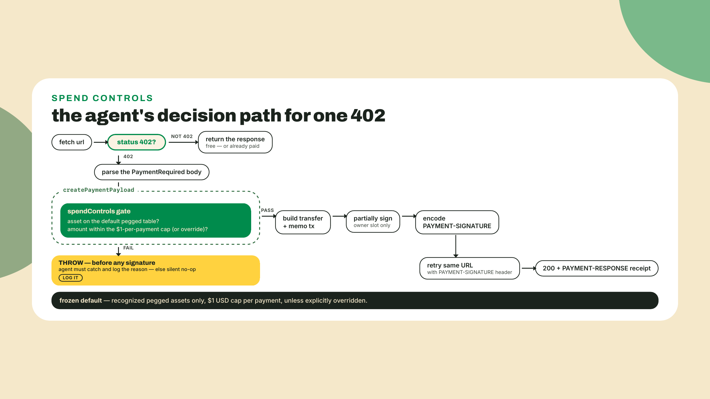
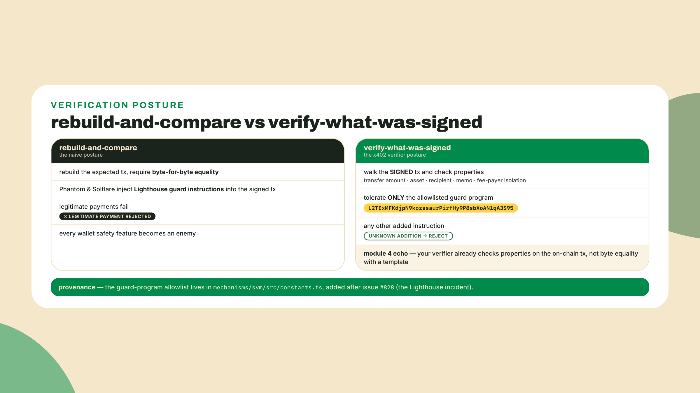
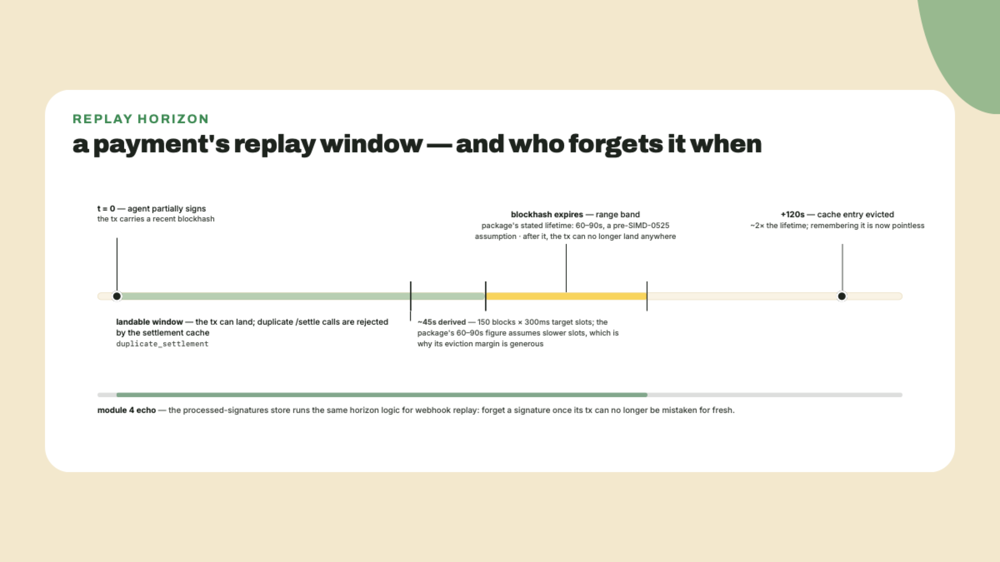
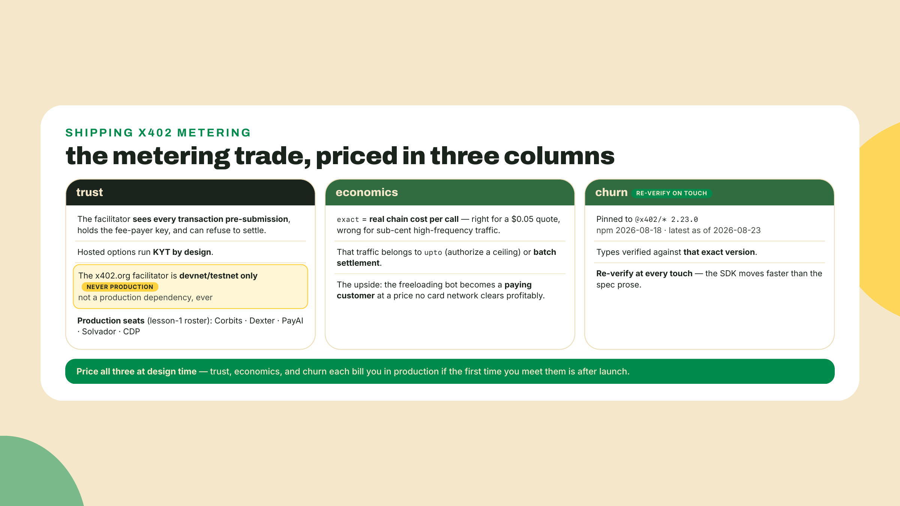

# Paywall the pressing-price API, then build the bot that pays it

## Summary

Last lesson handed you the x402 v2 flow on paper: the three headers that carry it, PAYMENT-REQUIRED out, PAYMENT-SIGNATURE back, PAYMENT-RESPONSE out again, the exact-SVM scheme, and the exact answer to who signs at /verify versus /settle. Paper time is over. Today you build both ends and wire the memos into the ledger you already run.

Here is the situation that makes it worth building. Wavelength publishes a pressing-price API: give it a record and a run size, it quotes what the vinyl pressing costs. It is free, and a collector bot is hammering it ten thousand times a day for nothing, driving your RPC bill while paying you zero. The fix is not a ban. The fix is a price. One middleware in front of the endpoint, and the same bot that was freeloading yesterday either starts paying today, because the quotes are worth more to its operator than the pennies they now cost, or it leaves, and either way the freeloading stops.

Before any theory, stand the workspace up. It sits beside the `backoffice` workspace from module 4, because the import path between them is the whole point of this lesson:

```bash
mkdir -p ~/wavelength/x402/src && cd ~/wavelength/x402
npm init -y && npm pkg set type="module"
npm install @x402/express@2.23.0 @x402/svm@2.23.0 @x402/core@2.23.0 \
  express@4.21.2 @solana/kit@6.10.0
npm install -D typescript tsx @types/node @types/express
```

Version notes, because this line moves fast: 2.23.0 is the stamped `@x402/*` line — published to npm 2026-08-18, verified installable 2026-09-05 — and the scoped names are the only ones to install; re-check the tag before you pin. `@x402/svm` peers `@solana/kit >=5.1.0`, and this workspace pins kit 6.10.0, the same v6 line as your checkout and ops workspaces. Express is pinned inside `@x402/express`'s `^4 || ^5` peer range — and yes, 4.21.2 is a different express major than the 5.x your checkout, back-office and capstone workspaces run, which is the same per-workspace rule as the kit majors: each workspace pins inside its own dependencies' peer ranges, and the two express lines never meet in one `node_modules`.

Expect three `npm warn ERESOLVE overriding peer dependency` lines on that install, and expect them every time: `@x402/svm` depends on `@solana-program/token` 0.9, `@solana-program/token-2022` 0.6, and `@solana-program/compute-budget` 0.11, and all three still declare a `@solana/kit ^5.0` peer. npm resolves them against your root kit 6.10.0 and warns rather than failing (`npm ls @solana/kit` will print them as `invalid: "^5.0"`). Warnings, not errors: the install completes and the lab runs. It is also a fair snapshot of how young this stack is, and a reason to re-read those warnings at every bump instead of training your eye to skip them.

What you walk out with, while that install runs:

- **The server end**: Wavelength's pressing-price endpoint behind `@x402/express`, pointed at the devnet facilitator, with a per-call `extra.memo` invoice id on every challenge.
- **The client end**: a paying agent on `@x402/svm` that eats the 402, partially signs, retries with the payment header, and keeps a receipt.
- **Reconciliation as accretion**: the memo invoice ids land in the same backoffice ledger you built in module 4. A machine sale and a human sale flow through one code path.
- **Two guards**: the client's spendControls cap (and its silent-decline footgun), and the story of why x402's verifier ships a hardcoded allowlist for a wallet guard program.

The division of labor, out loud: I walk the server plumbing and the reconciliation hook with you end to end. The middleware's price sheet and the agent's pay-and-retry loop are yours to fill against stated rules, completion mode with the calls named. The pre-flight `decidePayment` guard in the challenge is solo, no walkthrough.

## Metering a call from both sides

### The price sheet the middleware enforces

Start on the server, because the server is where the money decision lives. `@x402/express` exposes `paymentMiddleware(routes, resourceServer)`: a routes object that says what costs what, and a resource server that knows how to verify and settle. Here is the routes shape, the real one from the 2.23.0 types, walked field by field:

```ts
// The shape of one protected route (RoutesConfig entry, @x402/core 2.23.0)
const example = {
  'GET /price': {
    accepts: {
      scheme: 'exact',                                   // per-call, precise amount
      network: 'solana:EtWTRABZaYq6iMfeYKouRu166VU2xqa1', // CAIP-2 id: devnet
      payTo: 'YOUR_MERCHANT_ADDRESS',                    // the OWNER address; the scheme derives the ATA
      price: '$0.05',                                    // money form; resolved to devnet USDC
      extra: { memo: 'WVL-INV-0001' },                   // the invoice id, 256-byte ceiling
    },
    description: 'Wavelength pressing-price quote',
  },
};
```

Each field is a decision you already have the vocabulary for. `scheme: 'exact'` is the metered-API scheme from last lesson, one call, one settlement. `network` is the CAIP-2 devnet id; the mainnet id `solana:5eykt4UsFv8P8NJdTREpY1vzqKqZKvdp` is one string swap away, and everything else in this lesson survives that swap except the facilitator, which we will get to. `payTo` takes the merchant owner address, not a token account: the SVM scheme derives the associated token account itself, the same owner-versus-ATA distinction your module 4 verifier enforces. `price` in the `'$0.05'` money form gets parsed by the scheme against its built-in asset table, which on devnet resolves to the devnet USDC mint `4zMMC9srt5Ri5X14GAgXhaHii3GnPAEERYPJgZJDncDU`, six decimals, the same mint your checkout has used since module 2. You can pass an explicit `{ asset, amount }` pair instead when you price in a specific token; the money form is the default because a price sheet in dollars is what a merchant actually maintains.

And `extra.memo` is the field this lesson orbits: a string of at most 256 bytes that the paying agent must embed in the payment transaction as a memo instruction, verified byte-for-byte by the facilitator. It is your invoice id, riding the payment itself. Note the ceiling is measured in UTF-8 bytes, not characters; an invoice id with multibyte characters spends the budget faster than its length suggests, which is why the challenge makes you measure it properly.


One thing to absorb before it costs you an afternoon, and absorb it as a version boundary rather than a drift: the amount field is called `maxAmountRequired` in v1 and `amount` in v2. That is not the spec disagreeing with the SDK. Open `@x402/core` 2.23.0 and both schemas are sitting in the same build, `PaymentRequirementsV1Schema` with `maxAmountRequired` and `PaymentRequirementsV2Schema` with `amount`, because the package speaks both dialects on purpose. So the field name is itself a version signal: if you are looking at `maxAmountRequired`, you are looking at v1 terms, and everything else about that challenge, including the fact that it arrived in a response body rather than a header, follows from that.

Where does the fee payer come from? Not from you. The resource server syncs with the facilitator at startup and learns, per scheme and network, the sponsor address the facilitator will sign with. That is why the boot sequence has an explicit `initialize()` step, and why your merchant server never holds a fee-payer key at all:

```ts
// x402/src/gateway.ts - one facilitator client, one resource server, boot-time work
import { x402ResourceServer } from '@x402/express';
import { HTTPFacilitatorClient } from '@x402/core/server';
import { registerExactSvmScheme } from '@x402/svm/exact/server';

const FACILITATOR_URL = 'https://x402.org/facilitator'; // devnet/testnet ONLY

const facilitator = new HTTPFacilitatorClient({ url: FACILITATOR_URL });
export const resourceServer = new x402ResourceServer(facilitator);
registerExactSvmScheme(resourceServer);
// the server calls resourceServer.initialize() once at boot
```

That URL deserves its own sentence in bold in your deployment notes. The x402.org facilitator is the reference deployment and it serves devnet and testnet only. It is perfect for this lab and for CI, and it is a trap if it survives into a production config, because it will not settle a mainnet payment for you, ever.

This is also the moment last lesson's challenge gets cashed in. You drafted a five-line facilitator decision record: a dominant constraint, a primary pick, a compliance alternative, a CI setting, and a named trust acceptance. Open it. The CI line of that record is what `FACILITATOR_URL` implements today, and if your record says anything other than the x402.org facilitator for CI, this lab is your chance to argue with your own past self. The primary-pick line, Corbits, Dexter, PayAI, or Solvador, or Coinbase's CDP if screened settlement is your constraint, is the one-string swap you make at go-live. Going live is a URL swap plus the trust decision that URL represents, and the trust half is the hard half, which is why you wrote it down before you had code to be attached to. One more clause belongs in that decision: last lesson's version caution still applies at the swap, so before go-live, confirm with your chosen facilitator that it settles v2 on mainnet today, or that it negotiates v1 for you, because the deployed world still straddles both versions.



### One memo per call, or reconciliation collapses

Now the part that looks like a detail and is actually the design problem of the lesson. The routes object above is static: build it once, and every 402 carries the same memo. Ship that and your reconciliation is dead on arrival, because three paid calls land in the ledger as three payments against one invoice id, and your fulfillment queue reports one sale. Reusing one memo across calls collapses reconciliation. The memo is only an invoice id if it is unique per call.

So where can a unique per-call id come from? Think about what the middleware actually sees. The 402 challenge and the paid retry are two separate HTTP requests, possibly seconds apart. When the retry arrives, the middleware rebuilds the payment terms from the route config and checks that the terms the agent paid against match the terms it would quote right now; only fields the scheme declares dynamic, the blockhash hints, are exempt from that comparison. A memo minted randomly on the server at challenge time fails this test: the retry would mint a different one, the comparison would miss, and the agent would face an endless loop of 402s while its wallet drains nothing. The invoice id must be something both requests share. And the one thing both requests share, byte for byte, is the URL.

That is the pattern: the agent mints the invoice id and carries it in the query string, and the server folds it into the route config for that request. Deterministic on both legs, unique per call because the agent makes it so:

```ts
// x402/src/routes.ts - the price sheet, one invoice id at a time
import type { RoutesConfig } from '@x402/core/server';

const SOLANA_DEVNET = 'solana:EtWTRABZaYq6iMfeYKouRu166VU2xqa1';
const MERCHANT = process.env.MERCHANT_ADDRESS ?? '';

// The price sheet for ONE invoice id. Rebuilt per request: every call carries
// its own extra.memo, and the 402 challenge and the paid retry agree on it
// because the invoice id rides the query string of both.
// The three TODO(config) marks are your completion rung: reason each value out
// from the rules above before reading the ones printed here, then compare.
export function routesFor(invoiceId: string): RoutesConfig {
  return {
    'GET /price': {
      accepts: {
        scheme: 'exact',
        network: SOLANA_DEVNET,     // TODO(config): the CAIP-2 network id
        payTo: MERCHANT,
        price: '$0.05',             // TODO(config): the per-call price
        extra: { memo: invoiceId }, // TODO(config): the per-call invoice id
      },
      description: 'Wavelength pressing-price quote',
    },
    'GET /price/rush': {
      accepts: {
        scheme: 'exact',
        network: SOLANA_DEVNET,
        payTo: MERCHANT,
        price: '$1.50', // deliberately over the client's default cap; see the guard section
        extra: { memo: invoiceId },
      },
      description: 'Rush quote: a human calls the pressing plant',
    },
  };
}
```

Before you object that a buyer-minted invoice id must be a security hole, play the attack out. The agent controls the string, so the worst it can do is reuse one, and then it has collapsed its own receipts, not yours: your ledger records every settled payment under the memo it carried, each with its own transaction signature, and a buyer who pays three times under one id has paid you three times regardless. The memo is a correlation key, not an authorization. Authorization lives in the facilitator's verification of amount, asset, recipient, and memo against terms your server produced. If your fulfillment logic ever treats a memo as proof of anything by itself, you have rebuilt the exact webhook-trust bug module 4 spent a lesson beating out of you.

You have seen this reconciliation idea before under a different name. Solana Pay reference keys and x402 memo invoice ids are the same idea: a per-payment marker that rides the transaction so the merchant can match money to orders without issuing a unique deposit address per sale. Module 3 stamped the reference key into your checkout transactions; x402 standardizes where the marker rides for machine payments. Two rails, one reconciliation pattern.



### Same ledger, new customer

Reconciliation is one hook. The resource server fires `onAfterSettle` after the facilitator confirms settlement, and the context handed to that hook carries everything your module 4 ledger needs: the requirements that were paid (including the memo and the amount) and the settle result (including the on-chain transaction signature). So the machine sale lands exactly where the human sale lands:

```ts
// x402/src/reconcile.ts - the machine-sale path into the module 4 ledger
import type { x402ResourceServer } from '@x402/express';
import type { Ledger } from '../../backoffice/src/ledger.ts'; // the module 4 artifact, unchanged

export function wireReconciliation(resourceServer: x402ResourceServer, ledger: Ledger): void {
  resourceServer.onAfterSettle(async (ctx) => {
    if (!ctx.result.success) return;
    const memo = ctx.requirements.extra['memo'];
    if (typeof memo !== 'string' || memo.length === 0) return;
    ledger.record(
      {
        orderId: memo,                    // the invoice id IS the order id
        recipient: ctx.requirements.payTo,
        recipientAta: '',                 // derivable from (payTo, mint); record() never reads it
        mint: ctx.requirements.asset,
        amountBaseUnits: BigInt(ctx.requirements.amount),
      },
      ctx.result.transaction,             // the settled signature, same column as every webhook sale
    );
    console.log(`reconciled ${memo} -> ${ctx.result.transaction}`);
  });
}
```

Read the shape being passed and notice it is the `ExpectedOrder` you froze in module 4, built from x402's vocabulary: memo becomes `orderId`, `payTo` becomes `recipient`, the asset mint and base-unit amount map straight across. `recipientAta` stays empty here because the settle receipt does not carry it and `record()` never reads it; it is derivable from owner plus mint whenever ops tooling wants it, exactly as the module 4 lesson noted when it added the field. Forcing the mapping through the same `record()` call pays off next month, when you reconcile a week of sales: the QR checkout from module 3, the webhook-confirmed transfer from module 4, and the bot that paid over x402 this morning are rows in one file with one shape, and every audit tool you ever write works on all three.

I will confess where my own first version of this hook went wrong: I recorded from `ctx.paymentPayload`, the thing the client sent, instead of `ctx.requirements`, the thing the server demanded and the facilitator verified. Same data on the happy path, wrong trust direction. The habit from module 4 transfers verbatim: fulfillment records what was verified, never what was claimed.



### The agent, its loop, and its allowance

Cross to the other side of the counter. The paying agent needs three things: an identity that can sign, a loop that answers 402s, and an allowance that stops it from paying anything put in front of it.

Identity first, and note that it is deliberately not module 2's key handling. There you loaded the merchant's existing `solana-keygen` file, all 64 bytes of it, with `createKeyPairSignerFromBytes`. The agent is the buyer, not the merchant, so it needs an identity of its own, and it has no keygen file to load. Kit's sibling constructor covers that case: `createKeyPairSignerFromPrivateKeyBytes` takes a 32-byte private-key seed instead of a 64-byte keypair file. Generate the seed once, persist it, and reload it into a non-extractable Web Crypto key on every run. Same signer type at the end, wrapped for x402:

```ts
// x402/src/signer.ts - a persistent agent identity
import { existsSync, readFileSync, writeFileSync } from 'node:fs';
import { webcrypto } from 'node:crypto';
import { createKeyPairSignerFromPrivateKeyBytes } from '@solana/kit';
import { toClientSvmSigner, type ClientSvmSigner } from '@x402/svm';

const SEED_FILE = 'agent-seed.bin';

export async function loadSigner(): Promise<ClientSvmSigner> {
  if (!existsSync(SEED_FILE)) {
    const seed = new Uint8Array(32);
    webcrypto.getRandomValues(seed);
    writeFileSync(SEED_FILE, seed);
  }
  const seed = new Uint8Array(readFileSync(SEED_FILE));
  return toClientSvmSigner(await createKeyPairSignerFromPrivateKeyBytes(seed));
}
```

Note what this agent does not need: SOL. The facilitator is the fee payer, so the agent's wallet holds devnet USDC and nothing else. That asymmetry is the exact-SVM design doing its job, machine customers do not manage gas.

The client object registers the SVM scheme against the wildcard network id, and the allowance lives on that client. No `setSpendControls` call appears anywhere in this lesson, which is a decision, not an omission: the defaults are in force, and the defaults have teeth. State them precisely, because they are the frozen fact this section turns on: out of the box, the client's spendControls recognize only pegged assets from the scheme's default table, capped at one US dollar per payment, unless you override them. Devnet USDC at five cents sails through. The rush quote at a dollar fifty does not, and the way it does not is the footgun: the check runs inside payment creation, before anything is signed, and it throws. If your agent code does not catch and log that throw, the agent simply never pays, your fulfillment queue stays empty, and nothing anywhere says why. A cap you cannot see declining is indistinguishable from a broken integration. When a call is legitimately worth more than a dollar, raise the cap deliberately with `setSpendControls({ maxAmountPerPayment: '$2' })` and write down why; when it is not, keep the default and make the decline loud.

The loop itself is your completion rung, the TODO in the middle of the agent file. `wrapFetchWithPayment(fetch, client)` from `@x402/fetch` does the whole dance in one line, and you will use it in production (it is deliberately not in this workspace's install line; add the package when you reach for it). Today you write the dance out once by hand, because the engineer who has built the loop can debug the wrapper, and the engineer who has only used the wrapper cannot:

```ts
// x402/src/agent.ts - the collector bot, taught to pay
import { x402Client } from '@x402/core/client';
import {
  decodePaymentRequiredHeader,
  decodePaymentResponseHeader,
  encodePaymentSignatureHeader,
} from '@x402/core/http';
import type { PaymentRequired } from '@x402/core/types';
import { ExactSvmScheme } from '@x402/svm/exact/client';
import { loadSigner } from './signer.ts';

const API = process.env.API_URL ?? 'http://localhost:4021';

const signer = await loadSigner();
console.log(`agent pays as ${signer.address}`);

const client = new x402Client().register('solana:*', new ExactSvmScheme(signer));
// No setSpendControls call: the DEFAULTS are in force. Pegged assets, $1 per payment.

// Your turn (completion rung). The four rules:
// 1. fetch(url); anything but HTTP 402 returns as-is, already paid or free.
// 2. Read the challenge out of the HEADER, never the body:
//    decodePaymentRequiredHeader(res.headers.get('PAYMENT-REQUIRED'))
//    returns the PaymentRequired object. The 402's body is the two bytes '{}'.
// 3. const payload = await client.createPaymentPayload(paymentRequired);
//    spendControls run INSIDE this call: an over-cap quote throws here,
//    before anything is signed. Let the throw escape to the caller.
// 4. Retry the SAME url with the header:
//    { 'PAYMENT-SIGNATURE': encodePaymentSignatureHeader(payload) }
async function payAndRetry(url: string, client: x402Client): Promise<Response> {
  throw new Error('Your turn: implement the four rules above.');
}

// The driver is worked: three paid calls, then one deliberate refusal.
for (let call = 1; call <= 3; call++) {
  const invoiceId = `WVL-INV-${Date.now()}-${call}`;
  const res = await payAndRetry(`${API}/price?run=500&invoice=${invoiceId}`, client);
  if (!res.ok) {
    // Failures are silent in the body and loud in the headers; the checkpoint
    // section at the end of this lesson reads them field by field.
    console.error(`call ${call} failed: HTTP ${res.status}`);
    continue;
  }
  const receiptHeader = res.headers.get('PAYMENT-RESPONSE');
  console.log(`call ${call}: paid ${invoiceId}`, await res.json());
  if (receiptHeader) {
    console.log(`  settled: ${decodePaymentResponseHeader(receiptHeader).transaction}`);
  }
}

// The over-cap call: $1.50 against the $1 default. Decline LOUDLY or not at all.
try {
  await payAndRetry(`${API}/price/rush?run=500&invoice=WVL-INV-RUSH-1`, client);
} catch (error) {
  const reason = error instanceof Error ? error.message : String(error);
  console.log(`rush call declined by spendControls: ${reason}`);
}
```

Hold the whole decision path in one picture before the lab, because the position of the spendControls gate, inside payment creation and before any signature, is the fact the debugging section will keep sending you back to.



### Verify what was actually signed

One story from inside the SDK before the lab, because it will recalibrate how you think about verification forever: wallets break naive verification.

Suppose you decided to double-check payments yourself, server-side. The obvious design: rebuild the transaction you expect, the transfer, the memo, the compute budget, and compare it byte for byte with what the agent submitted. Rigorous, right? Deploy it, and legitimate payments start failing. Not from malice: from safety features. Phantom and Solflare inject Lighthouse guard instructions into transactions they sign. Lighthouse is an assertion program; wallets append instructions to it so that if the transaction's effects diverge from what was simulated for the user, execution fails on-chain. A protective airbag, and it means the signed transaction is a superset of the transaction you built.

The x402 SVM verifier carries the scar tissue in its source: `mechanisms/svm/src/constants.ts` hardcodes an allowlist for the Lighthouse guard program, `L2TExMFKdjpN9kozasaurPirfHy9P8sbXoAN1qA3S95`, added after issue #828 documented exactly this failure. The verifier walks the transaction that was actually signed, checks the transfer, the memo, and the fee-payer isolation, and tolerates instructions from that one allowlisted guard program while rejecting any other addition.

The principle is bigger than the incident, so pin it: verify what was actually signed, never the idealized transaction you would have built. Your module 4 verifier already lives by this rule without you naming it, it reads the transaction from the chain and checks properties, owner, mint, delta, memo, rather than demanding byte equality with a template. Property checks tolerate benign additions; byte comparisons declare war on every wallet safety feature ever shipped. When you write verification code anywhere in your stack, you are choosing between those two postures, and this incident is the argument for the first one.



The same package hides a second guard worth knowing because you built its cousin in module 4. The facilitator side keeps a settlement cache: an in-memory table of transactions currently being settled, so a duplicate /settle call for the same payment gets rejected as a `duplicate_settlement` instead of racing the first submission. Entries evict on a timer the package ties to the blockhash lifetime, its docs call that window roughly 60 to 90 seconds and evict at 120, about twice the lifetime, on the reasoning that once a payment's blockhash can no longer land, a replayed settle of it can no longer succeed, so remembering it is pointless. If that sentence gave you deja vu, it should: it is the same eviction arithmetic as your module 4 processed-signatures store, which forgets a signature once its transaction could not possibly be confused for a fresh one. Your store guards fulfillment against replayed webhooks; the settlement cache guards submission against replayed settles. Same shape, different door. And the module 4 habit of deriving the wall-clock from the current slot time applies to both: at the 300ms target slot time — staged by SIMD-0525 as this is written, with epoch 1024 (2026-08-28) set to lock it in days later — the 150-block window runs about 45 seconds, well short of the round 60 people quote, and SIMD-0525's remaining staged cuts will shrink it further, which is exactly why the cache's margin is generous, and why this course keeps saying derive it, never memorize it.



### The toll collector you rent

Name the trade before you ship it, because this one is structural — and it is the same trade last lesson already named: the facilitator is fee payer and settlement trust boundary in one, it sees every transaction, it can refuse, and refusal at scale is censorship whatever the terms-of-service calls it; the hosted ones run KYT screening by design, the same coin flipped to compliance. None of this is a bug someone will fix; a sponsor is a counterparty. What this lesson adds is the ledger discipline: you made this exact trade with fiat ramps in module 6 and wrote it into a decision record, the facilitator column belongs in the same table, and the x402.org devnet facilitator specifically belongs in the never-production row of that table.

The second honest limit is economic, and it is the machine-commerce version of a lesson every payments person eventually learns: settlement costs must fit inside the thing being sold. exact settles every call on-chain, so every call carries real chain cost, the transfer fee the sponsor eats plus the operational cost of verify and settle round-trips. At five cents a quote, that overhead is a rounding error and per-call metering is exactly right. At a thousand sub-cent telemetry pings a minute, per-call settlement costs more than the product, and no amount of engineering enthusiasm changes the arithmetic; that traffic wants the upto scheme's authorize-a-ceiling model or batch settlement, both of which exist precisely because exact does not stretch there. Match the scheme to the unit economics of the call, and be suspicious of any metering plan whose margin depends on the settlement rail being free. Here is the optimistic half, and it is the half that matters for Wavelength: the collector bot that was a pure cost center this morning is now a customer with unit economics that work, at a price point no card network could clear profitably. Machine customers are not a threat to the price sheet: they are the first customer segment in history that reads it perfectly and never abandons a cart.

And the third limit you are living with all lesson: the `@x402/*` line is pinned at 2.23.0 here (published 2026-08-18), and it has already moved twice since — 2.24.0 on 2026-08-27, 2.25.0 on 2026-09-04, checked 2026-09-07 — which is the point rather than an embarrassment: nothing about this ecosystem suggests it will sit still. Every wire fact in this lesson was read off that exact build rather than off a document: the header transport, `amount` rather than `maxAmountRequired` in the v2 requirement, and the `maxTimeoutSeconds` the resource server fills in for you. The version straddling is what makes that discipline non-optional, because one package ships both dialects' schemas side by side, so "which shape am I holding" stays a live question at every bump instead of a settled one. Re-verify at every touch, the way this lesson did, not the way a bookmark does.



## Lab: gate it, pay it, reconcile it

The gate for this lesson: an unpaid call answers 402, your agent settles three paid calls on devnet, three distinct invoice ids reconcile into the module 4 ledger, and the over-cap rush call is declined with a logged reason. The plumbing is walked above; you fill the price sheet and the loop.

1. **Fund the agent.** Save `src/signer.ts` and `src/agent.ts` from the theory section, then run the agent once. It mints its seed, prints its address, and immediately crashes on the unimplemented loop, which is correct: today the crash is your TODO marker. Send the printed address a few dollars of devnet USDC from the Circle faucet at faucet.circle.com (pick Solana Devnet), the same faucet you used in module 2. No SOL airdrop needed: the facilitator pays fees, which you can now explain rather than merely enjoy.

```bash
cd ~/wavelength/x402
npx tsx src/agent.ts   # prints: agent pays as <address>, then throws 'Your turn'; fund that address
```

2. **Assemble the server.** Three of its four files came from the theory section: `src/gateway.ts` (facilitator client plus resource server), `src/routes.ts` (your completed price sheet, the three TODO(config) fields), and `src/reconcile.ts` (the ledger hook). The fourth is the Express wiring below, worked because its two decisions are subtle and neither is the lesson:

```ts
// x402/src/server.ts - Wavelength's pressing-price API, gate in front
import express from 'express';
import { paymentMiddleware } from '@x402/express';
import { Ledger } from '../../backoffice/src/ledger.ts';
import { resourceServer } from './gateway.ts';
import { routesFor } from './routes.ts';
import { wireReconciliation } from './reconcile.ts';

const ledger = new Ledger(process.env.LEDGER_FILE ?? 'orders.jsonl');
wireReconciliation(resourceServer, ledger);

const app = express();

app.use((req, res, next) => {
  const invoiceId = typeof req.query.invoice === 'string' ? req.query.invoice : '';
  if (!invoiceId) {
    res.status(400).json({ error: 'invoice query param required, e.g. ?invoice=WVL-INV-0001' });
    return;
  }
  // Fresh middleware per request so the routes carry THIS call's memo.
  // syncFacilitatorOnStart=false: the shared resourceServer synced once at boot.
  void paymentMiddleware(routesFor(invoiceId), resourceServer, undefined, undefined, false)(
    req,
    res,
    next,
  );
});

function quote(runSize: number): { runSize: number; unitPriceUsd: number; totalUsd: number } {
  const unit = runSize >= 500 ? 6.1 : 7.4;
  return { runSize, unitPriceUsd: unit, totalUsd: Math.round(unit * runSize * 100) / 100 };
}

app.get('/price', (req, res) => {
  res.json(quote(Number(req.query.run ?? 100)));
});
app.get('/price/rush', (req, res) => {
  res.json({ ...quote(Number(req.query.run ?? 100)), rush: true });
});

await resourceServer.initialize(); // learn supported kinds + the fee payer from the facilitator
app.listen(4021, () => console.log('pressing-price API on :4021, gate armed'));
```

The two decisions, so you own them: the middleware is constructed per request purely so the routes object can carry this call's invoice memo, with the expensive facilitator sync done once at boot and disabled per request via that final `false`. And the business handlers stay ignorant of payments entirely; the quote function would run identically with the middleware deleted, which is the property that lets next lesson add a second payment protocol without touching it.

3. **Start the server** with your merchant address from module 2:

```bash
MERCHANT_ADDRESS=$(solana address) LEDGER_FILE=../backoffice/orders.jsonl npx tsx src/server.ts
```

Expected: `pressing-price API on :4021, gate armed`. If it throws on `initialize()`, the facilitator is unreachable or does not support the scheme/network pair; check the URL and your network before suspecting your code.

4. **Prove the gate from a second terminal.** No payment header, no quote:

```bash
curl -i "http://localhost:4021/price?run=500&invoice=WVL-INV-TEST"
```

Expected, and this is the shape last lesson promised (Date, ETag, and keep-alive lines dropped, and the base64 elided at the ellipsis):

```text
HTTP/1.1 402 Payment Required
X-Powered-By: Express
Content-Type: application/json; charset=utf-8
PAYMENT-REQUIRED: eyJ4NDAyVmVyc2lvbiI6MiwiZXJyb3IiOiJQYXltZW50IHJlcXVpcmVkIiwicmVzb3VyY2Ui...
Cache-Control: no-store
Content-Length: 2

{}
```

The gate is live, exactly as advertised. Decode the header:

```bash
curl -sD - -o /dev/null "http://localhost:4021/price?run=500&invoice=WVL-INV-TEST" \
  | grep -i '^payment-required:' | sed 's/^[^:]*: *//' | tr -d '\r' \
  | base64 -d | node -p "JSON.stringify(JSON.parse(require('fs').readFileSync(0,'utf8')),null,2)"
```

```json
{
  "x402Version": 2,
  "error": "Payment required",
  "resource": {
    "url": "http://localhost:4021/price?run=500&invoice=WVL-INV-TEST",
    "description": "Wavelength pressing-price quote",
    "mimeType": ""
  },
  "accepts": [
    {
      "scheme": "exact",
      "network": "solana:EtWTRABZaYq6iMfeYKouRu166VU2xqa1",
      "amount": "50000",
      "asset": "4zMMC9srt5Ri5X14GAgXhaHii3GnPAEERYPJgZJDncDU",
      "payTo": "<the MERCHANT_ADDRESS your server was started with>",
      "maxTimeoutSeconds": 300,
      "extra": {
        "memo": "WVL-INV-TEST",
        "feePayer": "CKPKJWNdJEqa81x7CkZ14BVPiY6y16Sxs7owznqtWYp5"
      }
    }
  ]
}
```

Read it against the mapping card from the theory section: your `'$0.05'` became `"50000"` base units of the devnet USDC mint, your memo came through byte-for-byte, and `resource.description` is the `description` you wrote on the route. Two fields arrived that you never configured. `extra.feePayer` came from the facilitator sync. And `maxTimeoutSeconds` is `300` because your route config left it out and `@x402/core` fills in 300 seconds when it does; put `maxTimeoutSeconds: 90` beside `price` in that route's `accepts` and the challenge says `90` instead. The `mimeType` is empty for the same reason in reverse: nothing declared one, so nothing was invented. You can see the same answer without running anything: `curl -s https://x402.org/facilitator/supported` lists the kinds that facilitator settles, and on 2026-08-22 its `solana:EtWTRABZaYq6iMfeYKouRu166VU2xqa1` entry advertised scheme `exact` with `extra.feePayer` set to `CKPKJWNdJEqa81x7CkZ14BVPiY6y16Sxs7owznqtWYp5` (sponsors rotate, so match the shape, not the string). Every network on that list is a testnet, which is the devnet-only warning restated by the facilitator itself. Finding that fee payer in the terms is your evidence the boot sequence worked; a missing `feePayer` means `initialize()` never ran or the facilitator does not support your scheme and network pair.

5. **Complete `payAndRetry`** in `src/agent.ts` against the four rules from the theory section, then run the agent:

```bash
npx tsx src/agent.ts
```

Expected output, shapes not exact strings: three `call N: paid WVL-INV-...` lines each followed by a settled transaction signature, then `rush call declined by spendControls:` with the cap named in the reason.

The three signatures are real devnet transactions, so spend a minute reading one in any explorer, because the whole lesson is sitting inside it. The transfer instruction moves `50000` base units of devnet USDC from the agent's ATA to yours. The memo instruction carries your invoice string, the reconciliation story visible on a public ledger. The compute budget instructions are there because the spec mandates them on a settle transaction. And the transaction's fee payer is neither you nor the agent: it is the facilitator's sponsor address from `extra.feePayer`, the account whose signature was the last one added. Two signatures, two signing moments, one of which happened on your machine and one of which did not. That is partial signing, no longer on paper.

6. **Audit the ledger.** Three new rows, three distinct invoice ids, alongside whatever module 4 sales the file already holds:

```bash
tail -n 3 ../backoffice/orders.jsonl
```

Each row: the memo as `orderId`, the settled signature, `"50000"` base units, the devnet USDC mint. One file, one shape, two kinds of customer. That is this lesson's gate, checked by hand from your own terminal: gate live (unpaid call returns 402), at least one settled devnet call, and its memo reconciled into the ledger.

## Challenge: the decidePayment pre-flight guard

Solo rung, no walkthrough. The spendControls throw is the SDK's guard; a production agent wants its own pre-flight decision with reasons its logs can aggregate, made before the SDK is even asked. Implement `decidePayment` in the decide-payment coding-challenge widget, which hands you the starter and its tests. The widget calls it positionally, one argument per field: `decidePayment(scheme, network, asset, amount, feePayer, memo, maxUsd, allowedAssetsJson)`. The first six are the payment terms a 402 quoted, unbundled from the requirements object you decoded out of the PAYMENT-REQUIRED header; the last two are the agent's own controls, and the allowlist arrives serialized as a JSON string mapping mint to decimals, so `JSON.parse(allowedAssetsJson)` before you check anything against it. Return a decision object that either passes the fee payer and memo through for payment or declines with a precise reason. The amount arrives as `amount` because these are v2 terms; a guard written against a v1 counterparty would be reading `maxAmountRequired` for the same number, which is the version boundary from the theory section showing up in your first line of code.

Reject with a distinct reason each, and run the checks in this fixed order, so the same bad terms always produce the same reason, which is what makes declines aggregatable:

```text
1. scheme     not "exact"                                    -> unsupported scheme
2. network    not a known Solana CAIP-2 id (mainnet/devnet)  -> unknown network
3. asset      absent from the agent's pegged allowlist       -> asset not allowed
4. memo       over 256 UTF-8 BYTES (not string length)       -> memo too large
5. fee payer  no feePayer named                              -> missing fee payer
6. amount     USD-converted value above the cap              -> exceeds spend cap
```

Six rows, and one field from the challenge is deliberately not among them. Every requirement you decoded carries `maxTimeoutSeconds`, `300` on the terms this lab quotes, and the guard never looks at it. That is on purpose. The six checks all answer one question, will I pay these terms, and each one is a policy the agent holds an opinion about. `maxTimeoutSeconds` is not a policy: it is the merchant's deadline for completing payment, set on the merchant's route and handed to you as a fact. There is nothing there for the agent to approve or decline, and an agent that pays immediately, as this one does, cannot miss a five-minute window anyway. The version of this guard that would check it belongs to an agent that queues 402s and pays them later: compare the window against your queue's worst-case latency and drop anything that cannot make it. Note what skipping that check costs a queueing agent, though, because it is not a decline. The terms simply stop being payable, your guard says nothing at all, and whatever you learn about it you learn from the `error` on the response rather than from your own logs.

The acceptance bar, matching the lesson gate: an in-policy call returns `willPay: true` with fee payer and memo passed through; an over-cap call declines with a cap reason; a wrong-asset call, a non-exact scheme, and an oversized memo each decline with their own reason; and the devnet CAIP-2 id is accepted as known. The widget's tests run the lot; green means done.

If you finish early, wire it in: call your guard at the top of `payAndRetry` and compare its verdicts with the SDK's throws across the lab's four calls. They should agree on every one, and now you have two independent opinions about every payment your agent makes, which is precisely how much paranoia a wallet-holding bot deserves.

And one drill that collects a debt from module 4, worth ten minutes because it is the only place this course can honestly pay it. Your reconciliation lesson left `tryMatchByReferenceOrMemo` in `backoffice-refunds/src/sweep.ts` with the memo half open, on the promise that module 7's traffic would need it. It does — but only on the unhappy path, so make one: run a paid agent call with your settlement hook disabled (comment out the `ledger.record` in `onAfterSettle`), so real money lands on-chain carrying its `extra.memo` invoice id and your ledger never hears about it. That is a crashed worker, reproduced on purpose. Now run the treasury sweep against your merchant ATA. With the memo half filled it finds the orphaned credit, parses the invoice id out of the memo, and matches it to the open order the reference path could never have found, because an x402 settlement carries no reference key at all. Accept: one recovered row, and the same sweep run twice writes it once. Re-enable the hook afterwards.

## Checkpoint: three rows and one refusal

Where this usually snags, in the order you would hit it:

1. **A 402 loop that never resolves** — the agent signs and retries forever while nothing settles and no USDC leaves its wallet. Your memo is not deterministic across the challenge and the retry; reread the query-string section, the URL is the only shared ground.
2. **An agent that ends silently with an empty fulfillment queue** — you let the spendControls throw escape without logging, the exact silent-decline footgun the theory section warned about; catching it is not optional in anything you ship.
3. **A verify failure on a call your spendControls happily approved** — do not guess, and do not read the body, which is `{}` here as it is everywhere else. Decode the failing response's PAYMENT-REQUIRED header and read its `error` field, the facilitator's own words for what went wrong. An unfunded ATA surfaces there as `transaction_simulation_failed`, because the exact-SVM verifier adds the fee-payer signature, simulates the result, and watches the transfer fail; that one string is the difference between checking your agent's devnet USDC balance in ten seconds and suspecting your own code for an hour.
4. **Past verification, dead at settlement** — the reason rides `PAYMENT-RESPONSE` as `errorReason`, and the body is still `{}`. The guard checks policy, the facilitator checks reality, and reality reports back through a header.
5. **Rows landing under one order id** — you reused an invoice id, which your ledger will happily record and your reconciliation will misread as one sale; the collapse is downstream of the write, not at it.

Now count what you hold. A production API pattern where the paywall is one middleware and the business logic never learned money exists. An agent that pays for HTTP the way browsers fetch it, with an allowance it enforces before signing. A reconciliation path where machine sales and human sales are one ledger, one row shape, one audit story, because you routed x402's memo through the same `record()` a webhook sale takes. And two verification instincts sharpened on real incidents: check properties of what was signed, never byte equality with what you built, and forget replay state only when the chain itself makes replay impossible.

The forward hook is already sitting in your code, in the handlers that never learned money exists. The same API is about to answer a second payment protocol without changing a line of business logic: next lesson you put the pay CLI's gate in front of it, so bots speaking x402 and bots speaking MPP both get served by one door. You built the door today. Next lesson it learns more languages.
