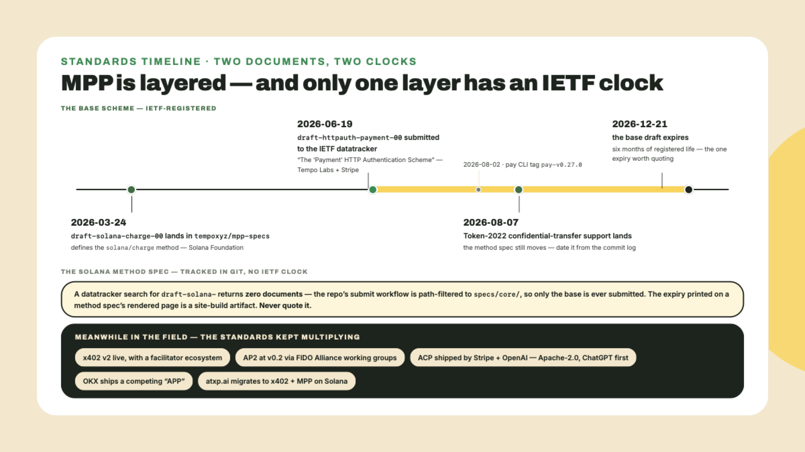
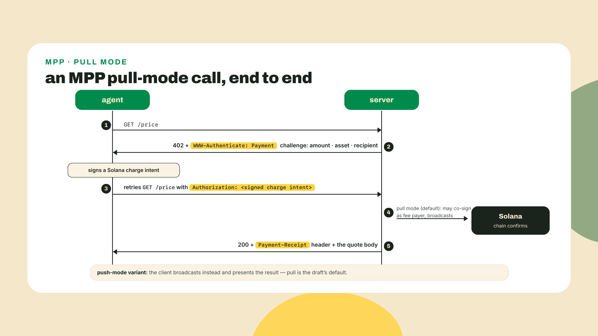
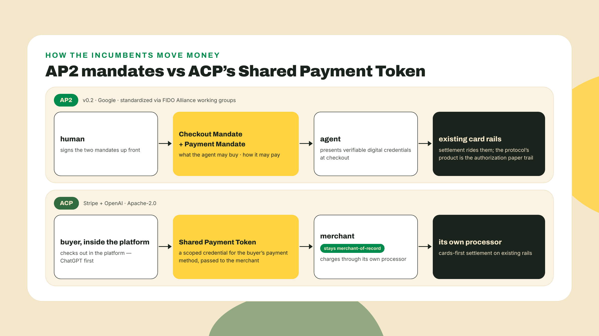
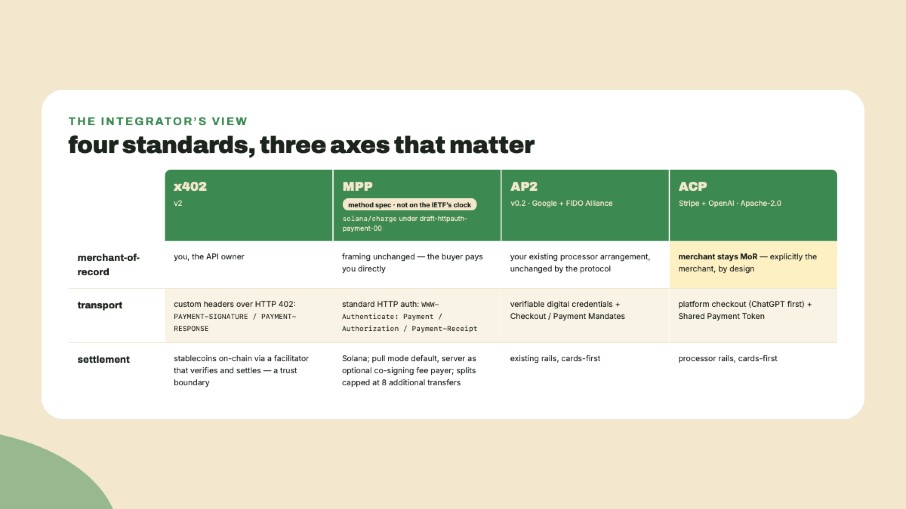
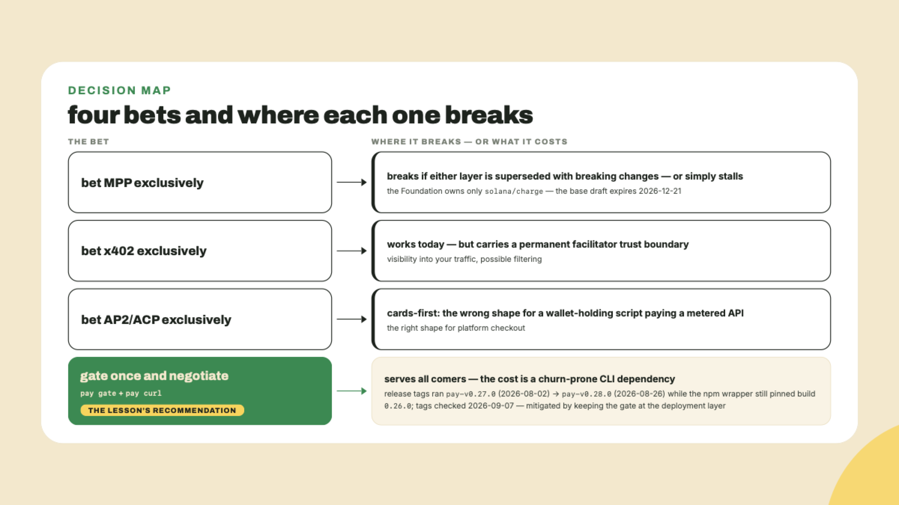
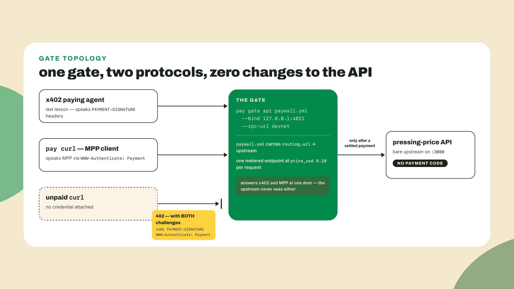
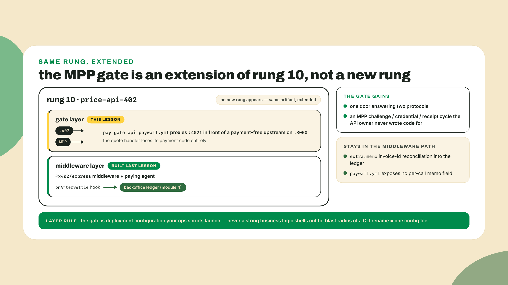

# MPP, AP2, ACP: the standards war (and gating the API with pay)

## Summary

Last lesson closed the machine-sales loop: Wavelength's pressing-price API sits behind @x402/express, a paying agent settles each call through the devnet facilitator, and every extra.memo invoice id lands in the same backoffice ledger a human sale flows through. One API, one protocol, reconciled.

Before any theory, prove you still have the tool this lesson turns on. You installed it in the very first lesson of this course, back when it looked like a curiosity:

```bash
npm i -g @solana/pay   # the opening lesson installed it locally; go global so `pay` is on your PATH
pay --version
```

Read the number you get carefully, because it teaches the lesson's whole theme before the lesson starts. On 2026-08-22 the newest release of the CLI was tagged `pay-v0.27.0` (2026-08-02) and `pay-v0.28.0` followed on 2026-08-26, but the npm wrapper `@solana/pay` 1.0.26 pins the CLI build it downloads to 0.26.0, so a fresh global install still prints `pay 0.26.0`. Three version numbers for one tool, all of them current, none of them wrong: the npm package version, the pinned CLI build, and the newest release tag. Everything below is written against 0.26.0 because that is what the install command in this course actually hands you; if your `pay --version` is higher, treat the flags and fields here as a starting hypothesis and let the tool's own `--help` settle any disagreement. (Keeping the local `npx pay` from lesson one works too; just prefix every `pay` in this lesson with `npx`.) That double identity, checkout library and agentic CLI in one package, was the opening scene of this whole course, and today it pays off.

One protocol is the problem. This week a Google-built agent, an OpenAI checkout flow, and a Solana-native client can all knock on that same door, each holding a different credential and a different assumption about who is actually selling the record. Here is what you will walk away with:

- **MPP (Machine Payments Protocol)** comes in two layers, and collapsing them into one is the single most common thing said wrong about it. The base is `draft-httpauth-payment-00`, "The 'Payment' HTTP Authentication Scheme", an IETF Internet-Draft out of Tempo Labs and Stripe; the Solana Foundation's contribution is `draft-solana-charge-00`, a payment-method spec registered under that base which defines the `solana/charge` method. Together they move payment into HTTP's native auth machinery: a `WWW-Authenticate: Payment` challenge, an `Authorization` credential, a `Payment-Receipt` proof.
- **AP2** (Google's Agent Payments Protocol, v0.2, standardized through FIDO Alliance working groups) and **ACP** (the Stripe and OpenAI Agentic Commerce Protocol, Apache-2.0, ChatGPT as its first platform) are cards-first, and ACP is explicitly designed so the merchant stays merchant-of-record.
- The hands-on beat no other course has: `pay gate api paywall.yml` puts one gate in front of the pressing-price API so the same API answers both x402 and MPP, and `pay curl` on the client side auto-negotiates whichever protocol the server offers.
- The honest 2026 recommendation, argued rather than asserted: do not bet exclusively on any of them yet. Gate once and negotiate, and accept the two costs of that hedge: a fast-churning CLI dependency, and no per-call memo on the gate path, so gate-routed sales are ledger work still owed.

How the work splits today, stated plainly: the theory below is full-serve, the lab is a guided transcript you type yourself, and the challenge is pure judgment work with no walkthrough, because evaluating standards under uncertainty is the actual skill this lesson teaches.

## The war of the speeds

In 1948, Columbia Records introduced the 33⅓ rpm long-playing record. A year later RCA answered with the 45. Both were real improvements over the shellac 78, both were incompatible with each other, and both camps spent marketing money insisting the other was doomed. Record buyers did the rational thing: many stopped buying players entirely and waited. The war did not end with a winner. It ended when turntable makers shipped multi-speed players, and then each format found the niche it was actually best at, the LP for albums, the 45 for singles.

Keep that turntable in your head for the next half hour. Agentic payments in 2026 is a war of the speeds: four-plus standards, each backed by someone enormous, each spinning at its own rpm. Your job as Wavelength's integrator is not to pick the winning speed but to ship the multi-speed turntable. The stake is concrete: guess wrong and you rewrite your payment integration when the market moves; refuse to choose and you serve every agent that shows up while your competitors are still reading spec drafts. So here is the route: first the Solana-native challenger up close, then the two cards-first incumbents, then the one row of the comparison that decides everything (who is merchant-of-record), then the bet.



### MPP: payment as an HTTP credential

MPP is the Machine Payments Protocol, and the first thing to internalize is that it is two documents with two owners, and they do not have the same standing. The base is `draft-httpauth-payment-00`, "The 'Payment' HTTP Authentication Scheme": a genuine IETF Internet-Draft, on the datatracker, submitted 2026-06-19 and expiring 2026-12-21, out of Tempo Labs and Stripe rather than anywhere near Solana. It defines the challenge-credential-receipt dance in the abstract and stays deliberately payment-method agnostic; in its own words, "specific payment methods are defined in separate payment method specifications." Solana's piece is one of those: `draft-solana-charge-00`, "Solana Charge Intent for HTTP Payment Authentication", authored by Ludo Galabru and Ilan Gitter of the Solana Foundation, defining the `solana/charge` method, what a charge intent carries, how it is signed, and how it settles.

What that method spec is *not* is an IETF Internet-Draft. Search the datatracker for `draft-solana-` and it returns zero documents; only the base scheme is ever submitted there. That is worth one habit, and it will keep you from misquoting something in your own docs. Method specs render to handsome RFC-styled pages with a publication date and an expiry printed at the top, and the site build is what produces those dates: rebuild and they move, because nothing registered them anywhere. So do not quote them. Quote the git history instead: `solana/charge` landed in the spec repo on 2026-03-24, and its most recent substantive change was Token-2022 confidential-transfer support on 2026-08-07. I froze that on 2026-08-22 and would re-check it the day you build.

Mechanically, MPP does something x402 deliberately did not: it moves the payment into HTTP's native authentication machinery instead of custom headers. The flow reads like Basic Auth with money in it. Your server rejects an unpaid request with a `WWW-Authenticate: Payment` challenge describing what it wants. The client answers by retrying with an `Authorization` header carrying a signed Solana charge intent as its credential. When the payment lands, the server's response includes a `Payment-Receipt` header, the proof the client files away. Challenge, credential, receipt. Any HTTP library that understands auth flows already understands the shape of this dance, and that is the design bet: make machine payments boring to every proxy, cache, and middleware stack that has handled `WWW-Authenticate` for thirty years.



Two modes, and the default matters. In **pull mode**, the client signs the charge intent and hands it over; the server may co-sign as fee payer and broadcast the transaction itself. In **push mode**, the client takes the transaction to the chain on its own and presents the result. Pull is the default, and notice what the co-sign clause smuggles in: fee sponsorship is built into the protocol's happy path. Here, the server paying the network fee for its own customer is the default posture. Hold that thought for one more lesson; it is about to become the entire subject of module 8.

The Solana method spec carries two more Solana-shaped features worth naming. Payment splits let one charge fan out to multiple recipients, capped at 8 additional transfers, which is a label paying an artist and a pressing plant in the same settlement without a second hop. And Token-2022 confidential transfers ride through a `type='bundle'` charge, so an agent can pay without broadcasting the amount to the world (confidential transfers themselves are the Digital Assets, Tokenization and Token Extensions course's territory; here you only need to know MPP left the door open for them).

Set MPP next to the protocol you already shipped. x402, which you built both ends of last lesson, carries its payment in custom `PAYMENT-SIGNATURE` and `PAYMENT-RESPONSE` headers and settles through a facilitator you must trust with visibility into every transaction. MPP folds the same 402 moment into standard auth semantics and, in pull mode, makes your own server the co-signer instead of a third party. Different trust shape, same commercial instinct: charge per call, over HTTP, in stablecoins, with no account signup.

### AP2 and ACP: the incumbents build for cards

Now the other side of the store. AP2 is Google's Agent Payments Protocol, at v0.2, being standardized through FIDO Alliance working groups, the same body that turned passkeys from a demo into an industry default. Its core primitives are verifiable digital credentials and a pair of signed mandates: a Checkout Mandate that captures what the human authorized the agent to buy, and a Payment Mandate that captures how it is allowed to pay. The design center is accountability for cards. When an agent buys the wrong thing with your Visa, AP2's answer is a cryptographic paper trail of who authorized what. Payment rails themselves stay whatever they were, which today mostly means card networks.

ACP is the Agentic Commerce Protocol, co-authored by Stripe and OpenAI, released Apache-2.0, with ChatGPT as its first deployed platform. Its signature move is the Shared Payment Token: a scoped credential representing the buyer's payment method, which the platform passes to the merchant so that the merchant, and this is the load-bearing clause, **stays merchant-of-record**. The customer buys inside ChatGPT, but the seller of the record is still Wavelength: your name on the statement, your refund policy, your tax obligations, your customer relationship. For anyone who has run a store through a card processor, ACP is the least alien of the four standards on purpose.



Worth pausing on who is standing where, because one of those names is standing somewhere you may not have registered. You mapped Stripe's four-front hedge two lessons ago: the x402 trusted-by wall, ACP co-authored with OpenAI, the fiat-settling USDC acquirer from the corridor lesson, and the "Payment" HTTP authentication scheme. That fourth front is the base draft you just read. Stripe co-authored `draft-httpauth-payment-00`, which puts it on every rail in this lesson, including the one usually described as the Solana-native answer. When the largest payments infrastructure company on the field refuses to pick a single winner, that tells you something about how settled this war is.

And it is a real war, not a slideware one. OKX shipped a competing standard it calls APP. Meanwhile atxp.ai, an agent-payments platform, migrated to x402 plus MPP on Solana, a move the Foundation highlighted in its April 2026 ecosystem roundup. Standards multiplying on one flank while integrators consolidate on another is exactly what a contested field looks like from the inside.

### Merchant-of-record: the row that decides your bet

Strip away the cryptography and each standard is an answer to one commercial question: when an agent buys a record, who sold it? You met merchant-of-record in this course's fiat lessons; it is the entity legally selling, the name on the dispute, the party holding refund and compliance obligations. Line the four up on that row and the war gets much easier to read.



Read the columns and the camps sort themselves. Under x402 and MPP you are selling directly: the agent pays your address in stablecoins, and the interesting question is who you trust in the middle (a facilitator for x402; nobody but your own co-signing server in MPP's default pull mode). MPP's draft does not even bother reframing merchant-of-record, because payment-authentication-over-HTTP does not change who the seller is. Under AP2, your processor relationship persists and the protocol's contribution is authorization evidence; Google is not stepping in as the seller of your records. Under ACP, keeping you merchant-of-record is not an accident of the design, it is the headline: Stripe and OpenAI built the credential machinery specifically so platforms can host checkout without absorbing the merchant's legal role.

### The bet

So which speed do you commit the store to? Walk each exclusive bet to its failure mode.

Bet everything on MPP and you are betting on two documents at once, which is a thinner bet than it first looks. The Foundation controls `solana/charge`, but it does not control the scheme underneath: `draft-httpauth-payment-00` belongs to Tempo Labs and Stripe, expires on the datatracker on 2026-12-21, and defines the challenge, the credential, and the receipt your integration is actually shaped by. A `-01` of either layer can move a field you built against, and the method spec is not even on the IETF's clock, so its succession is a repo decision rather than a process you can watch from outside. Foundation authorship is a real signal. It is a signal about one of the two layers.

Bet everything on x402 and you get the traffic, the cross-chain reach, and the facilitator ecosystem you met last lesson, plus the trust boundary you also met last lesson: a settlement intermediary that sees every transaction and can filter what it settles. A fine seat, honestly. Just not a neutral one.

Bet everything on AP2 or ACP and you have bet a Solana-native metered API on cards-first rails governed by Google or Stripe-and-OpenAI. For Wavelength's ChatGPT storefront someday, ACP is likely the right door, and the merchant-of-record clause makes it a genuinely merchant-friendly one. For the pressing-price API, where the buyer is a script with a wallet and no card, it is the right vendor and the wrong tool.

The tl;dr is: betting on one standard in August 2026 is premature, and you do not have to. The multi-speed turntable exists. `pay gate` puts a single gate in front of your API that answers x402 and MPP simultaneously, and `pay curl` on the client side negotiates whichever the server offers. You stop predicting the winner and start serving whoever shows up.

Name the cost, though, because the hedge is not free. You are taking a dependency on the pay CLI: this lesson is written against the npm-pinned build 0.26.0, and the repo had already tagged `pay-v0.28.0` by 2026-08-26 (checked 2026-09-07). Its release feed shows minor versions landing days apart through June, July, and August, and it will keep churning — read your own `pay --version` and the repo's releases page rather than this sentence. So do not hard-wire the subcommand into your application: keep `pay gate` at the deployment layer, a process your ops scripts launch, never a string your business logic shells out to. If a future release renames or reshapes the gate, your blast radius is one config file and one systemd unit, and in the worst case this lesson degrades gracefully: the `pay curl` client-side demo still works against the plain x402 middleware you shipped last lesson. That is the difference between depending on a moving tool and being load-bearing on it.



## Lab: gate once, answer both

The goal transcript: one gate in front of the pressing-price API, an unpaid call rejected with both protocols' challenges, and one MPP-negotiated paid call completed by `pay curl`. Type along; the transcript is the artifact the accept bar below asks you to hold — the platform grades the quiz, the transcript is your own evidence.

A schema honesty note before step one, in the same spirit as every version pin in this course: the gate's config surface belongs to a CLI that ships fast. The fields below were read off `pay 0.26.0` on 2026-08-22 by asking the tool to write its own config, which is step 3, and that generated file outranks this page everywhere except one known 0.26.0 scaffold bug (a stale `forward_url` field) that step 3 walks you through fixing.

**1. Confirm the toolchain.** `pay --version` from the top of the lesson answers for the CLI. Two more things it needs before it can pay for anything: an account, and somewhere to send money. `pay setup` generates a keypair, stores it in your OS keystore, and offers to fund it; on macOS the backend is the keychain, so a non-interactive shell needs `pay setup --backend keychain` (Linux: `gnome-keyring`, Windows: `windows-hello`, headless CI: `file`). Skip it and the first `pay curl` will stop and run setup at you mid-lab. The bare API below needs the same workspace tooling as last lesson: Node with `express` (`npm i express`) and `npx tsx` to run TypeScript directly.

**2. Stand up the bare pressing-price API.** Not the x402-wrapped server from last lesson: the naked quote route underneath it. The gate is about to own the payment layer, so the upstream must be payment-free.

```bash
mkdir -p ~/wavelength/pay-gate && cd ~/wavelength/pay-gate
```

```ts
// ~/wavelength/pay-gate/price-api.ts
// The pressing-price quote, with zero payment code. The gate in front handles that.
import express from 'express';

const app = express();

app.get('/price', (req, res) => {
  const record = String(req.query.record ?? 'WVL-UNSPECIFIED');
  // `run` is the alias last lesson's x402 agent already sends; accepting both
  // is what lets that agent hit this API through the gate in step 7 unchanged.
  const runSize = Number(req.query.runSize ?? req.query.run ?? 0);
  if (!Number.isInteger(runSize) || runSize < 100) {
    res.status(400).json({ error: 'runSize (min 100) required' });
    return;
  }
  // The price model is reworked from last lesson on purpose: the setup fee is
  // now explicit and amortized over the run instead of folded into a flat unit
  // rate, so quotes for the same run WILL differ from last lesson's numbers.
  const setupFeeUsd = 900;
  const perUnitUsd = runSize >= 500 ? 4.1 : 5.6;
  const totalUsd = setupFeeUsd + perUnitUsd * runSize;
  res.json({
    record,
    runSize,
    unitPriceUsd: Number((totalUsd / runSize).toFixed(2)),
    totalUsd: Number(totalUsd.toFixed(2)),
    currency: 'USD',
  });
});

app.listen(3000, () => console.log('pressing-price API (bare) on :3000'));
```

Run it and smoke it:

```bash
npx tsx ~/wavelength/pay-gate/price-api.ts &
curl -s 'http://localhost:3000/price?record=WVL-014&runSize=500'
```

You should see a JSON quote. Note what you just proved: the endpoint currently gives its answer away free, to anyone, which is last lesson's opening problem all over again.

**3. Write the gate config.** Do not hand-write it from scratch: ask the tool to write its own, then apply the one known fix below and compare against my edited version:

```bash
cd ~/wavelength/pay-gate
pay server scaffold          # writes paywall.yml
pay gate api --help          # the flags, which are a separate surface from the file
```

Two surfaces, two sources of truth: the scaffolded file defines the field names, `--help` defines the flags. Now edit the scaffold down to Wavelength's one endpoint. The version below is what 0.26.0 accepts, and it includes a fix you would otherwise hit as an error, because the scaffold template on this build omits a block the binary requires:

```yaml
# paywall.yml - edited from `pay server scaffold` output, pay 0.26.0, 2026-08-22
name: wavelength-price
subdomain: wavelength
title: "Wavelength pressing-price API"
description: "Vinyl pressing quotes, per call"
category: other
version: v1
accounting: pooled
routing:                        # the scaffold writes a flat `forward_url:` here;
  type: proxy                   # the 0.26.0 binary wants this block instead and
  url: http://localhost:3000    # errors "Invalid paywall: missing field `routing`"
endpoints:
  - method: GET
    path: "price"
    description: "Pressing-price quote"
    metering:
      dimensions:
        - direction: usage
          unit: requests
          scale: 1
          tiers:
            - price_usd: 0.10   # per call, deliberately under the $1
                                # spendControls default you met last lesson
```

That mismatch between a tool's own scaffold and its own parser is worth thirty seconds of attention, because it is the most instructive bug in this lesson: even the first-party template drifts from the first-party binary on a project shipping this fast. The template's `forward_url` is a rename the parser has already moved past. Read the error, swap the block, move on. Notice too what is not in this file: no per-call memo field. Invoice-id reconciliation at this layer belongs to whichever protocol negotiates the payment, `extra.memo` on the x402 side as you built it last lesson, and the gate does not offer you a knob for it. And no payee field either: nothing in this file names the wallet the money lands in, so before you trust the gate with anything real, open one settled call's signature from step 6 in an explorer and confirm which account was actually credited, then treat wiring that to Wavelength's merchant address as a go-live item, not an assumption.

**4. Raise the gate.** First free its port: last lesson's middleware server, and the mock API from the lesson before it, both listened on `:4021`, so stop any of them still running (ctrl-C in their terminals) or the gate dies on `EADDRINUSE` the moment it binds.

```bash
pay gate api paywall.yml --bind 127.0.0.1:4021 --rpc-url https://api.devnet.solana.com
```

Both flags are deliberate. `--bind` moves the gate off its default `0.0.0.0:1402` onto the port this lesson uses, and binding to localhost keeps a paywall you are experimenting with off your network. `--rpc-url` matters more: the gate validates the payment recipient against mainnet RPC unless you point it somewhere else, and this lab is a devnet lab. (If funding a devnet account is a hassle, the CLI also has a `pay --sandbox gate api ...` mode that runs against a hosted Surfpool with auto-funded ephemeral wallets; it needs that host reachable, so treat it as the alternative, not the default.) The gate proxies `:4021` in front of your bare API on `:3000`. Your business logic did not change by a single line; the payment layer now lives entirely in front of it.

**5. Knock without paying.** Hit the gate with plain curl and read the rejection closely:

```bash
curl -i 'http://localhost:4021/price?record=WVL-014&runSize=500'
```

The status is 402, and the interesting part is that the response speaks twice, both times in headers (exact wording is the CLI's to change; the shape is what you are checking):

```text
HTTP/1.1 402 Payment Required
WWW-Authenticate: Payment ...challenge fields: amount, asset, recipient...
PAYMENT-REQUIRED: eyJ4NDAyVmVyc2lvbiI6Miwi...   <- base64 x402 v2 challenge
Content-Length: 2

{}
```

The `WWW-Authenticate` line is MPP's challenge, in the auth header this lesson just introduced. The `PAYMENT-REQUIRED` line is the x402 v2 challenge you already know how to decode from last lesson, and it rides in a header for the reason last lesson gave. So do not go looking for an `accepts` array in the body here either. The body is `{}`, exactly as it was against your own middleware. One rejection, two protocols, two headers, both advertising the same price. That double-speak is the entire product of this lesson.



**6. Let the CLI negotiate.** Now the paid call, with the client side of the same tool:

```bash
pay curl 'http://localhost:4021/price?record=WVL-014&runSize=500'
```

Watch the sequence it narrates: first request, 402 received, protocol chosen (MPP here, since `pay curl` is a native speaker), charge intent signed, retry with the `Authorization` credential, and then your quote JSON with a `Payment-Receipt` header on the response. Capture the whole transcript; it is the first item on the accept bar below. I will admit the first time I ran this flow end to end, the part that got me was not the payment landing, it was how boring the transcript looks. An auth challenge, a credential, a receipt. Thirty years of HTTP muscle memory, now with money in it.

**7. Prove the other speed still plays.** The gate claims to serve x402 too, so verify with the paying agent you built last lesson, pointed at the gate instead of the old middleware. Its base URL is the `API_URL` env var you wired last lesson, and it appends its own `?run=...&invoice=...`, which is exactly why step 2's API accepts `run` as well as `runSize`:

```bash
cd ~/wavelength/x402
API_URL=http://localhost:4021 npx tsx src/agent.ts
```

The agent should settle exactly as it did last lesson, headers and facilitator and all, never noticing that the server behind the door changed. Three things do differ, so expect them rather than debugging them.

First, the gate meters $0.10 a call against last lesson's $0.05 route price (still far under the spendControls cap), and the quote numbers reflect step 2's reworked price model.

Second, the agent's fourth call is the deliberate over-cap one, and it goes to `/price/rush`. That route does not exist here: step 2's bare API serves only `/price`, and `paywall.yml` declares only the `price` endpoint, so the gate answers 404 and the call never gets far enough to be declined by `spendControls`. That is correct behavior for this lesson, whose subject is protocol negotiation rather than allowances — the cap decline is last lesson's checkpoint and it already passed there. If you want the identical four-line transcript anyway, it is two small additions: an `app.get('/price/rush', ...)` in `price-api.ts` returning the same quote shape, and a second entry under `endpoints:` in `paywall.yml` with `path: "price/rush"` and a `price_usd` above the agent's cap. Optional, and worth doing once if you want to watch a gated route decline rather than 404.

Third, remember the absence step 3 named: the gate path writes no ledger row, so this settlement shows up in your transcript and on the explorer, not in `orders.jsonl`. Same API, both protocols, one config file. Checkpoint: you now hold a terminal transcript with an unpaid 402 showing both challenges, one MPP-negotiated call with a `Payment-Receipt`, and one x402 settlement through the same gate.

Notice what did not happen to your ladder while you did that. No new artifact was born today.



## Challenge

No walkthrough on this one. You are the integrator, and an integrator's judgment is the deliverable.

Write Wavelength a **bet memo**, three parts:

1. **The transcript.** Your lab capture: the double-challenge 402, the `pay curl` MPP settlement, the x402 agent settling through the same gate.
2. **The merchant-of-record table.** Four lines, one per standard (x402, MPP, AP2, ACP), each naming who is merchant-of-record and one clause on why. Write it from the comparison you just studied, in your own words; you will defend it to a merchant who has never heard of any of these acronyms.
3. **The pick.** One sentence naming what Wavelength should bet on today, with its reason. There is a defensible answer in this lesson, and it is not one protocol's name. If your sentence names a single standard, reread the failure modes in the bet section and argue with me in the memo margin about why yours survives them.

Accept when: the transcript shows both protocols settling through one gate, the table's four merchant-of-record claims are accurate, and the pick sentence names both the strategy and its cost.

## Checkpoint, and the question underneath

If the lab fought you, triage in this order. `pay --version` failing means the global install is missing or shadowed; reinstall and check your PATH. A command that stops to run `pay setup` means you skipped step 1's account; give it a keystore backend and rerun. A gate that rejects `paywall.yml` with `Invalid paywall: missing field <name>` is schema drift, and the fix is mechanical: rerun `pay server scaffold` into a scratch file, diff it against yours, and reconcile field by field, because the generated file tracks the binary far better than any tutorial can. And if `pay gate` itself has churned beyond recognition by the time you read this, degrade gracefully exactly as planned: run `pay curl` against last lesson's x402 middleware instead, and you still get the lesson's client-side half, a CLI negotiating a 402 without you writing protocol code. Document whichever path you took; a dated "this worked on 2026-08-22 with pay 0.26.0 from `@solana/pay` 1.0.26" note is precisely the discipline this whole module has been teaching.

Step back and look at what the store can do now. Humans pay through checkout pages, QR stalls, and blinks. Machines pay through x402 and MPP, negotiated by a gate you configure instead of code you maintain. One seam is honestly still open, and you should be able to name it: sales that run through last lesson's middleware reconcile into the ledger by invoice id, because you wired that hook yourself, while the gate's `pooled` accounting hands you no per-call memo, so gate-routed calls are ledger work still owed before go-live. Everything else is assembled. The 1949 record buyer waited out the format war; the 1950 turntable maker sold through it. You just built the multi-speed player, and you know which screw is still loose.

One question is still open, and it has been hiding in plain sight since the MPP section. Pull mode's default lets the server co-sign as fee payer, which means somebody other than the buyer covered the network fee. Generalize that and you get the next module's whole subject: who pays when the customer has zero SOL? The co-signer role you just met grows into Kora sponsorship and the gasless checkout, because nobody brings SOL to a record fair. See you there.
