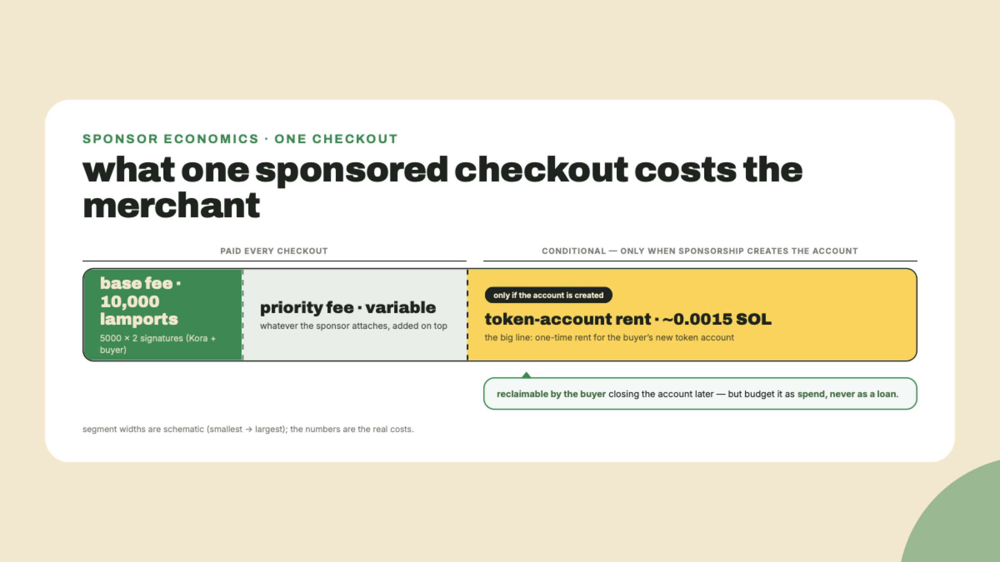
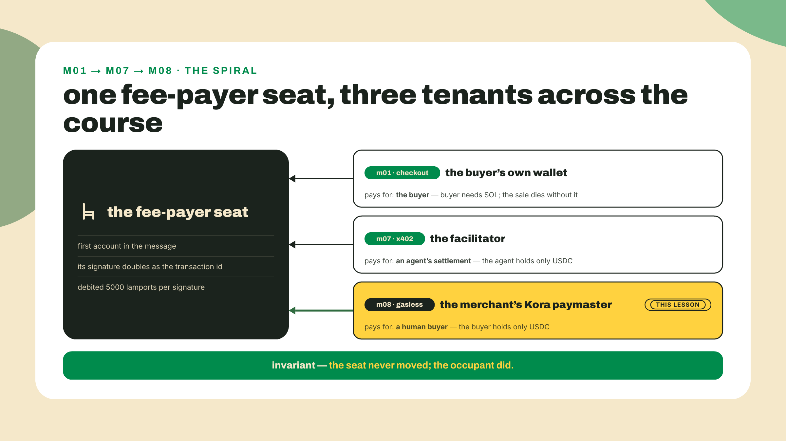
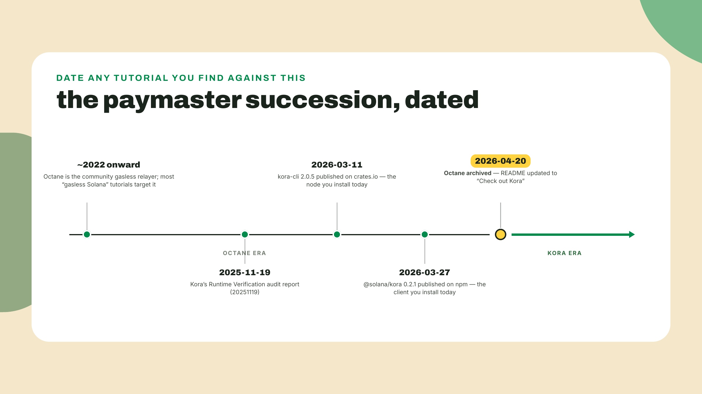
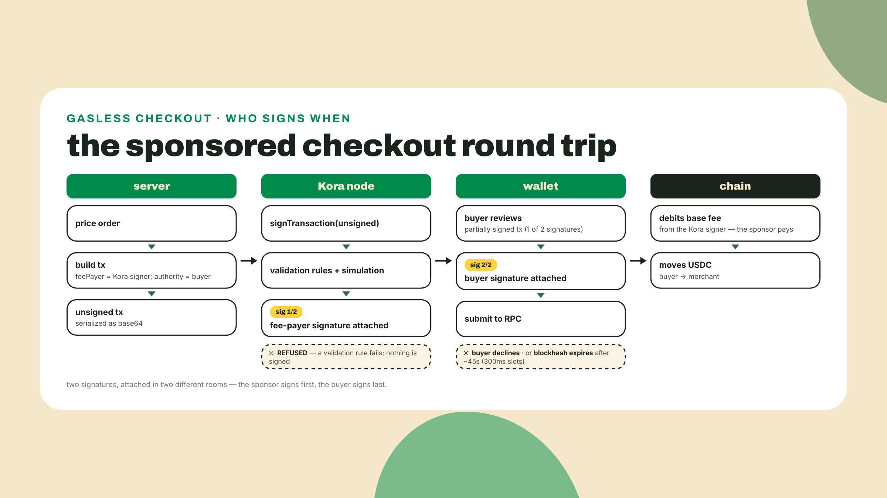
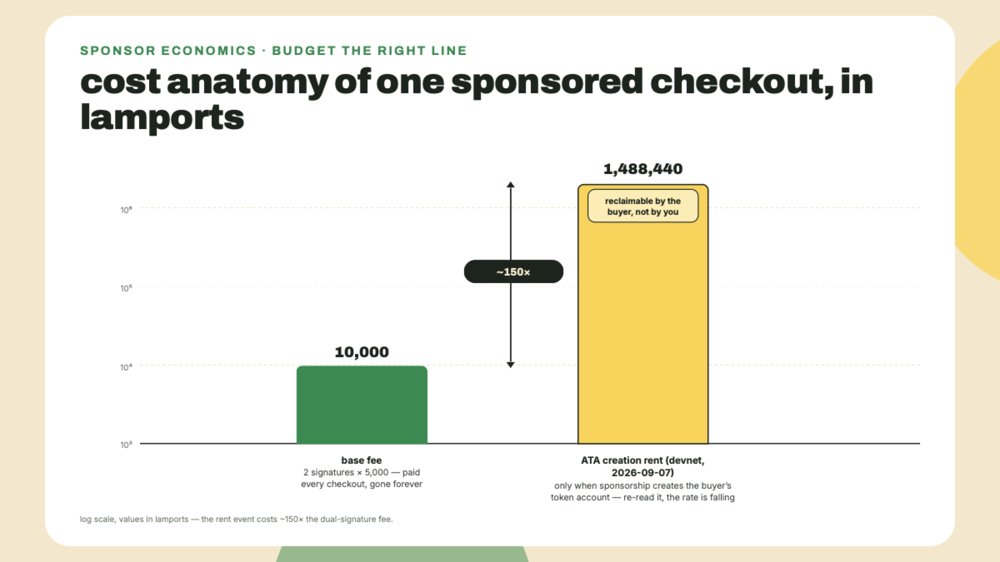
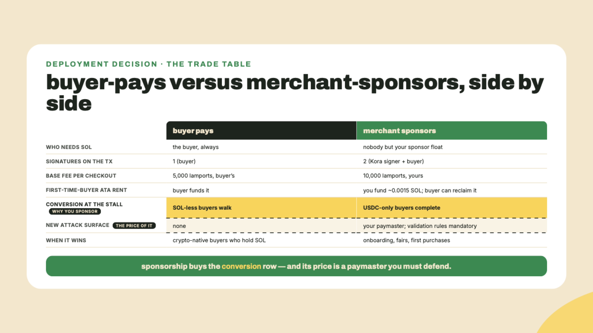
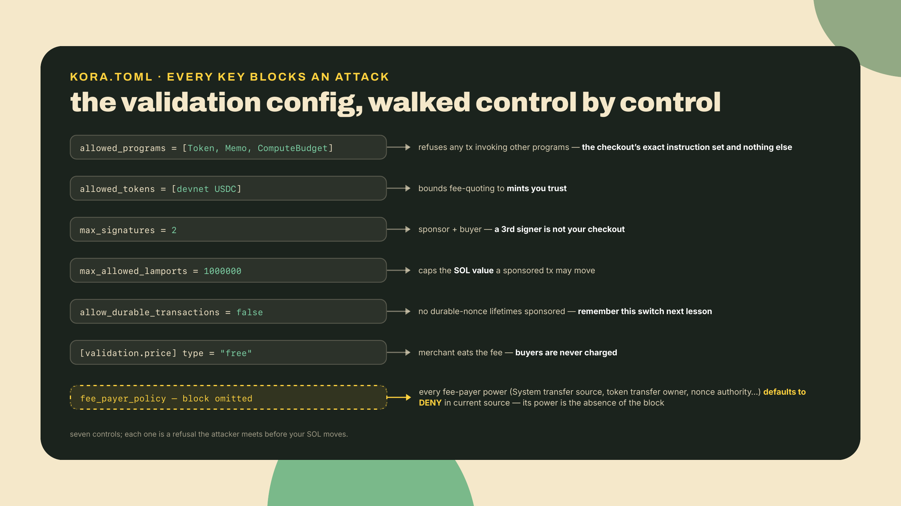
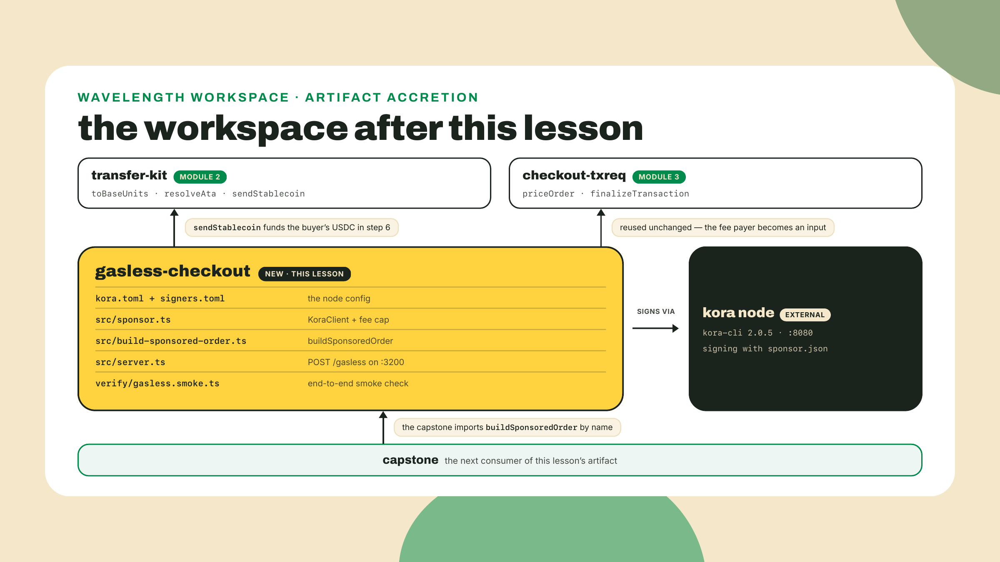

# Gasless with Kora: nobody brings SOL to a record fair

Last lesson you gated the pressing-price API with `pay`, one endpoint answering both x402 and MPP, and watched your paying agent settle straight through it. Carrying that settlement, as it has since you built the agent, was the facilitator: a service that settles an agent's payment and, quietly, pays the transaction fee while doing it. MPP's pull mode, the other protocol behind that gate, seats a server co-signer in the very same place, which is the thread last lesson told you to hold. That fee-payer seat is about to matter a lot more than it did.

Picture the Wavelength stall at a weekend record fair. A collector walks up, wants the limited August pressing, and has 30 USDC sitting in their wallet. They also have exactly zero SOL, because they bought stablecoins on an exchange and nobody told them a gas token existed. On the checkout you have built so far, their transaction cannot even pay its own 5000-lamport fee. They walk. You watch a sale die over half a cent of a token the buyer had no reason to own.

The fix is not "make the buyer get SOL." The fee payer does not have to be the buyer. It never had to be. Scaffold the workspace now so the install runs while you read, and mint the star of this lesson while you are at it: a buyer wallet that will never hold a single lamport.

```bash
cd ~/wavelength   # the workspace root; gasless-checkout must sit beside transfer-kit and checkout-txreq or the ../../ imports below cannot resolve
mkdir -p gasless-checkout/src gasless-checkout/verify
cd gasless-checkout
npm init -y
npm pkg set type=module   # the smoke script uses top-level await and import.meta
npm install @solana/kit@6.10.0 @solana-program/token@0.14.0 @solana/kora@0.2.1 express@5 \
  @solana/kit-plugin-instruction-plan@^0.6.0 @solana/kit-plugin-payer@^0.6.0 \
  @solana/kit-plugin-rpc@^0.6.0 @solana-program/compute-budget@0.16.0 --legacy-peer-deps
npm install -D tsx@4 typescript @types/express @types/node --legacy-peer-deps
solana-keygen new --no-bip39-passphrase -o buyer.json
```

Both install lines carry `--legacy-peer-deps`, and the second one is not a copy-paste slip. npm re-validates the whole dependency tree on every install, not just the packages you named, so the conflict below is re-evaluated when you add four dev tools that have nothing to do with it. Drop the flag from the second line and it exits with `ERESOLVE` before installing anything.

Pin notes, checked 2026-08-31. `@solana/kora` 0.2.1 is npm `latest`, published 2026-03-27 (the newer 0.3.0 betas sit on the `beta` tag only). It peers `@solana/kit` ^6.1.0, which our 6.10.0 satisfies cleanly, and this workspace stays on the v6 kit line like every checkout rung before it, so do not reach for the kit ^7 subscriptions client here. The wrinkle is that two of the SDK's other peer ranges are older than what this course pins: it asks for `@solana-program/token` ^0.12.0 against our 0.14.0, and `@solana-program/compute-budget` ^0.13.0 against our 0.16.0. npm's error message names whichever it hits first, usually compute-budget, so do not be surprised when the text differs from this paragraph. The names Kora actually imports from both packages exist unchanged at our pins, which is why `--legacy-peer-deps` is safe in this specific workspace and not a habit to keep. `express` 5 and `tsx` 4 are the same majors the transaction-request server already runs. `@solana-program/compute-budget` is pinned 0.16.0, the last minor whose peer range accepts a v6 kit (0.17.0 jumped its peer to ^7) — the same digit the fee-recipe lesson pins later this module, so the repo states one compute-budget number everywhere. `--legacy-peer-deps` also turns off npm's automatic peer installation, which is why the four plugin packages are named explicitly.

One more file before the theory, because a checkpoint later in the lab leans on it. This workspace reaches back into `transfer-kit` and `checkout-txreq` through relative paths, and the root `tsconfig.json` from module 2 only ever included `transfer-kit/src`, so `tsc` run here would type-check none of the files you are about to write. Give the workspace its own config:

```bash
cat > tsconfig.json <<'JSON'
{
  "compilerOptions": {
    "target": "ES2022",
    "module": "ESNext",
    "moduleResolution": "bundler",
    "strict": true,
    "noEmit": true,
    "skipLibCheck": true,
    "types": ["node"]
  },
  "include": ["src", "verify", "../transfer-kit/src", "../checkout-txreq/src"]
}
JSON
```

`moduleResolution: "bundler"` is the honest setting here rather than the root's `NodeNext`: every cross-package import in this course is written without a file extension, which is what `tsx` resolves and what `NodeNext` rejects. The `include` list is the point — it names the two sibling packages this workspace imports, so a stale relative path or a drifted function signature over there fails here instead of hiding until runtime.

## Summary

The findings index, each line actionable:

- The fee payer is a seat, not an identity. Module 1 asked who pays the fee and the answer was the buyer. Last lesson a facilitator paid it for an agent. Today a paymaster pays it for a human, and the buyer's wallet needs zero SOL, ever.
- Octane, the old answer to this problem, was archived on 2026-04-20 and its README now points at its successor. Kora is that successor: a JSON-RPC 2.0 paymaster node from the Solana Foundation, carrying a Runtime Verification audit (report 20251119), with fee payment in SPL tokens built in.
- You ship **gasless-checkout**: a locally run Kora node with a locked-down config, a sponsor client with a fee cap, and a sponsored builder that reuses `finalizeTransaction` from checkout-txreq with one changed input: the fee payer is now the Kora signer, not the buyer.
- The transaction carries two signatures: Kora signs as fee payer, the buyer signs only the transfer. The base fee is 5000 lamports per signature, so your sponsor pays 10,000 lamports per checkout, plus any priority fee you attach.
- The bigger cost hides elsewhere: if sponsorship creates a token account, that is the 165-byte rent-exempt minimum — ask `getMinimumBalanceForRentExemption(165)`, which answered 1,488,440 lamports on devnet on 2026-09-07 and is falling as SIMD-0437 steps the rate down — and the buyer can later reclaim it by closing the account. Budget it as spend, never as a loan.
- A paymaster with no validation rules is an open drain. Kora's allowlists and its fee-payer policy, which defaults to deny-everything when omitted, are the entire safety story: you will configure the allowlists and deliberately leave the fee-payer policy at its deny-by-default.
- Verify: `npx tsx verify/gasless.smoke.ts` prints `sponsored=true`, a fee payer equal to the Kora signer and not the buyer, a buyer lamport delta of exactly 0, and one buyer signature.

The division of labor, stated plainly: this is module 8, solo territory. The node config and the sponsored builder are worked because the Kora wiring is this course's last new integration surface. The fee-quote handling and the dual-signature assembly are completion TODOs against acceptance criteria, not walkthroughs. The validation rule that proves your paymaster refuses foreign transactions is entirely yours in the challenge.



## The fee-payer seat

### Third tenant, same seat

Every Solana transaction names one account as its fee payer: the first account in the message, the one whose signature doubles as the transaction's id, the one the runtime debits for the base fee. Nothing in the protocol says that account has to benefit from the transaction. It just has to sign and have lamports.

The course has been circling this seat since module 1. Back then the question "who pays the fee" had a boring answer: the buyer, because the buyer's wallet built the transaction and put itself first. Last lesson the answer got interesting: the x402 facilitator settled the agent's payment and sat in the fee-payer seat itself, which is precisely why your agent needed a USDC balance and no SOL. Today the pattern gets a name and a production tool. A paymaster (some ecosystems say relayer) is a service whose entire job is to occupy the fee-payer seat on other people's transactions, under rules its operator controls. Same seat all three times. The only thing that changed is who sits down.

One caution from the seam between last lesson and this one, since the two tools are natural neighbors: an x402 facilitator can itself run on Kora, and the official guide for that pairing still imports v1-style `x402` and `x402-express` package names. The live SDK is the scoped `@x402/*` v2 line you built against last lesson. Build v2, and read the guide's bare names as docs drift, not as an instruction.



### Octane died and named its successor

For years the stock answer to gasless on Solana was Octane, a community relayer that co-signed transactions in exchange for SPL tokens. If you search for "gasless Solana" today you will still find tutorials built on it. Do not follow them. Octane was archived on 2026-04-20, and its README now says "Check out Kora." A paymaster that died and pointed at its own successor is about the cleanest deprecation signal this ecosystem produces; take the hint at face value.

Kora is that successor: a paymaster node from the Solana Foundation, written in Rust, speaking JSON-RPC 2.0 over plain HTTP. You run it (or rent a hosted one), you give it a signer, and it exposes a small set of methods to your backend: `getConfig`, `getPayerSigner`, `getSupportedTokens`, `estimateTransactionFee`, `signTransaction`, `signAndSendTransaction`, and a few relatives. Two details matter for a merchant deciding whether to put it in the money path. First, it can price fees in SPL tokens, so a buyer with only USDC can pay their own fee in USDC if you configure that mode; today we run the simpler mode where the merchant just eats the fee. Second, it carries a Runtime Verification audit (report 20251119), which is the credibility datum that separates "a signer behind an open port" from infrastructure you can defend putting in the fee-payer seat of every sale you make.

The TypeScript side is one package, `@solana/kora`, which you already installed: a thin typed client where each method is one JSON-RPC call. No magic, and you will read the responses yourself in the lab.



### The dual-signature round trip

Here is the mechanical heart of the lesson, and it is smaller than it sounds. A Solana transaction is one message plus one signature per required signer, and every signer signs the same bytes. So a sponsored checkout is just a transaction with two required signers instead of one: the paymaster, listed first as fee payer, and the buyer, required because they are the authority on the USDC transfer. Neither signature is special beyond position. Assembly is a relay race:

1. Your server builds the transaction exactly as checkout-txreq always has, with one changed input: `feePayer` is the Kora signer's address (you ask the node via `getPayerSigner`), not the buyer.
2. The server sends the unsigned base64 transaction to Kora's `signTransaction`. Kora simulates it, runs it against its validation rules, and, if it passes, returns the same transaction with the fee-payer signature filled in. The buyer's slot is still empty. That is why the method takes `sig_verify: false` by default: it must be able to sign a transaction that is not fully signed yet.
3. The wallet receives that partially signed transaction, shows the buyer what it does, collects the buyer's signature, and submits. This is not a protocol trick bolted on the side: the transaction-request spec you implemented in module 3 explicitly allows the server to return a partially signed transaction, and this is the case that provision exists for.

Why `signTransaction` and not `signAndSendTransaction`, when the node offers both? Because of who is missing. At the moment Kora sees the transaction, the buyer has not signed yet, so the node cannot submit it; it can only contribute its signature and hand the bytes back. Sign-and-send exists for the inverse flow, where the client already holds a fully buyer-signed transaction and wants the paymaster to co-sign and relay in one hop. For a checkout, sign-only is also the safer default: the submission stays with the wallet, which means the buyer's decline is a real veto, not a race against a relay. The lab config disables the send variant outright, one less verb an attacker can probe.

Order matters in one direction only: Kora signs before the buyer because Kora's signature is computed over the message, and the message must be final (fee payer, instructions, blockhash) before anyone signs. After that, signatures can be attached in any order; they do not cover each other. And the blockhash inside sets your clock: about 150 blocks of validity, roughly 45 seconds at the current 300ms target slot time (SIMD-0525's 300ms stage took force at epoch 1024, 2026-08-28), which is plenty for build, co-sign, and a tap on a phone, and exactly why you build the transaction per request instead of pre-signing a pile of them.



### When the buyer pays the fee in USDC

Before the merchant-eats-it math, know the mode this lesson deliberately does not build, because you will meet it in the wild and the capstone may want it. Kora can charge the buyer for the fee in an SPL token instead of absorbing it. The flow adds one instruction: your server calls `estimateTransactionFee` with a `fee_token`, gets back both `fee_in_lamports` and `fee_in_token` (the same cost, denominated in the mint's own base units), then asks `getPaymentInstruction` for a small transfer of that token from the buyer to the node's payment address, appends it to the transaction, and proceeds exactly as before. The buyer still holds zero SOL; they just pay a few cents of USDC for the ride, and your sponsor float becomes a working-capital account that recycles instead of a subsidy that drains.

Two config knobs govern the price of that ride. `price_source` names the oracle that converts lamports to tokens, and the `[validation.price]` model sets the margin: `free` (today's mode, buyer pays nothing), `margin` (cost plus a percentage), or `fixed` (a flat amount per transaction, in a token you name). The lab pins `price_source = "Mock"` for a reason worth remembering: devnet mints have no live market, so a real oracle source would quote nonsense; production flips it to Jupiter pricing and the same config otherwise stands. Charge-the-buyer is the mode that turns a paymaster from a marketing cost into a payments feature, and every line of today's build is reusable under it: only the price model and one appended instruction change.

### What sponsorship costs, honestly

Now the part your accountant will ask about, because gasless is not free, it is prepaid by you.

The visible line is small. The base fee is 5000 lamports per signature, and the dual-signed checkout carries two, so each sponsored sale costs your float 10,000 lamports plus whatever priority fee you attach. One clarification that will save you a wrong diagnosis later: that 5000-lamport base fee is fixed and does not move with congestion. When the network is busy, what rises is the optional priority fee you choose to attach, never the base. If your sponsor wallet drains faster than your fee math predicts, the base fee is not the suspect. At this rate a 2 SOL airdrop underwrites tens of thousands of checkouts, and if the story ended there, sponsorship would be a rounding error.

It does not end there. The expensive event is the associated token account. If your sponsored flow ever creates an ATA for the buyer (their first USDC account, a new mint, a loyalty token), the rent deposit is the rent-exempt minimum for the 165-byte account, and you read it off `getMinimumBalanceForRentExemption(165)` rather than off any page including this one — on devnet on 2026-09-07 that was 1,488,440 lamports, roughly 150 times the fee on the entire dual-signed transaction. Re-read it before you budget, because SIMD-0437 is stepping the per-byte rate down and both clusters have already moved; the ratio is what is durable here, not the lamports. And here is the caveat the brief of every paymaster deployment should carry in bold: that rent is not gone, it is sitting in an account the buyer owns. The buyer can close that token account whenever they like and keep the reclaimed rent. There is no mechanism to return it to you. So treat sponsored rent as spend, priced into the sale like card-processing fees, and never book it as a recoverable loan. Run the napkin yourself for a hundred-buyer fair: a hundred dual-signed checkouts is 0.001 SOL of fees, and a hundred first-time-buyer ATAs is a hundred times whatever that curl just told you — two orders of magnitude apart at any rate the network has charged. The rent line is the budget; the fee line is noise.



The other honest line: when the buyer already has SOL, sponsorship is pure cost. You pay 10,000 lamports to save someone half a cent they could have paid themselves, and you widen your attack surface doing it. The mature deployment sponsors selectively (first purchase, onboarding flows, wallets with zero SOL) rather than reflexively. The comparison below is the decision in one glance, and it is the trade-off of this whole lesson: gasless removes the buyer's SOL requirement, and you pay for that twice, once in rent you should write off and once in a validation burden that is now mandatory.



### Validation is the product

Why so much ceremony about rules? Because a paymaster is a machine that signs other people's transactions with a funded key. Strip the validation away and you have built a faucet. Anyone who can reach the port can submit any transaction they like with your signer in the fee-payer seat: fee drain at minimum, and far worse if an instruction can spend from accounts your signer controls. The audit above covers Kora's code. Nothing audits your config but you.

Kora's config gives you layered controls, and the lab sets every one of them deliberately. `allowed_programs` is the outer wall: Kora refuses to sponsor any transaction that invokes a program off the list, and your checkout needs exactly three (the Token program for the TransferChecked, Memo for the order stamp, compute budget because wallets attach it). `allowed_tokens` bounds which mints it will quote fees in. `max_signatures` and `max_allowed_lamports` cap the blast radius of any single transaction. And then there is `fee_payer_policy`, the subtle one: fine-grained switches for whether the fee payer itself may be the source of a System transfer, the owner in a token transfer, a nonce authority, and a dozen similar roles. That policy is what stops the sharpest drain of all, a transaction whose inner instruction quietly moves lamports out of the sponsor account that is signing it.

The default posture is the right one: in the current source, every `fee_payer_policy` switch defaults to deny when the block is omitted from the config. The repo's sample config writes the block out explicitly — its switches happen to sit at false today, but a copied sample is one upstream edit away from opting you into powers you never chose. In the lab we omit the block on purpose and let deny-by-default do its job.



That is the trust surface, stated without alarm: you are running (or renting) a service that holds a funded key and signs what strangers send it, and the validation rules are the entire difference between a paymaster and a donation. Sober, not scary. Configure it like you mean it and the failure modes above stay theoretical.

The run-or-rent decision itself is ordinary infrastructure math, and worth thirty seconds now because it shapes what you deploy after this lesson. Running your own node, today's path, means you hold the sponsor key, you size the float, you watch its balance (Kora ships a metrics endpoint for exactly this), and you put an `api_key` or HMAC secret in `[kora.auth]` before the port ever faces the internet, because an unauthenticated paymaster is a public faucet with extra steps. Renting a hosted paymaster moves the ops burden and the key custody to someone else, and moves your trust there with it: their validation config, not yours, decides what gets sponsored in your name, so read it like a contract. Either way the mental model is the same one you built for the facilitator last lesson: a third party in the money path whose rules you must be able to recite. The difference is that this one signs with a wallet you fund.

## Lab: build gasless-checkout

What you are assembling, and where it sits in the Wavelength workspace:



1. **Install the paymaster and mint its signer.** The node is a Rust binary; the client SDK you already installed talks to it. Then create the sponsor wallet, the only wallet in this lesson that holds SOL, and fund it on devnet:

   ```bash
   cargo install kora-cli
   solana-keygen new --no-bip39-passphrase -o sponsor.json
   solana airdrop 2 $(solana-keygen pubkey sponsor.json) --url devnet
   ```

   Pin note: `cargo install kora-cli` resolves to 2.0.5 as of 2026-08-31 (published 2026-03-11; the 2.2.0 betas are pre-release, and `cargo install` ignores them); run `kora --version` and expect the 2.x line. This is the one step in the whole course that needs a Rust toolchain: if `cargo` is not on your machine, `rustup` (rustup.rs) installs it in one command, a five-minute detour — and if you have never touched Rust and would rather meet the toolchain properly than blind-install it, the Rust & TypeScript Fundamentals course stands it up from zero at the top of its module four, which opens by promising "Within ten minutes you will install the Rust toolchain" and a scaffold besides. Keep `sponsor.json` out of git and away from your merchant wallet: the sponsor is a float account you top up, sized so that losing it stings instead of ruins. Checkpoint: the airdrop confirms and `solana balance $(solana-keygen pubkey sponsor.json) --url devnet` prints 2 SOL.

2. **Configure the node.** Two files at the project root. First `kora.toml`, which is the validation section of the theory made literal (the skeleton is trimmed from the repo's own sample config; every departure from that sample is commented):

   ```toml
   # gasless-checkout/kora.toml
   [kora]
   rate_limit = 100

   [kora.auth]
   # open for local dev; set api_key or hmac_secret before this port faces the internet

   [kora.enabled_methods]
   liveness = true
   estimate_transaction_fee = true
   get_supported_tokens = true
   sign_transaction = true
   sign_and_send_transaction = false  # the wallet submits; this node only ever co-signs
   transfer_transaction = false       # not a checkout verb; off
   get_blockhash = true
   get_config = true
   get_payer_signer = true
   get_version = true

   [validation]
   max_allowed_lamports = 1000000
   max_signatures = 2                 # sponsor + buyer, nothing else
   price_source = "Mock"              # devnet mints have no live oracle price; Jupiter in prod
   allow_durable_transactions = false # stays off: next lesson's offline queue signs durable-nonce txs, and it deliberately does NOT route them through Kora (the merchant pays those fees directly)
   allowed_programs = [
       "TokenkegQfeZyiNwAJbNbGKPFXCWuBvf9Ss623VQ5DA", # Token program: the TransferChecked
       "MemoSq4gqABAXKb96qnH8TysNcWxMyWCqXgDLGmfcHr", # Memo v2: the order stamp
       "ComputeBudget111111111111111111111111111111", # compute budget: wallets attach it
   ]
   allowed_tokens = [
       "4zMMC9srt5Ri5X14GAgXhaHii3GnPAEERYPJgZJDncDU", # devnet USDC
   ]
   allowed_spl_paid_tokens = []
   disallowed_accounts = []

   [validation.price]
   type = "free"                      # merchant eats the fee; buyers pay zero

   # No [validation.fee_payer_policy] block on purpose: omitted means every
   # fee-payer power defaults to DENY. The repo's sample sets them all true.
   ```

   Then `signers.toml`, which tells the node where its key lives:

   ```toml
   # gasless-checkout/signers.toml
   [signer_pool]
   strategy = "round_robin"

   [[signers]]
   name = "wavelength_sponsor"
   type = "memory"
   private_key_env = "KORA_PRIVATE_KEY"
   weight = 1
   ```

   A memory signer reads its key from the named environment variable, and the value can be base58, a `[0, 1...]` byte array, or a path to a JSON keypair file. The path form means your `solana-keygen` output works as-is. Start the node in its own terminal:

   ```bash
   KORA_PRIVATE_KEY=./sponsor.json kora --rpc-url https://api.devnet.solana.com \
     --config kora.toml rpc start --signers-config signers.toml
   ```

   Kora listens on :8080 by default. Checkpoint, from a second terminal:

   ```bash
   curl -s http://localhost:8080 -H 'content-type: application/json' \
     -d '{"jsonrpc":"2.0","id":1,"method":"getPayerSigner","params":[]}'
   ```

   The response's `signer_address` must equal `solana-keygen pubkey sponsor.json`. That address is about to become the fee payer on every sale at the fair.

   Second checkpoint, and get in the habit of it: ask the node what it believes. Swap the method for `getConfig` in the same curl and read the JSON back. You should see your three allowed programs, the single allowed token, `max_signatures` at 2, and a `fee_payer_policy` whose switches are all false, the deny-by-default posture doing its work without you writing a single deny rule, which is honestly a godsend on the day someone edits this file in a hurry. If the response shows the sample config's everything-true policy instead, the node loaded a different `kora.toml` than the one you just wrote; fix the path before going further, because every security claim in this lesson depends on which file that process actually read.

3. **The sponsor client.** Create `src/sponsor.ts`. The client construction is given; the fee-quote handling is your first completion TODO, with its acceptance rules sitting on top of it:

   ```typescript
   // gasless-checkout/src/sponsor.ts
   // One KoraClient for the whole package, plus the quote-and-cap gate every
   // sponsored order passes through before we ask the node to sign anything.
   import { KoraClient } from '@solana/kora';

   const KORA_URL = process.env.KORA_URL ?? 'http://localhost:8080';

   export const USDC_DEVNET = '4zMMC9srt5Ri5X14GAgXhaHii3GnPAEERYPJgZJDncDU';

   // The most SOL we will ever sponsor for one checkout. Two signatures at the
   // 5000-lamport base fee is 10_000; the cap leaves headroom for a priority fee
   // without letting one weird transaction bite the float.
   export const MAX_SPONSOR_LAMPORTS = 20_000;

   export const kora = new KoraClient({ rpcUrl: KORA_URL });

   export interface SponsorQuote {
     feeToken: string;
     feeInLamports: number;
     signerAddress: string;
   }

   export async function quoteSponsorship(transactionBase64: string): Promise<SponsorQuote> {
     // TODO(completion) 1: three calls, three rules.
     // a) const { tokens } = await kora.getSupportedTokens();
     //    This reports [validation].allowed_tokens from kora.toml (the mints the
     //    node will validate inside transactions), NOT allowed_spl_paid_tokens
     //    (the mints buyers may pay fees in, empty in our free mode), so under
     //    the config you just wrote the list is exactly one entry: devnet USDC.
     //    Pick USDC_DEVNET out of it; if it is absent, throw. An empty or
     //    surprising list means the node config drifted, and you want that loud.
     // b) const est = await kora.estimateTransactionFee({
     //      transaction: transactionBase64, fee_token: <the mint from a> });
     // c) if (est.fee_in_lamports > MAX_SPONSOR_LAMPORTS) throw with both numbers
     //    in the message; otherwise return { feeToken, feeInLamports:
     //    est.fee_in_lamports, signerAddress: est.signer_pubkey }. (Yes, the
     //    node spells the same key `signer_address` on getPayerSigner and
     //    `signer_pubkey` on the estimate and sign calls; two spellings, one
     //    sponsor key, and under type = "free" the estimate's fee_in_token is
     //    informational only, since the buyer is never charged.)
     throw new Error('Your turn: quote the fee and enforce the cap per a, b, c above.');
   }
   ```

   Why cap something the config already prices as free? Because "free" is the buyer's price, not yours, and `estimateTransactionFee` reports what the sponsor will actually be debited. The cap is your circuit breaker for the day a wallet attaches an absurd priority fee to a transaction you are about to co-sign.

   Done looks like this, and step 7 is where you find out: `quoteSponsorship` returns a `SponsorQuote` whose `signerAddress` matches the `getPayerSigner` address from step 2, and throws with both numbers in the message the moment an estimate exceeds `MAX_SPONSOR_LAMPORTS`.

4. **The sponsored builder.** Create `src/build-sponsored-order.ts`. Fully worked, and worth reading closely for how little is new: pricing is `priceOrder` from module 3, assembly is `finalizeTransaction` from module 3, and the only structural change is whose address lands in the `feePayer` slot:

   ```typescript
   // gasless-checkout/src/build-sponsored-order.ts
   // Same pricing, same assembly tail as checkout-txreq. One changed input:
   // the fee payer is the Kora signer, and Kora co-signs before the buyer sees it.
   import { address, generateKeyPairSigner, type Address } from '@solana/kit';
   import { getTransferCheckedInstruction, TOKEN_PROGRAM_ADDRESS } from '@solana-program/token';
   import { resolveAta } from '../../transfer-kit/src/index';
   import { priceOrder, type OrderLine } from '../../checkout-txreq/src/catalog';
   import { finalizeTransaction } from '../../checkout-txreq/src/build-order-transaction';
   import { kora, quoteSponsorship } from './sponsor';

   const USDC_MINT = address('4zMMC9srt5Ri5X14GAgXhaHii3GnPAEERYPJgZJDncDU');
   const USDC_DECIMALS = 6;

   function merchantAddress(): Address {
     const configured = process.env.MERCHANT_ADDRESS;
     if (!configured) throw new Error('set MERCHANT_ADDRESS to the wallet checkout already pays');
     return address(configured);
   }

   export interface SponsoredOrderInput {
     account: string;      // the buyer's base58 pubkey, straight from the wallet POST
     lines: OrderLine[];
     orderId?: string;
   }

   export interface SponsoredOrder {
     transactionBase64: string; // already carries the sponsor's signature
     feePayer: string;          // the Kora signer; verify prints this
     reference: Address;
     memo: string;
     totalUsdc: string;
   }

   export async function buildSponsoredOrder(input: SponsoredOrderInput): Promise<SponsoredOrder> {
     const priced = priceOrder(input.lines);
     const buyer = address(input.account);
     const reference = (await generateKeyPairSigner()).address;
     const orderId = input.orderId ?? `fair-${Date.now().toString(36)}`;
     const memo = `wavelength:${orderId}:${priced.description}`;

     const { signer_address } = await kora.getPayerSigner();

     // Third seed since the roster lesson: the owning token program. Devnet
     // USDC is classic Token, so it is static here, exactly as in m03's builder.
     const sourceAta = await resolveAta(buyer, USDC_MINT, TOKEN_PROGRAM_ADDRESS);
     const destinationAta = await resolveAta(merchantAddress(), USDC_MINT, TOKEN_PROGRAM_ADDRESS);

     const transferIx = getTransferCheckedInstruction({
       source: sourceAta,
       mint: USDC_MINT,
       destination: destinationAta,
       authority: buyer,          // the buyer stays the transfer authority
       amount: priced.baseUnits,
       decimals: USDC_DECIMALS,
     });

     // The m03 tail, unchanged: reference injected, memo stamped, blockhash set.
     // The fee payer was always an input; today is the day that pays off.
     const unsignedBase64 = await finalizeTransaction({
       feePayer: address(signer_address),
       transferIx,
       reference,
       memo,
     });

     const quote = await quoteSponsorship(unsignedBase64);
     console.log(`[gasless] quote: ${quote.feeInLamports} lamports, cap ok`);

     const signed = await kora.signTransaction({ transaction: unsignedBase64 });

     return {
       transactionBase64: signed.signed_transaction,
       feePayer: signed.signer_pubkey,
       reference,
       memo,
       totalUsdc: priced.totalUsdc,
     };
   }
   ```

   The capstone imports `buildSponsoredOrder` by this name, so the export is load-bearing the same way `finalizeTransaction` was in module 3. It also mounts the server you are about to write into the assembled stack, so keep the routes below on `/gasless` — this is a surface in its own right, not a branch of the transaction-request app that happens to reuse its tail. Notice also what did not change: no amount field on the input, ever. A sponsored checkout is still a checkout, and the server still owns the price.

   Checkpoint: `npx tsc --noEmit -p tsconfig.json` from `gasless-checkout` type-checks clean. Point it at this workspace's own config, not the root one — the `-p` is what makes the check real, because the root config from module 2 includes only `transfer-kit/src` and would exit 0 on a file it never opened. With the right config it is the cheapest way to catch a stale relative path in the three cross-package imports (`transfer-kit`, the m03 catalog, the m03 builder), or a helper over there whose signature moved since you last called it, before the server hides either behind a 400.

5. **The fair server.** Create `src/server.ts`. Fully worked; it is the transaction-request pair you know, on its own port, returning a transaction that already carries one of its two signatures:

   ```typescript
   // gasless-checkout/src/server.ts
   // The gasless endpoint: GET for display metadata, POST {account} returns a
   // PARTIALLY SIGNED base64 transaction. Kora signed as fee payer; the buyer's
   // wallet adds the second signature and submits.
   import express from 'express';
   import type { Request, Response } from 'express';
   import { buildSponsoredOrder } from './build-sponsored-order';
   import type { OrderLine } from '../../checkout-txreq/src/catalog';

   const app = express();
   app.use(express.json());

   // :3200 is also where module 6's ramp-embed session route listens, and that
   // port is registered in your CDP allowlist, so do not renumber it there.
   // Stop the ramp server before starting this one, or run this on another
   // port with PORT=3210 -- nothing here hardcodes 3200 but this default.
   const PORT = Number(process.env.PORT ?? 3200);

   const ORDERS = new Map<string, { lines: OrderLine[] }>([
     // The limited August pressing, priced at 30 in the m03 catalog and kept
     // at 30 exactly ever since. This is the sale from the lesson's opener.
     ['fair-045', { lines: [{ sku: 'WVL-045', quantity: 1 }] }],
   ]);

   app.get('/gasless', (_req: Request, res: Response) => {
     res.json({ label: 'Wavelength Records (fees on us)', icon: 'http://localhost:3100/icon.png' });
   });

   app.post('/gasless', async (req: Request, res: Response) => {
     const account: unknown = (req.body as { account?: unknown } | undefined)?.account;
     if (typeof account !== 'string' || account.length === 0) {
       res.status(400).json({ message: 'Body must be { "account": "<base58 pubkey>" }' });
       return;
     }
     const orderId = typeof req.query.order === 'string' ? req.query.order : 'fair-045';
     const order = ORDERS.get(orderId);
     if (!order) {
       res.status(404).json({ message: `unknown order: ${orderId}` });
       return;
     }
     try {
       const built = await buildSponsoredOrder({ account, lines: order.lines, orderId });
       console.log(
         `[gasless] order ${orderId}: ${built.totalUsdc} USDC, fee payer ${built.feePayer}, ref ${built.reference}`,
       );
       res.json({
         transaction: built.transactionBase64,
         message: `Wavelength Records: ${built.totalUsdc} USDC, network fee on us`,
         feePayer: built.feePayer,
       });
     } catch (err) {
       const message = err instanceof Error ? err.message : 'could not build the sponsored order';
       console.log(`[gasless] REFUSED order ${orderId}: ${message}`);
       res.status(400).json({ message });
     }
   });

   app.listen(PORT, () => {
     console.log(`gasless-checkout listening on :${PORT}`);
   });
   ```

   Run it in a third terminal, with the same merchant wallet checkout has paid all course:

   ```bash
   MERCHANT_ADDRESS=$(solana address) npx tsx src/server.ts
   ```

   If that exits with `EADDRINUSE`, module 6's ramp-embed session route is still holding the port: stop it (ctrl-C in its terminal), or start this one with `PORT=3210` and set `SERVER_URL` to match in the smoke check below. The ramp route keeps :3200 because that exact origin is registered in your CDP allowlist and changing it means editing a dashboard; this server has no such tie, so it is the one that moves. Checkpoint: `gasless-checkout listening on :3200`, and the Kora terminal stays quiet until a POST arrives. The `REFUSED` log line in the catch block is the denial evidence the challenge and this lesson's gate both ask you to produce.

6. **Fund the buyer with USDC and nothing else.** The buyer wallet you minted in the scaffold has no SOL, and it stays that way. Give it the record money using your own module 2 kit, from the workspace root:

   ```bash
   npm run --workspace transfer-kit pay -- $(solana-keygen pubkey gasless-checkout/buyer.json) 31
   ```

   The extra dollar over the 30 USDC pressing price is deliberate: after the sale the buyer should end at 1 USDC, not 0, so an exact-price debit reads as success and a drained-to-zero balance reads as a bug.

   Two things happen here that echo the theory. Your merchant wallet pays the transfer fee, and it also funds the buyer's USDC ATA, which is the rent event from the cost section, just paid on the funding leg instead of the checkout leg. Same economics, same owner: that rent now lives in an account the buyer controls. Checkpoint: `solana balance $(solana-keygen pubkey gasless-checkout/buyer.json) --url devnet` prints exactly 0 SOL, and the pay script's receipt shows 31 USDC delivered. A wallet with money and no gas: the collector from the opener, reproduced.

7. **The smoke check.** Create `verify/gasless.smoke.ts`. It plays the buyer's wallet: request the sponsored transaction, verify who the fee payer is, add the buyer's signature, submit, and prove the buyer paid zero lamports. The dual-signature assembly is your second completion TODO:

   ```typescript
   // gasless-checkout/verify/gasless.smoke.ts
   // Plays the wallet for a SOL-less buyer. Proves: fee payer is the Kora signer,
   // the buyer contributed exactly one signature, and the buyer paid 0 lamports.
   import { readFile } from 'node:fs/promises';
   import {
     createKeyPairSignerFromBytes,
     createSolanaRpc,
     getBase64Encoder,
     getBase64EncodedWireTransaction,
     getCompiledTransactionMessageDecoder,
     getTransactionDecoder,
     partiallySignTransaction,
   } from '@solana/kit';
   import { KoraClient } from '@solana/kora';

   const rpc = createSolanaRpc(process.env.RPC_URL ?? 'https://api.devnet.solana.com');
   const kora = new KoraClient({ rpcUrl: process.env.KORA_URL ?? 'http://localhost:8080' });
   const SERVER = process.env.SERVER_URL ?? 'http://localhost:3200';

   const bytes = new Uint8Array(JSON.parse(await readFile(new URL('../buyer.json', import.meta.url), 'utf8')));
   const buyer = await createKeyPairSignerFromBytes(bytes);

   const before = (await rpc.getBalance(buyer.address).send()).value;

   const res = await fetch(`${SERVER}/gasless?order=fair-045`, {
     method: 'POST',
     headers: { 'content-type': 'application/json' },
     body: JSON.stringify({ account: buyer.address }),
   });
   if (!res.ok) throw new Error(`server said ${res.status}: ${await res.text()}`);
   const { transaction } = (await res.json()) as { transaction: string };

   const sponsoredTx = getTransactionDecoder().decode(getBase64Encoder().encode(transaction));

   // Who is the fee payer? First static account of the message, by layout.
   const message = getCompiledTransactionMessageDecoder().decode(sponsoredTx.messageBytes);
   const feePayer = message.staticAccounts[0];
   const { signer_address } = await kora.getPayerSigner();
   if (feePayer !== signer_address) throw new Error(`fee payer ${feePayer} is not the Kora signer ${signer_address}`);
   if (feePayer === buyer.address) throw new Error('buyer is paying its own fee; sponsorship failed');

   // TODO(completion) 2: the dual-signature assembly.
   // a) const dualSigned = await partiallySignTransaction([buyer.keyPair], sponsoredTx);
   //    partiallySignTransaction ADDS the buyer's signature and preserves Kora's.
   // b) assert dualSigned.signatures[buyer.address] is non-null (the buyer signed),
   //    and that ALL entries in dualSigned.signatures are non-null (2 of 2 present).
   const dualSigned = sponsoredTx; // replace me

   const buyerSigned = dualSigned.signatures[buyer.address] != null;
   const totalSigs = Object.values(dualSigned.signatures).filter((s) => s != null).length;

   const signature = await rpc
     .sendTransaction(getBase64EncodedWireTransaction(dualSigned), { encoding: 'base64' })
     .send();

   for (let i = 0; i < 30; i++) {
     const status = (await rpc.getSignatureStatuses([signature]).send()).value[0];
     if (status?.confirmationStatus === 'confirmed' || status?.confirmationStatus === 'finalized') break;
     await new Promise((resolve) => setTimeout(resolve, 2000));
   }

   const after = (await rpc.getBalance(buyer.address).send()).value;

   console.log('sponsored=true');
   console.log(`feePayer=${feePayer} (kora signer, not the buyer)`);
   console.log(`buyerLamportDelta=${(after - before).toString()}`);
   console.log(`buyerSignatures=${buyerSigned ? 1 : 0} of ${totalSigs} total`);
   console.log(`signature=${signature}`);
   ```

   With both TODOs filled and all three terminals running (Kora on :8080, the server on :3200, this script), run the gate:

   ```bash
   npx tsx verify/gasless.smoke.ts
   ```

   Expected output, with your own addresses:

   ```
   sponsored=true
   feePayer=Ay5u...your sponsor pubkey (kora signer, not the buyer)
   buyerLamportDelta=0
   buyerSignatures=1 of 2 total
   signature=4dJx...a devnet signature
   ```

   That zero is the whole lesson. A wallet that has never held a lamport just bought a limited pressing, and the sale settled on-chain like any other. If you see a signature-verification failure instead, your TODO 2 submitted the transaction before the buyer signed; if Kora's terminal shows a refusal, read its reason, because that is your validation config speaking, and it is exactly the voice you want loud.

## Challenge

**Completion.** Fill the two TODO sites: `quoteSponsorship` in `src/sponsor.ts` per its three rules, and the dual-signature assembly in `verify/gasless.smoke.ts` per its two. Acceptance is the gate above, verbatim: a SOL-less devnet buyer completes the purchase, the printed fee payer equals the Kora signer and not the buyer, `buyerLamportDelta=0`, one buyer signature present. Keep the devnet signature and the decoded fee-payer pubkey; they are this lesson's answer artifacts.

**Solo, no walkthrough.** Your paymaster currently trusts your server. Prove it refuses everyone else. Hand-craft a transaction that your checkout would never emit, a System program transfer is the classic (note the config's allowlist never included the System program, on purpose: existing ATAs mean checkout never touches it). Build it with the same kit calls you used in module 3, set the fee payer to the Kora signer address, and send it straight to the node's `signTransaction`. Then tighten the screws once more: add a `disallowed_accounts` entry or drop `max_signatures` to 1, restart the node, and watch your own honest checkout fail too, then restore it. Acceptance: the off-allowlist request is refused with a Kora error naming the violation, your server's `REFUSED` log line captures a denial end to end, and the honest flow still passes afterward. Save the denied-request log line next to the devnet signature; the gate asks for both.

If the crafted transaction gets sponsored instead of refused, check which config file the running node actually loaded before you doubt the rules; a stale `kora.toml` path is the classic false alarm here, and `getConfig` from the SDK will show you exactly what the node believes.

One request before you shut the terminals down. This lesson stood up more moving parts than any rung so far: a Rust node, two config files, three processes. If one of them fought you, note which (the cargo install, the signer env, the peer-deps wrinkle), because the capstone assumes this stack starts clean and friction notes are how it gets there. And if your crafted drain got refused on the first try, say so out loud somewhere; you just watched a validation config earn its keep, which is a thing most people only learn from the incident postmortem.

Your stall can now sell to a buyer with no SOL. Next lesson takes away something bigger: the network. A record fair in a basement with no signal, sales that still need signing, and a queue that drains when you get back online. The fee payer kept the sale alive today; durable nonces keep it alive offline.
