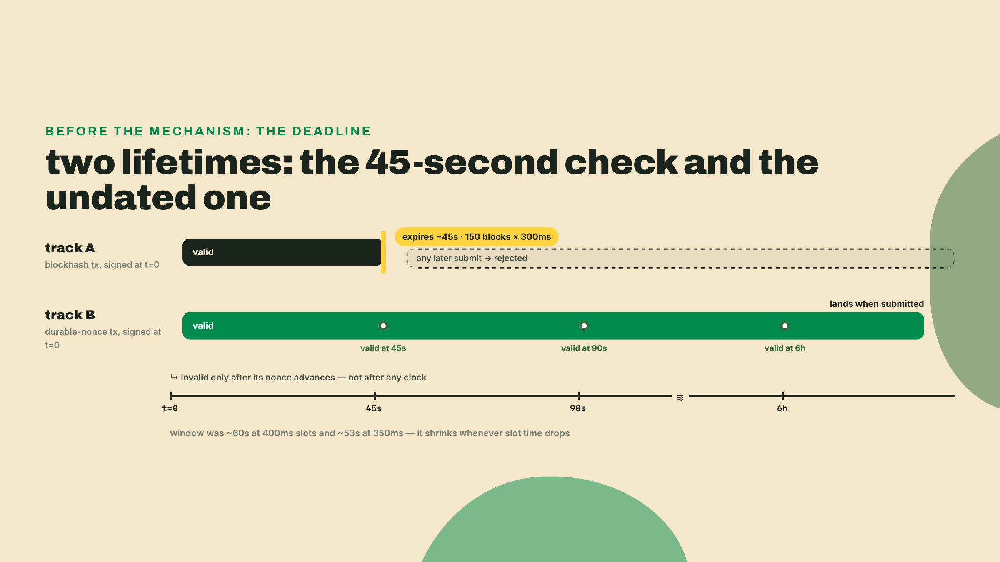
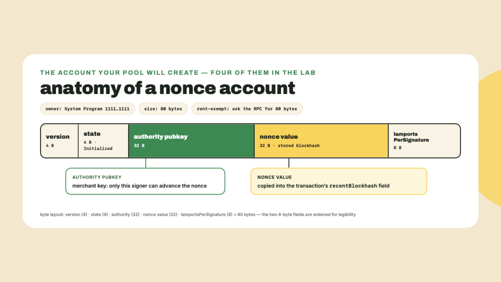
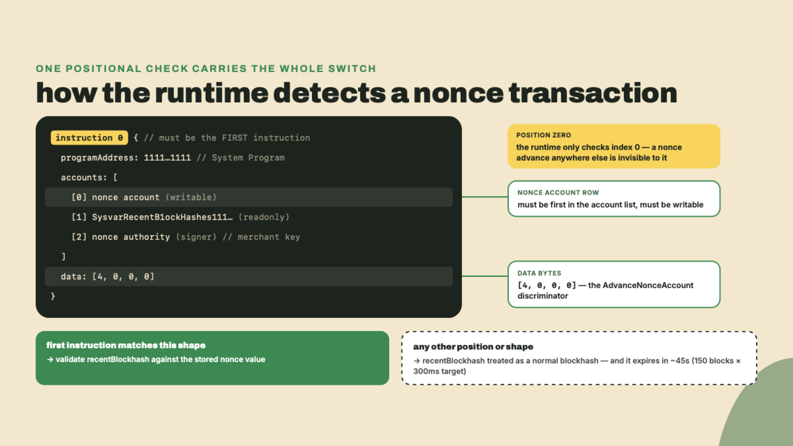
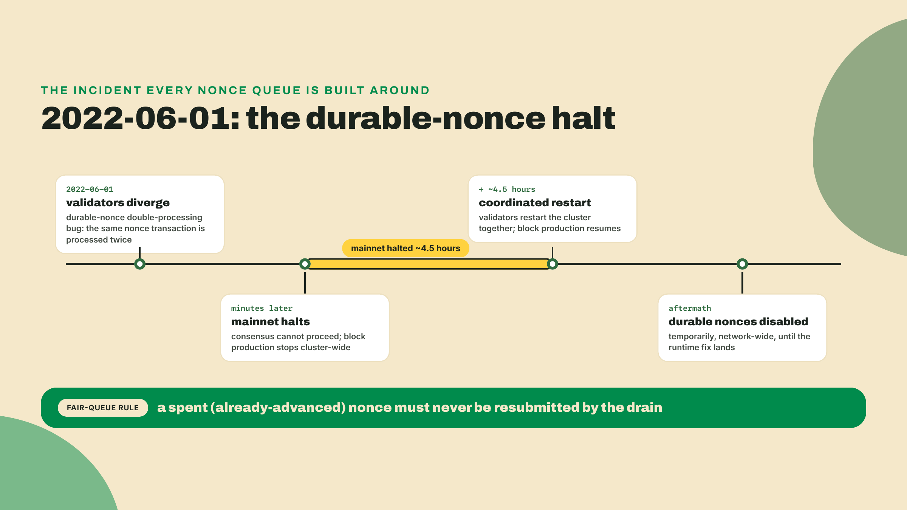
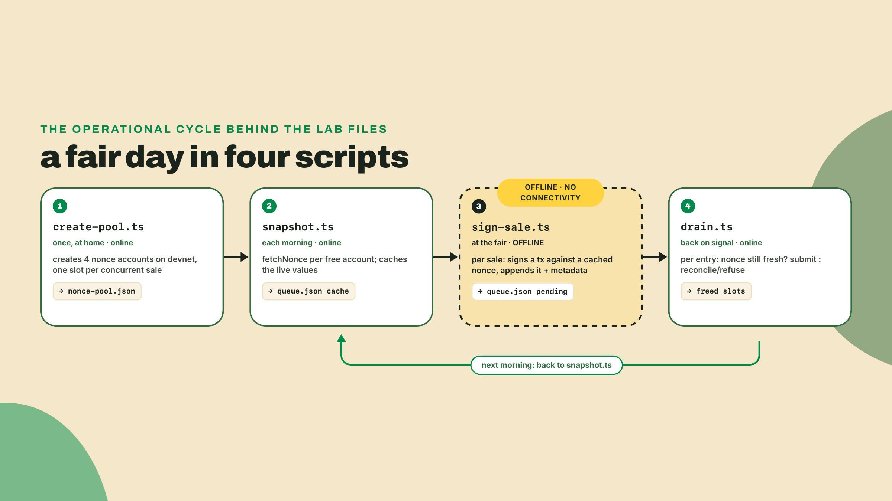
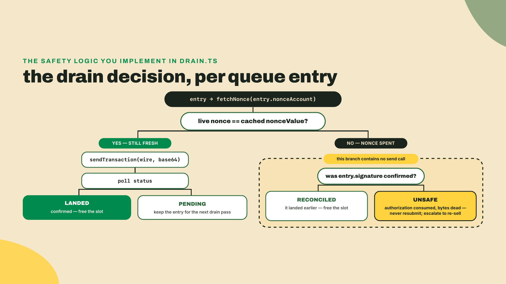
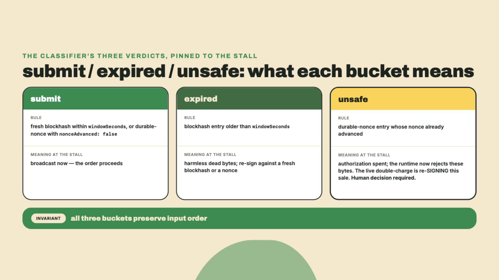

# Deferred payments: durable nonces at the fair (and the outage that scarred them)

## Summary

Last lesson you sponsored fees: a Kora paymaster co-signed the checkout so a buyer with USDC and zero SOL could still walk away with the pressing. This lesson removes the other assumption every checkout you have built so far quietly makes, which is a live network that is up and reachable at the exact moment a buyer says yes. The record fair is in a basement. There is no signal. You take a sale anyway.

Here is what today establishes, up front:

- A normal transaction carries a wall-clock deadline you have never had to think about: its blockhash is valid for 150 blocks (`MAX_PROCESSING_AGE = 150`), which at the current 300ms target slot time works out to 45 seconds. Not "about a minute". Forty-five seconds, and shrinking every time slot time drops.
- A durable nonce replaces the blockhash with a value stored in an on-chain account that does not move until you advance it. Sign in the basement at noon, submit from the sidewalk at six, the transaction is still valid.
- The primitive has two scars, and both are load-bearing: the official docs warn it may be deprecated, and a durable-nonce double-processing bug halted Solana mainnet for about 4.5 hours on 2022-06-01. You will build the queue around both.
- The artifact is `fair-queue`, a new sibling workspace beside pos-stall (the stall itself is not edited today): sales signed offline against a nonce pool, drained when connectivity returns, with a drain step that refuses, structurally, to rebroadcast a spent nonce.

Before any theory, get the workspace standing. `fair-queue` sits next to `checkout-txreq` and `pos-stall` in your Wavelength workspace:

```bash
cd ~/wavelength   # the workspace root; last lesson left you inside gasless-checkout
mkdir fair-queue && cd fair-queue
npm init -y && npm pkg set type=module
npm install @solana/kit@6.10.0 @solana-program/system@0.12.2
npm install -D tsx typescript @types/node
```

Pin notes, checked 2026-08-31: this stays in the course's kit v6 workspace, and `@solana-program/system` 0.12.2 is the last release that peers `@solana/kit ^6.x`. The 0.13.0 release (2026-07-15) jumped to kit ^7 and 0.14.0 to kit ^8, so `npm install @solana-program/system` with no version would hand you a peer-dependency error against this workspace. Pin it.

## A check with no date

### The deadline you have been living with

Every transaction this course has built so far, the checkout, the stall, the subscriptions crank, the sponsored purchase, carried a `recentBlockhash`. You have treated it as a freshness stamp and moved on, and that was correct: for an online checkout the deadline never bites. Today it bites, so let's actually derive it.

The rule: a transaction's blockhash must be no older than 150 blocks, a constant the validator code names `MAX_PROCESSING_AGE`. The queue depth is fixed in blocks, not seconds, so the wall-clock window is `150 x slot time`. At the old 400ms slots that was about 60 seconds; at SIMD-0525's 350ms stage (in force 2026-08-21) it was ~53. Today's target is 300ms, the next stage having taken force at epoch 1024 on 2026-08-28, so the window is 150 x 0.30 = 45 seconds. Two more staged cuts, 250ms and then 200ms, are already gated in the code and have both taken force on devnet, which is a whole ladder ahead of mainnet: on mainnet the 250ms and 200ms feature accounts do not yet exist. So mainnet's window shrinks again the day each one flips there, and 200ms is the bottom of SIMD-0525's ladder. That is why this course keeps saying derive it, never memorize it — and, as the probe below is about to show, why you derive it from your cluster rather than from the ladder.

Don't take my arithmetic for it. Create `probe.ts` and watch a blockhash die in real time:

```typescript
import { createSolanaRpc } from '@solana/kit';

const rpc = createSolanaRpc(process.env.RPC_URL ?? 'https://api.devnet.solana.com');

const {
  value: { blockhash, lastValidBlockHeight },
} = await rpc.getLatestBlockhash().send();
const start = Date.now();
console.log(`got ${blockhash}, valid until block height ${lastValidBlockHeight}`);

let height = await rpc.getBlockHeight().send();
while (height <= lastValidBlockHeight) {
  await new Promise((r) => setTimeout(r, 5000));
  height = await rpc.getBlockHeight().send();
}
console.log(`expired after ~${Math.round((Date.now() - start) / 1000)}s`);
```

Run it with `npx tsx probe.ts`. Mine printed 28 seconds, give or take the 5-second polling grain, and that surprise is itself the lesson: the probe runs against devnet, which runs ahead of mainnet on slot time and therefore burns through its 150-block window faster — measured 2026-09-07, devnet was producing a slot roughly every 165ms against mainnet's ~320ms, on `solana-core` 4.3.0-beta.3. Read 165ms twice, because it is under 200ms, the bottom of the ladder above, and that is not a typo. Devnet has activated all four gates, so its *target* is 200ms; it was running faster than its own target. Mainnet, on the 300ms stage, measured ~320ms — slower than its own target. Neither cluster sits on its stated number, and SIMD-0525 says so itself: the table sets per-slot work, hashes per tick and block limits, and the SIMD notes that none of its timing values "are explicitly in protocol and may deviate from reality." The stage is what the network aims at, not a clock it is held to. Which is the whole argument for the probe: `getRecentPerformanceSamples` returns `numSlots` and `samplePeriodSecs`, and dividing one by the other is your cluster's current slot time, ladder or no ladder. Do not take either number from this page. Whatever it says, devnet's window is tighter than mainnet's ~45 seconds, and both keep shrinking. Whatever your probe prints, that number is the whole problem statement: in the basement, the gap between "buyer signed" and "you have bars again" is measured in hours, and the transaction's patience is measured in seconds. No retry loop fixes this, because rebroadcasting an expired transaction does not extend its life; the hash is simply too old, and the RPC will keep telling you so no matter how politely you ask again.



If you came up through card payments, you have seen this problem solved before. Store-and-forward terminals have taken cards on airplanes and in basements for decades: the terminal records the authorization offline and forwards the batch when it reconnects, and the acquirer sorts out the risk later. The reason Solana needs a dedicated primitive for the same move is that there is no acquirer to absorb ambiguity. Validation is global and mechanical, every node must agree on whether a transaction is fresh, and the freshness rule is that 150-block window. So the chain-native version of store-and-forward cannot just hold bytes and hope; it has to change what "fresh" means for that transaction.

The silver bullet? A transaction whose freshness stamp you control. That is exactly what a durable nonce is: instead of pointing at a recent block, the transaction points at a value stored in an account, and that value only changes when its authority says so. The official docs put it in one sentence: durable nonce transactions replace the recent blockhash with a stored nonce value, removing the 150-slot expiry window, which enables offline signing and delayed submission. A check with no date on it.

### The nonce account, field by field

The stored value lives in a nonce account: a System Program-owned account, 80 bytes of data, that must be rent-exempt (about 0.00106 SOL at that size on devnet on 2026-09-07, and falling; your code asks the RPC rather than hardcoding it, which is the whole reason that figure is safe to print here). Fetch one with the generated client and you get the whole state back typed:

```typescript
import { fetchNonce } from '@solana-program/system';

const { data } = await fetchNonce(rpc, nonceAccountAddress);
// data.version               -> account format version
// data.state                 -> must be Initialized to back a transaction
// data.authority             -> the pubkey allowed to advance, withdraw, reauthorize
// data.blockhash             -> THE nonce value: a hash derived from a recent blockhash
// data.lamportsPerSignature  -> the fee rate captured when the nonce last advanced
```

Two fields do the work. `authority` is the nonce authority, the account that must sign any instruction that moves this nonce; for the fair queue that is the merchant key, the same signer that runs checkout-txreq. And `blockhash` is the nonce value itself. The name is not an accident: the value is a hash derived from a real blockhash at the moment of the last advance, and it goes into the transaction's `recentBlockhash` field as the same 32 bytes, so the wire format never changes. What changes is how the runtime validates it. The remaining field, `lamportsPerSignature`, records the fee rate captured when the nonce last advanced, a leftover of the account's role in fee accounting that you will read and never touch.

Cost, since a merchant should always know it. The rent deposit for 80 bytes was 1,056,640 lamports on devnet and 1,317,264 on mainnet when I read it on 2026-09-07, and both keep falling as SIMD-0437 steps the per-byte rate down — so read yours from `getMinimumBalanceForRentExemption(80)` rather than from this sentence. It is a deposit, not a fee: `WithdrawNonceAccount` returns every lamport to the authority the day you retire a slot, so a four-slot pool ties up about four times that number for as long as you run the stall and costs you nothing to unwind. Per transaction, the durable-nonce path is slightly heavier than a blockhash one, since every sale carries the extra advance instruction and its accounts. For a payments flow that trade is invisible; the base fee math you did in module 1 still dominates.



### Instruction 0 or nothing

How does a validator know a transaction is using a durable nonce and not a stale blockhash? It looks at exactly one place: instruction 0. If, and only if, the first instruction in the transaction is the System Program's `AdvanceNonceAccount`, with the nonce account as that instruction's first account and writable, the runtime switches validation modes. It loads the nonce account, checks it parses as `Initialized`, and checks the stored value matches the transaction's `recentBlockhash` field. Match, and the transaction proceeds; the advance instruction then rolls the stored value to a new hash, which is what makes this nonce single-use. Put the advance anywhere but first and you do not have a durable-nonce transaction at all, just a normal one carrying a blockhash the queue will have long expired.

The instruction itself is tiny: three accounts (nonce account, the recent-blockhashes sysvar, the authority as signer) and four bytes of data, `[4, 0, 0, 0]`, the System Program's discriminator for AdvanceNonceAccount. Those four bytes are worth memorizing because your lab asserts on them.



In kit you never hand-build that instruction for your own transactions, because the lifetime helper does it for you. Where last lesson's builder called `setTransactionMessageLifetimeUsingBlockhash`, the fair queue calls its sibling:

```typescript
import { setTransactionMessageLifetimeUsingDurableNonce, type Nonce } from '@solana/kit';

const message = setTransactionMessageLifetimeUsingDurableNonce(
  {
    nonce: nonceValue as Nonce,          // data.blockhash from fetchNonce, cached
    nonceAccountAddress,                  // the pool account backing this sale
    nonceAuthorityAddress,                // the merchant key
  },
  transactionMessage,
);
```

One call does two jobs: it sets the message's lifetime constraint to the nonce value, and it prepends the AdvanceNonceAccount instruction so it lands at index 0. Credit where due, this is the kind of footgun-removal kit does well; in the legacy web3.js days, forgetting to put the advance first was a classic silent failure. One requirement stays yours, though: the nonce authority must actually sign. In fair-queue the merchant is both fee payer and nonce authority, so the one embedded signer covers both roles and `signTransactionMessageWithSigners` resolves everything without a network in sight. Split those roles across two keys and both must be present at signing time. That split is also the production posture: the go-live gate lesson will ask for a dedicated nonce-authority key, so that a stolen stall laptop compromises a queue and not the till, and this lab's one-key build is a testability concession it will make you fix, not a recommendation.

Notice what signing offline means here. The signed transaction is a self-contained blob of bytes. Whoever holds those bytes can submit them, from any machine, at any time, until the nonce advances. The docs' own framing is blunt: there are no restrictions on how old the nonce is. Your queue file is therefore not a log; it is a drawer full of signed, undated checks. Anyone holding one can submit it — though not redirect it: the payee is baked into the signed bytes, so a thief gains nothing but the power to cash your check into your own till at a moment you did not choose, and a check cashed behind your back is what turns your later re-sign into a double-charge. Treat `queue.json` with exactly the seriousness you would treat that drawer, because from here on the danger in this lesson is not expiry but its opposite.

### The two scars

The first scar is written directly into the official documentation, and I want you to read it as written rather than my paraphrase: "Durable nonces may be deprecated in a future release," with a pointer to an open SIMD discussion (solana.com docs, re-fetched 2026-08-31). That discussion now has a numbered proposal behind it: SIMD-0571, "Soft Deprecation of Durable Nonce Transactions", an open, unmerged pull request in the SIMD repo as of 2026-08-31, which is to say proposed, contested, and not accepted. Sit with how unusual that is, because the docs page that teaches the feature opens by warning you the feature may go away. Build the fair queue, ship it, but architect so the queue module is swappable: the day the deprecation lands, you want to replace one directory, not your checkout.

The second scar is the reason the first one exists. On 2022-06-01, a bug in durable-nonce handling let certain nonce transactions be processed twice. Validators disagreed about the result, consensus stalled, and mainnet halted for about 4.5 hours. The response afterward was drastic: the feature was temporarily disabled network-wide while the runtime logic was fixed. Read that as a merchant, not as a protocol historian. Double-processing a payment transaction means a buyer charged twice, and the failure class was not exotic: transactions that should have been unreplayable got honored again. Note the tense, though — fixed. The 2022 repair separated the durable-nonce and blockhash validation domains, so today a conforming validator deterministically rejects bytes whose nonce has advanced: the stored value no longer matches the transaction's `recentBlockhash`, the exact check you read in the instruction-0 section. So why does your drain still treat a spent nonce as radioactive? Not because rebroadcast can double-charge — the runtime closed that door. Because every rebroadcast of dead bytes is a wasted send and a ledger smudge, and because the double-charge that is still alive belongs entirely to you: re-SIGNING the same sale against a fresh nonce. The drain's spent-nonce rule exists so nobody makes that call at 6 p.m. with a queue file open and no record of what already landed.



One more piece of merchant honesty before the ledger. A queued sale is not a settled sale. The signature in your drawer proves the buyer authorized the payment at noon; it does not prove the payment will land at six, because a drain-time submit can still fail like any other transaction, most plainly when the buyer's balance has been spent elsewhere during the afternoon. Card merchants have lived with exactly this since store-and-forward existed, and the posture is the same: hand over the record at the stall if your margins tolerate the risk, or hold high-value items for pickup after the drain confirms. Either way your ledger needs two states, queued and landed, and only the second one is revenue. The backoffice you built in module 4 already has the landed half; the queue file is the other.

So here is the honest ledger on this primitive. A durable nonce removes the wall-clock deadline, and for an offline queue that is a godsend. It is also exactly why it is dangerous: the signed bytes are bearer instruments until their nonce advances, a drain that cannot tell landed from lost invites the re-sign double-charge, and the feature ships with its own deprecation warning. For the online checkout you built in module 3, none of this trade is worth it; a fresh blockhash is simpler, safer, and self-expiring, and that remains the right default. Reach for durable nonces only when signing must happen away from the network, which is precisely, and only, what the fair is. One boundary note before we build: senders also use durable nonces online, as a deliberate transaction-landing policy for retries and slow signers. That is a different seat with different math, and durable nonces as a sender policy are the Client-Side Mastery course's territory. Here we stay at the stall.

## Lab: the fair queue

Your share of the work, out loud: this is module 8, solo territory. The worked steps below hand you the infrastructure, the nonce pool and the morning snapshot, complete and runnable, because account plumbing is not this lesson's lesson. The offline signer and the drain are specified as acceptance criteria with their load-bearing fragments shown, and you assemble the files yourself. The drain classifier at the end is the unguided coding challenge. By the capstone, all of it is yours anyway.

The day has a shape, and the scripts follow it:



1. **Keys and funding.** `merchant.json` must be *the* merchant key, the one checkout-txreq pays out to, because the queue's sales credit that wallet and the drain reconciles against the same ledger. That key is the CLI identity module 2 created, so copy it rather than minting a new one — `solana-keygen new -o merchant.json` would hand you a different wallet, and nothing downstream would tell you: the sales would land, in the wrong shop. The demo buyer, by contrast, is genuinely fresh; it stands in for the customer wallet that would sign at a real stall:

   ```bash
   cp ~/.config/solana/id.json merchant.json    # THE merchant key, not a new one
   solana-keygen new -o buyer.json --no-bip39-passphrase
   solana airdrop 2 "$(solana-keygen pubkey merchant.json)" --url devnet
   solana airdrop 2 "$(solana-keygen pubkey buyer.json)" --url devnet
   ```

   Confirm the copy before you build on it: `solana-keygen pubkey merchant.json` must print exactly what `solana address` prints. One forward note, because next lesson audits this: today that single key wears three hats — payment receiver, fee payer, and nonce authority — which is fine for a lab and is exactly what the prod-gate's key-separation row will ask you to split.

   Be clear about what `buyer.json` is: a demo stand-in, and it is hiding the one genuinely unsolved problem in this design, so let me name it instead of waving at it. At a real stall the buyer's wallet must sign on their own device, but module 3's QR flow cannot deliver that signature here: a transaction request has the wallet fetch the transaction from your server over the network, and the whole premise of this lesson is that there is no network. Getting an unsigned message onto the buyer's phone and the signed bytes back with no signal needs a local transport, a QR round-trip, NFC, or BLE, and building one is out of scope for this course, which is why the demo keypair is the only supported buyer path here. What the queue itself needs survives that limitation untouched: it does not care who produced the buyer's signature, only that the merchant key holds the two roles that matter, fee payer and nonce authority, so when a local-transport wallet integration exists, the queue's design does not change.

   Checkpoint: both airdrops confirm, and `solana balance "$(solana-keygen pubkey merchant.json)" --url devnet` and the same command against `buyer.json` each print 2 SOL.

2. **Create the pool.** Here is the fact that shapes the whole artifact: one nonce backs one transaction. The advance that validates sale A also invalidates anything else signed against that same value, so a queue of N pending sales needs N nonce accounts. That is a nonce pool, and ours is four slots, each one an 80-byte account created and initialized in a single two-instruction transaction. Four is a sizing decision, not a magic number: the pool caps how many sales you can hold between drains, so size it to the longest offline stretch you expect times your sales rate, and remember each extra slot costs only a refundable rent deposit. A basement fair with a stairwell of signal every hour or two makes four plenty for a demo; a festival weekend would want more. Create `create-pool.ts`:

   ```typescript
   import { readFileSync, writeFileSync } from 'node:fs';
   import {
     appendTransactionMessageInstructions,
     assertIsTransactionWithBlockhashLifetime,
     createKeyPairSignerFromBytes,
     createSolanaRpc,
     createSolanaRpcSubscriptions,
     createTransactionMessage,
     generateKeyPairSigner,
     getSignatureFromTransaction,
     pipe,
     sendAndConfirmTransactionFactory,
     setTransactionMessageFeePayerSigner,
     setTransactionMessageLifetimeUsingBlockhash,
     signTransactionMessageWithSigners,
   } from '@solana/kit';
   import {
     getCreateAccountInstruction,
     getInitializeNonceAccountInstruction,
     getNonceSize,
     SYSTEM_PROGRAM_ADDRESS,
   } from '@solana-program/system';

   const RPC_URL = process.env.RPC_URL ?? 'https://api.devnet.solana.com';
   const WS_URL = process.env.WS_URL ?? 'wss://api.devnet.solana.com';
   const POOL_SIZE = 4;

   const rpc = createSolanaRpc(RPC_URL);
   const rpcSubscriptions = createSolanaRpcSubscriptions(WS_URL);
   const sendAndConfirm = sendAndConfirmTransactionFactory({ rpc, rpcSubscriptions });

   const merchant = await createKeyPairSignerFromBytes(
     new Uint8Array(JSON.parse(readFileSync('merchant.json', 'utf8'))),
   );

   const space = BigInt(getNonceSize());
   const rent = await rpc.getMinimumBalanceForRentExemption(space).send();

   const pool: string[] = [];
   for (let i = 0; i < POOL_SIZE; i++) {
     const nonceAccount = await generateKeyPairSigner();
     const { value: latestBlockhash } = await rpc.getLatestBlockhash().send();
     const message = pipe(
       createTransactionMessage({ version: 0 }),
       (tx) => setTransactionMessageFeePayerSigner(merchant, tx),
       (tx) => setTransactionMessageLifetimeUsingBlockhash(latestBlockhash, tx),
       (tx) =>
         appendTransactionMessageInstructions(
           [
             getCreateAccountInstruction({
               payer: merchant,
               newAccount: nonceAccount,
               lamports: rent,
               space,
               programAddress: SYSTEM_PROGRAM_ADDRESS,
             }),
             getInitializeNonceAccountInstruction({
               nonceAccount: nonceAccount.address,
               nonceAuthority: merchant.address,
             }),
           ],
           tx,
         ),
     );
     const signed = await signTransactionMessageWithSigners(message);
     assertIsTransactionWithBlockhashLifetime(signed);
     await sendAndConfirm(signed, { commitment: 'confirmed' });
     console.log(`nonce ${i}: ${nonceAccount.address} (${getSignatureFromTransaction(signed)})`);
     pool.push(nonceAccount.address);
   }

   writeFileSync('nonce-pool.json', JSON.stringify(pool, null, 2));
   console.log(`pool of ${POOL_SIZE} written to nonce-pool.json`);
   ```

   Run `npx tsx create-pool.ts`. Checkpoint: four addresses print with signatures, and `nonce-pool.json` exists. Note what this transaction itself uses: a plain blockhash lifetime. Pool creation happens at home, online, so it needs no nonce; the point of the pool is what happens after. Also note `nonceAuthority: merchant.address`, the separate-authority pattern: the nonce account has its own throwaway keypair, but control belongs to the merchant key. The account keypair signs once at creation and is never needed again.

3. **The morning snapshot.** Signing offline requires knowing each nonce value before you lose signal, so the last online act of the morning is caching them. Create `snapshot.ts`:

   ```typescript
   import { readFileSync, writeFileSync, existsSync } from 'node:fs';
   import { address, createSolanaRpc } from '@solana/kit';
   import { fetchNonce } from '@solana-program/system';

   type QueueSlot = { nonceAccount: string; nonceValue: string };

   const RPC_URL = process.env.RPC_URL ?? 'https://api.devnet.solana.com';
   const rpc = createSolanaRpc(RPC_URL);

   const pool = JSON.parse(readFileSync('nonce-pool.json', 'utf8')) as string[];
   const pending = existsSync('queue.json')
     ? (JSON.parse(readFileSync('queue.json', 'utf8')) as { pending: unknown[] }).pending
     : [];
   const busy = new Set(
     (pending as { nonceAccount: string }[]).map((e) => e.nonceAccount),
   );

   const free: QueueSlot[] = [];
   for (const nonceAccount of pool) {
     if (busy.has(nonceAccount)) continue; // still backing a queued sale
     const { data } = await fetchNonce(rpc, address(nonceAccount));
     free.push({ nonceAccount, nonceValue: data.blockhash });
   }

   writeFileSync('queue.json', JSON.stringify({ free, pending }, null, 2));
   console.log(`snapshot: ${free.length} free nonces cached, ${pending.length} sales still pending`);
   ```

   Checkpoint: `npx tsx snapshot.ts` prints `4 free nonces cached, 0 sales still pending`, and `queue.json` holds four `{ nonceAccount, nonceValue }` pairs. Those cached values are your day's inventory of undated checks, blank and countersigned.

4. **The offline signer: your build.** Scaffolds down. Write `sign-sale.ts` so that `npx tsx sign-sale.ts <lamports> "<label>"` takes one sale entirely offline. Acceptance criteria:

   - It loads `merchant.json` and `buyer.json` as signers, shifts the next free slot out of `queue.json`, and throws with a clear message when the pool is exhausted (four pending sales and no drain means the stall stops taking orders; say so).
   - It builds the message with the merchant as fee payer (the stall covers the network fee; note this is a different posture from last lesson, where a dedicated Kora sponsor key paid and the merchant key stayed out of the hot path) and the durable-nonce lifetime from the slot's cached `nonceValue`, using the `setTransactionMessageLifetimeUsingDurableNonce` call from the theory section, with the merchant as nonce authority.
   - It appends one `getTransferSolInstruction({ source: buyer, destination: merchant.address, amount: lamports(saleLamports) })` as the sale itself. A bare SOL transfer, deliberately: the nonce lifetime is orthogonal to what the transaction actually does, so the simplest possible payload keeps the one new idea uncluttered, and it is why `buyer.json` got an airdrop instead of the USDC every other rung uses. Swap in the `TransferChecked` from module 2 and not one line of the snapshot, the guard, or the drain changes.
   - It signs with `signTransactionMessageWithSigners`, and appends to `queue.json`'s `pending` array an entry shaped exactly like this, because drain, the smoke test, and later the capstone's journey harness all read it:

   ```typescript
   type QueueEntry = {
     kind: 'durable-nonce';
     nonceAccount: string;   // the pool slot backing this sale
     nonceValue: string;     // the cached nonce it was signed against
     signature: string;      // getSignatureFromTransaction(signed)
     wire: string;           // getBase64EncodedWireTransaction(signed)
     signedAtSeconds: number;
     label: string;
   };
   ```

   And one guard I am not leaving to chance, paste it verbatim between building and signing. It re-derives the theory section's rule against the message you actually built:

   ```typescript
   // The runtime only treats this as a nonce transaction if
   // AdvanceNonceAccount sits at instruction 0. Prove it before signing.
   const [ix0] = message.instructions;
   const isAdvance =
     ix0 !== undefined &&
     ix0.programAddress === SYSTEM_PROGRAM_ADDRESS &&
     ix0.data !== undefined &&
     ix0.data.length === 4 &&
     ix0.data[0] === 4;
   if (!isAdvance) throw new Error('instruction 0 is not AdvanceNonceAccount: refusing to sign');
   ```

   Checkpoint, and it is the fun one: turn your wifi off. Actually off. Then `npx tsx sign-sale.ts 1000000 "Kind of Blue, original pressing"`. It queues. Nothing in the signing path touches the network, which you have now proven by construction. Sign a second sale while you are down there; the queue holds both, each against its own pool slot.

5. **The 90-second proof and the drain.** Wifi still off, look at your watch: any blockhash transaction signed when you went dark died at the 45-second mark (sooner on devnet, as your probe showed). Wait until at least 90 seconds have passed since your first `sign-sale.ts` run, which is the delay the verify harness also uses, comfortably past the window. Then reconnect and write `drain.ts` to these criteria:

   - For each pending entry, it calls `fetchNonce` on the entry's `nonceAccount` and compares the live `data.blockhash` to the entry's cached `nonceValue`. This comparison is the entire safety story, so it happens before anything else.
   - Values match: the check is still uncashed. Submit the stored bytes exactly as signed and confirm by polling status. Two fragments carry the API weight here; they lean on `type Base64EncodedWireTransaction` and `signature` from `@solana/kit`, plus the `SYSTEM_PROGRAM_ADDRESS` import the step-4 guard used, so all three belong in drain.ts's import block:

   ```typescript
   const sig = await rpc
     .sendTransaction(entry.wire as Base64EncodedWireTransaction, {
       encoding: 'base64',
       preflightCommitment: 'confirmed',
     })
     .send();
   ```

   ```typescript
   // A nonce tx has no blockhash deadline, so the blockhash-based confirm
   // helper does not apply. Poll the signature status instead.
   // searchTransactionHistory is load-bearing: without it the RPC consults
   // only its short-lived status cache (about a minute of recent slots), so
   // a sale that landed in an earlier drain reads back null here and would
   // be misrouted to UNSAFE -- whose remedy, re-selling against a fresh
   // nonce, is a double-charge. Same guard the refund builder uses.
   const { value: statuses } = await rpc
     .getSignatureStatuses([signature(entry.signature)], { searchTransactionHistory: true })
     .send();
   const s = statuses[0];
   const landed = s !== null && s !== undefined && s.err === null &&
     (s.confirmationStatus === 'confirmed' || s.confirmationStatus === 'finalized');
   ```

   - Values differ: the nonce is SPENT, and this branch must not contain a send call. Reconcile instead: if `getSignatureStatuses` — asked with `searchTransactionHistory: true`, exactly as in the poll above, since the entry may have landed many minutes ago — shows the entry's own signature confirmed without error, an earlier submit already landed it, log it `RECONCILED` and free the slot. If the nonce moved but your signature is nowhere, log it `UNSAFE` and keep the sale for a human decision (re-sell against a fresh nonce); either way the stored bytes are dead. This branch is the 2022 lesson as a code path.
   - Landed and reconciled entries leave `pending`; a subsequent `snapshot.ts` refetches their slots' new values and returns them to `free`. That is nonce recycling: the pool is four accounts forever, not four accounts per day.

   Checkpoint: `npx tsx drain.ts` prints `LANDED` with a devnet signature for each sale, minutes after signing, and the explorer shows your transaction's instruction 0 as AdvanceNonceAccount with `[4, 0, 0, 0]` data. A blockhash could never have crossed that gap.

6. **The replay attempt.** Run `npx tsx drain.ts` a second time without snapshotting. Every entry it just landed now hits the spent-nonce branch, prints `RECONCILED`, and, this is the assertion that matters, sends nothing. Then close the loop with a harness you write yourself: `verify/fair-queue.smoke.ts`, four asserts long, driving your own scripts end to end. It signs a sale, holds it 90 seconds, drains it, decodes instruction 0 to confirm AdvanceNonceAccount (reuse the step-4 guard), and replays the drain expecting zero resubmissions. Green means fair-queue is real.



## Challenge

The drain you wrote handles one queue on one happy afternoon. The solo challenge, `nonce-queue-drain`, is the general version, pure logic, no RPC: a mixed queue arrives holding both blockhash-lifetime and durable-nonce entries (a realistic stall signs online when it has signal and offline when it does not), and you classify every entry before anything is sent.

```typescript
declare function drainFairQueue(
  nowSeconds: number,
  windowSeconds: number, // ~45 today; a parameter because slot time moves
  queueJson: string // the queue, flattened to one JSON string (see below)
): { submit: string[]; expired: string[]; unsafe: string[] };
```

Note the shape before you start: three positional arguments in, and three lists of `id` strings out, not three lists of entries. The grader cannot hand your function an object or an array literal, so the queue arrives serialized:

- **Wire format.** `queueJson` is one JSON string holding a flat array with four slots per entry, in queue order — `[id, signedAtSeconds, kind, nonceAdvanced]` repeated — where `kind` is `'blockhash'` or `'nonce'` (your queue's durable-nonce entry, flattened) and `nonceAdvanced` is `0` or `1`. The starter already `JSON.parse`s that string and rebuilds proper typed items for you; the decode is plumbing, not the lesson, and your work starts at the classification loop.
- **Rule one.** Blockhash entries expire by wall clock: an id lands in `submit` only when `nowSeconds - signedAtSeconds <= windowSeconds`, otherwise it lands in `expired`.
- **Rule two.** Durable-nonce entries never expire by wall clock, but `nonceAdvanced === true` routes to `unsafe`, never to `submit`, no matter how young the entry is.
- **Rule three.** Order is preserved within every bucket, because a stall's queue is also its fulfillment order.
- **The classic wrong answer.** Applying the age window to nonce entries, quietly expiring checks that have no date. Branch on `kind` before you touch any age math.

The starter and tests are in the nonce-queue-drain coding-challenge widget; the solution passes every case, and the starter fails at least one, so you know the tests bite.



## Checkpoint, and the drawer

If the lab fought you, triage in this order. `fetchNonce` throwing account-not-found means the pool creation transaction did not confirm; re-run `create-pool.ts` and trust the printed signatures over your assumptions. A `sign-sale.ts` that fails inside `signTransactionMessageWithSigners` while offline is almost always a signer mismatch: the nonce authority you named in the lifetime call must be an address whose signer is embedded in the message, and in this build that means the merchant is both fee payer and authority. And if drain lands nothing while the explorer shows your nonce accounts untouched, decode instruction 0 of one queued entry yourself, the way the step-4 guard does: if AdvanceNonceAccount is not sitting at index 0, that entry was built without the durable-nonce lifetime call, usually because a code path quietly fell back to a blockhash lifetime, and the guard is refusing to sign exactly as designed.

I ran my own queue through the full cycle while writing this: two sales signed with wifi off, a coffee's worth of delay, both landed on the first drain, and the second drain reconciled both without sending a byte. The satisfying part is not the landing at all; it is watching the replay refuse to send.

Step back and look at the stall now. Module 3 gave it a QR code and server-side pricing. Last lesson removed the buyer's need to hold SOL. Today removed the need for a network at the moment of sale, and it did so on a primitive you now handle the way its history demands: advance at instruction 0, one nonce per sale, a drawer treated as bearer paper, and a drain that would rather escalate to a human than cash a spent check. The stall can take money with no SOL and no signal.

Which means the building is done and the doubt begins. Before Wavelength flips the sign to open, one gate remains: proving this whole stack, checkout to queue, is actually ready for real money. Next lesson is that gate, a production checklist you can fail, run against everything you have built. Bring the artifacts; they are the ones being examined.
