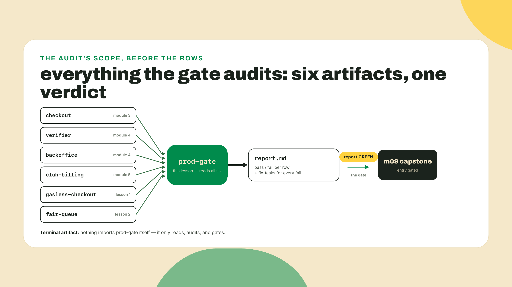
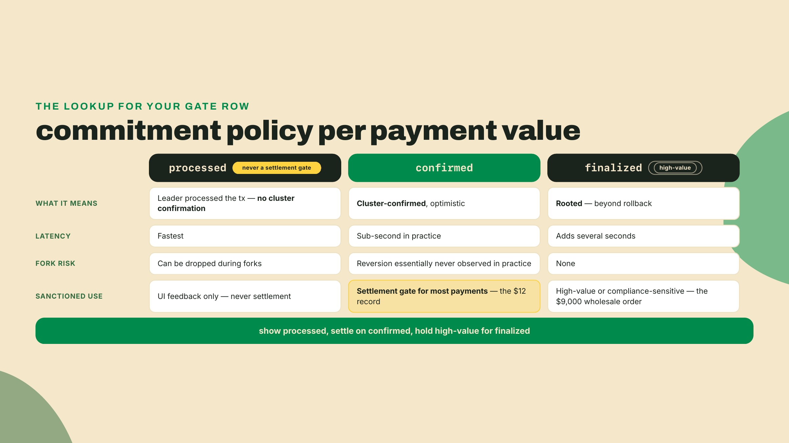
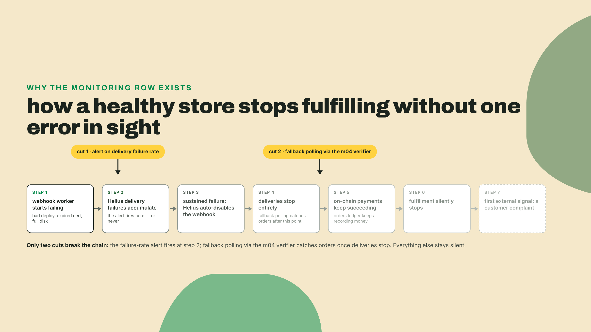
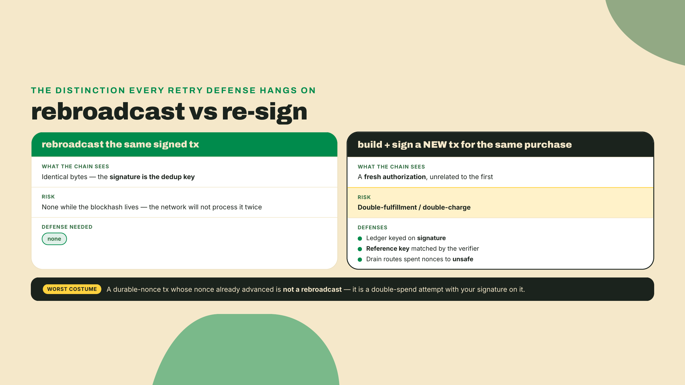
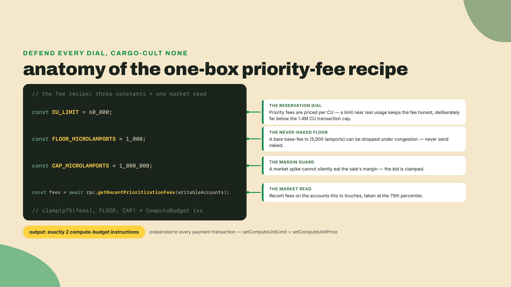
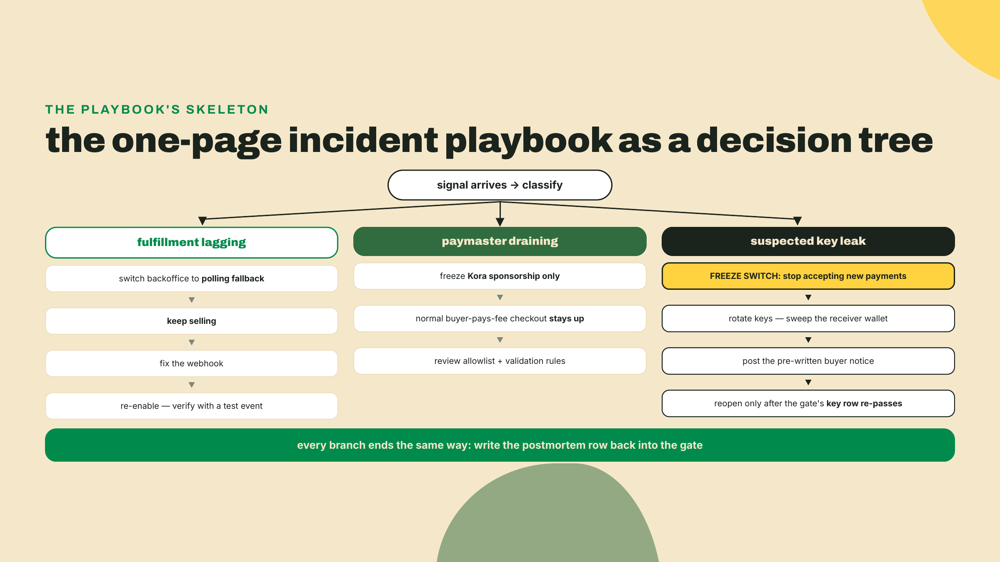
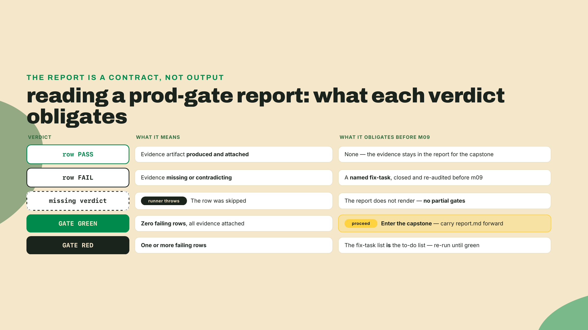

# The production gate: a go-live checklist that means it

## Summary

You can now take payments with no buyer SOL (last lesson but one) and no connectivity (last lesson). Checkout, verifier, back office, subscriptions, ramps, x402, gasless, the offline queue: every piece of the Wavelength stack exists and passed its own smoke test. This lesson checks whether the whole thing is actually fit to open.

Here is the uncomfortable part. "It works" and "it is ready" are different claims, and only one of them has ever been tested. Each rung was verified in isolation, on the happy path, by you, on a good day. Nobody has yet asked what happens when the webhook worker dies on a Friday night, or when a $9,000 wholesale order settles at the same commitment level as a $12 record.

So today you build the last pre-capstone artifact: `prod-gate`, a scored audit that runs against everything you own. It is a checklist you can genuinely fail. Failures do not become feelings; they become fix-tasks with your name on them, and every one closes before module 9.

Do this right now, before any theory:

```bash
cd ~/wavelength && mkdir -p gate && npx tsx --version
```

If `tsx` is missing, install it into the repo you have been building all course: `npm i -D tsx` (no pin needed; it is a runner, not an API surface). That empty `gate/` folder is where the verdict on your last seven modules will live by the end of the lab.

How the work splits today, stated plainly: the theory below is full-serve, the lab hands you the gate runner and four finished rows and makes you author the rest yourself, and the challenge is pure unguided judgment, because deciding what "ready" means for your own stack is the skill this lesson actually teaches. This is module 8. The scaffolds are gone.

## The gate

### Why a checklist and not a feeling

In 1935 the US Army Air Corps evaluated Boeing's Model 299, the plane that became the B-17. It was the most sophisticated aircraft ever built at that point, and on its evaluation flight it crashed on takeoff, killing the test pilot, because the crew forgot to release a control lock. The Army's response was not "hire better pilots." It was the pilot's checklist: a short, boring, scored list of things that must be true before the wheels leave the ground. The plane was too complex for competence alone; competence plus a checklist flew it for thirty years.

Your commerce stack just crossed the same complexity line. Eight subsystems, three payment protocols, two fee-payer arrangements, one offline queue holding bearer-like signed transactions. No single lesson's verify script sees the whole. The gate is the control-lock check for the store.

Two of those eight sit outside the gate's audit on purpose, so say it before the diagram implies it. The ramp embed's money paths run on Coinbase's infrastructure behind Coinbase's keys, so its one gate-shaped question, hygiene for the CDP secret, folds into the key-separation row rather than earning its own artifact. And the x402/MPP door settles into the same backoffice ledger the backoffice rows already audit; its one open item, the gate path's missing per-call memo, is already on the fix-task list you carried out of that lesson. Six artifacts under audit, eight subsystems in the stack, and the capstone wires all of them.

And the stakes are not hypothetical. Solana processed over one trillion dollars in stablecoin volume in 2025, the figure solana.com's payments documentation leads with (fetched 2026-08-23, same claim the opening lesson dated). That is the pool your little record store is wiring itself into. Money at that scale does not care that your demo worked; it finds the webhook you never monitored and the commitment level you never thought about, and it finds them at the worst possible hour. The harsh reality is: a go-live checklist is only worth writing if it can fail, and yours will fail today, at least once, on your first run. That is the point.



The gate's rows cluster into four families: settlement truth, silent failure, money handling, and what happens when it breaks anyway. Walk them in order; each family ends with the question its rows will ask.

### Settlement truth: commitment scaled to value

Every payment path you built ends in the same moment: some line of code decides the money has arrived and releases the goods. The gate's first family audits what that line actually checks.

The policy comes straight from official guidance, and it scales commitment to value. Confirmed is the commitment for most payments: an optimistic confirmation, reached in well under a second, that in practice almost never reverts. Finalized is reserved for high-value or compliance-sensitive payments: it costs you several extra seconds of latency, and in exchange the transaction is beyond rollback. And processed is UI-only and can be dropped during forks, which means it is never, under any circumstance, a settlement gate. Show a spinner on processed if you like. Ship a record on it and you may ship a record for a transaction that no longer exists.

Concretely, for Wavelength: the $12 record sale gates on confirmed, because making every buyer wait for finality to save yourself from a reversion that essentially never happens is latency spent on nothing. The $9,000 wholesale order gates on finalized, because at that size the extra seconds are cheaper than the conversation with your accountant. You pick the threshold; the gate only demands that a threshold exists and that code enforces it.



One stack-wide subtlety this family also catches: your fair-queue drain from last lesson settles transactions that were signed hours earlier. The buyer left the fair long ago. If any of those sales cross your high-value threshold, the drain must hold them to finalized before marking the order fulfilled, because there is no buyer standing in front of you to re-run the card. Write the row so it forces you to grep every commitment argument in the codebase, not just the ones you remember writing.

### Silent failure: the pipes that die without a sound

A payments stack has two kinds of failure. Loud ones throw errors, page you, and get fixed. Quiet ones just stop, and you find out from a customer. The second family hunts the quiet ones.

The webhook is the classic. Your back office fulfills orders off Helius webhook deliveries, and a Helius webhook that fails for long enough gets automatically disabled: sustained delivery failures and the platform stops sending, by design, to protect itself from hammering a dead endpoint. Reasonable behavior for infrastructure. Catastrophic for a store with no alerting, because from the outside nothing looks wrong. Checkouts complete, money arrives on chain, the ledger fills with verified payments. Fulfillment just quietly stops, and the first signal is an angry email.

I will admit this one is personal: I once learned a fulfillment queue was down from a customer DM, not from any dashboard, and the gap had been growing for two days. Refunding your way out of that is exactly as fun as it sounds. The fix is one alert on the webhook failure rate, tested by firing it on purpose, plus a fallback poll (you built the polling verifier in module 4; it is your backstop here) so a disabled webhook degrades to slow fulfillment instead of none.



The same family covers retries and idempotency, because a retry storm is silent failure's twin: everything looks fine while you double-fulfill. Before writing the row, get one distinction straight, since it decides what "safe to retry" means in every path you own. Rebroadcasting the same signed transaction is harmless: the signature is the deduplication key, and the network will not process identical bytes twice while the blockhash lives. Building and signing a new transaction for the same purchase is a fresh authorization, and nothing on chain knows it is "the same" sale. That second case is the one your defenses exist for, and you already built them. The orders ledger keys idempotency on the transaction signature, so a replayed webhook event lands on an existing row and does nothing. The reference key on each checkout means a buyer retrying a stalled payment cannot pay twice for one order, because the second transaction carries the same reference and the verifier matches it to an already-settled record. And the fair-queue drain classifier routes any spent nonce to `unsafe`, never resubmitting it — not because the network would accept the old bytes (a spent nonce is deterministically rejected, and has been since the 2022 fix), but because an advanced nonce means that sale may already have settled once, and the only retry left is the fresh-signature kind: the exact new-authorization double-charge this whole family of defenses exists to stop.

The gate rows for this family do not ask whether you built these. They ask you to prove them, now, by replaying a real recorded event and pasting the single resulting order row into the evidence field. A defense you have never fired is a hypothesis.



### Money handling: keys and the fee budget

Third family, two concerns: who can move the money, and what moving it costs you.

Keys first, and the posture is separation of powers. The Kora signer that sponsors gasless checkouts is scoped by its allowlist and validation rules; the gate row asks you to demonstrate the denial, by replaying the off-allowlist request you crafted two lessons ago and showing the refusal. The nonce authority for the fair queue is its own key, not your treasury key, so compromising the stall compromises a queue, not the store. And the merchant receiving wallet should be exactly that: a receiver, its key stored nowhere hot, swept on whatever cadence lets you sleep. Be honest about where that leaves you: if you built the fair queue exactly as its lesson shipped, you fail this row today, because that lab deliberately ran the merchant key as both fee payer and nonce authority to keep one laptop testable, and said so. The fix is mechanical, since a nonce account's authority can be any key: mint a dedicated nonce-authority keypair, hand the pool's accounts to it with the system program's AuthorizeNonceAccount instruction (or recreate the pool under it), keep that key on the stall laptop, and move the merchant receiver cold. If one leaked key can simultaneously drain the paymaster, advance the nonces, and empty the till, the gate fails you, and it should.

Now fees, where honest bookkeeping matters more than optimization. Your per-sale cost floor is the base fee, 5000 lamports per signature: irrelevant to margin on any sale priced in dollars. The number that actually shows up in the books is sponsorship. Every gasless checkout where the buyer needs a new token account costs you the 165-byte rent-exempt minimum — the number `getMinimumBalanceForRentExemption(165)` returns on the cluster you are deploying to, which the gasless lesson had you read rather than memorize — and the buyer can later reclaim it by closing the account; you budgeted it as spend, not a loan, in lesson one of this module, and the gate row simply checks the budget exists and has a daily cap.

Run the arithmetic once so the row's cap is a number and not a shrug — it is the module-opening lesson's hundred-buyer napkin at fair scale: 200 sales cost 0.001 SOL of base fees for the entire day (a shade more once the sponsored sales below count their second signature), while 50 gasless first-timers needing fresh USDC token accounts cost about 0.074 SOL of sponsored rent — 50 × the 1,488,440 lamports `getMinimumBalanceForRentExemption(165)` returned on devnet on 2026-09-07, a rate that steps down on schedule, so run the query for your own figure rather than trusting this one — some seventy times the fee line, every lamport of the rent reclaimable by buyers and none of it by you. The fee line in your books is really a sponsorship line, and the daily cap in the gate row is what keeps a scripted wave of fake first-time buyers from turning your growth budget into their rent farm.

Then there is the fee you add on purpose. Under congestion, a transaction carrying only the base fee can sit in the queue and drop; a small priority fee buys your payment a place in line. Priority fees are priced per compute unit, so the recipe has two dials: a compute-unit limit near what the transaction really uses (a transaction may request up to 1.4M CU; your token transfer plus memo uses a tiny sliver of that, and every CU you needlessly reserve multiplies the price you pay), and a per-CU price read from the recent market on the accounts you touch. Here is the whole recipe, the one box this course ships:

```typescript
// gate/fee-recipe.ts
import { address, createSolanaRpc } from '@solana/kit';
import {
  getSetComputeUnitLimitInstruction,
  getSetComputeUnitPriceInstruction,
} from '@solana-program/compute-budget';

const rpc = createSolanaRpc(process.env.RPC_URL ?? 'https://api.devnet.solana.com');

// The one-box recipe: two instructions, one RPC read, three constants.
const CU_LIMIT = 60_000; // generous ceiling for a token transfer + memo
const FLOOR_MICROLAMPORTS = 1_000; // never send a bare base-fee tx
const CAP_MICROLAMPORTS = 1_000_000; // never let a spike eat the margin

export async function paymentFeeInstructions(writableAccounts: string[]) {
  const recent = await rpc
    .getRecentPrioritizationFees(writableAccounts.map(address))
    .send();

  const fees = recent
    .map((entry) => Number(entry.prioritizationFee))
    .sort((a, b) => a - b);

  const p75 = fees.length > 0 ? fees[Math.floor(fees.length * 0.75)] : 0;
  const microLamports = Math.min(Math.max(p75, FLOOR_MICROLAMPORTS), CAP_MICROLAMPORTS);

  return [
    getSetComputeUnitLimitInstruction({ units: CU_LIMIT }),
    getSetComputeUnitPriceInstruction({ microLamports }),
  ];
}
```

Install note for the one package new to this workspace: `npm i @solana-program/compute-budget@0.16.0` in checkout-txreq, the workspace whose builder assembles every payment transaction these instructions ride on — the same 0.16.0 the gasless workspace pinned earlier this module, one compute-budget number for the whole repo. The pin is doing real work. This workspace runs kit ^6.10, and 0.16.0 is the last compute-budget minor whose peer range accepts a v6 kit (verified against npm 2026-08-31: 0.16.0 peers kit ^6.4.0, 0.17.0 jumped to ^7 and the current 0.18.0 to ^8, so grabbing latest here breaks the install). Freshness rule as always: re-check the peer range the day you build.



Now the boundary, named out loud because faking depth here would be worse than the shallowness. This recipe is deliberately shallow. Real transaction-landing strategy is a discipline: per-account fee estimation, retry curves, Jito bundles, compute-budget science, and the Client-Side Mastery course owns all of it end to end, the way this course owns commerce. The trade-off you are accepting is exact: over-provision the fee and you burn margin on every sale; under-provision and transactions drop under congestion, and tuning that curve properly is landing science, not commerce. The one-box recipe lands payment transactions reliably and slightly overpays. For a store, that is the right side of the trade. When your volume makes the overpayment hurt, that course is where you go; the same handoff applies to indexing at scale, which your webhook-plus-polling setup will eventually outgrow.

### When it breaks anyway: the playbook and the books

Last family. Everything above reduces the odds of an incident; nothing reduces them to zero. The difference between a bad hour and a bad quarter is whether the response was written down while you were calm.

An incident playbook for a store this size fits on one page, and the gate row checks four things exist in it. A freeze switch: one command or flag that stops accepting new payments while still recording the on-chain ones already in flight, because the worst incidents are the ones you keep selling into. A severity ladder: what you do when fulfillment lags (fall back to polling), versus when the paymaster is draining (freeze sponsorship, keep normal checkout), versus when you suspect a key leak (freeze everything, rotate, sweep). A comms line: the sentence you post to buyers, pre-written, because you will not write a calm sentence during the incident. And an owner: whose phone rings. If the answer to any of these currently lives in your head, it does not exist.



And then the row I cannot make green for you, because the ecosystem cannot. When your store is live, someone eventually has to close the books: match every on-chain settlement to an order, a refund, a subscription tick, and hand an accountant something they recognize. Go looking for a Solana-native merchant accounting and reporting SaaS to do this and, as of this build date, 2026-08-31, you will not find a purpose-built one. That is an observed market gap, stated with its date because young markets move: general crypto tax tooling exists, exchange dashboards exist, Stripe's dashboard covers the sales that settled on Stripe's own rails and nothing else. Your on-chain Solana Pay and x402 ledger is yours to reconcile.

The honest gate posture is neither despair nor denial. You already hold the raw material: every sale in your ledger carries a reference key or a memo invoice id, matched to a transaction signature by the verifier. So the row demands the interim answer you can actually ship, a reconciliation export: one command that emits a dated CSV of settlements joined to orders, the thing you would hand an accountant today and the thing you will diff against the real SaaS the month somebody finally builds it. A gap stated with a date and a workaround is a plan. A gap you assumed a vendor had covered is next year's emergency. (If you are the reader who has been waiting for a startup idea this whole course: this row is one.)

## Lab: run the gate

The lab builds `prod-gate` and runs it against your stack. You get the runner and four finished rows; the remaining rows are yours to author from the four families above. Budget most of your time for step 5, which is the actual audit.

1. Define the row shape and the first four rows in `gate/rows.ts`. These four are the seed; notice each `evidence` field demands an artifact you can paste, never a vibe:

```typescript
// gate/rows.ts
export type Rung =
  | 'checkout'
  | 'verifier'
  | 'backoffice'
  | 'club-billing'
  | 'gasless-checkout'
  | 'fair-queue'
  | 'stack-wide';

export interface GateRow {
  id: string;
  rung: Rung;
  question: string;
  evidence: string;
}

export const rows: GateRow[] = [
  {
    id: 'commit-policy',
    rung: 'stack-wide',
    question:
      'Does every settlement path gate on confirmed, escalate to finalized above your high-value threshold, and never treat processed as settlement?',
    evidence:
      'grep every commitment argument in the verifier and the fair-queue drain; list each occurrence with its value and the payment path it guards',
  },
  {
    id: 'webhook-monitoring',
    rung: 'backoffice',
    question:
      'Do you alert on the webhook failure rate before sustained failures can auto-disable the webhook?',
    evidence:
      'show the alert rule and the last test alert it fired; a dashboard nobody watches is a fail',
  },
  {
    id: 'idempotency',
    rung: 'backoffice',
    question:
      'Does a replayed webhook event, or a client retry of the same checkout, fulfill exactly once?',
    evidence:
      'replay one recorded event twice against the orders ledger and paste the resulting single order row',
  },
  {
    id: 'fee-recipe',
    rung: 'checkout',
    question:
      'Does every payment transaction carry the one-box priority-fee pair (CU limit near real usage, floored and capped CU price)?',
    evidence: 'decode one live checkout tx and show both compute-budget instructions',
  },
];
```

Checkpoint: `npx tsx -e "import('./gate/rows.ts').then((m) => console.log(m.rows.length))"` prints `4`.

2. Author the remaining rows yourself, from the four families. Aim for ten to fourteen total. At minimum the set must cover: sponsor-budget with a daily cap on the gasless rung (the ATA rent as budgeted spend, sized from a live rent read rather than a remembered constant), the off-allowlist denial replay for the Kora signer, key separation across paymaster, nonce authority, and receiver, the spent-nonce `unsafe` exclusion on the fair-queue drain, the four-part incident playbook, the reconciliation export, a billing-tick failure alert for club-billing, and the blink's hosting rules — `Access-Control-Allow-Origin: *` on every action route AND on `actions.json`, with `actions.json` served from the domain root. That last row exists because the blink is the one surface whose failure is invisible from your terminal: curl does not enforce CORS and a sub-path mount answers curl perfectly well, so both defects test clean locally and render nothing in a wallet. The evidence is already regenerable — the header dumps from the blink lesson's registry-ready checklist — and assembly is exactly when it breaks, because mounting several apps on one server is the moment a root-mounted file stops being at the root. Keep every `question` answerable yes or no, and every `evidence` field a pasteable artifact.

3. Write the runner. It refuses to skip rows, scores what it reads, and turns every failure into a fix-task:

```typescript
// gate/run.ts
import { readFileSync, writeFileSync } from 'node:fs';
import { rows } from './rows.ts';

type Verdict = 'pass' | 'fail';

interface VerdictEntry {
  verdict: Verdict;
  note: string;
}

const verdicts: Record<string, VerdictEntry> = JSON.parse(
  readFileSync(new URL('./verdicts.json', import.meta.url), 'utf8'),
);

let failures = 0;
const reportLines: string[] = [];
const fixTasks: string[] = [];

for (const row of rows) {
  const entry = verdicts[row.id];
  if (!entry) {
    throw new Error(`no verdict recorded for row "${row.id}": the gate does not skip rows`);
  }
  reportLines.push(`${entry.verdict.toUpperCase().padEnd(4)}  ${row.id} (${row.rung}): ${entry.note}`);
  if (entry.verdict === 'fail') {
    failures += 1;
    fixTasks.push(`- [ ] ${row.id}: ${entry.note}`);
  }
}

const report = [
  `# prod-gate report, ${new Date().toISOString().slice(0, 10)}`,
  '',
  ...reportLines,
  '',
  failures === 0
    ? 'GATE: GREEN. Proceed to the capstone.'
    : `GATE: RED. ${failures} failing row(s). Every fix-task below closes before m09.`,
  '',
  '## Fix tasks',
  ...(fixTasks.length > 0 ? fixTasks : ['(none)']),
  '',
].join('\n');

writeFileSync(new URL('./report.md', import.meta.url), report);
console.log(report);
```

Notice what the runner is not: it is not automated verification. It cannot grep your verifier or fire your alert. The verdicts file is you, under oath, with evidence attached. The runner's job is bookkeeping and refusal: no row unanswered, no failure without a fix-task.

Checkpoint, and prove the refusal half before you trust the bookkeeping half: put an empty `{}` in `gate/verdicts.json` and run `npx tsx gate/run.ts`. It must throw `no verdict recorded for row "commit-policy"` and write no report at all. A runner that renders a partial report is not a gate.

4. Wire the fee recipe before auditing its row. Install `@solana-program/compute-budget@0.16.0` (pin rationale in the theory above), drop `gate/fee-recipe.ts` in, and prepend `paymentFeeInstructions(...)` output to the checkout server's transaction build, passing the writable accounts the payment touches (the merchant ATA is the contended one on a busy sale day). Concretely, the edit lives in one place: give `finalizeTransaction` an optional `extraInstructions` array it places ahead of the payment instructions, and have the checkout server pass the two compute-budget instructions there. Every surface that reuses the builder, the blink and the sponsored checkout included, inherits the knob; note that Kora's fee estimate now sees the priority fee too, which is exactly the case the sponsor cap from that lesson exists to absorb. Re-run the checkout smoke test from module 3 to confirm nothing broke.

5. Now audit. For each row, in order, actually perform the evidence action: run the grep, replay the event, craft and replay the off-allowlist sponsorship request, decode the live transaction, open the playbook. Record honest verdicts in `gate/verdicts.json`:

```json
{
  "commit-policy": { "verdict": "pass", "note": "verifier gates on confirmed; drain escalates to finalized over 500 USDC; no processed anywhere" },
  "webhook-monitoring": { "verdict": "fail", "note": "no alert on webhook failure rate yet" },
  "idempotency": { "verdict": "pass", "note": "replayed event produced one order row (signature-keyed)" },
  "fee-recipe": { "verdict": "fail", "note": "checkout txs still ship with no compute-budget instructions" }
}
```

That sample is from my own first run against a reference build of this stack, and yes, it went two-for-four. One number in it deserves a warning label: the 500 USDC finalized-escalation threshold is that build's choice, not a course recommendation; the challenge makes you derive your own from what a dropped payment actually costs you. If your first run is all green, the likelier explanation is generous grading, not a flawless stack; re-read the evidence fields and be meaner.

6. Run it:

```bash
npx tsx gate/run.ts
```

Checkpoint: you should see the scored report in the terminal and in `gate/report.md`, ending in either `GATE: GREEN` or `GATE: RED` with a fix-task list. A RED gate here is a passing lab. The lab tests the audit, not the stack.

7. Close the loop. Work the fix-tasks (the two above are an afternoon: one alert rule, one server edit you already wired in step 4), re-audit only the failed rows, and re-run until GREEN. Keep every dated `report.md`; the capstone opens by reading your latest one.



## Challenge

No walkthrough for this one. Three judgments, written down in `gate/DECISIONS.md`:

1. Set your high-value threshold: the payment value above which Wavelength escalates from confirmed to finalized. Defend the number in three sentences using your actual price list (records, subscriptions, wholesale) and what a reversion at each tier would cost you in money and trust.
2. Author one gate row this lesson never mentioned, drawn from a failure mode specific to your build of the stack (every implementation drifts; yours has a soft spot mine does not). Full row: id, rung, yes-or-no question, pasteable evidence.
3. Argue against your own gate: name the failure most likely to hurt you that no row can catch, and say why a checklist cannot hold it. If nothing comes to mind, the durable-nonce queue and the words "bearer instrument" are a place to start thinking.

Acceptance: your final `report.md` is GREEN with every fix-task closed, `DECISIONS.md` holds all three judgments, and the self-authored row appears scored in the report.

## Before you flip the sign

Post your scored report and your self-authored row in the course channel, and read two other people's rows before comparing verdicts; the rows other builders invent for their own soft spots are the best free audit your stack will get. If your gate caught something this lesson never warned you about, that is the system working, and I want to hear about it.

The gate is green and the fix-tasks are closed. That makes this the last lesson that treats the stack as parts. Next module is the capstone: wire every rung of the ladder into one running store and watch a full buyer journey, browse, pay, fulfill, reconcile, run end to end. You did the inspection. Now open the doors.
