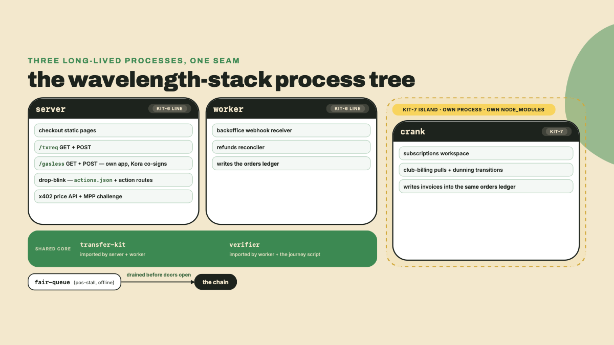
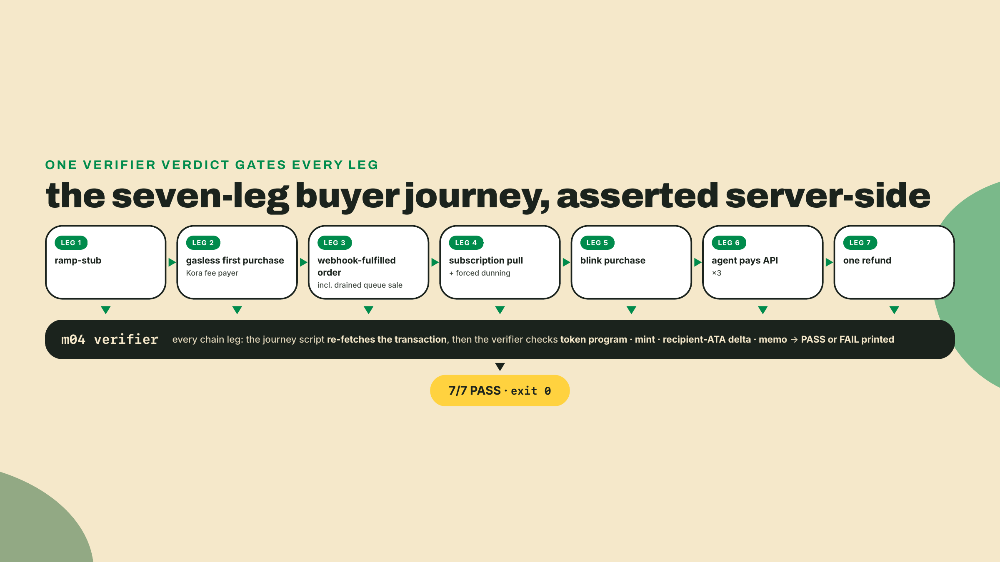
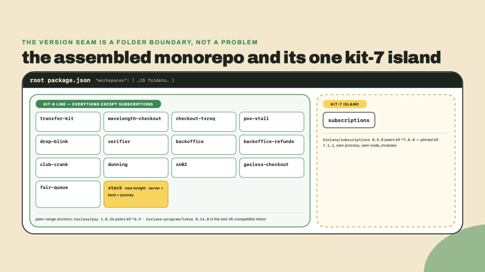
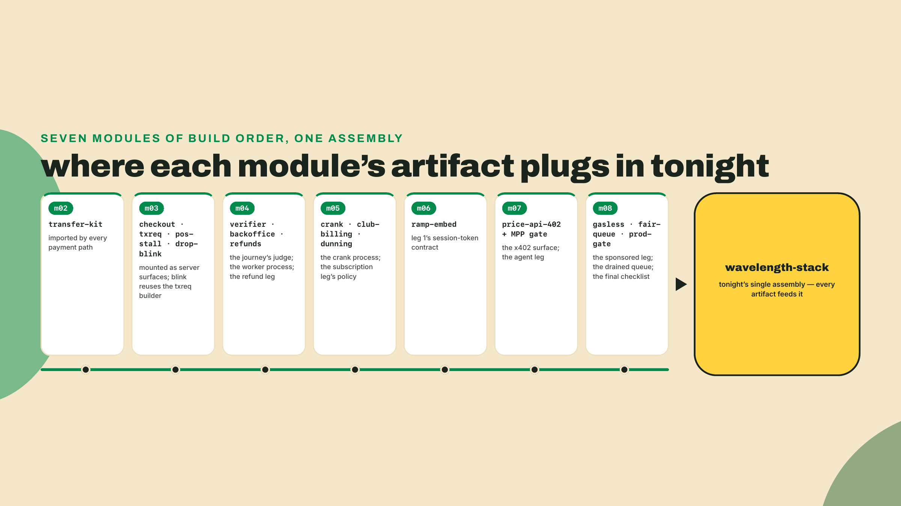
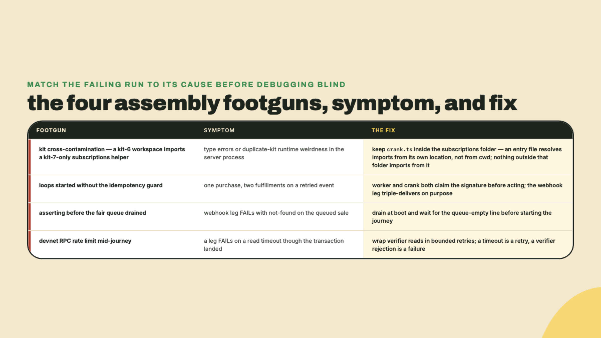
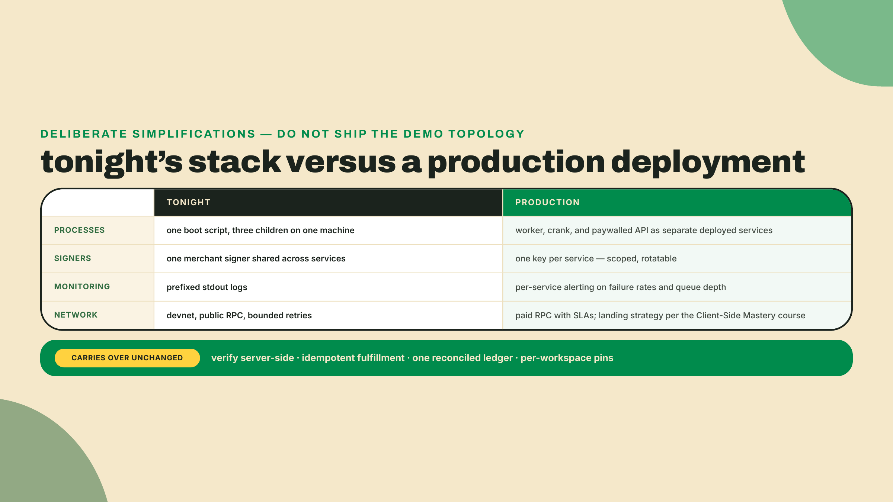
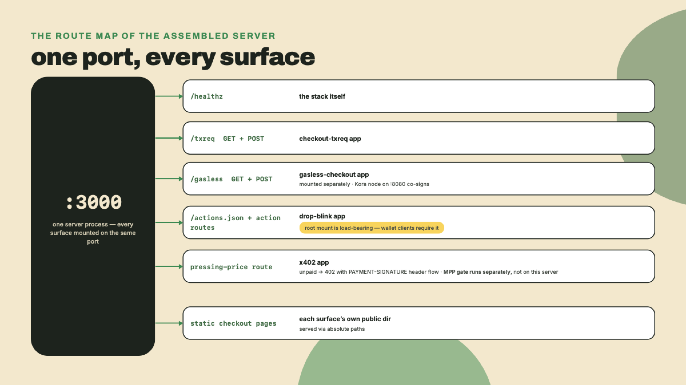
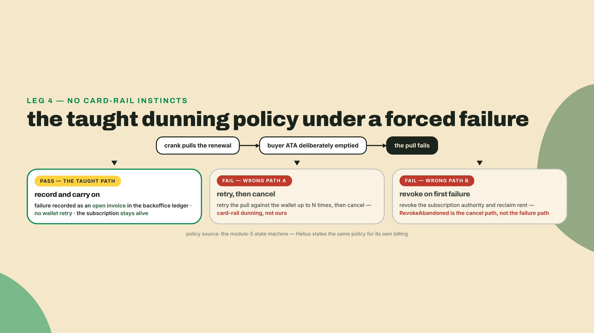
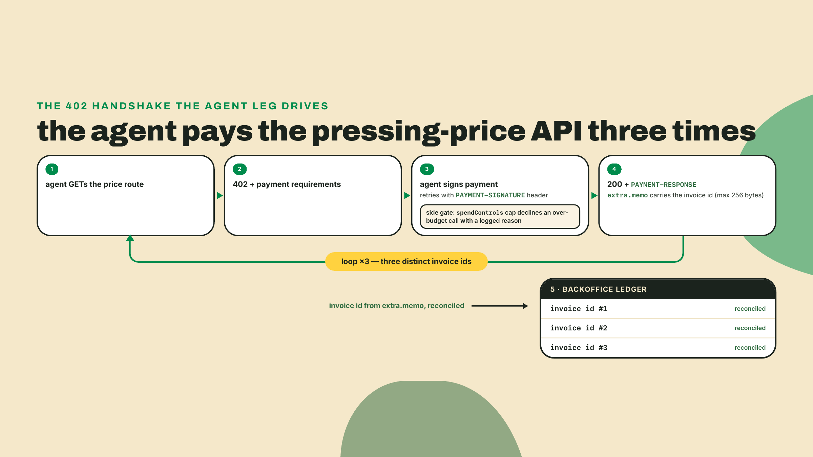

# Assembly: one store, every rail

## Summary

Last lesson you put the whole stack in front of a go-live checklist and let it fail on paper: every red row became a fix-task, and you worked the list until each piece was individually production-worthy. That was the audit. What it could not test is the thing this lesson exists for. Fifteen rungs, each green in its own corner of the repo with its own smoke test, is not a store. A buyer does not care about your folders. Can a real customer walk in with zero SOL, buy a record, get fulfilled, subscribe, survive a failed renewal, and take one refund, all without you touching a single thing by hand?

Today you answer that question with a log file. Before any theory, take inventory. From your repo root:

```bash
find . -mindepth 2 -maxdepth 3 -name package.json -not -path '*/node_modules/*' | wc -l
```

Count them (mindepth skips the root manifest, and the extra depth level would catch any manifest nested a folder deeper; in this tree it should find none, because every workspace sits at the top level). Each of those manifests is a workspace you built and proved — most rungs got one of their own, though not all, and the roster note below names the ones that live inside another workspace or in no code at all — and the count comes back at fourteen, one short of the roster below because tonight's `stack` workspace does not exist yet. Then open your latest `gate/report.md` beside the count: the fix-tasks you closed last lesson are the reason tonight gets to be boring. None of them, alone, can sell a record to a stranger. That gap between "all tests green" and "a business runs" is the last skill this course teaches, and honestly, it is the one integration engineers get paid for.

The findings up front:

- You ship **wavelength-stack**: one repo where every route imports transfer-kit as the shared payment core, the transaction-request, blink, and x402/MPP surfaces are mounted on ONE server (the module 3 QR checkout page stays a standalone static page on purpose; its payment path is the same transaction-request core the mounted surface exercises), the webhook worker and the billing crank run as background processes, and `npm run journey` drives a scripted seven-leg buyer journey against devnet.
- There are no new concepts in this lesson. By design. Every load-bearing line is an import of something you already built, and the lesson's whole job is to make that visible: the blink reuses the module-3 transaction builder, the x402 memo invoice ids reconcile in the same backoffice ledger as your checkouts, and the module-4 verifier is the only judge of every leg.
- The two kit pins from the subscriptions lesson survive assembly intact: the wavelength-checkout, backoffice, and x402 workspaces stay on their kit-6 line and the subscriptions workspace stays on kit 7.1.1. Tonight is the night they finally share a tree, because assembly registers `subscriptions` into the root roster — so expect the `ERESOLVE`, and understand that what protects the crank at runtime is where its entry file lives, never the workspace boundary.
- The gate is brutal and simple: seven PASS lines from the verifier, exit code 0, and the module-8 prod-gate checklist re-scored against the assembled stack, every row either passing or carrying a written fix-task.

## Soundcheck: fifteen rungs, one opening night

Think of tonight as a venue's opening night. Every instrument arrived in its own case and passed its own bench test. The soundcheck is not about any instrument; it is about whether the room works when everything plays at once. Same here: assembly is a discipline of its own, with its own failure modes, and none of them live inside a single rung.



### The buyer journey is the spec

The stakes, stated as a difference between two outcomes. If the assembled stack works, a stranger's money becomes a fulfilled order, a running subscription, and an auditable ledger row while you sleep. If it almost works, you get the worst outcome in commerce: money arrives and nothing happens, and now a human has to reconcile by hand what your systems disagree about. The seven-leg journey exists to make "almost works" impossible to hide.

The legs, in the order the script runs them. One buyer, scripted, on devnet:

1. **Ramp stub.** The buyer starts from fiat. Coinbase will not onboard a headless test account, so this leg asserts the session-token contract you built in the onramp lesson: a pay.coinbase.com URL exists, it binds `defaultNetwork=solana`, and the wallet address appears nowhere in it.
2. **Kora-sponsored first purchase.** The buyer holds devnet USDC and zero SOL, and buys a record anyway. The fee payer on the landed transaction is the Kora signer, not the buyer.
3. **Webhook-fulfilled order.** A second purchase lands through the transaction-request flow, and the Helius event reaches your worker through the same tunnel you exposed in the webhook lesson; starting that tunnel belongs to terminal one's boot ritual, not to mid-run hands. The journey script then replays the delivered payload straight at the worker's endpoint twice more, the local stand-in for Helius redelivery, and the order fulfills exactly once, including the sale your fair queue drained at boot.
4. **Subscription cycle plus forced dunning.** The buyer joins the record-of-the-month club, one billing pull lands as a reconciled invoice, and then the script empties the buyer's ATA and forces a renewal to fail. The failure must become an open invoice. Not a retry.
5. **Blink purchase.** The drop blink serves its metadata, takes `{account}`, and returns a transaction built by the exact module-3 builder.
6. **The agent pays the API three times.** A paying agent hits the pressing-price endpoint, eats the 402, settles, and does it twice more. Three memo invoice ids reconcile in the ledger.
7. **One refund.** A reverse push payment through transfer-kit, recorded against the origin signature.



The journey is not a UI walkthrough, and no leg ever trusts a wallet toast, a webhook payload, or a 200 response as proof. The course has one acceptance harness, the m04 verifier, and the journey calls it once per leg: re-fetch the transaction with `getTransaction`, check the token program, then the mint, then the balance delta on the merchant-OWNED token account (keyed on owner, the way the verifier has keyed it since m04 — that choice is what catches the wrong-mint fixture), then the memo. A sponsored transaction gets the same treatment as a plain one. Kora co-signing changes who paid the fee; it changes nothing about what deserves to be believed.

### The layout, and the seam you already solved

The target shape is one npm monorepo whose root `package.json` lists every rung as a workspace. You have been building toward this since module 2 without ceremony; assembly just makes the roster explicit. And a pre-empt, because a tidy-minded teammate will absolutely propose collapsing everything into one workspace on one kit version while you are in there. Refuse, politely, with the peer ranges in hand: `@solana/pay` 1.0.26 peers kit ^6.9 and `@solana/subscriptions` 0.5.0 peers kit ^7.0.0, and both are correct. That seam was the whole point of the subscriptions lesson, and it is not re-derived here: the wavelength-checkout, backoffice, and x402 workspaces keep their kit-6 pins and the subscriptions workspace keeps kit 7.1.1.

Be exact about what keeps them apart, though, because the subscriptions lesson was blunt on this and tonight is the night it gets tested. Registered npm workspaces are **not** isolation. npm hoists every registered package into one shared root resolution, so the moment the roster below names `subscriptions`, both kit majors are in one tree and npm has to reconcile them — which is precisely the `ERESOLVE` the install step below expects rather than hopes to avoid. Until now `subscriptions/` sat outside the roster and never met the kit-6 tree at all; registering it buys you `--workspace` scripts and one lockfile, and it costs you that reconciliation. What survives the merge is the pin, not a wall: npm parks one major at the root and nests the other under `subscriptions/node_modules`, which is what the checkpoint below verifies, and Node then resolves the crank's imports from there for one reason only — that is where its entry file lives. Step 4 says the same thing about the crank process, and it is worth reading twice, because "different workspace" and "different process" are both the wrong answer to why the island holds.

Those peer ranges were re-verified against npm in the subscriptions lesson on 2026-08-22; run `npm view @solana/subscriptions@0.5.0 peerDependencies` yourself before you install anything today, because this corner of npm has moved twice this quarter, and never, anywhere, pin to `latest`.



Not every rung got its own folder, and that is worth saying out loud: the ramp embed lives inside the wavelength-checkout workspace because it grew out of that server, the MPP gate is a config file standing in front of the x402 workspace rather than a codebase of its own, and the corridor decision record is a document, not a process. Rungs are capabilities, not directories. Your roster may differ from mine in names; the workspaces array is the source of truth, and it must list what you actually built.

### Import, do not re-implement

Here is the accretion, shown rather than asserted, because a claim like "it all composes" is exactly the kind of thing this course has taught you not to take on faith. Three receipts:

**transfer-kit is the payment core, by import.** The txreq builder calls its `resolveAta` and mints its reference keys; the refund builder issues its reverse push through `sendStablecoin`; the crank's pulls settle into ATAs it resolves. One module, written in week one, moving every dollar in the stack tonight. If you find yourself re-typing a checked-transfer anywhere in this lab, stop; you are re-implementing your own dependency.

**The blink never learned to build a transaction.** Its POST handler calls `buildOrderTransaction` from the module-3 checkout-txreq workspace and wraps the result in an `ActionPostResponse`. Same catalog, same pricing function, same memo format. When the journey's blink leg passes the verifier with no blink-specific payment code in the diff, that is the artifact ladder paying out.

**Three protocols, one ledger.** A QR checkout, a subscription pull, and an x402 agent call are wildly different front doors, and every one of them lands as a row in the same backoffice orders ledger, keyed the same way. The x402 leg's `extra.memo` invoice ids (256 bytes maximum, from the x402 v2 spec) reconcile through the same path a checkout memo does. One reconciliation story for the whole business.



### The harness is thin on purpose

The journey script is deliberately boring: spawn nothing fancy, drive each leg, and end every chain leg the same way, with one call into the verifier and a thrown error on any verdict that is not ok. The temptation at capstone time is to build a clever test framework. Resist it. A thin driver over a trusted judge is worth more than a rich framework you wrote the night before the demo, because when a leg fails at 2am you want the failure to be about the stack, never about the harness. One convention note before the code: every cross-workspace import in these files is an extensionless TypeScript path, which resolves only because the whole stack runs under tsx; point bare `node` at any of them and the imports fail, which is expected, not broken.

The same austerity applies to the two background loops. The worker and the crank are the exact processes you already built; the stack does not wrap them, monkey-patch them, or merge them. It starts them. The one integration rule they must both honor is the idempotency guard from the webhook lesson: the worker claims a signature before fulfilling and the crank writes invoices through the same claim path, because a retried Helius delivery or a re-run crank tick against a stack without that guard double-fulfills an order, and the journey's webhook leg is built to catch exactly that.

There is one genuinely new wrinkle the harness has to respect, and it is about time, not money. Up to now every smoke test you wrote asserted a thing your own code just did: send, then check. Two of tonight's legs assert things a *different process* does on its own schedule. The webhook leg's ledger row appears whenever the Helius delivery arrives and the worker finishes verifying, which from the journey script's seat is an unpredictable number of seconds after the payment lands. The dunning leg's open invoice appears whenever the crank's next tick notices the failed pull. If the script asserts the instant its transaction confirms, it will fail a stack that is working perfectly, just working asynchronously. So the harness carries a second waiting primitive alongside the retry wrapper: a bounded poll that watches for a condition to become true and gives up loudly after a deadline. Retry is for reads that error; polling is for effects that have not happened yet. Keeping the two separate keeps your failure messages honest, because "the RPC timed out" and "the worker never fulfilled the order" are different bugs with different owners.

### One buyer, staged balances

Read the leg order again and you will notice it is not arbitrary; the journey is a little state machine over one buyer's balances, and every leg both asserts something and stages the next. The script mints a fresh buyer keypair at start (persist it to `/tmp/buyer.json` and export `BUYER_ADDRESS` from it, so both the leak check and your mid-debug shell commands can reach it), funds its ATA with devnet USDC from the faucet flow you set up in module 2, and deliberately gives it no SOL at all. That poverty is the point of leg 2: the Kora-sponsored purchase must succeed from a wallet that could not pay its own base fee, and the assertion that the buyer's lamport delta is exactly zero only means something if the balance was zero to begin with. After the sponsored leg passes, the script tops the buyer up with a small SOL airdrop, because from leg 3 onward the buyer self-signs and self-pays like any ordinary customer. The CLI shape of that top-up, if you want to sanity-check a stuck buyer by hand mid-debug:

```bash
solana airdrop 0.1 $(solana-keygen pubkey /tmp/buyer.json) --url devnet
```

The choreography continues all the way down. The subscription leg drains the buyer's ATA on purpose to force the failed renewal, which means the blink leg that follows must re-fund USDC first or it would fail for the wrong reason, an underpaid rejection born of your own test choreography rather than a broken surface. A leg that fails for the wrong reason is worse than a leg that fails honestly; it sends you debugging a surface that works. So each leg body opens by staging the exact balance state it needs and closes by asserting the state it created. Write the staging lines with the same care as the assertions. When a run goes red at 2am, the first question is always "did the leg fail, or did the stage before it lie?", and a journey script that logs its staging steps answers that from the log alone.

One more deliberate choice: the journey never reuses order ids across runs. Every run stamps a fresh run id into its order ids and memo strings, so re-running the journey against a ledger that already holds yesterday's rows asserts only rows from this run. The ledger is append-only history; the journey is one night's slice of it. Key your assertions on the run id and the script becomes safely re-runnable forever, which is exactly what you want from the thing you will demo with sweaty hands.

### What breaks at assembly time

Four failure modes account for most of the pain in this lab, and I am handing them to you up front because in my experience with integration weeks, that changes debugging from hours to minutes.



The last row deserves one extra sentence, because it is the one that fools people under demo pressure: devnet's public RPC will rate-limit you mid-journey, and a read that times out looks exactly like a leg that failed. The distinction that matters is *which side said no*. A timeout is the read infrastructure shrugging; you retry it. A verifier rejection is your acceptance harness speaking; you never retry that, you investigate.

### The trade-off, and who already runs on these rails

Name the trade-off before the lab, as always. The assembled monorepo runs every service in one process tree on one machine against devnet, and that is exactly right for a teaching capstone and wrong for production. A real deployment splits the worker, the crank, and the paywalled API into separate long-lived services with their own monitoring and their own restart policies, and it never shares one signer across all of them: the blast radius of a leaked key should be one service, not your whole store. The capstone proves the wiring and the verify-server-side discipline. It does not prove an ops posture, and the deeper landing-and-indexing disciplines a high-volume version needs are the Client-Side Mastery course's territory, as they have been every time this course touched them.



Is any of this real outside a course repo? Yup, and with numbers. Helius runs its own billing on the same official Subscriptions program you integrated, program `De1egAFMkMWZSN5rYXRj9CAdheBamobVNubTsi9avR44` (the `De1eg` vanity prefix names the on-chain Delegation program the Subscriptions product runs on, the same naming its client's error codes use), and states its dunning policy in the same words your state machine encodes: a failed renewal is not retried against the wallet, it becomes an open invoice (their engineering blog, fetched 2026-08-21). Your forced-failure leg asserts the exact behavior a real infrastructure company bets its revenue on. And the agent leg is not speculative either: the x402.org dashboard, the same rolling 30-day window you read in the x402 lesson, reported 75.41M transactions and 24.24 million dollars in volume when I pulled it on 2026-08-21. The rails you are soundchecking tonight are carrying real weight in the wild, at play scale, right now.

While we are counting, count the cost of the night itself, because the number still surprises people who have lived on card rails. The full journey lands at ten or so transactions: two purchases, a blink buy, a subscription setup and pull, three agent calls, a refund, plus the drained queue sale. Each one carries the 5000-lamport base fee and, per the band this course opened with, settles for a small fraction of one cent — $0.00075 at $150 per SOL, $0.0015 at $300, and you quote the band rather than a baked-in figure. One line item dwarfs all of them and is not a fee: the sponsored leg's ATA rent, roughly 0.0015 SOL at the devnet rate on 2026-09-07 and still falling, the budgeted spend your prod-gate row already caps. Fees aside, the entire seven-leg night, an onboarding, four sales, a billing cycle, a machine customer, and a refund, costs less in network fees than the rounding error on a single card transaction. That arithmetic is why every rail in this stack can exist at all, and it is worth having ready the next time someone asks why a record store would bother.

## Lab: raise the stack

This is the last lab of the course, so let me say the quiet part loudly: the scaffolding is gone. Module 8 already started taking it away, handing you a gate runner and four finished rows and making you author the rest. Tonight it goes the rest of the way. You get the wiring order, the two pieces of glue that are genuinely new (the process supervisor and the journey harness), and one worked leg as the pattern. Everything else you assemble from your own rungs, because after this lesson there is no course repo to lean on, only your repo.

**1. Unify the workspaces.** Your root `package.json` grew organically since module 2. Make it the explicit roster. Mine:

```json
{
  "name": "wavelength",
  "private": true,
  "type": "module",
  "workspaces": [
    "transfer-kit",
    "wavelength-checkout",
    "checkout-txreq",
    "pos-stall",
    "drop-blink",
    "verifier",
    "backoffice",
    "backoffice-refunds",
    "club-crank",
    "subscriptions",
    "dunning",
    "x402",
    "gasless-checkout",
    "fair-queue",
    "stack"
  ],
  "scripts": {
    "journey": "npm run --workspace stack journey"
  }
}
```

Then create the one new workspace and reinstall the tree:

```bash
mkdir -p stack/src
npm init -y --workspace stack
npm pkg set type="module" --workspace stack
npm install --workspace stack express@5.1.0 @solana/kit@6.10.0
npm install --workspace stack -D tsx@4 typescript @types/express @types/node
npm pkg set scripts.serve="tsx src/server.ts" scripts.boot="tsx src/boot.ts" scripts.journey="tsx src/journey.ts" --workspace stack
npm install
```

Pins, with their freshness notes: `express` stays at 5.1.0 so the whole repo compiles against one version (npm's current 5.x is 5.2.1 as of 2026-08-23; resist the upgrade until you can bump every workspace together), and `@solana/kit` 6.10.0 is the last v6 release, the same pair every kit-6 workspace in the repo already carries. `tsx` is the runner you have used all course; the dev-install line is its install for this fresh workspace. Expect that last `npm install` to fail, and read the failure rather than reaching for a flag reflexively. Registering `subscriptions` puts kit 6 and kit 7 in one tree for the first time in this course, so npm reports the `ERESOLVE` between them exactly as the subscriptions lesson said it would; the escape hatch is the one you already used in the gasless lesson, `npm install --legacy-peer-deps` at the root. Then the checkpoint: `npm ls --workspaces --depth 0` prints every workspace, and `subscriptions` is the only tree showing kit 7.1.1 — nested under its own `node_modules` rather than hoisted, which is the mechanism the seam section described. Confirm each workspace still resolves the kit line its own `package.json` pins before going any further; if any kit-6 workspace now reports 7.1.1, the flag papered over a real conflict and you must fix the pin, not the flag.

**2. Export the apps, gate the listens.** Each surface workspace currently ends its server file with a bare `app.listen`. Importing such a file would start a stray listener, so give each one the same two-part edit: export the app, and only listen when run directly. Here it is on checkout-txreq; repeat it verbatim (with the right names) on drop-blink, the x402 server, and gasless-checkout — that last one is a real surface with its own routes, not a path inside another app, and leg 2 of tonight's journey calls it:

```typescript
// checkout-txreq/src/server.ts, the bottom of the file.
// Replace the bare app.listen call with an export plus a direct-run gate.
export { app as txreqApp };

const runDirectly =
  process.argv[1] !== undefined &&
  import.meta.url === new URL(`file://${process.argv[1]}`).href;

if (runDirectly) {
  app.listen(PORT, () => {
    console.log(`checkout-txreq listening on :${PORT}`);
  });
}
```

One companion fix while you are in each file: `express.static('public')` resolves against the process working directory, and tonight one process serves three rungs from the repo root. Anchor each static mount to the file's own location instead:

```typescript
// near the top of each surface's server file
import { fileURLToPath } from 'node:url';

const publicDir = fileURLToPath(new URL('../public', import.meta.url));
app.use(express.static(publicDir));
```

Checkpoint: `npx tsx src/server.ts` inside each surface workspace still starts that surface alone, exactly as before. The gate means nothing changed for standalone runs.

**3. One server.** Now the mounting, and it is smaller than you expect, which is the point:

```typescript
// stack/src/server.ts
import express from 'express';
import { txreqApp } from '../../checkout-txreq/src/server';
import { blinkApp } from '../../drop-blink/src/server';
import { x402App } from '../../x402/src/server';
import { gaslessApp } from '../../gasless-checkout/src/server';

const app = express();
const PORT = Number(process.env.PORT ?? 3000);

app.get('/healthz', (_req, res) => {
  res.json({ ok: true, surfaces: ['txreq', 'blink', 'x402', 'gasless'] });
});

// Express apps are middleware: mounting at the root preserves each
// surface's own paths, including actions.json at the domain root.
app.use(txreqApp);
app.use(blinkApp);
app.use(x402App);
app.use(gaslessApp);

app.listen(PORT, () => {
  console.log(`wavelength-stack listening on :${PORT}`);
});
```

Mounting at the root matters for one surface in particular: the blink's `actions.json` must sit at the domain root or wallets never render it, and a sub-path mount would quietly break the hosting rule you learned in the blink lesson. The gasless surface earns a line of its own here, and it is worth knowing why, because it is easy to misremember: the sponsored builder reuses `finalizeTransaction` from checkout-txreq, but the routes do not live there. `GET`/`POST /gasless` were served by their own Express app in the `gasless-checkout` workspace, on its own port, and nothing before tonight ever mounted them anywhere else. Skip the `app.use(gaslessApp)` line and leg 2 of the journey gets a 404 from a stack that otherwise looks healthy. Checkpoint: `npm run --workspace stack serve`, then `curl localhost:3000/healthz`, `curl localhost:3000/txreq`, `curl localhost:3000/gasless`, and `curl localhost:3000/actions.json` all answer from one port.

One prerequisite the gasless surface carries that the others do not: it talks to a Kora node. Its builder quotes and co-signs against `http://localhost:8080`, so that node has to be running before the journey starts, exactly as it was in the gasless lesson. It is not one of boot.ts's three children below, because it is an external binary rather than a process you start, alongside the pay gate in that respect.



A word on the quietest surface from the protocols module, because it is easy to misremember it as already wired in. The MPP challenge path does NOT ride inside the x402 app: in module 7 the `WWW-Authenticate: Payment` challenge was served by the separate `pay gate` process, driven by `paywall.yml` and proxying a payment-free upstream, and nothing tonight changes that architecture — exactly the "config file standing in front of the x402 workspace" from the roster note above. boot.ts spawns three processes, server, worker, crank, and a pay gate is not one of them, so the assembled stack speaks x402 only. If you want the MPP side live it is one more terminal, not new code: expose a bare pressing-price route for the gate to proxy (the x402-mounted route cannot be its upstream, since the gate requires a payment-free one), point `paywall.yml` at it, and run the gate on :4021 exactly as in module 7. You built for the rail that has traffic; the one that is coming stays a documented command away, which is the honest posture for a payment-method spec that still moves in its own repo rather than sitting on any standards body's clock.

**4. The background loops.** The worker and the crank stay separate processes. One mental model to correct before you wire them, because it is a common one: it is not the process boundary, and not the working directory, that preserves the kit seam at runtime. Node resolves a bare import by walking up from the *importing file's* location to the nearest `node_modules`, so the crank's imports land in the kit-7 island for exactly one reason — `crank.ts` lives inside `subscriptions/`, whose own `node_modules` holds kit 7. It would resolve identically launched from any directory, and a process spawned with the "right" cwd that imported a file outside the island would still get kit 6. What the separate process buys you is lifecycle isolation — a crashed crank cannot take the server down — not import isolation; the entry file's address does that. First point each loop's workspace at its entry file (mine are `src/worker.ts` in backoffice and `src/crank.ts` in subscriptions; use your actual filenames):

```bash
npm pkg set scripts.start="tsx src/worker.ts" --workspace backoffice
npm pkg set scripts.start="tsx src/crank.ts" --workspace subscriptions
```

Then the supervisor:

```typescript
// stack/src/boot.ts
import { spawn, type ChildProcess } from 'node:child_process';
import { fileURLToPath } from 'node:url';

// npm's --workspace flag only resolves from the repo root, and boot itself
// runs with cwd inside stack/, so every child is spawned from the root
// explicitly. npm then executes each script with the workspace itself as
// cwd -- a convenience for the scripts' relative paths, nothing more:
// import resolution never depends on cwd, only on where each entry file
// lives.
const REPO_ROOT = fileURLToPath(new URL('../..', import.meta.url));

interface Proc {
  name: string;
  workspace: string;
  script: string;
}

// Three long-lived processes. The crank's entry file lives inside the
// kit-7 island, so its imports resolve there, never against our kit-6 tree.
const PROCS: Proc[] = [
  { name: 'server', workspace: 'stack', script: 'serve' },
  { name: 'worker', workspace: 'backoffice', script: 'start' },
  { name: 'crank', workspace: 'subscriptions', script: 'start' },
];

const children: ChildProcess[] = [];

for (const proc of PROCS) {
  const child = spawn(
    'npm',
    ['run', '--workspace', proc.workspace, proc.script],
    { stdio: ['ignore', 'pipe', 'pipe'], env: process.env, cwd: REPO_ROOT },
  );
  children.push(child);

  const prefix = `[${proc.name}]`;
  child.stdout?.on('data', (chunk: Buffer) => {
    process.stdout.write(`${prefix} ${chunk.toString()}`);
  });
  child.stderr?.on('data', (chunk: Buffer) => {
    process.stderr.write(`${prefix} ${chunk.toString()}`);
  });
  child.on('exit', (code) => {
    console.log(`${prefix} exited (${code ?? 'signal'})`);
  });
}

function shutdown(): void {
  for (const child of children) child.kill('SIGTERM');
  process.exit(0);
}

process.on('SIGINT', shutdown);
process.on('SIGTERM', shutdown);
```

Checkpoint: `npm run --workspace stack boot` shows three prefixed startup lines, and Ctrl-C takes all three down. If the crank logs a kit type error here, you have the cross-contamination footgun: something outside the subscriptions folder is importing from inside it. The fix is never a version change; it is deleting the import.

**5. Drain the queue before doors open.** The fair queue from the offline lesson holds at least one signed sale from your last stall session. Run your drain (`cd fair-queue && npx tsx drain.ts`) and wait for the queue-empty line before you ever start the journey. The drained sale flows through the webhook path like any other purchase, which is why the journey's webhook leg will account for it, and why asserting before the drain finishes is footgun three. Checkpoint: the drain prints a landed signature per queued sale and then its queue-empty line, and it has stopped printing before you touch terminal two. If signatures are still arriving, the journey has not earned the right to run yet.

**6. The journey harness, and the one worked leg.** The driver below is the entire scaffold you get: the shared verifier, a retry wrapper that knows a timeout from a rejection, the bounded poll for the two asynchronous legs, the PASS/FAIL printer, and leg 1 worked in full as the pattern. Legs 2 through 7 are named, commented out, and yours.

```typescript
// stack/src/journey.ts
import { execFile } from 'node:child_process';
import { writeFileSync } from 'node:fs';
import { fileURLToPath } from 'node:url';
import { promisify } from 'node:util';
import { createKeyPairSignerFromPrivateKeyBytes } from '@solana/kit';
import { createVerifier } from '../../verifier/src/verify';
import { createRpcFetchTransaction } from '../../verifier/src/rpc';
import { createMemoryStore } from '../../verifier/src/store';

const run = promisify(execFile);

// One fresh verifier for the whole journey. Its processed-signature store
// is OURS, separate from the worker's: the journey re-asserts every leg
// independently instead of trusting any ledger row the app already wrote.
export const verify = createVerifier({
  fetchTransaction: createRpcFetchTransaction({ commitment: 'confirmed' }),
  store: createMemoryStore(),
});

// The commitment policy rides into the harness too: ordinary legs assert
// at confirmed, and any leg your checklist marked high-value gets this
// stricter judge instead (in my seven, the refund leg). Same adapter,
// same RPC_URL-or-devnet default it has carried since the verifier lesson.
export const verifyFinalized = createVerifier({
  fetchTransaction: createRpcFetchTransaction({ commitment: 'finalized' }),
  store: createMemoryStore(),
});

export interface LegResult {
  leg: string;
  ok: boolean;
  detail: string;
}

// Footgun four lives here: a devnet read timeout is retried with backoff,
// but a verifier rejection is returned immediately and never retried.
export async function retryRead<T>(
  read: () => Promise<T>,
  tries = 3,
  delayMs = 2_000,
): Promise<T> {
  let lastError: unknown;
  for (let attempt = 1; attempt <= tries; attempt += 1) {
    try {
      return await read();
    } catch (err) {
      lastError = err;
      if (attempt < tries) {
        await new Promise((resolve) => setTimeout(resolve, delayMs * attempt));
      }
    }
  }
  throw lastError;
}

// Polling is for effects another process has not produced YET (a ledger row
// the worker writes, an invoice the crank opens). Distinct from retryRead on
// purpose: an RPC error and a missing effect are different bugs.
export async function waitFor(
  condition: () => Promise<boolean>,
  label: string,
  timeoutMs = 60_000,
  pollMs = 2_000,
): Promise<void> {
  const deadline = Date.now() + timeoutMs;
  while (Date.now() < deadline) {
    if (await condition()) return;
    await new Promise((resolve) => setTimeout(resolve, pollMs));
  }
  throw new Error(`timed out waiting for ${label}`);
}

export async function assertLeg(
  name: string,
  body: () => Promise<string>,
): Promise<LegResult> {
  try {
    const detail = await body();
    console.log(`PASS ${name}: ${detail}`);
    return { leg: name, ok: true, detail };
  } catch (err) {
    const detail = err instanceof Error ? err.message : String(err);
    console.log(`FAIL ${name}: ${detail}`);
    return { leg: name, ok: false, detail };
  }
}

// Leg 1, worked in full: the ramp stub. Coinbase will not onboard a
// headless test buyer, so this leg asserts the session-token contract:
// the URL exists, it binds the network, and it leaks no wallet address.
async function legRampStub(): Promise<string> {
  const rampDir = fileURLToPath(new URL('../../wavelength-checkout/ramp-embed', import.meta.url));
  const { stdout } = await run('npx', ['tsx', 'smoke.ts'], { cwd: rampDir });

  if (!stdout.includes('pay.coinbase.com')) {
    throw new Error('no onramp URL printed');
  }
  if (
    !stdout.includes('sessionToken') ||
    !stdout.includes('defaultNetwork=solana')
  ) {
    throw new Error('URL missing sessionToken or defaultNetwork=solana');
  }
  // main() exports BUYER_ADDRESS from the keypair it mints at start. If it
  // is missing, fail the leg: an assertion that silently skips is worse
  // than no assertion, because it prints PASS while checking nothing.
  const buyer = process.env.BUYER_ADDRESS ?? '';
  if (buyer === '') {
    throw new Error('BUYER_ADDRESS unset: set it from the minted buyer before this leg');
  }
  if (stdout.includes(buyer)) {
    throw new Error('wallet address leaked into the onramp URL');
  }
  return 'session-token URL shaped correctly, wallet address absent';
}

// One buyer for the whole journey (see "One buyer, staged balances").
// Minted fresh in main() before any leg runs; legs 2-7 sign and pay with it.
let buyer: Awaited<ReturnType<typeof createKeyPairSignerFromPrivateKeyBytes>>;

async function mintBuyer() {
  // The staged-balances plan, made real: a fresh buyer per run, persisted
  // to /tmp/buyer.json in solana-keygen's 64-byte format so the mid-debug
  // airdrop command works, with BUYER_ADDRESS exported before any leg runs
  // (the ramp leg's leak check reads it, and child processes inherit it).
  // Funding it -- USDC to its ATA, deliberately zero SOL -- is your leg
  // bodies' staging work, not the mint's.
  const seed = crypto.getRandomValues(new Uint8Array(32));
  const signer = await createKeyPairSignerFromPrivateKeyBytes(seed, true);
  const pubkeyBytes = new Uint8Array(
    await crypto.subtle.exportKey('raw', signer.keyPair.publicKey),
  );
  writeFileSync(
    '/tmp/buyer.json',
    JSON.stringify(Array.from(seed).concat(Array.from(pubkeyBytes))),
  );
  process.env.BUYER_ADDRESS = signer.address;
  return signer;
}

async function main(): Promise<void> {
  buyer = await mintBuyer();

  const results: LegResult[] = [];

  results.push(await assertLeg('ramp-stub', legRampStub));

  // Legs 2 through 7 are yours. Each chain leg's body ends the same way:
  // re-fetch through `verify` (wrapped in retryRead) and throw on any
  // result where ok is false.
  //
  // results.push(await assertLeg('gasless-first-purchase', legGasless));
  // results.push(await assertLeg('webhook-fulfilled-order', legWebhookOrder));
  // results.push(await assertLeg('subscription-and-dunning', legSubscription));
  // results.push(await assertLeg('blink-purchase', legBlink));
  // results.push(await assertLeg('agent-pays-3x', legAgentApi));
  // results.push(await assertLeg('refund', legRefund));

  const failed = results.filter((r) => !r.ok);
  console.log(
    `journey: ${results.length - failed.length}/${results.length} legs passed`,
  );
  process.exit(failed.length === 0 ? 0 : 1);
}

main().catch((err) => {
  console.error(err);
  process.exit(1);
});
```

Checkpoint before you write a single leg body: with the stack booted in terminal one and only leg 1 wired, `npm run journey` prints one `PASS ramp-stub:` line, then `journey: 1/1 legs passed`, and exits 0. Prove the harness works while it is still judging one easy leg; a driver you first debug at leg 6 is a driver you do not trust at leg 6.

The closing shape of every chain leg is the same four lines, so here is the pattern once, priced at the catalog's pressing, and then it is never shown again:

```typescript
// the tail of every chain leg: one verifier verdict decides PASS
const result = await retryRead(() =>
  verify(signature, {
    recipient: STORE_WALLET,
    recipientAta: STORE_USDC_ATA,
    mint: '4zMMC9srt5Ri5X14GAgXhaHii3GnPAEERYPJgZJDncDU',
    amountBaseUnits: 12_500_000n,
    orderId,
  }),
);
if (!result.ok) throw new Error(result.reason);
```

Twelve and a half devnet USDC — the pressing's catalog price, unchanged since the transaction-request lesson set it — in base units, against the devnet mint your transfer-kit config has pinned since module 2. For the gasless leg, add the two sponsored-specific reads on the same fetched transaction: the fee payer must equal the Kora signer and must not equal the buyer, and the buyer's lamport delta must be exactly zero. For the dunning half of leg 4, the assertion is not about a transaction at all; it is a ledger read proving the forced failure became an open invoice and that no retry transaction against the buyer's wallet exists.



For the agent leg, remember the assertion is three-sided: the unpaid call must come back 402, the three paid calls must settle on devnet, and the three invoice ids from `extra.memo` must appear in the backoffice ledger. Money that lands but never reconciles fails the leg. That is deliberate, and it is the same lesson the ledger has been teaching since module 4: in commerce, an unreconciled payment is a liability wearing a success costume.



That is the whole lab, and saying so is the lesson's final teaching move: six steps, two new files, zero new payment code. Everything else you will write tonight is journey-leg bodies calling interfaces you already own.

## Challenge

Solo mode, stated plainly: no scaffold, no worked files, no TODO markers. You get the target layout above and the seven acceptance criteria below, and you wire and run the stack unaided.

The run-book is two terminals. Terminal one: `npm run --workspace stack boot`, then wait for three healthy startup lines and the queue-empty drain message. Terminal two: `npm run journey`. Nothing else is touched by hand between those two commands and the final summary line; if you find yourself curling an endpoint mid-run to nudge a leg along, the stack is not done, the journey script is. Fund your merchant wallet with devnet SOL before you start, stage the buyer entirely from inside the script, and stamp every order id with the run id so the journey stays re-runnable against a ledger that already holds earlier runs.

1. **ramp-stub**: the printed onramp URL contains `sessionToken` and `defaultNetwork=solana`, and the buyer's wallet address appears nowhere in it.
2. **gasless-first-purchase**: the buyer starts with zero SOL; the re-fetched transaction shows the Kora signer as fee payer, exactly one buyer signature, a buyer lamport delta of zero, and the store ATA credited the record's price; the verifier passes it.
3. **webhook-fulfilled-order**: including the drained fair-queue sale, a triple-delivered event still produces exactly one fulfilled ledger row, and fulfillment happened only after a verifier verdict.
4. **subscription-and-dunning**: one billing pull is reconciled as an invoice row; the forced failed renewal becomes an open invoice with no retry transaction against the wallet, and the subscription is not torn down.
5. **blink-purchase**: GET metadata and POST `{account}` return spec-conformant action responses, the transaction comes from the module-3 builder, and the landed purchase passes the verifier.
6. **agent-pays-3x**: the unpaid call returns 402; three paid calls settle; three distinct `extra.memo` invoice ids reconcile in the ledger.
7. **refund**: one reverse push payment issued through transfer-kit, recorded against the origin signature, passing the verifier, with the ledger linking both directions.

Accept when `npm run journey` prints seven PASS lines and exits 0, AND the module-8 prod-gate checklist is re-scored against the assembled stack rather than the individual rungs; run its runner exactly as you did last module (`npx tsx gate/run.ts` from the repo root); the `gate` folder needs no place in the workspaces roster. The re-score is not a formality, and it is allowed to end RED: some rows that were green per-rung go honestly weaker at assembly, because the checklist now sees one shared signer and one process tree where it previously saw isolated services. Your runner only speaks pass and fail, so score an honestly-degraded row as fail, write the fix-task, and let it say "split before production" where that is the truth. The accept bar for the re-score is that every fail row carries a truthful fix-task, not that the verdict line reads GREEN; a checklist that only ever passes has stopped measuring anything. Commitment policy is part of that checklist too, so hold the line the course drew: `confirmed` for the ordinary legs, `finalized` where your checklist marked a flow high-value.

## Checkpoint: seven lines

If the journey is red, work the footgun table before you read a single line of leg code: a type error in the crank is cross-contamination, a doubled fulfillment is the missing claim guard, a not-found on the queued sale is an undrained queue, and a timeout that looks like a failure is devnet rate-limiting your reads. I will confess the one that got me when I first ran an assembled demo of my own: I watched a leg "fail" three times, rewrote a perfectly good handler twice, and the transaction had landed fine every single time. The public RPC was throttling my verification reads, not my payments. The retryRead wrapper in your harness exists because of exactly that evening.

And so you know the target you are debugging toward, here is what a green night looks like, the last checkpoint of the course:

```
[server] wavelength-stack listening on :3000
[worker] backoffice worker ready
[crank] crank armed on plan wavelength-motm
PASS ramp-stub: session-token URL shaped correctly, wallet address absent
PASS gasless-first-purchase: Kora fee payer, buyer lamports unchanged, 12.5 USDC verified
PASS webhook-fulfilled-order: exactly one ledger row across three deliveries
PASS subscription-and-dunning: pull reconciled; forced failure -> open invoice, no retry
PASS blink-purchase: ActionPostResponse tx from the module-3 builder, verified
PASS agent-pays-3x: 402 gate live, three settlements, three memo ids reconciled
PASS refund: reverse push recorded against origin signature
journey: 7/7 legs passed
```

Past the footguns, each leg fails in its own dialect, and by now you have met every one of them once. A gasless leg where the buyer's lamport balance moved means Kora sponsored something outside your allowlist or the fee payer fell back to the buyer; check the sponsorship config before the transaction code. A subscription leg refusing with `too-early` is the period-window guard doing its job against your test clock, the same seconds-versus-hours arithmetic the billing lesson drilled. A blink leg that works in curl and dies in the journey's client is the CORS-and-root-`actions.json` pair from the blink lesson, resurfacing because the mount moved. An agent leg looping 402 forever usually means the settlement landed but the memo id never reconciled, so the gate keeps treating the agent as unpaid; read the ledger before you read the facilitator logs. And a refund leg rejected as `wrong-reference` is a memo-format drift between the refund builder and what the verifier expects, which is a one-line diff against transfer-kit's memo helper. None of these are new bugs. That is the quiet payoff of building on your own rungs: every failure mode in the assembled stack is one you have already fixed once, somewhere, with a lesson attached.

And when it is green, actually read the log before you move on. Seven lines. A stranger arrived from fiat, bought with no SOL, got fulfilled exactly once by a machine, subscribed, failed a renewal into a clean open invoice, bought again through a shared link, was billed three times by a software agent, and took a refund that reconciles to the original payment. Every line was asserted by a verifier you wrote against chain state you fetched, and not one line required you. Fifteen rungs cooperating is no longer a claim; it is a log file, and you can re-run it tomorrow.

One store runs end to end, and a full buyer journey passes on its own. What is left is not code. Next lesson you name what you actually built, weigh the rails you now hold against the ones the ecosystem is still laying, and decide where a payments engineer points this skill set next. Bring the journey log; it has earned its place in that conversation.
