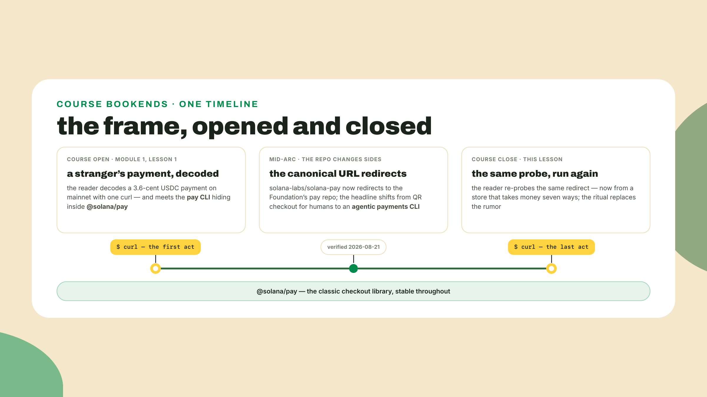
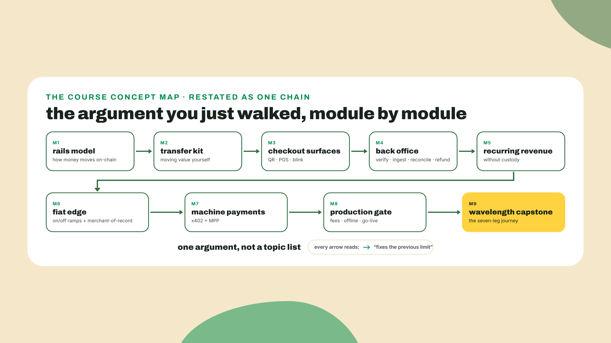
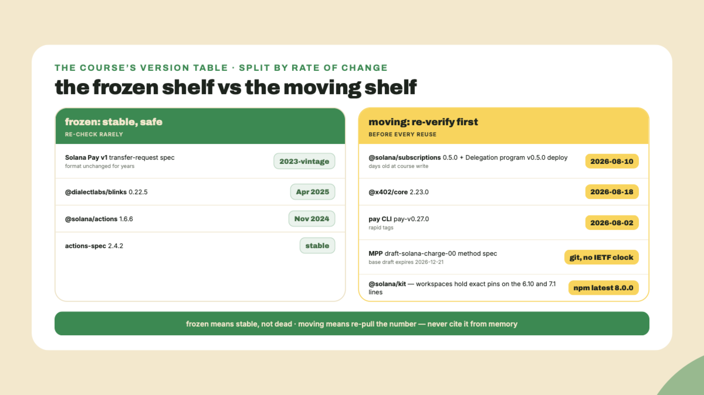
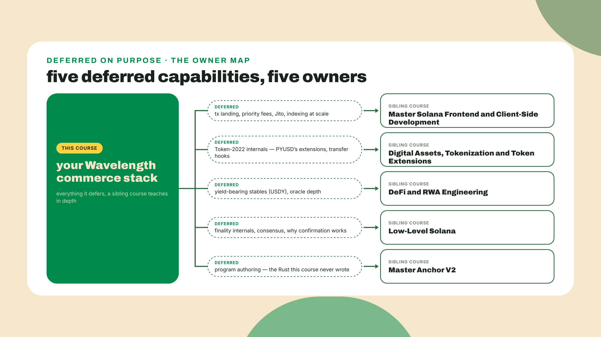
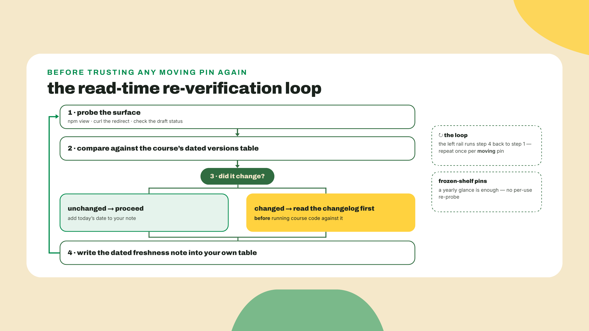

# Where the rails go from here

## Summary

Last lesson you wired every rung into one workspace and watched a full seven-leg buyer journey pass on devnet, with the verifier asserting each leg as it landed. The store is open for business. Which means this lesson has nothing left to build, and I am not going to pretend otherwise. No new API, no new rung. What you get instead is the thing every course owes you at the end and most never deliver: an honest map of where you are standing, dated, with the moving parts marked as moving. We will walk the concept map one last time, draw a hard line through the version table between what is frozen and what is still in motion, name the sibling courses that own the depth this one deliberately deferred, and close the frame we opened in the very first lesson. There is still one thing to do with your terminal, and it comes first.

## The map with a date on it

Run this. It is the last command this course will ever ask of you first:

```bash
curl -sI https://github.com/solana-labs/solana-pay | grep -i '^location'
# location: https://github.com/solana-foundation/pay
```

That 301 is where you came in. Module one opened with you decoding a stranger's 3.6-cent dollar on mainnet, and a few minutes later you met the repo behind `@solana/pay` and learned its story: the canonical Solana Pay repository, once the home of QR checkout for humans, now redirects to a Foundation repo named simply `pay`, whose headline product is an agentic payments CLI. Run `npm i @solana/pay` in a scratch folder today — local, as always; module one's ban on `-g` still stands — and you install that CLI binary alongside the checkout library (redirect and README verified 2026-08-21, and the redirect above just re-verified itself on your machine). The frame this course opened with, the repo that changed sides, is the frame it closes on. That redirect is the whole thesis of this final lesson compressed into one HTTP header: the rails you just built on are alive, and alive means moving.



So before we talk about what moves, look at what you crossed. Nine modules, and they were never a grab bag; they were one argument, each module fixing the limit the previous one exposed. You learned the rails and what no-chargeback does to money. You built the transfer kit every later rung imported. You put checkout in front of humans three ways: QR page, fair stall, blink. You built the back office that trusts no frontend and verifies every payment server-side. You billed on a schedule without custody. You crossed the fiat edge in both directions and learned to ask who is merchant-of-record at every seam. You metered an API for machine buyers over two protocols. You sponsored fees, queued sales offline, and passed a production gate. Then you wired all of it into Wavelength and watched a buyer journey run the length of it.



Every one of those movements shipped against pinned versions, and here is the part that matters now: those pins do not age at the same speed. Some of them are done moving. Some of them were days old when this course was written. Treating those two categories the same is the single most expensive mistake you can carry out of here.

### The frozen shelf and the moving shelf

Take the course's version table and draw one line through it.

On the frozen side sits the Solana Pay v1 spec and the entire blinks stack. The spec page is visibly 2023-vintage; it still name-drops FTX and Slope in its wallet examples, which reads alarming until you understand what it means. The transfer-request URL format has not needed to change, so it has not changed. Your QR checkout from module three runs on a wire format that has been stable for years. Same story one shelf over: `@dialectlabs/blinks` last shipped 0.22.5 in April 2025, `@solana/actions` last shipped 1.6.6 in November 2024, and the actions spec sits at 2.4.2 (all three re-checked against npm on 2026-08-23, unchanged). Sixteen-plus months of silence.

Now the footgun, and it is the exact one this lesson's attached quiz will test you on: frozen does not mean dead. Frozen means stable. A spec that stopped changing because it works is the safest dependency you own; the field names your blink endpoint serves will parse in three years. The instinct you bring from npm culture, where a package untouched for a year smells abandoned, points exactly backwards for protocol surfaces. The Solana Pay URL format and the actions spec are the two things in your stack LEAST likely to break under you. Do not rewrite working checkout code because its spec page names a dead exchange.

The moving shelf is the opposite story, and you should feel the temperature difference. `@solana/subscriptions` was at 0.5.0, published 2026-08-10, and the Delegation program's matching v0.5.0 build was deployed to mainnet the same day, as module five told you at the time: that date is the v0.5.0 deploy, not the program's mainnet debut, and the client your record-of-the-month club bills through was still days old when you learned it. The x402 packages sat at 2.23.0, published 2026-08-18, five days before this course's write date. The `pay` CLI you gated the pressing-price API with tags releases faster than most people read changelogs. And MPP is not even a released standard, in either of its two layers: the base scheme is an IETF Internet-Draft, draft-httpauth-payment-00, which formally expires on 2026-12-21, and the Solana half you gated against, draft-solana-charge-00, is a payment-method spec that is not filed with the IETF at all and moves whenever its repo moves. Everything on this shelf will have moved by the time you hand this stack to a colleague. The only question is how far.

Then there is `@solana/kit`, the one moving piece you already learned to manage. npm's latest tag reads 8.0.0 (checked 2026-08-23), while your workspaces deliberately hold the 6.10 line where `@solana/pay` demands it and the 7.1 line where the subscriptions client does, a per-workspace pin in every package.json (npm wrote them as caret ranges, which hold the major — and the major is what the peer math cares about). That was module five's seam lesson, and notice what it taught you without saying so: a moving dependency is not a threat when you pin per workspace, record why, and never write the word latest into anything. You have been practicing for the moving shelf the whole time.



Which brings us to the second footgun, the one this course has been quietly drilling into you since module one: never cite a moving number from memory. Every macro figure in this course arrived with a source and a date stapled to it. Stablecoin supply was a DefiLlama snapshot with a date, not a fact. The kit version landscape was a dist-tag read with a date. That habit was the lesson. When you quote next quarter's subscriptions client version, or MPP's status, or anything from the moving shelf, you re-pull it at the moment of use or you say you have not. There is no third option that keeps you honest.

### The question that outlives every pin

One thing on your map is neither frozen nor moving, because it is not software. Every module that touched real money ran into the same question in a different form: who is merchant-of-record? At the fiat edge it decided who carries KYC. In acceptance processing it decided who eats compliance. In the x402-versus-MPP bet it was the row that actually separated the standards. Here is the cold version of why it outlives every pin in your table: the regulator does not read your package.json. When money moves and something goes wrong, the question asked in every jurisdiction on earth is who was the merchant, and some named entity will be the answer whether you chose it deliberately or defaulted into it. Protocols will churn under you for the rest of your career. That question will be sitting in the same chair, unchanged, every single time. It is the one piece of this course I can promise will not need re-verification in 2030.

And it pairs with the structural fact that shaped everything else: there are no chargebacks here by construction. That single asymmetry is why your refunds are push payments you originate, why verification is server-side and final, why your dispute posture looks nothing like a card integration's. Fees and speed are features. The missing chargeback is the physics.

### Where the depth lives now

This course made deliberate cuts, and it made them out loud. Each cut has an owner, and since there is no next lesson to defer to, this is where I hand you the actual doors.

Transaction landing under load, the priority-fee science, Jito bundles, compute-budget tuning, and indexing at scale beyond one merchant's webhook: this course gave you the one-box recipe and stopped. The Master Solana Frontend and Client-Side Development course, the one every handoff in these nine modules called Client-Side Mastery for short, owns that whole territory; the durable-nonce sender policies your fair-queue only borrowed sit at that depth. Token-2022 internals, the machinery behind the eight extensions you read on PYUSD's mint in module two, transfer hooks included: that catalog is the Digital Assets, Tokenization and Token Extensions course's territory. Yield-bearing stablecoins like USDY, and real oracle depth beyond display pricing: the DeFi and RWA Engineering course. Why finality works, what confirmed and finalized actually are underneath your confirmation policy, and the consensus rewrite this course flagged as roadmap back in module four: Low-Level Solana. And if watching the Subscriptions program made you want to write programs instead of only calling them, Master Anchor V2 is the program-authoring course this one never was; remember that Wavelength shipped without a single line of Rust.



Beyond the courses, keep a short watchlist of surfaces, because the moving shelf will move and these are where it announces itself. The Foundation pay repo's release tags, for the CLI and the checkout library both. The npm pages for the subscriptions and x402 packages, where a version bump is your signal to re-read a changelog before trusting course code. The x402 ecosystem site, where the acquirer logos tell you which way merchant adoption is leaning; the day a major PSP's logo appears or disappears there is worth more than a quarter of protocol news. The Dialect registry, for whether the blinks rendering story wakes back up. And MPP takes two entries rather than one, because its layers move independently: the IETF datatracker page for the base scheme, `draft-httpauth-payment`, where a `-01` either lands or the expiry arrives first, and the commit log of `tempoxyz/mpp-specs`, which is the only place the `solana/charge` method spec announces a change at all. Six surfaces, still twenty minutes a month, and a calendar reminder beats good intentions here; drift does not announce itself to people who are not looking. That is the entire maintenance cost of staying current on a stack you now understand end to end.

Here is the honest trade-off of this whole course, stated as plainly as I can. Everything you built is a snapshot of a stack that is moving fast, and parts of the snapshot were taken mid-sprint. The pins will rot; some already started. What does not rot is what the pins were teaching. The integration pattern, a server that prices and builds while a client only signs, survived intact from the QR checkout in module three to the agent paying a 402 in module seven, and whatever standard wins the machine-payments war will be one more implementation of that same shape. And the verify-server-side discipline, never trusting a frontend, a webhook, or a wallet's word over the ledger's, is the habit your verifier enforced on every single rung until it stopped feeling like discipline and started feeling like common sense. Those two transfer to stacks that do not exist yet. Read this conclusion as a map with a date on it, not a permanent index. The map's roads outlast its towns.

## Lab: the re-verification ritual

Every earlier lab walked you through something. This one does not, and that is the point of it: the handoff this course has been running since module one, each lesson leaving a little more of the work to you, ends here at full autonomy. The ritual below is what you will run alone, months from now, before reusing any of this stack. Mostly commands, two short writing beats at the end. You own the judgment.



1. Probe the frame itself:

   ```bash
   curl -sI https://github.com/solana-labs/solana-pay | grep -i '^location'
   ```

   Expect the same `location:` header you ran at the top of this lesson. A different target, or no header at all, is the loudest possible signal that the ground moved.

2. Re-pull every moving pin (no installs needed, `npm view` is read-only):

   ```bash
   npm view @solana/pay version
   npm view @solana/subscriptions version time.modified
   npm view @x402/core version
   npm view @solana/kit dist-tags
   ```

   One reading note from lesson one that still applies: `@solana/pay` answers with the npm wrapper's version (1.0.26 at course write), while the shelf card tracks the CLI's own release tag (`pay-v0.27.0`), the binary that wrapper downloads. Two version schemes, one tool, neither wrong; compare each against its own line.

   Expect four answers you cannot predict from here; that unpredictability is the definition of the moving shelf. Carry all four into step 4 rather than judging any of them alone.

3. Prove the frozen shelf is still frozen:

   ```bash
   npm view @dialectlabs/blinks version time.modified
   npm view @solana/actions version time.modified
   ```

   Expect 0.22.5 and 1.6.6, the same two numbers this lesson quoted. If either one moved, the frozen shelf just thawed, and that is the most interesting result this ritual can produce: go read what woke up.

4. Compare each result against the frozen-and-moving shelf card above; that card is the course's versions table, there is no separate file to hunt for. For anything that moved, find and read its changelog before running any course workspace against the new version. Do not upgrade reflexively; decide.

5. Write your own dated freshness table: package, version you observed, date, and one word, `frozen` or `moving`. Commit it to your Wavelength repo beside your gate reports; from now on it, not this lesson, is the table you trust.

Checkpoint: your repo contains a versions table dated today, in your own hand, with every moving pin re-observed and every drift annotated. I ran this exact ritual on 2026-08-23 while writing this close: the frozen shelf held exactly, and the moving shelf showed precisely the drift this lesson already narrates, npm's kit latest sitting two majors past our pins, which is a moving shelf doing what moving shelves do. Yours is the next observation.

## Challenge

Build your where-next plan, and make it concrete enough to act on. Five rows, three columns: the capability this course deferred, the sibling course that owns it, and the one ecosystem surface you will personally track for it. The five capabilities are fixed: transaction landing, Token-2022 internals, yield-bearing stables, finality internals, and program authoring. The course names are in this lesson. The surfaces are yours to choose, and choosing them is the exercise; a surface you will not actually check is a wrong answer even if it is technically relevant. Then add a sixth row for the thing you personally most want to go deeper on, whether or not any course owns it. Accept when: five rows accurate, five surfaces you can name a check-in cadence for, and the sixth row scares you a little.

## The last checkpoint

If the ritual surfaced drift, that is not a defect in the course; it is the course working. A moved pin plus your dated note plus a changelog read is precisely the posture this stack demands, and it is a posture most working integrators never develop. If something in the drift breaks a course workspace and the changelog does not explain it, you have a verifier that asserts every leg of a buyer journey; point it at the breakage and let it tell you which rung moved. That harness was always the real deliverable.

Nine modules ago you pulled a stranger's 3.6-cent payment off mainnet with one line of curl and no permission. Today a store you built takes money seven different ways, verifies every cent server-side, bills without custody, sells to machines, and survives the fair with no signal. Between those two points, the ecosystem's own front door changed sides, and you watched it happen with a redirect probe instead of a rumor. That is the whole skill, honestly. Not the pins. The habit of checking, dating, and building anyway on rails that refuse to hold still.

There is no next lesson. There is a map in your repo with today's date on it, five doors with course names on them, and a store that is open. Where the rails go from here is partly a question about protocols, and this lesson gave you the honest answer: some are frozen, some are moving, re-pull before you trust. But mostly it is a question about you, and that one you just answered in the sixth row of a table. Go build the thing that scared you a little. Happy selling.
